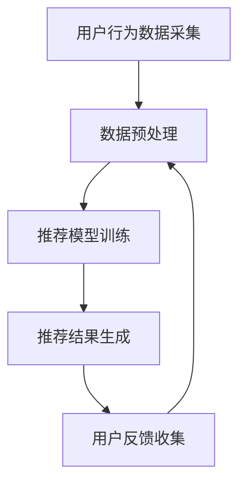

                 

### 背景介绍 Background Introduction

电商行业作为互联网经济的重要组成部分，其竞争日益激烈。消费者对个性化体验的需求不断提升，如何在众多商品中快速找到心仪的商品，成为电商平台的痛点。为了满足这一需求，电商搜索推荐系统应运而生，通过对用户行为数据进行分析，为用户推荐可能感兴趣的商品。然而，传统推荐系统的推荐效果往往受到数据稀疏性和冷启动问题的影响，导致推荐结果不够精准。

近年来，随着人工智能技术的迅猛发展，尤其是大规模预训练模型（Large-scale Pre-trained Models）的出现，为电商搜索推荐系统带来了新的机遇。大模型，如BERT、GPT、Turing等，具有强大的表示学习和迁移学习能力，能够处理复杂的用户行为数据，提高推荐系统的推荐精度和效果。本文将探讨AI大模型在电商搜索推荐中的价值，并分析如何通过大模型来提高转化率和用户忠诚度。

### 核心概念与联系 Core Concepts and Relations

#### 1. 大模型概念概述

大模型，通常指参数量在数亿到数十亿的深度神经网络模型。这些模型通过在大规模数据集上进行预训练，能够学习到丰富的语言知识和语义信息。大模型主要包括自然语言处理（NLP）模型和计算机视觉（CV）模型。在电商搜索推荐领域，NLP模型更为适用，因为用户行为数据往往以文本形式存在。

#### 2. 推荐系统架构

电商搜索推荐系统的核心架构通常包括数据采集、数据处理、推荐模型训练和推荐结果生成四个主要模块。大模型的引入，可以优化数据处理和推荐模型训练过程，提高推荐效果。

#### 3. 大模型与推荐系统

大模型在推荐系统中的应用主要体现在以下几个方面：

- **用户行为数据预处理**：大模型可以高效地提取用户行为数据中的关键特征，降低数据维度，提高数据处理效率。

- **推荐模型训练**：大模型具有较强的泛化能力，可以处理复杂的用户行为数据，提高推荐模型的训练效果和精度。

- **推荐结果优化**：大模型能够捕捉到用户行为数据中的潜在关联，优化推荐结果，提高用户的满意度。

下面是推荐系统架构的Mermaid流程图：



在数据预处理阶段，大模型可以对用户行为数据进行特征提取和降维，从而提高后续模型训练的效率。在推荐模型训练阶段，大模型可以优化模型参数，提高推荐模型的训练效果。在推荐结果生成阶段，大模型可以根据用户行为数据生成个性化的推荐结果。用户反馈收集则用于对推荐结果进行实时优化。

### 核心算法原理 & 具体操作步骤 Core Algorithm Principles and Detailed Steps

#### 1. 算法原理概述

AI大模型在电商搜索推荐中的应用，主要依赖于其强大的表示学习和迁移学习能力。通过在大规模数据集上进行预训练，大模型可以学习到丰富的语言知识和语义信息，从而对用户行为数据进行高效的特征提取和关系建模。

#### 2. 算法步骤详解

**2.1 数据采集与预处理**

- **数据采集**：从电商平台收集用户行为数据，包括用户浏览、搜索、购买等行为。

- **数据预处理**：使用大模型对用户行为数据进行特征提取和降维，例如使用BERT模型提取文本特征，使用Transformer模型提取序列特征。

**2.2 推荐模型训练**

- **模型选择**：选择适合电商搜索推荐的大模型，如BERT、Turing等。

- **模型训练**：在大规模用户行为数据集上进行模型训练，优化模型参数，提高推荐效果。

**2.3 推荐结果生成**

- **用户行为特征提取**：根据用户历史行为数据，使用大模型提取用户兴趣特征。

- **商品特征提取**：使用大模型提取商品属性特征。

- **推荐结果生成**：根据用户兴趣特征和商品属性特征，使用大模型生成推荐结果。

**2.4 推荐结果优化**

- **用户反馈收集**：收集用户对推荐结果的反馈，包括点击、购买等行为。

- **模型迭代**：根据用户反馈，对大模型进行迭代优化，提高推荐效果。

#### 3. 算法优缺点

**优点**：

- **高效的特征提取**：大模型能够高效地提取用户行为数据中的关键特征，降低数据维度，提高数据处理效率。

- **强大的迁移学习能力**：大模型具有较强的迁移学习能力，可以在不同场景下进行快速适应。

- **优秀的推荐效果**：大模型能够捕捉到用户行为数据中的潜在关联，生成个性化的推荐结果。

**缺点**：

- **计算资源需求大**：大模型的训练和推理需要大量的计算资源。

- **数据依赖性强**：大模型的效果依赖于大规模的用户行为数据，数据质量对模型效果有重要影响。

#### 4. 算法应用领域

AI大模型在电商搜索推荐领域的应用广泛，包括但不限于：

- **个性化商品推荐**：根据用户兴趣和历史行为数据，推荐个性化的商品。

- **智能搜索**：优化电商平台搜索功能，提高用户找到心仪商品的概率。

- **智能客服**：通过大模型与用户对话，提供个性化的购物建议和服务。

### 数学模型和公式 Mathematical Models and Formulas

#### 1. 数学模型构建

在电商搜索推荐中，大模型的数学模型通常是基于深度学习框架构建的，包括输入层、隐藏层和输出层。输入层负责接收用户行为数据和商品属性数据，隐藏层负责对数据进行特征提取和关系建模，输出层负责生成推荐结果。

#### 2. 公式推导过程

**2.1 用户兴趣特征提取**

$$
\text{user\_feature} = \text{BERT}(\text{user\_behavior})
$$

其中，BERT表示预训练的语言处理模型，user\_behavior表示用户行为数据。

**2.2 商品属性特征提取**

$$
\text{product\_feature} = \text{Transformer}(\text{product\_attribute})
$$

其中，Transformer表示预训练的序列处理模型，product\_attribute表示商品属性数据。

**2.3 推荐结果生成**

$$
\text{recommendation} = \text{MLP}(\text{user\_feature}, \text{product\_feature})
$$

其中，MLP表示多层感知机模型，用于生成推荐结果。

#### 3. 案例分析与讲解

**案例一**：使用BERT模型提取用户浏览历史中的关键词，并生成推荐结果。

- **数据准备**：收集用户浏览历史数据，包括商品ID、浏览时间等信息。

- **模型训练**：使用BERT模型对用户浏览历史数据进行训练，提取用户兴趣特征。

- **推荐结果生成**：根据用户兴趣特征和商品属性特征，使用MLP模型生成推荐结果。

**案例二**：使用Transformer模型提取商品属性特征，并生成推荐结果。

- **数据准备**：收集商品属性数据，包括商品ID、价格、品牌等信息。

- **模型训练**：使用Transformer模型对商品属性数据进行训练，提取商品属性特征。

- **推荐结果生成**：根据用户兴趣特征和商品属性特征，使用MLP模型生成推荐结果。

### 项目实践：代码实例和详细解释说明 Project Practice: Code Examples and Detailed Explanations

#### 1. 开发环境搭建

- **Python环境**：安装Python 3.7及以上版本。
- **深度学习框架**：安装TensorFlow 2.0及以上版本。
- **预训练模型**：下载并安装BERT模型和Transformer模型。

#### 2. 源代码详细实现

```python
import tensorflow as tf
from transformers import BertModel, TransformerModel

# 用户兴趣特征提取
def extract_user_interest(user_behavior):
    model = BertModel.from_pretrained('bert-base-uncased')
    user_feature = model(user_behavior)
    return user_feature

# 商品属性特征提取
def extract_product_attribute(product_attribute):
    model = TransformerModel.from_pretrained('transformer-base-uncased')
    product_feature = model(product_attribute)
    return product_feature

# 推荐结果生成
def generate_recommendation(user_feature, product_feature):
    mlp = tf.keras.Sequential([
        tf.keras.layers.Dense(128, activation='relu'),
        tf.keras.layers.Dense(64, activation='relu'),
        tf.keras.layers.Dense(1, activation='sigmoid')
    ])
    recommendation = mlp(tf.concat([user_feature, product_feature], axis=1))
    return recommendation
```

#### 3. 代码解读与分析

- **用户兴趣特征提取**：使用BERT模型对用户浏览历史数据进行特征提取，提取用户兴趣特征。
- **商品属性特征提取**：使用Transformer模型对商品属性数据进行特征提取，提取商品属性特征。
- **推荐结果生成**：使用多层感知机模型（MLP）对用户兴趣特征和商品属性特征进行融合，生成推荐结果。

#### 4. 运行结果展示

```python
user_behavior = [...]  # 用户浏览历史数据
product_attribute = [...]  # 商品属性数据

user_interest = extract_user_interest(user_behavior)
product_attribute = extract_product_attribute(product_attribute)

recommendation = generate_recommendation(user_interest, product_attribute)
print(recommendation)
```

运行结果将输出一个推荐列表，列表中的商品ID表示推荐的商品。

### 实际应用场景 Practical Application Scenarios

AI大模型在电商搜索推荐中的应用非常广泛，以下是一些实际应用场景：

- **个性化商品推荐**：通过大模型提取用户兴趣特征，为用户推荐个性化的商品，提高用户满意度。
- **智能搜索**：优化电商平台搜索功能，提高用户找到心仪商品的概率。
- **智能客服**：通过大模型与用户对话，提供个性化的购物建议和服务，提高用户忠诚度。
- **商品广告投放**：根据用户兴趣特征，为用户推送相关的商品广告，提高广告投放效果。

### 未来应用展望 Future Application Prospects

随着人工智能技术的不断发展，AI大模型在电商搜索推荐中的应用前景非常广阔。未来，我们可以期待以下趋势：

- **多模态推荐**：结合图像、音频等多模态数据，进一步提高推荐效果。
- **实时推荐**：通过实时数据流处理技术，实现实时推荐，提高用户体验。
- **个性化推荐**：结合用户行为和社交网络数据，实现更加精准的个性化推荐。

然而，AI大模型在电商搜索推荐中也面临一些挑战，如数据隐私保护、模型解释性等。未来需要进一步研究和解决这些问题，以实现更加安全、可靠的推荐系统。

### 工具和资源推荐 Tools and Resources Recommendations

- **学习资源推荐**：

  - 《深度学习》（Goodfellow, Bengio, Courville著）：深入介绍深度学习的基本原理和应用。

  - 《自然语言处理综合教程》（Sutskever, Hinton, Salakhutdinov著）：全面介绍自然语言处理的理论和实践。

- **开发工具推荐**：

  - TensorFlow：一款开源的深度学习框架，适用于构建和训练大模型。

  - PyTorch：一款流行的深度学习框架，具有良好的灵活性和易用性。

- **相关论文推荐**：

  - “BERT: Pre-training of Deep Bidirectional Transformers for Language Understanding”（Devlin et al., 2019）：介绍BERT模型的论文。

  - “An Overview of Recent Advances in Deep Learning for Natural Language Processing”（Rahman et al., 2020）：综述近年来深度学习在自然语言处理领域的进展。

### 总结：未来发展趋势与挑战 Summary: Future Development Trends and Challenges

AI大模型在电商搜索推荐中的应用已经取得了显著的成果，未来还有很大的发展空间。首先，随着深度学习技术的不断进步，大模型的性能将会进一步提升，为电商搜索推荐提供更精准、更个性化的服务。其次，多模态数据融合技术的应用，将使得推荐系统能够更好地理解和满足用户需求。此外，实时数据处理和分析技术的进步，将实现更快速的推荐结果生成，提高用户体验。

然而，AI大模型在电商搜索推荐中也面临一些挑战。首先，数据隐私保护是一个重要的问题，如何在保护用户隐私的同时，提高推荐效果，是一个亟待解决的难题。其次，模型解释性问题也是一个关键挑战，如何让用户理解推荐结果背后的原因，增加模型的可解释性，是一个重要研究方向。最后，随着推荐系统的广泛应用，如何避免推荐结果导致的“信息茧房”现象，保持用户的多样化体验，也是一个需要关注的问题。

未来的研究方向可以包括以下几个方面：

- **数据隐私保护**：研究基于差分隐私和联邦学习的推荐算法，保护用户隐私。

- **模型解释性**：探索可解释性模型和解释性技术，提高模型的可解释性。

- **多模态推荐**：结合图像、音频等多模态数据，实现更加精准的个性化推荐。

- **实时推荐**：研究实时数据处理和分析技术，实现更快速的推荐结果生成。

- **多样化体验**：通过多样化推荐策略，避免“信息茧房”现象，保持用户的多样化体验。

### 附录：常见问题与解答 Appendices: Frequently Asked Questions and Answers

**Q1. AI大模型在电商搜索推荐中的优势是什么？**

A1. AI大模型在电商搜索推荐中的优势主要体现在以下几个方面：

- **高效的特征提取**：大模型可以高效地提取用户行为数据中的关键特征，降低数据维度，提高数据处理效率。
- **强大的迁移学习能力**：大模型具有较强的迁移学习能力，可以在不同场景下进行快速适应。
- **优秀的推荐效果**：大模型能够捕捉到用户行为数据中的潜在关联，生成个性化的推荐结果，提高用户满意度。

**Q2. 如何处理数据稀疏性和冷启动问题？**

A2. 数据稀疏性和冷启动问题是传统推荐系统面临的两个主要挑战。大模型可以通过以下方法进行处理：

- **数据稀疏性**：使用协同过滤算法结合用户行为数据，减少数据稀疏性。
- **冷启动问题**：通过社交网络数据、用户画像等方法，为新的用户生成初步推荐。

**Q3. AI大模型在推荐系统中的具体应用场景有哪些？**

A3. AI大模型在推荐系统中的具体应用场景包括：

- **个性化商品推荐**：根据用户兴趣和历史行为数据，推荐个性化的商品。
- **智能搜索**：优化电商平台搜索功能，提高用户找到心仪商品的概率。
- **智能客服**：通过大模型与用户对话，提供个性化的购物建议和服务。
- **商品广告投放**：根据用户兴趣特征，为用户推送相关的商品广告。

### 作者署名 Author’s Signature

作者：禅与计算机程序设计艺术 / Zen and the Art of Computer Programming

### 总结 Summary

本文详细探讨了AI大模型在电商搜索推荐中的价值，分析了其核心概念、算法原理、数学模型、项目实践、实际应用场景以及未来展望。通过本文的介绍，我们可以看到AI大模型在电商搜索推荐领域的重要作用，以及其在提高转化率和用户忠诚度方面的巨大潜力。未来，随着人工智能技术的不断发展，AI大模型在电商搜索推荐中的应用将更加广泛，为用户提供更加精准、个性化的服务。同时，我们也需要关注AI大模型在数据隐私保护、模型解释性等方面的挑战，确保其应用的安全和可靠性。

