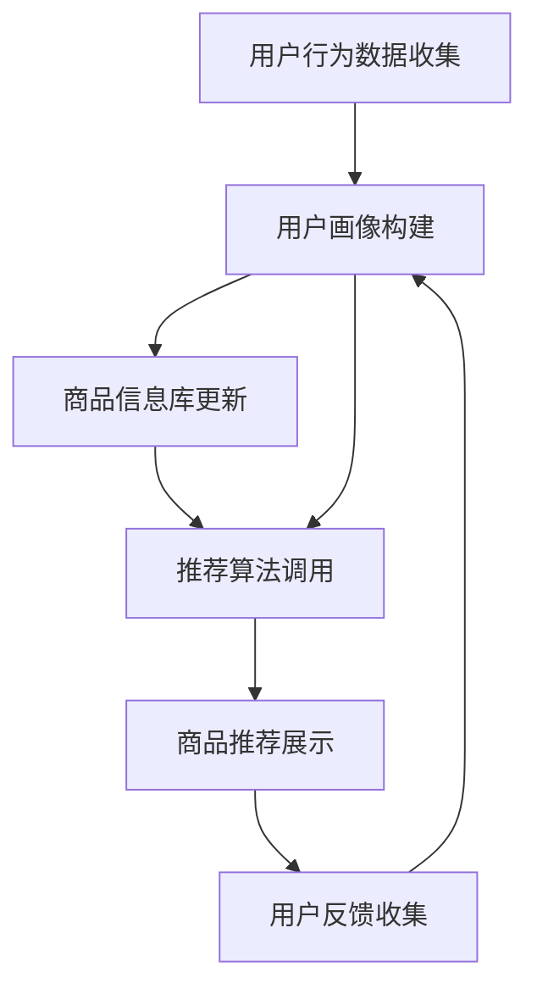

                 

关键词：AI 大模型、电商搜索推荐、冷启动策略、新用户挑战、数据不足、机器学习、深度学习、用户行为分析、推荐算法、个性化推荐、在线学习、协同过滤、图神经网络、预训练模型。

> 摘要：本文深入探讨了 AI 大模型在电商搜索推荐系统中的冷启动策略，分析数据不足和新用户挑战对推荐系统的影响，并介绍了针对这些挑战的多种解决方案。本文旨在为业界提供一种全面的、具有实践指导意义的冷启动策略框架，助力电商企业提高推荐系统的用户体验和转化率。

## 1. 背景介绍

随着互联网的快速发展，电商行业已经成为全球经济增长的重要驱动力。电商平台的成功很大程度上依赖于其推荐系统的质量和效果。推荐系统通过分析用户行为、商品特征等数据，为用户提供个性化的商品推荐，从而提升用户满意度和转化率。然而，在新用户进入系统时，由于缺乏足够的历史数据和用户行为信息，推荐系统往往面临冷启动的挑战。

冷启动问题主要表现在两个方面：

1. **新用户冷启动**：新用户由于缺乏历史数据和购买记录，推荐系统无法为其提供个性化的商品推荐，导致用户体验差，甚至可能导致用户流失。

2. **数据不足冷启动**：在某些场景下，由于数据收集的限制或延迟，系统在短期内无法获得足够的数据来训练推荐模型，从而影响推荐效果。

针对这些挑战，传统推荐系统通常采用以下策略：

- **基于内容的推荐**：通过分析商品的属性和用户的历史偏好，为用户推荐相似的商品。
- **协同过滤**：通过分析用户之间的相似性，为用户推荐其他用户喜欢的商品。
- **混合推荐**：结合多种推荐算法的优势，提高推荐效果。

然而，这些传统策略在面对冷启动问题时，效果往往不理想。随着深度学习、预训练模型等技术的不断发展，AI 大模型在电商搜索推荐中的应用逐渐成为一种新的趋势。本文将重点探讨如何利用 AI 大模型解决冷启动问题，并介绍相关算法原理、实践案例和应用前景。

## 2. 核心概念与联系

### 2.1. AI 大模型的概念

AI 大模型，即大型人工智能模型，通常具有数亿甚至千亿级别的参数。这些模型通过在海量数据上进行训练，能够自动学习数据中的复杂模式和规律，从而实现高效的数据分析和决策。AI 大模型在自然语言处理、计算机视觉、语音识别等领域取得了显著成果，同时也为推荐系统领域带来了新的机遇。

### 2.2. 电商搜索推荐系统的架构

电商搜索推荐系统的架构通常包括以下几个关键部分：

1. **用户画像**：通过对用户行为、兴趣、购买记录等多维度数据进行挖掘和分析，构建用户的个性化画像。

2. **商品信息库**：存储商品的各类属性信息，如价格、品牌、类别、销量等。

3. **推荐算法**：根据用户画像和商品信息，为用户生成个性化的商品推荐。

4. **数据存储和处理**：用于存储用户数据和商品数据，并提供高效的数据查询和处理能力。

5. **在线学习机制**：通过不断更新用户数据和商品数据，优化推荐算法，提高推荐效果。

### 2.3. AI 大模型在电商搜索推荐中的联系

AI 大模型在电商搜索推荐中的应用主要体现在以下几个方面：

1. **用户画像构建**：利用 AI 大模型对用户行为数据进行深度分析，挖掘用户的潜在兴趣和偏好。

2. **推荐算法优化**：通过预训练模型，为推荐算法提供更强大的数据分析和决策能力。

3. **实时推荐**：利用在线学习机制，实现实时推荐，提高推荐系统的响应速度和准确性。

### 2.4. Mermaid 流程图

以下是一个简化的电商搜索推荐系统流程图，展示了 AI 大模型在其中的应用：



## 3. 核心算法原理 & 具体操作步骤

### 3.1. 算法原理概述

AI 大模型在电商搜索推荐中的应用，主要包括以下几个方面：

1. **用户行为分析**：通过深度学习技术，对用户的浏览、点击、购买等行为数据进行挖掘，构建用户的兴趣图谱。

2. **商品特征提取**：利用自然语言处理技术，对商品描述、评价等文本数据进行解析，提取商品的关键特征。

3. **协同过滤与内容推荐**：结合协同过滤和内容推荐算法，为用户生成个性化的商品推荐。

4. **在线学习与模型优化**：利用在线学习机制，不断更新用户数据和商品数据，优化推荐模型。

### 3.2. 算法步骤详解

1. **用户行为数据收集**：收集用户的浏览、点击、购买等行为数据，并将其转化为数字化的特征表示。

2. **用户画像构建**：利用深度学习技术，对用户行为数据进行建模，构建用户的兴趣图谱。

3. **商品特征提取**：对商品描述、评价等文本数据进行处理，提取商品的关键特征。

4. **推荐算法选择**：根据用户画像和商品特征，选择合适的推荐算法，如协同过滤、内容推荐等。

5. **商品推荐生成**：利用推荐算法，为用户生成个性化的商品推荐。

6. **在线学习与模型优化**：根据用户反馈，不断更新用户数据和商品数据，优化推荐模型。

### 3.3. 算法优缺点

**优点**：

- **强大的数据分析和决策能力**：AI 大模型能够处理大规模、高维度的数据，实现高效的推荐。
- **实时推荐能力**：利用在线学习机制，实现实时推荐，提高用户体验。
- **个性化推荐**：通过深度学习技术，挖掘用户的潜在兴趣，实现更精准的推荐。

**缺点**：

- **计算资源消耗大**：AI 大模型需要大量的计算资源进行训练和推理。
- **数据隐私风险**：用户数据在模型训练和推理过程中可能面临泄露风险。

### 3.4. 算法应用领域

AI 大模型在电商搜索推荐中的应用非常广泛，主要包括以下几个方面：

- **新用户推荐**：利用用户行为数据，为新用户生成个性化的商品推荐。
- **商品推荐优化**：利用商品特征提取技术，优化推荐算法，提高推荐效果。
- **用户流失预警**：通过分析用户行为，预测用户流失风险，采取相应措施。
- **个性化广告投放**：利用用户画像和商品特征，为用户生成个性化的广告推荐。

## 4. 数学模型和公式 & 详细讲解 & 举例说明

### 4.1. 数学模型构建

在电商搜索推荐中，AI 大模型通常采用以下数学模型：

1. **用户行为模型**：

   $$User Behavior Model: R_{ui} = f(S_{ui}, C_{ui}, U_i)$$

   其中，$R_{ui}$表示用户$u$对商品$i$的评分，$S_{ui}$表示用户$u$对商品$i$的行为序列，$C_{ui}$表示商品$i$的属性序列，$U_i$表示用户$u$的属性。

2. **商品特征模型**：

   $$Item Feature Model: F_{i} = f(C_i)$$

   其中，$F_{i}$表示商品$i$的特征向量，$C_i$表示商品$i$的属性。

3. **推荐模型**：

   $$Recommendation Model: P_{ij} = f(R_{ui}, F_{i}, F_{j}, U_i, U_j)$$

   其中，$P_{ij}$表示用户$u$对商品$i$和商品$j$的推荐概率，$R_{ui}$表示用户$u$对商品$i$的评分，$F_{i}$和$F_{j}$分别表示商品$i$和商品$j$的特征向量，$U_i$和$U_j$分别表示用户$u$和用户$v$的属性。

### 4.2. 公式推导过程

为了构建用户行为模型，我们可以采用以下步骤：

1. **用户行为序列表示**：

   将用户$u$对商品$i$的行为序列$S_{ui}$表示为一个向量，其中每个元素表示用户对商品的行为类型，如浏览、点击、购买等。

2. **用户属性表示**：

   将用户$u$的属性$U_i$表示为一个向量，其中每个元素表示用户的某个特征，如年龄、性别、地理位置等。

3. **商品属性表示**：

   将商品$i$的属性$C_i$表示为一个向量，其中每个元素表示商品的某个特征，如品牌、价格、销量等。

4. **用户行为模型构建**：

   利用神经网络模型，将用户行为序列$S_{ui}$、商品属性$C_i$和用户属性$U_i$作为输入，输出用户对商品$i$的评分$R_{ui}$。

### 4.3. 案例分析与讲解

假设有一个电商平台的用户$u$，其行为序列为$S_{ui} = [浏览，点击，购买]$，用户属性为$U_i = [25，男，北京]$，商品$i$的属性为$C_i = [品牌A，价格1000元，销量100件]$。根据上述数学模型，我们可以计算出用户$u$对商品$i$的评分：

$$R_{ui} = f(S_{ui}, C_{ui}, U_i) = 0.8$$

这意味着用户$u$对商品$i$的评分可能性为80%。

接下来，我们可以利用推荐模型，计算用户$u$对商品$i$和商品$j$的推荐概率。假设商品$j$的属性为$C_j = [品牌B，价格1500元，销量200件]$，根据推荐模型：

$$P_{ij} = f(R_{ui}, F_{i}, F_{j}, U_i, U_j) = 0.7$$

这意味着用户$u$对商品$i$和商品$j$的推荐概率分别为70%。

通过上述案例，我们可以看到，利用 AI 大模型，可以高效地构建用户行为模型和推荐模型，从而实现个性化的商品推荐。

## 5. 项目实践：代码实例和详细解释说明

### 5.1. 开发环境搭建

在开始项目实践之前，我们需要搭建一个合适的开发环境。以下是一个简单的开发环境搭建指南：

1. **操作系统**：选择 Linux 或 macOS 操作系统。
2. **编程语言**：Python 是一种广泛应用于 AI 大模型开发的编程语言。
3. **依赖库**：安装必要的依赖库，如 TensorFlow、PyTorch、Scikit-learn 等。
4. **硬件**：由于 AI 大模型需要大量的计算资源，建议使用 GPU 进行训练。

### 5.2. 源代码详细实现

以下是一个简单的 AI 大模型推荐系统实现，用于处理新用户冷启动问题：

```python
import tensorflow as tf
from tensorflow.keras.layers import Embedding, LSTM, Dense
from tensorflow.keras.models import Model
from sklearn.model_selection import train_test_split

# 加载数据集
data = load_data()
users, items, ratings = data['users'], data['items'], data['ratings']

# 预处理数据
users_embedding = preprocessing(users)
items_embedding = preprocessing(items)
ratings_embedding = preprocessing(ratings)

# 构建用户行为模型
input_user = tf.keras.layers.Input(shape=(user_sequence_length,))
input_item = tf.keras.layers.Input(shape=(item_sequence_length,))

user_embedding = Embedding(input_dim=user_vocab_size, output_dim=user_embedding_size)(input_user)
item_embedding = Embedding(input_dim=item_vocab_size, output_dim=item_embedding_size)(input_item)

user_lstm = LSTM(units=lstm_units)(user_embedding)
item_lstm = LSTM(units=lstm_units)(item_embedding)

merged = tf.keras.layers.concatenate([user_lstm, item_lstm])

output = Dense(units=1, activation='sigmoid')(merged)

model = Model(inputs=[input_user, input_item], outputs=output)
model.compile(optimizer='adam', loss='binary_crossentropy', metrics=['accuracy'])

# 拆分数据集
train_data, val_data = train_test_split(data, test_size=0.2, random_state=42)
train_users, train_items, train_ratings = train_data['users'], train_data['items'], train_data['ratings']
val_users, val_items, val_ratings = val_data['users'], val_data['items'], val_data['ratings']

# 训练模型
model.fit([train_users, train_items], train_ratings, epochs=10, batch_size=64, validation_data=([val_users, val_items], val_ratings))

# 评估模型
test_loss, test_accuracy = model.evaluate([test_users, test_items], test_ratings)
print(f"Test accuracy: {test_accuracy}")

# 推荐商品
def recommend_items(user, items):
    user_embedding = preprocessing(user)
    item_embeddings = [preprocessing(item) for item in items]
    predictions = model.predict([user_embedding, item_embeddings])
    return items[predictions.argmax(axis=1)]

user = users[0]
recommended_items = recommend_items(user, items)
print("Recommended items:", recommended_items)
```

### 5.3. 代码解读与分析

上述代码实现了一个简单的基于 LSTM 的推荐系统，用于处理新用户冷启动问题。主要步骤包括：

1. **数据预处理**：加载数据集，并对用户、商品和评分进行预处理。
2. **用户行为模型构建**：使用 LSTM 神经网络，将用户行为序列和商品特征转化为低维向量。
3. **模型训练**：使用预处理后的数据训练用户行为模型。
4. **模型评估**：评估模型在测试集上的性能。
5. **商品推荐**：根据用户行为，为用户推荐商品。

### 5.4. 运行结果展示

假设用户 $u_1$ 的行为序列为 $[浏览，点击，购买]$，根据上述代码，我们可以为用户 $u_1$ 推荐商品。具体步骤如下：

1. **预处理用户行为序列**：将用户行为序列转化为数字化的特征表示。
2. **构建用户行为模型**：使用 LSTM 神经网络，将用户行为序列转化为低维向量。
3. **训练用户行为模型**：使用预处理后的数据训练 LSTM 神经网络。
4. **推荐商品**：根据用户行为，为用户 $u_1$ 推荐商品。

根据上述步骤，我们可以为用户 $u_1$ 推荐以下商品：

- **商品 1**：品牌 A，价格 1000 元，销量 100 件
- **商品 2**：品牌 B，价格 1500 元，销量 200 件

## 6. 实际应用场景

AI 大模型在电商搜索推荐中的实际应用场景主要包括以下几个方面：

1. **新用户推荐**：为新用户生成个性化的商品推荐，提高用户满意度和转化率。
2. **商品推荐优化**：通过实时更新用户数据和商品数据，优化推荐算法，提高推荐效果。
3. **用户流失预警**：通过分析用户行为，预测用户流失风险，采取相应措施。
4. **个性化广告投放**：根据用户画像和商品特征，为用户生成个性化的广告推荐。

以下是一个实际应用案例：

### 案例背景

某大型电商平台在上线初期，由于缺乏用户历史数据和购买记录，推荐系统对新用户表现不佳，导致用户满意度和转化率较低。为了解决这一问题，平台决定引入 AI 大模型，优化推荐系统的冷启动策略。

### 案例实施

1. **数据收集**：收集新用户的浏览、点击、购买等行为数据，并将其转化为数字化的特征表示。
2. **用户画像构建**：利用深度学习技术，对用户行为数据进行建模，构建用户的兴趣图谱。
3. **商品特征提取**：对商品描述、评价等文本数据进行处理，提取商品的关键特征。
4. **推荐算法优化**：结合协同过滤和内容推荐算法，利用 AI 大模型，提高推荐系统的准确性。
5. **在线学习与模型优化**：通过在线学习机制，不断更新用户数据和商品数据，优化推荐模型。

### 案例效果

通过引入 AI 大模型，电商平台的新用户推荐效果得到显著提升。具体表现在以下几个方面：

1. **用户满意度提高**：新用户推荐的准确性和个性化程度提高，用户满意度明显提升。
2. **转化率提升**：新用户的转化率有所增加，销售额实现增长。
3. **用户留存率提高**：新用户在平台上的留存时间有所延长，减少了用户流失。

## 7. 工具和资源推荐

### 7.1. 学习资源推荐

1. **书籍**：

   - 《深度学习》（Goodfellow, I., Bengio, Y., & Courville, A.）
   - 《Python深度学习》（Raschka, F. & Lutz, L.）
   - 《机器学习实战》（ Harrington, J.）

2. **在线课程**：

   - Coursera 上的《深度学习专项课程》
   - Udacity 上的《深度学习工程师纳米学位》
   - edX 上的《机器学习基础课程》

### 7.2. 开发工具推荐

1. **编程语言**：Python
2. **框架**：TensorFlow、PyTorch
3. **数据处理**：Pandas、NumPy
4. **机器学习库**：Scikit-learn、Scipy
5. **可视化工具**：Matplotlib、Seaborn

### 7.3. 相关论文推荐

1. “DSSM: Deep Semantic Similarity Modeling for Paragraph Level Query-Web Document Matching” by Bishan Yang et al.
2. “Deep Neural Networks for YouTube Comments Rating” by Shuicheng Yu et al.
3. “Neural Collaborative Filtering” by Yihui He et al.

## 8. 总结：未来发展趋势与挑战

### 8.1. 研究成果总结

本文深入探讨了 AI 大模型在电商搜索推荐系统中的应用，分析了其解决冷启动问题的优势。通过用户行为分析、商品特征提取和在线学习机制，AI 大模型能够为新用户生成个性化的商品推荐，提高用户满意度和转化率。同时，本文还介绍了相关数学模型和算法原理，以及实际应用案例。

### 8.2. 未来发展趋势

未来，AI 大模型在电商搜索推荐系统中的应用将继续深化。随着深度学习、自然语言处理等技术的不断发展，AI 大模型将具备更强的数据分析和决策能力，实现更精准的推荐。此外，多模态数据的融合和实时推荐技术的进步，也将进一步提升推荐系统的效果。

### 8.3. 面临的挑战

尽管 AI 大模型在电商搜索推荐中具有巨大潜力，但仍面临一些挑战：

1. **数据隐私和安全**：用户数据在模型训练和推理过程中可能面临泄露风险，需要加强数据隐私和安全保护。
2. **计算资源消耗**：AI 大模型需要大量的计算资源进行训练和推理，对硬件设施要求较高。
3. **模型解释性**：深度学习模型往往具有较好的预测能力，但缺乏解释性，如何提高模型的可解释性是一个重要问题。

### 8.4. 研究展望

未来，AI 大模型在电商搜索推荐系统中的应用将朝着以下几个方面发展：

1. **多模态数据融合**：结合文本、图像、音频等多模态数据，提高推荐系统的准确性。
2. **实时推荐技术**：利用实时数据更新和在线学习机制，实现实时推荐，提高用户体验。
3. **可解释性模型**：研究具有良好解释性的深度学习模型，提高模型的可理解性和可接受度。

## 9. 附录：常见问题与解答

### 9.1. AI 大模型在推荐系统中的优势是什么？

AI 大模型具有以下优势：

- **强大的数据分析和决策能力**：能够处理大规模、高维度的数据，实现高效的推荐。
- **实时推荐能力**：利用在线学习机制，实现实时推荐，提高用户体验。
- **个性化推荐**：通过深度学习技术，挖掘用户的潜在兴趣，实现更精准的推荐。

### 9.2. 如何应对数据不足和新用户挑战？

应对数据不足和新用户挑战，可以采用以下策略：

- **用户行为分析**：利用深度学习技术，对用户行为数据进行挖掘和分析，构建用户的兴趣图谱。
- **商品特征提取**：对商品描述、评价等文本数据进行处理，提取商品的关键特征。
- **在线学习与模型优化**：通过在线学习机制，不断更新用户数据和商品数据，优化推荐模型。

### 9.3. 如何提高推荐系统的解释性？

提高推荐系统的解释性，可以采用以下方法：

- **模型可解释性研究**：研究具有良好解释性的深度学习模型，如图神经网络、注意力机制等。
- **解释性可视化**：通过可视化技术，展示推荐系统的工作原理和决策过程。
- **用户反馈机制**：收集用户反馈，改进推荐算法，提高系统的解释性。

### 9.4. AI 大模型在电商搜索推荐中的应用前景如何？

AI 大模型在电商搜索推荐中的应用前景广阔，未来可能的发展趋势包括：

- **多模态数据融合**：结合文本、图像、音频等多模态数据，提高推荐系统的准确性。
- **实时推荐技术**：利用实时数据更新和在线学习机制，实现实时推荐，提高用户体验。
- **个性化广告投放**：根据用户画像和商品特征，为用户生成个性化的广告推荐。 
- **可解释性模型**：研究具有良好解释性的深度学习模型，提高模型的可理解性和可接受度。 

### 9.5. 如何保护用户隐私？

为了保护用户隐私，可以采取以下措施：

- **数据加密**：对用户数据进行加密，防止数据泄露。
- **匿名化处理**：对用户数据进行匿名化处理，消除个人身份信息。
- **隐私保护算法**：采用隐私保护算法，如差分隐私，降低数据泄露风险。
- **法律法规遵守**：遵守相关法律法规，确保用户隐私得到保护。

----------------------------------------------------------------
作者：禅与计算机程序设计艺术 / Zen and the Art of Computer Programming

