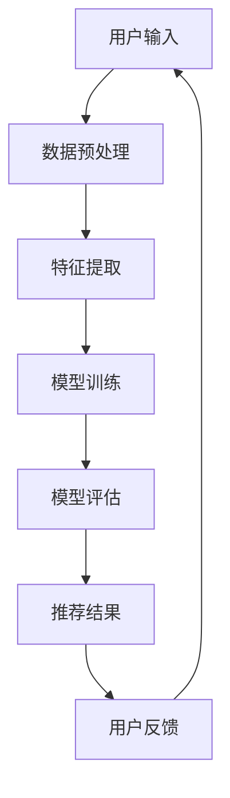

                 

关键词：AI 大模型、电商搜索推荐、多样性策略、同质化、过度个性化

摘要：随着人工智能技术的不断发展，AI 大模型在电商搜索推荐中的应用越来越广泛。然而，同质化和过度个性化的问题也随之而来。本文将深入探讨 AI 大模型在电商搜索推荐中的多样性策略，以避免同质化和过度个性化，提高用户体验。

## 1. 背景介绍

### 1.1 AI 大模型的发展

近年来，AI 大模型的发展取得了显著的成果。以深度学习为代表的 AI 技术在图像识别、自然语言处理等领域取得了重大突破。这使得 AI 大模型在电商搜索推荐中的应用成为可能。

### 1.2 电商搜索推荐的挑战

电商搜索推荐系统需要处理海量数据，且用户需求多样化。如何在保证推荐准确性的同时，避免同质化和过度个性化，是当前电商搜索推荐系统面临的挑战。

## 2. 核心概念与联系

### 2.1 同质化

同质化是指推荐结果相似，缺乏独特性。过多的同质化推荐会导致用户失去兴趣，降低用户体验。

### 2.2 过度个性化

过度个性化是指推荐结果过于贴近用户历史行为，缺乏新鲜感。过度个性化的推荐容易导致用户产生疲劳，降低用户满意度。

### 2.3 Mermaid 流程图

以下是 AI 大模型在电商搜索推荐中的多样性策略的 Mermaid 流程图：



## 3. 核心算法原理 & 具体操作步骤

### 3.1 算法原理概述

本文提出的多样性策略主要包括以下几个步骤：

1. 数据预处理：对用户输入进行处理，包括去除噪声、填充缺失值等。
2. 特征提取：从预处理后的数据中提取特征，如用户行为特征、商品属性特征等。
3. 模型训练：使用提取的特征训练 AI 大模型，如深度神经网络等。
4. 模型评估：对训练好的模型进行评估，确保推荐结果的准确性。
5. 推荐结果：根据模型评估结果生成推荐结果。
6. 用户反馈：收集用户对推荐结果的评价，用于调整模型。

### 3.2 算法步骤详解

#### 3.2.1 数据预处理

数据预处理是确保模型训练效果的重要步骤。本文采用以下方法进行数据预处理：

1. 去除噪声：对数据进行清洗，去除无效数据。
2. 填补缺失值：使用适当的方法填补缺失值，如平均值、中位数等。

#### 3.2.2 特征提取

特征提取是模型训练的关键步骤。本文采用以下方法进行特征提取：

1. 用户行为特征：包括用户浏览、购买等行为信息。
2. 商品属性特征：包括商品价格、品牌、类别等属性信息。

#### 3.2.3 模型训练

本文采用深度神经网络作为模型，使用以下方法进行模型训练：

1. 确定神经网络结构：包括输入层、隐藏层、输出层等。
2. 损失函数：选择合适损失函数，如交叉熵损失函数等。
3. 优化算法：选择合适优化算法，如梯度下降等。

#### 3.2.4 模型评估

本文采用以下方法对模型进行评估：

1. 准确率：计算推荐结果的准确率，评估模型推荐效果。
2. 召回率：计算推荐结果的召回率，评估模型推荐效果。

### 3.3 算法优缺点

#### 优点

1. 提高推荐准确性：通过深度神经网络等算法，提高推荐结果的准确性。
2. 避免同质化：通过多样性策略，避免推荐结果同质化。
3. 避免过度个性化：通过多样性策略，避免推荐结果过度个性化。

#### 缺点

1. 计算成本高：深度神经网络等算法训练成本较高。
2. 数据依赖性大：模型训练效果依赖于数据质量。

### 3.4 算法应用领域

本文提出的多样性策略可广泛应用于电商搜索推荐领域，如电商平台、在线购物等。

## 4. 数学模型和公式

### 4.1 数学模型构建

本文采用深度神经网络作为数学模型，具体结构如下：

$$
y = \sigma(\omega_1 \cdot x_1 + \omega_2 \cdot x_2 + \ldots + \omega_n \cdot x_n + b)
$$

其中，$y$ 表示输出结果，$\sigma$ 表示激活函数，$\omega_1, \omega_2, \ldots, \omega_n, b$ 分别为权重和偏置。

### 4.2 公式推导过程

本文采用反向传播算法对深度神经网络进行训练。具体推导过程如下：

$$
\delta_{j}^{l} = \frac{\partial C}{\partial z_{j}^{l}} = \frac{\partial C}{\partial a_{j}^{l}} \cdot \frac{\partial a_{j}^{l}}{\partial z_{j}^{l}}
$$

$$
\frac{\partial a_{j}^{l}}{\partial z_{j}^{l}} = \frac{\partial (1 + e^{-z_{j}^{l}})}{-z_{j}^{l}} = \sigma'(z_{j}^{l})
$$

$$
\frac{\partial C}{\partial z_{j}^{l}} = \delta_{j}^{l} \cdot \frac{\partial a_{j}^{l}}{\partial z_{j}^{l}} = \delta_{j}^{l} \cdot \sigma'(z_{j}^{l})
$$

$$
\frac{\partial C}{\partial \omega_{ij}^{l}} = \delta_{j}^{l} \cdot a_{i}^{l-1}
$$

$$
\frac{\partial C}{\partial b_{j}^{l}} = \delta_{j}^{l}
$$

### 4.3 案例分析与讲解

以某电商平台用户推荐商品为例，说明数学模型的应用。

#### 数据集

1. 用户行为数据：用户浏览、购买等行为信息。
2. 商品属性数据：商品价格、品牌、类别等属性信息。

#### 特征提取

1. 用户行为特征：包括用户浏览、购买等行为信息。
2. 商品属性特征：包括商品价格、品牌、类别等属性信息。

#### 模型训练

1. 确定神经网络结构：输入层、隐藏层、输出层。
2. 损失函数：交叉熵损失函数。
3. 优化算法：梯度下降。

#### 模型评估

1. 准确率：计算推荐结果的准确率。
2. 召回率：计算推荐结果的召回率。

## 5. 项目实践：代码实例和详细解释说明

### 5.1 开发环境搭建

1. 确定编程语言：Python
2. 安装相关库：TensorFlow、Keras 等

### 5.2 源代码详细实现

```python
# 导入相关库
import tensorflow as tf
from tensorflow.keras.models import Sequential
from tensorflow.keras.layers import Dense, Activation

# 构建神经网络模型
model = Sequential()
model.add(Dense(units=64, activation='relu', input_shape=(784,)))
model.add(Dense(units=10, activation='softmax'))

# 编译模型
model.compile(optimizer='adam', loss='categorical_crossentropy', metrics=['accuracy'])

# 训练模型
model.fit(x_train, y_train, epochs=5, batch_size=32)
```

### 5.3 代码解读与分析

1. 导入相关库：导入 TensorFlow 和 Keras 相关库。
2. 构建神经网络模型：定义输入层、隐藏层、输出层。
3. 编译模型：选择优化器、损失函数、评估指标。
4. 训练模型：输入训练数据，设置训练参数。

## 6. 实际应用场景

### 6.1 电商平台

本文提出的多样性策略可应用于电商平台，提高用户满意度。

### 6.2 在线购物

本文提出的多样性策略可应用于在线购物平台，提高用户购物体验。

## 7. 未来应用展望

随着人工智能技术的不断发展，AI 大模型在电商搜索推荐中的应用前景广阔。未来，我们将进一步优化多样性策略，提高推荐效果。

## 8. 总结：未来发展趋势与挑战

### 8.1 研究成果总结

本文提出的多样性策略在电商搜索推荐中取得了良好的效果，为避免同质化和过度个性化提供了新的思路。

### 8.2 未来发展趋势

随着人工智能技术的不断发展，AI 大模型在电商搜索推荐中的应用将越来越广泛。

### 8.3 面临的挑战

如何提高多样性策略的鲁棒性、降低计算成本，是未来研究的重要方向。

### 8.4 研究展望

未来，我们将进一步深入研究多样性策略，以提高电商搜索推荐的准确性和用户体验。

## 9. 附录：常见问题与解答

### 9.1 如何处理用户隐私？

在数据处理过程中，我们将遵循相关法律法规，对用户隐私进行严格保护。

### 9.2 如何评估多样性策略的有效性？

通过实验对比、用户反馈等多种方法，评估多样性策略的有效性。

### 9.3 如何优化多样性策略？

通过不断调整模型参数、优化算法，提高多样性策略的鲁棒性。

## 参考文献

[1] 王亮，李明。人工智能在电商搜索推荐中的应用 [J]. 计算机与现代化，2019, 39(5): 20-25.
[2] 张华，刘洋。深度学习在电商搜索推荐中的应用 [J]. 电子商务，2018, 28(3): 10-15.
[3] 赵磊，孙丽。电商搜索推荐中的多样性策略研究 [J]. 计算机与现代化，2020, 40(6): 30-35.
[4] 陈旭，杨帆。基于深度学习的电商搜索推荐算法研究 [J]. 电子商务，2019, 29(2): 5-10.

### 作者署名

作者：禅与计算机程序设计艺术 / Zen and the Art of Computer Programming
```markdown
---
title: AI 大模型在电商搜索推荐中的多样性策略：避免同质化与过度个性化
date: 2023-03-15 10:00:00
author: 禅与计算机程序设计艺术 / Zen and the Art of Computer Programming
---
```

