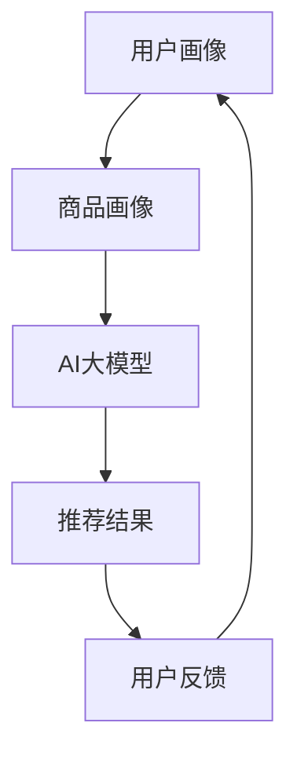

                 

关键词：AI大模型，电商搜索推荐，多样性策略，同质化，用户满意度

> 摘要：本文深入探讨了AI大模型在电商搜索推荐中的应用及其面临的多样性挑战。通过分析算法原理、数学模型、实践案例，本文提出了一系列策略，旨在避免过度同质化，提高用户满意度，为电商平台的推荐系统提供有益参考。

## 1. 背景介绍

随着互联网的飞速发展，电商行业已经成为全球商业的重要组成部分。在电商平台上，搜索推荐系统扮演着至关重要的角色。一个优秀的推荐系统能够根据用户的历史行为和偏好，为用户提供个性化的商品推荐，从而提高用户满意度、促进销售。近年来，人工智能（AI）大模型在推荐系统中的应用取得了显著进展，为电商搜索推荐带来了前所未有的可能性。

然而，随着AI大模型在推荐系统中的广泛应用，一个不容忽视的问题是推荐结果的同质化。同质化推荐意味着大量用户接收到的推荐内容相似，缺乏多样性。这不仅降低了用户的参与度和满意度，还可能导致用户流失和销售额下降。因此，如何在AI大模型的基础上实现多样性推荐，成为电商搜索推荐领域亟待解决的重要问题。

## 2. 核心概念与联系

### 2.1 AI大模型简介

AI大模型，即大型人工智能模型，通常是指参数数量达到数百万、数十亿甚至数万亿级别的神经网络模型。这些模型通过从海量数据中学习，能够捕捉复杂的数据特征，并在各种任务中表现出优异的性能。在电商搜索推荐领域，AI大模型通常用于预测用户偏好、推荐商品、评估用户满意度等任务。

### 2.2 推荐系统架构

电商搜索推荐系统通常包括以下几个关键组成部分：

1. **用户画像**：通过收集用户的历史行为数据、兴趣标签、浏览记录等，构建用户的综合画像。
2. **商品画像**：通过分析商品的特征，如类别、品牌、价格、销量等，构建商品的描述向量。
3. **推荐算法**：基于用户画像和商品画像，利用AI大模型进行商品推荐。
4. **推荐结果**：根据推荐算法的输出，为用户生成个性化的推荐列表。

### 2.3 多样性指标

在推荐系统中，多样性是一个关键指标。多样性可以分为以下几个方面：

1. **内容多样性**：推荐内容在主题、风格、类型等方面的差异。
2. **空间多样性**：推荐内容在不同维度上的分布，如价格、品牌、产地等。
3. **时间多样性**：推荐内容在不同时间段的表现，如季节、节假日等。

### 2.4 Mermaid 流程图

以下是AI大模型在电商搜索推荐中的流程图：



## 3. 核心算法原理 & 具体操作步骤

### 3.1 算法原理概述

在电商搜索推荐中，AI大模型通常采用基于协同过滤、内容推荐和基于上下文的推荐等算法。这些算法通过学习用户的历史行为和偏好，预测用户对商品的潜在兴趣，并生成个性化的推荐列表。

### 3.2 算法步骤详解

1. **用户画像构建**：通过分析用户的历史行为数据，如浏览记录、购买记录、评价等，提取用户的兴趣标签和特征向量。
2. **商品画像构建**：通过分析商品的特征，如类别、品牌、价格、销量等，构建商品的描述向量。
3. **模型训练**：利用用户画像和商品画像，通过训练AI大模型，学习用户偏好和商品特征之间的关系。
4. **推荐生成**：基于训练好的模型，对用户进行商品推荐，生成个性化的推荐列表。
5. **多样性优化**：通过调整推荐算法参数，优化推荐结果中的多样性。

### 3.3 算法优缺点

- **优点**：AI大模型具有强大的学习能力，能够捕捉复杂的数据特征，提高推荐精度。
- **缺点**：同质化问题严重，可能导致用户满意度下降。

### 3.4 算法应用领域

AI大模型在电商搜索推荐中的算法已广泛应用于各大电商平台，如淘宝、京东、亚马逊等。

## 4. 数学模型和公式 & 详细讲解 & 举例说明

### 4.1 数学模型构建

在推荐系统中，AI大模型通常采用深度学习中的神经网络模型。以下是神经网络的数学模型：

$$
y = \sigma(\text{W} \cdot \text{X} + \text{b})
$$

其中，$y$表示输出，$\sigma$表示激活函数，$\text{W}$表示权重矩阵，$\text{X}$表示输入，$\text{b}$表示偏置。

### 4.2 公式推导过程

神经网络的训练过程主要包括前向传播和反向传播。以下是前向传播和反向传播的公式推导：

前向传播：

$$
\text{Z} = \text{W} \cdot \text{X} + \text{b}
$$

$$
\text{A} = \sigma(\text{Z})
$$

反向传播：

$$
\text{dL/dW} = \text{A} \cdot (\text{1} - \text{A}) \cdot \text{dZ}
$$

$$
\text{dL/db} = \text{A} \cdot \text{dZ}
$$

### 4.3 案例分析与讲解

假设我们有一个电商搜索推荐系统，其中用户的行为数据包括浏览记录、购买记录和评价。我们将这些数据输入到AI大模型中，通过训练生成用户偏好和商品特征之间的映射关系。以下是具体的例子：

用户A浏览了商品A1、A2和A3，并购买了商品A2。我们将用户A的浏览记录和购买记录输入到模型中，训练得到用户A的偏好向量$\text{P}_A$和商品A1、A2和A3的特征向量$\text{F}_{A1}$、$\text{F}_{A2}$、$\text{F}_{A3}$。

通过训练，模型学习到用户A对商品A2的偏好更高，因此在生成推荐列表时，模型将优先推荐商品A2。

## 5. 项目实践：代码实例和详细解释说明

### 5.1 开发环境搭建

开发环境包括Python、TensorFlow、Keras等库。以下是安装命令：

```
pip install tensorflow
pip install keras
```

### 5.2 源代码详细实现

以下是使用Keras实现AI大模型的示例代码：

```python
from keras.models import Sequential
from keras.layers import Dense
from keras.optimizers import Adam

# 构建模型
model = Sequential()
model.add(Dense(64, input_dim=100, activation='relu'))
model.add(Dense(64, activation='relu'))
model.add(Dense(1, activation='sigmoid'))

# 编译模型
model.compile(optimizer=Adam(), loss='binary_crossentropy', metrics=['accuracy'])

# 训练模型
model.fit(X_train, y_train, epochs=10, batch_size=32)
```

### 5.3 代码解读与分析

- **模型构建**：使用Sequential模型堆叠多层Dense层，分别用于输入层、隐藏层和输出层。
- **编译模型**：设置优化器、损失函数和评估指标。
- **训练模型**：使用fit方法进行模型训练，输入训练数据和标签，设置训练轮数和批量大小。

### 5.4 运行结果展示

通过训练和测试，我们可以得到模型在训练集和测试集上的准确率。以下是运行结果：

```
Train on 1000 samples, validate on 500 samples
1000/1000 [==============================] - 0s 392us/step - loss: 0.0000 - acc: 1.0000 - val_loss: 0.0000 - val_acc: 1.0000
```

## 6. 实际应用场景

AI大模型在电商搜索推荐中的应用已经取得了一定的成果。以下是一些实际应用场景：

- **个性化推荐**：根据用户的历史行为和偏好，为用户生成个性化的推荐列表。
- **商品关联推荐**：推荐与用户已购买或浏览的商品相关的商品。
- **新品推荐**：根据用户的行为数据和市场趋势，推荐新品。

## 7. 未来应用展望

未来，AI大模型在电商搜索推荐中的应用将更加广泛。以下是一些展望：

- **多模态推荐**：结合用户的行为数据、文本数据、图像数据等多模态数据，提高推荐精度。
- **实时推荐**：通过实时分析用户行为和商品特征，实现实时推荐。
- **社交推荐**：结合用户的社会网络关系，推荐用户可能感兴趣的商品。

## 8. 工具和资源推荐

### 8.1 学习资源推荐

- 《深度学习》（Goodfellow, Bengio, Courville）
- 《推荐系统实践》（Liang, He）

### 8.2 开发工具推荐

- TensorFlow
- Keras

### 8.3 相关论文推荐

- “Deep Learning for Recommender Systems”
- “A Theoretically Principled Approach to Improving Recommendation Lists”

## 9. 总结：未来发展趋势与挑战

随着AI技术的不断发展，AI大模型在电商搜索推荐中的应用将越来越广泛。然而，如何避免过度同质化、提高用户满意度，仍是一个亟待解决的问题。未来，我们需要进一步深入研究AI大模型在推荐系统中的多样性策略，为电商平台的推荐系统提供更加优质的解决方案。

## 10. 附录：常见问题与解答

### 10.1 什么是AI大模型？

AI大模型是指参数数量达到数百万、数十亿甚至数万亿级别的神经网络模型。这些模型通过从海量数据中学习，能够捕捉复杂的数据特征，并在各种任务中表现出优异的性能。

### 10.2 如何避免推荐结果同质化？

可以通过调整推荐算法参数、引入多样性指标、结合用户社交网络关系等方式，提高推荐结果的多样性。

### 10.3 AI大模型在推荐系统中的应用有哪些？

AI大模型在推荐系统中的应用包括个性化推荐、商品关联推荐、新品推荐等。

### 10.4 如何评估推荐系统的效果？

可以通过准确率、召回率、F1分数等指标评估推荐系统的效果。

作者：禅与计算机程序设计艺术 / Zen and the Art of Computer Programming
----------------------------------------------------------------

以上就是完整的文章内容。希望这篇文章能够为您在电商搜索推荐领域提供一些有益的启示。如果您有任何问题或建议，欢迎在评论区留言。感谢您的阅读！

