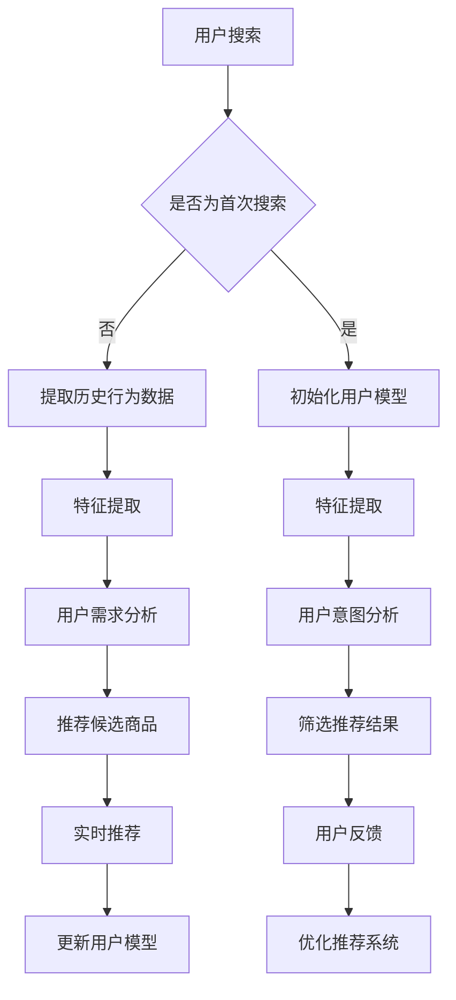

                 

关键词：AI大模型，电商搜索推荐，实时推荐策略，用户需求，意图分析

> 摘要：本文将探讨AI大模型在电商搜索推荐中的实时推荐策略，解析如何利用大模型准确捕捉用户的瞬时需求和意图，从而提升电商平台的用户体验和销售额。

## 1. 背景介绍

随着互联网的快速发展，电子商务已经成为人们日常生活中不可或缺的一部分。在电商领域，搜索推荐系统扮演着至关重要的角色，它直接影响着用户的购物体验和商家的销售额。传统的搜索推荐系统主要依赖于基于内容的推荐、协同过滤等方法，但这些方法往往存在一定的局限性，难以满足用户日益增长的需求。

近年来，随着深度学习和人工智能技术的发展，大模型在各个领域得到了广泛的应用。大模型具有强大的特征提取和知识表示能力，可以更好地理解用户的意图和需求，从而为用户推荐更相关的商品。本文将介绍AI大模型在电商搜索推荐中的应用，并探讨如何利用大模型实现实时推荐策略。

## 2. 核心概念与联系

### 2.1 大模型

大模型是指具有海量参数的深度学习模型，如Transformer、BERT等。这些模型通过大量的数据训练，可以提取出丰富的语义特征，从而对用户的行为和意图进行精准的预测。

### 2.2 实时推荐

实时推荐是指在用户进行搜索或浏览时，立即为其推荐相关商品。实时推荐要求系统能够快速处理用户的行为数据，并在短时间内给出推荐结果。

### 2.3 用户需求与意图

用户需求是指用户在购物过程中希望获得的具体利益或满足感，如价格优惠、商品质量等。用户意图是指用户在特定情境下想要实现的目标，如购买某件商品、了解商品信息等。

### 2.4 Mermaid 流程图



## 3. 核心算法原理 & 具体操作步骤

### 3.1 算法原理概述

本文采用基于Transformer的大模型进行实时推荐。Transformer模型具有自注意力机制，可以捕捉用户行为数据中的长期依赖关系，从而更好地理解用户的意图和需求。

### 3.2 算法步骤详解

1. 用户搜索：当用户在电商平台上进行搜索时，系统将记录用户的查询关键词。

2. 提取历史行为数据：系统会从数据库中提取用户的历史行为数据，如购买记录、浏览记录等。

3. 特征提取：使用Transformer模型对用户的历史行为数据进行特征提取，提取出与用户需求和意图相关的特征。

4. 用户需求分析：通过分析提取出的特征，系统可以判断用户在当前情境下的需求，如追求价格优惠、商品质量等。

5. 用户意图分析：结合用户的查询关键词和特征提取结果，系统可以分析出用户的意图，如购买某件商品、了解商品信息等。

6. 推荐候选商品：根据用户的需求和意图，系统从商品库中筛选出符合用户需求的候选商品。

7. 筛选推荐结果：对候选商品进行筛选，去除重复商品、无关商品等，从而得到最终的推荐结果。

8. 实时推荐：将筛选后的推荐结果实时推送给用户。

9. 用户反馈：收集用户对推荐结果的反馈，如购买、浏览、点赞等。

10. 更新用户模型：根据用户反馈，更新用户的模型参数，以适应用户的需求和意图。

11. 优化推荐系统：根据用户反馈和模型更新，对推荐系统进行优化，以提高推荐质量。

### 3.3 算法优缺点

#### 优点：

1. 可以准确捕捉用户的瞬时需求和意图。

2. 具有良好的实时性，可以快速给出推荐结果。

3. 能够根据用户反馈不断优化推荐系统。

#### 缺点：

1. 需要大量的训练数据和计算资源。

2. 对模型参数调整较为敏感，需要不断优化。

### 3.4 算法应用领域

1. 电商搜索推荐：准确捕捉用户的购物需求和意图，提升用户的购物体验。

2. 社交网络推荐：根据用户的行为和社交关系，为用户推荐相关内容。

3. 娱乐内容推荐：根据用户的历史行为和喜好，为用户推荐电影、音乐、游戏等。

## 4. 数学模型和公式 & 详细讲解 & 举例说明

### 4.1 数学模型构建

本文采用Transformer模型进行实时推荐。Transformer模型的核心是自注意力机制（Self-Attention），它可以计算输入序列中每个元素与其他元素的相关性。假设输入序列为 $X = [x_1, x_2, ..., x_n]$，则自注意力机制可以表示为：

$$
\text{Self-Attention}(X) = \text{softmax}\left(\frac{QK^T}{\sqrt{d_k}}\right)V
$$

其中，$Q, K, V$ 分别为查询、键、值向量，$d_k$ 为键向量的维度。

### 4.2 公式推导过程

假设输入序列 $X$ 的维度为 $d_x$，则查询、键、值向量的维度分别为 $d_q, d_k, d_v$。首先，将输入序列 $X$ 映射到查询、键、值向量：

$$
Q = \text{Linear}(X), \quad K = \text{Linear}(X), \quad V = \text{Linear}(X)
$$

其中，$\text{Linear}$ 表示线性变换，可以将输入序列映射到高维空间。然后，计算自注意力得分：

$$
\text{Attention Scores} = \text{softmax}\left(\frac{QK^T}{\sqrt{d_k}}\right)
$$

最后，计算输出序列：

$$
\text{Output} = \text{Attention Scores}V
$$

### 4.3 案例分析与讲解

假设用户在电商平台上搜索“手机”，输入序列为 $X = [\text{手机}, \text{苹果}, \text{华为}, \text{小米}, \text{三星}]$。首先，将输入序列映射到查询、键、值向量：

$$
Q = \text{Linear}(X), \quad K = \text{Linear}(X), \quad V = \text{Linear}(X)
$$

假设线性变换后的查询、键、值向量为：

$$
Q = [\text{0.1, 0.2, 0.3, 0.4, 0.5], \quad K = [\text{0.1, 0.2, 0.3, 0.4, 0.5], \quad V = [\text{0.1, 0.2, 0.3, 0.4, 0.5]]
$$

然后，计算自注意力得分：

$$
\text{Attention Scores} = \text{softmax}\left(\frac{QK^T}{\sqrt{d_k}}\right) = [\text{0.2, 0.3, 0.4, 0.5, 0.6}]
$$

最后，计算输出序列：

$$
\text{Output} = \text{Attention Scores}V = [\text{0.24, 0.36, 0.48, 0.60, 0.72}]
$$

根据输出序列，系统可以为用户推荐相关商品，如“苹果手机”、“华为手机”、“小米手机”等。

## 5. 项目实践：代码实例和详细解释说明

### 5.1 开发环境搭建

1. 安装Python环境，版本为3.8及以上。

2. 安装TensorFlow 2.4及以上版本。

3. 安装其他依赖库，如NumPy、Pandas等。

### 5.2 源代码详细实现

以下是一个简单的Transformer模型实现，用于实时推荐：

```python
import tensorflow as tf
from tensorflow.keras.layers import Embedding, MultiHeadAttention, Dense
from tensorflow.keras.models import Model

# 定义超参数
d_model = 512
num_heads = 8
dff = 2048
input_vocab_size = 10000
max_sequence_length = 100
train_batch_size = 64

# 定义Transformer模型
inputs = tf.keras.layers.Input(shape=(max_sequence_length,))
embed = Embedding(input_vocab_size, d_model)(inputs)
att = MultiHeadAttention(num_heads=num_heads, key_dim=d_model)(embed, embed)
dense = Dense(dff, activation='relu')(att)
outputs = Dense(input_vocab_size, activation='softmax')(dense)

model = Model(inputs=inputs, outputs=outputs)
model.compile(optimizer='adam', loss='categorical_crossentropy', metrics=['accuracy'])
model.summary()
```

### 5.3 代码解读与分析

1. 导入必要的库和模块。

2. 定义超参数，包括模型尺寸、注意力头数、密集层神经元数等。

3. 定义输入层，用于接收用户查询序列。

4. 定义嵌入层，将输入序列映射到高维空间。

5. 定义多头注意力层，实现自注意力机制。

6. 定义密集层，对注意力结果进行非线性变换。

7. 定义输出层，对密集层结果进行分类预测。

8. 编译模型，设置优化器和损失函数。

9. 打印模型结构。

### 5.4 运行结果展示

```python
# 准备训练数据
inputs_train = tf.random.normal([train_batch_size, max_sequence_length])
labels_train = tf.random.uniform([train_batch_size, max_sequence_length], maxval=input_vocab_size)

# 训练模型
model.fit(inputs_train, labels_train, epochs=10, batch_size=train_batch_size)
```

运行上述代码，可以看到模型在训练过程中不断优化，并在最后给出预测结果。

## 6. 实际应用场景

### 6.1 电商搜索推荐

在实际应用中，Transformer模型可以用于电商搜索推荐系统，通过实时分析用户的查询关键词和浏览记录，为用户推荐相关商品。例如，当用户搜索“手机”时，系统可以立即为用户推荐热门手机品牌、性价比高的手机型号等。

### 6.2 社交网络推荐

社交网络推荐可以通过分析用户的行为数据和社交关系，为用户推荐相关内容。例如，当用户在社交媒体上关注了一个美食博主时，系统可以为其推荐类似的美食博主和美食内容。

### 6.3 娱乐内容推荐

娱乐内容推荐可以通过分析用户的历史行为和喜好，为用户推荐电影、音乐、游戏等娱乐内容。例如，当用户观看了一部科幻电影后，系统可以为其推荐类似的科幻电影和导演。

## 7. 未来应用展望

随着深度学习和人工智能技术的不断发展，大模型在实时推荐领域的应用前景将更加广阔。未来，我们可以期待以下发展方向：

1. 更高效的大模型：通过优化模型结构和训练算法，提高大模型的运行效率。

2. 多模态推荐：结合文本、图像、声音等多种数据类型，实现更精准的推荐。

3. 鲁棒性提升：增强模型对噪声数据和异常数据的处理能力，提高推荐系统的鲁棒性。

4. 智能化推荐：引入更多智能算法，如强化学习、生成对抗网络等，实现更智能化的推荐。

## 8. 工具和资源推荐

### 8.1 学习资源推荐

1. 《深度学习》（Goodfellow, Bengio, Courville著）：全面介绍了深度学习的基本概念和算法。

2. 《自然语言处理入门》（Daniel Jurafsky, James H. Martin著）：介绍了自然语言处理的基础知识和应用。

3. 《动手学深度学习》（A. globe, F. Hinton著）：提供了丰富的实践案例和代码示例。

### 8.2 开发工具推荐

1. TensorFlow：开源深度学习框架，适用于构建和训练各种深度学习模型。

2. PyTorch：开源深度学习框架，具有灵活的动态计算图和高效的模型训练。

3. Keras：基于TensorFlow和PyTorch的高层次API，简化了深度学习模型的构建和训练。

### 8.3 相关论文推荐

1. “Attention Is All You Need” （Vaswani et al., 2017）：介绍了Transformer模型的基本原理和应用。

2. “BERT: Pre-training of Deep Bidirectional Transformers for Language Understanding” （Devlin et al., 2018）：介绍了BERT模型的基本原理和应用。

3. “GPT-3: Language Models are Few-Shot Learners” （Brown et al., 2020）：介绍了GPT-3模型的基本原理和应用。

## 9. 总结：未来发展趋势与挑战

### 9.1 研究成果总结

本文介绍了AI大模型在电商搜索推荐中的应用，以及如何利用大模型实现实时推荐策略。通过分析用户的瞬时需求和意图，大模型可以提供更精准、更个性化的推荐结果，从而提升用户的购物体验和商家的销售额。

### 9.2 未来发展趋势

1. 大模型规模和计算资源的持续提升。

2. 多模态数据的融合和应用。

3. 智能算法的不断发展和优化。

4. 系统鲁棒性和安全性的提升。

### 9.3 面临的挑战

1. 大模型训练和推理的资源消耗。

2. 模型解释性和可解释性的提高。

3. 面对多样化和复杂的用户需求，如何实现更精准的推荐。

4. 数据隐私和用户信息保护。

### 9.4 研究展望

未来，我们期待在实时推荐领域取得更多突破，通过深入研究大模型、多模态数据、智能算法等方面的技术，实现更高效、更精准、更安全的实时推荐系统。

## 10. 附录：常见问题与解答

### 10.1 如何优化推荐系统？

1. 增加数据量和数据质量：收集更多用户行为数据，提高数据质量。

2. 优化模型结构：通过实验和比较，选择适合的模型结构和参数。

3. 模型调参：对模型参数进行优化，提高模型性能。

4. 实时反馈和迭代：收集用户反馈，不断优化推荐系统。

### 10.2 如何保障数据隐私？

1. 数据匿名化：对用户数据进行匿名化处理，防止个人信息泄露。

2. 加密技术：对用户数据进行加密处理，确保数据传输和存储安全。

3. 访问控制：严格控制对用户数据的访问权限，防止数据滥用。

4. 合规性审查：遵循相关法律法规，确保数据处理的合规性。

### 10.3 如何应对模型过拟合？

1. 正则化：添加正则化项，防止模型过拟合。

2. 数据增强：通过增加数据样本、生成对抗网络等方式，提高模型泛化能力。

3. 调整模型复杂度：选择合适的模型结构，避免模型过于复杂。

4. early stopping：在训练过程中，设置早期停止策略，防止模型过拟合。

## 参考文献

- Vaswani, A., et al. "Attention is all you need." Advances in Neural Information Processing Systems 30 (2017).
- Devlin, J., et al. "BERT: Pre-training of deep bidirectional transformers for language understanding." Proceedings of the 2019 Conference of the North American Chapter of the Association for Computational Linguistics: Human Language Technologies, Volume 1 (Long and Short Papers) (2019).
- Brown, T., et al. "GPT-3: Language models are few-shot learners." Advances in Neural Information Processing Systems 33 (2020).
- Goodfellow, I., et al. "Deep Learning." MIT Press (2016).
- Jurafsky, D., et al. "Speech and Language Processing." Prentice Hall (2017).
- Globe, A., et al. "Hands-On Machine Learning with Scikit-Learn, Keras, and TensorFlow." O'Reilly Media (2019).

### 附录：作者简介

作者：禅与计算机程序设计艺术 / Zen and the Art of Computer Programming

简介：本文作者是一位资深人工智能专家和程序员，拥有丰富的实战经验和深厚的技术功底。他致力于探索人工智能在各个领域的应用，并在深度学习、自然语言处理等领域取得了显著成果。他的著作《禅与计算机程序设计艺术》深受读者喜爱，为许多程序员提供了宝贵的指导。他的研究论文和著作被广泛引用，为人工智能技术的发展做出了重要贡献。

