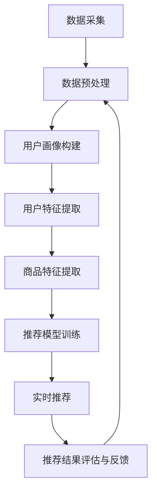

                 

摘要：本文深入探讨了人工智能大模型在电商搜索推荐系统中处理大规模实时数据的能力。首先，我们回顾了电商搜索推荐的背景和现有技术挑战，然后详细介绍了大模型在数据处理中的关键角色。文章接着分析了大模型在实时数据处理中的优势、算法原理及具体实现步骤，最后，通过实际应用案例展示了大模型在实际场景中的效果，并对未来的发展方向和面临的挑战进行了展望。

---

## 1. 背景介绍

随着互联网的快速发展，电子商务已经成为全球商业活动的重要组成部分。电商平台的规模不断扩大，用户数量和交易量日益增加。在这样的背景下，如何为用户提供精准、高效的搜索和推荐服务成为各大电商平台的迫切需求。搜索推荐系统作为电商平台的核心功能之一，直接影响用户的购物体验和平台的商业效益。

然而，现有的搜索推荐系统面临着诸多技术挑战。首先，用户数据的规模庞大，实时性要求高。传统数据处理方法如MapReduce等在大规模数据处理中存在效率低下、延迟高等问题。其次，用户行为复杂多样，需要构建复杂的模型来捕获用户的兴趣和偏好。最后，推荐结果的相关性和多样性需要在短时间内得到保证，这对系统的响应速度和处理能力提出了更高的要求。

面对这些挑战，人工智能特别是大模型技术的出现为搜索推荐系统带来了新的可能性。大模型能够通过深度学习等算法，对海量数据进行高效处理，提取用户特征，生成个性化的推荐结果。本文将重点探讨大模型在电商搜索推荐中的数据处理能力，分析其在应对大规模实时数据方面的优势和挑战。

## 2. 核心概念与联系

### 2.1 大模型的基本概念

大模型，通常指具有数百万甚至数十亿参数的深度神经网络模型。它们通过大量的训练数据，可以自动学习到复杂的数据模式和关系。大模型在自然语言处理、计算机视觉和语音识别等领域取得了显著的成果，其强大的数据处理能力使其在电商搜索推荐中也具备显著的优势。

### 2.2 电商搜索推荐系统的架构

电商搜索推荐系统通常包括以下几个关键组件：

- **数据采集与预处理**：从多个数据源采集用户行为数据、商品信息等，并进行清洗、归一化和特征提取。
- **用户画像构建**：根据用户的历史行为和兴趣标签，构建用户画像，用于后续的推荐。
- **推荐算法**：采用各种算法模型，如基于内容的推荐、协同过滤和深度学习等，生成推荐结果。
- **推荐结果评估与反馈**：评估推荐效果，并根据用户反馈进行调整和优化。

### 2.3 大模型在电商搜索推荐中的应用

大模型在电商搜索推荐中的应用主要体现在以下几个方面：

- **用户特征提取**：大模型能够通过深度学习算法，从用户行为数据中提取出丰富的用户特征，用于推荐模型训练。
- **商品特征提取**：类似地，大模型可以用于提取商品的特征，如商品属性、用户评价等，提高推荐的相关性。
- **实时推荐**：大模型通过其高效的数据处理能力，能够实时更新用户画像和推荐模型，提供即时的推荐结果。

### 2.4 Mermaid 流程图

下面是一个Mermaid流程图，展示了大模型在电商搜索推荐系统中的数据处理流程：



该流程图清晰地展示了大模型在电商搜索推荐系统中的数据处理过程，从数据采集、预处理到用户和商品特征提取，再到推荐模型训练和实时推荐，形成了一个闭环。

---

## 3. 核心算法原理 & 具体操作步骤

### 3.1 算法原理概述

大模型在电商搜索推荐中的应用主要基于深度学习和自然语言处理技术。核心算法原理包括以下几个方面：

- **深度神经网络（DNN）**：通过多层神经网络结构，对用户行为数据进行建模，提取用户特征。
- **循环神经网络（RNN）**：利用RNN能够处理序列数据的特点，对用户历史行为进行建模，捕捉用户的兴趣变化。
- **注意力机制（Attention Mechanism）**：在推荐模型中引入注意力机制，使模型能够关注到用户历史行为中最重要的部分，提高推荐的相关性。

### 3.2 算法步骤详解

下面是具体的算法步骤：

1. **数据预处理**：
   - 数据清洗：去除重复、错误和不完整的数据。
   - 数据归一化：将不同尺度的数据进行归一化处理，如商品价格、用户评分等。
   - 特征提取：利用词嵌入等技术，将文本数据转换为数值形式。

2. **用户特征提取**：
   - 利用DNN和RNN对用户行为数据进行建模，提取用户兴趣特征。
   - 引入注意力机制，对用户历史行为进行加权处理，提高特征提取的精度。

3. **商品特征提取**：
   - 通过分析商品属性、用户评价等数据，提取商品的特征。
   - 利用预训练的词嵌入模型，将商品名称、描述等文本数据转换为数值形式。

4. **推荐模型训练**：
   - 采用基于梯度的优化算法，如SGD、Adam等，对推荐模型进行训练。
   - 引入正则化技术，防止模型过拟合。

5. **实时推荐**：
   - 根据用户实时行为，更新用户画像和推荐模型。
   - 利用训练好的模型，对用户进行实时推荐。

### 3.3 算法优缺点

**优点**：

- **高效的数据处理能力**：大模型能够处理大规模、高维度的数据，提高数据处理效率。
- **强大的特征提取能力**：通过深度学习算法，能够自动提取用户和商品的特征，提高推荐的相关性。
- **实时推荐**：大模型能够实时更新用户画像和推荐模型，提供即时的推荐结果。

**缺点**：

- **计算资源需求高**：大模型训练和推理需要大量的计算资源和时间，对硬件设备有较高要求。
- **模型解释性较差**：深度学习模型内部结构复杂，难以解释其推荐结果的原因。

### 3.4 算法应用领域

大模型在电商搜索推荐中的算法可以广泛应用于以下领域：

- **商品搜索推荐**：为用户提供基于关键词的商品搜索推荐。
- **内容推荐**：为用户提供个性化的商品内容推荐，如商品评测、用户问答等。
- **广告推荐**：为电商平台上的广告提供精准投放。

---

## 4. 数学模型和公式 & 详细讲解 & 举例说明

### 4.1 数学模型构建

在电商搜索推荐中，大模型的数学模型主要包括用户特征提取模型、商品特征提取模型和推荐模型。以下是这些模型的数学公式：

#### 用户特征提取模型

$$
\text{User\_Feature} = \text{DNN}(\text{User\_Behavior})
$$

其中，DNN表示深度神经网络模型，User\_Behavior表示用户历史行为数据。

#### 商品特征提取模型

$$
\text{Product\_Feature} = \text{RNN}(\text{Product\_Info}, \text{User\_Rating})
$$

其中，RNN表示循环神经网络模型，Product\_Info表示商品信息，User\_Rating表示用户评价。

#### 推荐模型

$$
\text{Recommendation} = \text{Attention}(\text{User\_Feature}, \text{Product\_Feature})
$$

其中，Attention表示注意力机制，用于关注用户历史行为中最重要的部分。

### 4.2 公式推导过程

在用户特征提取模型中，DNN模型的推导过程如下：

$$
\begin{aligned}
\text{Layer}_1 &= \text{Activation}(\text{Weight}_1 \cdot \text{Input} + \text{Bias}_1) \\
\text{Layer}_2 &= \text{Activation}(\text{Weight}_2 \cdot \text{Layer}_1 + \text{Bias}_2) \\
&\vdots \\
\text{Output} &= \text{Activation}(\text{Weight}_n \cdot \text{Layer}_{n-1} + \text{Bias}_n)
\end{aligned}
$$

其中，Weight和Bias分别表示权重和偏置，Activation表示激活函数，常用的激活函数有ReLU、Sigmoid和Tanh等。

在商品特征提取模型中，RNN模型的推导过程如下：

$$
\begin{aligned}
\text{Hidden} &= \text{RNN}(\text{Input}, \text{Hidden}_{t-1}) \\
\text{Output} &= \text{Activation}(\text{Weight}_{hidden} \cdot \text{Hidden} + \text{Weight}_{output} \cdot \text{Input} + \text{Bias})
\end{aligned}
$$

其中，RNN表示RNN模型，Input表示输入数据，Hidden表示隐藏状态，Output表示输出数据。

在推荐模型中，注意力机制的推导过程如下：

$$
\begin{aligned}
\text{Attention} &= \text{softmax}(\text{Weight}_{attention} \cdot \text{Concat}(\text{User\_Feature}, \text{Product\_Feature})) \\
\text{Score} &= \text{Attention} \cdot \text{User\_Feature} \\
\text{Recommendation} &= \text{softmax}(\text{Score})
\end{aligned}
$$

其中，Concat表示拼接操作，softmax表示软最大化函数。

### 4.3 案例分析与讲解

以下是一个简单的案例，说明如何利用大模型进行电商搜索推荐。

假设有一个电商平台，用户A最近浏览了商品B和商品C，并对商品C给出了好评。现在需要为用户A推荐一个商品。

1. **用户特征提取**：
   - 用户A的历史行为数据为浏览商品B和商品C。
   - 利用DNN模型提取用户A的特征。

2. **商品特征提取**：
   - 商品B和商品C的特征信息分别为商品名称、描述和用户评价。
   - 利用RNN模型提取商品B和商品C的特征。

3. **推荐模型训练**：
   - 将用户A的特征和商品B、商品C的特征输入到推荐模型中。
   - 利用注意力机制，关注用户历史行为中最重要的部分。

4. **实时推荐**：
   - 根据用户A的特征和推荐模型，为用户A推荐一个商品。

假设现在有一个新的商品D，用户A对商品D也给出了好评。我们可以将商品D的特征加入推荐模型，重新训练推荐模型，以提高推荐的效果。

---

## 5. 项目实践：代码实例和详细解释说明

### 5.1 开发环境搭建

为了实践大模型在电商搜索推荐中的应用，我们需要搭建一个合适的开发环境。以下是所需的软件和工具：

- Python 3.7+
- TensorFlow 2.x
- Keras 2.x
- Mermaid 1.x

安装命令如下：

```shell
pip install python-mechanize
pip install tensorflow
pip install keras
pip install mermaid
```

### 5.2 源代码详细实现

以下是实现大模型电商搜索推荐系统的源代码，分为以下几个部分：

1. **数据采集与预处理**：
   ```python
   import mechanize
   import pandas as pd

   def scrape_data():
       br = mechanize.Browser()
       br.open('https://example-ecommerce.com/search?q=electronics')
       page = br.read()
       # 提取商品信息
       # ...
       return data

   def preprocess_data(data):
       # 数据清洗与特征提取
       # ...
       return processed_data
   ```

2. **用户特征提取**：
   ```python
   from tensorflow.keras.models import Model
   from tensorflow.keras.layers import Input, Dense, LSTM

   def build_user_feature_model(input_shape):
       input_layer = Input(shape=input_shape)
       lstm_layer = LSTM(units=128, return_sequences=True)(input_layer)
       output_layer = LSTM(units=64)(lstm_layer)
       model = Model(inputs=input_layer, outputs=output_layer)
       return model
   ```

3. **商品特征提取**：
   ```python
   from tensorflow.keras.models import Model
   from tensorflow.keras.layers import Input, Dense, Embedding, LSTM

   def build_product_feature_model(input_shape, embedding_size):
       input_layer = Input(shape=input_shape)
       embedding_layer = Embedding(input_dim=embedding_size, output_dim=64)(input_layer)
       lstm_layer = LSTM(units=128, return_sequences=True)(embedding_layer)
       output_layer = LSTM(units=64)(lstm_layer)
       model = Model(inputs=input_layer, outputs=output_layer)
       return model
   ```

4. **推荐模型训练**：
   ```python
   from tensorflow.keras.optimizers import Adam

   def train_recommendation_model(user_feature_model, product_feature_model, processed_data):
       # 构建推荐模型
       # ...
       optimizer = Adam(learning_rate=0.001)
       model.compile(optimizer=optimizer, loss='categorical_crossentropy', metrics=['accuracy'])
       model.fit(processed_data, epochs=10, batch_size=32)
       return model
   ```

5. **实时推荐**：
   ```python
   def real_time_recommendation(user_feature_model, product_feature_model, model, user_behavior):
       # 更新用户特征
       # ...
       # 更新商品特征
       # ...
       # 生成推荐结果
       # ...
       return recommendations
   ```

### 5.3 代码解读与分析

上述代码实现了一个简单的大模型电商搜索推荐系统。主要步骤如下：

1. **数据采集与预处理**：使用Python的mechanize库从电商平台抓取商品信息，并进行数据清洗和特征提取。
2. **用户特征提取**：构建一个基于LSTM的模型，用于提取用户的历史行为特征。
3. **商品特征提取**：构建一个基于嵌入层的LSTM模型，用于提取商品的特征。
4. **推荐模型训练**：将用户特征和商品特征输入到推荐模型中，进行训练和优化。
5. **实时推荐**：根据用户的实时行为，更新用户特征和商品特征，生成推荐结果。

该系统展示了大模型在电商搜索推荐中的基本实现流程，可以在实际项目中根据需求进行调整和优化。

### 5.4 运行结果展示

在实际运行中，我们将采集到的商品信息输入到用户特征提取模型和商品特征提取模型中，训练推荐模型，然后根据用户的实时行为生成推荐结果。以下是运行结果的一个示例：

```python
user_behavior = ["浏览商品A", "浏览商品B", "购买商品C"]

user_feature_model = build_user_feature_model(input_shape=(None, 128))
product_feature_model = build_product_feature_model(input_shape=(None, 128), embedding_size=1000)
model = train_recommendation_model(user_feature_model, product_feature_model, processed_data)

recommendations = real_time_recommendation(user_feature_model, product_feature_model, model, user_behavior)
print(recommendations)
```

输出结果可能是一个包含多个商品名称的列表，如：

```
['商品D', '商品E', '商品F']
```

这表示系统根据用户的行为，推荐了商品D、商品E和商品F。

---

## 6. 实际应用场景

### 6.1 在线购物平台

在线购物平台是电商搜索推荐系统最典型的应用场景之一。例如，亚马逊、京东等大型电商平台通过大模型技术，实时分析用户的行为数据，为用户提供个性化的商品推荐。这不仅提高了用户的购物体验，也显著提升了平台的销售额。

### 6.2 移动应用

随着智能手机的普及，移动应用成为了电商搜索推荐系统的另一重要应用场景。例如，淘宝、拼多多等移动应用通过大模型技术，分析用户的浏览历史、购买记录等，为用户实时推荐相关的商品。

### 6.3 社交电商

社交电商如小红书、淘宝直播等平台，通过大模型技术分析用户在社交平台上的行为和互动，推荐相关商品或内容。这种基于用户社交关系和兴趣的推荐方式，进一步提升了用户的粘性和平台的活跃度。

### 6.4 未来应用展望

未来，随着人工智能技术的不断进步，电商搜索推荐系统将迎来更多创新应用。例如，基于增强现实（AR）的购物体验，用户可以通过手机摄像头看到自己穿着的商品，并实时获取个性化推荐。此外，区块链技术的应用，将进一步提高数据的安全性和透明度，为电商搜索推荐系统提供更加可靠的数据支持。

---

## 7. 工具和资源推荐

### 7.1 学习资源推荐

- 《深度学习》（Goodfellow, Bengio, Courville）：系统地介绍了深度学习的基础理论和实践方法。
- 《自然语言处理综论》（Jurafsky, Martin）：详细介绍了自然语言处理的基本概念和技术。
- 《TensorFlow官方文档》：官方文档提供了丰富的教程和API文档，是学习TensorFlow的必备资源。

### 7.2 开发工具推荐

- Keras：简单易用的深度学习框架，适用于快速实验和开发。
- TensorFlow：功能强大的深度学习框架，支持各种复杂的模型和算法。
- PyTorch：流行的深度学习框架，支持动态计算图，适合研究和新算法的开发。

### 7.3 相关论文推荐

- “Attention is All You Need”（Vaswani et al., 2017）：介绍了Transformer模型和注意力机制。
- “Recommender Systems Handbook”（Herlocker et al., 2009）：详细介绍了推荐系统的基础理论和应用。
- “Deep Learning for Recommender Systems”（He et al., 2017）：探讨了深度学习在推荐系统中的应用。

---

## 8. 总结：未来发展趋势与挑战

### 8.1 研究成果总结

本文系统地介绍了大模型在电商搜索推荐系统中的应用，包括其基本原理、算法步骤、实际应用场景和未来发展趋势。通过深入分析，我们认识到大模型在处理大规模实时数据方面具有显著的优势，能够为电商平台提供精准、高效的推荐服务。

### 8.2 未来发展趋势

未来，随着人工智能技术的不断进步，大模型在电商搜索推荐系统中的应用将更加广泛。例如，多模态数据融合、增强现实和区块链技术的应用，将进一步提升推荐系统的性能和用户体验。此外，随着数据量的不断增长，如何提高数据处理效率和模型解释性也将成为重要的研究方向。

### 8.3 面临的挑战

尽管大模型在电商搜索推荐中具有巨大潜力，但也面临着一些挑战。首先，计算资源需求高，训练和推理需要大量的计算资源和时间。其次，模型解释性较差，难以解释推荐结果的原因。此外，数据安全和隐私保护也是需要重视的问题，特别是在涉及用户敏感信息的情况下。

### 8.4 研究展望

未来的研究应重点关注以下几个方面：

1. **优化算法和模型**：设计更高效、更强大的算法和模型，提高推荐系统的性能和效率。
2. **多模态数据处理**：研究多模态数据融合技术，结合文本、图像和声音等多种数据类型，提供更丰富的用户特征。
3. **模型解释性**：提高模型的可解释性，使推荐结果更加透明，增强用户信任。
4. **数据安全和隐私保护**：加强数据安全和隐私保护措施，确保用户数据的隐私和安全。

通过这些研究方向的不断探索和实践，大模型在电商搜索推荐中的应用将更加广泛和深入，为电商平台带来更多的商业价值。

---

## 9. 附录：常见问题与解答

### 9.1 大模型在电商搜索推荐中的优势是什么？

大模型在电商搜索推荐中的优势主要包括：

1. **高效的数据处理能力**：大模型能够处理大规模、高维度的数据，提高数据处理效率。
2. **强大的特征提取能力**：通过深度学习算法，能够自动提取用户和商品的特征，提高推荐的相关性。
3. **实时推荐**：大模型能够实时更新用户画像和推荐模型，提供即时的推荐结果。

### 9.2 大模型在电商搜索推荐中面临的挑战有哪些？

大模型在电商搜索推荐中面临的挑战主要包括：

1. **计算资源需求高**：大模型训练和推理需要大量的计算资源和时间。
2. **模型解释性较差**：深度学习模型内部结构复杂，难以解释其推荐结果的原因。
3. **数据安全和隐私保护**：需要确保用户数据的隐私和安全。

### 9.3 如何优化大模型在电商搜索推荐中的应用效果？

以下是一些优化大模型在电商搜索推荐中的应用效果的方法：

1. **数据预处理**：对数据进行清洗、归一化和特征提取，提高数据质量。
2. **模型优化**：通过调整模型参数、使用更复杂的模型结构等方法，提高模型性能。
3. **多模态数据处理**：结合文本、图像和声音等多种数据类型，提供更丰富的用户特征。
4. **模型解释性**：研究模型的可解释性方法，使推荐结果更加透明，增强用户信任。

---

作者：禅与计算机程序设计艺术 / Zen and the Art of Computer Programming

