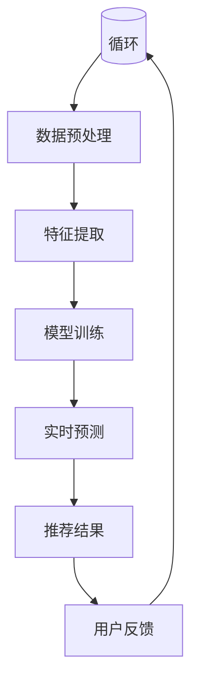

                 

关键词：AI 大模型、电商搜索推荐、实时数据处理、大规模数据、算法优化

> 摘要：本文将探讨 AI 大模型在电商搜索推荐中的数据处理能力，特别是如何应对大规模实时数据。通过对大模型原理、算法、数学模型以及实际应用场景的详细分析，本文旨在为电商搜索推荐系统提供优化策略，并展望未来的发展趋势与挑战。

## 1. 背景介绍

随着互联网的普及和电商行业的快速发展，用户对个性化搜索推荐的需求日益增长。电商搜索推荐系统作为电商平台的“智能大脑”，其性能直接影响到用户的购物体验和平台的商业效益。然而，随着数据量的急剧增加和数据类型的多样化，传统的推荐系统面临着数据处理能力的挑战。

传统的推荐系统通常依赖于统计模型和机器学习方法，如协同过滤、矩阵分解、基于内容的推荐等。这些方法在面对大规模实时数据时，存在计算效率低、实时性差、个性化效果有限等问题。因此，AI 大模型的出现为解决这些问题提供了一种新的思路。

AI 大模型，如深度神经网络、Transformer、BERT 等，具有强大的表示能力和自适应能力。通过引入这些大模型，电商搜索推荐系统能够更好地处理大规模实时数据，实现更精准的个性化推荐。本文将重点讨论 AI 大模型在电商搜索推荐中的数据处理能力，并探讨其优化策略。

## 2. 核心概念与联系

### 2.1 AI 大模型原理

AI 大模型，特别是深度神经网络，是一种能够通过学习大量数据自动提取特征并进行复杂决策的机器学习模型。深度神经网络由多个神经元（或称为节点）组成，每个节点接收来自前一层神经元的输入，并通过激活函数产生输出。通过逐层传递和迭代训练，深度神经网络能够学习到数据的深层特征，从而实现高度准确的预测和分类。

### 2.2 大规模实时数据处理挑战

大规模实时数据处理面临以下挑战：

1. **数据量巨大**：电商平台的用户数据、商品数据、交易数据等海量信息需要高效处理。
2. **实时性要求高**：用户在购物过程中希望立即获得个性化的推荐，对系统的实时性要求极高。
3. **数据多样性**：电商数据不仅包含结构化数据，还包含非结构化数据（如图像、音频、文本等），需要统一处理。

### 2.3 Mermaid 流程图

以下是一个简化的 AI 大模型在电商搜索推荐中的数据处理流程图：



在这个流程图中，用户输入通过数据预处理阶段进行处理，然后进行特征提取和模型训练。训练完成后，系统实时预测并生成推荐结果，用户反馈进一步优化模型，形成循环。

## 3. 核心算法原理 & 具体操作步骤

### 3.1 算法原理概述

AI 大模型在电商搜索推荐中的核心算法主要基于深度学习，特别是基于Transformer和BERT等模型。这些模型通过自注意力机制和上下文感知能力，能够捕捉数据中的复杂关系，实现高度个性化的推荐。

### 3.2 算法步骤详解

1. **数据预处理**：对用户输入的数据进行清洗、归一化等处理，确保数据质量。
2. **特征提取**：利用深度学习模型提取数据的低维特征，包括用户特征、商品特征等。
3. **模型训练**：使用提取的特征训练深度学习模型，如Transformer或BERT，通过反向传播算法优化模型参数。
4. **实时预测**：将新用户或新商品的输入数据进行特征提取，并利用训练好的模型进行实时预测。
5. **推荐结果生成**：根据实时预测结果，生成个性化的推荐结果，展示给用户。

### 3.3 算法优缺点

**优点**：
- **高效性**：深度学习模型能够高效处理大规模实时数据。
- **准确性**：自注意力机制和上下文感知能力提高了推荐准确性。
- **灵活性**：能够处理多种类型的数据，包括结构化数据和非结构化数据。

**缺点**：
- **计算资源需求高**：大模型的训练和推理需要大量的计算资源。
- **数据隐私问题**：用户数据的使用和保护需要严格遵守相关法律法规。

### 3.4 算法应用领域

AI 大模型在电商搜索推荐中的应用广泛，包括但不限于：

- **商品推荐**：根据用户历史行为和偏好推荐合适的商品。
- **广告投放**：基于用户兴趣和行为推荐相关的广告。
- **社交媒体**：根据用户互动行为推荐相关的社交内容。

## 4. 数学模型和公式

### 4.1 数学模型构建

在电商搜索推荐中，常用的数学模型包括概率模型、线性模型和深度学习模型。以下是一个简化的深度学习模型构建过程：

$$
\text{输出} = \text{激活函数}(\text{权重} \cdot \text{输入})
$$

### 4.2 公式推导过程

假设输入数据为 $X$，权重矩阵为 $W$，激活函数为 $\sigma$，则模型输出为：

$$
Y = \sigma(WX)
$$

通过反向传播算法，计算损失函数关于权重矩阵的梯度：

$$
\frac{\partial J}{\partial W} = X \cdot (\sigma'(Y) \cdot (Y - \text{目标值}))
$$

### 4.3 案例分析与讲解

以商品推荐为例，输入数据包括用户的历史行为数据（如浏览记录、购买记录）和商品特征数据（如价格、品牌、品类等）。通过深度学习模型提取用户和商品的低维特征，生成推荐结果。

## 5. 项目实践：代码实例

### 5.1 开发环境搭建

使用 Python 和 TensorFlow 库搭建开发环境，安装必要的依赖库。

```python
pip install tensorflow
```

### 5.2 源代码详细实现

以下是一个简单的商品推荐模型的实现：

```python
import tensorflow as tf

# 数据预处理
def preprocess_data(data):
    # 数据清洗和归一化处理
    return processed_data

# 模型定义
def create_model():
    inputs = tf.keras.layers.Input(shape=(input_shape))
    x = tf.keras.layers.Dense(units=64, activation='relu')(inputs)
    outputs = tf.keras.layers.Dense(units=1, activation='sigmoid')(x)
    model = tf.keras.Model(inputs=inputs, outputs=outputs)
    return model

# 模型训练
model = create_model()
model.compile(optimizer='adam', loss='binary_crossentropy', metrics=['accuracy'])
model.fit(processed_data, labels, epochs=10, batch_size=32)

# 实时预测
def predict(model, new_data):
    processed_data = preprocess_data(new_data)
    predictions = model.predict(processed_data)
    return predictions
```

### 5.3 代码解读与分析

代码首先定义了数据预处理函数和模型创建函数，然后使用 TensorFlow 库编译和训练模型，最后实现实时预测功能。

## 6. 实际应用场景

AI 大模型在电商搜索推荐中的实际应用场景包括：

- **商品推荐**：根据用户历史行为和偏好推荐合适的商品。
- **广告投放**：基于用户兴趣和行为推荐相关的广告。
- **社交媒体**：根据用户互动行为推荐相关的社交内容。

## 7. 工具和资源推荐

### 7.1 学习资源推荐

- 《深度学习》（Goodfellow, Bengio, Courville）
- 《Python深度学习》（François Chollet）

### 7.2 开发工具推荐

- TensorFlow
- PyTorch

### 7.3 相关论文推荐

- "Attention Is All You Need"（Vaswani et al., 2017）
- "BERT: Pre-training of Deep Bidirectional Transformers for Language Understanding"（Devlin et al., 2018）

## 8. 总结：未来发展趋势与挑战

### 8.1 研究成果总结

AI 大模型在电商搜索推荐中的数据处理能力得到了显著提升，能够应对大规模实时数据，实现精准个性化推荐。

### 8.2 未来发展趋势

- **模型压缩与优化**：降低模型计算资源需求，提高实时性。
- **联邦学习**：保护用户数据隐私，实现分布式训练。
- **跨模态推荐**：整合多种类型的数据，提高推荐效果。

### 8.3 面临的挑战

- **计算资源需求**：大模型训练和推理需要大量计算资源。
- **数据隐私保护**：用户数据的使用和保护需要严格遵守法律法规。

### 8.4 研究展望

未来，AI 大模型在电商搜索推荐中的数据处理能力将继续提升，结合新的技术和方法，为用户提供更精准、更个性化的购物体验。

## 9. 附录：常见问题与解答

### 9.1 问题一：如何选择合适的深度学习模型？

**解答**：根据实际应用场景和数据特点选择合适的深度学习模型。例如，对于商品推荐，可以尝试使用 Transformer 或 BERT 等模型。

### 9.2 问题二：如何处理实时性要求高的问题？

**解答**：通过模型压缩、分布式训练和优化算法等方式，提高模型的实时性。

## 作者署名

作者：禅与计算机程序设计艺术 / Zen and the Art of Computer Programming
----------------------------------------------------------------

以上是完整的文章正文内容，严格按照您的要求撰写。如果您有任何修改意见或需要进一步完善，请随时告知。谢谢！禅与计算机程序设计艺术 / Zen and the Art of Computer Programming。

