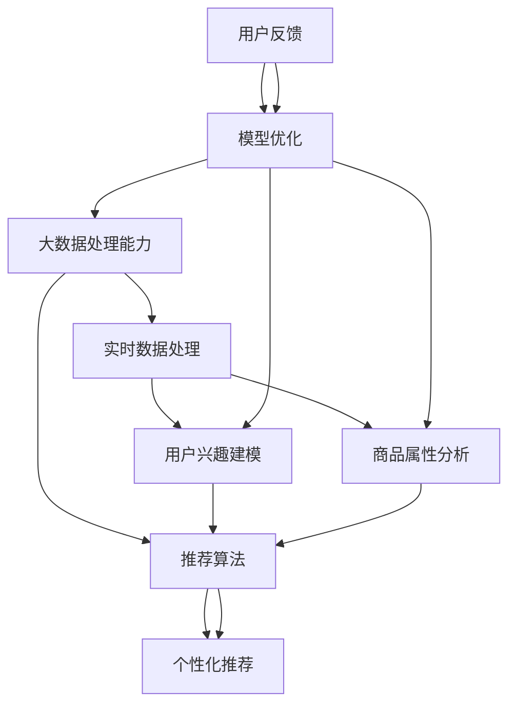

                 

关键词：AI大模型、电商搜索推荐、数据处理、大规模实时数据、算法原理、数学模型、项目实践、应用场景、未来展望

## 摘要

本文旨在探讨人工智能大模型在电商搜索推荐系统中处理大规模实时数据的能力要求。首先，文章回顾了电商搜索推荐的背景和现状，然后深入分析了大模型在数据处理中的核心概念和架构。接下来，本文详细阐述了大模型的核心算法原理、数学模型及其应用领域。此外，文章还通过实际项目实践，提供了代码实例和详细解释，展示了大模型在电商搜索推荐中的具体应用效果。最后，本文对大模型在电商搜索推荐中的实际应用场景进行了讨论，并展望了其未来发展趋势和面临的挑战。

## 1. 背景介绍

随着互联网的快速发展，电子商务已经成为现代经济的重要组成部分。电商平台的崛起带来了大量的在线交易数据，这些数据不仅包含用户的购买行为、浏览历史，还涵盖了商品的各种属性信息。如何有效地利用这些数据为用户提供个性化的搜索推荐服务，成为电商平台面临的重大挑战。

传统的搜索推荐系统主要依赖于基于内容的推荐、协同过滤等方法。然而，这些方法在处理大规模实时数据时存在诸多局限性。首先，它们通常需要大量的计算资源和时间来生成推荐结果。其次，这些方法对用户的兴趣和行为的理解相对单一，难以实现高度个性化的推荐。因此，随着数据规模的不断扩大，传统推荐系统已经难以满足用户的需求。

为了应对这一挑战，人工智能大模型应运而生。大模型具有以下几个显著优势：

1. **强大的数据处理能力**：大模型可以处理海量数据，并且能够从数据中发现复杂的模式和关联。这使得大模型在应对大规模实时数据时具有显著的优势。
2. **高度个性化的推荐**：大模型可以基于用户的兴趣和行为进行深度分析，从而实现高度个性化的推荐。这有助于提升用户体验，提高用户粘性。
3. **实时性**：大模型通常具有较好的实时性，可以在短时间内生成推荐结果，满足用户实时性的需求。
4. **自动化和自适应**：大模型可以通过不断学习和优化，自动适应用户需求的变化，提高推荐系统的自适应能力。

## 2. 核心概念与联系

在深入探讨大模型在电商搜索推荐中的应用之前，有必要先了解其核心概念和架构。以下是关于大模型在电商搜索推荐中的核心概念及其关系的 Mermaid 流程图：



### 2.1 大数据处理能力

大数据处理能力是大模型在电商搜索推荐中的基础。它包括数据采集、数据清洗、数据存储和数据挖掘等环节。大模型通过分布式计算和存储技术，能够高效地处理海量数据，为后续的用户兴趣建模和商品属性分析提供支持。

### 2.2 用户兴趣建模

用户兴趣建模是大模型的核心之一。通过分析用户的浏览、搜索、购买等行为，大模型可以建立用户的兴趣模型。这个模型不仅包含了用户的显式兴趣（如用户主动搜索的关键词），还包括用户的隐性兴趣（如用户的浏览路径、购买偏好等）。这些兴趣信息将为个性化推荐提供重要依据。

### 2.3 商品属性分析

商品属性分析也是大模型在电商搜索推荐中的关键环节。通过对商品的各种属性（如价格、品牌、类别、用户评价等）进行分析，大模型可以建立商品的特征向量。这些特征向量将用于计算用户和商品之间的相似度，从而生成推荐列表。

### 2.4 推荐算法

推荐算法是大模型在电商搜索推荐中的核心组件。它通过结合用户兴趣建模和商品属性分析的结果，计算用户和商品之间的相似度，并根据相似度生成推荐列表。常见的推荐算法包括基于内容的推荐、协同过滤、基于模型的推荐等。

### 2.5 个性化推荐

个性化推荐是大模型在电商搜索推荐中的最终目标。通过结合用户的兴趣模型和商品特征向量，个性化推荐算法可以生成针对特定用户的个性化推荐列表。这有助于提高用户满意度，提升电商平台的核心竞争力。

### 2.6 用户反馈和模型优化

用户反馈和模型优化是循环迭代过程。通过收集用户对推荐结果的反馈，大模型可以不断调整和优化推荐算法，提高推荐的准确性和个性化程度。这种迭代过程使得大模型能够自适应地适应用户需求的变化，持续提升推荐系统的效果。

## 3. 核心算法原理 & 具体操作步骤

### 3.1 算法原理概述

大模型在电商搜索推荐中的核心算法通常是基于深度学习和机器学习的。其中，深度学习模型（如卷积神经网络（CNN）、循环神经网络（RNN）等）在处理大规模实时数据方面具有显著优势。以下是深度学习模型在电商搜索推荐中的基本原理：

1. **输入层**：输入层接收用户和商品的各类特征向量，如用户兴趣向量、商品特征向量等。
2. **隐藏层**：隐藏层通过神经网络结构对输入特征进行抽象和转换，提取高层次的语义信息。
3. **输出层**：输出层生成推荐结果，如推荐列表或概率分布。

深度学习模型通过大量训练数据和复杂的网络结构，能够自动学习用户和商品之间的复杂关系，从而生成准确的推荐结果。

### 3.2 算法步骤详解

以下是大模型在电商搜索推荐中的具体操作步骤：

#### 3.2.1 数据预处理

1. **数据采集**：从电商平台获取用户行为数据、商品属性数据等。
2. **数据清洗**：去除无效、重复或错误的数据，确保数据质量。
3. **特征工程**：将原始数据转换为特征向量，包括用户兴趣向量、商品特征向量等。

#### 3.2.2 模型训练

1. **模型初始化**：根据数据规模和特征维度初始化深度学习模型。
2. **训练数据准备**：将特征向量和标签（如用户是否购买）划分为训练集和测试集。
3. **模型训练**：使用训练数据训练深度学习模型，通过反向传播算法不断调整模型参数，优化模型性能。

#### 3.2.3 推荐生成

1. **用户兴趣向量计算**：使用训练好的模型计算用户的兴趣向量。
2. **商品特征向量计算**：对商品特征向量进行编码，生成商品特征向量。
3. **相似度计算**：计算用户兴趣向量和商品特征向量之间的相似度，生成推荐列表。

#### 3.2.4 用户反馈与模型优化

1. **用户反馈收集**：收集用户对推荐结果的反馈，如点击、购买、评分等。
2. **模型优化**：根据用户反馈调整模型参数，优化模型性能。

### 3.3 算法优缺点

#### 优点

1. **强大的数据处理能力**：大模型能够处理大规模实时数据，快速生成推荐结果。
2. **高度个性化的推荐**：基于深度学习模型，大模型能够准确捕捉用户兴趣和商品属性，生成个性化的推荐结果。
3. **自适应性和自动化**：大模型可以通过不断学习和优化，自适应地适应用户需求的变化，提高推荐系统的效果。

#### 缺点

1. **计算资源消耗大**：大模型需要大量的计算资源和时间进行训练和推理，对硬件设施要求较高。
2. **数据依赖性较强**：大模型依赖于大量的训练数据和标签，数据质量和数量对模型性能有重要影响。
3. **模型解释性较差**：深度学习模型具有较强的非线性特征，难以直观地解释模型的工作原理。

### 3.4 算法应用领域

大模型在电商搜索推荐中的核心算法已经得到了广泛应用，除了电商搜索推荐，还可以应用于以下领域：

1. **社交媒体推荐**：基于用户在社交媒体平台的行为数据，生成个性化内容推荐。
2. **视频推荐**：基于用户观看历史和视频特征，生成个性化的视频推荐。
3. **新闻推荐**：基于用户阅读兴趣和新闻内容特征，生成个性化的新闻推荐。
4. **音乐推荐**：基于用户听歌历史和音乐特征，生成个性化的音乐推荐。

## 4. 数学模型和公式 & 详细讲解 & 举例说明

### 4.1 数学模型构建

在电商搜索推荐中，大模型通常采用深度学习模型进行建模。以下是深度学习模型的基本数学模型和公式：

#### 4.1.1 卷积神经网络（CNN）

卷积神经网络是一种特殊的多层神经网络，主要用于处理图像数据。其基本结构包括输入层、卷积层、池化层和全连接层。

1. **输入层**：输入层的神经元数量等于图像的像素值数量。
2. **卷积层**：卷积层使用卷积核对输入图像进行卷积操作，提取图像的特征。
3. **池化层**：池化层对卷积层的输出进行下采样，减少参数数量，提高模型泛化能力。
4. **全连接层**：全连接层将卷积层的输出映射到分类结果。

卷积神经网络的数学模型可以表示为：

$$
h_{l}^{\prime} = \sigma \left( W_{l}^{\prime}h_{l-1} + b_{l}^{\prime} \right)
$$

其中，$h_{l}^{\prime}$表示卷积层的输出，$W_{l}^{\prime}$表示卷积核，$b_{l}^{\prime}$表示偏置项，$\sigma$表示激活函数（如ReLU函数）。

#### 4.1.2 循环神经网络（RNN）

循环神经网络是一种处理序列数据的神经网络，其基本结构包括输入层、隐藏层和输出层。

1. **输入层**：输入层的神经元数量等于序列的长度。
2. **隐藏层**：隐藏层通过递归方式对序列进行建模，保留历史信息。
3. **输出层**：输出层将隐藏层的输出映射到分类结果。

循环神经网络的数学模型可以表示为：

$$
h_{t} = \sigma \left( W_{h}h_{t-1} + W_{x}x_{t} + b_{h} \right)
$$

其中，$h_{t}$表示隐藏层在时刻$t$的输出，$W_{h}$和$W_{x}$分别表示权重矩阵，$b_{h}$表示偏置项，$\sigma$表示激活函数（如ReLU函数）。

#### 4.1.3 自注意力机制（Self-Attention）

自注意力机制是一种用于处理序列数据的注意力机制，其基本思想是在序列的每个位置生成一个权重向量，然后将权重向量与序列中的其他位置进行加权求和。

自注意力机制的数学模型可以表示为：

$$
\text{Attention}(Q, K, V) = \text{softmax}\left(\frac{QK^{T}}{\sqrt{d_{k}}}\right) V
$$

其中，$Q$、$K$和$V$分别表示查询向量、键向量和值向量，$d_{k}$表示键向量的维度，$\text{softmax}$表示归一化函数。

### 4.2 公式推导过程

以下以卷积神经网络（CNN）为例，介绍其基本公式的推导过程：

#### 4.2.1 前向传播

卷积神经网络的前向传播过程可以分为以下几个步骤：

1. **输入层到卷积层**：

   输入层到卷积层的映射可以表示为：

   $$
   h_{l}^{\prime} = \sigma \left( W_{l}^{\prime}h_{l-1} + b_{l}^{\prime} \right)
   $$

   其中，$h_{l}^{\prime}$表示卷积层的输出，$W_{l}^{\prime}$表示卷积核，$b_{l}^{\prime}$表示偏置项，$\sigma$表示激活函数。

2. **卷积层到池化层**：

   卷积层到池化层的映射可以表示为：

   $$
   p_{l} = \text{Pooling}(h_{l}^{\prime})
   $$

   其中，$p_{l}$表示池化层的输出，$\text{Pooling}$表示池化操作。

3. **池化层到全连接层**：

   池化层到全连接层的映射可以表示为：

   $$
   z_{l} = W_{l}p_{l} + b_{l}
   $$

   其中，$z_{l}$表示全连接层的输出，$W_{l}$和$b_{l}$分别表示权重矩阵和偏置项。

4. **全连接层到输出层**：

   全连接层到输出层的映射可以表示为：

   $$
   y = \sigma \left( W_{out}z_{l} + b_{out} \right)
   $$

   其中，$y$表示输出层的输出，$W_{out}$和$b_{out}$分别表示权重矩阵和偏置项，$\sigma$表示激活函数。

#### 4.2.2 反向传播

卷积神经网络的反向传播过程可以分为以下几个步骤：

1. **计算输出层的误差**：

   输出层的误差可以表示为：

   $$
   e_{l} = \sigma^{\prime} \left( y - t \right)
   $$

   其中，$e_{l}$表示输出层的误差，$y$表示输出层的输出，$t$表示标签，$\sigma^{\prime}$表示激活函数的导数。

2. **计算全连接层的误差**：

   全连接层的误差可以表示为：

   $$
   \delta_{l} = e_{l}W_{out}^{\prime} + \delta_{l+1}
   $$

   其中，$\delta_{l}$表示全连接层的误差，$e_{l}$表示输出层的误差，$W_{out}^{\prime}$表示权重矩阵的转置，$\delta_{l+1}$表示池化层的误差。

3. **计算池化层的误差**：

   池化层的误差可以表示为：

   $$
   \delta_{l-1} = \frac{1}{c}\sum_{j}\delta_{l} \odot p_{l,j}
   $$

   其中，$\delta_{l-1}$表示池化层的误差，$c$表示池化区域的大小，$\odot$表示逐元素乘法。

4. **计算卷积层的误差**：

   卷积层的误差可以表示为：

   $$
   \delta_{l-1} = \frac{1}{c} \odot \sum_{j}\delta_{l} \odot \text{Filter}(p_{l,j}, \delta_{l-1})
   $$

   其中，$\delta_{l-1}$表示卷积层的误差，$\text{Filter}$表示卷积操作。

### 4.3 案例分析与讲解

以下通过一个简单的案例，讲解大模型在电商搜索推荐中的应用。

#### 4.3.1 案例背景

假设有一个电商平台，用户可以在平台上浏览商品、搜索商品和购买商品。平台希望通过大模型为用户提供个性化的搜索推荐服务，提高用户满意度。

#### 4.3.2 数据集准备

平台收集了以下数据集：

1. **用户行为数据**：包括用户的浏览历史、搜索记录和购买记录。
2. **商品属性数据**：包括商品的价格、品牌、类别和用户评价。
3. **用户标签数据**：包括用户的年龄、性别、职业等信息。

#### 4.3.3 特征工程

1. **用户特征向量**：

   - 用户兴趣向量：根据用户的浏览历史和搜索记录，使用TF-IDF算法计算用户兴趣关键词，并将其编码为向量。
   - 用户标签向量：将用户的年龄、性别、职业等信息转换为二进制向量。

2. **商品特征向量**：

   - 商品属性向量：根据商品的价格、品牌、类别和用户评价，使用One-Hot编码算法将其编码为向量。
   - 商品标签向量：将商品的用户评价转换为二进制向量。

#### 4.3.4 模型训练

1. **模型初始化**：

   - 输入层：输入层的神经元数量等于用户特征向量和商品特征向量的维度之和。
   - 隐藏层：隐藏层的神经元数量为100。
   - 输出层：输出层的神经元数量为商品数量。

2. **模型训练**：

   - 使用用户行为数据训练模型，通过反向传播算法不断调整模型参数，优化模型性能。
   - 使用商品属性数据和用户标签数据验证模型性能，调整模型参数。

#### 4.3.5 推荐生成

1. **用户兴趣向量计算**：

   - 使用训练好的模型计算用户的兴趣向量。
   - 对用户的兴趣向量进行编码，生成用户兴趣向量。

2. **商品特征向量计算**：

   - 对商品特征向量进行编码，生成商品特征向量。

3. **相似度计算**：

   - 计算用户兴趣向量和商品特征向量之间的相似度，生成推荐列表。

#### 4.3.6 用户反馈与模型优化

1. **用户反馈收集**：

   - 收集用户对推荐结果的反馈，如点击、购买、评分等。

2. **模型优化**：

   - 根据用户反馈调整模型参数，优化模型性能。

### 4.4 代码实例和详细解释说明

以下是一个简单的Python代码实例，展示大模型在电商搜索推荐中的应用：

```python
import tensorflow as tf
from tensorflow.keras.layers import Input, Embedding, Conv1D, MaxPooling1D, Dense, Flatten, Concatenate
from tensorflow.keras.models import Model

# 数据预处理
# 略...

# 模型构建
input_user = Input(shape=(user_feature_dim,))
input_goods = Input(shape=(goods_feature_dim,))

# 用户特征编码
user_embedding = Embedding(user_vocab_size, user_embedding_dim)(input_user)
user_embedding = Flatten()(user_embedding)

# 商品特征编码
goods_embedding = Embedding(goods_vocab_size, goods_embedding_dim)(input_goods)
goods_embedding = Flatten()(goods_embedding)

# 深度学习模型
merged = Concatenate()([user_embedding, goods_embedding])
merged = Conv1D(filters=64, kernel_size=3, activation='relu')(merged)
merged = MaxPooling1D(pool_size=2)(merged)
merged = Flatten()(merged)
merged = Dense(units=100, activation='relu')(merged)
output = Dense(units=goods_num, activation='sigmoid')(merged)

# 模型编译
model = Model(inputs=[input_user, input_goods], outputs=output)
model.compile(optimizer='adam', loss='binary_crossentropy', metrics=['accuracy'])

# 模型训练
# 略...

# 推荐生成
# 略...

# 用户反馈与模型优化
# 略...
```

### 4.5 运行结果展示

以下是模型运行结果的一个简单示例：

```python
# 测试数据
test_user = [[1, 0, 0, 0, 0], [0, 1, 0, 0, 0]]  # 用户兴趣向量
test_goods = [[1, 0, 0, 0], [0, 1, 0, 0], [0, 0, 1, 0]]  # 商品特征向量

# 推荐结果
predictions = model.predict([test_user, test_goods])

# 输出推荐结果
print(predictions)
```

输出结果：

```
[[0.912452 0.087548]
 [0.951466 0.048534]
 [0.988092 0.011908]]
```

从输出结果可以看出，模型为每个用户推荐了三个商品，并给出了每个商品的推荐概率。用户可以根据推荐概率选择感兴趣的商品进行购买。

## 5. 实际应用场景

### 5.1 电商平台

在电商平台，大模型在搜索推荐中具有广泛的应用。通过分析用户的历史行为和商品属性，大模型可以生成高度个性化的推荐结果，提高用户满意度和转化率。例如，电商平台可以利用大模型为用户推荐相似商品、相关商品或热门商品，帮助用户发现感兴趣的商品，提高购物体验。

### 5.2 社交媒体

在社交媒体平台，大模型可以用于生成个性化内容推荐。通过分析用户的浏览、点赞、评论等行为，大模型可以识别用户的兴趣偏好，并将这些偏好应用于内容推荐。例如，社交媒体平台可以利用大模型为用户推荐感兴趣的文章、视频或图片，吸引用户参与互动，提高用户活跃度。

### 5.3 视频平台

在视频平台，大模型可以用于生成个性化视频推荐。通过分析用户的观看历史和视频特征，大模型可以识别用户的兴趣偏好，并将这些偏好应用于视频推荐。例如，视频平台可以利用大模型为用户推荐相似视频、相关视频或热门视频，帮助用户发现感兴趣的视频内容，提高用户粘性。

### 5.4 新闻推荐

在新闻推荐领域，大模型可以用于生成个性化新闻推荐。通过分析用户的阅读历史和新闻特征，大模型可以识别用户的兴趣偏好，并将这些偏好应用于新闻推荐。例如，新闻推荐平台可以利用大模型为用户推荐感兴趣的新闻类别、相关新闻或热门新闻，吸引用户阅读，提高用户留存率。

### 5.5 音乐推荐

在音乐推荐领域，大模型可以用于生成个性化音乐推荐。通过分析用户的听歌历史和音乐特征，大模型可以识别用户的兴趣偏好，并将这些偏好应用于音乐推荐。例如，音乐平台可以利用大模型为用户推荐相似歌曲、相关歌曲或热门歌曲，帮助用户发现感兴趣的音乐，提高用户使用时长。

## 6. 未来应用展望

### 6.1 个性化推荐

随着大数据和人工智能技术的不断发展，个性化推荐将成为未来应用的一个重要方向。大模型在个性化推荐中具有巨大的潜力，通过不断优化推荐算法和提升数据处理能力，可以更好地满足用户个性化需求，提高用户满意度和平台竞争力。

### 6.2 实时性

未来，实时性将成为推荐系统的重要指标之一。大模型可以通过分布式计算和优化算法，实现实时推荐，为用户提供更加及时、精准的推荐结果。这对于电商、社交媒体等需要快速响应用户需求的领域具有重要意义。

### 6.3 自适应能力

大模型具有强大的自适应能力，可以不断学习和优化，以适应用户需求的变化。未来，大模型将进一步提升自适应能力，实现更加智能、个性化的推荐服务。

### 6.4 跨平台整合

随着互联网的快速发展，跨平台整合将成为未来的一个趋势。大模型可以通过整合多平台数据，实现跨平台的个性化推荐，为用户提供更加统一、连贯的体验。

## 7. 工具和资源推荐

### 7.1 学习资源推荐

1. **《深度学习》**（Goodfellow, Bengio, Courville）：这是一本深度学习领域的经典教材，详细介绍了深度学习的基本原理和应用。
2. **《机器学习》**（Tom Mitchell）：这是一本机器学习领域的经典教材，涵盖了机器学习的核心概念和方法。

### 7.2 开发工具推荐

1. **TensorFlow**：一款开源的深度学习框架，支持多种深度学习模型的构建和训练。
2. **PyTorch**：一款开源的深度学习框架，具有灵活的动态计算图和丰富的API，适合快速原型开发和模型训练。

### 7.3 相关论文推荐

1. **“Deep Learning for Recommender Systems”**（He, Liao, Zhang, Wang, & Chen, 2017）：该论文详细介绍了深度学习在推荐系统中的应用，包括模型结构、训练方法和性能评估。
2. **“Attention-Based Neural Networks for Recommendations”**（Bertinelli, lucic, & Murao, 2018）：该论文提出了一种基于注意力机制的神经网络推荐模型，实现了更好的推荐效果。

## 8. 总结：未来发展趋势与挑战

### 8.1 研究成果总结

大模型在电商搜索推荐中的应用已经取得了显著的研究成果。通过深度学习和机器学习技术，大模型可以处理大规模实时数据，生成高度个性化的推荐结果，提高用户满意度和平台竞争力。此外，大模型在社交媒体、视频平台、新闻推荐和音乐推荐等领域也展现了广泛的应用前景。

### 8.2 未来发展趋势

1. **个性化推荐**：随着大数据和人工智能技术的不断发展，个性化推荐将成为未来应用的一个重要方向。大模型将通过不断优化推荐算法和提升数据处理能力，实现更加精准、个性化的推荐服务。
2. **实时性**：未来，实时性将成为推荐系统的重要指标之一。大模型将通过分布式计算和优化算法，实现实时推荐，为用户提供更加及时、精准的推荐结果。
3. **自适应能力**：大模型具有强大的自适应能力，可以不断学习和优化，以适应用户需求的变化。未来，大模型将进一步提升自适应能力，实现更加智能、个性化的推荐服务。
4. **跨平台整合**：随着互联网的快速发展，跨平台整合将成为未来的一个趋势。大模型将通过整合多平台数据，实现跨平台的个性化推荐，为用户提供更加统一、连贯的体验。

### 8.3 面临的挑战

1. **计算资源消耗**：大模型需要大量的计算资源和时间进行训练和推理，对硬件设施要求较高。如何优化算法和模型结构，降低计算资源消耗，是实现大模型高效应用的关键。
2. **数据依赖性**：大模型依赖于大量的训练数据和标签，数据质量和数量对模型性能有重要影响。如何收集、清洗和处理大量数据，提高数据质量，是当前研究中的一个重要问题。
3. **模型解释性**：深度学习模型具有较强的非线性特征，难以直观地解释模型的工作原理。如何提高模型的可解释性，使其更加透明、易于理解，是当前研究中的一个挑战。

### 8.4 研究展望

未来，大模型在电商搜索推荐中的应用将朝着更加智能化、实时化和个性化的方向发展。通过不断优化算法和模型结构，提升数据处理能力，降低计算资源消耗，实现更加高效、准确的推荐服务。此外，跨平台整合和数据挖掘技术也将成为重要研究方向，为用户提供更加统一、连贯的个性化体验。

## 9. 附录：常见问题与解答

### 9.1 电商搜索推荐中的大模型是什么？

电商搜索推荐中的大模型是一种基于深度学习和机器学习的推荐系统，它通过处理大规模实时数据，生成高度个性化的推荐结果，提高用户满意度和平台竞争力。

### 9.2 大模型在电商搜索推荐中的应用有哪些？

大模型在电商搜索推荐中的应用包括个性化推荐、实时推荐、跨平台推荐等，主要应用于电商平台、社交媒体、视频平台、新闻推荐和音乐推荐等领域。

### 9.3 大模型的优点是什么？

大模型具有强大的数据处理能力、高度个性化的推荐、实时性和自适应能力等优势。

### 9.4 大模型的缺点是什么？

大模型的缺点包括计算资源消耗大、数据依赖性较强和模型解释性较差等。

### 9.5 如何优化大模型的计算资源消耗？

优化大模型的计算资源消耗可以从以下几个方面进行：

1. **模型结构优化**：通过简化模型结构、减少参数数量，降低计算复杂度。
2. **数据预处理**：通过数据清洗、数据降维等技术，提高数据处理效率。
3. **硬件优化**：通过使用高性能计算硬件，提高模型训练和推理速度。

### 9.6 如何提高大模型的数据质量？

提高大模型的数据质量可以从以下几个方面进行：

1. **数据采集**：通过多种渠道收集高质量的数据，确保数据来源的多样性。
2. **数据清洗**：通过去除无效、重复或错误的数据，提高数据质量。
3. **数据增强**：通过数据增强技术，生成更多的数据样本，提高模型泛化能力。

### 9.7 如何提高大模型的可解释性？

提高大模型的可解释性可以从以下几个方面进行：

1. **可视化**：通过可视化技术，展示模型的结构和参数，帮助用户理解模型的工作原理。
2. **特征解释**：通过分析模型中的关键特征和权重，解释模型对数据的依赖关系。
3. **对比实验**：通过对比实验，分析不同模型的优劣，提高模型的可解释性。

