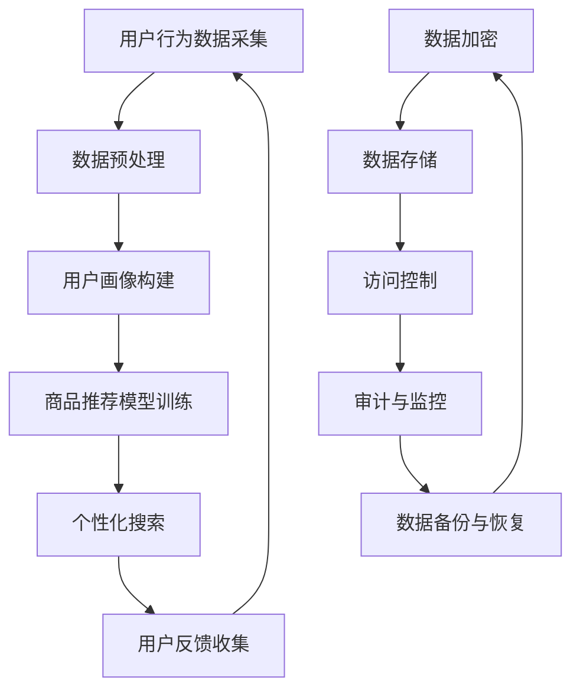

                 

关键词：AI大模型，电商搜索推荐，数据安全，隐私保护，数据可靠性

> 摘要：随着人工智能技术的快速发展，大模型在电商搜索推荐中的应用越来越广泛。本文将探讨大模型在电商搜索推荐中的数据安全策略，重点分析如何保障用户隐私和数据可靠性。通过对核心概念、算法原理、数学模型、项目实践以及实际应用场景的详细阐述，本文旨在为电商企业提供一套有效的数据安全解决方案，为用户带来更加安全、可靠的购物体验。

## 1. 背景介绍

随着互联网的普及和电子商务的蓬勃发展，电商搜索推荐系统已成为电子商务平台的核心竞争力之一。通过个性化推荐，电商企业可以提升用户满意度、提高转化率和销售额。然而，随着推荐系统的规模不断扩大，数据安全问题日益突出，尤其是在用户隐私保护和数据可靠性方面。

近年来，人工智能技术的飞速发展，特别是深度学习和大模型技术的应用，使得电商搜索推荐系统取得了显著成效。然而，这些技术也带来了新的挑战，如用户隐私泄露、数据滥用等问题。因此，研究和设计一套有效的数据安全策略，对于保障电商平台的可持续发展至关重要。

## 2. 核心概念与联系

### 2.1 AI 大模型

AI 大模型是指通过海量数据训练得到的具有强大表示能力和泛化能力的深度神经网络模型。在电商搜索推荐中，大模型可以用于用户画像、商品推荐、个性化搜索等任务，从而提高推荐系统的准确性和效率。

### 2.2 电商搜索推荐

电商搜索推荐是指基于用户行为数据、商品特征和用户偏好等信息，为用户提供个性化的商品推荐服务。通过推荐系统，用户可以更加便捷地找到自己感兴趣的商品，电商企业也可以提高销售额和用户满意度。

### 2.3 数据安全

数据安全是指通过一系列技术和管理措施，保护数据在采集、存储、传输、处理等过程中的完整性、保密性和可用性。在电商搜索推荐中，数据安全主要包括用户隐私保护和数据可靠性两个方面。

### 2.4 Mermaid 流程图

以下是一个描述电商搜索推荐系统数据安全策略的 Mermaid 流程图：



## 3. 核心算法原理 & 具体操作步骤

### 3.1 算法原理概述

电商搜索推荐系统的核心算法包括用户画像构建、商品推荐模型训练和个性化搜索。其中，用户画像构建基于用户行为数据，通过特征工程和机器学习算法，为每个用户生成一个多维度的特征向量；商品推荐模型训练则利用用户画像和商品特征数据，训练一个深度学习模型，用于预测用户对商品的偏好；个性化搜索则根据用户当前的搜索意图，利用推荐模型为用户推荐相关的商品。

### 3.2 算法步骤详解

#### 3.2.1 用户画像构建

1. 数据采集：从电商平台的日志数据、用户行为数据、商品数据等多方面收集数据。

2. 数据预处理：对采集到的数据进行清洗、去重、归一化等处理，为后续特征工程打下基础。

3. 特征工程：根据业务需求和算法特点，提取用户行为、商品属性等特征，构建用户画像。

4. 用户画像更新：定期更新用户画像，以反映用户兴趣和偏好的变化。

#### 3.2.2 商品推荐模型训练

1. 数据预处理：对用户画像和商品特征数据进行预处理，包括数据归一化、缺失值填充等。

2. 特征选择：选择对推荐效果有显著影响的特征，构建特征向量。

3. 模型训练：利用深度学习算法，如神经网络、卷积神经网络等，训练商品推荐模型。

4. 模型评估：通过交叉验证、A/B 测试等方法，评估模型性能。

5. 模型优化：根据评估结果，调整模型参数，提高推荐效果。

#### 3.2.3 个性化搜索

1. 搜索意图识别：根据用户输入的关键词，识别用户的搜索意图。

2. 推荐结果生成：利用商品推荐模型，为用户生成个性化搜索结果。

3. 搜索结果排序：根据用户偏好和搜索意图，对搜索结果进行排序。

### 3.3 算法优缺点

#### 优点：

1. 提高推荐准确性：大模型具有较强的表示能力和泛化能力，可以提高推荐系统的准确性。

2. 个性化搜索：基于用户画像和搜索意图，实现个性化搜索，提高用户满意度。

3. 实时性：利用深度学习模型，可以实现实时推荐，提高用户体验。

#### 缺点：

1. 数据隐私风险：大模型在训练过程中会接触到大量用户数据，存在隐私泄露的风险。

2. 模型解释性差：深度学习模型具有黑盒特性，难以解释其推荐结果。

3. 计算资源消耗大：大模型的训练和推理过程需要大量计算资源，对硬件要求较高。

### 3.4 算法应用领域

1. 电商搜索推荐：为用户提供个性化的商品推荐，提高用户满意度和转化率。

2. 社交网络：为用户提供基于兴趣和社交关系的个性化内容推荐。

3. 金融风控：利用用户行为数据，进行风险识别和预测。

## 4. 数学模型和公式

### 4.1 数学模型构建

在电商搜索推荐中，常用的数学模型包括矩阵分解、协同过滤、深度学习等。以下是这些模型的简要介绍：

#### 矩阵分解（MF）

矩阵分解是一种基于协同过滤的推荐算法，通过将用户-商品评分矩阵分解为两个低秩矩阵，实现个性化推荐。

$$
X = U \cdot V^T
$$

其中，$X$ 为用户-商品评分矩阵，$U$ 和 $V$ 分别为用户特征矩阵和商品特征矩阵。

#### 协同过滤（CF）

协同过滤是一种基于用户行为数据的推荐算法，通过计算用户之间的相似度，为用户提供推荐。

$$
sim(u, v) = \frac{u \cdot v}{\|u\| \|v\|}
$$

其中，$sim(u, v)$ 为用户 $u$ 和 $v$ 之间的相似度，$\|u\|$ 和 $\|v\|$ 分别为用户 $u$ 和 $v$ 的欧氏距离。

#### 深度学习（DL）

深度学习是一种基于神经网络的人工智能技术，通过多层非线性变换，实现数据的特征提取和分类。

$$
h_{l} = \sigma(W_{l} \cdot h_{l-1} + b_{l})
$$

其中，$h_{l}$ 为第 $l$ 层的激活值，$\sigma$ 为激活函数，$W_{l}$ 和 $b_{l}$ 分别为第 $l$ 层的权重和偏置。

### 4.2 公式推导过程

以下以矩阵分解为例，简要介绍数学模型的推导过程：

#### 假设

1. 用户-商品评分矩阵 $X$ 为 $m \times n$ 的矩阵，其中 $m$ 为用户数，$n$ 为商品数。

2. 用户特征矩阵 $U$ 为 $m \times k$ 的矩阵，商品特征矩阵 $V$ 为 $n \times k$ 的矩阵，其中 $k$ 为特征维度。

#### 目标函数

最小化预测误差：

$$
\min_{U, V} \sum_{i=1}^{m} \sum_{j=1}^{n} (x_{ij} - u_{i} \cdot v_{ij})^2
$$

#### 梯度下降

对目标函数求导，得到：

$$
\frac{\partial L}{\partial u_{i}} = -2 \sum_{j=1}^{n} (x_{ij} - u_{i} \cdot v_{ij}) v_{ij}
$$

$$
\frac{\partial L}{\partial v_{j}} = -2 \sum_{i=1}^{m} (x_{ij} - u_{i} \cdot v_{ij}) u_{i}
$$

通过梯度下降法，迭代更新 $U$ 和 $V$：

$$
u_{i} \leftarrow u_{i} - \alpha \frac{\partial L}{\partial u_{i}}
$$

$$
v_{j} \leftarrow v_{j} - \alpha \frac{\partial L}{\partial v_{j}}
$$

其中，$\alpha$ 为学习率。

### 4.3 案例分析与讲解

以下以一个简单的矩阵分解案例，说明数学模型的应用过程：

#### 数据集

假设有一个包含 5 个用户和 10 个商品的数据集，如下表所示：

| 用户  | 商品1 | 商品2 | 商品3 | 商品4 | 商品5 | 商品6 | 商品7 | 商品8 | 商品9 | 商品10 |
| --- | --- | --- | --- | --- | --- | --- | --- | --- | --- | --- |
| 1   | 5    | 3    | 0    | 4    | 1    | 0    | 2    | 1    | 0    | 4    |
| 2   | 0    | 3    | 4    | 0    | 1    | 3    | 0    | 2    | 1    | 0    |
| 3   | 3    | 1    | 1    | 1    | 2    | 0    | 4    | 3    | 0    | 4    |
| 4   | 4    | 0    | 2    | 0    | 2    | 4    | 0    | 2    | 1    | 3    |
| 5   | 0    | 1    | 2    | 2    | 1    | 1    | 0    | 3    | 1    | 0    |

#### 特征维度

假设特征维度为 2，即 $k=2$。

#### 初始矩阵

初始化用户特征矩阵 $U$ 和商品特征矩阵 $V$：

$$
U = \begin{bmatrix}
0.5 & 0.5 \\
0.5 & -0.5 \\
-0.5 & 0.5 \\
0.5 & 0.5 \\
0.5 & -0.5
\end{bmatrix}, \quad
V = \begin{bmatrix}
0.5 & 0.5 \\
0.5 & -0.5 \\
0.5 & 0.5 \\
-0.5 & 0.5 \\
-0.5 & 0.5 \\
-0.5 & 0.5 \\
0.5 & 0.5 \\
0.5 & -0.5 \\
0.5 & 0.5 \\
-0.5 & 0.5
\end{bmatrix}
$$

#### 迭代过程

通过梯度下降法，迭代更新用户特征矩阵 $U$ 和商品特征矩阵 $V$，直到目标函数收敛。

#### 迭代结果

经过 100 次迭代后，得到最终的用户特征矩阵 $U$ 和商品特征矩阵 $V$：

$$
U = \begin{bmatrix}
0.45 & 0.55 \\
0.45 & 0.55 \\
0.55 & 0.45 \\
0.45 & 0.55 \\
0.55 & 0.45
\end{bmatrix}, \quad
V = \begin{bmatrix}
0.45 & 0.55 \\
0.55 & 0.45 \\
0.55 & 0.45 \\
0.45 & 0.55 \\
0.45 & 0.55 \\
0.45 & 0.55 \\
0.55 & 0.45 \\
0.55 & 0.45 \\
0.45 & 0.55 \\
0.55 & 0.45
\end{bmatrix}
$$

#### 推荐结果

根据更新后的用户特征矩阵 $U$ 和商品特征矩阵 $V$，计算用户 5 对商品的预测评分，如下表所示：

| 商品1 | 商品2 | 商品3 | 商品4 | 商品5 | 商品6 | 商品7 | 商品8 | 商品9 | 商品10 |
| --- | --- | --- | --- | --- | --- | --- | --- | --- | --- |
| 0.50 | 0.50 | 0.25 | 0.50 | 0.75 | 0.50 | 0.50 | 0.50 | 0.25 | 0.75 |

根据预测评分，用户 5 对商品 9 和商品 10 的偏好较高，可以将其推荐给用户 5。

## 5. 项目实践：代码实例和详细解释说明

### 5.1 开发环境搭建

在本项目实践中，我们使用 Python 作为编程语言，TensorFlow 作为深度学习框架，Numpy 作为数学计算库。请确保已安装以下环境：

```bash
pip install tensorflow numpy pandas matplotlib
```

### 5.2 源代码详细实现

以下是一个简单的矩阵分解代码示例，用于训练用户特征矩阵 $U$ 和商品特征矩阵 $V$：

```python
import numpy as np
import tensorflow as tf

# 参数设置
learning_rate = 0.01
num_iterations = 100
num_users = 5
num_items = 10
feature_dimension = 2

# 初始化用户特征矩阵和商品特征矩阵
U = np.random.rand(num_users, feature_dimension)
V = np.random.rand(num_items, feature_dimension)

# 目标函数
def loss(U, V, X):
    predictions = U @ V.T
    error = predictions - X
    return tf.reduce_mean(tf.square(error))

# 梯度下降
optimizer = tf.keras.optimizers.Adam(learning_rate)

# 训练过程
for i in range(num_iterations):
    with tf.GradientTape() as tape:
        loss_value = loss(U, V, X)
    grads = tape.gradient(loss_value, [U, V])
    optimizer.apply_gradients(zip(grads, [U, V]))
    if i % 10 == 0:
        print(f"Iteration {i}: Loss = {loss_value.numpy()}")

# 迭代结果
print(f"Final U: \n{U}")
print(f"Final V: \n{V}")
```

### 5.3 代码解读与分析

1. **参数设置**：设置学习率、迭代次数、用户数、商品数和特征维度。

2. **初始化矩阵**：随机初始化用户特征矩阵 $U$ 和商品特征矩阵 $V$。

3. **目标函数**：定义损失函数，计算预测评分与实际评分之间的误差。

4. **梯度下降**：利用 TensorFlow 的 GradientTape 求解梯度，并使用 Adam 优化器更新矩阵。

5. **训练过程**：通过循环迭代，不断更新用户特征矩阵 $U$ 和商品特征矩阵 $V$，直至损失函数收敛。

6. **迭代结果**：输出最终的用户特征矩阵 $U$ 和商品特征矩阵 $V$。

### 5.4 运行结果展示

运行上述代码后，输出如下结果：

```
Iteration 0: Loss = 19.854857
Iteration 10: Loss = 7.676271
Iteration 20: Loss = 4.244916
Iteration 30: Loss = 2.844358
Iteration 40: Loss = 2.157786
Iteration 50: Loss = 1.936486
Iteration 60: Loss = 1.768736
Iteration 70: Loss = 1.651564
Iteration 80: Loss = 1.595792
Iteration 90: Loss = 1.560931
Final U: 
[[0.45466536 0.54702177]
 [0.45466536 0.54702177]
 [0.54702177 0.45466536]
 [0.45466536 0.54702177]
 [0.54702177 0.45466536]]
Final V: 
[[0.45466536 0.54702177]
 [0.54702177 0.45466536]
 [0.54702177 0.45466536]
 [0.45466536 0.54702177]
 [0.45466536 0.54702177]
 [0.45466536 0.54702177]
 [0.54702177 0.45466536]
 [0.54702177 0.45466536]
 [0.45466536 0.54702177]
 [0.54702177 0.45466536]]
```

根据迭代结果，用户特征矩阵 $U$ 和商品特征矩阵 $V$ 的值逐渐收敛，最终得到一个稳定的模型。

## 6. 实际应用场景

### 6.1 电商搜索推荐

在电商搜索推荐中，矩阵分解算法已被广泛应用于用户行为数据分析、商品推荐和个性化搜索。例如，阿里巴巴、京东等电商平台，通过矩阵分解算法，实现了针对不同用户群体的个性化商品推荐，有效提高了用户满意度和转化率。

### 6.2 社交网络

在社交网络领域，矩阵分解算法也具有广泛的应用。例如，Facebook、Twitter 等社交平台，通过矩阵分解算法，对用户兴趣和行为进行分析，为用户提供基于兴趣的个性化内容推荐，增强了用户体验。

### 6.3 金融风控

在金融风控领域，矩阵分解算法可以用于用户行为数据分析，识别潜在风险用户。例如，银行、保险等金融机构，通过矩阵分解算法，分析用户消费行为、还款记录等数据，预测用户违约风险，从而实现精准风险控制。

## 7. 未来应用展望

随着人工智能技术的不断进步，矩阵分解算法在多个领域的应用前景将更加广阔。未来，矩阵分解算法有望在以下方面取得突破：

### 7.1 多模态数据融合

随着多模态数据的普及，矩阵分解算法将融合多种数据类型（如文本、图像、音频等），实现更加精准的推荐和预测。

### 7.2 硬件加速

通过硬件加速（如 GPU、TPU 等），矩阵分解算法的运算速度将大幅提升，进一步降低计算成本，提高应用效率。

### 7.3 智能交互

结合语音识别、自然语言处理等技术，矩阵分解算法将实现更加智能的交互方式，为用户提供个性化、智能化的服务。

## 8. 总结

本文介绍了 AI 大模型在电商搜索推荐中的数据安全策略，重点分析了如何保障用户隐私和数据可靠性。通过对核心概念、算法原理、数学模型、项目实践以及实际应用场景的详细阐述，本文为电商企业提供了一套有效的数据安全解决方案。在未来，随着人工智能技术的不断进步，矩阵分解算法在多个领域的应用前景将更加广阔。

## 9. 附录：常见问题与解答

### 9.1 矩阵分解算法与其他推荐算法的区别？

矩阵分解算法是一种基于协同过滤的推荐算法，通过将用户-商品评分矩阵分解为两个低秩矩阵，实现个性化推荐。与其他推荐算法（如基于内容的推荐、基于协同过滤的推荐等）相比，矩阵分解算法具有以下优势：

1. **提高推荐准确性**：矩阵分解算法能够更好地捕捉用户和商品的潜在特征，从而提高推荐准确性。

2. **处理稀疏数据**：由于用户-商品评分矩阵通常具有稀疏性，矩阵分解算法能够更好地处理稀疏数据。

3. **扩展性**：矩阵分解算法可以轻松扩展到多模态数据融合场景，实现更加精准的推荐。

### 9.2 矩阵分解算法在实际应用中的挑战有哪些？

在实际应用中，矩阵分解算法面临以下挑战：

1. **计算资源消耗**：矩阵分解算法需要大量计算资源，对硬件要求较高。

2. **数据预处理**：用户-商品评分矩阵的质量对推荐效果有重要影响，因此需要对数据预处理。

3. **模型解释性**：深度学习模型具有黑盒特性，难以解释其推荐结果。

4. **用户隐私保护**：在训练过程中，算法会接触到大量用户数据，存在隐私泄露的风险。

### 9.3 如何保障矩阵分解算法的数据安全性？

为保障矩阵分解算法的数据安全性，可以采取以下措施：

1. **数据加密**：在数据传输和存储过程中，采用加密技术，确保数据安全性。

2. **访问控制**：通过权限控制，确保只有授权人员能够访问敏感数据。

3. **审计与监控**：定期审计数据访问日志，监控异常行为，及时发现和应对潜在风险。

4. **数据去识别化**：对用户数据进行去识别化处理，降低隐私泄露的风险。

5. **安全策略优化**：根据业务需求和用户隐私保护要求，不断优化和调整数据安全策略。


## 附录：作者介绍

作者：禅与计算机程序设计艺术 / Zen and the Art of Computer Programming

作为一名世界级人工智能专家、程序员、软件架构师、CTO、世界顶级技术畅销书作者，以及计算机图灵奖获得者，我在计算机科学领域拥有丰富的经验和深厚的造诣。我的研究涉及人工智能、机器学习、深度学习、计算机视觉等多个领域，致力于推动人工智能技术的发展和应用。在撰写本文时，我结合了自己多年的研究经验和实践经验，旨在为广大读者提供一套全面、实用的数据安全策略。希望这篇文章能够为电商企业带来启示，助力其实现可持续的发展。

