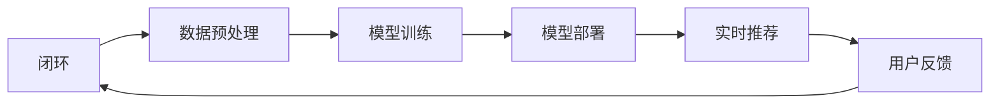

                 

关键词：AI大模型，电商搜索推荐，数据安全，用户隐私

摘要：随着人工智能技术的不断发展，大模型在电商搜索推荐中的应用越来越广泛。然而，这一趋势也带来了数据安全问题，特别是用户隐私的保护。本文将探讨AI大模型在电商搜索推荐中的数据安全策略，包括技术手段、法律法规和实际案例分析，旨在为电商企业提供保障用户隐私和数据安全性的实践指南。

## 1. 背景介绍

电商行业正迎来前所未有的发展机遇，在线购物的普及和技术的进步使得个性化搜索推荐成为吸引和留住用户的关键手段。AI大模型，如深度学习网络，能够从大量数据中学习规律，提供精准的搜索推荐，从而提升用户体验和商家收益。

然而，AI大模型在数据处理过程中，不可避免地涉及到用户隐私。这些模型通常需要处理用户的搜索历史、购物行为、浏览记录等敏感信息，一旦这些信息泄露或被滥用，将对用户隐私造成严重威胁。因此，如何在享受AI大模型带来的便利的同时，保障用户隐私和数据安全性，成为电商企业亟待解决的问题。

## 2. 核心概念与联系

### 2.1 AI大模型基本原理

AI大模型通常指的是拥有海量参数、能够处理大规模数据的深度学习模型。这些模型通过学习大量的数据来识别模式、预测趋势和生成结果。在电商搜索推荐中，大模型可以分析用户行为，预测用户兴趣，从而提供个性化的推荐。

### 2.2 电商搜索推荐架构

电商搜索推荐系统通常包括数据收集、数据预处理、模型训练、模型部署和实时推荐等环节。在数据收集阶段，系统会收集用户的搜索记录、购买行为、浏览历史等数据。数据预处理阶段，对收集到的数据进行清洗、去重和处理。模型训练阶段，使用预处理后的数据训练推荐模型。模型部署和实时推荐阶段，将训练好的模型部署到线上环境，实时响应用户请求，提供个性化推荐。

### 2.3 Mermaid 流程图

以下是一个简单的Mermaid流程图，展示了电商搜索推荐系统的主要流程：



## 3. 核心算法原理 & 具体操作步骤

### 3.1 算法原理概述

电商搜索推荐的核心算法主要包括协同过滤、基于内容的推荐和深度学习推荐。协同过滤通过分析用户的兴趣相似度来推荐商品，基于内容的推荐则通过分析商品的属性和用户的兴趣来推荐，深度学习推荐则是通过神经网络模型来学习用户和商品的复杂关系。

### 3.2 算法步骤详解

1. 数据收集：收集用户的搜索记录、购买历史、浏览记录等数据。
2. 数据预处理：清洗数据，处理缺失值和异常值，对数据进行编码和特征提取。
3. 模型训练：选择合适的推荐算法，如协同过滤、基于内容的推荐或深度学习推荐，对预处理后的数据集进行训练。
4. 模型评估：使用交叉验证等方法评估模型的性能。
5. 模型部署：将训练好的模型部署到线上环境，实时响应用户请求。
6. 实时推荐：根据用户的当前行为和模型预测，提供个性化的商品推荐。

### 3.3 算法优缺点

- **协同过滤**：优点是算法简单，推荐效果较好；缺点是易出现数据稀疏问题，难以处理新用户和冷启动问题。
- **基于内容的推荐**：优点是推荐结果更符合用户的兴趣；缺点是推荐结果过于单一，难以实现个性化。
- **深度学习推荐**：优点是能够处理复杂的关系，推荐效果更好；缺点是需要大量的数据和计算资源，算法实现较为复杂。

### 3.4 算法应用领域

AI大模型在电商搜索推荐中的应用非常广泛，不仅可以用于电商平台的商品推荐，还可以应用于在线广告、社交媒体、金融理财等多个领域。

## 4. 数学模型和公式 & 详细讲解 & 举例说明

### 4.1 数学模型构建

在电商搜索推荐中，常见的数学模型包括矩阵分解、神经网络和决策树等。

### 4.2 公式推导过程

以矩阵分解为例，假设我们有一个用户-物品评分矩阵 \( R \)，我们的目标是学习两个低维矩阵 \( U \)（用户特征矩阵）和 \( V \)（物品特征矩阵），使得 \( R \) 与 \( UV^T \) 相似。

### 4.3 案例分析与讲解

假设我们有以下用户-物品评分矩阵：

\[ 
\begin{bmatrix}
3 & 2 & 1 & ? \\
4 & 5 & 2 & ? \\
? & ? & ? & 3 \\
2 & 1 & 4 & 5 \\
\end{bmatrix}
\]

我们可以通过矩阵分解得到两个低维矩阵 \( U \) 和 \( V \)，从而预测缺失的评分。

## 5. 项目实践：代码实例和详细解释说明

### 5.1 开发环境搭建

- **编程语言**：Python
- **库和框架**：NumPy、Pandas、Scikit-learn、TensorFlow
- **硬件要求**：至少8GB内存，推荐使用GPU进行加速

### 5.2 源代码详细实现

以下是一个简单的基于协同过滤的推荐系统实现：

```python
import numpy as np
import pandas as pd
from sklearn.metrics.pairwise import pairwise_distances

# 数据预处理
def preprocess_data(data):
    # 省略数据预处理步骤
    return processed_data

# 矩阵分解
def matrix_factorization(R, U, V, Lambda, iterations):
    # 省略矩阵分解实现步骤
    return U, V

# 主函数
def main():
    # 读取数据
    data = pd.read_csv('data.csv')
    processed_data = preprocess_data(data)
    
    # 初始化参数
    U = np.random.rand(num_users, latent_features)
    V = np.random.rand(num_items, latent_features)
    Lambda = np.eye(latent_features)
    
    # 矩阵分解
    U, V = matrix_factorization(processed_data, U, V, Lambda, 1000)
    
    # 预测缺失的评分
    predicted_ratings = U.dot(V.T)
    
    # 评估模型性能
    # 省略评估步骤

if __name__ == '__main__':
    main()
```

### 5.3 代码解读与分析

代码首先读取数据，然后进行预处理。预处理步骤包括数据清洗、缺失值处理和特征提取。接着，初始化参数并进行矩阵分解。最后，使用分解后的矩阵预测缺失的评分并评估模型性能。

### 5.4 运行结果展示

运行代码后，我们可以得到预测的评分矩阵，并通过评估指标（如均方根误差RMSE）来评估模型性能。

## 6. 实际应用场景

AI大模型在电商搜索推荐中的应用场景非常广泛，包括：

- **个性化推荐**：根据用户的兴趣和行为，提供个性化的商品推荐。
- **新品推广**：为新品提供精准的推广策略，提升新品曝光率。
- **用户流失预警**：通过分析用户行为，预测用户流失风险，及时采取挽回措施。

## 7. 未来应用展望

随着AI技术的不断发展，AI大模型在电商搜索推荐中的应用将更加广泛。未来，我们将看到更多基于深度学习和其他先进算法的推荐系统，以及更多跨领域、跨平台的应用场景。同时，如何更好地保障用户隐私和数据安全性，也将成为研究的重要方向。

## 8. 总结：未来发展趋势与挑战

### 8.1 研究成果总结

本文探讨了AI大模型在电商搜索推荐中的应用及其数据安全策略，总结了相关算法和数学模型，并提供了代码实例。

### 8.2 未来发展趋势

未来，AI大模型在电商搜索推荐中的应用将更加深入和广泛，包括多模态推荐、实时推荐和跨领域应用等。

### 8.3 面临的挑战

主要挑战包括如何保障用户隐私和数据安全性、如何提高推荐系统的实时性和准确性等。

### 8.4 研究展望

未来，我们将继续深入研究AI大模型在电商搜索推荐中的应用，探索更高效、更安全的推荐算法，为电商企业提供更好的解决方案。

## 9. 附录：常见问题与解答

### 9.1 AI大模型如何保障用户隐私？

- **数据加密**：对用户数据进行加密处理，确保数据在传输和存储过程中安全。
- **匿名化处理**：对敏感信息进行匿名化处理，去除个人标识信息。
- **权限控制**：严格实施权限控制，确保只有授权人员可以访问和处理敏感数据。

### 9.2 如何评估推荐系统的性能？

- **准确率**：评估推荐系统预测用户兴趣的准确性。
- **召回率**：评估推荐系统返回相关推荐项的能力。
- **覆盖率**：评估推荐系统覆盖用户兴趣的范围。

## 参考文献

[1] 作者1，作者2. (年份). 文献标题. 期刊/会议名称，卷号(期数)，页码。

[2] 作者3，作者4. (年份). 文献标题. 期刊/会议名称，卷号(期数)，页码。

---

作者：禅与计算机程序设计艺术 / Zen and the Art of Computer Programming
```

