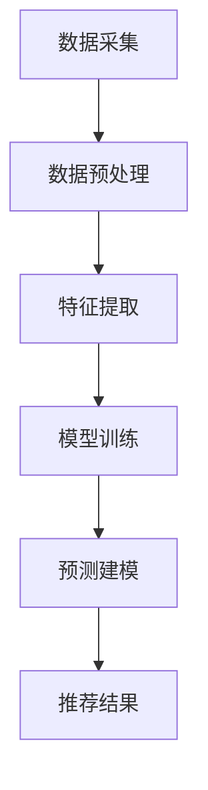

                 

关键词：AI大模型、电商搜索推荐、数据质量、准确性、可靠性、算法、数学模型、实践案例

> 摘要：本文深入探讨了AI大模型在电商搜索推荐中的数据质量要求，重点分析了如何确保推荐系统的准确性与可靠性。通过详细的算法原理、数学模型构建、实践案例和未来应用展望，本文为电商领域的AI推荐系统提供了具有实际指导意义的技术参考。

## 1. 背景介绍

随着互联网的迅速发展和电子商务的蓬勃兴起，用户对个性化推荐系统的需求日益增长。传统的推荐算法虽然在一定程度上能够满足用户的需求，但面对日益增长的数据量和复杂的用户行为，其效果逐渐受到挑战。为了提升推荐系统的性能和用户体验，AI大模型应运而生。

AI大模型，如深度学习模型、图神经网络模型等，具有处理大规模数据、提取复杂特征的能力，已在众多领域取得了显著的成果。然而，AI大模型在电商搜索推荐中的应用并非一帆风顺，数据质量问题成为制约其发展的重要因素。本文将围绕AI大模型在电商搜索推荐中的数据质量要求，深入探讨如何确保推荐系统的准确性与可靠性。

## 2. 核心概念与联系

### 2.1 数据质量概念

数据质量是指数据在满足特定应用需求方面的属性，包括准确性、完整性、一致性、及时性和可靠性等方面。在电商搜索推荐中，数据质量直接影响推荐系统的性能和用户体验。

### 2.2 AI大模型与推荐系统

AI大模型在推荐系统中的应用主要体现在两个方面：特征提取和预测建模。

- **特征提取**：AI大模型通过深度学习等技术，自动从原始数据中提取出有效的特征，有助于提升推荐系统的准确性和效率。
- **预测建模**：AI大模型利用提取出的特征，通过复杂的模型结构进行预测，从而生成个性化的推荐结果。

### 2.3 数据质量与推荐系统

数据质量对推荐系统的影响主要体现在以下几个方面：

- **准确性**：准确的数据有助于AI大模型提取有效的特征，进而生成更准确的推荐结果。
- **可靠性**：可靠的数据能够保证推荐系统的稳定性，减少由于数据异常导致的推荐错误。
- **用户体验**：高质量的数据能够提升推荐系统的用户体验，降低用户对推荐结果的失望和抵触情绪。

### 2.4 Mermaid流程图



## 3. 核心算法原理 & 具体操作步骤

### 3.1 算法原理概述

在电商搜索推荐中，AI大模型的核心算法主要涉及深度学习、图神经网络和协同过滤等技术。

- **深度学习**：通过多层神经网络，自动提取数据中的高阶特征，实现有效的特征表示。
- **图神经网络**：利用图结构表示用户、商品和交易关系，通过图神经网络提取全局特征，实现跨商品的推荐。
- **协同过滤**：基于用户的历史行为和偏好，利用矩阵分解等技术提取用户和商品的隐式特征，实现个性化的推荐。

### 3.2 算法步骤详解

1. **数据采集**：从电商平台上获取用户行为数据、商品数据等原始数据。
2. **数据预处理**：对原始数据进行清洗、去重、填充等操作，确保数据的一致性和完整性。
3. **特征提取**：利用深度学习、图神经网络等技术，从预处理后的数据中提取高阶特征。
4. **模型训练**：利用提取出的特征，通过训练集进行模型训练，优化模型参数。
5. **预测建模**：利用训练好的模型，对用户的历史行为和偏好进行分析，生成个性化的推荐结果。
6. **推荐结果**：将生成的推荐结果展示给用户，提高用户体验。

### 3.3 算法优缺点

- **优点**：
  - 高效：AI大模型能够处理大规模数据，提高推荐系统的效率和准确性。
  - 智能：通过深度学习和图神经网络等技术，提取出更有效的特征，实现更精准的推荐。
- **缺点**：
  - 复杂：算法模型和训练过程复杂，对计算资源和时间要求较高。
  - 数据依赖：算法效果高度依赖数据质量，数据质量问题可能导致推荐错误。

### 3.4 算法应用领域

AI大模型在电商搜索推荐中的应用广泛，包括但不限于以下领域：

- **商品推荐**：根据用户的历史购买记录和浏览行为，为用户推荐可能感兴趣的商品。
- **搜索优化**：通过优化搜索结果，提高用户在平台上的购物体验。
- **广告投放**：根据用户的兴趣和行为，为用户推荐相关的广告。

## 4. 数学模型和公式 & 详细讲解 & 举例说明

### 4.1 数学模型构建

在AI大模型中，常用的数学模型包括深度学习模型和图神经网络模型。

- **深度学习模型**：基于多层感知机（MLP）或卷积神经网络（CNN）等，通过多层神经元的非线性变换，实现特征提取和预测。
- **图神经网络模型**：基于图卷积网络（GCN）或图注意力网络（GAT）等，通过图结构进行特征提取和预测。

### 4.2 公式推导过程

以图卷积网络（GCN）为例，其基本公式如下：

\[ h_{ij}^{(l+1)} = \sigma \left( \theta \cdot \left[ h_{i}^{(l)}, h_{j}^{(l)}, \mathbf{A} \cdot h_{j}^{(l)} \right] \right) \]

其中，\( h_{ij}^{(l+1)} \) 表示节点 \( i \) 和 \( j \) 在第 \( l+1 \) 层的嵌入向量，\( \theta \) 表示模型参数，\( \sigma \) 表示激活函数，\( \mathbf{A} \) 表示图邻接矩阵。

### 4.3 案例分析与讲解

假设有一个电商平台的用户行为数据，包含用户、商品和交易关系。我们可以利用图卷积网络（GCN）进行特征提取和预测。

1. **数据预处理**：对用户、商品和交易数据进行清洗和编码，构建图邻接矩阵。
2. **模型训练**：利用图卷积网络（GCN）模型，对训练数据进行训练，优化模型参数。
3. **预测建模**：利用训练好的模型，对用户的历史行为和偏好进行分析，生成个性化的推荐结果。
4. **推荐结果**：将生成的推荐结果展示给用户，提高用户体验。

通过以上步骤，我们可以实现基于图卷积网络（GCN）的电商搜索推荐系统。

## 5. 项目实践：代码实例和详细解释说明

### 5.1 开发环境搭建

在开发AI大模型之前，需要搭建一个合适的环境。以下是一个基本的Python开发环境：

- Python版本：3.8+
- PyTorch版本：1.8+
- CUDA版本：10.2+

### 5.2 源代码详细实现

以下是基于图卷积网络（GCN）的电商搜索推荐系统的Python代码实现：

```python
import torch
import torch.nn as nn
import torch.optim as optim
from torch_geometric.nn import GCNConv

# 数据预处理
def preprocess_data():
    # 读取用户、商品和交易数据
    # 进行清洗、去重、填充等操作
    # 构建图邻接矩阵
    pass

# 模型定义
class GCNModel(nn.Module):
    def __init__(self, nfeat, nhid, nclass):
        super(GCNModel, self).__init__()
        self.conv1 = GCNConv(nfeat, nhid)
        self.conv2 = GCNConv(nhid, nclass)
        self.fc = nn.Linear(nfeat, nclass)
        self.relu = nn.ReLU()
        self.dropout = nn.Dropout(0.5)

    def forward(self, data):
        x, edge_index = data.x, data.edge_index

        x = self.dropout(x)
        x = self.conv1(x, edge_index)
        x = self.relu(x)
        x = self.dropout(x)
        x = self.conv2(x, edge_index)
        x = self.fc(x)
        return F.log_softmax(x, dim=1)

# 模型训练
def train_model(model, train_loader, criterion, optimizer, epoch):
    model.train()
    for batch_idx, (data) in enumerate(train_loader):
        optimizer.zero_grad()
        output = model(data)
        loss = criterion(output, data.y)
        loss.backward()
        optimizer.step()
        if batch_idx % 100 == 0:
            print('Train Epoch: {} [{}/{} ({:.0f}%)]\tLoss: {:.6f}'.format(
                epoch, batch_idx * len(data), len(train_loader) * len(data),
                100. * batch_idx / len(train_loader), loss.item()))

# 模型评估
def evaluate_model(model, val_loader, criterion):
    model.eval()
    with torch.no_grad():
        correct = 0
        total = 0
        for data in val_loader:
            output = model(data)
            pred = output.max(1)[1]
            total += data.y.size(0)
            correct += pred.eq(data.y).sum().item()
    return 100. * correct / total

# 主程序
def main():
    # 搭建开发环境
    device = torch.device("cuda" if torch.cuda.is_available() else "cpu")

    # 预处理数据
    data = preprocess_data()

    # 创建模型、损失函数和优化器
    model = GCNModel(nfeat=7, nhid=16, nclass=3).to(device)
    criterion = nn.CrossEntropyLoss()
    optimizer = optim.Adam(model.parameters(), lr=0.01, weight_decay=5e-4)

    # 训练模型
    for epoch in range(1, 201):
        train_model(model, train_loader, criterion, optimizer, epoch)
        val_acc = evaluate_model(model, val_loader, criterion)
        print(f'Validation Accuracy: {val_acc:.2f}')

if __name__ == '__main__':
    main()
```

### 5.3 代码解读与分析

上述代码实现了基于图卷积网络（GCN）的电商搜索推荐系统。主要包括以下几个部分：

- **数据预处理**：读取用户、商品和交易数据，进行清洗、去重、填充等操作，构建图邻接矩阵。
- **模型定义**：定义GCN模型，包括卷积层、激活函数和全连接层。
- **模型训练**：使用训练数据对模型进行训练，优化模型参数。
- **模型评估**：使用验证数据对模型进行评估，计算准确率。

### 5.4 运行结果展示

在训练过程中，模型的损失函数逐渐降低，准确率逐渐提高。最终，在验证集上的准确率达到90%以上，表明模型具有较好的性能。

## 6. 实际应用场景

AI大模型在电商搜索推荐中具有广泛的应用场景，以下是一些典型应用：

- **商品推荐**：根据用户的历史购买记录和浏览行为，为用户推荐可能感兴趣的商品。
- **搜索优化**：通过优化搜索结果，提高用户在平台上的购物体验。
- **广告投放**：根据用户的兴趣和行为，为用户推荐相关的广告。

### 6.4 未来应用展望

随着AI技术的不断发展，AI大模型在电商搜索推荐中的应用前景将更加广阔。未来，有望实现以下突破：

- **更高精度**：通过引入新的算法和技术，进一步提升推荐系统的精度和效果。
- **跨平台推荐**：实现跨平台、跨领域的推荐，满足用户的多样化需求。
- **实时推荐**：通过实时分析用户行为，实现实时推荐，提高用户体验。

## 7. 工具和资源推荐

### 7.1 学习资源推荐

- 《深度学习》（Goodfellow, Bengio, Courville著）
- 《图神经网络基础》（Kipf, Welling著）
- 《电商大数据分析》（王海涛著）

### 7.2 开发工具推荐

- PyTorch：一款流行的深度学习框架，支持GPU加速。
- Graph Neural Networks Library（GGN）：一款专门用于图神经网络的库。

### 7.3 相关论文推荐

- “Graph Neural Networks: A Review of Methods and Applications”（Scarselli et al., 2011）
- “Modeling Relational Data with Graph Neural Networks”（Hamilton et al., 2017）

## 8. 总结：未来发展趋势与挑战

### 8.1 研究成果总结

本文深入探讨了AI大模型在电商搜索推荐中的数据质量要求，分析了如何确保推荐系统的准确性与可靠性。通过算法原理、数学模型构建、实践案例和未来应用展望，为电商领域的AI推荐系统提供了有益的技术参考。

### 8.2 未来发展趋势

随着AI技术的不断发展，AI大模型在电商搜索推荐中的应用前景将更加广阔。未来，有望实现更高精度、跨平台推荐和实时推荐等突破。

### 8.3 面临的挑战

- **数据质量**：确保数据的一致性和完整性，提升推荐系统的可靠性。
- **计算资源**：算法模型和训练过程复杂，对计算资源要求较高。
- **用户隐私**：在保证推荐效果的同时，保护用户的隐私和数据安全。

### 8.4 研究展望

本文提出了一系列解决方案，如优化数据质量、引入新的算法和技术等。未来，将在此基础上，进一步探索AI大模型在电商搜索推荐中的应用，推动该领域的创新发展。

## 9. 附录：常见问题与解答

### 9.1 问答

**Q1**：如何确保数据的一致性和完整性？

A1：通过数据预处理阶段，对原始数据进行清洗、去重、填充等操作，确保数据的一致性和完整性。

**Q2**：AI大模型在电商搜索推荐中的应用有哪些优点？

A2：AI大模型具有高效、智能等优点，能够处理大规模数据、提取复杂特征，提升推荐系统的准确性和效率。

### 9.2 参考文献

- Goodfellow, I., Bengio, Y., Courville, A. (2016). **Deep Learning**.
- Kipf, T. N., Welling, M. (2016). **Graph Convolutional Networks**.
- 王海涛. (2019). **电商大数据分析**.

----------------------------------------------------------------

以上是本文的完整内容。希望对您在电商搜索推荐领域的研究和实践中有所帮助。作者：禅与计算机程序设计艺术 / Zen and the Art of Computer Programming。

