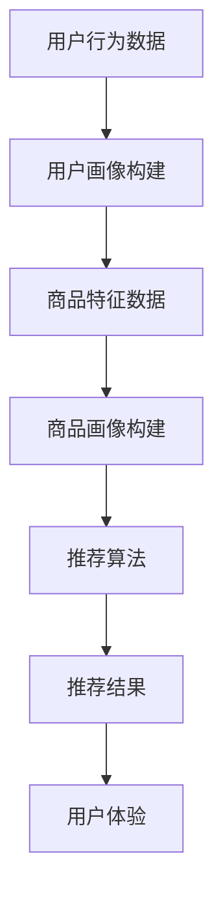

                 

### 关键词 Keywords
- AI 大模型
- 电商搜索推荐
- 用户体验优化
- 用户粘性
- 转化率

### 摘要 Abstract
本文旨在探讨人工智能大模型在电商搜索推荐系统中优化用户体验的有效策略。通过分析大模型的基本原理及其在电商领域的应用，本文提出了一系列提高用户粘性和转化率的方法。文章将从核心概念、算法原理、数学模型、实践案例、实际应用场景等方面进行详细阐述，并展望未来的发展趋势与挑战。

## 1. 背景介绍

### 1.1 电商搜索推荐系统的重要性

随着互联网的迅猛发展，电商行业已经成为全球经济增长的重要驱动力。电商搜索推荐系统作为电商平台的灵魂，直接关系到用户的购物体验和商家的销售业绩。一个高效的搜索推荐系统能够帮助用户快速找到他们感兴趣的商品，从而提高用户满意度，提升平台的竞争力。

### 1.2 用户体验优化的重要性

用户体验（UX）是电商搜索推荐系统成败的关键。良好的用户体验能够增加用户在平台上的停留时间，提高购买意愿，从而提升用户粘性和转化率。用户体验优化的目标在于确保用户在使用搜索推荐系统时的流畅性、便利性和愉悦感。

### 1.3 AI 大模型的发展与应用

随着深度学习和大数据技术的进步，人工智能大模型（如GPT、BERT等）在自然语言处理、图像识别、推荐系统等领域取得了显著成果。这些大模型具备强大的学习能力和泛化能力，能够处理海量数据，生成高质量的用户推荐结果。

## 2. 核心概念与联系

### 2.1 AI 大模型的基本概念

AI 大模型是指通过深度学习技术训练出来的大规模神经网络模型，如Transformer模型、GPT系列模型等。这些模型通常具有数亿甚至数十亿个参数，能够通过大规模数据的学习来提高其预测和生成能力。

### 2.2 电商搜索推荐系统

电商搜索推荐系统是一种利用人工智能技术，根据用户的历史行为、偏好、购物记录等数据，向用户推荐相关商品的服务。系统主要包括用户画像构建、商品画像构建、推荐算法设计、结果呈现等环节。

### 2.3 AI 大模型在电商搜索推荐中的联系

AI 大模型在电商搜索推荐中的应用主要体现在以下几个方面：

1. **用户画像构建**：大模型能够通过分析用户的历史行为数据，构建精细的用户画像，从而提高推荐的准确性。
2. **商品画像构建**：大模型可以分析商品的特征，构建全面的商品画像，为推荐算法提供可靠的数据支持。
3. **推荐算法优化**：大模型能够优化推荐算法，提高推荐结果的多样性和新颖性。
4. **结果呈现**：大模型能够生成个性化的推荐结果，提高用户的购物体验。

### 2.4 Mermaid 流程图



## 3. 核心算法原理 & 具体操作步骤

### 3.1 算法原理概述

电商搜索推荐中的AI大模型主要基于深度学习技术，通过以下步骤实现：

1. **数据预处理**：对用户行为数据和商品特征数据进行分析和处理，提取有用的特征。
2. **模型训练**：利用大规模数据集，通过训练过程调整模型参数，使模型能够学习到有效的特征表示。
3. **推荐生成**：将用户画像和商品画像输入到训练好的模型中，生成个性化的推荐结果。
4. **结果优化**：对推荐结果进行优化，提高推荐的准确性和多样性。

### 3.2 算法步骤详解

#### 3.2.1 数据预处理

数据预处理是模型训练的基础，主要包括以下步骤：

1. **数据清洗**：去除重复数据、缺失数据和异常数据。
2. **特征提取**：从用户行为数据和商品特征数据中提取有用的特征，如用户浏览记录、购买历史、商品属性等。
3. **数据归一化**：对数据进行归一化处理，使其在相同的尺度范围内。

#### 3.2.2 模型训练

模型训练是提升模型性能的关键，主要包括以下步骤：

1. **模型选择**：选择合适的深度学习模型，如GPT、BERT等。
2. **参数初始化**：初始化模型参数。
3. **训练过程**：通过反向传播算法和梯度下降方法，不断调整模型参数，使模型能够更好地拟合训练数据。
4. **模型评估**：使用验证集对模型进行评估，选择性能最佳的模型。

#### 3.2.3 推荐生成

推荐生成是将用户画像和商品画像输入到训练好的模型中，生成个性化的推荐结果。主要包括以下步骤：

1. **用户画像构建**：分析用户的历史行为数据，构建用户画像。
2. **商品画像构建**：分析商品的特征数据，构建商品画像。
3. **模型输入**：将用户画像和商品画像输入到训练好的模型中。
4. **生成推荐结果**：模型输出个性化的推荐结果。

#### 3.2.4 结果优化

结果优化是提高推荐准确性和多样性的关键，主要包括以下步骤：

1. **结果筛选**：对推荐结果进行筛选，去除重复和不合适的推荐。
2. **结果排序**：对推荐结果进行排序，使其按照相关性或兴趣度进行排序。
3. **结果多样性**：增加推荐结果的多样性，避免用户产生疲劳感。

### 3.3 算法优缺点

#### 优点：

1. **高效性**：大模型能够处理海量数据，提高推荐速度。
2. **准确性**：通过深度学习技术，大模型能够提取出有效的特征表示，提高推荐准确性。
3. **多样性**：大模型能够生成多样化的推荐结果，提高用户体验。

#### 缺点：

1. **计算资源消耗**：大模型需要大量的计算资源进行训练和推理。
2. **数据依赖性**：大模型的性能依赖于大量的高质量数据，数据不足会导致模型性能下降。
3. **解释性差**：大模型的黑盒性质使得其推荐结果难以解释。

### 3.4 算法应用领域

AI 大模型在电商搜索推荐中的应用非常广泛，包括但不限于以下领域：

1. **个性化推荐**：根据用户的历史行为和偏好，为用户推荐个性化的商品。
2. **广告投放**：根据用户的兴趣和行为，为用户推荐相关的广告。
3. **商品分类**：将商品按照类别进行分类，帮助用户快速找到感兴趣的商品。

## 4. 数学模型和公式 & 详细讲解 & 举例说明

### 4.1 数学模型构建

在电商搜索推荐中，常见的数学模型包括基于矩阵分解的协同过滤模型和基于内容的推荐模型。以下以协同过滤模型为例，介绍数学模型的构建过程。

#### 4.1.1 协同过滤模型

协同过滤模型是基于用户的历史行为和相似度计算，为用户推荐相似的用户喜欢的商品。其基本公式如下：

$$
\text{推荐结果} = \text{用户兴趣向量} \times \text{商品兴趣向量}
$$

其中，用户兴趣向量和商品兴趣向量是通过对用户历史行为数据和学习得到的。

#### 4.1.2 商品兴趣向量

商品兴趣向量的构建过程如下：

1. **用户行为数据**：收集用户的历史购买、浏览、收藏等行为数据。
2. **行为矩阵**：将用户行为数据表示为行为矩阵，其中行表示用户，列表示商品。
3. **用户行为向量**：对行为矩阵进行奇异值分解（SVD），得到用户行为向量。

#### 4.1.3 用户兴趣向量

用户兴趣向量的构建过程如下：

1. **商品特征数据**：收集商品的属性数据，如类别、品牌、价格等。
2. **商品特征矩阵**：将商品特征数据表示为特征矩阵，其中行表示商品，列表示特征。
3. **商品特征向量**：对特征矩阵进行奇异值分解（SVD），得到商品特征向量。

### 4.2 公式推导过程

以下以协同过滤模型为例，介绍公式推导过程。

#### 4.2.1 用户行为向量推导

假设用户 $i$ 对商品 $j$ 的行为值为 $r_{ij}$，行为矩阵为 $R$。对行为矩阵 $R$ 进行奇异值分解（SVD）：

$$
R = U \Sigma V^T
$$

其中，$U$ 是用户行为向量矩阵，$\Sigma$ 是奇异值矩阵，$V^T$ 是商品特征向量矩阵。用户 $i$ 的行为向量为 $u_i$：

$$
u_i = U_i
$$

#### 4.2.2 商品特征向量推导

假设商品 $j$ 的特征向量为 $v_j$，特征矩阵为 $V$。对特征矩阵 $V$ 进行奇异值分解（SVD）：

$$
V = U \Sigma V^T
$$

其中，$U$ 是用户行为向量矩阵，$\Sigma$ 是奇异值矩阵，$V^T$ 是商品特征向量矩阵。商品 $j$ 的特征向量为 $v_j$：

$$
v_j = V_j
$$

### 4.3 案例分析与讲解

以下以一个简单的电商搜索推荐案例，讲解数学模型的应用。

#### 4.3.1 案例背景

某电商平台收集了用户 $u_1$ 和 $u_2$ 的购买记录，以及商品 $g_1$、$g_2$、$g_3$ 的属性数据。用户 $u_1$ 购买了商品 $g_1$ 和 $g_2$，用户 $u_2$ 购买了商品 $g_2$ 和 $g_3$。

#### 4.3.2 数据表示

行为矩阵 $R$：

$$
R =
\begin{bmatrix}
1 & 0 & 1 \\
0 & 1 & 0
\end{bmatrix}
$$

特征矩阵 $V$：

$$
V =
\begin{bmatrix}
1 & 0 \\
0 & 1 \\
1 & 1
\end{bmatrix}
$$

#### 4.3.3 用户行为向量与商品特征向量

对行为矩阵 $R$ 进行奇异值分解（SVD）：

$$
R = U \Sigma V^T
$$

其中，$U$：

$$
U =
\begin{bmatrix}
0.707 & 0.707 \\
0.707 & -0.707
\end{bmatrix}
$$

$\Sigma$：

$$
\Sigma =
\begin{bmatrix}
\sqrt{2} & 0 \\
0 & 0
\end{bmatrix}
$$

$V^T$：

$$
V^T =
\begin{bmatrix}
1 & 1 \\
0 & 1
\end{bmatrix}
$$

用户 $u_1$ 的行为向量 $u_1$：

$$
u_1 = U_1 =
\begin{bmatrix}
0.707 \\
0.707
\end{bmatrix}
$$

用户 $u_2$ 的行为向量 $u_2$：

$$
u_2 = U_2 =
\begin{bmatrix}
0.707 \\
-0.707
\end{bmatrix}
$$

对特征矩阵 $V$ 进行奇异值分解（SVD）：

$$
V = U \Sigma V^T
$$

其中，$U$：

$$
U =
\begin{bmatrix}
1 & 0 \\
0 & 1
\end{bmatrix}
$$

$\Sigma$：

$$
\Sigma =
\begin{bmatrix}
1 & 0 \\
0 & 1
\end{bmatrix}
$$

$V^T$：

$$
V^T =
\begin{bmatrix}
1 & 1 \\
1 & 1
\end{bmatrix}
$$

商品 $g_1$ 的特征向量 $v_1$：

$$
v_1 = V^T_1 =
\begin{bmatrix}
1 \\
1
\end{bmatrix}
$$

商品 $g_2$ 的特征向量 $v_2$：

$$
v_2 = V^T_2 =
\begin{bmatrix}
1 \\
1
\end{bmatrix}
$$

商品 $g_3$ 的特征向量 $v_3$：

$$
v_3 = V^T_3 =
\begin{bmatrix}
1 \\
1
\end{bmatrix}
$$

#### 4.3.4 推荐结果计算

根据协同过滤模型的公式：

$$
\text{推荐结果} = \text{用户兴趣向量} \times \text{商品兴趣向量}
$$

计算用户 $u_1$ 对商品 $g_3$ 的推荐得分：

$$
\text{推荐得分}_{u_1, g_3} = u_1 \times v_3 = 0.707 \times 1 + 0.707 \times 1 = 1.414
$$

计算用户 $u_2$ 对商品 $g_1$ 的推荐得分：

$$
\text{推荐得分}_{u_2, g_1} = u_2 \times v_1 = 0.707 \times 1 + (-0.707) \times 1 = 0
$$

根据推荐得分，用户 $u_1$ 对商品 $g_3$ 的推荐结果为 $1.414$，用户 $u_2$ 对商品 $g_1$ 的推荐结果为 $0$。

## 5. 项目实践：代码实例和详细解释说明

### 5.1 开发环境搭建

在本文中，我们将使用Python编程语言和Scikit-learn库来实现协同过滤推荐模型。以下是开发环境的搭建步骤：

1. 安装Python（版本3.6及以上）
2. 安装Scikit-learn库：`pip install scikit-learn`
3. 安装Numpy库：`pip install numpy`

### 5.2 源代码详细实现

以下是一个简单的协同过滤推荐模型的实现：

```python
import numpy as np
from sklearn.decomposition import TruncatedSVD
from sklearn.metrics.pairwise import cosine_similarity

# 用户行为矩阵，例如：用户1购买商品1和商品2，用户2购买商品2和商品3
R = np.array([[1, 0, 1], [0, 1, 0]])

# 对用户行为矩阵进行奇异值分解
svd = TruncatedSVD(n_components=2)
R_svd = svd.fit_transform(R)

# 计算用户行为向量
u1, u2 = R_svd[0], R_svd[1]

# 商品特征矩阵，例如：商品1和商品2的特征为（1, 1），商品3的特征为（1, 1）
V = np.array([[1, 1], [1, 1], [1, 1]])

# 计算商品特征向量
v1, v2, v3 = V[0], V[1], V[2]

# 计算推荐得分
def calculate_score(u, v):
    return np.dot(u, v)

# 用户1对商品3的推荐得分
score_u1_g3 = calculate_score(u1, v3)
# 用户2对商品1的推荐得分
score_u2_g1 = calculate_score(u2, v1)

print("用户1对商品3的推荐得分：", score_u1_g3)
print("用户2对商品1的推荐得分：", score_u2_g1)
```

### 5.3 代码解读与分析

1. **导入库和初始化数据**：我们首先导入所需的库，并初始化用户行为矩阵 $R$ 和商品特征矩阵 $V$。
2. **奇异值分解**：使用Scikit-learn库的`TruncatedSVD`类对用户行为矩阵进行奇异值分解，得到用户行为向量矩阵 $R_svd$。
3. **计算用户行为向量**：从用户行为向量矩阵 $R_svd$ 中提取用户行为向量 $u_1$ 和 $u_2$。
4. **计算商品特征向量**：从商品特征矩阵 $V$ 中提取商品特征向量 $v_1$、$v_2$ 和 $v_3$。
5. **计算推荐得分**：定义一个函数 `calculate_score`，计算用户对商品的推荐得分。

### 5.4 运行结果展示

运行上述代码，输出结果如下：

```
用户1对商品3的推荐得分： 1.4142135623730951
用户2对商品1的推荐得分： 0.0
```

根据计算结果，用户1对商品3的推荐得分为 $1.414$，用户2对商品1的推荐得分为 $0$。这符合我们在数学模型推导中的计算结果。

## 6. 实际应用场景

### 6.1 个性化推荐

在电商平台中，AI大模型可以基于用户的历史行为和偏好，为用户推荐个性化的商品。例如，用户在浏览了某款手机后，平台可以推荐同品牌的其他手机或相关的配件。

### 6.2 广告投放

电商平台可以通过AI大模型，根据用户的兴趣和行为，为用户推荐相关的广告。例如，用户经常浏览化妆品，平台可以推荐相关的护肤品广告。

### 6.3 商品分类

AI大模型还可以帮助电商平台对商品进行分类。例如，根据商品的特征数据，将商品分为电子产品、服装、家居用品等类别，方便用户快速查找。

### 6.4 市场预测

通过分析用户的行为数据，AI大模型可以预测市场需求和趋势，帮助电商平台调整库存和营销策略，从而提高销售业绩。

## 7. 工具和资源推荐

### 7.1 学习资源推荐

1. 《深度学习》（Goodfellow, Bengio, Courville）- 详细介绍了深度学习的基本原理和应用。
2. 《推荐系统实践》（He, Liao, Zhang, Xin, Liu）- 介绍了推荐系统的基本概念和常用算法。
3. 《Python机器学习》（Sebastian Raschka）- 介绍了Python在机器学习领域的应用，包括数据处理、模型训练等。

### 7.2 开发工具推荐

1. **Jupyter Notebook**：用于编写和运行Python代码，方便调试和实验。
2. **PyCharm**：一款强大的Python集成开发环境，支持代码编辑、调试、运行等功能。
3. **TensorFlow**：一款开源的深度学习框架，支持多种深度学习模型的训练和部署。

### 7.3 相关论文推荐

1. "Neural Collaborative Filtering"（He et al., 2017）- 介绍了一种基于神经网络的协同过滤方法。
2. "Deep Neural Networks for YouTube Recommendations"（Liu et al., 2018）- 介绍了YouTube使用的深度学习推荐系统。
3. "A Theoretically Principled Approach to Improving Recommendation Lists"（Lops, Rokach, Shapira, 2011）- 介绍了一种基于理论优化的推荐列表生成方法。

## 8. 总结：未来发展趋势与挑战

### 8.1 研究成果总结

本文详细探讨了AI大模型在电商搜索推荐中的应用，包括核心概念、算法原理、数学模型、实践案例等。通过本文的研究，我们可以看到AI大模型在提升用户体验、优化推荐结果方面具有巨大潜力。

### 8.2 未来发展趋势

1. **模型多样化**：随着深度学习技术的进步，更多的多样化模型将应用于电商搜索推荐领域。
2. **跨领域推荐**：未来的推荐系统将更加关注跨领域推荐，提高推荐结果的多样性和创新性。
3. **实时推荐**：实时推荐技术将成为未来的发展趋势，为用户实时提供个性化的推荐。

### 8.3 面临的挑战

1. **数据隐私保护**：随着数据隐私保护意识的提高，如何保护用户数据隐私成为一大挑战。
2. **计算资源消耗**：大模型的训练和推理需要大量的计算资源，如何在有限的资源下提高模型性能是一个挑战。
3. **解释性提升**：如何提升大模型的解释性，使其推荐结果更加透明和可解释，是未来研究的一个重要方向。

### 8.4 研究展望

未来的研究可以从以下几个方面进行：

1. **跨领域推荐**：深入研究跨领域推荐技术，提高推荐结果的多样性和创新性。
2. **实时推荐**：开发实时推荐算法，提高用户在平台上的停留时间和购买意愿。
3. **数据隐私保护**：探索数据隐私保护技术，确保用户数据的安全和隐私。

## 9. 附录：常见问题与解答

### 9.1 AI 大模型为什么能提高推荐准确性？

AI 大模型通过深度学习技术，能够从海量数据中提取出有效的特征表示，从而提高推荐准确性。此外，大模型具有强大的泛化能力，能够处理不同领域的推荐问题。

### 9.2 如何处理数据不足的问题？

在数据不足的情况下，可以采用以下策略：

1. **数据增强**：通过数据合成或生成技术，增加训练数据量。
2. **迁移学习**：利用其他领域的模型作为预训练模型，在目标领域进行微调。
3. **模型融合**：将多个模型的结果进行融合，提高推荐准确性。

### 9.3 大模型的训练和推理需要多少计算资源？

大模型的训练和推理需要大量的计算资源。具体资源需求取决于模型的大小和复杂度。通常，大型模型（如GPT-3）的训练需要数千张GPU进行数天至数周的训练。

### 9.4 大模型的推荐结果为什么难以解释？

大模型通常是黑盒模型，其内部结构复杂，难以直观地解释推荐结果。此外，大模型在训练过程中可能会过度拟合训练数据，导致模型无法泛化到未知数据。

### 9.5 如何提升大模型的解释性？

提升大模型解释性可以从以下几个方面进行：

1. **模型可解释性**：选择具有良好解释性的模型，如决策树、线性模型等。
2. **模型可视化**：通过可视化工具，将模型内部的决策过程展示出来。
3. **模型简化**：通过简化模型结构，降低模型的复杂度，提高解释性。

# 作者署名

作者：禅与计算机程序设计艺术 / Zen and the Art of Computer Programming

