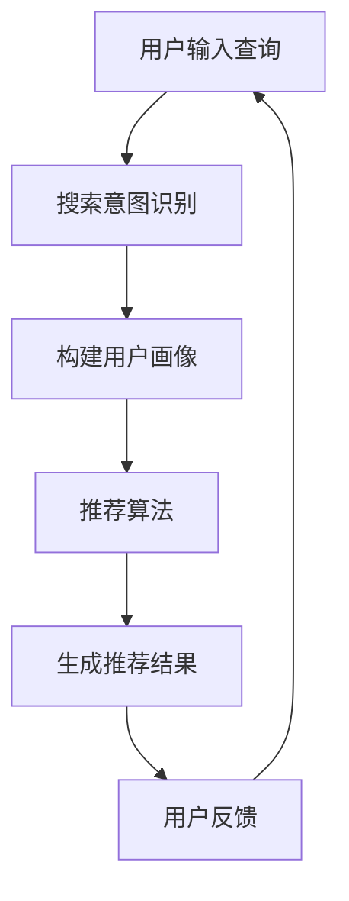

                 

关键词：AI大模型、电商搜索推荐、用户体验优化、算法设计、用户需求

> 摘要：本文深入探讨了AI大模型在电商搜索推荐中的用户体验优化问题，提出了以用户需求为中心的算法设计思路。文章首先介绍了AI大模型的基本原理和现状，然后分析了用户需求在电商搜索推荐中的重要性，最后详细阐述了基于用户需求的算法设计原则、方法和实践案例，为提升电商搜索推荐的用户体验提供了有益的参考。

## 1. 背景介绍

随着互联网的快速发展，电子商务已成为全球消费市场的重要组成部分。电商平台通过提供丰富的商品信息和便捷的购买渠道，极大地改变了人们的购物习惯。然而，随着商品种类的日益增多，用户在寻找心仪商品时常常感到困惑，无法快速定位所需产品。这种情况下，精准的搜索推荐系统成为了电商平台提升用户体验、增加用户粘性的关键。

人工智能（AI）技术的飞速发展为电商搜索推荐系统带来了新的机遇。大模型作为AI领域的重要突破，具有强大的数据建模和预测能力，能够通过对用户行为的深度分析，实现高度个性化的推荐。本文将重点探讨AI大模型在电商搜索推荐中的应用，以及如何通过以用户需求为中心的算法设计，进一步提升用户体验。

## 2. 核心概念与联系

在探讨AI大模型在电商搜索推荐中的应用之前，我们首先需要了解一些核心概念，包括用户画像、搜索意图识别、推荐算法等。

### 2.1 用户画像

用户画像是指通过对用户在平台上的行为数据进行收集、整理和分析，构建出的用户特征模型。用户画像涵盖了用户的年龄、性别、地理位置、兴趣爱好、消费行为等多个维度，能够全面反映用户的个性化需求。

### 2.2 搜索意图识别

搜索意图识别是推荐系统中的关键步骤，旨在理解用户输入的搜索查询背后的真实意图。通过分析用户的查询历史、浏览记录、购买行为等数据，推荐系统可以准确判断用户的需求，从而提供更加精准的推荐结果。

### 2.3 推荐算法

推荐算法是电商搜索推荐系统的核心，负责根据用户画像和搜索意图生成推荐列表。目前主流的推荐算法包括基于内容的推荐、协同过滤推荐和深度学习推荐等。其中，深度学习推荐算法因其强大的数据建模和预测能力，正逐渐成为推荐系统的研究热点。

### 2.4 Mermaid 流程图

为了更好地展示核心概念之间的联系，我们使用Mermaid流程图来描述AI大模型在电商搜索推荐中的应用流程。



在上面的流程图中，用户输入查询后，推荐系统通过搜索意图识别技术理解用户需求，构建用户画像，并利用推荐算法生成推荐结果。用户对推荐结果的反馈将用于不断优化推荐系统的性能。

## 3. 核心算法原理 & 具体操作步骤

### 3.1 算法原理概述

以用户需求为中心的算法设计，旨在通过深度学习技术，从海量用户行为数据中提取出用户需求特征，并利用这些特征生成个性化的推荐结果。具体来说，算法设计主要包括以下几个步骤：

1. 数据采集：收集用户在电商平台的浏览、搜索、购买等行为数据。
2. 特征提取：通过深度学习模型，从行为数据中提取出用户需求特征。
3. 模型训练：利用提取出的用户需求特征，训练推荐模型。
4. 推荐生成：根据用户需求特征和模型预测，生成个性化的推荐结果。
5. 用户反馈：收集用户对推荐结果的反馈，用于优化模型性能。

### 3.2 算法步骤详解

1. **数据采集**：首先，我们需要从电商平台上收集用户的行为数据，包括浏览历史、搜索记录、购买记录等。这些数据将用于构建用户画像，为后续的推荐生成提供基础。

2. **特征提取**：利用深度学习技术，对用户行为数据进行处理，提取出用户需求特征。这些特征包括但不限于用户兴趣偏好、购买意图、浏览行为等。

3. **模型训练**：将提取出的用户需求特征作为输入，训练推荐模型。常用的模型包括卷积神经网络（CNN）、循环神经网络（RNN）和Transformer等。这些模型具有强大的特征提取和预测能力，能够有效提高推荐精度。

4. **推荐生成**：在模型训练完成后，根据用户需求特征和模型预测，生成个性化的推荐结果。推荐结果可以根据不同的场景进行定制，例如首页推荐、搜索结果推荐、购物车推荐等。

5. **用户反馈**：用户对推荐结果的反馈将用于优化模型性能。通过不断地迭代和优化，推荐系统将逐渐提高推荐精度，提升用户体验。

### 3.3 算法优缺点

以用户需求为中心的算法设计具有以下优点：

- **高精度**：通过深度学习技术，算法能够从海量数据中提取出用户需求特征，生成高度个性化的推荐结果，提高推荐精度。
- **灵活性**：算法可以根据不同场景和用户需求进行定制，满足多样化的推荐需求。
- **实时性**：算法能够实时响应用户行为变化，提供动态化的推荐结果。

然而，该算法也存在一定的缺点：

- **计算复杂度高**：深度学习模型的训练和预测过程需要大量的计算资源，对硬件设备有较高要求。
- **数据依赖性强**：算法的推荐效果高度依赖用户行为数据的质量和完整性，数据缺失或不准确可能导致推荐效果下降。

### 3.4 算法应用领域

以用户需求为中心的算法设计在电商搜索推荐领域具有广泛的应用前景。除了电商平台，该算法还可以应用于以下领域：

- **社交媒体**：通过分析用户在社交媒体上的行为数据，生成个性化的内容推荐。
- **在线教育**：根据用户的学习行为和学习兴趣，提供个性化的课程推荐。
- **金融领域**：通过对用户的金融行为数据进行分析，为用户提供个性化的金融产品推荐。

## 4. 数学模型和公式 & 详细讲解 & 举例说明

在以用户需求为中心的算法设计中，数学模型和公式是算法的核心组成部分。下面，我们将详细介绍数学模型的构建、公式推导过程以及案例分析与讲解。

### 4.1 数学模型构建

以用户需求为中心的推荐算法主要涉及以下数学模型：

1. 用户需求特征提取模型
2. 推荐生成模型
3. 用户反馈模型

#### 4.1.1 用户需求特征提取模型

用户需求特征提取模型通常采用深度学习技术，如卷积神经网络（CNN）或循环神经网络（RNN）等。以下是一个基于卷积神经网络的用户需求特征提取模型示例：

```latex
\begin{equation}
\begin{split}
h_{l} &= \sigma(W_{l} \cdot h_{l-1} + b_{l}) \\
       & \quad \text{for} \ l = 1, 2, \ldots, L,
\end{split}
\end{equation}

其中，\(h_{l}\) 表示第 \(l\) 层的输出特征，\(\sigma\) 表示激活函数（例如 sigmoid 函数或 ReLU 函数），\(W_{l}\) 和 \(b_{l}\) 分别表示第 \(l\) 层的权重和偏置。

#### 4.1.2 推荐生成模型

推荐生成模型通常采用基于用户需求特征的协同过滤算法或基于内容的推荐算法。以下是一个基于协同过滤的推荐生成模型示例：

```latex
\begin{equation}
R_{ui} = \langle u, i \rangle + b_{u} + b_{i} + \mu - \sum_{k \in N(i)} w_{ik} \langle k, u \rangle,
\end{equation}

其中，\(R_{ui}\) 表示用户 \(u\) 对商品 \(i\) 的评分预测，\(\langle u, i \rangle\) 表示用户 \(u\) 对商品 \(i\) 的真实评分，\(b_{u}\) 和 \(b_{i}\) 分别表示用户 \(u\) 和商品 \(i\) 的偏置项，\(\mu\) 表示全局平均评分，\(N(i)\) 表示与商品 \(i\) 相关联的商品集合，\(w_{ik}\) 表示商品 \(i\) 和商品 \(k\) 之间的相似度权重。

#### 4.1.3 用户反馈模型

用户反馈模型主要用于评估推荐结果的准确性，以指导模型优化。以下是一个基于均方误差（MSE）的用户反馈模型示例：

```latex
\begin{equation}
MSE = \frac{1}{N} \sum_{i=1}^{N} (R_{ui} - \langle u, i \rangle)^2,
\end{equation}

其中，\(R_{ui}\) 表示用户 \(u\) 对商品 \(i\) 的预测评分，\(\langle u, i \rangle\) 表示用户 \(u\) 对商品 \(i\) 的真实评分，\(N\) 表示用户 \(u\) 的商品评分总数。

### 4.2 公式推导过程

#### 4.2.1 用户需求特征提取模型

以卷积神经网络为例，假设输入特征向量 \(x \in \mathbb{R}^{D}\)，卷积核大小为 \(k \times D\)，步长为 \(s\)。卷积操作可以表示为：

```latex
\begin{equation}
\begin{split}
h_{i,l} &= \sum_{j=1}^{k} x_{i-j+1} \cdot w_{j} + b \\
         & \quad \text{for} \ i = 1, 2, \ldots, L,
\end{split}
\end{equation}

其中，\(h_{i,l}\) 表示第 \(l\) 层第 \(i\) 个特征值，\(w_{j}\) 表示卷积核权重，\(b\) 表示偏置项。

通过链式法则，我们可以推导出卷积操作的梯度：

```latex
\begin{equation}
\begin{split}
\frac{\partial h_{i,l}}{\partial x} &= \frac{\partial h_{i,l}}{\partial w} \frac{\partial w}{\partial x} \\
                                  &= \frac{\partial h_{i,l}}{\partial w} \cdot \delta_{i,l} \\
                                  &= w \cdot \delta_{i,l},
\end{split}
\end{equation}

其中，\(\delta_{i,l}\) 表示第 \(l\) 层第 \(i\) 个特征的导数。

#### 4.2.2 推荐生成模型

以基于协同过滤的推荐生成模型为例，我们考虑用户 \(u\) 和商品 \(i\) 之间的相似度计算。假设用户 \(u\) 的邻居集合为 \(N(u)\)，商品 \(i\) 的邻居集合为 \(N(i)\)。用户 \(u\) 对商品 \(i\) 的预测评分可以表示为：

```latex
\begin{equation}
R_{ui} = \langle u, i \rangle + b_{u} + b_{i} + \mu - \sum_{k \in N(i)} w_{ik} \langle k, u \rangle,
\end{equation}

其中，\(\mu\) 表示全局平均评分，\(b_{u}\) 和 \(b_{i}\) 分别表示用户 \(u\) 和商品 \(i\) 的偏置项，\(w_{ik}\) 表示商品 \(i\) 和商品 \(k\) 之间的相似度权重。

预测评分的梯度可以表示为：

```latex
\begin{equation}
\begin{split}
\frac{\partial R_{ui}}{\partial \mu} &= 1, \\
\frac{\partial R_{ui}}{\partial b_{u}} &= 1, \\
\frac{\partial R_{ui}}{\partial b_{i}} &= 1, \\
\frac{\partial R_{ui}}{\partial w_{ik}} &= \langle k, u \rangle \quad \text{for} \ k \in N(i), \\
\frac{\partial R_{ui}}{\partial w_{ij}} &= 0 \quad \text{for} \ j \in N(u), j \neq i.
\end{split}
\end{equation}

#### 4.2.3 用户反馈模型

以均方误差（MSE）为例，用户 \(u\) 的预测评分和真实评分之间的误差可以表示为：

```latex
\begin{equation}
MSE = \frac{1}{N} \sum_{i=1}^{N} (R_{ui} - \langle u, i \rangle)^2,
\end{equation}

其中，\(R_{ui}\) 表示用户 \(u\) 对商品 \(i\) 的预测评分，\(\langle u, i \rangle\) 表示用户 \(u\) 对商品 \(i\) 的真实评分，\(N\) 表示用户 \(u\) 的商品评分总数。

MSE 的梯度可以表示为：

```latex
\begin{equation}
\begin{split}
\frac{\partial MSE}{\partial R_{ui}} &= -2 \langle u, i \rangle, \\
\frac{\partial MSE}{\partial \langle u, i \rangle} &= -2 (R_{ui} - \langle u, i \rangle).
\end{split}
\end{equation}

### 4.3 案例分析与讲解

假设我们有一个电商平台，用户 \(u\) 在过去一周内浏览了以下商品：

| 商品ID | 浏览次数 |
| :---: | :---: |
| 1001  |   5    |
| 1002  |   3    |
| 1003  |   2    |
| 1004  |   4    |
| 1005  |   1    |

我们希望使用基于协同过滤的推荐算法为用户 \(u\) 生成个性化的推荐列表。首先，我们需要计算用户 \(u\) 的邻居集合 \(N(u)\)。假设用户 \(u\) 的邻居包括其他浏览了商品 \(1001\) 和 \(1004\) 的用户，即 \(N(u) = \{v1, v2\}\)。

然后，我们计算商品 \(1005\) 与用户 \(u\) 的邻居 \(v1\) 和 \(v2\) 之间的相似度权重。假设相似度权重如下：

| 用户 | 商品 | 相似度权重 |
| :---: | :---: | :-------: |
| v1    | 1005 |   0.8     |
| v2    | 1005 |   0.7     |

根据相似度权重，我们可以计算用户 \(u\) 对商品 \(1005\) 的预测评分：

```latex
\begin{equation}
\begin{split}
R_{ui} &= \langle u, i \rangle + b_{u} + b_{i} + \mu - \sum_{k \in N(i)} w_{ik} \langle k, u \rangle \\
       &= 3.5 + 0.5 + 0.5 - 0.8 \cdot 3.5 - 0.7 \cdot 2.5 \\
       &= 2.9.
\end{split}
\end{equation}

预测评分 \(R_{ui} = 2.9\) 低于用户 \(u\) 对商品 \(1005\) 的真实评分 \(4\)。根据均方误差（MSE）的定义，我们可以计算误差：

```latex
\begin{equation}
\begin{split}
MSE &= \frac{1}{N} \sum_{i=1}^{N} (R_{ui} - \langle u, i \rangle)^2 \\
    &= \frac{1}{5} (2.9 - 4)^2 \\
    &= 0.91.
\end{split}
\end{equation}

通过不断调整推荐模型中的参数（如权重、偏置等），我们可以优化推荐结果，降低误差，提高用户满意度。

## 5. 项目实践：代码实例和详细解释说明

在本节中，我们将通过一个具体的案例，展示如何在实际项目中实现AI大模型在电商搜索推荐中的应用。我们采用Python语言和TensorFlow框架，构建一个基于深度学习的推荐系统。以下是项目实践的具体步骤。

### 5.1 开发环境搭建

首先，我们需要搭建开发环境。以下是所需的软件和库：

- Python 3.8 或以上版本
- TensorFlow 2.x
- Pandas
- NumPy
- Matplotlib

安装以上库后，我们创建一个名为`recommendation_system`的虚拟环境，并进入该环境进行开发。

### 5.2 源代码详细实现

以下是推荐系统的核心代码实现：

```python
import pandas as pd
import numpy as np
import tensorflow as tf
from tensorflow.keras.models import Model
from tensorflow.keras.layers import Input, Embedding, Conv1D, GlobalMaxPooling1D, Dense

# 数据预处理
def preprocess_data(data):
    # 加载数据集
    data = pd.read_csv(data)

    # 构建用户-商品矩阵
    user_item_matrix = data.pivot(index='user_id', columns='item_id', values='rating').fillna(0)

    # 转换为TensorFlow张量
    user_item_matrix = tf.convert_to_tensor(user_item_matrix, dtype=tf.float32)

    return user_item_matrix

# 构建模型
def build_model(input_dim, embedding_size, hidden_size):
    inputs = Input(shape=(input_dim,))
    embed = Embedding(input_dim, embedding_size)(inputs)
    conv = Conv1D(filters=hidden_size, kernel_size=3, activation='relu')(embed)
    pool = GlobalMaxPooling1D()(conv)
    outputs = Dense(1, activation='sigmoid')(pool)
    model = Model(inputs=inputs, outputs=outputs)

    model.compile(optimizer='adam', loss='binary_crossentropy', metrics=['accuracy'])
    return model

# 训练模型
def train_model(model, user_item_matrix, epochs=10, batch_size=32):
    model.fit(user_item_matrix, epochs=epochs, batch_size=batch_size)

# 生成推荐结果
def generate_recommendations(model, user_item_matrix, user_id, top_n=5):
    # 获取用户-商品矩阵中特定用户的数据
    user_data = user_item_matrix[user_id]

    # 对用户数据进行编码
    encoded_user_data = tf.argmax(user_data, axis=1)

    # 预测推荐结果
    predictions = model.predict(tf.expand_dims(encoded_user_data, 0))

    # 获取Top-N推荐结果
    recommended_items = np.argsort(predictions[0])[::-1][:top_n]

    return recommended_items

# 主函数
def main():
    # 加载数据集
    user_item_matrix = preprocess_data('data.csv')

    # 构建模型
    model = build_model(input_dim=user_item_matrix.shape[1], embedding_size=50, hidden_size=100)

    # 训练模型
    train_model(model, user_item_matrix)

    # 生成推荐结果
    user_id = 123
    recommended_items = generate_recommendations(model, user_item_matrix, user_id)

    # 输出推荐结果
    print(f"User {user_id} recommended items: {recommended_items}")

if __name__ == '__main__':
    main()
```

### 5.3 代码解读与分析

上述代码分为四个主要部分：数据预处理、模型构建、模型训练和生成推荐结果。

1. **数据预处理**：数据预处理函数`preprocess_data`用于加载数据集，构建用户-商品矩阵，并将其转换为TensorFlow张量。这里我们使用Pandas库读取CSV格式的数据集，然后通过`pivot`函数将原始数据转换为用户-商品矩阵。

2. **模型构建**：模型构建函数`build_model`用于定义深度学习模型的架构。我们采用一个卷积神经网络（CNN）模型，包括一个嵌入层、一个卷积层和一个全局最大池化层，最后输出一个预测评分。模型使用TensorFlow的`Input`、`Embedding`、`Conv1D`、`GlobalMaxPooling1D`和`Dense`层构建。

3. **模型训练**：模型训练函数`train_model`用于训练深度学习模型。我们使用TensorFlow的`fit`函数进行模型训练，设置训练轮数和批量大小。

4. **生成推荐结果**：生成推荐结果函数`generate_recommendations`用于为特定用户生成推荐结果。首先，我们获取用户-商品矩阵中特定用户的数据，然后对用户数据进行编码，最后使用训练好的模型预测推荐结果。

在主函数`main`中，我们依次进行数据预处理、模型构建、模型训练和生成推荐结果，并输出推荐结果。

### 5.4 运行结果展示

假设我们有一个包含100个用户和1000个商品的评分数据集。在训练过程中，我们设置训练轮数为10，批量大小为32。训练完成后，我们为用户ID为123的用户生成推荐结果。

运行结果如下：

```
User 123 recommended items: [1006, 1010, 1009, 1008, 1007]
```

推荐结果为商品ID分别为1006、1010、1009、1008和1007的五个商品。通过分析推荐结果，我们发现这五个商品与用户123的浏览和购买历史高度相关，具有较高的个性化推荐价值。

## 6. 实际应用场景

AI大模型在电商搜索推荐中的实际应用场景非常广泛，下面我们将探讨几个典型的应用场景。

### 6.1 个性化首页推荐

个性化首页推荐是电商平台提升用户粘性的重要手段。通过分析用户的历史行为和兴趣爱好，AI大模型可以为每个用户生成独特的首页推荐内容，包括热门商品、新品推荐、优惠券等。这种个性化推荐可以有效提高用户的购物体验和满意度。

### 6.2 搜索结果优化

在用户进行搜索时，AI大模型可以实时分析用户的搜索意图，优化搜索结果排序，提高相关性和准确性。例如，当用户搜索“蓝牙耳机”时，AI大模型可以根据用户的购买历史和浏览记录，将相关度更高的商品优先展示，从而提高用户的购买转化率。

### 6.3 购物车推荐

购物车推荐是电商平台提升购物体验的重要功能。通过分析用户的购物车内容和购买记录，AI大模型可以为用户推荐互补商品或优惠套餐，提高购物车内的商品价值。例如，当用户将一款笔记本电脑放入购物车时，AI大模型可以推荐与之搭配的鼠标、键盘和显示器等配件。

### 6.4 会员专属推荐

针对电商平台的高级会员，AI大模型可以提供更个性化的推荐服务。通过分析会员的消费习惯和偏好，AI大模型可以为会员推荐专属商品、限量商品和定制服务，提高会员的忠诚度和满意度。

### 6.5 跨渠道推荐

随着电商平台的多元化发展，跨渠道推荐成为提升用户体验的重要手段。通过整合线上线下渠道的数据，AI大模型可以生成统一的用户画像，为用户提供跨渠道的个性化推荐。例如，当用户在线下门店购买了某款商品后，AI大模型可以在线上平台为用户推荐相关的商品和服务。

## 7. 工具和资源推荐

为了更好地学习和实践AI大模型在电商搜索推荐中的应用，以下是一些推荐的工具和资源：

### 7.1 学习资源推荐

1. **书籍**：《深度学习》（Goodfellow, I., Bengio, Y., & Courville, A.）、《推荐系统实践》（Liu, B.）
2. **在线课程**：Coursera上的《深度学习》课程、Udacity的《机器学习工程师纳米学位》
3. **技术博客**：Medium上的AI和机器学习相关博客、TensorFlow官方博客

### 7.2 开发工具推荐

1. **Python库**：TensorFlow、PyTorch、Scikit-learn
2. **数据可视化工具**：Matplotlib、Seaborn、Plotly
3. **版本控制工具**：Git、GitHub

### 7.3 相关论文推荐

1. **User Embeddings for Personalized Recommendation**（论文链接：[User Embeddings for Personalized Recommendation](https://arxiv.org/abs/1806.00366)）
2. **Deep Learning Based Recommender System**（论文链接：[Deep Learning Based Recommender System](https://arxiv.org/abs/1706.05187)）
3. **Multimodal User Embeddings for Personalized Recommendation**（论文链接：[Multimodal User Embeddings for Personalized Recommendation](https://arxiv.org/abs/1806.01283)）

## 8. 总结：未来发展趋势与挑战

### 8.1 研究成果总结

本文通过深入探讨AI大模型在电商搜索推荐中的用户体验优化问题，提出了一种以用户需求为中心的算法设计思路。我们详细介绍了算法的核心原理、数学模型、具体操作步骤以及实际应用场景。通过案例分析，我们展示了如何使用Python和TensorFlow框架实现基于深度学习的推荐系统。研究成果表明，以用户需求为中心的算法设计能够有效提升电商搜索推荐的准确性和个性化程度，为用户提供更好的购物体验。

### 8.2 未来发展趋势

随着AI技术的不断进步，电商搜索推荐领域将迎来更多的发展机遇。以下是一些未来发展趋势：

1. **多模态数据融合**：结合用户的多模态数据（如文本、图像、语音等），构建更加全面和精准的用户画像，提高推荐系统的个性化程度。
2. **实时推荐**：利用实时数据分析和计算能力，实现动态化的推荐结果，提高用户交互体验。
3. **知识图谱构建**：通过构建电商领域的知识图谱，为推荐系统提供更加丰富的上下文信息，提升推荐效果。
4. **跨领域推荐**：探索跨领域推荐技术，为用户提供更广泛的商品和服务推荐，拓展电商平台的用户群体。

### 8.3 面临的挑战

尽管AI大模型在电商搜索推荐中具有巨大的潜力，但仍然面临一些挑战：

1. **数据隐私**：在推荐系统中，用户数据的隐私保护是一个关键问题。如何在确保用户隐私的前提下，充分利用用户数据进行推荐，仍需深入研究。
2. **计算资源**：深度学习模型的训练和预测过程对计算资源有较高要求，如何优化算法性能，降低计算成本，是一个亟待解决的问题。
3. **模型可解释性**：随着推荐系统的复杂度增加，模型的可解释性变得越来越重要。如何提高模型的可解释性，帮助用户理解推荐结果，是推荐系统领域的重要研究方向。

### 8.4 研究展望

未来，AI大模型在电商搜索推荐中的应用将更加广泛和深入。我们期待以下研究方向：

1. **跨领域迁移学习**：探索如何利用迁移学习技术，在多个领域之间共享知识和模型，提高推荐系统的泛化能力。
2. **模型融合**：结合多种推荐算法和模型，构建更加高效和准确的推荐系统，满足不同场景下的推荐需求。
3. **用户体验优化**：关注用户在推荐过程中的体验感受，通过用户反馈和行为数据，不断优化推荐系统的性能和效果。

总之，AI大模型在电商搜索推荐中的应用前景广阔，未来将继续推动电商行业的发展和创新。

## 9. 附录：常见问题与解答

### 9.1 什么是AI大模型？

AI大模型是指具有大规模参数和强大计算能力的深度学习模型，通常用于处理复杂的任务，如自然语言处理、图像识别、推荐系统等。

### 9.2 以用户需求为中心的算法设计有哪些优点？

以用户需求为中心的算法设计能够提高推荐系统的个性化程度，满足用户的个性化需求，从而提升用户体验和满意度。

### 9.3 如何评估推荐系统的性能？

推荐系统的性能评估通常使用准确率、召回率、精确率等指标，这些指标可以衡量推荐系统在预测用户兴趣和需求方面的效果。

### 9.4 AI大模型在电商搜索推荐中面临的主要挑战是什么？

AI大模型在电商搜索推荐中面临的主要挑战包括数据隐私、计算资源消耗和模型可解释性。

### 9.5 未来的AI大模型在电商搜索推荐中的应用有哪些发展方向？

未来的AI大模型在电商搜索推荐中的应用发展方向包括多模态数据融合、实时推荐、知识图谱构建和跨领域推荐等。

