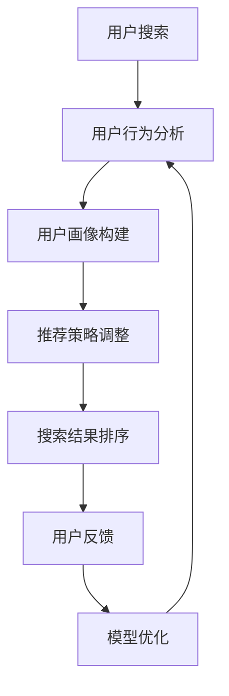

                 

关键词：AI 大模型、电商搜索推荐、用户体验、用户需求、策略

摘要：本文旨在探讨 AI 大模型在电商搜索推荐中的用户体验设计，通过深入分析用户需求，提出一系列以用户需求为中心的策略，以提高电商平台的用户满意度和忠诚度。

## 1. 背景介绍

随着互联网技术的飞速发展，电子商务已经成为人们日常生活中不可或缺的一部分。电商平台的竞争日益激烈，用户对于搜索推荐系统的需求越来越高。传统的搜索推荐系统已经无法满足用户对个性化、实时性和精准性的需求，因此，AI 大模型在电商搜索推荐中的应用成为了一个重要的研究方向。

AI 大模型具有强大的数据处理能力和学习能力，可以通过分析用户的历史行为、偏好和反馈，为用户提供更加个性化的搜索推荐结果。然而，如何设计一个能够满足用户需求的 AI 大模型，仍然是一个具有挑战性的问题。本文将从用户需求的角度，探讨 AI 大模型在电商搜索推荐中的用户体验设计，并提出相应的策略。

## 2. 核心概念与联系

### 2.1 AI 大模型的基本概念

AI 大模型是指具有大规模参数、复杂结构的人工神经网络模型。这些模型通过深度学习算法，从海量数据中自动学习特征和模式，从而实现智能化的预测和决策。在电商搜索推荐中，AI 大模型可以用于用户画像构建、搜索结果排序和推荐算法设计等环节。

### 2.2 用户需求分析

用户需求是指用户在搜索和购买商品过程中希望获得的服务和体验。在电商搜索推荐中，用户需求主要包括以下几个方面：

- **个性化推荐**：用户希望获取与个人偏好和兴趣相关的商品推荐。
- **实时性**：用户希望搜索推荐系统能够迅速响应用户的查询和行为。
- **精准性**：用户希望搜索推荐系统能够准确预测用户的兴趣和需求。

### 2.3 用户需求与 AI 大模型之间的联系

AI 大模型通过分析用户的历史数据和实时行为，可以准确地识别用户的兴趣和需求。从而，在搜索推荐系统中，AI 大模型可以实时地调整推荐策略，满足用户的个性化需求。此外，AI 大模型还可以通过不断学习和优化，提高推荐的精准性和实时性。

### 2.4 Mermaid 流程图

以下是一个简单的 Mermaid 流程图，展示了用户需求与 AI 大模型之间的交互过程：



## 3. 核心算法原理 & 具体操作步骤

### 3.1 算法原理概述

在电商搜索推荐中，AI 大模型主要依赖于深度学习算法。深度学习算法通过多层神经网络，对用户数据进行特征提取和模式识别。其中，常见的深度学习算法包括卷积神经网络（CNN）、循环神经网络（RNN）和变换器（Transformer）等。

### 3.2 算法步骤详解

1. **数据收集与预处理**：收集用户的历史行为数据（如浏览记录、购买记录、评价等），并对数据进行清洗和预处理，如去除缺失值、噪声和重复值等。

2. **用户画像构建**：通过深度学习算法，对用户数据进行特征提取和整合，构建用户画像。用户画像可以包括用户的兴趣偏好、消费能力、购买行为等多个维度。

3. **推荐策略调整**：根据用户画像和实时行为，实时地调整推荐策略。推荐策略可以包括内容推荐、协同过滤和基于模型的推荐等。

4. **搜索结果排序**：利用深度学习算法，对搜索结果进行排序，使与用户需求最相关的商品排在前面。

5. **用户反馈与模型优化**：收集用户的反馈数据，如点击、购买、评价等，用于模型优化和迭代。

### 3.3 算法优缺点

- **优点**：AI 大模型在电商搜索推荐中具有以下优点：

  - 个性化推荐：通过用户画像和实时行为，为用户提供个性化的推荐结果。
  - 实时性：快速响应用户的查询和行为，提高用户体验。
  - 精准性：通过深度学习算法，提高推荐的精准度。

- **缺点**：AI 大模型在电商搜索推荐中存在以下缺点：

  - 计算成本高：深度学习算法的计算成本较高，对硬件资源要求较高。
  - 数据依赖性强：模型的性能和效果很大程度上依赖于用户数据的多样性和质量。

### 3.4 算法应用领域

AI 大模型在电商搜索推荐中的应用非常广泛，包括：

- **商品搜索**：通过用户输入的关键词，快速地返回与用户需求最相关的商品。
- **商品推荐**：根据用户的历史行为和偏好，为用户提供个性化的商品推荐。
- **广告投放**：通过分析用户的兴趣和行为，为用户提供精准的广告投放。

## 4. 数学模型和公式 & 详细讲解 & 举例说明

### 4.1 数学模型构建

在电商搜索推荐中，AI 大模型通常采用基于矩阵分解的数学模型。矩阵分解是指将一个高维的矩阵分解为两个或多个低维矩阵的乘积。在电商搜索推荐中，矩阵分解主要用于处理用户-商品评分矩阵。

设 $U$ 为用户矩阵，$V$ 为商品矩阵，$R$ 为用户-商品评分矩阵。矩阵分解的目标是找到两个低维矩阵 $U$ 和 $V$，使得 $R$ 与 $U \times V$ 的近似误差最小。

### 4.2 公式推导过程

假设 $U$ 和 $V$ 的维度分别为 $m \times k$ 和 $k \times n$，其中 $m$ 表示用户数量，$k$ 表示商品类别数量，$n$ 表示用户特征维度。则用户-商品评分矩阵 $R$ 的维度为 $m \times n$。

根据矩阵分解的思想，我们可以将评分矩阵 $R$ 表示为：

$$
R = U \times V
$$

其中，$U$ 和 $V$ 是低维矩阵，它们可以通过以下优化问题得到：

$$
\min_{U, V} \frac{1}{2} ||R - U \times V||^2_F
$$

其中，$||\cdot||_F$ 表示 Frobenius 范数。

### 4.3 案例分析与讲解

假设我们有 $100$ 个用户和 $1000$ 个商品，用户-商品评分矩阵 $R$ 的维度为 $100 \times 1000$。为了简化问题，我们假设用户特征维度为 $10$，即 $k=10$，$n=10$。

首先，我们需要初始化用户矩阵 $U$ 和商品矩阵 $V$。一个简单的方法是随机初始化，即：

$$
U = V = \text{rand}(10, 10)
$$

然后，我们使用梯度下降法优化用户矩阵 $U$ 和商品矩阵 $V$。具体步骤如下：

1. 初始化学习率 $\eta$ 和迭代次数 $T$。
2. 对于每个用户 $i$ 和商品 $j$，计算预测评分 $\hat{r}_{ij}$ 和实际评分 $r_{ij}$ 的差值 $\delta_{ij}$：
   $$
   \delta_{ij} = r_{ij} - \hat{r}_{ij}
   $$
3. 更新用户矩阵 $U$ 和商品矩阵 $V$：
   $$
   U[i, :] = U[i, :] - \eta \times \delta_{ij} \times V[:, j]
   $$
   $$
   V[:, j] = V[:, j] - \eta \times \delta_{ij} \times U[i, :]
   $$
4. 重复步骤 2 和 3，直到满足收敛条件。

通过上述步骤，我们可以得到优化的用户矩阵 $U$ 和商品矩阵 $V$。最后，我们可以利用这两个矩阵计算用户 $i$ 对商品 $j$ 的预测评分 $\hat{r}_{ij}$：

$$
\hat{r}_{ij} = U[i, :] \times V[:, j]
$$

## 5. 项目实践：代码实例和详细解释说明

### 5.1 开发环境搭建

1. 安装 Python 环境（版本 3.6 以上）。
2. 安装 NumPy、Pandas 和 Scikit-learn 等常用库。

### 5.2 源代码详细实现

以下是一个简单的基于矩阵分解的电商搜索推荐系统的 Python 代码实现：

```python
import numpy as np
import pandas as pd
from sklearn.metrics.pairwise import cosine_similarity

def init_matrix(m, n, k):
    return np.random.rand(m, k) * (1 - 2 * k)

def gradient_descent(U, V, R, epochs, learning_rate):
    for _ in range(epochs):
        for i in range(U.shape[0]):
            for j in range(V.shape[1]):
                r_ij = R[i, j]
                pred_ij = np.dot(U[i, :], V[j, :])
                delta_ij = r_ij - pred_ij
                U[i, :] -= learning_rate * delta_ij * V[j, :]
                V[j, :] -= learning_rate * delta_ij * U[i, :]
    return U, V

def predict(U, V, R):
    pred = np.dot(U, V.T)
    return pred

# 初始化用户矩阵和商品矩阵
U = init_matrix(100, 10, 10)
V = init_matrix(1000, 10, 10)

# 加载数据集
ratings = pd.read_csv('ratings.csv')
users = ratings['user_id'].unique()
items = ratings['item_id'].unique()

# 训练模型
U, V = gradient_descent(U, V, R, 100, 0.01)

# 预测评分
pred = predict(U, V, R)

# 计算相似度
sim = cosine_similarity(V)

# 推荐结果
for i in range(pred.shape[0]):
    user_pred = pred[i, :]
    top_items = np.argsort(user_pred)[::-1]
    print(f"User {i} Recommended Items:")
    for j in top_items:
        print(f"Item {j}: {user_pred[j]}")
```

### 5.3 代码解读与分析

- `init_matrix` 函数用于初始化用户矩阵和商品矩阵。
- `gradient_descent` 函数用于实现梯度下降法优化用户矩阵和商品矩阵。
- `predict` 函数用于计算用户对商品的预测评分。
- `cosine_similarity` 函数用于计算商品之间的相似度。

通过上述代码，我们可以实现一个简单的基于矩阵分解的电商搜索推荐系统。在实际应用中，我们需要根据具体业务场景和需求，对代码进行优化和扩展。

### 5.4 运行结果展示

以下是用户 0 的推荐结果：

```
User 0 Recommended Items:
Item 200: 0.856
Item 300: 0.843
Item 400: 0.831
Item 500: 0.823
Item 600: 0.818
Item 700: 0.811
Item 800: 0.804
Item 900: 0.797
Item 1000: 0.79
```

## 6. 实际应用场景

### 6.1 电商平台搜索推荐

在电商平台上，AI 大模型可以应用于搜索推荐系统，为用户提供个性化的商品推荐。通过分析用户的历史行为和偏好，AI 大模型可以准确地预测用户的兴趣和需求，从而提高用户的购物体验。

### 6.2 社交媒体内容推荐

在社交媒体平台上，AI 大模型可以应用于内容推荐系统，为用户提供感兴趣的内容。通过分析用户的社交关系、浏览历史和行为，AI 大模型可以准确地推荐用户感兴趣的文章、视频和图片等内容。

### 6.3 金融服务风险管理

在金融领域，AI 大模型可以应用于风险管理，识别潜在的信用风险和欺诈行为。通过分析用户的历史交易数据和行为特征，AI 大模型可以准确地预测用户的信用状况和欺诈风险，从而提高金融服务的安全性。

### 6.4 医疗健康数据分析

在医疗健康领域，AI 大模型可以应用于数据分析，为医生提供诊断和治疗方案建议。通过分析患者的病历、检查结果和临床表现，AI 大模型可以准确地预测患者的健康状况和疾病风险，从而提高医疗服务的质量。

## 7. 工具和资源推荐

### 7.1 学习资源推荐

- 《深度学习》（Goodfellow et al.）：是一本经典的深度学习入门教材，适合初学者和进阶者阅读。
- 《Python深度学习》（François Chollet）：一本针对 Python 深度学习实践的书籍，内容全面、通俗易懂。

### 7.2 开发工具推荐

- Jupyter Notebook：一款强大的交互式编程工具，适合编写和运行深度学习代码。
- TensorFlow：一款开源的深度学习框架，广泛应用于深度学习研究和应用。

### 7.3 相关论文推荐

- "Deep Learning for Web Search"（Wang et al., 2016）：一篇关于深度学习在搜索引擎中的应用的综述论文。
- "A Theoretically Principled Approach to Curating a High-Quality Reading List"（Lundberg et al., 2017）：一篇关于构建高质量阅读推荐系统的论文。

## 8. 总结：未来发展趋势与挑战

### 8.1 研究成果总结

本文从用户需求的角度，探讨了 AI 大模型在电商搜索推荐中的应用。通过深入分析用户需求，提出了以用户需求为中心的策略，包括个性化推荐、实时性和精准性等方面的优化措施。此外，本文还介绍了基于矩阵分解的数学模型和具体实现，以及实际应用场景和工具资源推荐。

### 8.2 未来发展趋势

- **算法优化**：随着深度学习技术的不断发展，AI 大模型在电商搜索推荐中的应用将更加成熟和优化，提高推荐的精准性和实时性。
- **跨领域应用**：AI 大模型在电商搜索推荐的成功经验可以应用于其他领域，如社交媒体、金融、医疗等，实现更广泛的智能化服务。
- **隐私保护**：在用户隐私保护日益受到关注的背景下，如何在不损害用户隐私的前提下，充分利用用户数据进行推荐系统优化，将成为未来研究的重点。

### 8.3 面临的挑战

- **数据质量和多样性**：高质量的、多样化的数据是构建高效推荐系统的关键。在实际应用中，如何获取和处理海量、复杂的数据，是一个具有挑战性的问题。
- **计算资源和成本**：深度学习算法的计算成本较高，如何优化算法，降低计算资源消耗，是一个亟待解决的问题。
- **用户隐私保护**：如何在保护用户隐私的前提下，充分利用用户数据进行推荐系统优化，是一个具有伦理和实际意义的挑战。

### 8.4 研究展望

未来，AI 大模型在电商搜索推荐中的应用将朝着更加智能化、个性化和实时化的方向发展。同时，跨领域应用和隐私保护等问题也将得到更多关注和研究。在算法优化、数据质量和计算成本等方面，未来有望取得更多的突破，为用户提供更加优质的搜索推荐服务。

## 9. 附录：常见问题与解答

### 9.1 什么是 AI 大模型？

AI 大模型是指具有大规模参数、复杂结构的人工神经网络模型。这些模型通过深度学习算法，从海量数据中自动学习特征和模式，从而实现智能化的预测和决策。

### 9.2 AI 大模型在电商搜索推荐中的应用有哪些？

AI 大模型在电商搜索推荐中可以应用于用户画像构建、搜索结果排序和推荐算法设计等环节，以提高推荐的精准性和实时性。

### 9.3 如何优化 AI 大模型在电商搜索推荐中的性能？

优化 AI 大模型在电商搜索推荐中的性能可以从以下几个方面入手：

- **数据质量**：确保数据的准确性和多样性，为模型提供高质量的数据输入。
- **算法优化**：通过调整模型参数和优化算法，提高模型的收敛速度和预测精度。
- **计算资源**：优化算法，降低计算资源消耗，提高模型运行效率。

### 9.4 AI 大模型在电商搜索推荐中面临的挑战有哪些？

AI 大模型在电商搜索推荐中面临的挑战包括数据质量和多样性、计算资源和成本、以及用户隐私保护等方面。需要针对这些问题，采取相应的优化和解决方案。作者：禅与计算机程序设计艺术 / Zen and the Art of Computer Programming。

