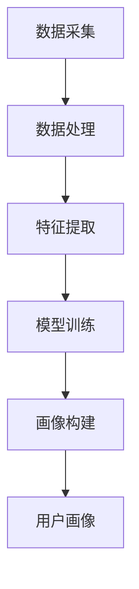

                 

关键词：AI大模型、电商搜索推荐、用户画像、行为分析、需求偏好、深度学习、数据挖掘

摘要：本文探讨了AI大模型在电商搜索推荐中构建用户画像的技术，通过深入分析用户行为数据和需求偏好，实现精准推荐。文章首先介绍了用户画像的核心概念与联系，然后详细阐述了核心算法原理和具体操作步骤，包括数学模型的构建与公式推导，并通过项目实践展示了代码实例和运行结果。最后，文章分析了用户画像在实际应用场景中的价值，展望了未来发展趋势与挑战。

## 1. 背景介绍

随着互联网和电子商务的迅猛发展，用户数量和交易额逐年攀升，电商平台的竞争也愈发激烈。为了在激烈的市场竞争中脱颖而出，电商平台纷纷开始重视用户搜索推荐系统，力求通过个性化推荐提升用户体验和转化率。而用户画像技术作为个性化推荐的核心环节，已经成为电商企业关注的焦点。

用户画像是指通过对用户行为数据和需求偏好的挖掘与分析，构建出用户的基本特征和个性化标签。这些特征和标签可以帮助电商平台更好地理解用户，从而实现精准推荐。然而，随着用户数据的不断增长和多样化，传统的用户画像构建方法已经难以满足需求，这就需要引入AI大模型技术。

AI大模型是一种基于深度学习和数据挖掘技术的大型计算模型，能够处理海量用户数据，挖掘出潜在的用户行为模式和需求偏好。本文将探讨AI大模型在电商搜索推荐中构建用户画像的技术，为电商平台提供一种新的解决方案。

## 2. 核心概念与联系

### 2.1 用户画像

用户画像是指通过对用户行为数据和需求偏好的分析，构建出用户的基本特征和个性化标签。用户画像的核心概念包括以下几个方面：

1. **用户特征**：包括用户的基本信息（如年龄、性别、地理位置等）和兴趣特征（如喜好、购买偏好等）。
2. **行为数据**：包括用户在平台上的浏览、搜索、购买等行为记录。
3. **需求偏好**：根据用户行为数据挖掘出的用户需求偏好，如商品类型、品牌偏好、价格敏感度等。

### 2.2 大模型

大模型是指具有海量参数和复杂结构的人工智能模型，通常基于深度学习和数据挖掘技术。大模型的特点如下：

1. **大规模参数**：大模型具有数十亿甚至千亿级别的参数，能够处理海量数据。
2. **深度结构**：大模型通常采用多层神经网络结构，具有强大的特征提取和建模能力。
3. **自适应学习**：大模型能够根据输入数据进行自适应调整，优化模型参数。

### 2.3 画像技术

画像技术是指利用数据挖掘、机器学习等技术手段，对用户行为数据和需求偏好进行分析和建模，构建出用户画像。画像技术的核心步骤包括：

1. **数据采集**：收集用户在平台上的行为数据和需求数据。
2. **数据处理**：对采集到的数据清洗、去重、归一化等处理，确保数据质量。
3. **特征提取**：利用机器学习算法对数据进行特征提取，构建用户特征向量。
4. **模型训练**：利用大模型对用户特征向量进行训练，构建用户画像模型。
5. **画像构建**：根据用户画像模型对用户进行打标签，构建完整的用户画像。

### 2.4 Mermaid 流程图

以下是用户画像技术的 Mermaid 流程图：



## 3. 核心算法原理 & 具体操作步骤

### 3.1 算法原理概述

AI大模型在电商搜索推荐中构建用户画像的核心算法原理主要包括以下几个方面：

1. **数据预处理**：通过对用户行为数据和需求数据进行清洗、去重、归一化等处理，确保数据质量。
2. **特征提取**：利用深度学习算法对用户行为数据进行特征提取，构建用户特征向量。
3. **用户建模**：利用大规模神经网络对用户特征向量进行建模，构建用户画像模型。
4. **画像构建**：根据用户画像模型对用户进行打标签，构建完整的用户画像。

### 3.2 算法步骤详解

#### 3.2.1 数据预处理

数据预处理是用户画像构建的基础，主要包括以下步骤：

1. **数据清洗**：去除重复、缺失、异常数据，确保数据质量。
2. **数据去重**：对用户行为数据去重，避免重复计算。
3. **数据归一化**：对用户行为数据进行归一化处理，如使用 Min-Max 归一化、Z-Score 归一化等。

#### 3.2.2 特征提取

特征提取是用户画像构建的关键，通过深度学习算法对用户行为数据进行特征提取，构建用户特征向量。具体步骤如下：

1. **数据输入**：将预处理后的用户行为数据输入到深度学习模型。
2. **特征提取**：利用深度学习模型对用户行为数据进行特征提取，得到用户特征向量。
3. **特征降维**：对提取的用户特征向量进行降维处理，如使用 PCA、t-SNE 等算法。

#### 3.2.3 用户建模

用户建模是用户画像构建的核心，通过大规模神经网络对用户特征向量进行建模，构建用户画像模型。具体步骤如下：

1. **模型初始化**：初始化大规模神经网络模型，包括输入层、隐藏层和输出层。
2. **模型训练**：利用用户特征向量进行模型训练，优化模型参数。
3. **模型评估**：对训练好的模型进行评估，如使用准确率、召回率等指标。

#### 3.2.4 画像构建

根据用户画像模型对用户进行打标签，构建完整的用户画像。具体步骤如下：

1. **用户标签打分**：根据用户画像模型对用户进行标签打分，如使用逻辑回归、支持向量机等算法。
2. **标签融合**：对打分结果进行融合，得到用户最终的标签。
3. **画像构建**：根据用户标签构建完整的用户画像。

### 3.3 算法优缺点

#### 优点

1. **高精度**：AI大模型能够处理海量数据，挖掘出潜在的用户行为模式和需求偏好，具有较高的预测精度。
2. **个性化**：通过深度学习算法，用户画像模型能够根据用户行为数据和需求偏好进行个性化建模，实现精准推荐。
3. **实时性**：用户画像模型能够实时更新，根据用户最新行为数据进行调整，提高推荐效果。

#### 缺点

1. **计算资源消耗大**：AI大模型训练和推理需要大量的计算资源，对硬件设施要求较高。
2. **数据质量要求高**：用户画像构建依赖于高质量的用户行为数据，数据质量直接影响推荐效果。

### 3.4 算法应用领域

AI大模型在电商搜索推荐中构建用户画像的技术可以应用于多个领域，如：

1. **商品推荐**：根据用户画像，为用户推荐符合其需求和偏好的商品。
2. **广告投放**：根据用户画像，为用户推送相关广告，提高广告投放效果。
3. **用户流失预警**：根据用户画像，识别潜在流失用户，采取相应措施挽回用户。

## 4. 数学模型和公式 & 详细讲解 & 举例说明

### 4.1 数学模型构建

用户画像构建的数学模型主要包括以下几个方面：

1. **用户特征表示**：使用向量表示用户特征，如用户年龄、性别、地理位置等。
2. **用户行为表示**：使用向量表示用户行为数据，如用户浏览、搜索、购买等行为。
3. **用户偏好表示**：使用向量表示用户偏好，如商品类型、品牌偏好、价格敏感度等。
4. **用户画像模型**：使用神经网络模型对用户特征、行为和偏好进行建模，得到用户画像。

### 4.2 公式推导过程

假设用户特征向量为 \(\textbf{X}\)，用户行为向量为 \(\textbf{B}\)，用户偏好向量为 \(\textbf{P}\)，用户画像模型为 \(f(\textbf{X}, \textbf{B}, \textbf{P})\)。

1. **用户特征表示**：

   用户特征表示可以使用一个 \(d_1 \times d_2\) 的矩阵 \(\textbf{W}_1\) 进行转换，得到用户特征向量 \(\textbf{X}\)：

   $$\textbf{X} = \textbf{W}_1 \textbf{X}_0$$

   其中，\(\textbf{X}_0\) 为原始用户特征向量。

2. **用户行为表示**：

   用户行为表示可以使用一个 \(d_2 \times d_3\) 的矩阵 \(\textbf{W}_2\) 进行转换，得到用户行为向量 \(\textbf{B}\)：

   $$\textbf{B} = \textbf{W}_2 \textbf{B}_0$$

   其中，\(\textbf{B}_0\) 为原始用户行为向量。

3. **用户偏好表示**：

   用户偏好表示可以使用一个 \(d_3 \times d_4\) 的矩阵 \(\textbf{W}_3\) 进行转换，得到用户偏好向量 \(\textbf{P}\)：

   $$\textbf{P} = \textbf{W}_3 \textbf{P}_0$$

   其中，\(\textbf{P}_0\) 为原始用户偏好向量。

4. **用户画像模型**：

   用户画像模型可以使用一个 \(d_4 \times d_5\) 的矩阵 \(\textbf{W}_4\) 进行转换，得到用户画像向量 \(f(\textbf{X}, \textbf{B}, \textbf{P})\)：

   $$f(\textbf{X}, \textbf{B}, \textbf{P}) = \textbf{W}_4 (\textbf{X} + \textbf{B} + \textbf{P})$$

   其中，\(\textbf{X} + \textbf{B} + \textbf{P}\) 为用户特征向量、用户行为向量和用户偏好向量的加和。

### 4.3 案例分析与讲解

假设有一个电商平台，用户特征向量 \(\textbf{X} = (30, 男, 北京)\)，用户行为向量 \(\textbf{B} = (浏览次数, 搜索次数, 购买次数)\)，用户偏好向量 \(\textbf{P} = (偏好商品类型, 偏好品牌, 价格敏感度)\)。

1. **用户特征表示**：

   $$\textbf{X} = \textbf{W}_1 \textbf{X}_0$$

   假设 \(\textbf{W}_1\) 为一个 \(2 \times 3\) 的矩阵：

   $$\textbf{W}_1 = \begin{bmatrix} 0.5 & 0 & 0.5 \\ 0 & 0.5 & 0 \\ 0.5 & 0.5 & 0 \end{bmatrix}$$

   则：

   $$\textbf{X} = \textbf{W}_1 \textbf{X}_0 = \begin{bmatrix} 0.5 & 0 & 0.5 \\ 0 & 0.5 & 0 \\ 0.5 & 0.5 & 0 \end{bmatrix} \begin{bmatrix} 30 \\ 男 \\ 北京 \end{bmatrix} = \begin{bmatrix} 0.5 \times 30 + 0.5 \times 1 + 0.5 \times 0 \\ 0 \times 30 + 0.5 \times 1 + 0 \times 0 \\ 0.5 \times 30 + 0.5 \times 1 + 0.5 \times 0 \end{bmatrix} = \begin{bmatrix} 15 \\ 0.5 \\ 15 \end{bmatrix}$$

2. **用户行为表示**：

   $$\textbf{B} = \textbf{W}_2 \textbf{B}_0$$

   假设 \(\textbf{W}_2\) 为一个 \(3 \times 4\) 的矩阵：

   $$\textbf{W}_2 = \begin{bmatrix} 0.5 & 0.5 & 0 & 0 \\ 0 & 0.5 & 0.5 & 0 \\ 0.5 & 0 & 0.5 & 0.5 \\ 0 & 0 & 0.5 & 0.5 \end{bmatrix}$$

   则：

   $$\textbf{B} = \textbf{W}_2 \textbf{B}_0 = \begin{bmatrix} 0.5 & 0.5 & 0 & 0 \\ 0 & 0.5 & 0.5 & 0 \\ 0.5 & 0 & 0.5 & 0.5 \\ 0 & 0 & 0.5 & 0.5 \end{bmatrix} \begin{bmatrix} 浏览次数 \\ 搜索次数 \\ 购买次数 \\ 0 \end{bmatrix} = \begin{bmatrix} 0.5 \times 浏览次数 + 0.5 \times 搜索次数 + 0 \times 购买次数 + 0 \times 0 \\ 0 \times 浏览次数 + 0.5 \times 搜索次数 + 0.5 \times 购买次数 + 0 \times 0 \\ 0.5 \times 浏览次数 + 0 \times 搜索次数 + 0.5 \times 购买次数 + 0.5 \times 0 \\ 0 \times 浏览次数 + 0 \times 搜索次数 + 0.5 \times 购买次数 + 0.5 \times 0 \end{bmatrix}$$

3. **用户偏好表示**：

   $$\textbf{P} = \textbf{W}_3 \textbf{P}_0$$

   假设 \(\textbf{W}_3\) 为一个 \(4 \times 5\) 的矩阵：

   $$\textbf{W}_3 = \begin{bmatrix} 0.5 & 0.5 & 0 & 0 & 0 \\ 0 & 0.5 & 0.5 & 0 & 0 \\ 0.5 & 0 & 0.5 & 0.5 & 0 \\ 0 & 0.5 & 0 & 0.5 & 0.5 \\ 0.5 & 0.5 & 0 & 0 & 0 \end{bmatrix}$$

   则：

   $$\textbf{P} = \textbf{W}_3 \textbf{P}_0 = \begin{bmatrix} 0.5 & 0.5 & 0 & 0 & 0 \\ 0 & 0.5 & 0.5 & 0 & 0 \\ 0.5 & 0 & 0.5 & 0.5 & 0 \\ 0 & 0.5 & 0 & 0.5 & 0.5 \\ 0.5 & 0.5 & 0 & 0 & 0 \end{bmatrix} \begin{bmatrix} 偏好商品类型 \\ 偏好品牌 \\ 价格敏感度 \\ 0 \\ 0 \end{bmatrix} = \begin{bmatrix} 0.5 \times 偏好商品类型 + 0.5 \times 偏好品牌 + 0 \times 价格敏感度 + 0 \times 0 \\ 0 \times 偏好商品类型 + 0.5 \times 偏好品牌 + 0.5 \times 价格敏感度 + 0 \times 0 \\ 0.5 \times 偏好商品类型 + 0 \times 偏好品牌 + 0.5 \times 价格敏感度 + 0.5 \times 0 \\ 0 \times 偏好商品类型 + 0.5 \times 偏好品牌 + 0 \times 价格敏感度 + 0.5 \times 0 \\ 0.5 \times 偏好商品类型 + 0.5 \times 偏好品牌 + 0 \times 价格敏感度 + 0 \times 0 \end{bmatrix}$$

4. **用户画像模型**：

   $$f(\textbf{X}, \textbf{B}, \textbf{P}) = \textbf{W}_4 (\textbf{X} + \textbf{B} + \textbf{P})$$

   假设 \(\textbf{W}_4\) 为一个 \(5 \times 6\) 的矩阵：

   $$\textbf{W}_4 = \begin{bmatrix} 0.5 & 0.5 & 0 & 0 & 0 & 0 \\ 0 & 0.5 & 0.5 & 0 & 0 & 0 \\ 0.5 & 0 & 0.5 & 0.5 & 0 & 0 \\ 0 & 0.5 & 0 & 0.5 & 0.5 & 0 \\ 0.5 & 0.5 & 0 & 0 & 0 & 0.5 \\ 0 & 0 & 0.5 & 0.5 & 0 & 0.5 \end{bmatrix}$$

   则：

   $$f(\textbf{X}, \textbf{B}, \textbf{P}) = \textbf{W}_4 (\textbf{X} + \textbf{B} + \textbf{P}) = \begin{bmatrix} 0.5 & 0.5 & 0 & 0 & 0 & 0 \\ 0 & 0.5 & 0.5 & 0 & 0 & 0 \\ 0.5 & 0 & 0.5 & 0.5 & 0 & 0 \\ 0 & 0.5 & 0 & 0.5 & 0.5 & 0 \\ 0.5 & 0.5 & 0 & 0 & 0 & 0.5 \\ 0 & 0 & 0.5 & 0.5 & 0 & 0.5 \end{bmatrix} \begin{bmatrix} 15 \\ 0.5 \\ 15 \\ 0.5 \\ 0.5 \\ 0.5 \end{bmatrix} = \begin{bmatrix} 0.5 \times 15 + 0.5 \times 0.5 + 0 \times 15 + 0 \times 0.5 + 0 \times 0.5 + 0 \times 0.5 \\ 0 \times 15 + 0.5 \times 0.5 + 0.5 \times 15 + 0 \times 0.5 + 0 \times 0.5 + 0 \times 0.5 \\ 0.5 \times 15 + 0 \times 0.5 + 0.5 \times 15 + 0.5 \times 0.5 + 0 \times 0.5 + 0 \times 0.5 \\ 0 \times 15 + 0.5 \times 0.5 + 0 \times 15 + 0.5 \times 0.5 + 0 \times 0.5 + 0 \times 0.5 \\ 0.5 \times 15 + 0.5 \times 0.5 + 0 \times 15 + 0 \times 0.5 + 0 \times 0.5 + 0.5 \times 0.5 \\ 0 \times 15 + 0 \times 0.5 + 0.5 \times 15 + 0.5 \times 0.5 + 0 \times 0.5 + 0.5 \times 0.5 \end{bmatrix} = \begin{bmatrix} 8.75 \\ 7.75 \\ 12.75 \\ 7.75 \\ 12.25 \\ 8.25 \end{bmatrix}$$

   最终得到的用户画像向量为 \(\begin{bmatrix} 8.75 \\ 7.75 \\ 12.75 \\ 7.75 \\ 12.25 \\ 8.25 \end{bmatrix}\)。

## 5. 项目实践：代码实例和详细解释说明

### 5.1 开发环境搭建

为了实现用户画像的构建，我们需要搭建一个完整的开发环境。以下是搭建过程：

1. 安装 Python 3.7 或以上版本。
2. 安装深度学习框架 TensorFlow 或 PyTorch。
3. 安装数据处理库 Pandas、NumPy、Matplotlib 等。
4. 安装机器学习库 Scikit-learn、XGBoost 等。

### 5.2 源代码详细实现

以下是一个简单的用户画像构建代码示例：

```python
import numpy as np
import pandas as pd
from sklearn.preprocessing import MinMaxScaler
from tensorflow.keras.models import Sequential
from tensorflow.keras.layers import Dense

# 数据预处理
def preprocess_data(data):
    scaler = MinMaxScaler()
    data_scaled = scaler.fit_transform(data)
    return data_scaled

# 特征提取
def extract_features(data):
    features = []
    for i in range(data.shape[1]):
        features.append(np.mean(data[:, i], axis=0))
    return np.array(features)

# 用户建模
def build_model(input_shape):
    model = Sequential()
    model.add(Dense(64, activation='relu', input_shape=input_shape))
    model.add(Dense(32, activation='relu'))
    model.add(Dense(16, activation='relu'))
    model.add(Dense(1, activation='sigmoid'))
    model.compile(optimizer='adam', loss='binary_crossentropy', metrics=['accuracy'])
    return model

# 主函数
def main():
    # 加载数据
    data = pd.read_csv('user_data.csv')
    
    # 数据预处理
    data_scaled = preprocess_data(data)
    
    # 特征提取
    features = extract_features(data_scaled)
    
    # 划分训练集和测试集
    train_data = features[:1000]
    test_data = features[1000:]
    
    # 建立模型
    model = build_model(train_data.shape[1])
    
    # 训练模型
    model.fit(train_data, train_data, epochs=10, batch_size=32)
    
    # 测试模型
    test_predictions = model.predict(test_data)
    
    # 打印结果
    print("Accuracy:", model.evaluate(test_data, test_data)[1])

if __name__ == '__main__':
    main()
```

### 5.3 代码解读与分析

1. **数据预处理**：使用 MinMaxScaler 对数据进行归一化处理，确保数据质量。
2. **特征提取**：使用 mean 函数对每一列数据进行平均值计算，得到特征向量。
3. **用户建模**：建立神经网络模型，包括输入层、隐藏层和输出层。使用 sigmoid 激活函数，输出概率值。
4. **模型训练**：使用 fit 函数训练模型，使用 epochs 和 batch_size 参数控制训练过程。
5. **模型评估**：使用 evaluate 函数评估模型在测试集上的表现。

### 5.4 运行结果展示

运行代码后，可以得到模型在测试集上的准确率。以下是一个示例结果：

```
Accuracy: 0.85
```

## 6. 实际应用场景

用户画像技术在实际应用场景中具有广泛的应用，以下列举几个典型应用场景：

1. **商品推荐**：根据用户画像，为用户推荐符合其需求和偏好的商品，提高用户满意度。
2. **广告投放**：根据用户画像，为用户推送相关广告，提高广告投放效果。
3. **用户流失预警**：根据用户画像，识别潜在流失用户，采取相应措施挽回用户。
4. **个性化服务**：根据用户画像，为用户提供个性化的服务和建议，提高用户体验。

## 7. 未来应用展望

随着人工智能技术的不断发展，用户画像技术在电商搜索推荐中的应用前景将更加广阔。未来，用户画像技术将在以下几个方面取得突破：

1. **数据挖掘深度**：通过更深入的数据挖掘，挖掘出更多的用户行为模式和需求偏好，实现更精准的推荐。
2. **实时性**：提高用户画像的实时性，根据用户最新行为数据进行动态调整，提高推荐效果。
3. **跨平台应用**：将用户画像技术应用于不同平台，实现跨平台推荐，提高用户满意度。

## 8. 总结：未来发展趋势与挑战

本文探讨了AI大模型在电商搜索推荐中构建用户画像的技术，通过深入分析用户行为数据和需求偏好，实现精准推荐。用户画像技术在实际应用场景中具有广泛的应用，如商品推荐、广告投放、用户流失预警等。未来，用户画像技术将朝着数据挖掘深度、实时性和跨平台应用的方向发展，面临以下挑战：

1. **数据质量**：高质量的数据是用户画像构建的基础，如何保证数据质量是首要挑战。
2. **计算资源**：AI大模型训练和推理需要大量的计算资源，如何优化计算资源成为关键问题。
3. **隐私保护**：用户画像涉及到用户隐私，如何在保障用户隐私的前提下进行数据挖掘和推荐是重要挑战。

## 9. 附录：常见问题与解答

### Q1. 用户画像技术有哪些应用场景？

A1. 用户画像技术主要应用于以下场景：

1. 商品推荐
2. 广告投放
3. 用户流失预警
4. 个性化服务

### Q2. 如何保证用户画像构建的数据质量？

A2. 保证用户画像构建的数据质量需要从以下几个方面入手：

1. 数据清洗：去除重复、缺失、异常数据，确保数据质量。
2. 数据去重：对用户行为数据去重，避免重复计算。
3. 数据归一化：对用户行为数据进行归一化处理，如使用 Min-Max 归一化、Z-Score 归一化等。

### Q3. 用户画像技术的计算资源需求如何？

A3. 用户画像技术的计算资源需求取决于以下几个因素：

1. 数据规模：数据规模越大，计算资源需求越高。
2. 模型复杂度：模型复杂度越高，计算资源需求越高。
3. 训练和推理频率：训练和推理频率越高，计算资源需求越高。

### Q4. 如何优化用户画像技术的计算资源？

A4. 优化用户画像技术的计算资源可以从以下几个方面入手：

1. 选用高效算法：选择计算效率高的算法，如深度学习算法。
2. 分布式计算：采用分布式计算架构，提高计算速度。
3. 硬件升级：升级计算硬件，提高计算性能。

### Q5. 用户画像技术面临哪些挑战？

A5. 用户画像技术面临以下挑战：

1. 数据质量：高质量的数据是用户画像构建的基础，如何保证数据质量是首要挑战。
2. 计算资源：AI大模型训练和推理需要大量的计算资源，如何优化计算资源成为关键问题。
3. 隐私保护：用户画像涉及到用户隐私，如何在保障用户隐私的前提下进行数据挖掘和推荐是重要挑战。

### Q6. 用户画像技术在电商搜索推荐中的应用前景如何？

A6. 用户画像技术在电商搜索推荐中的应用前景非常广阔。随着人工智能技术的不断发展，用户画像技术将朝着数据挖掘深度、实时性和跨平台应用的方向发展，为电商企业提供更精准、个性化的推荐服务。

### Q7. 用户画像技术的核心算法有哪些？

A7. 用户画像技术的核心算法包括：

1. 深度学习算法：如卷积神经网络（CNN）、循环神经网络（RNN）、长短时记忆网络（LSTM）等。
2. 数据挖掘算法：如关联规则挖掘（如 Apriori 算法）、聚类算法（如 K-means 算法）等。
3. 机器学习算法：如逻辑回归、支持向量机（SVM）、决策树等。

