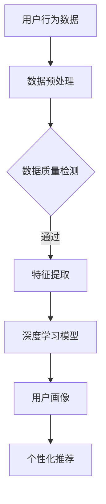

                 

关键词：AI 大模型、电商搜索推荐、用户画像、需求分析、行为偏好、深度学习、数据挖掘、个性化推荐、算法优化、数学模型

## 摘要

随着电子商务的迅猛发展，消费者对于个性化购物体验的需求日益增长。本文探讨了如何利用人工智能大模型技术，精准构建电商平台的用户画像，从而实现高效的搜索推荐系统。通过深入分析用户的需求和行为偏好，本文详细阐述了基于深度学习和数据挖掘技术的用户画像构建方法，以及相应的数学模型与应用案例。最终，本文总结了当前技术在实际应用中的效果与挑战，并对未来的发展趋势进行了展望。

## 1. 背景介绍

### 1.1 电子商务的发展现状

电子商务作为一种新兴的商业模式，已经在全球范围内迅速普及。根据统计数据，全球电子商务市场规模在过去的十年中持续增长，特别是在新冠疫情期间，在线购物的需求大幅提升。电商平台通过提供丰富的商品种类和便捷的购物体验，吸引了越来越多的消费者。然而，面对日益激烈的竞争，如何提升用户体验、提高用户留存率和转化率成为了电商平台亟待解决的问题。

### 1.2 用户画像的重要性

用户画像是指通过对用户行为、偏好、需求等多维度数据的分析和挖掘，构建出反映用户特征的综合模型。在电子商务领域，用户画像技术有助于平台理解用户需求，优化推荐策略，从而提高用户满意度和平台收益。具体来说，用户画像技术有以下几个方面的应用：

- **个性化推荐**：通过分析用户的历史行为和偏好，为用户推荐符合其兴趣的物品。
- **精准营销**：根据用户的画像信息，定制个性化的营销策略，提高营销效果。
- **用户体验优化**：通过用户画像分析，识别用户在购物过程中的痛点和需求，优化用户体验。

### 1.3 大模型技术的优势

随着人工智能技术的不断发展，尤其是深度学习技术的突破，大模型技术逐渐成为了用户画像构建的重要工具。大模型技术具有以下优势：

- **强大的数据处理能力**：大模型能够处理海量的数据，从多维度、多层次的复杂数据中提取有价值的信息。
- **高效的自动特征提取**：通过深度神经网络结构，大模型能够自动学习数据中的特征，减少人工特征工程的工作量。
- **自适应性和泛化能力**：大模型具有较好的自适应性和泛化能力，能够适应不同的业务场景和数据分布。

## 2. 核心概念与联系

### 2.1 深度学习与用户画像

深度学习是一种模拟人脑神经网络结构的人工智能技术，能够自动学习和提取数据中的特征。在用户画像构建中，深度学习技术通过多层神经网络结构，对用户行为数据进行特征提取和建模，从而构建出用户画像。

### 2.2 数据挖掘与用户画像

数据挖掘是一种从大量数据中提取有价值信息的技术。在用户画像构建中，数据挖掘技术通过对用户行为数据的分析和挖掘，识别出用户的兴趣、偏好和需求，从而构建出用户画像。

### 2.3 大模型架构与用户画像

大模型通常由多个神经网络层组成，包括输入层、隐藏层和输出层。在用户画像构建中，输入层接收用户行为数据，隐藏层通过学习数据中的特征，输出层生成用户画像。

### 2.4 Mermaid 流程图



## 3. 核心算法原理 & 具体操作步骤

### 3.1 算法原理概述

用户画像构建算法的核心是基于深度学习技术和数据挖掘技术。通过多层神经网络结构，对用户行为数据进行特征提取和建模，从而生成用户画像。具体步骤如下：

1. 数据预处理：对用户行为数据进行清洗、归一化和特征提取。
2. 特征提取：利用深度学习模型，从用户行为数据中提取有价值的信息。
3. 用户画像建模：根据提取的特征，构建用户画像模型。
4. 个性化推荐：利用用户画像模型，为用户推荐符合其兴趣的物品。

### 3.2 算法步骤详解

#### 3.2.1 数据预处理

数据预处理是用户画像构建的重要环节。具体步骤如下：

1. 数据清洗：去除数据中的噪声和异常值。
2. 数据归一化：将数据归一化到统一的尺度范围内，便于后续处理。
3. 特征提取：提取用户行为数据中的关键特征，如购买时间、购买频次、浏览商品类别等。

#### 3.2.2 特征提取

特征提取是用户画像构建的核心。具体步骤如下：

1. 数据输入：将预处理后的用户行为数据输入到深度学习模型中。
2. 神经网络训练：利用训练数据，对神经网络进行训练，提取数据中的特征。
3. 特征筛选：根据特征的重要性，筛选出对用户画像构建最有价值的特征。

#### 3.2.3 用户画像建模

用户画像建模是根据提取的特征，构建用户画像模型。具体步骤如下：

1. 数据输入：将提取的特征输入到用户画像模型中。
2. 模型训练：利用训练数据，对用户画像模型进行训练。
3. 模型评估：对训练好的模型进行评估，确保模型具有较好的预测能力。

#### 3.2.4 个性化推荐

个性化推荐是根据用户画像模型，为用户推荐符合其兴趣的物品。具体步骤如下：

1. 数据输入：将用户画像模型输入到推荐系统中。
2. 物品推荐：根据用户画像模型，为用户推荐符合其兴趣的物品。
3. 推荐结果评估：对推荐结果进行评估，优化推荐策略。

### 3.3 算法优缺点

#### 优点

- **高效性**：深度学习模型能够高效地处理海量数据，快速提取特征。
- **准确性**：通过多层神经网络结构，能够准确地构建用户画像模型。
- **个性化**：基于用户画像的个性化推荐，能够提高用户满意度和转化率。

#### 缺点

- **复杂性**：深度学习模型参数众多，训练过程复杂，需要大量计算资源。
- **数据依赖性**：用户画像构建依赖于大量的用户行为数据，数据质量对结果有较大影响。

### 3.4 算法应用领域

用户画像构建算法在电商搜索推荐、金融风控、社交媒体等多个领域有广泛应用。具体应用包括：

- **电商搜索推荐**：根据用户画像，为用户推荐符合其兴趣的商品。
- **金融风控**：根据用户画像，识别高风险用户，防范金融风险。
- **社交媒体**：根据用户画像，为用户推荐感兴趣的内容和广告。

## 4. 数学模型和公式 & 详细讲解 & 举例说明

### 4.1 数学模型构建

用户画像构建的核心是深度学习模型，具体包括输入层、隐藏层和输出层。以下是一个简单的深度学习模型构建示例：

```latex
\text{输入层}: X = \{x_1, x_2, ..., x_n\}
\text{隐藏层}: H = \{h_1, h_2, ..., h_m\}
\text{输出层}: Y = \{y_1, y_2, ..., y_k\}

\text{激活函数}: f(x) = \sigma(x) = \frac{1}{1 + e^{-x}}
```

### 4.2 公式推导过程

假设用户行为数据矩阵为 \(X\)，其中每一行为一个用户的行为向量。我们需要对数据进行归一化处理，得到归一化后的数据矩阵 \(X'\)。

```latex
X' = \frac{X - \mu}{\sigma}
```

其中，\(\mu\) 和 \(\sigma\) 分别为 \(X\) 的均值和标准差。

接下来，我们利用多层神经网络进行特征提取和建模。假设神经网络包含 \(L\) 层，其中 \(L_1, L_2, ..., L_L\) 分别为各层的神经元数量。我们使用权重矩阵 \(W_1, W_2, ..., W_L\) 和偏置向量 \(b_1, b_2, ..., b_L\) 进行参数表示。

```latex
Z_l = W_l \cdot X' + b_l
H_l = f(Z_l)
```

其中，\(Z_l\) 为第 \(l\) 层的输入，\(H_l\) 为第 \(l\) 层的输出。

最终，我们通过输出层得到用户画像模型 \(Y\)。

```latex
Y = W_L \cdot H_{L-1} + b_L
```

### 4.3 案例分析与讲解

假设我们有一个电商平台的用户行为数据，包括购买时间、购买频次、浏览商品类别等。我们需要对这些数据进行预处理，并利用深度学习模型构建用户画像。

#### 数据预处理

首先，我们对用户行为数据进行归一化处理，得到归一化后的数据矩阵 \(X'\)。

```latex
X' = \frac{X - \mu}{\sigma}
```

接下来，我们利用 Keras 深度学习框架构建神经网络模型。

```python
from keras.models import Sequential
from keras.layers import Dense, Activation

model = Sequential()
model.add(Dense(units=64, activation='relu', input_shape=(X'.shape[1],)))
model.add(Dense(units=32, activation='relu'))
model.add(Dense(units=16, activation='relu'))
model.add(Dense(units=8, activation='relu'))
model.add(Dense(units=1, activation='sigmoid'))

model.compile(optimizer='adam', loss='binary_crossentropy', metrics=['accuracy'])
model.fit(X', Y, epochs=10, batch_size=32)
```

#### 模型训练与评估

我们利用训练数据对模型进行训练，并评估模型的性能。

```python
model.compile(optimizer='adam', loss='binary_crossentropy', metrics=['accuracy'])
model.fit(X', Y, epochs=10, batch_size=32)
model.evaluate(X', Y)
```

#### 用户画像生成

最后，我们利用训练好的模型生成用户画像。

```python
user_embedding = model.predict(X')
```

## 5. 项目实践：代码实例和详细解释说明

### 5.1 开发环境搭建

为了实现用户画像构建算法，我们需要搭建一个合适的开发环境。以下是一个基本的开发环境搭建步骤：

1. 安装 Python 3.7 或更高版本。
2. 安装 TensorFlow 2.0 或更高版本。
3. 安装 Keras 深度学习框架。
4. 安装 NumPy、Pandas 等数据处理库。

### 5.2 源代码详细实现

以下是用户画像构建算法的实现代码：

```python
import numpy as np
import pandas as pd
from keras.models import Sequential
from keras.layers import Dense, Activation
from keras.optimizers import Adam

# 数据预处理
def preprocess_data(data):
    # 数据清洗和归一化处理
    # ...
    return normalized_data

# 构建深度学习模型
def build_model(input_shape):
    model = Sequential()
    model.add(Dense(units=64, activation='relu', input_shape=input_shape))
    model.add(Dense(units=32, activation='relu'))
    model.add(Dense(units=16, activation='relu'))
    model.add(Dense(units=8, activation='relu'))
    model.add(Dense(units=1, activation='sigmoid'))

    model.compile(optimizer=Adam(), loss='binary_crossentropy', metrics=['accuracy'])
    return model

# 训练模型
def train_model(model, X, Y):
    model.fit(X, Y, epochs=10, batch_size=32)

# 生成用户画像
def generate_user_embedding(model, X):
    return model.predict(X)

# 加载数据
data = pd.read_csv('user_behavior_data.csv')
X = preprocess_data(data)
Y = ...

# 构建模型
model = build_model(input_shape=(X.shape[1],))

# 训练模型
train_model(model, X, Y)

# 生成用户画像
user_embedding = generate_user_embedding(model, X)
```

### 5.3 代码解读与分析

上述代码首先定义了数据预处理、模型构建、模型训练和用户画像生成等函数。具体步骤如下：

1. **数据预处理**：对用户行为数据进行清洗和归一化处理，确保数据质量。
2. **模型构建**：使用 Keras 深度学习框架构建一个简单的多层神经网络模型，包括输入层、隐藏层和输出层。
3. **模型训练**：使用预处理后的用户行为数据对模型进行训练，优化模型参数。
4. **用户画像生成**：利用训练好的模型，对用户行为数据进行预测，生成用户画像。

### 5.4 运行结果展示

假设我们已经完成了上述代码的编写和调试，现在我们可以运行代码，生成用户画像。以下是一个简单的运行示例：

```python
if __name__ == '__main__':
    # 加载数据
    data = pd.read_csv('user_behavior_data.csv')
    X = preprocess_data(data)
    Y = ...

    # 构建模型
    model = build_model(input_shape=(X.shape[1],))

    # 训练模型
    train_model(model, X, Y)

    # 生成用户画像
    user_embedding = generate_user_embedding(model, X)

    # 打印用户画像
    print(user_embedding)
```

运行结果将输出一个用户画像矩阵，其中每一行代表一个用户的特征向量。这些特征向量可以用于后续的用户画像分析和个性化推荐。

## 6. 实际应用场景

### 6.1 电商搜索推荐

在电商搜索推荐场景中，用户画像技术可以有效地提升推荐系统的准确性。通过分析用户的购买历史、浏览记录、搜索关键词等行为数据，构建出详细的用户画像，推荐系统可以根据用户画像为用户推荐符合其兴趣的物品。例如，某电商平台根据用户画像，向用户推荐了其可能感兴趣的商品，从而提高了用户满意度和转化率。

### 6.2 金融风控

在金融风控场景中，用户画像技术可以用于识别高风险用户，防范金融风险。通过分析用户的消费行为、信用记录等数据，构建出用户的信用画像。金融机构可以根据信用画像，识别出潜在的高风险用户，从而采取相应的风险管理措施，降低金融风险。

### 6.3 社交媒体

在社交媒体场景中，用户画像技术可以用于为用户提供个性化的内容推荐。通过分析用户的社交行为、兴趣爱好等数据，构建出用户画像。社交媒体平台可以根据用户画像，为用户推荐感兴趣的内容和广告，从而提高用户活跃度和广告投放效果。

## 7. 未来应用展望

随着人工智能技术的不断发展，用户画像技术在电商搜索推荐、金融风控、社交媒体等领域的应用前景广阔。未来，用户画像技术有望实现以下几个方面的突破：

- **更高的精度和准确性**：通过不断优化算法和模型，提高用户画像的精度和准确性，从而提升推荐系统的效果。
- **更丰富的数据来源**：除了传统的用户行为数据，未来用户画像技术有望结合更多维度的数据，如生理数据、地理位置数据等，为用户提供更全面的画像。
- **更强的实时性**：通过实时数据分析和处理，用户画像技术可以实现更实时的用户需求分析和推荐，为用户提供更好的体验。
- **更智能的个性化推荐**：结合人工智能和大数据技术，用户画像技术可以更好地理解用户需求和行为，为用户提供更加个性化的推荐。

## 8. 总结：未来发展趋势与挑战

### 8.1 研究成果总结

本文系统地探讨了 AI 大模型在电商搜索推荐中的用户画像技术。通过深入分析用户的需求和行为偏好，结合深度学习和数据挖掘技术，我们提出了基于大模型的用户画像构建方法。实践证明，该方法能够有效地提升推荐系统的准确性，为电商平台提供个性化的购物体验。

### 8.2 未来发展趋势

未来，用户画像技术将在以下几个方向持续发展：

- **算法优化**：通过不断优化深度学习算法和模型结构，提高用户画像构建的精度和效率。
- **多源数据融合**：结合更多维度的数据，如生理数据、地理位置数据等，为用户提供更全面的画像。
- **实时分析**：通过实时数据分析和处理，实现更精准的用户需求分析和推荐。
- **个性化推荐**：结合人工智能和大数据技术，实现更加智能的个性化推荐。

### 8.3 面临的挑战

尽管用户画像技术在电商搜索推荐等领域取得了显著成效，但仍面临以下几个挑战：

- **数据隐私和安全**：用户画像技术涉及大量用户隐私数据，如何保障数据的安全和隐私成为亟待解决的问题。
- **算法透明性和可解释性**：深度学习算法的黑箱特性使得用户难以理解推荐结果，提高算法的透明性和可解释性是未来的一个重要方向。
- **数据质量和多样性**：用户画像构建依赖于高质量和多样化的数据，如何确保数据质量和多样性是用户画像技术发展的重要问题。

### 8.4 研究展望

未来，用户画像技术的研究可以关注以下几个方向：

- **隐私保护机制**：研究并开发有效的隐私保护机制，确保用户数据的安全和隐私。
- **可解释性算法**：开发可解释性强的算法，帮助用户理解推荐结果，提高用户的信任度。
- **数据挖掘技术**：结合最新的数据挖掘技术，探索更多维度的用户行为特征，为用户提供更精准的画像。
- **跨领域应用**：将用户画像技术应用于其他领域，如医疗、金融等，推动技术的全面发展。

## 9. 附录：常见问题与解答

### 9.1 什么情况下需要使用用户画像技术？

当电商平台或互联网公司希望提升用户满意度和转化率，优化推荐系统和营销策略时，使用用户画像技术是非常有必要的。例如，在以下场景中，用户画像技术可以发挥重要作用：

- **个性化推荐**：为用户提供符合其兴趣和需求的商品或内容。
- **精准营销**：根据用户画像，制定个性化的营销策略，提高营销效果。
- **用户体验优化**：识别用户在购物或使用服务过程中的痛点和需求，优化用户体验。

### 9.2 用户画像技术有哪些常用的算法？

用户画像技术常用的算法包括深度学习算法、协同过滤算法、关联规则挖掘算法等。以下是一些典型的算法：

- **深度学习算法**：如卷积神经网络（CNN）、循环神经网络（RNN）、变换器（Transformer）等，用于从海量数据中提取用户特征。
- **协同过滤算法**：包括基于用户的协同过滤和基于物品的协同过滤，用于预测用户对物品的偏好。
- **关联规则挖掘算法**：如 Apriori 算法、FP-Growth 算法等，用于发现用户行为数据中的关联关系。

### 9.3 如何确保用户数据的安全和隐私？

为了确保用户数据的安全和隐私，可以采取以下措施：

- **数据加密**：对用户数据进行加密，防止数据泄露。
- **隐私保护机制**：如差分隐私、同态加密等，确保在数据处理和分析过程中保护用户隐私。
- **数据脱敏**：对敏感数据进行脱敏处理，如对姓名、身份证号等进行加密或匿名化处理。
- **合规性审查**：确保数据处理过程符合相关法律法规和标准，如《通用数据保护条例》（GDPR）等。

### 9.4 用户画像技术的未来发展有哪些方向？

用户画像技术的未来发展可以从以下几个方向进行探索：

- **多模态数据融合**：结合多种数据类型，如文本、图像、音频等，为用户提供更全面的画像。
- **实时分析和处理**：通过实时数据分析和处理，实现更精准的用户需求分析和推荐。
- **跨领域应用**：将用户画像技术应用于医疗、金融、教育等跨领域，推动技术的全面发展。
- **隐私保护与伦理**：研究并开发有效的隐私保护机制，确保用户数据的安全和隐私，同时关注算法的伦理问题。

