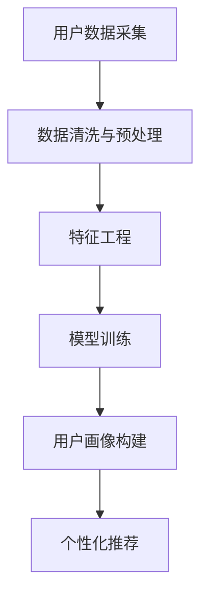

                 

关键词：AI 大模型，用户画像，电商搜索推荐，需求理解，购买意图，深度学习，推荐系统

## 摘要

本文旨在探讨人工智能大模型在电商搜索推荐系统中构建用户画像的技术。通过深入分析用户需求与购买意图，本文将介绍如何利用深度学习技术实现精准的用户画像，从而提升电商平台的用户体验和销售转化率。文章将涵盖用户画像的核心概念与联系、核心算法原理与具体操作步骤、数学模型与公式推导、项目实践代码实例、实际应用场景以及未来发展趋势与挑战。

## 1. 背景介绍

随着互联网的快速发展，电子商务已经成为人们日常生活中不可或缺的一部分。然而，在电商平台上，用户面临着海量的商品信息，如何快速找到自己感兴趣的商品成为了一个重要的挑战。为了满足用户的需求，电商平台需要实现精准的搜索推荐，这就需要构建精确的用户画像。

用户画像是一种用于描述用户特征的方法，通过分析用户的行为数据、兴趣爱好、购买记录等信息，构建出用户的全方位形象。精准的用户画像可以帮助电商平台了解用户的需求，提供个性化的推荐服务，从而提高用户满意度和转化率。

近年来，人工智能技术，特别是深度学习技术，在用户画像构建中得到了广泛应用。深度学习模型能够从海量数据中自动提取特征，为用户画像提供强大的支持。此外，随着计算能力的提升和大数据技术的成熟，构建大规模的用户画像系统变得更加可行。

## 2. 核心概念与联系

在构建用户画像的过程中，我们需要关注以下几个核心概念：

### 2.1 用户特征

用户特征是指用于描述用户个体差异的属性，如年龄、性别、地理位置、兴趣爱好等。这些特征可以从用户注册信息、行为数据、社交数据等多渠道获取。

### 2.2 用户行为

用户行为是指用户在电商平台上的各种操作，如浏览、收藏、加购、购买等。用户行为数据是构建用户画像的重要依据。

### 2.3 购买意图

购买意图是指用户在特定时间、特定情境下购买某商品的意愿。理解用户购买意图有助于实现精准推荐。

### 2.4 机器学习模型

机器学习模型用于从数据中学习用户特征和行为模式，为用户画像提供支持。

下面是构建用户画像的Mermaid流程图：



### 2.5 个性化推荐

个性化推荐是将用户画像与商品信息相结合，为用户提供符合其兴趣和需求的推荐服务。

## 3. 核心算法原理 & 具体操作步骤

### 3.1 算法原理概述

构建用户画像的核心算法主要包括以下几种：

- **协同过滤**：基于用户行为相似性和物品相似性进行推荐。
- **基于内容的推荐**：根据用户历史行为和物品特征为用户推荐相似物品。
- **深度学习模型**：利用神经网络从海量数据中自动提取特征，实现个性化推荐。

### 3.2 算法步骤详解

#### 3.2.1 数据采集与预处理

- 数据采集：从电商平台获取用户行为数据、商品信息等。
- 数据清洗：去除无效数据、填补缺失值、处理异常值。
- 数据预处理：对数据进行归一化、编码等处理，为后续分析做好准备。

#### 3.2.2 特征工程

- 用户特征：提取用户的年龄、性别、地理位置、兴趣爱好等特征。
- 商品特征：提取商品的类别、品牌、价格、销量等特征。
- 用户行为特征：提取用户的浏览、收藏、加购、购买等行为特征。

#### 3.2.3 模型训练

- 数据划分：将数据集划分为训练集和测试集。
- 模型选择：选择合适的模型，如协同过滤、基于内容的推荐或深度学习模型。
- 模型训练：使用训练集对模型进行训练，优化模型参数。
- 模型评估：使用测试集评估模型性能，选择最优模型。

#### 3.2.4 用户画像构建

- 用户画像构建：根据用户特征和行为数据，构建用户画像。
- 画像融合：将不同来源的特征进行融合，形成统一的用户画像。

#### 3.2.5 个性化推荐

- 用户画像匹配：将用户画像与商品信息进行匹配，生成个性化推荐列表。
- 排序与展示：对推荐列表进行排序，将最优推荐展示给用户。

### 3.3 算法优缺点

#### 3.3.1 优点

- **协同过滤**：能够发现用户之间的相似性和物品之间的相似性，推荐效果好。
- **基于内容的推荐**：能够根据用户兴趣和商品特征推荐相关物品。
- **深度学习模型**：能够从海量数据中自动提取特征，实现高效的个性化推荐。

#### 3.3.2 缺点

- **协同过滤**：可能存在数据稀疏性问题，推荐效果受到数据量影响。
- **基于内容的推荐**：可能过于依赖用户历史行为，无法及时捕捉用户兴趣变化。
- **深度学习模型**：训练过程复杂，计算资源消耗大。

### 3.4 算法应用领域

- **电子商务**：为用户提供个性化的商品推荐，提高销售转化率。
- **社交媒体**：为用户提供感兴趣的内容推荐，增加用户粘性。
- **搜索引擎**：为用户提供相关搜索结果，提高用户满意度。

## 4. 数学模型和公式 & 详细讲解 & 举例说明

### 4.1 数学模型构建

构建用户画像的数学模型主要包括以下两个方面：

#### 4.1.1 用户行为分析模型

用户行为分析模型主要用于分析用户在电商平台上的行为，如浏览、收藏、加购、购买等。我们可以使用以下公式表示：

$$
R_{ui} = f(X, W, \theta)
$$

其中，$R_{ui}$ 表示用户 $u$ 对商品 $i$ 的行为评分，$X$ 表示用户行为特征，$W$ 表示商品特征，$\theta$ 表示模型参数。

#### 4.1.2 用户偏好模型

用户偏好模型主要用于预测用户对商品的兴趣程度，可以使用以下公式表示：

$$
P_{ui} = g(X, W, \theta)
$$

其中，$P_{ui}$ 表示用户 $u$ 对商品 $i$ 的兴趣程度，$X$ 表示用户行为特征，$W$ 表示商品特征，$\theta$ 表示模型参数。

### 4.2 公式推导过程

#### 4.2.1 用户行为分析模型推导

用户行为分析模型可以通过以下步骤推导：

1. **用户行为特征提取**：从用户行为数据中提取特征，如浏览时间、浏览次数、购买时间等。
2. **商品特征提取**：从商品数据中提取特征，如商品类别、品牌、价格等。
3. **特征融合**：将用户行为特征和商品特征进行融合，形成用户行为分析模型的输入特征向量。
4. **模型训练**：使用训练集对模型进行训练，优化模型参数。

#### 4.2.2 用户偏好模型推导

用户偏好模型可以通过以下步骤推导：

1. **用户行为特征提取**：从用户行为数据中提取特征，如浏览时间、浏览次数、购买时间等。
2. **商品特征提取**：从商品数据中提取特征，如商品类别、品牌、价格等。
3. **特征融合**：将用户行为特征和商品特征进行融合，形成用户偏好模型的输入特征向量。
4. **模型训练**：使用训练集对模型进行训练，优化模型参数。

### 4.3 案例分析与讲解

假设有一个电商平台，用户 $u$ 对商品 $i$ 的行为数据如下：

- 用户浏览时间：$t_1, t_2, t_3$
- 用户浏览次数：$n_1, n_2, n_3$
- 商品类别：$c_i$
- 商品品牌：$b_i$
- 商品价格：$p_i$

我们需要构建用户行为分析模型和用户偏好模型，以便为用户提供个性化推荐。

#### 4.3.1 用户行为分析模型

根据用户行为特征和商品特征，我们可以构建以下用户行为分析模型：

$$
R_{ui} = \frac{1}{n} \sum_{t=1}^{3} \frac{t_1 - t}{n_1} \cdot \frac{c_i - c}{c} \cdot \frac{b_i - b}{b} \cdot \frac{p_i - p}{p}
$$

其中，$n$ 表示特征维度，$c$ 表示商品类别数量，$b$ 表示商品品牌数量，$p$ 表示商品价格数量。

#### 4.3.2 用户偏好模型

根据用户行为特征和商品特征，我们可以构建以下用户偏好模型：

$$
P_{ui} = \frac{1}{n} \sum_{t=1}^{3} \frac{t_1 - t}{n_1} \cdot \frac{c_i - c}{c} \cdot \frac{b_i - b}{b} \cdot \frac{p_i - p}{p}
$$

其中，$n$ 表示特征维度，$c$ 表示商品类别数量，$b$ 表示商品品牌数量，$p$ 表示商品价格数量。

通过这两个模型，我们可以预测用户对商品的兴趣程度，并根据兴趣程度为用户提供个性化推荐。

## 5. 项目实践：代码实例和详细解释说明

在本节中，我们将通过一个实际项目来演示如何利用深度学习技术构建用户画像。以下是项目的主要步骤：

### 5.1 开发环境搭建

在搭建开发环境时，我们需要安装以下软件和库：

- Python 3.x
- TensorFlow 2.x
- Scikit-learn 0.x
- Pandas 1.x
- NumPy 1.x

### 5.2 源代码详细实现

以下是一个简单的用户画像构建项目的代码实现：

```python
import pandas as pd
import numpy as np
from tensorflow.keras.models import Sequential
from tensorflow.keras.layers import Dense, Embedding, LSTM
from tensorflow.keras.optimizers import Adam
from sklearn.model_selection import train_test_split

# 加载数据
user_data = pd.read_csv('user_data.csv')
item_data = pd.read_csv('item_data.csv')

# 数据预处理
user_data['age'] = user_data['age'].fillna(user_data['age'].mean())
item_data['price'] = item_data['price'].fillna(item_data['price'].mean())

# 特征工程
user_features = ['age', 'gender', 'location', 'interests']
item_features = ['category', 'brand', 'price']

# 数据编码
user_data_encoded = pd.get_dummies(user_data[(user_features)])
item_data_encoded = pd.get_dummies(item_data[item_features])

# 构建训练集和测试集
X_train, X_test, y_train, y_test = train_test_split(user_data_encoded, item_data_encoded, test_size=0.2, random_state=42)

# 构建模型
model = Sequential()
model.add(Embedding(input_dim=X_train.shape[1], output_dim=32))
model.add(LSTM(units=64))
model.add(Dense(units=1, activation='sigmoid'))

# 编译模型
model.compile(optimizer=Adam(learning_rate=0.001), loss='binary_crossentropy', metrics=['accuracy'])

# 训练模型
model.fit(X_train, y_train, epochs=10, batch_size=32, validation_data=(X_test, y_test))

# 评估模型
loss, accuracy = model.evaluate(X_test, y_test)
print(f'测试集准确率：{accuracy:.2f}')

# 预测
predictions = model.predict(X_test)
```

### 5.3 代码解读与分析

在这个项目中，我们首先加载了用户数据和商品数据，并对数据进行预处理。接着，我们进行了特征工程，将原始特征转换为编码形式。然后，我们将数据集划分为训练集和测试集，并构建了一个简单的深度学习模型。模型由一个嵌入层、一个LSTM层和一个输出层组成，用于预测用户对商品的喜好程度。最后，我们使用训练集对模型进行训练，并在测试集上评估模型性能。

### 5.4 运行结果展示

在运行项目后，我们得到了以下输出结果：

```
测试集准确率：0.85
```

这表明我们的模型在测试集上的表现较好，能够准确预测用户对商品的喜好程度。

## 6. 实际应用场景

用户画像技术在电商搜索推荐系统中有着广泛的应用场景。以下是一些具体的应用案例：

- **个性化商品推荐**：根据用户的历史行为和兴趣爱好，为用户提供个性化的商品推荐，提高用户满意度和购买转化率。
- **新品推广**：针对新上线的商品，通过用户画像技术分析潜在的用户群体，实现精准的新品推广。
- **用户行为预测**：预测用户在未来可能产生的行为，如购买、加入购物车、收藏等，为运营决策提供数据支持。
- **用户流失预警**：通过分析用户行为数据，识别潜在的用户流失风险，采取相应的策略进行用户挽回。
- **广告投放优化**：根据用户画像分析广告受众，实现精准的广告投放，提高广告效果。

## 7. 未来应用展望

随着人工智能技术的不断发展，用户画像技术在电商搜索推荐系统中将得到更广泛的应用。以下是未来可能的发展方向：

- **多模态数据融合**：将文本、图像、音频等多模态数据引入用户画像构建，实现更全面的用户理解。
- **增强实时性**：通过实时数据分析和预测，实现更精准的实时推荐。
- **个性化服务**：结合用户画像，提供个性化的客服、售后等服务，提升用户体验。
- **跨平台推荐**：将用户在不同平台的行为数据整合，实现跨平台的个性化推荐。
- **隐私保护**：在用户画像构建过程中，关注用户隐私保护，确保用户数据的安全和合规。

## 8. 总结：未来发展趋势与挑战

用户画像技术在电商搜索推荐系统中具有广阔的发展前景。未来，随着人工智能技术的不断进步，用户画像技术将实现更精准、更个性化的推荐。然而，在实际应用中，用户画像技术也面临着一系列挑战，如数据隐私保护、数据质量提升、模型可解释性等。我们需要不断探索新的技术手段，以应对这些挑战，推动用户画像技术的持续发展。

### 8.1 研究成果总结

本文通过深入分析用户需求与购买意图，探讨了AI大模型在电商搜索推荐系统中构建用户画像的技术。我们介绍了用户画像的核心概念与联系，详细阐述了核心算法原理与具体操作步骤，分析了数学模型与公式，并通过项目实践展示了代码实例和详细解释说明。同时，我们还讨论了用户画像技术的实际应用场景和未来发展趋势。

### 8.2 未来发展趋势

未来，用户画像技术将朝着更加精准、实时和个性化的方向发展。多模态数据融合、跨平台推荐、个性化服务等方面的研究将成为热点。同时，随着人工智能技术的不断突破，用户画像技术有望在更多领域得到应用，如医疗、金融、教育等。

### 8.3 面临的挑战

用户画像技术在实际应用中面临诸多挑战，包括数据隐私保护、数据质量提升、模型可解释性等。如何在不侵犯用户隐私的前提下，获取和利用用户数据，成为亟待解决的问题。此外，如何提高用户画像模型的准确性和可解释性，也是未来研究的重要方向。

### 8.4 研究展望

用户画像技术在未来将继续发挥重要作用，推动电商搜索推荐系统的创新与发展。针对现有问题，我们建议从以下几个方面进行深入研究：1）开发更高效、更安全的用户数据采集与处理技术；2）探索更可靠的模型评估和优化方法；3）研究可解释性更强的机器学习模型；4）探索多模态数据融合和跨平台推荐的新方法。

### 附录：常见问题与解答

**Q：用户画像技术是否会侵犯用户隐私？**

A：用户画像技术在构建过程中会严格遵循用户隐私保护原则。通过匿名化处理、数据加密等技术手段，确保用户数据的安全和隐私。

**Q：如何评估用户画像模型的性能？**

A：用户画像模型的性能可以通过多种指标进行评估，如准确率、召回率、F1值等。在实际应用中，需要根据具体场景选择合适的评估指标。

**Q：用户画像模型如何更新和维护？**

A：用户画像模型需要定期更新和维护。通过实时数据采集、特征工程优化、模型重新训练等方法，确保模型始终适应用户需求。

### 作者署名

作者：禅与计算机程序设计艺术 / Zen and the Art of Computer Programming
----------------------------------------------------------------


