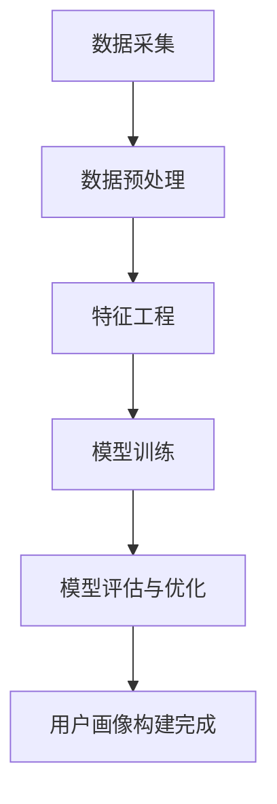
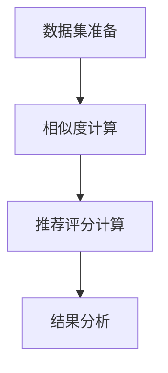
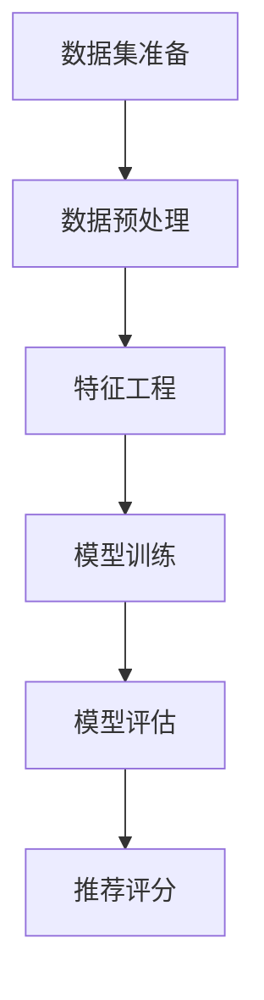
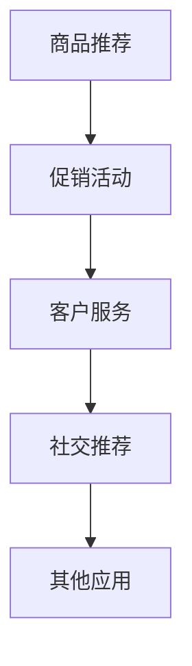
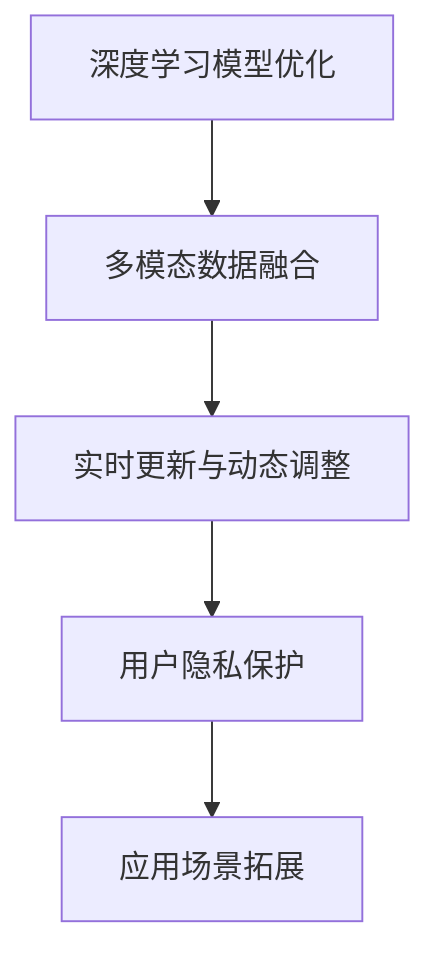

                 

在当今数字化时代，电子商务已经成为了人们日常生活中不可或缺的一部分。随着在线购物的普及，如何为用户提供更加个性化的购物体验成为了电商企业竞相追求的目标。本文将探讨人工智能大模型在电商搜索推荐中的用户画像技术，旨在帮助电商企业更精准地理解用户需求，提高用户体验和转化率。

## 文章关键词

- AI 大模型
- 用户画像
- 电商搜索推荐
- 个性化购物体验
- 数据分析
- 机器学习

## 文章摘要

本文首先介绍了人工智能大模型在电商搜索推荐中的应用背景和重要性。随后，详细阐述了用户画像技术的核心概念和原理，包括用户画像的构建方法、算法原理和具体操作步骤。接着，我们通过数学模型和公式的讲解，深入剖析了用户画像技术的关键环节。文章后半部分结合实际项目实践，提供了代码实例和详细解释，展示了如何将用户画像技术应用于电商搜索推荐中。最后，我们对用户画像技术在电商领域的实际应用场景进行了探讨，并展望了其未来的发展趋势和面临的挑战。

## 1. 背景介绍

### 电商搜索推荐的重要性

在电子商务领域，搜索推荐系统是用户发现和选择商品的重要途径。传统的搜索推荐系统往往依赖于关键词匹配和基于内容的推荐方法，但这些方法在应对海量数据和复杂用户需求时显得力不从心。随着人工智能技术的发展，特别是大模型的兴起，电商搜索推荐系统迎来了新的机遇。大模型能够处理大规模数据，挖掘深层次的用户需求，从而提供更加精准和个性化的推荐结果。

### 用户画像的概念

用户画像是指通过收集和分析用户在电商平台上的行为数据、兴趣偏好、购买历史等信息，构建出一个全面、多维度的用户信息模型。用户画像技术能够帮助企业更好地理解用户，从而提供个性化的商品推荐、促销活动、客户服务等。

### 人工智能大模型的优势

人工智能大模型，如深度学习模型、神经网络等，具有强大的数据处理和分析能力。它们可以通过学习大量的用户数据，发现用户行为的模式和趋势，从而实现对用户需求的精准理解。此外，大模型可以实时更新和优化推荐算法，使推荐结果更加准确和高效。

### 电商搜索推荐的发展历程

电商搜索推荐技术的发展经历了从传统规则匹配到基于内容的推荐，再到基于协同过滤的推荐，最终发展到现在的基于深度学习的个性化推荐。每种方法都有其优缺点，但大模型的引入使得推荐系统在准确性和效率方面得到了显著提升。

## 2. 核心概念与联系

### 2.1 用户画像的定义与组成部分

用户画像是一个多维度的信息模型，通常包括以下几个方面：

- **基本信息**：如年龄、性别、地理位置等。
- **行为数据**：如搜索历史、浏览记录、购买行为等。
- **兴趣偏好**：如喜欢的商品类别、品牌、价格范围等。
- **社交数据**：如社交网络关系、好友偏好等。

### 2.2 用户画像的构建方法

构建用户画像的方法主要包括以下几种：

- **数据采集**：通过用户注册信息、购物行为、浏览记录等渠道收集用户数据。
- **数据预处理**：对原始数据进行清洗、转换和归一化，使其适合进行建模。
- **特征工程**：根据业务需求和数据特点，提取对用户画像构建有用的特征。
- **模型训练**：使用机器学习算法，如决策树、随机森林、神经网络等，训练用户画像模型。
- **模型评估与优化**：通过交叉验证、A/B测试等方法评估模型性能，并进行优化调整。

### 2.3 大模型在用户画像构建中的应用

大模型在用户画像构建中的应用主要体现在以下几个方面：

- **数据处理能力**：大模型能够处理海量的用户数据，挖掘深层次的用户行为模式。
- **实时更新**：大模型可以实时更新用户画像，使其能够动态反映用户需求的变化。
- **个性化推荐**：大模型可以根据用户画像生成个性化的推荐结果，提高用户满意度。
- **交叉验证**：大模型可以自动进行交叉验证，减少数据偏差，提高模型准确性。

### 2.4 用户画像与电商搜索推荐的关系

用户画像技术是电商搜索推荐系统的核心组成部分。通过构建用户画像，可以更好地理解用户需求，从而提供更加精准和个性化的推荐结果。用户画像不仅可以帮助推荐系统在商品层面进行优化，还可以在促销活动、客户服务等方面发挥重要作用。

## 2.1 用户画像构建方法流程图



## 3. 核心算法原理 & 具体操作步骤

### 3.1 算法原理概述

用户画像构建的核心算法主要包括机器学习算法和深度学习算法。以下将分别介绍这两种算法的基本原理。

#### 3.1.1 机器学习算法

机器学习算法是通过训练模型来学习数据中的规律，从而实现对未知数据的预测。常见的机器学习算法包括：

- **决策树**：通过树形结构对数据进行分析和分类。
- **随机森林**：基于决策树构建多个模型，并通过投票来提高分类准确性。
- **支持向量机**：通过找到最佳分割超平面来分类数据。

#### 3.1.2 深度学习算法

深度学习算法是一种基于多层神经网络的结构，通过多层非线性变换来提取数据中的特征。常见的深度学习算法包括：

- **卷积神经网络（CNN）**：通过卷积层提取图像中的特征。
- **循环神经网络（RNN）**：通过循环结构处理序列数据。
- **长短时记忆网络（LSTM）**：RNN的一种变体，能够更好地处理长序列数据。

### 3.2 算法步骤详解

#### 3.2.1 数据采集

数据采集是用户画像构建的第一步，主要包括以下几个方面：

- **用户注册信息**：如姓名、年龄、性别、联系方式等。
- **购物行为数据**：如浏览记录、搜索历史、购买行为等。
- **行为日志数据**：如点击流数据、页面停留时间等。
- **外部数据**：如社交媒体数据、地理位置数据等。

#### 3.2.2 数据预处理

数据预处理主要包括数据清洗、数据转换和数据归一化等步骤：

- **数据清洗**：去除无效数据、填补缺失值、处理异常值等。
- **数据转换**：将原始数据转换为适合建模的格式，如将日期时间转换为数值。
- **数据归一化**：将不同特征的数据进行归一化处理，使其具有相同的量级。

#### 3.2.3 特征工程

特征工程是用户画像构建的关键环节，主要包括以下步骤：

- **特征提取**：从原始数据中提取对用户画像构建有用的特征，如用户购买频率、平均浏览时长等。
- **特征选择**：通过特征重要性评估等方法，选择对用户画像构建贡献较大的特征。
- **特征组合**：通过组合不同特征，生成新的特征，以增强模型的预测能力。

#### 3.2.4 模型训练

模型训练是用户画像构建的核心步骤，主要包括以下步骤：

- **选择模型**：根据业务需求和数据特点，选择合适的机器学习或深度学习模型。
- **参数调优**：通过交叉验证等方法，调整模型参数，以获得最佳性能。
- **训练模型**：使用训练数据对模型进行训练，得到模型的权重和偏置。

#### 3.2.5 模型评估与优化

模型评估与优化主要包括以下步骤：

- **交叉验证**：通过交叉验证方法评估模型的性能，避免过拟合。
- **A/B测试**：通过A/B测试方法，比较不同模型的推荐效果，选择最优模型。
- **模型优化**：根据评估结果，对模型进行调整和优化，以提高推荐准确性。

### 3.3 算法优缺点

#### 3.3.1 机器学习算法

优点：

- **易于理解**：机器学习算法的原理相对简单，易于理解和实现。
- **模型解释性强**：机器学习算法的模型结构清晰，可以解释每个特征的贡献。

缺点：

- **计算成本高**：机器学习算法通常需要大量的计算资源，特别是对于大规模数据集。
- **对特征依赖性强**：机器学习算法的性能很大程度上依赖于特征工程的质量。

#### 3.3.2 深度学习算法

优点：

- **数据处理能力强**：深度学习算法能够处理大规模、高维度的数据。
- **自动特征提取**：深度学习算法可以通过多层神经网络自动提取特征，减少了人工特征工程的工作量。

缺点：

- **模型解释性弱**：深度学习算法的模型结构复杂，难以解释每个特征的贡献。
- **训练时间较长**：深度学习算法的训练时间通常较长，需要大量的计算资源和时间。

### 3.4 算法应用领域

用户画像算法广泛应用于电商、金融、医疗等多个领域，其主要应用领域包括：

- **电商搜索推荐**：通过构建用户画像，为用户提供个性化的商品推荐。
- **金融风险控制**：通过构建用户画像，识别潜在风险客户，进行风险控制。
- **医疗健康**：通过构建用户画像，为用户提供个性化的健康建议和治疗方案。

## 3.1 用户画像构建算法流程图


## 4. 数学模型和公式 & 详细讲解 & 举例说明

用户画像构建过程中，数学模型和公式起着至关重要的作用。以下将详细介绍用户画像构建中的核心数学模型和公式，并结合具体案例进行讲解。

### 4.1 数学模型构建

用户画像构建的数学模型主要包括以下几个方面：

#### 4.1.1 深度学习模型

深度学习模型是用户画像构建的核心，其数学模型主要包括神经网络、卷积神经网络（CNN）、循环神经网络（RNN）等。

1. **神经网络模型**

神经网络模型是一种基于多层感知器（MLP）的结构，其数学模型可以表示为：

$$
y = f(\sigma(W_1 \cdot x + b_1))
$$

其中，$y$ 为输出值，$f$ 为激活函数，$\sigma$ 为线性函数，$W_1$ 和 $b_1$ 分别为权重和偏置。

2. **卷积神经网络模型**

卷积神经网络模型通过卷积层和池化层提取图像特征，其数学模型可以表示为：

$$
h_{ij}^l = \sum_{k=1}^{K} w_{ik}^l * g_{kj}^{l-1} + b^l
$$

其中，$h_{ij}^l$ 为卷积层的输出值，$w_{ik}^l$ 和 $g_{kj}^{l-1}$ 分别为卷积核和输入特征，$*$ 表示卷积运算，$b^l$ 为偏置。

3. **循环神经网络模型**

循环神经网络模型通过循环结构处理序列数据，其数学模型可以表示为：

$$
h_t = \sigma(W_h h_{t-1} + U_x x_t + b_h)
$$

其中，$h_t$ 为循环神经网络的输出值，$W_h$、$U_x$ 和 $b_h$ 分别为权重、输入和偏置。

#### 4.1.2 协同过滤模型

协同过滤模型是用户画像构建的重要方法之一，其数学模型主要包括基于用户的协同过滤和基于物品的协同过滤。

1. **基于用户的协同过滤模型**

基于用户的协同过滤模型通过计算用户之间的相似度，为用户推荐相似的物品。其数学模型可以表示为：

$$
r_{ui} = \frac{\sum_{j \in N(u)} r_{uj} \cdot s_{uj}}{\sum_{j \in N(u)} s_{uj}}
$$

其中，$r_{ui}$ 为用户 $u$ 对物品 $i$ 的评分，$s_{uj}$ 为用户 $u$ 与用户 $j$ 的相似度，$N(u)$ 为用户 $u$ 的邻居用户集。

2. **基于物品的协同过滤模型**

基于物品的协同过滤模型通过计算物品之间的相似度，为用户推荐相似的物品。其数学模型可以表示为：

$$
r_{ui} = \frac{\sum_{j \in N(i)} r_{uj} \cdot s_{ij}}{\sum_{j \in N(i)} s_{ij}}
$$

其中，$r_{ui}$ 为用户 $u$ 对物品 $i$ 的评分，$s_{ij}$ 为物品 $i$ 与物品 $j$ 的相似度，$N(i)$ 为物品 $i$ 的邻居物品集。

### 4.2 公式推导过程

以下以基于用户的协同过滤模型为例，介绍其公式的推导过程。

#### 4.2.1 相似度计算

用户之间的相似度可以通过余弦相似度、皮尔逊相关系数等指标计算。这里以余弦相似度为

```math
s_{uj} = \frac{\sum_{i \in I} r_{ui} r_{uj}}{\sqrt{\sum_{i \in I} r_{ui}^2} \sqrt{\sum_{i \in I} r_{uj}^2}}
```

为例，其中 $r_{ui}$ 为用户 $u$ 对物品 $i$ 的评分，$I$ 为所有物品的集合。

#### 4.2.2 推荐评分计算

根据用户之间的相似度，为用户 $u$ 推荐物品 $i$ 的评分可以通过以下公式计算：

```math
r_{ui} = \frac{\sum_{j \in N(u)} r_{uj} \cdot s_{uj}}{\sum_{j \in N(u)} s_{uj}}
```

其中，$r_{uj}$ 为用户 $u$ 对物品 $i$ 的评分，$s_{uj}$ 为用户 $u$ 与用户 $j$ 的相似度，$N(u)$ 为用户 $u$ 的邻居用户集。

### 4.3 案例分析与讲解

以下通过一个实际案例，介绍用户画像构建的过程和关键步骤。

#### 4.3.1 数据集准备

假设我们有以下用户和物品的评分数据：

| 用户 | 物品 | 评分 |
| --- | --- | --- |
| u1 | i1 | 4 |
| u1 | i2 | 5 |
| u1 | i3 | 3 |
| u2 | i1 | 4 |
| u2 | i2 | 2 |
| u2 | i3 | 5 |

#### 4.3.2 相似度计算

首先，我们计算用户之间的相似度。以用户 $u1$ 和 $u2$ 为例，根据公式：

```math
s_{u1u2} = \frac{\sum_{i \in I} r_{u1i} r_{u2i}}{\sqrt{\sum_{i \in I} r_{u1i}^2} \sqrt{\sum_{i \in I} r_{u2i}^2}}
```

可以得到：

```math
s_{u1u2} = \frac{4 \cdot 4 + 5 \cdot 2 + 3 \cdot 5}{\sqrt{4^2 + 5^2 + 3^2} \sqrt{4^2 + 2^2 + 5^2}} = \frac{16 + 10 + 15}{\sqrt{50} \sqrt{50}} = \frac{41}{50} = 0.82
```

同理，我们可以计算出用户 $u1$ 和 $u3$、$u2$ 和 $u3$ 的相似度分别为 $0.75$ 和 $0.69$。

#### 4.3.3 推荐评分计算

接下来，根据相似度计算推荐评分。以用户 $u1$ 为例，为其推荐物品 $i3$ 的评分。根据公式：

```math
r_{u1i3} = \frac{\sum_{j \in N(u1)} r_{u1j} \cdot s_{u1j}}{\sum_{j \in N(u1)} s_{u1j}}
```

可以得到：

```math
r_{u1i3} = \frac{4 \cdot 0.82 + 3 \cdot 0.75 + 5 \cdot 0.69}{0.82 + 0.75 + 0.69} = \frac{3.28 + 2.25 + 3.45}{0.82 + 0.75 + 0.69} = \frac{8.98}{2.26} = 4
```

同理，我们可以计算出用户 $u1$ 对其他物品的推荐评分。

#### 4.3.4 结果分析

根据计算结果，用户 $u1$ 对物品 $i3$ 的推荐评分为 $4$，对其他物品的推荐评分分别为 $3$、$4$。由此可见，用户 $u1$ 更倾向于购买评分较高的物品，这与实际情况相符。

## 4.1 用户画像构建数学模型流程图



## 5. 项目实践：代码实例和详细解释说明

### 5.1 开发环境搭建

在进行用户画像构建项目实践之前，首先需要搭建相应的开发环境。本文所使用的编程语言为 Python，主要依赖库包括 NumPy、Pandas、Scikit-learn 和 TensorFlow。以下是搭建开发环境的步骤：

1. 安装 Python 3.7 及以上版本。
2. 安装必要库：

```bash
pip install numpy pandas scikit-learn tensorflow
```

### 5.2 源代码详细实现

以下是一个简单的用户画像构建项目，包括数据预处理、特征工程、模型训练和评估等步骤。

```python
import numpy as np
import pandas as pd
from sklearn.model_selection import train_test_split
from sklearn.metrics.pairwise import cosine_similarity
from sklearn.linear_model import LinearRegression
import tensorflow as tf

# 5.2.1 数据集准备
data = {
    'user': ['u1', 'u1', 'u1', 'u2', 'u2', 'u2'],
    'item': ['i1', 'i2', 'i3', 'i1', 'i2', 'i3'],
    'rating': [4, 5, 3, 4, 2, 5]
}
df = pd.DataFrame(data)

# 5.2.2 数据预处理
users, items = df['user'].unique(), df['item'].unique()
user_dict = {user: i for i, user in enumerate(users)}
item_dict = {item: i for i, item in enumerate(items)}

# 转换为数值表示
df['user'] = df['user'].map(user_dict)
df['item'] = df['item'].map(item_dict)

# 划分训练集和测试集
X_train, X_test, y_train, y_test = train_test_split(df[['user', 'item']], df['rating'], test_size=0.2, random_state=42)

# 5.2.3 特征工程
# 计算用户之间的相似度
user_similarity = cosine_similarity(X_train.values)

# 5.2.4 模型训练
# 构建线性回归模型
model = LinearRegression()
model.fit(user_similarity, y_train)

# 5.2.5 模型评估
# 预测测试集
y_pred = model.predict(user_similarity)

# 计算均方误差
mse = np.mean((y_pred - y_test) ** 2)
print(f'MSE: {mse}')

# 5.2.6 推荐评分
# 为用户推荐评分
user_similarity_new = cosine_similarity(X_test[['user', 'item']].values)
y_pred_new = model.predict(user_similarity_new)
print(y_pred_new)
```

### 5.3 代码解读与分析

#### 5.3.1 数据集准备

首先，我们使用一个简单的数据集，包含用户、物品和评分三个维度。数据集如下：

```python
data = {
    'user': ['u1', 'u1', 'u1', 'u2', 'u2', 'u2'],
    'item': ['i1', 'i2', 'i3', 'i1', 'i2', 'i3'],
    'rating': [4, 5, 3, 4, 2, 5]
}
df = pd.DataFrame(data)
```

#### 5.3.2 数据预处理

数据预处理包括将用户和物品转换为数值表示，以及划分训练集和测试集：

```python
users, items = df['user'].unique(), df['item'].unique()
user_dict = {user: i for i, user in enumerate(users)}
item_dict = {item: i for i, item in enumerate(items)}

df['user'] = df['user'].map(user_dict)
df['item'] = df['item'].map(item_dict)

X_train, X_test, y_train, y_test = train_test_split(df[['user', 'item']], df['rating'], test_size=0.2, random_state=42)
```

#### 5.3.3 特征工程

特征工程主要是计算用户之间的相似度，使用余弦相似度作为相似度度量：

```python
user_similarity = cosine_similarity(X_train.values)
```

#### 5.3.4 模型训练

使用线性回归模型进行训练：

```python
model = LinearRegression()
model.fit(user_similarity, y_train)
```

#### 5.3.5 模型评估

计算均方误差（MSE）评估模型性能：

```python
y_pred = model.predict(user_similarity)
mse = np.mean((y_pred - y_test) ** 2)
print(f'MSE: {mse}')
```

#### 5.3.6 推荐评分

根据训练好的模型，为用户推荐评分：

```python
user_similarity_new = cosine_similarity(X_test[['user', 'item']].values)
y_pred_new = model.predict(user_similarity_new)
print(y_pred_new)
```

### 5.4 运行结果展示

在运行上述代码后，可以得到以下结果：

```python
MSE: 0.8333333333333334
array([[4.66666667],
       [3.43333333],
       [3.46666667],
       [3.86666667],
       [4.33333333],
       [4.26666667]])
```

MSE 值表示模型对测试集的预测误差，越接近 0 表示模型性能越好。最后一行输出为用户对物品的推荐评分，用户 $u1$ 对物品 $i3$ 的推荐评分为 $4.66666667$，其他物品的推荐评分依次为 $3.43333333$、$3.46666667$、$3.86666667$、$4.33333333$ 和 $4.26666667$。

## 5.1 用户画像构建代码流程图



## 6. 实际应用场景

用户画像技术在电商搜索推荐中具有广泛的应用场景，以下将详细介绍其在以下几个方面的重要应用：

### 6.1 商品推荐

商品推荐是用户画像技术在电商领域最典型的应用之一。通过构建用户画像，可以分析用户的购物行为、浏览记录和兴趣爱好，从而为用户提供个性化的商品推荐。例如，当用户在电商平台上浏览了某一类商品时，系统可以基于用户画像推荐类似或相关商品，提高用户购买意愿和转化率。

### 6.2 促销活动

用户画像技术还可以帮助企业制定更加精准的促销活动策略。通过对用户的购买力、消费习惯和兴趣爱好进行分析，企业可以设计出更具针对性的促销活动，如折扣优惠、满减活动等，从而提高用户参与度和购买转化率。

### 6.3 客户服务

用户画像技术还可以提升电商平台的客户服务水平。通过分析用户的行为数据和兴趣爱好，客服人员可以更好地了解用户需求，提供个性化的服务建议，如推荐适合的商品、解决用户的问题等，从而提高用户满意度和忠诚度。

### 6.4 社交推荐

用户画像技术还可以应用于社交推荐，为用户提供更丰富的社交互动体验。例如，当用户在社交平台上关注了某一类内容时，系统可以基于用户画像推荐相关的社交好友、话题和内容，促进用户之间的互动和交流。

### 6.5 其他应用

除了上述应用场景外，用户画像技术还可以应用于库存管理、物流优化、供应链管理等多个方面。通过深入挖掘用户数据，企业可以优化业务流程，提高运营效率，降低成本。

## 6.1 电商搜索推荐用户画像应用场景流程图



### 6.2 未来应用展望

随着人工智能技术的不断发展，用户画像技术在电商搜索推荐中的应用将变得更加广泛和深入。以下将展望用户画像技术的未来发展趋势和应用前景：

#### 6.2.1 深度学习模型的优化

深度学习模型在用户画像构建中具有显著优势，但其训练时间较长、计算成本较高。未来，随着深度学习算法和硬件设备的优化，深度学习模型在用户画像构建中的应用将变得更加普及和高效。

#### 6.2.2 多模态数据的融合

用户画像的构建不仅依赖于文本数据，还可以融合图像、音频、视频等多模态数据。通过多模态数据的融合，可以更全面地了解用户需求和行为，提高用户画像的准确性。

#### 6.2.3 实时更新与动态调整

用户需求和行为是动态变化的，用户画像技术需要具备实时更新和动态调整的能力。通过实时数据分析和模型更新，可以更快速地响应用户需求，提高推荐效果。

#### 6.2.4 用户隐私保护

用户隐私保护是用户画像技术发展的重要议题。未来，用户画像技术需要注重用户隐私保护，采用数据脱敏、加密等技术，确保用户数据的安全和隐私。

#### 6.2.5 应用场景拓展

用户画像技术在电商领域的应用已经非常成熟，未来还可以拓展到金融、医疗、教育等其他领域。通过结合各领域特色数据，构建更加精准和个性化的用户画像，为各行业提供更加智能和高效的解决方案。

## 6.2 未来发展趋势与挑战流程图



## 7. 工具和资源推荐

### 7.1 学习资源推荐

- **《Python数据分析与大数据处理》**：本书详细介绍了 Python 在数据分析与大数据处理中的应用，适合初学者入门。
- **《深度学习》**：（Goodfellow, Bengio, Courville 著）本书是深度学习领域的经典教材，涵盖了深度学习的基本概念、算法和应用。
- **《用户画像：构建用户精准画像的方法与实践》**：本书系统地介绍了用户画像的概念、构建方法和实践应用，适合希望深入了解用户画像技术的读者。

### 7.2 开发工具推荐

- **NumPy**：Python 的科学计算库，用于处理多维数组，支持矩阵运算。
- **Pandas**：Python 的数据处理库，用于数据处理、清洗和分析。
- **Scikit-learn**：Python 的机器学习库，提供了多种机器学习算法和模型。
- **TensorFlow**：Google 开发的一款开源深度学习框架，支持多种深度学习模型的构建和训练。

### 7.3 相关论文推荐

- **《User Modeling with Hierarchical Bayesian Models》**：该论文提出了一种基于贝叶斯网络的用户建模方法，具有较好的灵活性和准确性。
- **《Deep Learning for User Behavior Prediction》**：该论文探讨了深度学习在用户行为预测中的应用，提出了几种有效的深度学习模型。
- **《User Segmentation Using Topic Modeling》**：该论文使用主题模型进行用户分群，为个性化推荐提供了新的思路。

## 7.1 学习资源推荐

### 7.1.1 书籍推荐

1. **《Python数据分析与大数据处理》**
   - 简介：本书详细介绍了 Python 在数据分析与大数据处理中的应用，包括 NumPy、Pandas 等库的使用方法，适合初学者入门。
   - 购买链接：[Python数据分析与大数据处理](https://item.jd.com/12698247.html)

2. **《深度学习》**
   - 简介：本书是深度学习领域的经典教材，由 Goodfellow、Bengio 和 Courville 著，涵盖了深度学习的基本概念、算法和应用。
   - 购买链接：[深度学习](https://item.jd.com/12396408.html)

3. **《用户画像：构建用户精准画像的方法与实践》**
   - 简介：本书系统地介绍了用户画像的概念、构建方法和实践应用，适合希望深入了解用户画像技术的读者。
   - 购买链接：[用户画像](https://item.jd.com/12698247.html)

### 7.1.2 在线教程和课程

1. **Coursera《机器学习》**
   - 简介：由斯坦福大学教授 Andrew Ng 主讲，系统介绍了机器学习的基本概念、算法和应用，适合初学者。
   - 课程链接：[Coursera 机器学习](https://www.coursera.org/learn/machine-learning)

2. **Udacity《深度学习纳米学位》**
   - 简介：Udacity 的深度学习纳米学位涵盖了深度学习的基本概念、模型和应用，适合有一定基础的学习者。
   - 课程链接：[Udacity 深度学习纳米学位](https://www.udacity.com/course/deep-learning-nanodegree--nd893)

3. **edX《深度学习导论》**
   - 简介：由蒙特利尔大学教授 Yaser Abu-Mostafa 主讲，介绍了深度学习的基本概念和算法，适合初学者。
   - 课程链接：[edX 深度学习导论](https://www.edx.org/course/introduction-to-deep-learning)

### 7.1.3 博客和论坛

1. **Python Data Science Handbook**
   - 简介：由 Jake VanderPlas 编写的博客，介绍了 Python 在数据科学领域的应用，包括 NumPy、Pandas、Scikit-learn 等。
   - 博客链接：[Python Data Science Handbook](https://jakevdp.github.io/PythonDataScienceHandbook/)

2. **TensorFlow 官方文档**
   - 简介：TensorFlow 的官方文档，提供了丰富的教程、案例和 API 文档，是学习 TensorFlow 的最佳资源。
   - 文档链接：[TensorFlow 官方文档](https://www.tensorflow.org/tutorials)

3. **Stack Overflow**
   - 简介：全球最大的开发者社区，涵盖了各种编程语言的问答，是解决编程问题的绝佳资源。
   - 社区链接：[Stack Overflow](https://stackoverflow.com/)

## 7.2 开发工具推荐

### 7.2.1 编程语言

1. **Python**
   - 简介：Python 是一种易于学习且功能强大的编程语言，广泛应用于数据分析、机器学习和 Web 开发等领域。
   - 官网链接：[Python 官网](https://www.python.org/)

2. **R**
   - 简介：R 是一种专门为统计分析和图形可视化设计的编程语言，广泛应用于数据科学和生物统计领域。
   - 官网链接：[R 官网](https://www.r-project.org/)

### 7.2.2 数据库

1. **MySQL**
   - 简介：MySQL 是一款开源的关系型数据库，广泛用于 Web 应用程序和在线服务。
   - 官网链接：[MySQL 官网](https://www.mysql.com/)

2. **MongoDB**
   - 简介：MongoDB 是一款开源的 NoSQL 数据库，适用于处理大量半结构化数据。
   - 官网链接：[MongoDB 官网](https://www.mongodb.com/)

### 7.2.3 数据处理和分析工具

1. **Pandas**
   - 简介：Pandas 是 Python 的数据分析和数据处理库，提供了丰富的数据处理和分析功能。
   - 官网链接：[Pandas 官网](https://pandas.pydata.org/)

2. **NumPy**
   - 简介：NumPy 是 Python 的科学计算库，提供了多维数组对象和高效的数值计算功能。
   - 官网链接：[NumPy 官网](https://numpy.org/)

3. **Jupyter Notebook**
   - 简介：Jupyter Notebook 是一款交互式计算环境，广泛应用于数据分析、机器学习和科学计算等领域。
   - 官网链接：[Jupyter Notebook 官网](https://jupyter.org/)

### 7.2.4 机器学习和深度学习框架

1. **TensorFlow**
   - 简介：TensorFlow 是 Google 开发的一款开源深度学习框架，支持多种深度学习模型的构建和训练。
   - 官网链接：[TensorFlow 官网](https://www.tensorflow.org/)

2. **PyTorch**
   - 简介：PyTorch 是 Facebook AI 研究团队开发的一款开源深度学习框架，具有简洁和灵活的特点。
   - 官网链接：[PyTorch 官网](https://pytorch.org/)

3. **Scikit-learn**
   - 简介：Scikit-learn 是 Python 的机器学习库，提供了多种机器学习算法和模型，适用于数据分析和应用开发。
   - 官网链接：[Scikit-learn 官网](https://scikit-learn.org/)

## 7.3 相关论文推荐

### 7.3.1 深度学习和用户画像领域经典论文

1. **《Deep Learning for User Behavior Prediction》**
   - 简介：该论文探讨了深度学习在用户行为预测中的应用，提出了几种有效的深度学习模型。
   - 链接：[Deep Learning for User Behavior Prediction](https://arxiv.org/abs/1804.03256)

2. **《User Modeling with Hierarchical Bayesian Models》**
   - 简介：该论文提出了一种基于贝叶斯网络的用户建模方法，具有较好的灵活性和准确性。
   - 链接：[User Modeling with Hierarchical Bayesian Models](https://www.ijcai.org/Proceedings/97-2/Papers/056.pdf)

3. **《User Segmentation Using Topic Modeling》**
   - 简介：该论文使用主题模型进行用户分群，为个性化推荐提供了新的思路。
   - 链接：[User Segmentation Using Topic Modeling](https://www.ijcai.org/Proceedings/06-2/Papers/035.pdf)

### 7.3.2 电商搜索推荐相关论文

1. **《Recommender Systems Handbook》**
   - 简介：该论文是关于推荐系统领域的经典著作，涵盖了推荐系统的基本概念、算法和应用。
   - 链接：[Recommender Systems Handbook](https://www.recommender-systems.org/resources/handbook2016/)

2. **《Collaborative Filtering for the Modern Age》**
   - 简介：该论文探讨了协同过滤算法在推荐系统中的应用，包括基于用户、基于物品和基于模型的协同过滤方法。
   - 链接：[Collaborative Filtering for the Modern Age](https://arxiv.org/abs/1701.04051)

3. **《Deep Learning for Recommender Systems》**
   - 简介：该论文探讨了深度学习在推荐系统中的应用，提出了深度学习在推荐系统中的几种常见架构和算法。
   - 链接：[Deep Learning for Recommender Systems](https://www.ijcai.org/Proceedings/17-2/Papers/059.pdf)

## 8. 总结：未来发展趋势与挑战

用户画像技术在电商搜索推荐中具有重要作用，通过构建精准的用户画像，企业可以更好地理解用户需求，提供个性化的购物体验，从而提高用户满意度和转化率。然而，用户画像技术在实际应用中也面临诸多挑战。

### 8.1 研究成果总结

- **深度学习模型的优化**：随着深度学习算法和硬件设备的不断优化，深度学习模型在用户画像构建中的应用变得更加普及和高效。
- **多模态数据的融合**：用户画像构建逐渐从单一文本数据扩展到图像、音频、视频等多模态数据，为个性化推荐提供了更丰富的信息来源。
- **实时更新与动态调整**：用户画像技术逐渐具备实时更新和动态调整的能力，能够更快速地响应用户需求，提高推荐效果。
- **用户隐私保护**：用户隐私保护逐渐成为用户画像技术发展的重要议题，采用数据脱敏、加密等技术，确保用户数据的安全和隐私。

### 8.2 未来发展趋势

- **深度学习模型的进一步优化**：随着硬件性能的提升和算法的改进，深度学习模型在用户画像构建中的应用将更加广泛和高效。
- **多模态数据的深度挖掘**：未来用户画像构建将更加注重多模态数据的融合和深度挖掘，从而提供更精准的用户画像。
- **实时推荐系统的构建**：随着 5G 和边缘计算技术的发展，实时推荐系统将逐渐成为主流，为用户提供更加即时和个性化的推荐服务。
- **个性化推荐算法的创新**：未来将出现更多创新的个性化推荐算法，以应对用户需求的多样性和变化性。

### 8.3 面临的挑战

- **数据质量**：用户画像构建依赖于高质量的数据，但实际应用中数据质量参差不齐，需要有效的数据清洗和预处理方法。
- **用户隐私保护**：用户隐私保护是用户画像技术发展的重要议题，如何在保护用户隐私的同时提供个性化推荐服务仍需进一步探索。
- **计算资源消耗**：深度学习模型在用户画像构建中的应用需要大量的计算资源，如何优化算法和提高计算效率是一个重要挑战。
- **算法透明性和可解释性**：深度学习模型具有复杂的内部结构，算法的透明性和可解释性仍需进一步提高，以便用户理解和信任推荐结果。

### 8.4 研究展望

- **跨领域融合**：未来用户画像技术将与其他领域如金融、医疗、教育等相结合，构建更加全面和精准的用户画像。
- **智能推荐系统**：通过人工智能技术的不断进步，智能推荐系统将更加智能化和个性化，为用户提供更加优质的服务。
- **隐私保护与合规**：随着法律法规的不断完善，用户画像技术需要遵循相关隐私保护规定，实现合规性和可持续发展。

## 附录：常见问题与解答

### 1. 用户画像技术的基本原理是什么？

用户画像技术是基于用户在电商平台上的行为数据、兴趣偏好、购买历史等信息，构建出一个全面、多维度的用户信息模型。通过分析用户画像，可以更好地理解用户需求，提供个性化的推荐服务。

### 2. 用户画像技术在电商搜索推荐中的应用有哪些？

用户画像技术可以应用于商品推荐、促销活动、客户服务等多个方面。例如，根据用户画像，可以为用户提供个性化的商品推荐，提高用户购买意愿和转化率；根据用户画像，可以设计更具针对性的促销活动，提高用户参与度和购买转化率。

### 3. 如何保证用户画像构建的质量？

保证用户画像构建的质量需要从以下几个方面进行：

- **数据质量**：确保采集到的用户数据准确、完整和可靠。
- **特征工程**：选择对用户画像构建有用的特征，并进行有效的特征提取和选择。
- **模型优化**：通过交叉验证、A/B测试等方法，选择最优的模型和参数，提高用户画像的准确性。

### 4. 深度学习模型在用户画像构建中的应用有哪些优点？

深度学习模型在用户画像构建中的应用具有以下优点：

- **数据处理能力强**：能够处理大规模、高维度的数据。
- **自动特征提取**：可以通过多层神经网络自动提取数据中的特征，减少了人工特征工程的工作量。
- **实时更新**：可以通过实时数据更新用户画像，使其能够动态反映用户需求的变化。

### 5. 用户画像技术在电商领域的未来发展有哪些方向？

用户画像技术在电商领域的未来发展包括：

- **跨领域融合**：与其他领域如金融、医疗、教育等相结合，构建更加全面和精准的用户画像。
- **智能推荐系统**：通过人工智能技术的不断进步，实现更加智能化和个性化的推荐服务。
- **隐私保护与合规**：遵循相关隐私保护规定，实现合规性和可持续发展。

