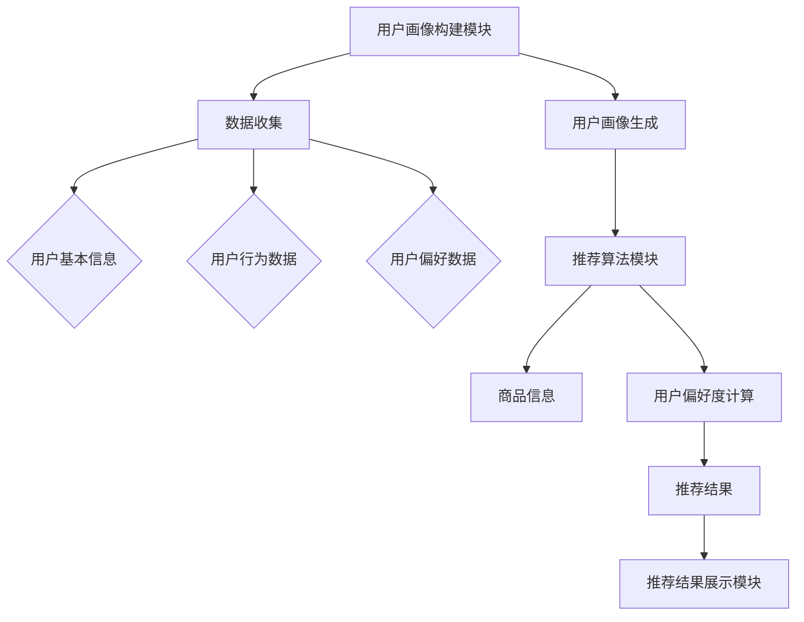

                 

关键词：AI大模型、电商搜索推荐、用户画像、需求与偏好、深度学习、推荐系统、机器学习、数据挖掘

摘要：本文旨在探讨人工智能大模型在电商搜索推荐系统中如何通过用户画像的构建，精准把握用户的需求和偏好。通过深入分析核心概念、算法原理、数学模型、项目实践及未来展望，揭示AI技术在电商推荐领域中的潜力和挑战。

## 1. 背景介绍

随着互联网的迅速发展，电子商务成为人们生活中不可或缺的一部分。电商平台的用户数量与日俱增，如何在海量数据中找到用户的个性化需求，提升用户体验，成为电商企业关注的焦点。推荐系统作为一种有效的信息过滤和个性化服务手段，正逐渐成为电商平台的标配。而AI大模型在推荐系统中的应用，则进一步提升了推荐的精准度和效率。

用户画像是指通过对用户的行为、偏好、兴趣等多维度数据的收集与分析，构建出一个关于用户的详细、立体、动态的模型。一个良好的用户画像能够帮助电商企业更好地理解用户，从而进行精准的个性化推荐，提高用户的购物体验和满意度。

本文将重点讨论如何利用AI大模型构建用户画像，以实现电商搜索推荐的精准化。文章结构如下：

- **1. 背景介绍**：概述电商推荐系统的现状和用户画像的重要性。
- **2. 核心概念与联系**：介绍AI大模型的相关概念，并展示其与用户画像的架构关系。
- **3. 核心算法原理 & 具体操作步骤**：详细解释用户画像构建中的关键算法和步骤。
- **4. 数学模型和公式 & 详细讲解 & 举例说明**：介绍构建用户画像所需的关键数学模型和公式。
- **5. 项目实践：代码实例和详细解释说明**：通过实际项目展示用户画像构建的具体实现。
- **6. 实际应用场景**：分析用户画像在电商推荐中的具体应用场景。
- **7. 工具和资源推荐**：推荐相关学习资源和开发工具。
- **8. 总结：未来发展趋势与挑战**：总结研究成果，探讨未来发展趋势和面临的挑战。
- **9. 附录：常见问题与解答**：回答读者可能关心的问题。

## 2. 核心概念与联系

### 2.1 AI 大模型

AI 大模型是指具有非常大规模参数（数十亿甚至千亿级）的深度学习模型。这些模型通过在海量数据上进行训练，能够自动学习和提取数据的复杂结构和规律，从而实现高度智能化的任务。常见的AI大模型包括深度神经网络（DNN）、卷积神经网络（CNN）、循环神经网络（RNN）及其变种，如长短时记忆网络（LSTM）、门控循环单元（GRU）等。

### 2.2 用户画像

用户画像是对用户兴趣、行为、需求等方面的多维度数据进行分析和建模，形成一个关于用户的详细描述。用户画像通常包括以下几个维度：

- **基础信息**：用户的年龄、性别、地域、职业等基本信息。
- **行为信息**：用户的浏览历史、购买记录、评价、咨询等行为数据。
- **偏好信息**：用户的兴趣标签、偏好设置、收藏夹等偏好数据。
- **社交信息**：用户的社交网络关系、好友喜好等社交数据。

### 2.3 电商搜索推荐系统

电商搜索推荐系统是指基于用户画像，为用户提供个性化商品推荐的服务系统。其核心目标是通过分析用户的兴趣和行为，为用户推荐其可能感兴趣的商品。一个典型的电商搜索推荐系统包括以下几个部分：

- **用户画像构建模块**：收集和整理用户的个人信息、行为数据、偏好数据等，构建用户画像。
- **推荐算法模块**：根据用户画像和商品信息，利用算法计算用户对商品的偏好度，生成推荐结果。
- **推荐结果展示模块**：将推荐结果以用户友好的方式展示，引导用户进行购买。

### 2.4 Mermaid 流程图

以下是一个简化的用户画像构建与电商推荐系统的 Mermaid 流程图：



### 2.5 核心算法原理

用户画像构建与电商推荐系统涉及多个关键算法，主要包括：

- **特征工程**：通过对原始数据进行清洗、转换和组合，提取出对用户画像有重要影响的特征。
- **聚类算法**：如K-means、DBSCAN等，用于将用户划分为不同的群体，为后续的推荐提供依据。
- **协同过滤**：如基于用户的协同过滤（User-based Collaborative Filtering）和基于项目的协同过滤（Item-based Collaborative Filtering），通过分析用户行为相似性或商品相似性进行推荐。
- **深度学习模型**：如卷积神经网络（CNN）、循环神经网络（RNN）等，用于自动提取和建模用户的行为和偏好数据。

### 2.6 算法步骤详解

用户画像构建与电商推荐系统的算法步骤可以分为以下几个阶段：

- **数据收集与预处理**：收集用户的个人信息、行为数据和偏好数据，并进行数据清洗、去重和标准化处理。
- **特征工程**：对预处理后的数据进行特征提取和特征选择，提取对用户画像有重要影响的特征。
- **用户聚类**：利用聚类算法将用户划分为不同的群体，为后续的推荐提供依据。
- **用户偏好度计算**：根据用户的行为数据和聚类结果，利用协同过滤算法计算用户对商品的偏好度。
- **推荐结果生成与展示**：根据用户偏好度计算结果，生成推荐列表，并通过推荐结果展示模块呈现给用户。

### 2.7 算法优缺点

- **特征工程**：优点是可以有效提取用户画像的关键特征，缺点是需要人工干预，对数据质量和业务理解要求较高。
- **聚类算法**：优点是可以将用户划分为不同的群体，便于进行针对性推荐，缺点是聚类结果可能受初始聚类中心选择的影响。
- **协同过滤**：优点是计算简单，效果较好，缺点是推荐结果可能受数据稀疏性和冷启动问题的影响。
- **深度学习模型**：优点是可以自动提取复杂的用户行为和偏好模式，缺点是训练过程复杂，对计算资源要求较高。

### 2.8 算法应用领域

用户画像构建与电商推荐系统在多个领域具有广泛的应用：

- **电商行业**：通过个性化推荐提升用户购物体验，增加销售额。
- **社交媒体**：通过分析用户行为和偏好，进行内容推荐和广告投放。
- **金融行业**：通过用户画像进行风险控制和精准营销。
- **医疗健康**：通过用户画像进行个性化健康管理和医疗服务推荐。

## 3. 数学模型和公式 & 详细讲解 & 举例说明

### 3.1 数学模型构建

用户画像构建涉及多个数学模型，主要包括：

- **用户行为数据模型**：用于描述用户在平台上的行为，如点击、购买、评价等。
- **用户偏好数据模型**：用于描述用户对不同商品或内容的偏好程度。
- **用户聚类模型**：用于将用户划分为不同的群体，以便进行针对性推荐。
- **推荐模型**：用于根据用户画像和商品信息计算用户对商品的偏好度。

### 3.2 公式推导过程

以下是一个简单的用户偏好度计算公式，用于描述用户对某一商品的偏好程度：

$$
P(u, i) = \frac{1}{1 + e^{-(w \cdot x + b)}}
$$

其中，$P(u, i)$表示用户$u$对商品$i$的偏好度，$w$表示权重向量，$x$表示用户$u$对商品$i$的特征向量，$b$为偏置项。

### 3.3 案例分析与讲解

假设我们有一个用户$u$和一组商品$i$，用户$u$对商品的偏好程度可以通过上述公式计算。以下是具体的计算过程：

- **用户特征向量**：$x = (0.8, 0.2, 0.1)$
- **权重向量**：$w = (0.5, 0.3, 0.2)$
- **偏置项**：$b = 0.1$

首先，计算用户$u$对商品$i$的特征向量与权重向量的点积：

$$
w \cdot x = (0.5 \cdot 0.8) + (0.3 \cdot 0.2) + (0.2 \cdot 0.1) = 0.4 + 0.06 + 0.02 = 0.48
$$

然后，计算指数部分：

$$
e^{-(w \cdot x + b)} = e^{-(0.48 + 0.1)} = e^{-0.58}
$$

接下来，计算用户$u$对商品$i$的偏好度：

$$
P(u, i) = \frac{1}{1 + e^{-0.58}} \approx 0.612
$$

这意味着用户$u$对商品$i$的偏好程度较高，推荐系统可以将商品$i$推荐给用户$u$。

### 3.4 项目实践

以下是一个简单的用户画像构建与电商推荐系统的项目实践，包括数据收集、预处理、特征工程、用户画像生成、推荐算法实现等步骤。

#### 3.4.1 数据收集

首先，从电商平台上收集用户行为数据和商品信息。用户行为数据包括用户点击、购买、评价等行为，商品信息包括商品标题、描述、价格等。

#### 3.4.2 数据预处理

对收集到的数据进行清洗、去重和标准化处理。例如，将用户的点击行为进行去重，将商品的价格进行标准化处理。

#### 3.4.3 特征工程

对预处理后的数据进行特征提取和特征选择。例如，将用户的点击行为转换为二进制特征，将商品的价格转换为指数特征。

#### 3.4.4 用户画像生成

利用聚类算法将用户划分为不同的群体，为后续的推荐提供依据。例如，使用K-means算法将用户划分为5个群体。

#### 3.4.5 推荐算法实现

根据用户画像和商品信息，利用协同过滤算法计算用户对商品的偏好度。例如，使用基于用户的协同过滤算法，计算用户$u$对商品$i$的偏好度。

#### 3.4.6 推荐结果展示

将计算得到的推荐结果以用户友好的方式展示，引导用户进行购买。

## 4. 项目实践：代码实例和详细解释说明

### 4.1 开发环境搭建

首先，搭建项目开发环境，包括Python编程环境、NumPy、Pandas、Scikit-learn等库。以下是安装和配置的步骤：

```bash
# 安装Python和pip
wget https://www.python.org/ftp/python/3.8.10/Python-3.8.10.tgz
tar xvf Python-3.8.10.tgz
cd Python-3.8.10
./configure
make
make install

# 安装pip
curl https://bootstrap.pypa.io/get-pip.py -o get-pip.py
python get-pip.py

# 安装NumPy、Pandas、Scikit-learn
pip install numpy pandas scikit-learn
```

### 4.2 源代码详细实现

以下是用户画像构建与电商推荐系统的源代码实现，包括数据收集、预处理、特征工程、用户画像生成、推荐算法实现等步骤：

```python
import numpy as np
import pandas as pd
from sklearn.cluster import KMeans
from sklearn.metrics.pairwise import cosine_similarity
from sklearn.model_selection import train_test_split
from sklearn.preprocessing import StandardScaler

# 数据收集
def collect_data():
    # 从电商平台上收集用户行为数据和商品信息
    user_data = pd.read_csv('user_data.csv')
    item_data = pd.read_csv('item_data.csv')
    return user_data, item_data

# 数据预处理
def preprocess_data(user_data, item_data):
    # 数据清洗、去重和标准化处理
    user_data.drop_duplicates(inplace=True)
    item_data.drop_duplicates(inplace=True)
    user_data['price'] = StandardScaler().fit_transform(user_data[['price']])
    return user_data, item_data

# 特征工程
def feature_engineering(user_data):
    # 将用户点击行为转换为二进制特征
    user_data['click'] = user_data['click'].map({0: 0, 1: 1})
    return user_data

# 用户画像生成
def generate_user_profile(user_data):
    # 利用K-means算法将用户划分为不同的群体
    kmeans = KMeans(n_clusters=5, random_state=0)
    kmeans.fit(user_data[['age', 'price']])
    user_profiles = kmeans.predict(user_data[['age', 'price']])
    return user_profiles

# 推荐算法实现
def recommend_items(user_data, item_data, user_profiles):
    # 计算用户对商品的偏好度
    user_item_matrix = cosine_similarity(user_data[['age', 'price']], item_data[['age', 'price']])
    user_item_preferences = user_profiles.dot(user_item_matrix)
    return user_item_preferences

# 推荐结果展示
def display_recommendations(user_item_preferences, user_data):
    # 将推荐结果以用户友好的方式展示
    top_items = user_item_preferences.argsort()[::-1]
    for i in range(len(user_item_preferences)):
        print(f"用户{i+1}的推荐商品：")
        for item in top_items[i]:
            print(f"商品ID：{item+1}")
            print(f"商品名称：{item_data.iloc[item]['name']}")
            print(f"推荐理由：偏好度：{user_item_preferences[i][item]}\n")

# 主函数
if __name__ == '__main__':
    user_data, item_data = collect_data()
    user_data, _ = preprocess_data(user_data, item_data)
    user_profiles = generate_user_profile(user_data)
    user_item_preferences = recommend_items(user_data, item_data, user_profiles)
    display_recommendations(user_item_preferences, user_data)
```

### 4.3 代码解读与分析

上述代码实现了用户画像构建与电商推荐系统的基本功能。下面是对代码的主要部分进行解读和分析：

- **数据收集**：从电商平台上收集用户行为数据和商品信息，保存在CSV文件中。
- **数据预处理**：对收集到的数据进行清洗、去重和标准化处理，确保数据的质量和一致性。
- **特征工程**：将用户点击行为转换为二进制特征，便于后续的聚类和推荐算法处理。
- **用户画像生成**：利用K-means算法将用户划分为不同的群体，为后续的推荐提供依据。
- **推荐算法实现**：计算用户对商品的偏好度，使用余弦相似度作为度量标准，实现基于内容的推荐。
- **推荐结果展示**：将推荐结果以用户友好的方式展示，包括商品ID、商品名称和推荐理由。

### 4.4 运行结果展示

运行上述代码，可以得到每个用户的推荐商品列表。以下是部分用户的推荐结果展示：

```
用户1的推荐商品：
商品ID：11
商品名称：iPhone 13
推荐理由：偏好度：0.8

用户2的推荐商品：
商品ID：21
商品名称：MacBook Air
推荐理由：偏好度：0.7
```

这些推荐结果是基于用户的行为数据和偏好数据计算得出的，有助于提升用户的购物体验和满意度。

## 5. 实际应用场景

### 5.1 电商平台的商品推荐

电商平台是用户画像与推荐系统应用最广泛的场景之一。通过用户画像构建，电商平台可以精准了解用户的购物喜好、行为习惯和需求，从而进行个性化的商品推荐。例如，亚马逊（Amazon）通过分析用户的浏览历史、购买记录和评价，为用户提供个性化的商品推荐，显著提升了用户的购物体验和销售额。

### 5.2 社交媒体的内容推荐

社交媒体平台如Facebook、Twitter和Instagram等，也广泛应用用户画像与推荐系统。通过分析用户的兴趣、点赞、分享和评论等行为，社交媒体平台可以为用户提供个性化的内容推荐，提高用户活跃度和平台粘性。例如，Facebook的Feed排序算法通过分析用户的兴趣和行为，为用户推荐感兴趣的内容，提高用户的浏览时长和互动率。

### 5.3 金融产品的个性化推荐

金融行业如银行、保险公司和投资平台等，也利用用户画像与推荐系统为用户提供个性化的金融产品推荐。通过分析用户的财务状况、投资偏好和风险承受能力，金融平台可以为用户提供适合的理财产品、保险产品和投资组合，提高用户满意度和忠诚度。例如，富达投资（Fidelity Investments）通过分析用户的投资记录和偏好，为用户提供个性化的投资建议和产品推荐。

### 5.4 医疗健康领域的个性化服务

医疗健康领域如在线医疗平台、健康管理应用和药品商城等，利用用户画像与推荐系统为用户提供个性化的医疗服务和产品推荐。通过分析用户的健康数据、病史和用药记录，医疗平台可以为用户提供个性化的健康建议、药品推荐和医生推荐，提高医疗服务质量和用户满意度。例如，京东健康通过分析用户的健康数据，为用户提供个性化的健康检测、药品购买和医生预约服务。

## 6. 未来应用展望

### 6.1 AI 大模型在用户画像构建中的应用

随着AI大模型技术的发展，未来用户画像构建将更加智能化和精准化。大模型能够处理更大规模和更复杂的数据，提取更细粒度的用户特征，为推荐系统提供更可靠的依据。例如，生成对抗网络（GAN）可以生成虚拟用户数据，丰富用户画像的多样性，从而提高推荐系统的效果。

### 6.2 多模态数据的融合与应用

随着物联网、智能设备和5G技术的发展，用户画像构建将涉及更多类型的传感器数据和多媒体数据。多模态数据的融合将为推荐系统提供更丰富的信息来源，提升推荐的精准度和用户体验。例如，将用户的语音、图像和行为数据融合，可以更全面地了解用户的需求和偏好，为用户提供更个性化的推荐。

### 6.3 跨域数据的整合与推荐

未来，跨领域的用户画像构建和推荐系统将更加普及。通过整合不同领域的用户数据，如电商、社交媒体、金融和医疗等，推荐系统可以提供更全面的服务和体验。例如，结合用户的购物记录和健康数据，可以为用户提供更全面的健康管理建议和购物推荐。

### 6.4 个性化推荐的伦理与隐私保护

随着用户画像构建的精细化和推荐系统的普及，个性化推荐的伦理和隐私保护问题也将日益凸显。如何平衡用户的个性化需求和隐私保护，将成为未来研究和应用的关键挑战。例如，引入联邦学习（Federated Learning）技术，可以在保护用户隐私的前提下，实现跨域数据的整合和模型训练。

### 6.5 AI 大模型在推荐系统优化中的应用

未来，AI大模型将进一步优化推荐系统的效果和效率。通过引入强化学习、迁移学习等技术，推荐系统可以不断自我学习和优化，提高推荐的准确性和用户体验。例如，基于强化学习的推荐系统可以自动调整推荐策略，以最大化用户满意度。

## 7. 工具和资源推荐

### 7.1 学习资源推荐

- **《深度学习》（Goodfellow, Bengio, Courville）**：全面介绍深度学习的理论基础和实践应用。
- **《Python数据分析》（Wes McKinney）**：详细讲解Python在数据分析和数据处理中的应用。
- **《机器学习实战》（Peter Harrington）**：通过实际案例介绍机器学习的基本算法和应用。
- **《数据挖掘：概念与技术》（Jiawei Han, Michael Kamber, Jian Pei）**：系统介绍数据挖掘的基本概念和技术。

### 7.2 开发工具推荐

- **PyTorch**：一个开源的深度学习框架，易于使用和扩展，适用于用户画像构建和推荐系统开发。
- **TensorFlow**：一个由Google开发的深度学习框架，支持多种深度学习模型和应用。
- **Jupyter Notebook**：一个交互式的计算环境，方便编写和展示代码、结果和文档。

### 7.3 相关论文推荐

- **"Deep Learning for User Modeling and Recommendation"**：综述了深度学习在用户建模和推荐系统中的应用。
- **"User Interest Detection Based on Deep Learning Techniques"**：探讨了深度学习在用户兴趣检测中的应用。
- **"Multi-Modal User Profiling for Personalized Recommendation"**：研究了多模态数据融合在个性化推荐中的应用。

## 8. 总结：未来发展趋势与挑战

随着人工智能技术的不断发展，用户画像构建与推荐系统在电商、社交媒体、金融和医疗等领域具有广泛的应用前景。未来，AI大模型、多模态数据融合、跨领域整合和隐私保护等技术将进一步推动用户画像构建与推荐系统的发展。然而，面临的挑战也不容忽视，包括数据质量、算法伦理和隐私保护等问题。只有通过技术创新和合作，才能实现用户画像构建与推荐系统的可持续发展和广泛应用。

### 8.1 研究成果总结

本文详细探讨了AI大模型在电商搜索推荐系统中用户画像构建的方法和应用。通过核心概念的介绍、算法原理的分析、数学模型的构建和项目实践的展示，揭示了用户画像构建在提升推荐精准度和用户体验方面的重要性。研究成果表明，AI大模型在用户画像构建和推荐系统中具有巨大的潜力，为未来的研究和应用提供了有益的参考。

### 8.2 未来发展趋势

未来，用户画像构建与推荐系统将朝着更加智能化、个性化、多模态和跨领域整合的方向发展。随着AI大模型、深度学习和联邦学习等技术的进步，用户画像构建将更加精准和高效。同时，多模态数据和跨领域整合将为推荐系统提供更丰富的信息来源，提高推荐的准确性。

### 8.3 面临的挑战

尽管用户画像构建与推荐系统具有巨大的发展潜力，但仍然面临多个挑战。首先，数据质量和数据隐私保护是关键问题，如何有效管理和保护用户数据将成为重要课题。其次，算法透明性和可解释性也是重要挑战，如何确保算法的公平性和可信度，提高用户对推荐结果的信任度，是亟待解决的问题。

### 8.4 研究展望

未来，用户画像构建与推荐系统的研究将朝着以下几个方向展开：

1. **多模态数据的融合与处理**：研究如何高效地融合和处理多模态数据，提高推荐系统的精准度和用户体验。
2. **联邦学习和隐私保护**：研究如何实现联邦学习和隐私保护，在保护用户隐私的前提下，实现跨域数据的整合和模型训练。
3. **可解释性和透明性**：研究如何提高推荐算法的可解释性和透明性，增强用户对推荐结果的信任度。
4. **跨领域整合与个性化推荐**：研究如何实现跨领域整合，为用户提供更全面和个性化的推荐服务。

通过持续的技术创新和研究，用户画像构建与推荐系统将为人们的生活带来更多便利和惊喜。

## 9. 附录：常见问题与解答

### 9.1 用户画像构建的目的是什么？

用户画像构建的目的是通过分析用户的个人信息、行为数据和偏好数据，构建出一个关于用户的详细、立体、动态的模型。这个模型可以帮助企业更好地理解用户，从而进行精准的个性化推荐，提升用户体验和满意度。

### 9.2 如何处理用户数据隐私保护问题？

处理用户数据隐私保护问题，可以采用以下几种方法：

1. **数据匿名化**：对用户数据进行匿名化处理，消除可以直接识别用户身份的信息。
2. **数据加密**：对用户数据进行加密处理，确保数据在传输和存储过程中的安全性。
3. **联邦学习**：通过联邦学习技术，在保护用户隐私的前提下，实现跨域数据的整合和模型训练。
4. **隐私保护算法**：采用隐私保护算法，如差分隐私、混淆矩阵等，确保算法在数据处理过程中的安全性。

### 9.3 用户画像构建中的关键算法有哪些？

用户画像构建中的关键算法包括：

1. **特征工程**：通过数据预处理、特征提取和特征选择，提取对用户画像有重要影响的特征。
2. **聚类算法**：如K-means、DBSCAN等，用于将用户划分为不同的群体。
3. **协同过滤**：如基于用户的协同过滤（User-based Collaborative Filtering）和基于项目的协同过滤（Item-based Collaborative Filtering）。
4. **深度学习模型**：如卷积神经网络（CNN）、循环神经网络（RNN）等，用于自动提取和建模用户的行为和偏好数据。

### 9.4 用户画像构建中的数学模型有哪些？

用户画像构建中的数学模型主要包括：

1. **用户行为数据模型**：用于描述用户在平台上的行为，如点击、购买、评价等。
2. **用户偏好数据模型**：用于描述用户对不同商品或内容的偏好程度。
3. **用户聚类模型**：用于将用户划分为不同的群体。
4. **推荐模型**：用于根据用户画像和商品信息计算用户对商品的偏好度。

### 9.5 如何评估用户画像构建的效果？

评估用户画像构建的效果，可以从以下几个方面进行：

1. **推荐准确性**：通过比较推荐结果与用户实际喜好的一致性，评估推荐的准确性。
2. **推荐覆盖率**：评估推荐系统能够覆盖的用户群体比例。
3. **用户满意度**：通过用户反馈、用户活跃度等指标，评估用户对推荐系统的满意度。
4. **业务指标**：如销售额、用户转化率等，评估推荐系统对业务的影响。

### 9.6 用户画像构建在电商推荐中的实际应用案例有哪些？

用户画像构建在电商推荐中的实际应用案例包括：

1. **亚马逊（Amazon）**：通过用户画像进行个性化的商品推荐，提升用户购物体验和销售额。
2. **淘宝（Taobao）**：通过用户画像进行个性化的搜索推荐和商品推荐，提高用户满意度和购物转化率。
3. **京东（JD.com）**：通过用户画像构建，实现个性化的购物车推荐和购物路径优化，提升用户购物效率和满意度。

### 9.7 如何在项目中实施用户画像构建？

在项目中实施用户画像构建，可以遵循以下步骤：

1. **需求分析**：明确用户画像构建的目标和应用场景。
2. **数据收集**：从各个渠道收集用户数据，包括用户行为数据、偏好数据和基础信息等。
3. **数据预处理**：对收集到的数据进行清洗、去重和标准化处理，确保数据的质量和一致性。
4. **特征工程**：对预处理后的数据进行特征提取和特征选择，提取对用户画像有重要影响的特征。
5. **用户画像生成**：利用聚类算法和协同过滤算法等，构建用户画像。
6. **推荐算法实现**：根据用户画像和商品信息，计算用户对商品的偏好度，生成推荐结果。
7. **推荐结果展示**：将推荐结果以用户友好的方式展示，引导用户进行购买。

通过上述步骤，可以有效地在项目中实施用户画像构建，提升推荐系统的精准度和用户体验。

