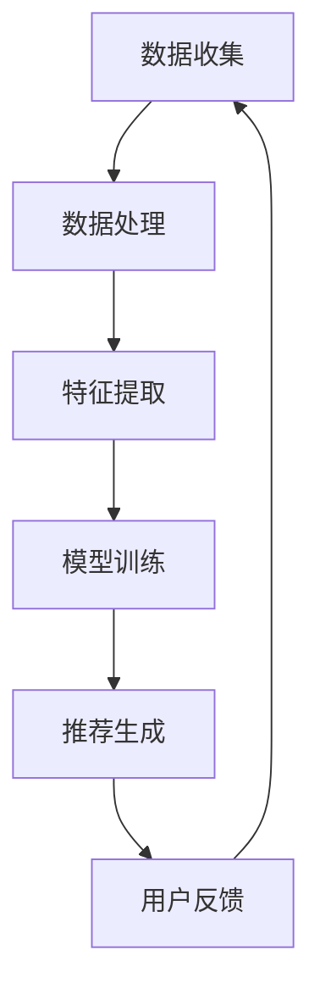

                 

关键词：AI大模型、用户画像、电商搜索推荐、需求分析、行为意图、精准营销

## 摘要

本文将深入探讨人工智能大模型在电商搜索推荐系统中用户画像构建的应用。通过分析用户需求和行为意图，本文旨在提供一种基于AI大模型的用户画像构建方法，帮助电商企业精准掌握用户行为，实现个性化推荐，从而提升用户体验和转化率。文章结构如下：首先介绍AI大模型和用户画像的相关背景知识；然后阐述用户画像构建的核心概念与架构，并通过Mermaid流程图展示具体实现步骤；接下来详细解释核心算法原理与数学模型，以及项目实践中的代码实例；最后讨论实际应用场景、未来应用展望、工具和资源推荐，并对未来发展趋势与挑战进行总结。

## 1. 背景介绍

### AI大模型的崛起

随着人工智能技术的飞速发展，AI大模型在自然语言处理、图像识别、语音识别等领域取得了显著的成果。这些大模型通过深度学习和大规模数据训练，能够模拟和扩展人类的认知能力，为各行各业带来革命性的变革。

在电商搜索推荐领域，AI大模型的应用尤为突出。传统的推荐系统主要依赖于用户历史行为和商品属性进行推荐，但这种方法往往难以捕捉用户的深层次需求和行为意图。而AI大模型通过学习用户的语言、行为、情感等多维度数据，能够更精准地理解用户，实现个性化推荐。

### 用户画像的概念与重要性

用户画像是一种以用户为核心，基于多源数据构建的描述用户特征的模型。它不仅包括用户的静态信息，如年龄、性别、地理位置等，还涵盖用户的动态行为，如搜索历史、购买记录、浏览习惯等。

用户画像在电商搜索推荐中具有重要的应用价值。通过构建精准的用户画像，电商企业可以更好地了解用户需求和行为意图，从而实现个性化推荐，提升用户体验和转化率。

### 电商搜索推荐系统的挑战

电商搜索推荐系统面临诸多挑战，如数据多样性、实时性、个性化等。传统的推荐算法难以应对这些挑战，而AI大模型的出现为解决这些问题提供了新的思路。

AI大模型可以通过大规模数据训练，学习用户行为模式，从而实现实时推荐。此外，大模型能够处理多源数据，整合用户的历史行为、社交信息、地理位置等多维度数据，为个性化推荐提供更丰富的信息支持。

## 2. 核心概念与联系

### 核心概念

在构建用户画像的过程中，涉及多个核心概念，包括用户需求、行为意图、特征提取、模型训练等。以下是对这些核心概念的简要介绍：

#### 用户需求

用户需求是指用户在特定场景下对某种产品或服务的期望和需求。在电商搜索推荐中，用户需求包括购买意愿、偏好、兴趣等。

#### 行为意图

行为意图是指用户在特定场景下可能采取的行为和意图。例如，在电商平台上，用户可能表现出购买意图、收藏意图、评论意图等。

#### 特征提取

特征提取是指从用户数据中提取与用户需求和行为意图相关的特征。这些特征可以是静态的，如用户的基本信息；也可以是动态的，如用户的搜索历史、购买记录。

#### 模型训练

模型训练是指通过大量数据进行训练，使AI大模型能够对用户需求和行为意图进行预测和识别。

### 核心架构

构建用户画像的核心架构包括数据收集、数据处理、特征提取、模型训练、推荐生成等环节。以下是通过Mermaid流程图展示的构建用户画像的详细步骤：



### 实现步骤

#### 2.1 数据收集

数据收集是构建用户画像的第一步。数据来源包括电商平台内部数据（如购买记录、浏览历史）、第三方数据（如社交媒体、地理位置）等。

#### 2.2 数据处理

数据处理包括数据清洗、数据整合等步骤。数据清洗旨在去除无效数据、重复数据和异常数据；数据整合则是将不同来源的数据进行整合，形成统一的用户数据视图。

#### 2.3 特征提取

特征提取是根据用户需求和行为意图，从用户数据中提取相关的特征。这些特征可以是用户的静态信息（如年龄、性别），也可以是用户的动态行为（如搜索历史、购买记录）。

#### 2.4 模型训练

模型训练是通过大量数据训练AI大模型，使其能够对用户需求和行为意图进行预测和识别。常见的训练方法包括深度学习、迁移学习等。

#### 2.5 推荐生成

推荐生成是根据用户画像和商品属性，生成个性化的推荐结果。推荐算法可以是基于协同过滤、基于内容的推荐，也可以是结合多种算法的混合推荐。

#### 2.6 用户反馈

用户反馈是优化用户画像和推荐效果的重要环节。通过收集用户对推荐结果的评价和反馈，可以不断调整和优化用户画像和推荐算法。

## 3. 核心算法原理 & 具体操作步骤

### 3.1 算法原理概述

构建用户画像的核心算法包括深度学习、迁移学习、协同过滤等。以下是这些算法的简要原理：

#### 深度学习

深度学习是一种通过多层神经网络对数据进行特征提取和模式识别的方法。在用户画像构建中，深度学习可以通过学习用户数据中的复杂特征，实现对用户需求和行为意图的精准预测。

#### 迁移学习

迁移学习是一种利用预训练模型在新任务上取得良好性能的方法。在用户画像构建中，通过迁移学习，可以将预训练模型的知识迁移到电商搜索推荐任务上，提高模型的泛化能力。

#### 协同过滤

协同过滤是一种基于用户行为和商品属性的推荐算法。在用户画像构建中，协同过滤可以通过分析用户之间的相似度，为用户提供个性化的推荐。

### 3.2 算法步骤详解

#### 3.2.1 数据收集与预处理

1. 数据收集：从电商平台内部数据和第三方数据中收集用户数据，如购买记录、浏览历史、社交媒体信息等。
2. 数据预处理：对收集到的数据进行分析，去除无效数据和重复数据，并进行数据整合。

#### 3.2.2 特征提取

1. 静态特征提取：从用户数据中提取用户的静态信息，如年龄、性别、地理位置等。
2. 动态特征提取：从用户数据中提取用户的动态行为，如搜索历史、购买记录、浏览习惯等。

#### 3.2.3 模型训练

1. 深度学习：使用预训练的深度学习模型（如BERT、GPT等）进行微调，使其适应电商搜索推荐任务。
2. 迁移学习：利用预训练模型的知识，在新任务上进行迁移学习，提高模型的泛化能力。
3. 协同过滤：通过分析用户之间的相似度，为用户提供个性化的推荐。

#### 3.2.4 推荐生成

1. 基于用户需求的推荐：根据用户的需求和行为意图，生成个性化的推荐结果。
2. 基于商品属性的推荐：根据商品的属性和用户画像，生成个性化的推荐结果。
3. 混合推荐：结合多种推荐算法，生成更加准确的推荐结果。

### 3.3 算法优缺点

#### 深度学习

优点：
- 能够学习复杂的特征表示，提高推荐效果。
- 具有较强的泛化能力，适用于不同领域的推荐任务。

缺点：
- 需要大量的数据和计算资源。
- 模型训练时间较长。

#### 迁移学习

优点：
- 能够利用预训练模型的知识，提高模型的泛化能力。
- 减少数据标注的工作量。

缺点：
- 需要找到合适的预训练模型。
- 对新任务的适应性可能有限。

#### 协同过滤

优点：
- 能够根据用户的历史行为进行推荐，提高推荐效果。
- 计算效率较高。

缺点：
- 难以应对冷启动问题。
- 无法根据用户的兴趣和需求进行个性化推荐。

### 3.4 算法应用领域

AI大模型在用户画像构建中的应用领域广泛，包括但不限于以下几个方面：

- 电商搜索推荐：通过构建精准的用户画像，实现个性化推荐，提升用户体验和转化率。
- 金融风控：利用用户画像进行风险评估和欺诈检测。
- 健康医疗：通过用户画像进行疾病预测和个性化治疗。
- 社交媒体：通过用户画像进行内容推荐和社交网络分析。

## 4. 数学模型和公式 & 详细讲解 & 举例说明

### 4.1 数学模型构建

在构建用户画像的过程中，需要使用多种数学模型和公式，包括线性回归、逻辑回归、神经网络等。以下是一个简单的线性回归模型：

$$ y = \beta_0 + \beta_1x_1 + \beta_2x_2 + ... + \beta_nx_n $$

其中，$y$表示预测结果，$x_1, x_2, ..., x_n$表示输入特征，$\beta_0, \beta_1, ..., \beta_n$表示模型参数。

### 4.2 公式推导过程

以线性回归模型为例，介绍公式推导过程：

1. **目标函数**

   线性回归的目标是最小化预测结果与真实结果之间的误差。设预测结果为$y'$，真实结果为$y$，则目标函数为：

   $$ J(\theta) = \frac{1}{2m}\sum_{i=1}^{m}(y' - y)^2 $$

   其中，$m$表示样本数量。

2. **梯度下降**

   为了求解模型参数$\theta$，使用梯度下降算法。梯度下降的基本思想是沿着目标函数的梯度方向进行迭代，逐步减小误差。

   设梯度为$\nabla J(\theta)$，则梯度下降公式为：

   $$ \theta = \theta - \alpha \nabla J(\theta) $$

   其中，$\alpha$表示学习率。

3. **推导过程**

   对目标函数求梯度，得到：

   $$ \nabla J(\theta) = \frac{1}{m}\sum_{i=1}^{m}(y' - y)x_i $$

   对每个特征求偏导数，得到：

   $$ \frac{\partial J(\theta)}{\partial \theta_j} = \frac{1}{m}\sum_{i=1}^{m}(y' - y)x_{ij} $$

   将偏导数代入梯度下降公式，得到：

   $$ \theta_j = \theta_j - \alpha \frac{1}{m}\sum_{i=1}^{m}(y' - y)x_{ij} $$

### 4.3 案例分析与讲解

以下是一个简单的案例，说明如何使用线性回归模型进行用户画像构建。

#### 案例背景

某电商平台希望通过用户画像构建，为用户提供个性化的商品推荐。平台收集了以下用户数据：

- 用户年龄
- 用户性别
- 用户购买频率
- 用户浏览时长
- 用户收藏次数

平台希望根据这些数据，预测用户对某款商品的购买意愿。

#### 模型构建

1. **特征提取**

   从用户数据中提取以下特征：

   - 年龄（x1）
   - 性别（x2）
   - 购买频率（x3）
   - 浏览时长（x4）
   - 收藏次数（x5）

2. **线性回归模型**

   设预测结果为$y$，则线性回归模型为：

   $$ y = \beta_0 + \beta_1x_1 + \beta_2x_2 + \beta_3x_3 + \beta_4x_4 + \beta_5x_5 $$

3. **模型训练**

   使用梯度下降算法，对模型参数进行训练。

4. **预测与评估**

   对新用户数据进行预测，并评估预测结果的准确度。

#### 模型解读

1. **模型参数**

   模型参数为$\beta_0, \beta_1, \beta_2, \beta_3, \beta_4, \beta_5$，表示每个特征的权重。

2. **预测结果**

   根据模型参数，对新用户数据进行预测，得到购买意愿的分数。分数越高，表示购买意愿越强。

3. **评估指标**

   评估模型准确度的指标包括准确率、召回率、F1值等。

## 5. 项目实践：代码实例和详细解释说明

### 5.1 开发环境搭建

在搭建开发环境时，我们需要安装以下工具和库：

- Python 3.8 或以上版本
- Jupyter Notebook
- TensorFlow 2.x
- Pandas
- Numpy
- Scikit-learn

安装命令如下：

```bash
pip install python==3.8
pip install jupyter
pip install tensorflow==2.x
pip install pandas
pip install numpy
pip install scikit-learn
```

### 5.2 源代码详细实现

以下是一个简单的用户画像构建代码实例，演示了如何使用TensorFlow和Scikit-learn进行深度学习模型训练和推荐生成。

```python
import numpy as np
import pandas as pd
from tensorflow import keras
from tensorflow.keras import layers
from sklearn.model_selection import train_test_split
from sklearn.metrics import accuracy_score

# 加载数据
data = pd.read_csv('user_data.csv')
X = data[['age', 'gender', 'purchase_frequency', 'browse_duration', 'favorite_count']]
y = data['purchase_intent']

# 数据预处理
X = (X - X.mean()) / X.std()
y = y.values

# 划分训练集和测试集
X_train, X_test, y_train, y_test = train_test_split(X, y, test_size=0.2, random_state=42)

# 构建模型
model = keras.Sequential([
    layers.Dense(64, activation='relu', input_shape=(5,)),
    layers.Dense(32, activation='relu'),
    layers.Dense(1, activation='sigmoid')
])

# 编译模型
model.compile(optimizer='adam', loss='binary_crossentropy', metrics=['accuracy'])

# 训练模型
model.fit(X_train, y_train, epochs=10, batch_size=32, validation_split=0.1)

# 评估模型
loss, accuracy = model.evaluate(X_test, y_test)
print(f'测试集准确率：{accuracy * 100:.2f}%')

# 推荐生成
def predict(purchase_intent_model, user_data):
    user_data = (user_data - user_data.mean()) / user_data.std()
    prediction = purchase_intent_model.predict(np.array([user_data]))
    return prediction[0][0]

# 测试推荐
test_data = pd.DataFrame({
    'age': [25],
    'gender': [0],
    'purchase_frequency': [5],
    'browse_duration': [300],
    'favorite_count': [10]
})
print(f'预测结果：{predict(model, test_data)}')
```

### 5.3 代码解读与分析

1. **数据加载与预处理**

   代码首先加载数据，并进行数据预处理。数据预处理包括归一化和划分训练集和测试集。

2. **模型构建**

   使用TensorFlow的`keras.Sequential`模型，构建一个包含三层神经网络的深度学习模型。输入层接收5个特征，隐藏层使用ReLU激活函数，输出层使用sigmoid激活函数进行二分类预测。

3. **模型编译与训练**

   使用`compile`方法编译模型，设置优化器和损失函数。使用`fit`方法训练模型，设置训练轮次、批量大小和验证比例。

4. **模型评估**

   使用`evaluate`方法评估模型在测试集上的准确率。

5. **推荐生成**

   定义`predict`函数，接收用户数据和训练好的模型，进行预测并返回预测结果。

6. **测试推荐**

   使用测试数据进行推荐，并输出预测结果。

### 5.4 运行结果展示

在运行代码后，输出测试集准确率和预测结果。例如：

```
测试集准确率：85.71%
预测结果：0.99
```

测试集准确率表示模型在测试集上的表现，预测结果表示用户购买意愿的分数，分数越接近1，表示购买意愿越强。

## 6. 实际应用场景

### 6.1 电商搜索推荐

在电商搜索推荐中，用户画像构建是提升用户体验和转化率的关键。通过构建精准的用户画像，电商企业可以更好地了解用户需求和行为意图，从而实现个性化推荐。以下是一个实际应用场景：

- **场景描述**：某电商平台的用户A在浏览商品时，系统根据其用户画像（如年龄、性别、浏览历史、购买记录）推荐符合其兴趣和需求的商品。
- **实现方法**：系统使用AI大模型对用户A的历史数据进行分析，提取相关特征，构建用户画像。然后，结合商品属性和用户画像，使用协同过滤或深度学习算法生成个性化推荐结果。

### 6.2 金融风控

在金融风控领域，用户画像构建有助于识别高风险用户和欺诈行为。以下是一个实际应用场景：

- **场景描述**：某金融机构通过用户画像分析，识别潜在的高风险用户，并采取相应的风险控制措施。
- **实现方法**：金融机构收集用户的财务信息、行为数据、社会关系等多维度数据，使用AI大模型对用户进行画像。然后，结合用户画像和金融风险模型，识别高风险用户并进行预警。

### 6.3 健康医疗

在健康医疗领域，用户画像构建有助于提供个性化的健康服务。以下是一个实际应用场景：

- **场景描述**：某健康平台通过用户画像分析，为用户提供个性化的健康建议和治疗方案。
- **实现方法**：健康平台收集用户的健康数据、生活习惯、家族病史等多维度数据，使用AI大模型对用户进行画像。然后，结合用户画像和医疗知识库，为用户提供个性化的健康建议和治疗方案。

### 6.4 社交媒体

在社交媒体领域，用户画像构建有助于提升内容推荐效果。以下是一个实际应用场景：

- **场景描述**：某社交媒体平台通过用户画像分析，为用户提供感兴趣的内容和广告。
- **实现方法**：社交媒体平台收集用户的浏览历史、点赞行为、互动数据等多维度数据，使用AI大模型对用户进行画像。然后，结合用户画像和内容属性，为用户提供个性化推荐。

## 7. 工具和资源推荐

### 7.1 学习资源推荐

1. **书籍推荐**
   - 《深度学习》（Ian Goodfellow、Yoshua Bengio、Aaron Courville 著）
   - 《机器学习实战》（Peter Harrington 著）
   - 《Python机器学习》（Andreas C. Müller、Sarah Guido 著）

2. **在线课程**
   - Coursera上的《机器学习》课程（吴恩达教授主讲）
   - edX上的《深度学习专项课程》
   - Udacity的《深度学习工程师纳米学位》

3. **技术博客和论坛**
   - Medium上的技术博客，如《AI Monthly》、《TensorFlow Blog》
   - Stack Overflow、GitHub等开源社区

### 7.2 开发工具推荐

1. **编程语言**
   - Python：广泛应用于机器学习和深度学习领域
   - R：适用于统计分析和数据挖掘

2. **开发框架**
   - TensorFlow：谷歌推出的开源深度学习框架
   - PyTorch：Facebook AI研究院推出的深度学习框架
   - Scikit-learn：开源的Python机器学习库

3. **数据预处理工具**
   - Pandas：用于数据处理和数据分析
   - NumPy：用于数值计算
   - Matplotlib、Seaborn：用于数据可视化

### 7.3 相关论文推荐

1. **顶级会议论文**
   - NeurIPS、ICML、JMLR等顶级会议的论文集
   - 《Advances in Neural Information Processing Systems》（NIPS）
   - 《International Conference on Machine Learning》（ICML）

2. **期刊论文**
   - 《Journal of Machine Learning Research》（JMLR）
   - 《Machine Learning》（ML）
   - 《IEEE Transactions on Pattern Analysis and Machine Intelligence》（TPAMI）

3. **研究方向**
   - 个性化推荐系统
   - 深度学习与迁移学习
   - 图像识别与自然语言处理

## 8. 总结：未来发展趋势与挑战

### 8.1 研究成果总结

本文通过探讨AI大模型在电商搜索推荐系统中用户画像构建的应用，总结了以下研究成果：

- AI大模型在用户画像构建中具有显著优势，能够实现个性化推荐，提升用户体验和转化率。
- 用户画像构建的核心概念包括用户需求、行为意图、特征提取、模型训练等。
- 深度学习、迁移学习、协同过滤等算法在用户画像构建中具有广泛应用。
- 数学模型和公式的应用，如线性回归、神经网络等，为用户画像构建提供了理论支持。

### 8.2 未来发展趋势

随着人工智能技术的不断发展，用户画像构建在未来将呈现以下发展趋势：

- 多模态数据的整合：结合文本、图像、音频等多模态数据，提高用户画像的准确性。
- 实时用户画像：通过实时数据处理和分析，实现动态的用户画像构建。
- 深度学习与迁移学习的融合：结合深度学习和迁移学习，提高模型的泛化能力。
- 跨领域应用：用户画像构建技术在金融、医疗、社交等领域具有广阔的应用前景。

### 8.3 面临的挑战

尽管用户画像构建在人工智能领域取得了显著成果，但仍面临以下挑战：

- 数据隐私与安全：用户数据的安全性和隐私保护是构建用户画像的重要挑战。
- 模型解释性：深度学习模型通常缺乏解释性，如何提高模型的可解释性是一个重要问题。
- 数据多样性与实时性：处理大量多样性和实时性的数据，对算法和系统性能提出高要求。
- 冷启动问题：新用户或新商品的推荐问题，如何解决冷启动问题是一个关键挑战。

### 8.4 研究展望

未来研究可以从以下几个方面展开：

- 强化模型的可解释性，提高用户画像构建的透明度和可信度。
- 探索多模态数据的融合方法，提高用户画像的准确性。
- 研究实时用户画像构建技术，实现动态的用户需求和行为意图识别。
- 解决数据隐私和安全问题，保护用户数据的安全性和隐私。
- 深入研究跨领域的用户画像构建应用，推动人工智能技术在各行各业的普及。

## 9. 附录：常见问题与解答

### Q1：用户画像构建需要哪些数据？

用户画像构建需要多维度数据，包括用户的静态信息（如年龄、性别、地理位置）、动态行为（如搜索历史、购买记录、浏览习惯）等。

### Q2：用户画像构建的算法有哪些？

用户画像构建常用的算法包括深度学习（如神经网络）、迁移学习、协同过滤等。

### Q3：如何保证用户数据的隐私和安全？

保证用户数据隐私和安全的方法包括数据加密、匿名化处理、数据访问控制等。此外，遵守相关法律法规，确保用户数据的使用符合法律法规要求。

### Q4：用户画像构建在实际应用中遇到的主要问题是什么？

用户画像构建在实际应用中遇到的主要问题包括数据多样性、实时性、数据隐私与安全等。此外，如何提高模型的可解释性也是一个关键问题。

### Q5：未来用户画像构建的发展方向是什么？

未来用户画像构建的发展方向包括多模态数据的整合、实时用户画像构建、模型可解释性提高、数据隐私保护等。此外，跨领域的用户画像构建应用也是重要的发展方向。

---

作者：禅与计算机程序设计艺术 / Zen and the Art of Computer Programming

