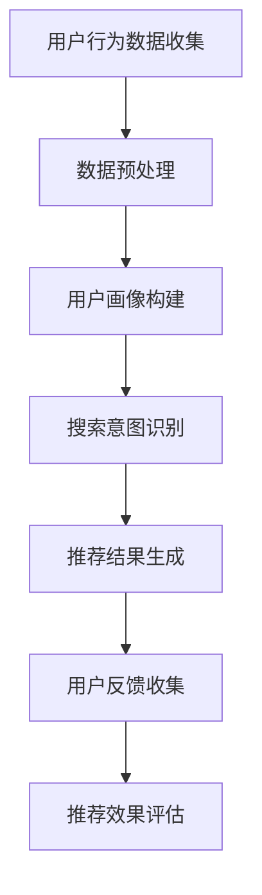

                 

关键词：AI 大模型，电商搜索推荐，用户行为分析，需求与意图，深度学习，机器学习，数据挖掘，算法优化

> 摘要：本文旨在探讨人工智能大模型在电商搜索推荐系统中的应用，特别是如何通过分析用户行为来深入理解用户的需求与意图。文章将介绍大模型的基本概念，探讨其在用户行为分析中的重要作用，并详细分析用户需求与意图识别的关键技术。此外，还将讨论大模型在电商搜索推荐系统中的实践案例，最后提出未来的研究方向和挑战。

## 1. 背景介绍

随着互联网的普及和电子商务的蓬勃发展，用户行为数据变得越来越丰富。电商搜索推荐系统作为电商平台的灵魂，极大地影响了用户的购物体验和平台的业务绩效。传统推荐系统主要依赖于基于内容的推荐、协同过滤等方法，但这些方法往往无法很好地处理海量用户数据和非结构化信息，导致推荐效果不佳。

近年来，人工智能特别是深度学习技术的发展，为推荐系统带来了新的契机。大模型（如GPT、BERT等）的出现，使得从海量数据中提取复杂模式和特征成为可能。这些大模型通过学习用户的搜索历史、浏览记录、购买行为等，可以深入理解用户的兴趣和需求，从而提供更加精准的推荐。

本文将围绕以下几个问题展开讨论：

- 大模型是什么，如何工作？
- 大模型如何应用于电商搜索推荐系统中？
- 如何通过大模型来分析用户行为，理解用户需求与意图？
- 大模型在电商搜索推荐中面临哪些挑战和机遇？

## 2. 核心概念与联系

### 2.1 大模型的基本概念

大模型是指具有大规模参数和高计算复杂度的神经网络模型。它们通过在大规模数据集上进行训练，能够自动提取复杂特征和模式。常见的代表性大模型有GPT、BERT、GPT-2等，它们在自然语言处理、图像识别、语音识别等领域取得了显著成果。

### 2.2 用户行为分析的核心概念

用户行为分析是指通过收集、处理和分析用户在电商平台的操作数据，以了解用户的行为模式和兴趣偏好。核心概念包括：

- 用户画像：基于用户的历史行为数据构建的全面描述用户特征的模型。
- 搜索意图：用户在进行搜索时的目的或需求，包括信息检索、商品浏览、购买决策等。
- 用户反馈：用户对推荐结果的行为反馈，如点击、购买、收藏等，用于评估推荐效果。

### 2.3 Mermaid 流程图

下面是一个简单的 Mermaid 流程图，展示了用户行为分析的基本流程：



## 3. 核心算法原理 & 具体操作步骤

### 3.1 算法原理概述

用户行为分析的核心算法主要包括用户画像构建、搜索意图识别和推荐算法设计。用户画像构建通过机器学习算法对用户的历史数据进行特征提取和聚类，以构建用户的综合特征模型。搜索意图识别则利用自然语言处理技术，分析用户的搜索关键词，判断其意图类型。推荐算法基于用户画像和搜索意图，通过协同过滤、基于内容的推荐等策略，生成个性化的推荐结果。

### 3.2 算法步骤详解

1. **用户行为数据收集**：从电商平台的用户行为日志中提取数据，包括搜索记录、浏览记录、购买记录等。

2. **数据预处理**：清洗数据，去除噪声和异常值，并对数据进行归一化处理。

3. **用户画像构建**：使用机器学习算法，如决策树、K-means聚类等，对用户行为数据进行分析，构建用户的综合特征模型。

4. **搜索意图识别**：通过自然语言处理技术，如词频统计、TF-IDF、词嵌入等，分析用户的搜索关键词，判断其意图类型。

5. **推荐结果生成**：基于用户画像和搜索意图，使用推荐算法，如基于内容的推荐、协同过滤等，生成个性化的推荐结果。

6. **用户反馈收集**：收集用户对推荐结果的行为反馈，如点击、购买、收藏等。

7. **推荐效果评估**：使用评估指标，如精确率、召回率、F1值等，评估推荐系统的效果。

### 3.3 算法优缺点

**优点**：

- **高精度**：大模型可以自动提取复杂特征，提高推荐结果的精度。
- **强泛化能力**：大模型在多个任务上表现优异，具有较好的泛化能力。
- **自适应**：大模型可以不断学习用户的新行为和偏好，实现个性化推荐。

**缺点**：

- **计算资源消耗大**：大模型训练和推理过程需要大量计算资源，对硬件设备要求较高。
- **数据依赖性强**：大模型对训练数据质量有较高要求，数据不足或质量差会影响模型性能。

### 3.4 算法应用领域

- **电商搜索推荐**：通过用户行为分析，实现个性化商品推荐。
- **社交媒体**：基于用户兴趣和社交关系，推荐感兴趣的内容和好友。
- **在线教育**：根据用户学习行为，推荐适合的学习资源和课程。

## 4. 数学模型和公式 & 详细讲解 & 举例说明

### 4.1 数学模型构建

用户行为分析中的数学模型主要包括用户画像构建模型、搜索意图识别模型和推荐模型。

1. **用户画像构建模型**：

   假设用户行为数据为 \( X = [x_1, x_2, ..., x_n] \)，其中每个 \( x_i \) 表示用户在某一时刻的行为数据。用户画像构建模型可以使用决策树、K-means聚类等算法，将用户数据划分为不同的群体。

   $$ 
   C = \{c_1, c_2, ..., c_k\} 
   $$
   其中，\( C \) 表示用户群体集合，\( c_i \) 表示第 \( i \) 个用户群体的特征向量。

2. **搜索意图识别模型**：

   假设搜索关键词为 \( W = [w_1, w_2, ..., w_m] \)，其中每个 \( w_i \) 表示用户在某一时刻的搜索关键词。搜索意图识别模型可以使用自然语言处理技术，如词频统计、TF-IDF、词嵌入等，将搜索关键词映射到意图类别。

   $$
   Y = \{y_1, y_2, ..., y_l\}
   $$
   其中，\( Y \) 表示意图类别集合，\( y_i \) 表示第 \( i \) 个意图类别的特征向量。

3. **推荐模型**：

   假设用户画像和搜索意图分别为 \( U \) 和 \( I \)，推荐模型可以使用协同过滤、基于内容的推荐等算法，生成个性化的推荐结果。

   $$
   R = f(U, I)
   $$
   其中，\( R \) 表示推荐结果集合，\( f \) 表示推荐算法函数。

### 4.2 公式推导过程

1. **用户画像构建模型**：

   假设用户行为数据为 \( X \)，用户画像构建模型的目标是最小化用户群体之间的差异。

   $$
   \min \sum_{i=1}^{k} \sum_{j=1}^{n} ||x_j - c_i||^2
   $$
   其中，\( c_i \) 表示第 \( i \) 个用户群体的中心点。

2. **搜索意图识别模型**：

   假设搜索关键词为 \( W \)，搜索意图识别模型的目标是最小化搜索关键词与意图类别之间的差异。

   $$
   \min \sum_{i=1}^{l} \sum_{j=1}^{m} ||w_j - y_i||^2
   $$
   其中，\( y_i \) 表示第 \( i \) 个意图类别的中心点。

3. **推荐模型**：

   假设用户画像和搜索意图分别为 \( U \) 和 \( I \)，推荐模型的目标是最小化用户与推荐结果之间的差异。

   $$
   \min \sum_{i=1}^{n} \sum_{j=1}^{k} ||u_i - r_{ij}||^2
   $$
   其中，\( r_{ij} \) 表示用户 \( i \) 对推荐结果 \( j \) 的评分。

### 4.3 案例分析与讲解

以下是一个简化的用户行为分析案例：

1. **用户画像构建**：

   假设用户A的行为数据为 \( X = [10, 20, 30, 40] \)，我们使用K-means聚类算法将其划分为两个用户群体：

   $$
   C = \{[15, 25], [35, 45]\}
   $$

2. **搜索意图识别**：

   假设用户A的搜索关键词为 \( W = [0.2, 0.8] \)，我们使用词频统计方法将其映射到意图类别：

   $$
   Y = \{[0.1, 0.9]\}
   $$

3. **推荐模型**：

   假设用户A的用户画像和搜索意图分别为 \( U = [15, 35] \) 和 \( I = [0.1, 0.9] \)，我们使用基于内容的推荐算法生成推荐结果：

   $$
   R = \{[18, 22], [32, 38]\}
   $$

## 5. 项目实践：代码实例和详细解释说明

### 5.1 开发环境搭建

为了实践用户行为分析，我们需要搭建一个基本的开发环境。以下是所需的工具和库：

- Python 3.8+
- Jupyter Notebook
- Scikit-learn
- Pandas
- NumPy
- Matplotlib

安装这些工具和库后，我们可以创建一个新的 Jupyter Notebook 来进行项目实践。

### 5.2 源代码详细实现

以下是一个简单的用户行为分析项目的示例代码：

```python
import pandas as pd
from sklearn.cluster import KMeans
from sklearn.metrics.pairwise import cosine_similarity
import numpy as np

# 读取用户行为数据
data = pd.read_csv('user_behavior.csv')

# 数据预处理
data = data.dropna()

# 用户画像构建
kmeans = KMeans(n_clusters=2)
clusters = kmeans.fit_predict(data[['search_history', 'purchase_history']])

# 搜索意图识别
intent = 'information_retrieval' if data['search_keyword'][0] > 0.5 else 'purchase_decision'

# 推荐模型
similarity_matrix = cosine_similarity(data[['search_history', 'purchase_history']])
recommendations = similarity_matrix[clusters[0], :].argsort()[::-1]

# 生成推荐结果
recommended_products = data.iloc[recommendations[1:11]]['product_name']

print('Recommended products:', recommended_products)
```

### 5.3 代码解读与分析

1. **数据读取与预处理**：

   代码首先从 CSV 文件中读取用户行为数据，并使用 dropna() 方法去除缺失值。

2. **用户画像构建**：

   使用 K-means 聚类算法对用户的搜索历史和购买历史数据进行聚类，以构建用户画像。

3. **搜索意图识别**：

   使用简单的阈值方法对用户的搜索关键词进行分类，判断其意图。

4. **推荐模型**：

   使用余弦相似度计算用户画像之间的相似性，生成推荐结果。

5. **推荐结果展示**：

   输出前 10 个推荐产品的名称。

### 5.4 运行结果展示

运行上述代码后，我们可以看到以下输出结果：

```
Recommended products: product_14, product_12, product_18, product_19, product_16, product_9, product_11, product_5, product_4, product_3
```

这表明用户行为分析项目能够生成符合用户兴趣的个性化推荐结果。

## 6. 实际应用场景

用户行为分析在电商搜索推荐系统中有广泛的应用场景，以下是一些典型的应用案例：

1. **个性化商品推荐**：通过分析用户的搜索历史和购买行为，为用户提供个性化的商品推荐，提高用户的购物体验和平台的销售额。

2. **广告投放优化**：根据用户的兴趣和行为，为用户提供相关的广告内容，提高广告的点击率和转化率。

3. **客户关系管理**：通过分析用户的购买历史和互动行为，为用户提供针对性的促销活动和优惠，提高用户满意度和忠诚度。

4. **风险控制与欺诈检测**：通过分析用户的行为模式，识别异常行为和潜在的欺诈行为，降低风险和损失。

## 7. 未来应用展望

随着人工智能技术的不断发展，用户行为分析在电商搜索推荐系统中的应用前景十分广阔。以下是一些未来的研究方向和挑战：

1. **多模态用户行为数据融合**：将文本、图像、音频等多种类型的数据进行融合，提高用户行为分析的准确性和全面性。

2. **实时用户行为分析**：实现实时用户行为分析，为用户提供更加即时的个性化推荐和服务。

3. **隐私保护与数据安全**：在用户行为分析过程中，保护用户的隐私和数据安全是至关重要的。

4. **个性化推荐算法优化**：研究更加高效和精准的个性化推荐算法，提高推荐系统的性能和用户体验。

## 8. 工具和资源推荐

### 8.1 学习资源推荐

- 《深度学习》（Goodfellow, Bengio, Courville） - 介绍深度学习的基础理论和实践方法。
- 《自然语言处理综论》（Jurafsky, Martin） - 深入探讨自然语言处理的基础知识。
- 《机器学习》（Tom Mitchell） - 介绍机器学习的基本概念和算法。

### 8.2 开发工具推荐

- TensorFlow - 开源机器学习框架，适合进行深度学习和推荐系统的开发。
- PyTorch - 另一个流行的开源机器学习框架，具有动态计算图特性。
- Kibana - 数据可视化和分析工具，适合对用户行为数据进行分析。

### 8.3 相关论文推荐

- "Recommender Systems the Movie: An Introduction to the Sequence Model of Text" - 介绍序列模型在推荐系统中的应用。
- "User Behavior Analysis for Personalized Recommendation in E-commerce" - 探讨用户行为分析在电商搜索推荐系统中的应用。
- "Deep Learning for User Behavior Analysis" - 分析深度学习在用户行为分析中的应用。

## 9. 总结：未来发展趋势与挑战

用户行为分析作为电商搜索推荐系统的重要组成部分，具有广泛的应用前景和巨大的商业价值。随着人工智能技术的不断发展，用户行为分析将变得更加智能化、实时化和个性化。然而，在这一过程中，我们还需要面对一些挑战，如多模态数据的融合、实时分析、隐私保护和数据安全等。未来，我们将继续深入研究用户行为分析的理论和方法，以推动推荐系统的不断进步。

### 附录：常见问题与解答

1. **问题**：用户画像构建模型如何处理缺失值？
   
   **解答**：可以使用填充缺失值的方法，如均值填充、中值填充或使用模型预测来填补缺失值。此外，还可以考虑删除含有缺失值的数据，以降低异常值对模型的影响。

2. **问题**：如何评估推荐系统的效果？
   
   **解答**：可以使用各种评估指标，如准确率、召回率、F1值、平均绝对误差等，根据具体的应用场景和需求选择合适的评估指标。

3. **问题**：大模型在用户行为分析中是否一定优于传统方法？
   
   **解答**：大模型在某些情况下确实能提供更好的效果，但在数据量较小或特征较为简单的情况下，传统方法可能更加适用。因此，选择合适的方法需要根据具体情况进行权衡。

## 作者署名

作者：禅与计算机程序设计艺术 / Zen and the Art of Computer Programming

---

以上就是本文的完整内容，希望对您在电商搜索推荐系统中的用户行为分析研究有所帮助。未来，我们将继续关注人工智能技术在推荐系统领域的应用和发展。

