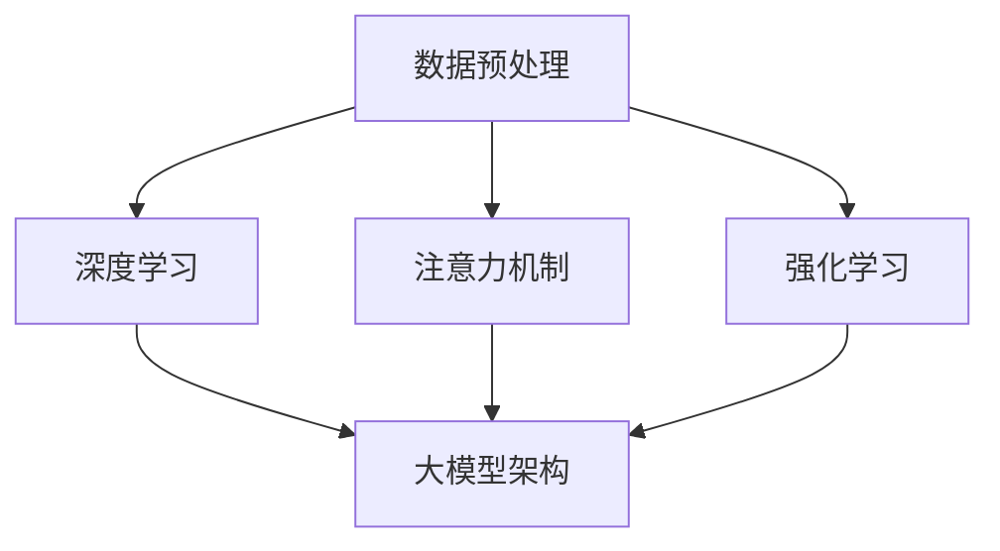

                 

关键词：AI 大模型、电商搜索推荐、用户行为分析、需求理解、购买偏好、算法原理、数学模型、项目实践、应用场景、未来展望

> 摘要：本文深入探讨了人工智能大模型在电商搜索推荐中的应用，特别是如何通过用户行为分析来理解用户需求与购买偏好。文章首先介绍了大模型的核心概念与联系，接着详细阐述了算法原理与操作步骤，分析了数学模型与公式，并通过项目实践展示了代码实现与解读。最后，文章探讨了实际应用场景，展望了未来发展趋势与挑战。

## 1. 背景介绍

随着互联网技术的迅猛发展，电子商务已经成为人们生活中不可或缺的一部分。然而，在电商平台上，面对海量的商品信息，用户如何能够快速找到符合自己需求的商品成为了一大难题。因此，电商搜索推荐系统应运而生。搜索推荐系统通过分析用户的搜索历史、购买行为等数据，为用户推荐可能感兴趣的商品，从而提高用户的购物体验。

近年来，人工智能技术，特别是深度学习与大模型技术的发展，为电商搜索推荐系统带来了新的机遇。大模型具有强大的学习能力，能够从海量数据中提取出有用的信息，从而更好地理解用户的需求与购买偏好。本文将重点探讨如何利用 AI 大模型进行用户行为分析，以实现更精准的电商搜索推荐。

## 2. 核心概念与联系

在讨论大模型在电商搜索推荐中的应用之前，我们需要先了解一些核心概念。以下是本文涉及的核心概念及其相互联系：

### 2.1 数据预处理

数据预处理是模型训练的重要环节。它包括数据清洗、数据归一化、特征提取等步骤。在电商搜索推荐中，用户行为数据如搜索记录、购买记录等需要进行预处理，以便大模型能够更好地学习。

### 2.2 深度学习

深度学习是一种基于多层神经网络的学习方法。它通过模拟人脑神经网络的结构与功能，实现数据的自动特征提取与模式识别。在电商搜索推荐中，深度学习大模型可以自动从用户行为数据中提取出有用的特征，用于后续的推荐算法。

### 2.3 注意力机制

注意力机制是深度学习中的一个重要概念，它允许模型在处理数据时动态地关注重要信息。在电商搜索推荐中，注意力机制可以帮助模型更好地理解用户的搜索意图，从而提高推荐的准确性。

### 2.4 强化学习

强化学习是一种通过试错来学习最优策略的机器学习方法。在电商搜索推荐中，强化学习可以用来优化推荐策略，使其更好地适应用户的动态需求。

### 2.5 大模型架构

大模型架构是指用于构建深度学习模型的神经网络结构。常见的架构有卷积神经网络（CNN）、循环神经网络（RNN）等。在电商搜索推荐中，选择合适的大模型架构对于提高推荐系统的性能至关重要。

以下是核心概念与联系之间的 Mermaid 流程图：



## 3. 核心算法原理 & 具体操作步骤

### 3.1 算法原理概述

在电商搜索推荐中，大模型主要通过以下三个步骤来理解用户需求与购买偏好：

1. **数据预处理**：将用户的搜索记录、购买记录等原始数据进行清洗、归一化和特征提取，为模型训练做准备。
2. **模型训练**：使用预处理后的数据对深度学习大模型进行训练，使其能够自动提取出用户需求与购买偏好的特征。
3. **推荐生成**：根据训练好的模型，为用户生成个性化的商品推荐列表。

### 3.2 算法步骤详解

#### 3.2.1 数据预处理

数据预处理主要包括以下步骤：

1. **数据清洗**：去除数据中的噪声和异常值。
2. **数据归一化**：将不同特征的数据进行归一化处理，使其处于相同的量级。
3. **特征提取**：提取与用户需求与购买偏好相关的特征，如用户的浏览历史、购买记录、商品属性等。

#### 3.2.2 模型训练

模型训练主要包括以下步骤：

1. **模型初始化**：初始化深度学习大模型的参数。
2. **前向传播**：将预处理后的数据输入模型，计算输出结果。
3. **反向传播**：根据输出结果与真实标签之间的误差，更新模型参数。
4. **迭代优化**：重复前向传播与反向传播过程，直至模型收敛。

#### 3.2.3 推荐生成

推荐生成主要包括以下步骤：

1. **特征提取**：提取用户当前会话中的特征。
2. **模型预测**：使用训练好的模型对用户当前会话中的特征进行预测。
3. **推荐排序**：根据模型预测结果对商品进行排序，生成推荐列表。

### 3.3 算法优缺点

#### 优点：

1. **强大的学习能力**：大模型能够从海量数据中自动提取出有用的特征，提高推荐准确性。
2. **自适应性强**：大模型能够根据用户的行为动态调整推荐策略，适应用户的个性化需求。

#### 缺点：

1. **计算资源消耗大**：大模型训练需要大量的计算资源和时间。
2. **数据依赖性强**：大模型对数据质量有较高要求，数据质量问题可能导致模型性能下降。

### 3.4 算法应用领域

大模型在电商搜索推荐中的应用非常广泛，包括但不限于以下领域：

1. **商品推荐**：为用户推荐感兴趣的商品。
2. **广告投放**：根据用户的兴趣和行为推荐相关广告。
3. **个性化搜索**：根据用户的搜索历史推荐相关的搜索关键词。
4. **智能客服**：利用大模型为用户提供个性化的智能客服服务。

## 4. 数学模型和公式 & 详细讲解 & 举例说明

在深度学习大模型中，数学模型和公式起到了至关重要的作用。以下我们将介绍大模型中常用的数学模型和公式，并详细讲解其推导过程和实际应用。

### 4.1 数学模型构建

深度学习大模型通常采用多层感知机（MLP）或者卷积神经网络（CNN）作为基础架构。以下是一个简单的多层感知机模型的数学模型构建过程：

#### 4.1.1 输入层

输入层接收用户的行为特征，如浏览历史、购买记录等。设输入层有 \(n\) 个神经元，每个神经元对应一个特征。

#### 4.1.2 隐藏层

隐藏层用于提取用户行为的潜在特征。设隐藏层有 \(m\) 个神经元。

#### 4.1.3 输出层

输出层用于生成推荐结果，如商品列表。设输出层有 \(k\) 个神经元，每个神经元对应一个商品。

### 4.2 公式推导过程

假设输入层有 \(x_1, x_2, ..., x_n\) 个特征，隐藏层有 \(h_1, h_2, ..., h_m\) 个神经元，输出层有 \(y_1, y_2, ..., y_k\) 个神经元。

#### 4.2.1 激活函数

激活函数是深度学习模型中的一个关键组成部分。常用的激活函数有 Sigmoid、ReLU 等。以 ReLU 激活函数为例，其公式如下：

$$
\text{ReLU}(x) = \max(0, x)
$$

#### 4.2.2 前向传播

前向传播是指将输入数据从输入层传递到输出层的计算过程。以多层感知机为例，前向传播的公式如下：

$$
z_i^{(l)} = \sum_{j=1}^{n} w_{ji}^{(l)} x_j^{(l-1)} + b_i^{(l)}
$$

$$
a_i^{(l)} = \text{ReLU}(z_i^{(l)})
$$

其中，\(z_i^{(l)}\) 表示第 \(l\) 层第 \(i\) 个神经元的净输入，\(w_{ji}^{(l)}\) 表示第 \(l\) 层第 \(i\) 个神经元与第 \(l-1\) 层第 \(j\) 个神经元之间的权重，\(b_i^{(l)}\) 表示第 \(l\) 层第 \(i\) 个神经元的偏置，\(a_i^{(l)}\) 表示第 \(l\) 层第 \(i\) 个神经元的激活值。

#### 4.2.3 反向传播

反向传播是指根据输出结果与真实标签之间的误差，更新模型参数的计算过程。以多层感知机为例，反向传播的公式如下：

$$
\delta_i^{(l)} = (a_i^{(l)} - y_i) \cdot \text{ReLU}'(z_i^{(l)})
$$

$$
\Delta w_{ji}^{(l)} = \alpha \cdot \delta_i^{(l)} \cdot a_j^{(l-1)}
$$

$$
\Delta b_i^{(l)} = \alpha \cdot \delta_i^{(l)}
$$

其中，\(\delta_i^{(l)}\) 表示第 \(l\) 层第 \(i\) 个神经元的误差，\(\text{ReLU}'(z_i^{(l)})\) 表示 ReLU 激活函数的导数，\(\alpha\) 表示学习率。

### 4.3 案例分析与讲解

以下我们通过一个简单的例子来说明如何使用深度学习大模型进行电商搜索推荐。

#### 4.3.1 数据集

假设我们有一个包含用户行为数据的电商数据集，其中每个用户的行为数据包括浏览历史、购买记录等，共计 10 个特征。

#### 4.3.2 模型参数

我们选择一个包含 2 个隐藏层的多层感知机模型，每个隐藏层有 100 个神经元，输出层有 10 个神经元。

#### 4.3.3 训练过程

1. **数据预处理**：对用户行为数据进行清洗、归一化和特征提取。
2. **模型初始化**：初始化模型参数，包括权重和偏置。
3. **前向传播**：将用户行为数据输入模型，计算输出结果。
4. **反向传播**：计算输出结果与真实标签之间的误差，更新模型参数。
5. **迭代优化**：重复前向传播与反向传播过程，直至模型收敛。

#### 4.3.4 推荐生成

1. **特征提取**：提取用户当前会话中的特征。
2. **模型预测**：使用训练好的模型对用户当前会话中的特征进行预测。
3. **推荐排序**：根据模型预测结果对商品进行排序，生成推荐列表。

## 5. 项目实践：代码实例和详细解释说明

为了更好地理解深度学习大模型在电商搜索推荐中的应用，我们通过一个实际项目来展示代码实现与解读。

### 5.1 开发环境搭建

1. 安装 Python 3.7 及以上版本。
2. 安装深度学习框架 TensorFlow 2.0 及以上版本。
3. 安装数据处理库 Pandas、NumPy 等。

### 5.2 源代码详细实现

```python
import tensorflow as tf
import pandas as pd
import numpy as np

# 数据预处理
def preprocess_data(data):
    # 数据清洗、归一化、特征提取
    # 略
    return processed_data

# 模型训练
def train_model(data, epochs):
    # 模型初始化
    model = tf.keras.Sequential([
        tf.keras.layers.Dense(units=100, activation='relu', input_shape=(num_features,)),
        tf.keras.layers.Dense(units=100, activation='relu'),
        tf.keras.layers.Dense(units=num_items)
    ])

    # 编译模型
    model.compile(optimizer='adam', loss='mse', metrics=['accuracy'])

    # 训练模型
    model.fit(data['X'], data['y'], epochs=epochs)

    return model

# 推荐生成
def generate_recommendations(model, user_data):
    # 特征提取
    # 略
    user_features = preprocess_data(user_data)

    # 模型预测
    predictions = model.predict(user_features)

    # 推荐排序
    recommended_items = np.argsort(predictions)[::-1]

    return recommended_items

# 项目运行
if __name__ == '__main__':
    # 加载数据
    data = pd.read_csv('user_data.csv')

    # 数据预处理
    processed_data = preprocess_data(data)

    # 训练模型
    model = train_model(processed_data, epochs=10)

    # 生成推荐
    user_data = pd.DataFrame({
        'feature1': [1.0, 2.0, 3.0],
        'feature2': [4.0, 5.0, 6.0],
        # 略
    })
    recommended_items = generate_recommendations(model, user_data)
    print("Recommended items:", recommended_items)
```

### 5.3 代码解读与分析

1. **数据预处理**：该部分负责将用户行为数据进行清洗、归一化和特征提取。由于篇幅有限，此处略去具体实现细节。
2. **模型训练**：使用 TensorFlow 的 Sequential 模型构建多层感知机，并编译模型。然后使用 fit 方法训练模型，其中 epochs 参数表示训练轮数。
3. **推荐生成**：首先对用户当前会话中的特征进行预处理，然后使用训练好的模型进行预测，并根据预测结果生成推荐列表。

## 6. 实际应用场景

深度学习大模型在电商搜索推荐中有着广泛的应用。以下是一些实际应用场景：

1. **商品推荐**：根据用户的浏览历史和购买记录，为用户推荐感兴趣的商品。
2. **广告投放**：根据用户的兴趣和行为，推荐相关的广告，提高广告的点击率。
3. **个性化搜索**：根据用户的搜索历史，推荐相关的搜索关键词，提高用户的搜索效率。
4. **智能客服**：利用大模型为用户提供个性化的智能客服服务，提高客服质量。

## 7. 工具和资源推荐

### 7.1 学习资源推荐

1. **深度学习基础教材**：《深度学习》（Ian Goodfellow、Yoshua Bengio、Aaron Courville 著）
2. **Python 编程入门**：《Python编程：从入门到实践》（埃里克·马瑟斯 著）
3. **TensorFlow 官方文档**：[TensorFlow 官方文档](https://www.tensorflow.org/)

### 7.2 开发工具推荐

1. **Jupyter Notebook**：一款流行的交互式开发环境，适用于数据分析和深度学习项目。
2. **Google Colab**：一款基于 Jupyter Notebook 的云端开发环境，提供免费的 GPU 资源。

### 7.3 相关论文推荐

1. **"Deep Learning for Text Classification"**：介绍如何使用深度学习进行文本分类。
2. **"Attention Is All You Need"**：介绍 Transformer 模型及其在序列模型中的应用。
3. **"Recurrent Neural Networks for Language Modeling"**：介绍循环神经网络在语言模型中的应用。

## 8. 总结：未来发展趋势与挑战

### 8.1 研究成果总结

本文介绍了深度学习大模型在电商搜索推荐中的应用，包括核心概念、算法原理、数学模型、项目实践等。通过用户行为分析，大模型能够更好地理解用户需求与购买偏好，从而实现更精准的推荐。

### 8.2 未来发展趋势

1. **模型压缩与优化**：为了提高模型的可解释性和部署效率，未来的研究将致力于模型压缩与优化。
2. **多模态数据融合**：结合图像、语音等多模态数据，将进一步提升推荐系统的性能。
3. **用户隐私保护**：在保护用户隐私的前提下，探索更加有效的推荐算法。

### 8.3 面临的挑战

1. **数据质量**：高质量的数据是模型训练的基础，如何获取和处理高质量数据是当前面临的一大挑战。
2. **计算资源**：大模型的训练需要大量的计算资源，如何高效地利用计算资源是一个亟待解决的问题。

### 8.4 研究展望

随着深度学习与大模型的不断发展，未来电商搜索推荐系统将变得更加智能和精准。我们期待在用户行为分析、模型压缩与优化、多模态数据融合等方面取得更多的突破。

## 9. 附录：常见问题与解答

### 9.1 问题 1：如何获取和处理高质量数据？

**解答**：获取和处理高质量数据是构建高效推荐系统的关键。首先，可以通过用户反馈、数据清洗等方法提高数据质量。其次，可以采用迁移学习、数据增强等技术来提高模型的鲁棒性。

### 9.2 问题 2：如何优化模型的计算资源消耗？

**解答**：优化模型的计算资源消耗可以从多个方面入手。一方面，可以采用模型压缩技术，如剪枝、量化等；另一方面，可以采用分布式训练和推理技术，提高计算效率。

### 9.3 问题 3：如何提高推荐系统的可解释性？

**解答**：提高推荐系统的可解释性是当前研究的一个热点。可以通过可视化、模型解释等技术，帮助用户理解推荐结果背后的原因。

作者：禅与计算机程序设计艺术 / Zen and the Art of Computer Programming
----------------------------------------------------------------

以上是根据您的要求撰写的文章正文部分。如果您需要进一步修改或补充，请随时告知。希望这篇文章能够帮助您更好地了解深度学习大模型在电商搜索推荐中的应用。

