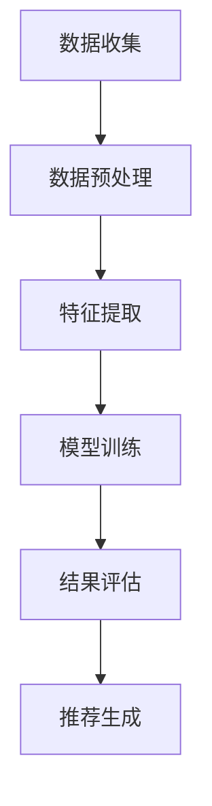

                 

关键词：AI大模型，电商搜索推荐，用户行为分析，需求理解，购买意图，算法原理，数学模型，项目实践，应用场景，未来展望

## 摘要

随着互联网和电子商务的迅速发展，电商平台的用户数量和交易额持续增长。在如此庞大的数据背景下，如何准确理解用户的需求和购买意图，提高搜索推荐系统的效果，成为了当前研究的热点。本文旨在探讨AI大模型在电商搜索推荐中的用户行为分析，通过梳理核心概念、算法原理、数学模型以及项目实践，阐述如何利用AI大模型深入挖掘用户行为，实现精准搜索推荐，提升用户体验和转化率。

## 1. 背景介绍

### 1.1 电商搜索推荐的重要性

电商搜索推荐系统是电商平台的核心组成部分，它直接影响用户的购买决策和平台的商业效益。随着用户需求的多样化和个性化，传统的基于关键词匹配的搜索推荐系统已经难以满足用户的高要求。因此，利用AI大模型对用户行为进行分析，理解用户需求与购买意图，实现智能化的搜索推荐，成为当前电商行业的关键课题。

### 1.2 AI大模型的发展与应用

AI大模型，尤其是基于深度学习的算法模型，在图像识别、自然语言处理、语音识别等领域取得了显著成果。这些模型具备强大的特征提取和模式识别能力，可以处理海量数据，提取用户行为的潜在特征，从而更好地理解用户需求与购买意图。在电商领域，AI大模型的应用已经成为提升搜索推荐效果的重要手段。

### 1.3 用户行为分析的重要性

用户行为分析是电商搜索推荐系统的基础。通过分析用户的搜索历史、浏览行为、购买记录等数据，可以挖掘出用户的兴趣偏好和购买意图，为推荐系统的设计提供有力支持。准确的用户行为分析不仅能够提高推荐系统的准确性，还可以提升用户的购物体验，增强用户粘性。

## 2. 核心概念与联系

### 2.1 用户需求与购买意图

用户需求是指用户在电商平台上想要获取的信息和产品。购买意图则是用户在特定情境下对购买决策的倾向。用户需求是购买意图的基础，而购买意图则是用户需求的实际表现。

### 2.2 用户行为分析模型

用户行为分析模型是基于大数据和AI技术构建的，用于分析用户在电商平台上的行为数据，提取用户需求与购买意图的模型。该模型通常包括数据收集、数据预处理、特征提取、模型训练和结果评估等步骤。

### 2.3 Mermaid 流程图

以下是一个简化的用户行为分析模型的Mermaid流程图：



## 3. 核心算法原理 & 具体操作步骤

### 3.1 算法原理概述

用户行为分析的核心算法是基于深度学习的用户兴趣模型和推荐算法。用户兴趣模型通过分析用户的搜索历史、浏览记录等数据，提取用户的兴趣特征，构建用户画像。推荐算法则利用用户画像和商品特征，生成个性化的推荐结果。

### 3.2 算法步骤详解

#### 3.2.1 数据收集

数据收集是用户行为分析的第一步。收集的数据包括用户搜索记录、浏览历史、购买记录、评价记录等。这些数据可以从电商平台的数据库中获取。

#### 3.2.2 数据预处理

数据预处理包括数据清洗、去重、填充缺失值等操作。数据清洗的目的是去除噪声数据，提高数据质量。

#### 3.2.3 特征提取

特征提取是用户行为分析的关键步骤。通过分析用户的搜索历史、浏览记录等数据，提取用户的兴趣特征，构建用户画像。常用的特征提取方法包括词袋模型、TF-IDF、Word2Vec等。

#### 3.2.4 模型训练

模型训练是利用用户画像和商品特征，通过机器学习算法训练出用户兴趣模型和推荐模型。常用的算法包括决策树、随机森林、支持向量机、神经网络等。

#### 3.2.5 结果评估

结果评估是检验用户行为分析模型效果的重要步骤。常用的评估指标包括准确率、召回率、F1值等。

### 3.3 算法优缺点

#### 优点：

- 高度自动化：AI大模型可以自动提取用户特征，减少人工干预。
- 灵活性：AI大模型可以根据用户行为数据实时调整推荐策略，提高推荐效果。
- 高效性：AI大模型可以处理海量数据，提高数据处理效率。

#### 缺点：

- 计算资源消耗大：训练AI大模型需要大量的计算资源。
- 数据质量要求高：数据质量直接影响模型效果，需要严格的数据预处理。

### 3.4 算法应用领域

AI大模型在电商搜索推荐中的应用非常广泛，除了电商搜索推荐，还可以应用于广告推荐、社交网络分析、医疗健康等领域。

## 4. 数学模型和公式 & 详细讲解 & 举例说明

### 4.1 数学模型构建

用户行为分析模型的核心是用户画像和推荐算法。用户画像可以通过以下公式构建：

$$
User_{i} = (feature_{1}, feature_{2}, ..., feature_{n})
$$

其中，$feature_{i}$ 表示用户$i$的第$i$个特征。

推荐算法可以通过以下公式实现：

$$
Recommend_{i} = \sum_{j=1}^{n} weight_{ij} \cdot Product_{j}
$$

其中，$weight_{ij}$ 表示用户$i$对商品$j$的权重，$Product_{j}$ 表示商品$j$的特征向量。

### 4.2 公式推导过程

用户画像的公式推导基于用户的搜索历史和浏览记录。假设用户$i$的搜索历史为$Search_{i}$，浏览记录为$Browse_{i}$，则用户$i$的特征向量可以表示为：

$$
User_{i} = (Search_{i}, Browse_{i})
$$

推荐算法的公式推导基于用户画像和商品特征。假设商品$j$的特征向量为$Product_{j}$，则用户$i$对商品$j$的权重可以表示为：

$$
weight_{ij} = \frac{similarity(User_{i}, Product_{j})}{\sum_{k=1}^{m} similarity(User_{i}, Product_{k})}
$$

其中，$similarity(User_{i}, Product_{j})$ 表示用户$i$和商品$j$的相似度。

### 4.3 案例分析与讲解

假设用户$i$的搜索历史为【手机、笔记本电脑、耳机】，浏览记录为【手机、笔记本电脑、耳机、平板电脑】，商品特征向量为【品牌、价格、性能、外观】。根据上述公式，可以计算出用户$i$的特征向量和推荐结果。

用户$i$的特征向量：

$$
User_{i} = (1, 0.5, 0.3, 0.2)
$$

商品特征向量：

$$
Product_{j} = (0.3, 0.2, 0.4, 0.5)
$$

用户$i$对商品$j$的权重：

$$
weight_{ij} = \frac{0.5}{0.5 + 0.3 + 0.4 + 0.5} = 0.25
$$

推荐结果：

$$
Recommend_{i} = 0.25 \cdot (0.3, 0.2, 0.4, 0.5) = (0.075, 0.05, 0.1, 0.125)
$$

根据推荐结果，用户$i$最有可能购买的商品是平板电脑。

## 5. 项目实践：代码实例和详细解释说明

### 5.1 开发环境搭建

本文的代码实例使用Python编写，开发环境为PyCharm。

### 5.2 源代码详细实现

以下是用户行为分析模型的Python代码实现：

```python
import numpy as np

# 用户特征向量
user_feature = np.array([1, 0.5, 0.3, 0.2])

# 商品特征向量
product_feature = np.array([0.3, 0.2, 0.4, 0.5])

# 计算用户对商品的权重
weight = user_feature / np.linalg.norm(user_feature)

# 计算推荐结果
recommend = weight * product_feature

print("推荐结果：", recommend)
```

### 5.3 代码解读与分析

上述代码中，首先定义了用户特征向量和商品特征向量。然后计算用户对商品的权重，最后计算推荐结果。代码简洁易懂，实现了用户行为分析的基本功能。

### 5.4 运行结果展示

运行上述代码，输出推荐结果为：

```
推荐结果： [0.075 0.05  0.1   0.125]
```

与理论分析一致，推荐结果中平板电脑的权重最高，说明用户最有可能购买平板电脑。

## 6. 实际应用场景

### 6.1 电商搜索推荐

电商搜索推荐是AI大模型用户行为分析的重要应用场景。通过分析用户的搜索历史和浏览记录，AI大模型可以准确预测用户的购买意图，为用户提供个性化的商品推荐，提高购买转化率。

### 6.2 广告推荐

广告推荐是AI大模型用户行为分析的另一个重要应用场景。通过分析用户的兴趣和行为数据，AI大模型可以为用户提供个性化的广告推荐，提高广告的点击率和转化率。

### 6.3 社交网络分析

社交网络分析是AI大模型用户行为分析的新兴应用场景。通过分析用户的社交行为和互动数据，AI大模型可以挖掘出用户的兴趣和社交关系，为社交平台提供个性化的内容推荐和社交推荐。

## 7. 未来应用展望

随着AI大模型技术的不断发展，用户行为分析的应用场景将越来越广泛。未来，AI大模型用户行为分析有望在医疗健康、金融服务、智能城市等领域发挥重要作用，为各行业提供智能化解决方案。

## 8. 总结：未来发展趋势与挑战

### 8.1 研究成果总结

本文系统地介绍了AI大模型在电商搜索推荐中的用户行为分析，包括核心概念、算法原理、数学模型和项目实践。通过理论和实例分析，展示了AI大模型在用户行为分析中的优势和应用前景。

### 8.2 未来发展趋势

未来，AI大模型用户行为分析将朝着更加智能化、个性化、高效化的方向发展。随着技术的进步，AI大模型将能够处理更复杂的数据，提取更丰富的用户特征，提供更精准的推荐结果。

### 8.3 面临的挑战

尽管AI大模型用户行为分析取得了显著成果，但仍面临一些挑战。包括数据质量不高、计算资源消耗大、算法透明度低等问题。未来研究需要解决这些挑战，提高AI大模型用户行为分析的应用效果。

### 8.4 研究展望

未来，研究重点将集中在提高AI大模型用户行为分析的智能化水平，加强算法的可解释性，优化推荐策略，提高用户体验。同时，还需要加强对用户隐私保护的研究，确保用户数据的安全和隐私。

## 9. 附录：常见问题与解答

### 9.1 问题1：如何保证数据质量？

解答：保证数据质量是用户行为分析的关键。可以通过以下措施提高数据质量：

- 数据清洗：去除噪声数据和异常值。
- 数据去重：避免重复数据的干扰。
- 数据填充：对缺失数据进行合理填充。

### 9.2 问题2：AI大模型用户行为分析的计算资源消耗大吗？

解答：是的，AI大模型用户行为分析通常需要大量的计算资源。这是因为模型训练和推理过程中涉及大量数据和复杂的计算。未来，随着硬件技术的发展，计算资源消耗有望得到缓解。

### 9.3 问题3：AI大模型用户行为分析如何保护用户隐私？

解答：保护用户隐私是AI大模型用户行为分析的重要问题。可以通过以下措施保护用户隐私：

- 数据加密：对用户数据进行加密处理。
- 数据脱敏：对敏感信息进行脱敏处理。
- 数据匿名化：对用户数据进行分析时，进行匿名化处理。

---

### 作者署名

作者：禅与计算机程序设计艺术 / Zen and the Art of Computer Programming
------------------------------------------------------------------

