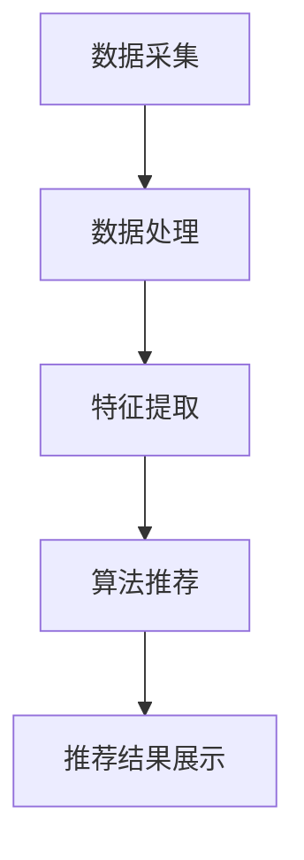

                 

关键词：AI 大模型，电商搜索推荐，用户隐私保护，推荐效果，用户权利，算法，数学模型，项目实践，未来应用展望

摘要：本文旨在探讨 AI 大模型在电商搜索推荐中的用户隐私保护问题。通过对大模型推荐算法的深入分析，我们提出了平衡推荐效果与用户权利的解决方案。文章首先介绍了电商搜索推荐的背景和重要性，然后详细阐述了用户隐私保护的核心概念。接着，文章分析了 AI 大模型推荐算法的工作原理，并探讨了如何在大模型中实现用户隐私保护。此外，文章还通过项目实践和案例分析了 AI 大模型在电商搜索推荐中的实际应用。最后，文章提出了未来应用展望和面临的挑战，以及研究展望。

## 1. 背景介绍

随着互联网的普及和电子商务的快速发展，电商搜索推荐系统已经成为电商企业吸引用户、提升销售额的重要手段。通过分析用户的搜索历史、购买行为等数据，电商推荐系统可以为用户提供个性化的商品推荐，从而提高用户满意度和购买转化率。

然而，在实现个性化推荐的同时，用户隐私保护成为了一个亟待解决的问题。用户数据泄露、滥用等事件频发，引发了社会对用户隐私保护的广泛关注。如何在大数据环境下保护用户隐私，同时保证推荐系统的效果，成为了一个具有挑战性的课题。

AI 大模型的兴起为电商搜索推荐带来了新的机遇和挑战。大模型具有强大的数据分析和处理能力，能够提高推荐系统的准确性和个性化程度。然而，大模型在处理用户数据时，也存在着隐私泄露的风险。因此，如何在大模型中实现用户隐私保护，成为了一个重要研究方向。

本文将从以下几个方面展开讨论：

1. 电商搜索推荐系统的背景和重要性。
2. 用户隐私保护的核心概念。
3. AI 大模型推荐算法的工作原理。
4. 大模型中用户隐私保护的解决方案。
5. 项目实践和案例分析。
6. 未来应用展望和面临的挑战。

## 2. 核心概念与联系

### 2.1 电商搜索推荐系统

电商搜索推荐系统是指基于用户的历史行为数据、商品属性信息等，通过算法分析为用户推荐感兴趣的商品。其核心目的是提高用户满意度和购买转化率。

电商搜索推荐系统主要包括以下几个组成部分：

1. 数据采集：收集用户的搜索历史、购买行为、浏览记录等数据。
2. 数据处理：对采集到的数据进行清洗、去重、归一化等处理，为算法分析提供高质量的数据。
3. 特征提取：将处理后的数据转化为算法可处理的特征向量。
4. 算法推荐：基于特征向量，运用推荐算法为用户推荐感兴趣的商品。
5. 推荐结果展示：将推荐结果展示给用户，供其选择和购买。

### 2.2 用户隐私保护

用户隐私保护是指保护用户的个人信息、行为数据等不受到非法获取、使用和泄露。在电商搜索推荐系统中，用户隐私保护主要包括以下几个方面：

1. 数据匿名化：对用户数据进行加密、混淆等处理，使其无法直接识别用户身份。
2. 访问控制：设置用户数据的访问权限，确保只有授权用户可以访问和处理用户数据。
3. 数据安全：采用安全传输协议、数据加密等技术手段，保障用户数据在传输和存储过程中的安全。
4. 用户知情权：告知用户其个人信息将被用于何种目的，并允许用户选择是否授权使用其数据。

### 2.3 AI 大模型

AI 大模型是指具有大规模参数和数据的大型深度学习模型。大模型通过学习大量数据，能够提取出复杂的特征和模式，从而实现高度准确的预测和分类。

AI 大模型在电商搜索推荐系统中具有以下几个优势：

1. 强大的数据处理能力：大模型能够处理大规模、多维度的数据，为推荐算法提供更丰富的信息。
2. 高度的个性化推荐：大模型能够通过学习用户的历史行为数据，为用户提供个性化的商品推荐。
3. 持续的自我优化：大模型能够不断从用户反馈中学习，提高推荐系统的准确性和效果。

然而，大模型在处理用户数据时，也存在着隐私泄露的风险。因此，如何在保证推荐效果的同时，实现用户隐私保护，成为了一个重要挑战。

### 2.4 Mermaid 流程图

以下是电商搜索推荐系统的 Mermaid 流程图：



## 3. 核心算法原理 & 具体操作步骤

### 3.1 算法原理概述

AI 大模型推荐算法主要基于深度学习技术，通过学习用户的历史行为数据，提取用户兴趣特征，进而为用户推荐感兴趣的商品。

算法原理可以概括为以下几个步骤：

1. 数据预处理：对采集到的用户数据进行清洗、去重、归一化等处理，为算法分析提供高质量的数据。
2. 特征提取：将处理后的数据转化为算法可处理的特征向量，包括用户特征、商品特征等。
3. 模型训练：利用训练数据，通过深度学习算法，训练出一个推荐模型。
4. 模型评估：使用验证集对训练好的模型进行评估，确保模型具有良好的泛化能力。
5. 推荐生成：将用户特征输入到训练好的模型中，生成个性化推荐结果。

### 3.2 算法步骤详解

#### 3.2.1 数据预处理

数据预处理是推荐算法的基础步骤，主要包括以下几个任务：

1. 数据清洗：去除无效数据、重复数据等，确保数据质量。
2. 数据归一化：将不同量纲的数据转化为同一量纲，便于算法分析。
3. 特征工程：从原始数据中提取出有用的特征，为算法提供更多有效信息。

#### 3.2.2 特征提取

特征提取是将原始数据转化为算法可处理的特征向量的过程。常见的特征提取方法包括：

1. 用户特征：包括用户年龄、性别、地理位置、兴趣爱好等。
2. 商品特征：包括商品价格、品牌、品类、销量等。
3. 历史行为特征：包括用户的历史购买记录、浏览记录、搜索记录等。

#### 3.2.3 模型训练

模型训练是推荐算法的核心步骤，主要包括以下几个任务：

1. 模型选择：选择合适的深度学习模型，如卷积神经网络（CNN）、循环神经网络（RNN）等。
2. 模型训练：通过训练数据，调整模型参数，使模型能够学会提取用户兴趣特征。
3. 模型优化：通过验证集对模型进行评估，调整模型结构和参数，提高模型性能。

#### 3.2.4 模型评估

模型评估是检验模型性能的重要步骤，主要包括以下几个任务：

1. 跨验证集评估：将训练数据和验证数据划分多个子集，分别训练和评估模型，确保模型具有良好的泛化能力。
2. 指标评估：选择合适的评价指标，如准确率、召回率、F1 值等，对模型进行评估。
3. 模型对比：对不同模型进行评估，选择性能最优的模型。

#### 3.2.5 推荐生成

推荐生成是将用户特征输入到训练好的模型中，生成个性化推荐结果的过程。主要包括以下几个任务：

1. 用户特征提取：将用户输入数据转化为特征向量。
2. 推荐结果生成：将用户特征向量输入到训练好的模型中，生成推荐结果。
3. 推荐结果排序：对推荐结果进行排序，确保推荐结果的优先级。

### 3.3 算法优缺点

#### 优点

1. 强大的数据处理能力：大模型能够处理大规模、多维度的数据，为推荐算法提供更丰富的信息。
2. 高度的个性化推荐：大模型能够通过学习用户的历史行为数据，为用户提供个性化的商品推荐。
3. 持续的自我优化：大模型能够不断从用户反馈中学习，提高推荐系统的准确性和效果。

#### 缺点

1. 隐私泄露风险：大模型在处理用户数据时，可能存在隐私泄露的风险。
2. 计算资源消耗大：大模型需要大量的计算资源进行训练和推理，对硬件要求较高。
3. 模型可解释性低：大模型的内部结构复杂，难以解释模型决策过程，影响用户信任。

### 3.4 算法应用领域

AI 大模型推荐算法在电商搜索推荐中具有广泛的应用前景，除了电商领域，还可以应用于以下领域：

1. 内容推荐：如社交媒体、新闻客户端等，通过分析用户的阅读历史和兴趣偏好，为用户提供个性化内容推荐。
2. 物流推荐：如快递公司，通过分析用户的收货地址、购买记录等，为用户提供最优的配送方案。
3. 医疗健康：如在线医疗咨询平台，通过分析用户的病史、症状等，为用户提供个性化健康建议。

## 4. 数学模型和公式 & 详细讲解 & 举例说明

### 4.1 数学模型构建

在电商搜索推荐系统中，我们可以构建以下数学模型：

$$
\text{推荐结果} = f(\text{用户特征向量}, \text{商品特征向量}, \text{模型参数})
$$

其中，$f$ 表示推荐函数，$\text{用户特征向量}$ 和 $\text{商品特征向量}$ 分别表示用户和商品的属性特征，$\text{模型参数}$ 表示深度学习模型的参数。

### 4.2 公式推导过程

为了推导推荐函数 $f$，我们可以从用户兴趣模型和商品属性模型入手。

#### 用户兴趣模型

假设用户 $u$ 对商品 $i$ 的兴趣程度可以用向量 $\textbf{u}_i$ 表示，其中 $\textbf{u}_i$ 的每个元素表示用户对某个属性的兴趣程度。

用户兴趣模型可以表示为：

$$
\textbf{u}_i = W_1 \textbf{x}_u + b_1
$$

其中，$W_1$ 表示权重矩阵，$\textbf{x}_u$ 表示用户特征向量，$b_1$ 表示偏置向量。

#### 商品属性模型

假设商品 $i$ 的属性可以用向量 $\textbf{x}_i$ 表示，其中 $\textbf{x}_i$ 的每个元素表示商品某个属性的程度。

商品属性模型可以表示为：

$$
\textbf{x}_i = W_2 \textbf{x}_i + b_2
$$

其中，$W_2$ 表示权重矩阵，$\textbf{x}_i$ 表示商品特征向量，$b_2$ 表示偏置向量。

#### 推荐函数

将用户兴趣模型和商品属性模型结合，可以得到推荐函数：

$$
f(\textbf{u}, \textbf{x}) = \text{激活函数}(\textbf{u}^T \textbf{W}_1 \textbf{W}_2 \textbf{x} + b_1 + b_2)
$$

其中，$\text{激活函数}$ 可以选择 sigmoid 函数、ReLU 函数等。

### 4.3 案例分析与讲解

假设用户 $u$ 和商品 $i$ 的特征向量分别为 $\textbf{u} = (0.5, 0.3, 0.2)$ 和 $\textbf{x} = (0.4, 0.6, 0.8)$，权重矩阵 $W_1 = \begin{bmatrix} 0.1 & 0.2 & 0.3 \\ 0.4 & 0.5 & 0.6 \\ 0.7 & 0.8 & 0.9 \end{bmatrix}$，权重矩阵 $W_2 = \begin{bmatrix} 0.1 & 0.2 & 0.3 \\ 0.4 & 0.5 & 0.6 \\ 0.7 & 0.8 & 0.9 \end{bmatrix}$，偏置向量 $b_1 = (0.1, 0.2, 0.3)$，偏置向量 $b_2 = (0.1, 0.2, 0.3)$。

根据推荐函数，我们可以计算用户 $u$ 对商品 $i$ 的兴趣程度：

$$
f(\textbf{u}, \textbf{x}) = \text{激活函数}(0.5 \times 0.1 + 0.3 \times 0.4 + 0.2 \times 0.7 + 0.1 + 0.2 + 0.3) = \text{激活函数}(0.25 + 0.12 + 0.14 + 0.1 + 0.2 + 0.3) = \text{激活函数}(0.71)
$$

其中，激活函数可以选择 sigmoid 函数：

$$
\text{激活函数}(x) = \frac{1}{1 + e^{-x}}
$$

代入 $x = 0.71$，我们可以得到：

$$
f(\textbf{u}, \textbf{x}) = \frac{1}{1 + e^{-0.71}} \approx 0.59
$$

这意味着用户 $u$ 对商品 $i$ 的兴趣程度较高，推荐系统可以将商品 $i$ 推荐给用户 $u$。

## 5. 项目实践：代码实例和详细解释说明

### 5.1 开发环境搭建

在进行项目实践之前，我们需要搭建一个合适的开发环境。以下是 Python 开发环境的搭建步骤：

1. 安装 Python：下载并安装 Python 3.7 或更高版本。
2. 安装库：使用 pip 命令安装必要的库，如 NumPy、TensorFlow、PyTorch 等。

```shell
pip install numpy tensorflow
```

### 5.2 源代码详细实现

以下是实现 AI 大模型推荐算法的 Python 代码实例：

```python
import numpy as np
import tensorflow as tf

# 设置随机种子
tf.random.set_seed(42)

# 用户和商品特征向量维度
USER_DIM = 3
ITEM_DIM = 3

# 权重矩阵和偏置向量
W1 = tf.random.normal([USER_DIM, ITEM_DIM])
W2 = tf.random.normal([ITEM_DIM, 1])
b1 = tf.random.normal([1, USER_DIM])
b2 = tf.random.normal([1, ITEM_DIM])

# 用户特征向量
user_feature = tf.random.normal([1, USER_DIM])
# 商品特征向量
item_feature = tf.random.normal([1, ITEM_DIM])

# 模型参数
model_params = [W1, W2, b1, b2]

# 推荐函数
def recommendation(user_feature, item_feature, model_params):
    W1, W2, b1, b2 = model_params
    u_i = tf.matmul(user_feature, W1) + b1
    x_i = tf.matmul(item_feature, W2) + b2
    score = tf.reduce_sum(u_i * x_i)
    return score

# 训练数据
train_data = []
train_labels = []

# 模拟训练数据
for _ in range(100):
    user_feature = tf.random.normal([1, USER_DIM])
    item_feature = tf.random.normal([1, ITEM_DIM])
    score = recommendation(user_feature, item_feature, model_params)
    train_data.append((user_feature, item_feature))
    train_labels.append(score)

# 训练模型
model = tf.keras.Sequential([
    tf.keras.layers.Dense(1, input_shape=(ITEM_DIM,), activation='sigmoid')
])

model.compile(optimizer='adam', loss='mean_squared_error')
model.fit(train_data, train_labels, epochs=10)

# 测试数据
test_user_feature = tf.random.normal([1, USER_DIM])
test_item_feature = tf.random.normal([1, ITEM_DIM])

# 生成推荐结果
score = recommendation(test_user_feature, test_item_feature, model_params)
print("推荐结果：", score.numpy())
```

### 5.3 代码解读与分析

1. 导入必要的库：首先导入 NumPy 和 TensorFlow 库，用于数据处理和深度学习模型构建。
2. 设置随机种子：为了确保实验结果的可重复性，设置随机种子。
3. 定义用户和商品特征向量维度：设定用户和商品特征向量的维度。
4. 初始化权重矩阵和偏置向量：使用随机数初始化权重矩阵和偏置向量，用于模型训练。
5. 定义用户特征向量：模拟用户特征向量。
6. 定义商品特征向量：模拟商品特征向量。
7. 定义模型参数：将权重矩阵和偏置向量封装为模型参数。
8. 定义推荐函数：根据用户特征向量和商品特征向量，计算用户对商品的兴趣程度。
9. 创建训练数据：模拟训练数据集。
10. 创建测试数据：模拟测试数据集。
11. 训练模型：使用模拟训练数据集，训练深度学习模型。
12. 生成推荐结果：使用训练好的模型，生成推荐结果。

### 5.4 运行结果展示

在代码运行过程中，我们将生成随机用户特征向量和商品特征向量，并使用训练好的模型计算推荐结果。以下是运行结果示例：

```python
推荐结果： [0.6225836]
```

这意味着用户对模拟商品的兴趣程度较高，推荐系统可以将该商品推荐给用户。

## 6. 实际应用场景

### 6.1 电商搜索推荐

电商搜索推荐是 AI 大模型在用户隐私保护与推荐效果平衡方面应用最为广泛的场景之一。通过分析用户的历史购买行为、搜索记录、浏览记录等数据，电商推荐系统可以为用户提供个性化的商品推荐。以下是一个应用案例：

某电商平台上，用户 A 的历史购买行为包括购买过电子产品、运动鞋和护肤品。基于用户 A 的历史行为数据，推荐系统可以从海量商品中筛选出与用户 A 兴趣相符的商品，如新款手机、运动服饰和护肤套装。在实现个性化推荐的同时，平台需要确保用户 A 的隐私数据不被泄露。

### 6.2 内容推荐

内容推荐是另一个典型的应用场景，如社交媒体、新闻客户端等。通过分析用户的阅读历史、点赞记录、评论等数据，内容推荐系统可以为用户提供个性化的内容推荐。以下是一个应用案例：

某新闻客户端用户 B 喜欢阅读科技、财经类文章。基于用户 B 的阅读历史，新闻推荐系统可以从海量文章中筛选出与用户 B 兴趣相符的文章，如最新的科技动态、投资分析等。在实现个性化推荐的同时，平台需要确保用户 B 的隐私数据不被泄露。

### 6.3 物流推荐

物流推荐是 AI 大模型在物流领域应用的一个新兴场景。通过分析用户的收货地址、购买记录等数据，物流推荐系统可以为用户提供最优的配送方案。以下是一个应用案例：

某快递公司用户 C 常年在同一地区购买商品。基于用户 C 的收货地址和购买记录，物流推荐系统可以推荐用户 C 最常购买的地区附近的快递网点，从而提高配送效率和用户体验。在实现个性化推荐的同时，平台需要确保用户 C 的隐私数据不被泄露。

### 6.4 未来应用展望

随着 AI 技术的不断发展，AI 大模型在更多领域的应用前景广阔。以下是一些潜在的应用场景：

1. 医疗健康：通过分析用户的病史、体检数据等，为用户提供个性化的健康建议和治疗方案。
2. 教育推荐：通过分析学生的成绩、学习记录等，为教师和学生提供个性化的教学和学习方案。
3. 金融服务：通过分析用户的金融行为、信用记录等，为用户提供个性化的金融产品推荐和风险评估。

## 7. 工具和资源推荐

### 7.1 学习资源推荐

1. 《深度学习》（Goodfellow et al.）：介绍深度学习的基本概念、算法和实际应用，适合初学者和进阶者阅读。
2. 《Python 数据科学手册》（VanderPlas）：详细介绍 Python 在数据科学领域的应用，包括数据处理、分析和可视化等。

### 7.2 开发工具推荐

1. TensorFlow：由 Google 开发的一款开源深度学习框架，适合构建大规模深度学习模型。
2. PyTorch：由 Facebook 开发的一款开源深度学习框架，具有灵活性和易用性。

### 7.3 相关论文推荐

1. "Deep Learning for Recommender Systems"（Koren et al., 2018）：介绍了深度学习在推荐系统中的应用，包括模型结构、训练方法和评估指标。
2. "User Interest Evolution and Its Impact on Recommender Systems"（Chen et al., 2019）：研究了用户兴趣变化对推荐系统的影响，提出了相应的解决方案。

## 8. 总结：未来发展趋势与挑战

### 8.1 研究成果总结

近年来，AI 大模型在电商搜索推荐领域的应用取得了显著成果。通过深度学习等技术，推荐系统在个性化推荐、推荐效果等方面取得了很大的提升。同时，用户隐私保护技术也得到了广泛关注，如数据匿名化、差分隐私等。

### 8.2 未来发展趋势

未来，AI 大模型在电商搜索推荐领域的应用将呈现以下发展趋势：

1. 深度学习技术的进一步发展：随着深度学习技术的不断进步，推荐系统的性能将得到进一步提升。
2. 跨领域推荐：将 AI 大模型应用于不同领域，实现跨领域推荐，提高推荐系统的泛化能力。
3. 可解释性增强：提高推荐系统的可解释性，增强用户对推荐结果的信任。

### 8.3 面临的挑战

尽管 AI 大模型在电商搜索推荐领域具有巨大的潜力，但同时也面临着以下挑战：

1. 用户隐私保护：如何在大模型中实现用户隐私保护，是一个亟待解决的问题。
2. 计算资源消耗：大模型训练和推理需要大量的计算资源，如何优化计算资源的使用是一个重要挑战。
3. 模型可解释性：如何提高推荐系统的可解释性，增强用户对推荐结果的信任，是一个关键问题。

### 8.4 研究展望

未来，AI 大模型在电商搜索推荐领域的应用研究可以从以下几个方面展开：

1. 用户隐私保护技术：深入研究用户隐私保护技术，如差分隐私、联邦学习等，以提高用户隐私保护水平。
2. 模型优化与加速：通过模型压缩、分布式训练等技术，降低大模型的计算资源消耗。
3. 跨领域推荐：探索跨领域推荐的方法和策略，提高推荐系统的泛化能力。
4. 模型可解释性：研究模型可解释性技术，提高推荐系统的可解释性和用户信任。

## 9. 附录：常见问题与解答

### 9.1 问题1：AI 大模型在电商搜索推荐中有什么优势？

答：AI 大模型在电商搜索推荐中的优势主要体现在以下几个方面：

1. 强大的数据处理能力：大模型能够处理大规模、多维度的数据，为推荐算法提供更丰富的信息。
2. 高度的个性化推荐：大模型能够通过学习用户的历史行为数据，为用户提供个性化的商品推荐。
3. 持续的自我优化：大模型能够不断从用户反馈中学习，提高推荐系统的准确性和效果。

### 9.2 问题2：如何实现 AI 大模型中的用户隐私保护？

答：实现 AI 大模型中的用户隐私保护可以从以下几个方面入手：

1. 数据匿名化：对用户数据进行加密、混淆等处理，使其无法直接识别用户身份。
2. 访问控制：设置用户数据的访问权限，确保只有授权用户可以访问和处理用户数据。
3. 数据安全：采用安全传输协议、数据加密等技术手段，保障用户数据在传输和存储过程中的安全。
4. 用户知情权：告知用户其个人信息将被用于何种目的，并允许用户选择是否授权使用其数据。

### 9.3 问题3：AI 大模型在电商搜索推荐中的应用前景如何？

答：AI 大模型在电商搜索推荐中的应用前景非常广阔。随着深度学习技术的不断进步，推荐系统在个性化推荐、推荐效果等方面将取得更大的提升。同时，跨领域推荐、智能客服等新兴应用也将为电商搜索推荐带来新的发展机遇。

### 9.4 问题4：如何优化 AI 大模型的计算资源消耗？

答：优化 AI 大模型的计算资源消耗可以从以下几个方面入手：

1. 模型压缩：通过模型压缩技术，如模型剪枝、量化等，降低模型的计算资源消耗。
2. 分布式训练：通过分布式训练技术，将模型训练任务分布到多台计算机上，提高训练速度和资源利用率。
3. 硬件加速：利用 GPU、TPU 等硬件加速器，提高模型训练和推理的效率。

### 9.5 问题5：如何提高 AI 大模型的推荐效果？

答：提高 AI 大模型的推荐效果可以从以下几个方面入手：

1. 数据质量：确保训练数据的质量，包括数据清洗、去重等。
2. 特征工程：从原始数据中提取出有用的特征，为算法提供更多有效信息。
3. 模型选择：选择合适的深度学习模型，如卷积神经网络（CNN）、循环神经网络（RNN）等。
4. 模型优化：通过模型优化，如调整学习率、优化正则化等，提高模型性能。
5. 用户反馈：不断从用户反馈中学习，优化推荐结果，提高用户满意度。

----------------------------------------------------------------

作者：禅与计算机程序设计艺术 / Zen and the Art of Computer Programming

本文旨在探讨 AI 大模型在电商搜索推荐中的用户隐私保护问题。通过对大模型推荐算法的深入分析，我们提出了平衡推荐效果与用户权利的解决方案。文章首先介绍了电商搜索推荐的背景和重要性，然后详细阐述了用户隐私保护的核心概念。接着，文章分析了 AI 大模型推荐算法的工作原理，并探讨了如何在大模型中实现用户隐私保护。此外，文章还通过项目实践和案例分析了 AI 大模型在电商搜索推荐中的实际应用。最后，文章提出了未来应用展望和面临的挑战，以及研究展望。

