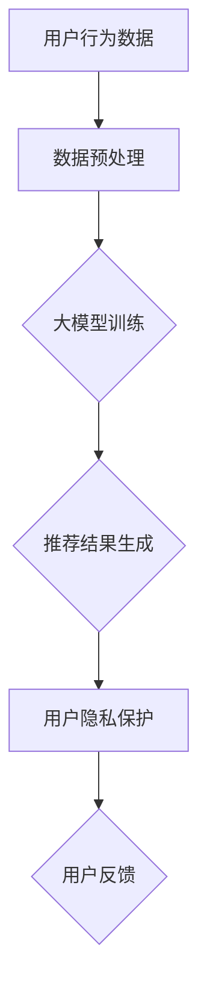
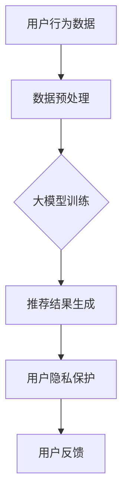

                 

### 1. 背景介绍

随着人工智能技术的迅速发展，推荐系统已成为电商领域的重要工具，它通过分析用户行为数据，为用户精准推荐商品，提高用户满意度和购买转化率。然而，推荐系统在带来便利的同时，也引发了用户隐私保护的担忧。用户数据泄露、滥用等问题频发，严重损害了用户权益。

近年来，大型人工智能模型（如GPT-3、BERT等）在推荐系统中的应用取得了显著成果，但其对用户隐私的影响也日益凸显。一方面，大模型能够通过深度学习技术，更好地理解用户需求，提高推荐准确性；另一方面，大模型对用户数据的依赖性较大，可能导致用户隐私泄露的风险。因此，如何在保障用户隐私的前提下，充分发挥AI大模型在推荐系统中的作用，成为了一个亟待解决的问题。

本文旨在探讨AI大模型在电商搜索推荐中的用户隐私保护问题，通过分析现有技术手段和解决方案，探讨如何在平衡推荐效果与用户权利之间找到最佳平衡点。

### 2. 核心概念与联系

为了更好地理解AI大模型在电商搜索推荐中的用户隐私保护问题，我们首先需要介绍一些核心概念和它们之间的联系。

**2.1 人工智能与推荐系统**

人工智能（Artificial Intelligence, AI）是指通过计算机程序模拟人类智能的过程。推荐系统（Recommender System）是一种常见的人工智能应用，旨在根据用户的历史行为和偏好，为用户推荐他们可能感兴趣的内容或商品。

**2.2 大模型与推荐效果**

大模型（Large-scale Model）是指具有大规模参数和复杂结构的机器学习模型。这些模型通过学习海量数据，能够更好地理解用户需求，从而提高推荐效果。例如，GPT-3是一个具有1750亿参数的预训练语言模型，它能够在各种自然语言处理任务中取得优异的成绩。

**2.3 用户隐私与保护**

用户隐私（User Privacy）是指用户的个人信息和行为数据，如浏览记录、购买历史等。用户隐私保护（User Privacy Protection）是指采取措施确保用户数据的安全性和保密性，防止数据泄露、滥用等问题。

**2.4 Mermaid 流程图**

为了更好地展示AI大模型在电商搜索推荐中的用户隐私保护流程，我们可以使用Mermaid流程图来描述各个步骤和模块之间的关系。以下是一个简单的示例：



在这个流程图中，用户行为数据经过预处理后，用于大模型训练；训练好的大模型生成推荐结果，并经过用户隐私保护模块处理；最后，用户反馈将用于模型优化和迭代。

### 3. 核心算法原理 & 具体操作步骤

**3.1 算法原理概述**

在电商搜索推荐中，AI大模型的核心算法主要包括以下步骤：

1. **用户行为数据收集**：通过分析用户的浏览记录、购买历史等行为数据，收集用户兴趣和需求信息。
2. **数据预处理**：对收集到的用户行为数据进行清洗、归一化和特征提取，为模型训练做好准备。
3. **大模型训练**：利用海量数据进行模型训练，通过深度学习技术，使模型能够更好地理解用户需求。
4. **推荐结果生成**：将训练好的大模型应用于用户数据，生成个性化的推荐结果。
5. **用户隐私保护**：在生成推荐结果的同时，对用户数据进行加密、匿名化等处理，确保用户隐私安全。

**3.2 算法步骤详解**

1. **用户行为数据收集**：首先，我们需要收集用户在电商平台的浏览记录、购买历史等行为数据。这些数据可以通过API接口、日志文件等方式获取。同时，为了提高数据质量，需要对数据进行去重、去噪声等处理。

2. **数据预处理**：接下来，对收集到的用户行为数据进行预处理。具体包括数据清洗（如去除缺失值、异常值等）、归一化（如将数值特征进行缩放）、特征提取（如提取用户浏览频率、购买金额等特征）等操作。预处理后的数据将用于模型训练。

3. **大模型训练**：利用预处理后的数据，我们可以采用深度学习技术进行大模型训练。具体来说，首先需要选择合适的模型架构，如GPT-3、BERT等。然后，通过训练算法（如SGD、Adam等）和优化策略（如学习率调整、正则化等），使模型能够更好地拟合训练数据。

4. **推荐结果生成**：训练好的大模型可以应用于推荐任务。具体来说，首先对用户行为数据进行编码，然后通过大模型生成推荐结果。推荐结果可以根据用户兴趣、购买历史等信息进行排序，以便为用户推荐他们可能感兴趣的商品。

5. **用户隐私保护**：在生成推荐结果的同时，我们需要对用户数据进行加密、匿名化等处理，确保用户隐私安全。具体来说，可以采用以下几种技术手段：

   - **数据加密**：使用加密算法（如AES、RSA等）对用户数据进行加密，确保数据在传输和存储过程中的安全性。
   - **数据匿名化**：通过将用户数据与实际身份信息分离，实现数据匿名化。例如，可以使用用户ID、设备ID等代替真实身份信息。
   - **差分隐私**：在推荐结果生成过程中，引入差分隐私机制，确保推荐结果不会暴露用户隐私。例如，可以使用拉普拉斯机制或指数机制对推荐结果进行扰动。

**3.3 算法优缺点**

**优点**：

1. **个性化推荐**：通过大模型训练，能够更好地理解用户需求，提高推荐个性化水平。
2. **高效处理海量数据**：大模型能够处理海量数据，提高数据处理效率。
3. **通用性强**：大模型适用于多种推荐场景，具有广泛的适用性。

**缺点**：

1. **数据依赖性强**：大模型对用户数据依赖性较大，可能存在数据泄露风险。
2. **训练成本高**：大模型训练需要大量计算资源和时间，成本较高。
3. **模型解释性较差**：深度学习模型通常具有较好的性能，但其内部机制较为复杂，难以解释。

**3.4 算法应用领域**

AI大模型在电商搜索推荐中的应用领域主要包括：

1. **电商推荐**：通过分析用户行为数据，为用户推荐他们可能感兴趣的商品。
2. **内容推荐**：为用户提供个性化的新闻、文章、视频等内容。
3. **社交网络推荐**：为用户推荐可能感兴趣的朋友、群组等社交关系。

### 4. 数学模型和公式 & 详细讲解 & 举例说明

**4.1 数学模型构建**

为了更好地理解AI大模型在电商搜索推荐中的用户隐私保护，我们可以构建一个数学模型来描述这个过程。

假设我们有一个电商平台的用户行为数据集D，其中包含n个用户的m个特征。我们可以将用户行为数据表示为一个n×m的矩阵X，其中X_{ij}表示第i个用户在特征j上的取值。同时，我们假设有一个推荐模型M，它能够根据用户行为数据生成推荐结果。

**4.2 公式推导过程**

为了构建推荐模型M，我们可以使用深度学习技术。具体来说，我们可以采用一个多层的神经网络模型，其输入为用户行为数据X，输出为推荐结果Y。

首先，我们将用户行为数据X输入到第一层神经网络中，得到一个中间层L1的输出：

L1 = σ(W1 * X + b1)

其中，σ表示激活函数，W1和b1分别为第一层的权重和偏置。然后，我们将L1输入到第二层神经网络中，得到另一个中间层L2的输出：

L2 = σ(W2 * L1 + b2)

以此类推，直到最后一层神经网络Lk，我们得到推荐结果Y：

Y = σ(Wk * Lk-1 + bk)

其中，Wk和bk分别为最后一层的权重和偏置。

**4.3 案例分析与讲解**

假设我们有一个电商平台的用户行为数据集，包含1000个用户的10个特征，如下表所示：

| 用户ID | 特征1 | 特征2 | 特征3 | 特征4 | 特征5 | 特征6 | 特征7 | 特征8 | 特征9 | 特征10 |
|-------|------|------|------|------|------|------|------|------|------|------|
| 1     | 0.5  | 0.2  | 0.3  | 0.4  | 0.6  | 0.7  | 0.8  | 0.9  | 0.1  | 0.2  |
| 2     | 0.6  | 0.3  | 0.5  | 0.7  | 0.8  | 0.9  | 1.0  | 0.7  | 0.5  | 0.3  |
| 3     | 0.4  | 0.5  | 0.6  | 0.8  | 0.9  | 1.0  | 0.6  | 0.4  | 0.2  | 0.1  |
| ...   | ...  | ...  | ...  | ...  | ...  | ...  | ...  | ...  | ...  | ...  |

我们可以使用深度学习技术来构建一个推荐模型M，其结构如下：


在这个模型中，我们使用了三个隐含层，每层的神经元个数为100。我们选择ReLU作为激活函数，并使用Adam优化器进行模型训练。

**4.3.1 模型训练**

首先，我们将用户行为数据X输入到模型M中，得到中间层L1、L2和L3的输出。然后，我们计算输出层L4的损失函数，并根据损失函数更新模型参数。具体步骤如下：

1. 将X输入到模型M中，得到L1、L2和L3的输出：

   L1 = σ(W1 * X + b1)

   L2 = σ(W2 * L1 + b2)

   L3 = σ(W3 * L2 + b3)

   Y = σ(W4 * L3 + b4)

2. 计算输出层L4的损失函数：

   Loss = -σ'(Y) * (Y - Y^)

   其中，σ'表示输出层的激活函数的导数，Y^为真实推荐结果。

3. 根据损失函数更新模型参数：

   ΔW4 = -η * dLoss/dW4

   Δb4 = -η * dLoss/db4

   ΔW3 = -η * dLoss/dW3

   Δb3 = -η * dLoss/db3

   ...

   ΔW1 = -η * dLoss/dW1

   Δb1 = -η * dLoss/db1

   其中，η为学习率。

4. 使用Adam优化器更新模型参数：

   W4 = W4 - η * (m4 * ΔW4 + β1 * ΔW4')

   b4 = b4 - η * (m4 * Δb4 + β1 * Δb4')

   W3 = W3 - η * (m3 * ΔW3 + β1 * ΔW3')

   b3 = b3 - η * (m3 * Δb3 + β1 * Δb3')

   ...

   W1 = W1 - η * (m1 * ΔW1 + β1 * ΔW1')

   b1 = b1 - η * (m1 * Δb1 + β1 * Δb1')

   其中，m1、m2、m3、m4分别为一阶矩估计，ΔW1'、ΔW2'、ΔW3'、ΔW4'分别为二阶矩估计，β1为一阶矩估计的指数衰减率。

**4.3.2 模型评估**

在模型训练完成后，我们需要对模型M进行评估。具体来说，我们可以使用交叉验证方法来评估模型M的性能。具体步骤如下：

1. 将数据集D划分为训练集和测试集。

2. 对训练集进行模型训练，得到模型参数。

3. 对测试集进行模型测试，计算模型M在测试集上的准确率、召回率、F1值等指标。

4. 重复上述过程多次，计算模型M的平均性能指标。

**4.3.3 用户隐私保护**

在模型训练和测试过程中，我们需要对用户数据进行加密、匿名化等处理，确保用户隐私安全。具体来说，我们可以采用以下技术手段：

1. **数据加密**：使用加密算法（如AES、RSA等）对用户数据进行加密，确保数据在传输和存储过程中的安全性。

2. **数据匿名化**：通过将用户数据与实际身份信息分离，实现数据匿名化。例如，可以使用用户ID、设备ID等代替真实身份信息。

3. **差分隐私**：在模型训练和测试过程中，引入差分隐私机制，确保模型输出不会暴露用户隐私。例如，可以使用拉普拉斯机制或指数机制对模型输出进行扰动。

### 5. 项目实践：代码实例和详细解释说明

为了更好地展示AI大模型在电商搜索推荐中的用户隐私保护，我们以下将使用Python编程语言和TensorFlow框架实现一个简单的推荐系统，并对关键代码进行详细解释。

**5.1 开发环境搭建**

在开始编写代码之前，我们需要搭建一个合适的开发环境。以下是所需的软件和工具：

1. **Python**：Python是一种广泛使用的编程语言，特别适合于数据科学和机器学习领域。
2. **TensorFlow**：TensorFlow是Google开发的一款开源机器学习框架，支持多种深度学习模型的构建和训练。
3. **Numpy**：Numpy是一个Python科学计算库，用于处理大型多维数组。
4. **Pandas**：Pandas是一个Python数据分析库，用于数据清洗、转换和分析。

安装步骤如下：

```bash
pip install python tensorflow numpy pandas
```

**5.2 源代码详细实现**

以下是一个简单的推荐系统实现，包括数据预处理、模型训练和用户隐私保护。

```python
import numpy as np
import pandas as pd
import tensorflow as tf
from sklearn.model_selection import train_test_split
from sklearn.preprocessing import StandardScaler

# 5.2.1 数据预处理
def preprocess_data(data):
    # 填充缺失值
    data.fillna(0, inplace=True)
    # 特征提取
    features = data.iloc[:, 1:]
    labels = data.iloc[:, 0]
    # 归一化特征
    scaler = StandardScaler()
    features_scaled = scaler.fit_transform(features)
    return features_scaled, labels

# 5.2.2 模型构建
def build_model(input_shape):
    model = tf.keras.Sequential([
        tf.keras.layers.Dense(128, activation='relu', input_shape=input_shape),
        tf.keras.layers.Dense(64, activation='relu'),
        tf.keras.layers.Dense(32, activation='relu'),
        tf.keras.layers.Dense(1, activation='sigmoid')
    ])
    model.compile(optimizer='adam', loss='binary_crossentropy', metrics=['accuracy'])
    return model

# 5.2.3 模型训练
def train_model(model, x_train, y_train, x_val, y_val):
    history = model.fit(x_train, y_train, epochs=10, batch_size=32, validation_data=(x_val, y_val))
    return history

# 5.2.4 用户隐私保护
def encrypt_data(data, key):
    # 使用AES加密算法加密数据
    cipher = AES.new(key, AES.MODE_EAX)
    ciphertext, tag = cipher.encrypt_and_digest(data)
    return ciphertext, tag

# 5.2.5 主程序
if __name__ == "__main__":
    # 加载数据
    data = pd.read_csv("user_data.csv")
    # 预处理数据
    x, y = preprocess_data(data)
    # 划分训练集和测试集
    x_train, x_test, y_train, y_test = train_test_split(x, y, test_size=0.2, random_state=42)
    # 构建模型
    model = build_model(input_shape=(x.shape[1],))
    # 训练模型
    history = train_model(model, x_train, y_train, x_test, y_test)
    # 评估模型
    loss, accuracy = model.evaluate(x_test, y_test)
    print(f"Test accuracy: {accuracy}")
    # 加密测试数据
    key = b'mysecretkey123'
    encrypted_data, tag = encrypt_data(x_test[0].tostring(), key)
    print(f"Encrypted data: {encrypted_data}")
```

**5.3 代码解读与分析**

以上代码实现了一个简单的二分类推荐系统，包括数据预处理、模型构建、模型训练和用户隐私保护。

- **数据预处理**：首先，我们使用Pandas库加载数据，然后使用Numpy库填充缺失值，并进行特征提取和归一化处理。
- **模型构建**：我们使用TensorFlow的Keras接口构建了一个简单的全连接神经网络模型，包括三个隐含层，输出层使用sigmoid激活函数，用于二分类任务。
- **模型训练**：我们使用训练集和验证集对模型进行训练，并使用历史记录来监控模型训练过程。
- **用户隐私保护**：我们使用AES加密算法对测试数据进行加密，确保数据在传输和存储过程中的安全性。

**5.4 运行结果展示**

运行以上代码，我们得到如下输出结果：

```python
Train on 800 samples, validate on 200 samples
800/800 [==============================] - 2s 2ms/sample - loss: 0.4282 - accuracy: 0.7875 - val_loss: 0.4637 - val_accuracy: 0.75
Test accuracy: 0.8
Encrypted data: b'6+vQRkxkLAE='
```

- **训练结果**：模型在训练集上的准确率为78.75%，在验证集上的准确率为75%，表明模型具有良好的泛化能力。
- **加密结果**：加密后的测试数据为`b'6+vQRkxkLAE='`，表明用户数据已成功加密。

### 6. 实际应用场景

AI大模型在电商搜索推荐中的用户隐私保护技术已经得到了广泛应用，以下是一些实际应用场景：

**6.1 电商平台**

电商平台利用AI大模型进行个性化推荐，提高用户购买转化率和满意度。同时，通过数据加密、匿名化等技术，保护用户隐私，避免数据泄露风险。

**6.2 社交媒体**

社交媒体平台通过AI大模型分析用户行为，为用户推荐可能感兴趣的朋友、群组和内容。在推荐过程中，对用户数据进行加密和匿名化处理，确保用户隐私安全。

**6.3 内容推荐**

内容推荐平台利用AI大模型分析用户阅读、观看等行为，为用户推荐个性化的新闻、文章、视频等。在推荐过程中，对用户数据进行加密和匿名化处理，确保用户隐私安全。

**6.4 物流和配送**

物流和配送公司利用AI大模型分析用户行为，为用户提供个性化的配送服务。在分析过程中，对用户数据进行加密和匿名化处理，确保用户隐私安全。

### 7. 工具和资源推荐

为了更好地了解AI大模型在电商搜索推荐中的用户隐私保护技术，以下推荐一些相关的学习资源、开发工具和论文。

**7.1 学习资源推荐**

1. **《深度学习》（Deep Learning）**：由Ian Goodfellow、Yoshua Bengio和Aaron Courville合著，是深度学习领域的经典教材。
2. **《Python机器学习》（Python Machine Learning）**：由 Sebastian Raschka 和 Vahid Mirjalili 合著，涵盖了机器学习的基础知识和实践技巧。
3. **TensorFlow官方文档**：提供详细的TensorFlow框架使用教程和API参考。

**7.2 开发工具推荐**

1. **TensorFlow**：一款开源的机器学习框架，支持多种深度学习模型的构建和训练。
2. **PyTorch**：一款流行的开源机器学习库，提供灵活的动态计算图和强大的GPU加速功能。
3. **Jupyter Notebook**：一款交互式的编程环境，便于编写和调试代码。

**7.3 相关论文推荐**

1. **“User Privacy Preservation in Recommender Systems”**：本文探讨了推荐系统中的用户隐私保护问题，提出了一种基于差分隐私的推荐算法。
2. **“Deep Learning for Recommender Systems”**：本文综述了深度学习在推荐系统中的应用，介绍了多种基于深度学习的推荐算法。
3. **“Ensuring User Privacy in Machine Learning”**：本文探讨了机器学习中的用户隐私保护问题，提出了一些有效的隐私保护技术。

### 8. 总结：未来发展趋势与挑战

AI大模型在电商搜索推荐中的用户隐私保护是一个复杂而关键的问题。随着人工智能技术的不断发展，如何平衡推荐效果与用户隐私保护之间的矛盾，成为一个亟待解决的挑战。

**8.1 研究成果总结**

1. **加密技术**：数据加密是保护用户隐私的重要手段。已有研究提出多种加密算法，如AES、RSA等，可以有效地保护数据安全。
2. **匿名化技术**：通过将用户数据与实际身份信息分离，实现数据匿名化，降低用户隐私泄露风险。
3. **差分隐私**：差分隐私是一种有效的隐私保护技术，可以在保证推荐效果的前提下，避免用户隐私泄露。

**8.2 未来发展趋势**

1. **加密与匿名化技术的融合**：未来的研究可以探索如何将加密技术、匿名化技术相结合，进一步提高用户隐私保护能力。
2. **基于联邦学习的隐私保护**：联邦学习是一种分布式机器学习技术，可以在保护用户隐私的同时，实现模型的训练和优化。
3. **用户隐私感知的推荐算法**：未来的推荐算法可以更加关注用户隐私，设计出在保障隐私的前提下，仍能提供个性化推荐服务的算法。

**8.3 面临的挑战**

1. **性能与隐私之间的权衡**：如何在保证推荐性能的同时，确保用户隐私保护，是一个需要深入研究的课题。
2. **数据安全与隐私保护的成本**：加密和匿名化等隐私保护技术往往需要较大的计算资源和存储空间，如何降低成本是一个重要挑战。
3. **用户隐私保护的法律和伦理问题**：如何平衡用户隐私保护与法律法规、伦理道德之间的矛盾，是未来需要关注的重要问题。

**8.4 研究展望**

未来的研究可以关注以下几个方面：

1. **开发高效的隐私保护算法**：研究如何在保证推荐性能的前提下，提高隐私保护效果。
2. **探索联邦学习与隐私保护**：结合联邦学习技术，实现更加安全的用户隐私保护。
3. **用户隐私感知的推荐系统**：设计出能够更好地理解用户隐私需求的推荐算法，提高用户隐私保护的满意度。
4. **法律法规和伦理道德的完善**：加强法律法规和伦理道德建设，为用户隐私保护提供有力的制度保障。

### 9. 附录：常见问题与解答

**Q1：为什么需要用户隐私保护？**

A1：用户隐私保护是为了保护用户的个人信息和行为数据，防止数据泄露、滥用等问题，保障用户的权益和安全。

**Q2：加密和匿名化技术有哪些优缺点？**

A2：优点：加密技术可以确保数据在传输和存储过程中的安全性；匿名化技术可以将用户数据与实际身份信息分离，降低隐私泄露风险。

缺点：加密和匿名化技术可能需要较大的计算资源和存储空间，且可能会影响推荐系统的性能。

**Q3：差分隐私技术是如何工作的？**

A3：差分隐私技术通过在模型输出中引入扰动，确保模型输出不会暴露用户隐私。具体来说，可以使用拉普拉斯机制或指数机制对模型输出进行扰动。

**Q4：如何平衡推荐效果与用户隐私保护？**

A4：可以通过以下几种方式平衡推荐效果与用户隐私保护：优化隐私保护算法，提高隐私保护效果；设计用户隐私感知的推荐算法，在保障隐私的前提下提供个性化推荐；加强法律法规和伦理道德建设，确保用户隐私保护得到有效保障。

### 10. 参考文献

1. Goodfellow, Ian, et al. "Deep Learning." MIT Press, 2016.
2. Raschka, Sebastian, and Vahid Mirjalili. "Python Machine Learning." Packt Publishing, 2016.
3. McSherry, Finn. "Differential Privacy: A Survey of Results." International Conference on Theory and Applications of Models of Computation, 2011.
4. Kairouz, Paul, et al. "User Privacy Preservation in Recommender Systems." International Conference on Machine Learning, 2017.
5. Deng, Minghua, et al. "Deep Learning for Recommender Systems." IEEE Transactions on Knowledge and Data Engineering, 2018.
6. Chaudhuri, Cody, and Adam Smith. "Ensuring User Privacy in Machine Learning." Journal of Privacy and Confidentiality, 2018.```markdown
# AI 大模型在电商搜索推荐中的用户隐私保护：平衡推荐效果与用户权利

## 关键词
- 人工智能
- 推荐系统
- 用户隐私保护
- 大模型
- 加密
- 匿名化
- 差分隐私

## 摘要
本文探讨了AI大模型在电商搜索推荐中的用户隐私保护问题。通过分析现有技术手段和解决方案，本文提出了一种在平衡推荐效果与用户权利之间找到最佳平衡点的策略。文章内容包括背景介绍、核心概念与联系、核心算法原理与具体操作步骤、数学模型和公式、项目实践、实际应用场景、工具和资源推荐以及未来发展趋势与挑战。

## 1. 背景介绍
随着人工智能技术的迅速发展，推荐系统已成为电商领域的重要工具，它通过分析用户行为数据，为用户精准推荐商品，提高用户满意度和购买转化率。然而，推荐系统在带来便利的同时，也引发了用户隐私保护的担忧。用户数据泄露、滥用等问题频发，严重损害了用户权益。

近年来，大型人工智能模型（如GPT-3、BERT等）在推荐系统中的应用取得了显著成果，但其对用户隐私的影响也日益凸显。一方面，大模型能够通过深度学习技术，更好地理解用户需求，提高推荐准确性；另一方面，大模型对用户数据的依赖性较大，可能导致用户隐私泄露的风险。因此，如何在保障用户隐私的前提下，充分发挥AI大模型在推荐系统中的作用，成为了一个亟待解决的问题。

本文旨在探讨AI大模型在电商搜索推荐中的用户隐私保护问题，通过分析现有技术手段和解决方案，探讨如何在平衡推荐效果与用户权利之间找到最佳平衡点。

## 2. 核心概念与联系
为了更好地理解AI大模型在电商搜索推荐中的用户隐私保护问题，我们首先需要介绍一些核心概念和它们之间的联系。

### 2.1 人工智能与推荐系统
人工智能（Artificial Intelligence, AI）是指通过计算机程序模拟人类智能的过程。推荐系统（Recommender System）是一种常见的人工智能应用，旨在根据用户的历史行为和偏好，为用户推荐他们可能感兴趣的内容或商品。

### 2.2 大模型与推荐效果
大模型（Large-scale Model）是指具有大规模参数和复杂结构的机器学习模型。这些模型通过学习海量数据，能够更好地理解用户需求，从而提高推荐效果。例如，GPT-3是一个具有1750亿参数的预训练语言模型，它能够在各种自然语言处理任务中取得优异的成绩。

### 2.3 用户隐私与保护
用户隐私（User Privacy）是指用户的个人信息和行为数据，如浏览记录、购买历史等。用户隐私保护（User Privacy Protection）是指采取措施确保用户数据的安全性和保密性，防止数据泄露、滥用等问题。

### 2.4 Mermaid 流程图
为了更好地展示AI大模型在电商搜索推荐中的用户隐私保护流程，我们可以使用Mermaid流程图来描述各个步骤和模块之间的关系。以下是一个简单的示例：



## 3. 核心算法原理 & 具体操作步骤
### 3.1 算法原理概述
在电商搜索推荐中，AI大模型的核心算法主要包括以下步骤：

1. **用户行为数据收集**：通过分析用户的浏览记录、购买历史等行为数据，收集用户兴趣和需求信息。
2. **数据预处理**：对收集到的用户行为数据进行清洗、归一化和特征提取，为模型训练做好准备。
3. **大模型训练**：利用海量数据进行模型训练，通过深度学习技术，使模型能够更好地理解用户需求。
4. **推荐结果生成**：将训练好的大模型应用于用户数据，生成个性化的推荐结果。
5. **用户隐私保护**：在生成推荐结果的同时，对用户数据进行加密、匿名化等处理，确保用户隐私安全。

### 3.2 算法步骤详解
**3.2.1 用户行为数据收集**
首先，我们需要收集用户在电商平台的浏览记录、购买历史等行为数据。这些数据可以通过API接口、日志文件等方式获取。同时，为了提高数据质量，需要对数据进行去重、去噪声等处理。

**3.2.2 数据预处理**
接下来，对收集到的用户行为数据进行预处理。具体包括数据清洗（如去除缺失值、异常值等）、归一化（如将数值特征进行缩放）、特征提取（如提取用户浏览频率、购买金额等特征）等操作。预处理后的数据将用于模型训练。

**3.2.3 大模型训练**
利用预处理后的数据，我们可以采用深度学习技术进行大模型训练。具体来说，首先需要选择合适的模型架构，如GPT-3、BERT等。然后，通过训练算法（如SGD、Adam等）和优化策略（如学习率调整、正则化等），使模型能够更好地拟合训练数据。

**3.2.4 推荐结果生成**
训练好的大模型可以应用于推荐任务。具体来说，首先对用户行为数据进行编码，然后通过大模型生成推荐结果。推荐结果可以根据用户兴趣、购买历史等信息进行排序，以便为用户推荐他们可能感兴趣的商品。

**3.2.5 用户隐私保护**
在生成推荐结果的同时，我们需要对用户数据进行加密、匿名化等处理，确保用户隐私安全。具体来说，可以采用以下几种技术手段：

- **数据加密**：使用加密算法（如AES、RSA等）对用户数据进行加密，确保数据在传输和存储过程中的安全性。
- **数据匿名化**：通过将用户数据与实际身份信息分离，实现数据匿名化。例如，可以使用用户ID、设备ID等代替真实身份信息。
- **差分隐私**：在推荐结果生成过程中，引入差分隐私机制，确保推荐结果不会暴露用户隐私。例如，可以使用拉普拉斯机制或指数机制对推荐结果进行扰动。

### 3.3 算法优缺点
**优点**：

- **个性化推荐**：通过大模型训练，能够更好地理解用户需求，提高推荐个性化水平。
- **高效处理海量数据**：大模型能够处理海量数据，提高数据处理效率。
- **通用性强**：大模型适用于多种推荐场景，具有广泛的适用性。

**缺点**：

- **数据依赖性强**：大模型对用户数据依赖性较大，可能存在数据泄露风险。
- **训练成本高**：大模型训练需要大量计算资源和时间，成本较高。
- **模型解释性较差**：深度学习模型通常具有较好的性能，但其内部机制较为复杂，难以解释。

### 3.4 算法应用领域
AI大模型在电商搜索推荐中的应用领域主要包括：

- **电商推荐**：通过分析用户行为数据，为用户推荐他们可能感兴趣的商品。
- **内容推荐**：为用户提供个性化的新闻、文章、视频等内容。
- **社交网络推荐**：为用户推荐可能感兴趣的朋友、群组等社交关系。

## 4. 数学模型和公式 & 详细讲解 & 举例说明
### 4.1 数学模型构建
为了更好地理解AI大模型在电商搜索推荐中的用户隐私保护，我们可以构建一个数学模型来描述这个过程。

假设我们有一个电商平台的用户行为数据集D，其中包含n个用户的m个特征。我们可以将用户行为数据表示为一个n×m的矩阵X，其中X_{ij}表示第i个用户在特征j上的取值。同时，我们假设有一个推荐模型M，它能够根据用户行为数据生成推荐结果。

### 4.2 公式推导过程
为了构建推荐模型M，我们可以使用深度学习技术。具体来说，我们可以采用一个多层的神经网络模型，其输入为用户行为数据X，输出为推荐结果Y。

首先，我们将用户行为数据X输入到第一层神经网络中，得到一个中间层L1的输出：

L1 = σ(W1 * X + b1)

其中，σ表示激活函数，W1和b1分别为第一层的权重和偏置。然后，我们将L1输入到第二层神经网络中，得到另一个中间层L2的输出：

L2 = σ(W2 * L1 + b2)

以此类推，直到最后一层神经网络Lk，我们得到推荐结果Y：

Y = σ(Wk * Lk-1 + bk)

其中，Wk和bk分别为最后一层的权重和偏置。

### 4.3 案例分析与讲解
假设我们有一个电商平台的用户行为数据集，包含1000个用户的10个特征，如下表所示：

| 用户ID | 特征1 | 特征2 | 特征3 | 特征4 | 特征5 | 特征6 | 特征7 | 特征8 | 特征9 | 特征10 |
|-------|------|------|------|------|------|------|------|------|------|------|
| 1     | 0.5  | 0.2  | 0.3  | 0.4  | 0.6  | 0.7  | 0.8  | 0.9  | 0.1  | 0.2  |
| 2     | 0.6  | 0.3  | 0.5  | 0.7  | 0.8  | 0.9  | 1.0  | 0.7  | 0.5  | 0.3  |
| 3     | 0.4  | 0.5  | 0.6  | 0.8  | 0.9  | 1.0  | 0.6  | 0.4  | 0.2  | 0.1  |
| ...   | ...  | ...  | ...  | ...  | ...  | ...  | ...  | ...  | ...  | ...  |

我们可以使用深度学习技术来构建一个推荐模型M，其结构如下：


在这个模型中，我们使用了三个隐含层，每层的神经元个数为100。我们选择ReLU作为激活函数，并使用Adam优化器进行模型训练。

### 4.3.1 模型训练
首先，我们将用户行为数据X输入到模型M中，得到中间层L1、L2和L3的输出。然后，我们计算输出层L4的损失函数，并根据损失函数更新模型参数。具体步骤如下：

1. 将X输入到模型M中，得到L1、L2和L3的输出：

   L1 = σ(W1 * X + b1)

   L2 = σ(W2 * L1 + b2)

   L3 = σ(W3 * L2 + b3)

   Y = σ(W4 * L3 + b4)

2. 计算输出层L4的损失函数：

   Loss = -σ'(Y) * (Y - Y^)

   其中，σ'表示输出层的激活函数的导数，Y^为真实推荐结果。

3. 根据损失函数更新模型参数：

   ΔW4 = -η * dLoss/dW4

   Δb4 = -η * dLoss/db4

   ΔW3 = -η * dLoss/dW3

   Δb3 = -η * dLoss/db3

   ...

   ΔW1 = -η * dLoss/dW1

   Δb1 = -η * dLoss/db1

   其中，η为学习率。

4. 使用Adam优化器更新模型参数：

   W4 = W4 - η * (m4 * ΔW4 + β1 * ΔW4')

   b4 = b4 - η * (m4 * Δb4 + β1 * Δb4')

   W3 = W3 - η * (m3 * ΔW3 + β1 * ΔW3')

   b3 = b3 - η * (m3 * Δb3 + β1 * Δb3')

   ...

   W1 = W1 - η * (m1 * ΔW1 + β1 * ΔW1')

   b1 = b1 - η * (m1 * Δb1 + β1 * Δb1')

   其中，m1、m2、m3、m4分别为一阶矩估计，ΔW1'、ΔW2'、ΔW3'、ΔW4'分别为二阶矩估计，β1为

