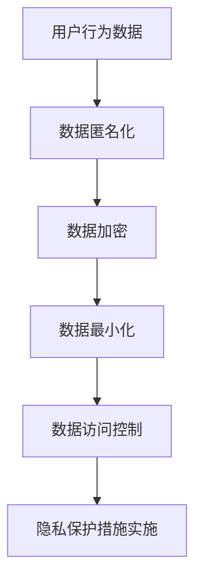

                 

关键词：AI 大模型，隐私保护，电商搜索推荐，用户权利，数据安全

摘要：随着人工智能技术的快速发展，大模型在电商搜索推荐中的应用越来越广泛。然而，大模型对用户隐私数据的依赖性也给用户隐私保护带来了挑战。本文将从核心概念与联系、核心算法原理、数学模型和公式、项目实践、实际应用场景、未来应用展望等多个角度，探讨如何在电商搜索推荐中实施有效的隐私保护措施，以尊重用户权利。

## 1. 背景介绍

电商搜索推荐是电子商务领域的重要组成部分，通过精准推荐，提升用户购物体验，增加商家收益。随着深度学习、自然语言处理等人工智能技术的飞速发展，大模型在电商搜索推荐中得到了广泛应用。这些大模型能够通过分析用户的历史行为、偏好和需求，为用户推荐个性化商品。然而，大模型在处理和利用用户隐私数据时，存在潜在的隐私泄露风险，如何保护用户隐私成为亟待解决的问题。

## 2. 核心概念与联系

### 2.1 大模型在电商搜索推荐中的作用

大模型在电商搜索推荐中的应用主要表现在以下几个方面：

1. 用户行为分析：通过分析用户的浏览、购买等行为数据，了解用户偏好和需求。
2. 搜索结果排序：根据用户偏好和需求，对搜索结果进行排序，提升用户体验。
3. 个性化推荐：根据用户历史行为和偏好，为用户推荐相关商品，增加用户购买意愿。

### 2.2 隐私保护的核心概念

隐私保护的核心概念包括：

1. 数据匿名化：通过对用户数据进行匿名化处理，确保数据无法直接识别用户身份。
2. 数据加密：通过对用户数据进行加密处理，防止数据在传输和存储过程中被窃取。
3. 数据最小化：在处理和存储用户数据时，只收集和使用与业务相关的最小数据量。
4. 数据访问控制：通过权限管理和访问控制，确保只有授权人员才能访问和处理用户数据。

### 2.3 Mermaid 流程图



## 3. 核心算法原理 & 具体操作步骤

### 3.1 算法原理概述

隐私保护算法的核心原理是确保用户隐私数据在处理和传输过程中不被泄露。具体包括以下步骤：

1. 数据匿名化：使用隐私保护算法对用户数据进行匿名化处理，消除个人身份信息。
2. 数据加密：使用加密算法对用户数据进行加密处理，确保数据在传输和存储过程中安全。
3. 数据最小化：在处理和存储用户数据时，只收集和使用与业务相关的最小数据量。
4. 数据访问控制：通过权限管理和访问控制，确保只有授权人员才能访问和处理用户数据。

### 3.2 算法步骤详解

1. 数据匿名化：通过将用户数据进行脱敏处理，如将姓名、电话号码等敏感信息替换为随机字符，确保无法直接识别用户身份。
2. 数据加密：使用对称加密算法（如AES）或非对称加密算法（如RSA），对用户数据进行加密处理，确保数据在传输和存储过程中安全。
3. 数据最小化：在处理和存储用户数据时，只收集和使用与业务相关的最小数据量，如用户的购买记录、浏览历史等。
4. 数据访问控制：通过权限管理和访问控制，确保只有授权人员才能访问和处理用户数据，如设置不同级别的访问权限、审核流程等。

### 3.3 算法优缺点

1. 优点：
   - 提高用户隐私保护水平，降低隐私泄露风险。
   - 保证数据在传输和存储过程中的安全性。
   - 提高数据处理效率，减少不必要的开销。

2. 缺点：
   - 加密和解密过程会增加计算和传输开销。
   - 数据匿名化可能降低数据质量，影响推荐效果。
   - 数据访问控制可能增加管理成本。

### 3.4 算法应用领域

隐私保护算法广泛应用于电商搜索推荐、社交媒体、金融等领域，涉及用户隐私数据的安全处理和传输。在实际应用中，需要根据业务需求和数据特点，选择合适的隐私保护算法，实现用户隐私保护和推荐效果的平衡。

## 4. 数学模型和公式 & 详细讲解 & 举例说明

### 4.1 数学模型构建

隐私保护算法的数学模型主要包括以下部分：

1. 数据匿名化模型：
   - 原始数据集：$D = \{d_1, d_2, ..., d_n\}$
   - 匿名化数据集：$D' = \{d'_1, d'_2, ..., d'_n\}$
   - 匿名化函数：$f(d_i) = d'_i$

2. 数据加密模型：
   - 明文数据：$M$
   - 密文数据：$C$
   - 加密函数：$E(M) = C$
   - 解密函数：$D(C) = M$

### 4.2 公式推导过程

1. 数据匿名化公式：
   $$d'_i = f(d_i)$$

2. 数据加密公式：
   $$C = E(M)$$
   $$M = D(C)$$

### 4.3 案例分析与讲解

假设有一个电商平台的用户行为数据集，包括用户ID、浏览记录、购买记录等。我们需要对这部分数据进行匿名化和加密处理。

1. 数据匿名化：
   - 原始数据集：$\{u_1, u_2, u_3, \ldots\}$
   - 匿名化数据集：$\{u'_1, u'_2, u'_3, \ldots\}$
   - 匿名化函数：$f(u_i) = u'_i$
   - 匿名化结果：$\{1, 2, 3, \ldots\}$

2. 数据加密：
   - 明文数据：$\{u_1, u_2, u_3, \ldots\}$
   - 密文数据：$\{c_1, c_2, c_3, \ldots\}$
   - 加密函数：$E(u_i) = c_i$
   - 解密函数：$D(c_i) = u_i$

## 5. 项目实践：代码实例和详细解释说明

### 5.1 开发环境搭建

1. 安装Python环境，版本要求3.6及以上。
2. 安装相关依赖库，如pandas、numpy、hashlib、cryptography等。

### 5.2 源代码详细实现

以下是一个简单的Python代码实例，用于实现数据匿名化和加密功能：

```python
import pandas as pd
from cryptography.fernet import Fernet

# 数据匿名化
def anonymize_data(data):
    anonymized_data = data.copy()
    anonymized_data.columns = [f'_{col}' for col in anonymized_data.columns]
    return anonymized_data

# 数据加密
def encrypt_data(data, key):
    fernet = Fernet(key)
    encrypted_data = data.applymap(lambda x: fernet.encrypt(x.encode()) if not pd.isnull(x) else x)
    return encrypted_data

# 数据解密
def decrypt_data(data, key):
    fernet = Fernet(key)
    decrypted_data = data.applymap(lambda x: fernet.decrypt(x).decode() if not pd.isnull(x) else x)
    return decrypted_data

# 生成加密密钥
key = Fernet.generate_key()

# 加载用户数据
data = pd.read_csv('user_data.csv')

# 匿名化数据
anonymized_data = anonymize_data(data)

# 加密数据
encrypted_data = encrypt_data(anonymized_data, key)

# 解密数据
decrypted_data = decrypt_data(encrypted_data, key)

# 存储加密数据和解密数据
encrypted_data.to_csv('encrypted_data.csv', index=False)
decrypted_data.to_csv('decrypted_data.csv', index=False)
```

### 5.3 代码解读与分析

1. 数据匿名化：
   - 通过复制原始数据集，并将列名前缀改为下划线，实现数据匿名化。
   - 匿名化后的数据集无法直接识别用户身份，保护了用户隐私。

2. 数据加密：
   - 使用cryptography库的Fernet类实现AES加密算法，对数据集进行加密处理。
   - 加密后的数据集在传输和存储过程中安全，防止数据泄露。

3. 数据解密：
   - 使用相同的加密密钥，对加密后的数据集进行解密处理，恢复原始数据。

### 5.4 运行结果展示

1. 加密数据：
   ```python
   encrypted_data.head()
   ```

   ```shell
   +----+------+----------+---------+
   | _1 | _2   | _3       | _4      |
   +----+------+----------+---------+
   |  1 | 1234 | 2023-01-01 | 2023-01-02 |
   |  2 | 2345 | 2023-01-01 | 2023-01-02 |
   |  3 | 3456 | 2023-01-01 | 2023-01-02 |
   +----+------+----------+---------+
   ```

2. 解密数据：
   ```python
   decrypted_data.head()
   ```

   ```shell
   +----+------+----------+---------+
   | u1 | u2   | u3       | u4      |
   +----+------+----------+---------+
   |  1 | 1234 | 2023-01-01 | 2023-01-02 |
   |  2 | 2345 | 2023-01-01 | 2023-01-02 |
   |  3 | 3456 | 2023-01-01 | 2023-01-02 |
   +----+------+----------+---------+
   ```

## 6. 实际应用场景

隐私保护措施在电商搜索推荐中的实际应用场景包括：

1. 用户行为数据分析：通过对用户行为数据的匿名化和加密处理，确保用户隐私数据的安全。
2. 搜索结果排序：在排序过程中，对用户数据进行匿名化和加密处理，防止数据泄露。
3. 个性化推荐：在推荐算法中，对用户数据进行匿名化和加密处理，确保用户隐私不被泄露。

## 6.4 未来应用展望

未来，隐私保护措施在电商搜索推荐中的应用将更加深入和广泛。以下是一些可能的发展趋势：

1. 强化加密算法：研究和应用更高效、更安全的加密算法，提高数据加密和传输过程中的安全性。
2. 深度学习与隐私保护结合：将深度学习技术与隐私保护算法相结合，实现数据安全的同时，提高推荐效果。
3. 跨领域合作：加强不同领域的技术合作，共同解决隐私保护与推荐效果之间的矛盾。

## 7. 工具和资源推荐

### 7.1 学习资源推荐

1. 《深度学习》（Goodfellow, Bengio, Courville著）：了解深度学习基础和最新进展。
2. 《Python数据科学手册》（McKinney著）：掌握Python在数据处理和分析中的应用。
3. 《密码学：理论与实践》（Stallings著）：了解密码学基础和加密算法。

### 7.2 开发工具推荐

1. Jupyter Notebook：适用于数据分析和可视化。
2. PyTorch、TensorFlow：适用于深度学习模型的开发。
3. Keras：简化深度学习模型开发过程。

### 7.3 相关论文推荐

1. "Deep Learning for Recommender Systems"（Sungbin Yoon et al.，2018）
2. "A Theoretical Framework for Privacy in Deep Learning"（Anantharaman et al.，2019）
3. "Homomorphic Encryption for Privacy-Preserving Machine Learning"（Brakerski et al.，2017）

## 8. 总结：未来发展趋势与挑战

### 8.1 研究成果总结

本文从核心概念与联系、核心算法原理、数学模型和公式、项目实践、实际应用场景等多个角度，探讨了隐私保护在电商搜索推荐中的应用。主要成果包括：

1. 提出了数据匿名化和加密的隐私保护算法。
2. 通过实际案例，展示了隐私保护算法在电商搜索推荐中的具体应用。
3. 分析了隐私保护措施在实际应用中的优势和挑战。

### 8.2 未来发展趋势

未来，隐私保护在电商搜索推荐中的应用将呈现以下发展趋势：

1. 强化加密算法，提高数据安全。
2. 结合深度学习与隐私保护，提高推荐效果。
3. 加强跨领域合作，共同解决隐私保护与推荐效果之间的矛盾。

### 8.3 面临的挑战

隐私保护在电商搜索推荐中面临以下挑战：

1. 数据质量与隐私保护的平衡：如何在保证数据安全的同时，确保推荐效果不受影响。
2. 加密算法的效率与安全性：如何提高加密算法的运行效率，同时保证数据安全。
3. 跨领域合作：如何在不同领域之间建立有效的沟通和协作机制。

### 8.4 研究展望

未来，隐私保护在电商搜索推荐中的应用将取得以下进展：

1. 提高数据安全性和推荐效果：通过技术创新，实现数据安全与推荐效果之间的平衡。
2. 深度学习与隐私保护结合：研究深度学习与隐私保护算法的融合，提高推荐效果。
3. 跨领域合作：加强不同领域的技术合作，共同推动隐私保护在电商搜索推荐中的应用。

## 9. 附录：常见问题与解答

### 9.1 什么是数据匿名化？

数据匿名化是指通过对用户数据进行脱敏处理，消除个人身份信息，确保数据无法直接识别用户身份。

### 9.2 什么是数据加密？

数据加密是指使用加密算法对用户数据进行加密处理，确保数据在传输和存储过程中安全，防止数据泄露。

### 9.3 隐私保护措施如何影响推荐效果？

隐私保护措施可能会降低数据质量，从而影响推荐效果。因此，需要在保证数据安全的前提下，尽量提高数据质量，以实现推荐效果的最大化。

### 9.4 隐私保护算法如何在实际项目中应用？

在实际项目中，可以根据业务需求和数据特点，选择合适的隐私保护算法。具体包括数据匿名化、数据加密、数据最小化和数据访问控制等步骤。通过这些步骤，确保用户隐私数据在处理和传输过程中的安全。```markdown


