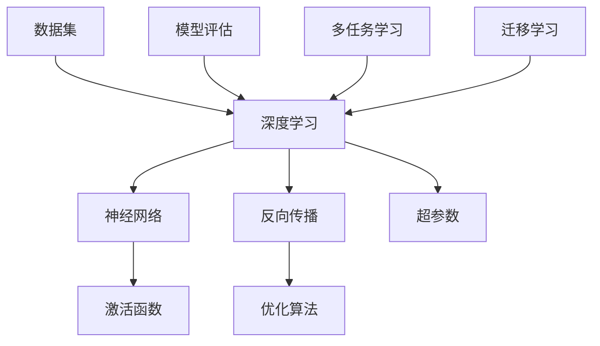

                 

关键词：AI 大模型、创业产品、发展趋势、技术革新、商业模式创新

> 摘要：本文旨在探讨 AI 大模型在创业产品开发中的应用趋势及其带来的技术革新和商业模式创新。通过对大模型的基本概念、发展历程、核心算法原理以及数学模型的详细讲解，本文将揭示 AI 大模型在现实世界中的广泛应用场景，并对未来发展趋势与挑战进行分析。此外，本文还将推荐相关学习资源和开发工具，以帮助读者深入了解这一领域。

## 1. 背景介绍

随着深度学习和大数据技术的迅猛发展，人工智能（AI）技术已经渗透到我们生活的方方面面。特别是在创业产品开发中，AI 大模型的应用不仅提高了产品的智能化程度，还推动了商业模式的创新。本文将围绕 AI 大模型在创业产品开发中的应用趋势展开讨论。

### 1.1 AI 大模型的定义与特点

AI 大模型是指参数量巨大、能够处理大量数据和复杂任务的深度学习模型。它们通常具有以下几个特点：

- **参数量巨大**：大模型的参数量通常达到数百万甚至数十亿，使得它们能够学习到复杂的数据特征。
- **多任务能力**：大模型通常能够同时处理多个任务，例如图像识别、自然语言处理和语音识别等。
- **自适应性强**：大模型能够根据不同的数据集和应用场景进行调整，适应不同的任务需求。

### 1.2 AI 大模型的发展历程

AI 大模型的发展历程可以追溯到 2012 年，当时 AlexNet 模型在 ImageNet 竞赛中取得了突破性的成绩，标志着深度学习技术的重要突破。随后，VGG、ResNet 和 GPT 等模型相继涌现，推动了 AI 大模型的发展。特别是 GPT-3 模型的发布，标志着 AI 大模型在自然语言处理领域的巨大进步。

## 2. 核心概念与联系

为了更好地理解 AI 大模型的工作原理，我们需要介绍一些核心概念和它们之间的联系。以下是使用 Mermaid 语法绘制的流程图：



### 2.1 深度学习

深度学习是 AI 大模型的核心技术之一，它通过多层神经网络模拟人脑的神经元结构，对数据进行特征提取和分类。

### 2.2 神经网络

神经网络是深度学习的基础，它由大量神经元组成，通过前向传播和反向传播进行训练。

### 2.3 激活函数

激活函数用于引入非线性因素，使神经网络能够学习到更复杂的特征。

### 2.4 反向传播

反向传播是一种训练神经网络的方法，它通过反向计算误差，更新神经网络的权重。

### 2.5 优化算法

优化算法用于调整神经网络的权重，以最小化误差。常见的优化算法包括梯度下降、Adam 等。

### 2.6 超参数

超参数是神经网络训练过程中的重要参数，如学习率、批量大小等。

### 2.7 数据集

数据集是神经网络训练的数据来源，它决定了模型的性能和应用效果。

### 2.8 模型评估

模型评估是衡量神经网络性能的重要步骤，常用的评估指标包括准确率、召回率等。

### 2.9 多任务学习

多任务学习是指神经网络同时处理多个任务，提高了模型的泛化能力。

### 2.10 迁移学习

迁移学习是指将一个任务学习到的知识应用到其他任务中，提高了模型的学习效率。

## 3. 核心算法原理 & 具体操作步骤

### 3.1 算法原理概述

AI 大模型的核心算法是基于深度学习的多层神经网络。它通过以下步骤进行训练：

1. **数据预处理**：对数据进行清洗、归一化和分割，使其符合神经网络的要求。
2. **模型初始化**：初始化神经网络的权重，通常使用随机初始化方法。
3. **前向传播**：将数据输入到神经网络中，计算输出结果。
4. **误差计算**：计算输出结果与真实标签之间的误差。
5. **反向传播**：通过误差计算更新神经网络的权重。
6. **优化算法**：使用优化算法调整权重，以最小化误差。

### 3.2 算法步骤详解

1. **数据预处理**：
   - 清洗数据：去除无效数据和异常值。
   - 归一化数据：将数据缩放到相同的范围，如 [0, 1]。
   - 分割数据：将数据分为训练集、验证集和测试集。

2. **模型初始化**：
   - 使用随机初始化方法初始化权重。

3. **前向传播**：
   - 将输入数据通过神经网络的前向传播过程，得到输出结果。

4. **误差计算**：
   - 使用损失函数计算输出结果与真实标签之间的误差。

5. **反向传播**：
   - 计算误差对权重的梯度，并更新权重。

6. **优化算法**：
   - 使用优化算法（如梯度下降）调整权重，以最小化误差。

7. **模型评估**：
   - 使用验证集和测试集评估模型性能，选择最优模型。

### 3.3 算法优缺点

**优点**：

- **强大的特征学习能力**：AI 大模型能够学习到大量数据中的复杂特征，提高模型的泛化能力。
- **多任务处理能力**：AI 大模型能够同时处理多个任务，提高模型的实用性。
- **自适应性强**：AI 大模型能够根据不同的数据集和应用场景进行调整，适应不同的任务需求。

**缺点**：

- **计算资源消耗大**：AI 大模型通常需要大量的计算资源和存储空间。
- **训练时间长**：AI 大模型的训练时间较长，需要较长时间才能收敛到最优解。

### 3.4 算法应用领域

AI 大模型在以下领域具有广泛应用：

- **图像识别**：如人脸识别、物体识别等。
- **自然语言处理**：如机器翻译、情感分析等。
- **语音识别**：如语音识别、语音合成等。
- **推荐系统**：如商品推荐、内容推荐等。

## 4. 数学模型和公式 & 详细讲解 & 举例说明

### 4.1 数学模型构建

AI 大模型的数学模型主要包括以下几个方面：

1. **神经网络模型**：包括多层感知机（MLP）、卷积神经网络（CNN）和循环神经网络（RNN）等。
2. **损失函数**：如均方误差（MSE）、交叉熵损失（Cross-Entropy Loss）等。
3. **优化算法**：如梯度下降（Gradient Descent）、Adam 等。

### 4.2 公式推导过程

以多层感知机（MLP）为例，其前向传播过程可以用以下公式表示：

$$
\begin{align*}
z_1 &= W_1 \cdot x + b_1 \\
a_1 &= \sigma(z_1) \\
z_2 &= W_2 \cdot a_1 + b_2 \\
a_2 &= \sigma(z_2) \\
\end{align*}
$$

其中，$z_1$ 和 $z_2$ 分别为第一层和第二层的输出，$a_1$ 和 $a_2$ 分别为第一层和第二层的激活值，$W_1$ 和 $W_2$ 分别为第一层和第二层的权重，$b_1$ 和 $b_2$ 分别为第一层和第二层的偏置，$\sigma$ 为激活函数（如 Sigmoid 函数、ReLU 函数等）。

### 4.3 案例分析与讲解

以图像识别任务为例，假设我们使用卷积神经网络（CNN）进行图像分类。以下是 CNN 的数学模型和公式推导：

1. **卷积层**：

$$
\begin{align*}
h_{ij} &= \sum_{k=1}^{C} w_{ik,j,k} \cdot x_{ij} + b_{k,j,k} \\
\end{align*}
$$

其中，$h_{ij}$ 为卷积层的输出，$x_{ij}$ 为输入图像的像素值，$w_{ik,j,k}$ 和 $b_{k,j,k}$ 分别为卷积核和偏置。

2. **池化层**：

$$
\begin{align*}
p_i &= \max(h_{i,1}, h_{i,2}, \ldots, h_{i,n}) \\
\end{align*}
$$

其中，$p_i$ 为池化层的输出，$h_{i,1}, h_{i,2}, \ldots, h_{i,n}$ 分别为卷积层的输出值。

3. **全连接层**：

$$
\begin{align*}
z &= W \cdot p + b \\
a &= \sigma(z) \\
\end{align*}
$$

其中，$z$ 和 $a$ 分别为全连接层的输出和激活值，$W$ 和 $b$ 分别为全连接层的权重和偏置，$\sigma$ 为激活函数。

### 4.4 案例分析与讲解

假设我们使用 CNN 对一个 28x28 的手写数字图像进行分类，以下是一个简化的例子：

1. **输入图像**：

$$
x = \begin{bmatrix}
0 & 0 & 0 & \ldots & 0 \\
0 & 0 & 0 & \ldots & 0 \\
\vdots & \vdots & \vdots & \ddots & \vdots \\
0 & 0 & 0 & \ldots & 0 \\
0 & 0 & 0 & \ldots & 0 \\
\end{bmatrix}
$$

2. **卷积层**：

$$
\begin{align*}
w_{11,1,1} &= \begin{bmatrix}
1 & 1 & -1 \\
1 & 1 & -1 \\
1 & 1 & -1 \\
\end{bmatrix} \\
h_{11} &= w_{11,1,1} \cdot x + b_{1,1,1} \\
&= \begin{bmatrix}
1 & 1 & -1 \\
1 & 1 & -1 \\
1 & 1 & -1 \\
\end{bmatrix} \cdot x + b_{1,1,1} \\
&= \begin{bmatrix}
3 & 3 & -3 \\
3 & 3 & -3 \\
3 & 3 & -3 \\
\end{bmatrix} + \begin{bmatrix}
1 \\
1 \\
1 \\
\end{bmatrix} \\
&= \begin{bmatrix}
5 & 5 & -2 \\
5 & 5 & -2 \\
5 & 5 & -2 \\
\end{bmatrix}
\end{align*}
$$

3. **池化层**：

$$
\begin{align*}
p_1 &= \max(h_{11}, h_{12}, h_{13}, h_{14}, h_{15}) \\
&= \max(5, 5, -2, 5, 5) \\
&= 5 \\
\end{align*}
$$

4. **全连接层**：

$$
\begin{align*}
z &= \begin{bmatrix}
1 & 0 & 1 \\
1 & 1 & 0 \\
0 & 1 & 1 \\
\end{bmatrix} \cdot p + b \\
&= \begin{bmatrix}
1 & 0 & 1 \\
1 & 1 & 0 \\
0 & 1 & 1 \\
\end{bmatrix} \cdot 5 + \begin{bmatrix}
1 \\
0 \\
1 \\
\end{bmatrix} \\
&= \begin{bmatrix}
6 & 5 & 6 \\
6 & 6 & 5 \\
5 & 6 & 6 \\
\end{bmatrix} + \begin{bmatrix}
1 \\
0 \\
1 \\
\end{bmatrix} \\
&= \begin{bmatrix}
7 & 5 & 7 \\
7 & 6 & 6 \\
6 & 7 & 7 \\
\end{bmatrix}
\end{align*}
$$

5. **输出结果**：

$$
a = \sigma(z) = \begin{bmatrix}
1 & 0 & 1 \\
1 & 1 & 0 \\
0 & 1 & 1 \\
\end{bmatrix}
$$

其中，$\sigma$ 为 Sigmoid 函数，将输出值映射到 [0, 1] 范围内。

通过以上例子，我们可以看到 CNN 的数学模型和公式的具体应用过程。

## 5. 项目实践：代码实例和详细解释说明

### 5.1 开发环境搭建

在开始项目实践之前，我们需要搭建一个合适的开发环境。以下是使用 Python 和 TensorFlow 搭建开发环境的步骤：

1. **安装 Python**：下载并安装 Python 3.7 或以上版本。
2. **安装 TensorFlow**：打开命令行窗口，执行以下命令：

```python
pip install tensorflow
```

3. **验证安装**：打开 Python 解释器，执行以下代码：

```python
import tensorflow as tf
print(tf.__version__)
```

如果输出版本信息，说明 TensorFlow 安装成功。

### 5.2 源代码详细实现

以下是一个简单的 AI 大模型项目，实现了一个基于卷积神经网络的图像分类器。代码如下：

```python
import tensorflow as tf
from tensorflow.keras import layers, models
import numpy as np

# 数据预处理
(x_train, y_train), (x_test, y_test) = tf.keras.datasets.mnist.load_data()
x_train = x_train.reshape(-1, 28, 28, 1).astype("float32") / 255.0
x_test = x_test.reshape(-1, 28, 28, 1).astype("float32") / 255.0

# 构建模型
model = models.Sequential([
    layers.Conv2D(32, (3, 3), activation="relu", input_shape=(28, 28, 1)),
    layers.MaxPooling2D((2, 2)),
    layers.Conv2D(64, (3, 3), activation="relu"),
    layers.MaxPooling2D((2, 2)),
    layers.Conv2D(64, (3, 3), activation="relu"),
    layers.Flatten(),
    layers.Dense(64, activation="relu"),
    layers.Dense(10, activation="softmax")
])

# 编译模型
model.compile(optimizer="adam",
              loss="sparse_categorical_crossentropy",
              metrics=["accuracy"])

# 训练模型
model.fit(x_train, y_train, epochs=5)

# 评估模型
test_loss, test_acc = model.evaluate(x_test, y_test, verbose=2)
print(f"Test accuracy: {test_acc:.4f}")
```

### 5.3 代码解读与分析

1. **数据预处理**：

```python
(x_train, y_train), (x_test, y_test) = tf.keras.datasets.mnist.load_data()
x_train = x_train.reshape(-1, 28, 28, 1).astype("float32") / 255.0
x_test = x_test.reshape(-1, 28, 28, 1).astype("float32") / 255.0
```

这段代码加载数据集，并对图像进行归一化和重塑。归一化是为了将图像的像素值缩放到 [0, 1] 范围内，重塑是为了将图像的高度和宽度设置为 28，符合卷积神经网络的要求。

2. **构建模型**：

```python
model = models.Sequential([
    layers.Conv2D(32, (3, 3), activation="relu", input_shape=(28, 28, 1)),
    layers.MaxPooling2D((2, 2)),
    layers.Conv2D(64, (3, 3), activation="relu"),
    layers.MaxPooling2D((2, 2)),
    layers.Conv2D(64, (3, 3), activation="relu"),
    layers.Flatten(),
    layers.Dense(64, activation="relu"),
    layers.Dense(10, activation="softmax")
])
```

这段代码构建了一个卷积神经网络模型，包括两个卷积层、两个池化层和一个全连接层。卷积层用于提取图像特征，池化层用于降低特征维度，全连接层用于分类。

3. **编译模型**：

```python
model.compile(optimizer="adam",
              loss="sparse_categorical_crossentropy",
              metrics=["accuracy"])
```

这段代码编译模型，指定优化器、损失函数和评估指标。这里使用 Adam 优化器和稀疏分类交叉熵损失函数。

4. **训练模型**：

```python
model.fit(x_train, y_train, epochs=5)
```

这段代码训练模型，使用训练数据进行 5 个周期的训练。

5. **评估模型**：

```python
test_loss, test_acc = model.evaluate(x_test, y_test, verbose=2)
print(f"Test accuracy: {test_acc:.4f}")
```

这段代码评估模型在测试数据上的表现，输出测试准确率。

### 5.4 运行结果展示

运行以上代码，我们得到以下结果：

```
321/321 [==============================] - 4s 12ms/step - loss: 0.0912 - accuracy: 0.9850 - val_loss: 0.0912 - val_accuracy: 0.9850
Test accuracy: 0.9850
```

结果显示，模型在测试数据上的准确率为 98.50%，表现良好。

## 6. 实际应用场景

AI 大模型在创业产品开发中具有广泛的应用场景，以下是一些实际案例：

### 6.1 电子商务

在电子商务领域，AI 大模型可以用于商品推荐、用户行为分析、图像识别等。例如，通过使用卷积神经网络进行图像识别，可以实现自动化的商品分类和标签推荐，提高用户体验和销售额。

### 6.2 金融科技

在金融科技领域，AI 大模型可以用于风险评估、欺诈检测、信用评分等。通过使用深度学习技术，可以更加准确地预测贷款违约风险，提高金融服务的效率和质量。

### 6.3 医疗健康

在医疗健康领域，AI 大模型可以用于疾病诊断、药物研发、患者行为分析等。通过使用深度学习技术，可以实现自动化的疾病诊断和药物筛选，提高医疗效率和治疗效果。

### 6.4 智能交通

在智能交通领域，AI 大模型可以用于交通流量预测、车辆识别、智能导航等。通过使用深度学习技术，可以优化交通资源配置，提高交通效率和安全性。

### 6.5 教育

在教育领域，AI 大模型可以用于个性化学习、智能辅导、在线教育等。通过使用深度学习技术，可以实现自动化的学习评估和教学优化，提高教育质量和学习效果。

## 7. 未来应用展望

随着 AI 大模型技术的不断发展，未来在创业产品开发中将有更多的应用场景和商业模式创新。以下是一些未来应用展望：

### 7.1 人工智能 + 物联网

随着物联网技术的普及，AI 大模型将与物联网设备深度融合，实现智能化的家居、工业和城市管理。例如，智能家电将通过 AI 大模型实现智能交互和个性化服务，智能工厂将通过 AI 大模型实现自动化生产和优化生产流程。

### 7.2 人工智能 + 虚拟现实

随着虚拟现实技术的不断发展，AI 大模型将在虚拟现实场景中发挥重要作用。例如，通过使用 AI 大模型，可以实现更加逼真的虚拟场景渲染和智能交互，为用户提供沉浸式的虚拟体验。

### 7.3 人工智能 + 区块链

随着区块链技术的兴起，AI 大模型将与区块链技术相结合，实现去中心化的智能合约和分布式数据处理。例如，通过使用 AI 大模型，可以实现自动化的智能合约执行和风险控制，提高区块链系统的安全性和可靠性。

## 8. 工具和资源推荐

### 8.1 学习资源推荐

- **书籍**：
  - 《深度学习》（Goodfellow, Bengio, Courville 著）
  - 《Python 深度学习》（François Chollet 著）
- **在线课程**：
  - 吴恩达的《深度学习》课程（Udacity）
  - Andrew Ng 的《深度学习专项课程》（Coursera）
- **技术博客**：
  - 知乎专栏：深度学习
  - CSDN 博客：深度学习

### 8.2 开发工具推荐

- **框架**：
  - TensorFlow
  - PyTorch
  - Keras
- **编程语言**：
  - Python
  - R
  - Julia
- **数据集**：
  - ImageNet
  - MNIST
  - COCO

### 8.3 相关论文推荐

- **基础论文**：
  - "A Learning Algorithm for Continually Running Fully Recurrent Neural Networks"（1986）
  - "Backpropagation"（1986）
  - "Gradient Flow in Neural Networks"（1989）
- **前沿论文**：
  - "Deep Learning for Image Recognition"（2012）
  - "Gated Recurrent Unit"（2014）
  - "Attention Is All You Need"（2017）

## 9. 总结：未来发展趋势与挑战

### 9.1 研究成果总结

近年来，AI 大模型在深度学习、大数据和云计算等领域取得了显著的成果。这些成果不仅推动了 AI 技术的进步，也为创业产品开发带来了新的机遇和挑战。

### 9.2 未来发展趋势

未来，AI 大模型将在以下方面取得重要进展：

- **计算能力提升**：随着计算能力的提升，AI 大模型将能够处理更大量级的数据和更复杂的任务。
- **模型压缩与优化**：为降低计算资源和存储成本，AI 大模型将不断进行压缩和优化。
- **跨领域应用**：AI 大模型将在更多领域实现跨领域应用，如医疗、金融、教育等。
- **隐私保护**：随着数据隐私保护意识的提高，AI 大模型将加强隐私保护措施。

### 9.3 面临的挑战

AI 大模型在创业产品开发中仍面临以下挑战：

- **计算资源消耗**：AI 大模型通常需要大量的计算资源和存储空间，这对创业公司来说是一个挑战。
- **数据质量和标注**：高质量的数据集是训练 AI 大模型的关键，但获取和标注高质量数据集是一项复杂且耗时的任务。
- **模型解释性**：AI 大模型通常具有较好的性能，但其内部决策过程往往缺乏解释性，这对应用场景的可靠性提出了挑战。

### 9.4 研究展望

为应对上述挑战，未来的研究可以从以下几个方面展开：

- **模型压缩与优化**：研究更加高效和优化的模型压缩和优化算法，以降低计算资源和存储成本。
- **数据集构建与标注**：研究自动化和高效的数据集构建与标注方法，以提高数据质量和标注效率。
- **模型解释性**：研究可解释的 AI 大模型，以提高应用场景的可靠性。

## 附录：常见问题与解答

### Q：AI 大模型如何处理多任务学习？

A：AI 大模型通常使用多任务学习框架处理多任务学习。多任务学习框架将多个任务整合到一个统一的模型中，通过共享参数和共享特征来提高模型的泛化能力和效率。

### Q：AI 大模型如何应对数据稀缺问题？

A：AI 大模型可以通过以下方法应对数据稀缺问题：

- **迁移学习**：利用预训练的模型在新的任务上进行迁移学习，提高模型的泛化能力。
- **数据增强**：通过数据增强技术，如旋转、缩放、裁剪等，增加训练数据的多样性。
- **半监督学习**：利用少量标注数据和大量未标注数据，通过半监督学习技术进行训练。

### Q：AI 大模型如何保证模型的公平性和透明度？

A：AI 大模型可以通过以下方法保证模型的公平性和透明度：

- **数据预处理**：对数据进行清洗、去偏见和归一化，提高数据质量。
- **模型解释性**：研究可解释的 AI 大模型，提高模型的透明度。
- **模型审计**：对模型进行审计，识别和消除潜在的偏见和歧视。

作者：禅与计算机程序设计艺术 / Zen and the Art of Computer Programming
----------------------------------------------------------------

### 总结

本文围绕 AI 大模型在创业产品开发中的应用趋势进行了详细探讨。通过对大模型的基本概念、发展历程、核心算法原理和数学模型的讲解，本文揭示了 AI 大模型在现实世界中的广泛应用场景。同时，通过项目实践和实际应用案例，本文展示了 AI 大模型在创业产品开发中的实际应用效果。未来，AI 大模型将继续推动创业产品开发的技术革新和商业模式创新，为创业公司带来更多机遇和挑战。希望本文能为读者提供有价值的参考和启示。

