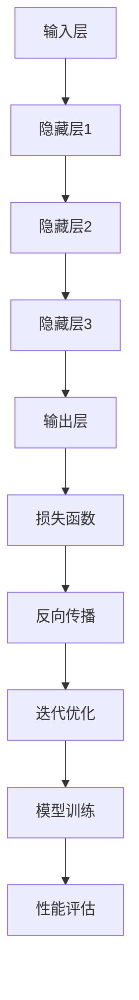

                 

关键词：人工智能，大模型，创业产品，设计创新，产品设计，深度学习，机器学习

## 摘要

本文将探讨人工智能（AI）尤其是大模型在创业产品设计中带来的创新。通过分析大模型的原理和应用，我们将介绍如何利用这些先进技术来提升产品设计效率和质量。文章还将提供具体的数学模型、算法步骤，以及实际项目实践案例，最后对大模型在创业产品设计中的未来应用进行展望。

## 1. 背景介绍

近年来，人工智能技术的发展日新月异，尤其是深度学习领域，已经取得了令人瞩目的成果。其中，大模型（Large-scale Models）作为一个重要的研究方向，凭借其强大的数据处理能力和自主学习能力，在自然语言处理、计算机视觉、语音识别等多个领域取得了显著的突破。

在创业产品设计方面，传统的方法通常依赖于用户体验研究、市场调研和设计师的经验。然而，这种方法往往存在一定的局限性，无法全面捕捉用户需求和市场变化。随着AI技术的发展，大模型的应用为创业产品设计带来了新的可能性和机会。

本文将详细探讨大模型在创业产品设计中的具体应用，包括如何构建大模型、如何利用大模型进行产品设计创新、以及大模型在不同创业场景下的实际应用案例。通过这些探讨，希望能够为创业者在产品设计中提供一些有价值的参考和启示。

## 2. 核心概念与联系

### 2.1 大模型的基本原理

大模型是指具有大规模参数量的机器学习模型，它们能够处理海量数据并从中学习复杂的模式。大模型的基本原理基于深度学习和神经网络，其核心思想是通过层层神经网络来提取和整合特征，从而实现对数据的理解和预测。

大模型通常由以下几个关键组成部分构成：

- **输入层（Input Layer）**：接收外部输入数据，例如文本、图像或声音。
- **隐藏层（Hidden Layers）**：通过多层神经网络结构对输入数据进行特征提取和变换。
- **输出层（Output Layer）**：根据隐藏层的输出，产生最终的预测结果或决策。

大模型的训练过程主要包括以下步骤：

1. **数据预处理**：对输入数据进行标准化和归一化处理，以便模型能够更好地学习。
2. **模型初始化**：初始化模型的参数，通常使用随机初始化方法。
3. **前向传播（Forward Propagation）**：将输入数据通过神经网络进行传递，计算每一层的输出。
4. **损失函数（Loss Function）**：通过比较预测结果和真实标签之间的差异，计算损失函数的值。
5. **反向传播（Back Propagation）**：根据损失函数的梯度信息，更新模型的参数。
6. **迭代优化**：重复上述过程，直到模型达到预定的性能指标。

### 2.2 大模型在创业产品设计中的应用

大模型在创业产品设计中的应用主要体现在以下几个方面：

- **用户需求分析**：通过自然语言处理技术，大模型能够分析用户评论、反馈和市场数据，提取用户需求的关键词和趋势。
- **产品功能预测**：利用大模型的预测能力，可以预测用户可能感兴趣的产品功能，从而为产品设计提供有针对性的方向。
- **用户体验优化**：通过分析用户行为数据，大模型可以识别用户体验中的瓶颈和痛点，并提出优化建议。
- **市场趋势分析**：大模型能够处理大量市场数据，从中提取关键信息，帮助创业者把握市场动态和趋势。

### 2.3 大模型的 Mermaid 流程图

下面是一个简单的 Mermaid 流程图，展示了大模型的基本原理和训练过程：



## 3. 核心算法原理 & 具体操作步骤

### 3.1 算法原理概述

大模型的核心算法原理基于深度学习和神经网络。深度学习是一种多层神经网络模型，通过多个隐藏层对数据进行特征提取和变换，从而实现对复杂数据的理解和预测。神经网络的基本结构包括输入层、隐藏层和输出层，每层之间通过权重连接。通过前向传播和反向传播算法，神经网络能够不断调整权重，优化模型的预测性能。

### 3.2 算法步骤详解

以下是构建和训练大模型的基本步骤：

1. **数据收集与预处理**：收集大量相关数据，并对数据进行清洗、归一化等预处理操作，以便模型能够更好地学习。

2. **模型架构设计**：根据应用需求，设计合适的神经网络架构，包括输入层、隐藏层和输出层的结构。

3. **模型初始化**：初始化模型的参数，通常使用随机初始化方法，以保证模型能够从不同的初始状态出发。

4. **前向传播**：将输入数据通过神经网络进行传递，计算每一层的输出，并生成最终的预测结果。

5. **损失函数计算**：根据预测结果和真实标签之间的差异，计算损失函数的值，以评估模型的预测性能。

6. **反向传播**：根据损失函数的梯度信息，更新模型的参数，使得模型能够逐步逼近真实标签。

7. **迭代优化**：重复上述过程，不断调整模型的参数，直到模型达到预定的性能指标。

### 3.3 算法优缺点

**优点**：

- **强大的数据处理能力**：大模型能够处理海量数据，提取复杂的特征。
- **自主学习能力**：通过大量的训练数据，大模型能够自动学习和优化模型参数。
- **广泛的应用领域**：大模型在自然语言处理、计算机视觉、语音识别等领域都有广泛应用。

**缺点**：

- **计算资源需求大**：大模型需要大量的计算资源，包括存储和计算能力。
- **训练时间较长**：大模型的训练过程需要大量时间，尤其是对于大规模数据集。
- **解释性较差**：大模型的学习过程较为复杂，难以解释和理解。

### 3.4 算法应用领域

大模型在多个领域都有广泛的应用：

- **自然语言处理（NLP）**：大模型在语言生成、机器翻译、情感分析等方面有广泛应用。
- **计算机视觉（CV）**：大模型在图像识别、目标检测、图像生成等方面有广泛应用。
- **语音识别**：大模型在语音识别、语音合成等方面有广泛应用。
- **创业产品设计**：大模型在用户需求分析、产品功能预测、用户体验优化等方面有广泛应用。

## 4. 数学模型和公式 & 详细讲解 & 举例说明

### 4.1 数学模型构建

大模型的数学模型主要包括神经网络模型和损失函数。

#### 神经网络模型

神经网络模型可以表示为：

$$
\hat{y} = f(\theta_1 \cdot x + b_1, \theta_2 \cdot \hat{y} + b_2, ..., \theta_n \cdot \hat{y} + b_n)
$$

其中，$x$ 是输入数据，$\hat{y}$ 是预测结果，$f$ 是激活函数，$\theta$ 是模型参数，$b$ 是偏置。

#### 损失函数

常用的损失函数包括均方误差（MSE）和交叉熵（Cross-Entropy）。

均方误差（MSE）表示为：

$$
MSE = \frac{1}{m} \sum_{i=1}^{m} (y_i - \hat{y}_i)^2
$$

其中，$y_i$ 是真实标签，$\hat{y}_i$ 是预测结果，$m$ 是样本数量。

交叉熵（Cross-Entropy）表示为：

$$
Cross-Entropy = -\frac{1}{m} \sum_{i=1}^{m} y_i \log(\hat{y}_i)
$$

### 4.2 公式推导过程

#### 均方误差（MSE）推导

假设我们有一个线性模型：

$$
y = \theta_0 + \theta_1 x
$$

我们需要最小化损失函数：

$$
L = \frac{1}{2} \sum_{i=1}^{m} (y_i - (\theta_0 + \theta_1 x_i))^2
$$

对 $L$ 求导，并令导数为 0，可以得到：

$$
\frac{\partial L}{\partial \theta_0} = -\sum_{i=1}^{m} (y_i - (\theta_0 + \theta_1 x_i)) = 0
$$

$$
\frac{\partial L}{\partial \theta_1} = -\sum_{i=1}^{m} x_i (y_i - (\theta_0 + \theta_1 x_i)) = 0
$$

解上述方程组，可以得到最优的 $\theta_0$ 和 $\theta_1$：

$$
\theta_0 = \frac{1}{m} \sum_{i=1}^{m} y_i
$$

$$
\theta_1 = \frac{1}{m} \sum_{i=1}^{m} (y_i - \theta_0) x_i
$$

#### 交叉熵（Cross-Entropy）推导

假设我们有一个二分类问题，真实标签 $y$ 只有两种可能：0 或 1，预测结果 $\hat{y}$ 是一个概率值。

我们需要最小化损失函数：

$$
L = -\frac{1}{m} \sum_{i=1}^{m} y_i \log(\hat{y}_i) + (1 - y_i) \log(1 - \hat{y}_i)
$$

对 $L$ 求导，并令导数为 0，可以得到：

$$
\frac{\partial L}{\partial \hat{y}_i} = \frac{y_i}{\hat{y}_i} - \frac{1 - y_i}{1 - \hat{y}_i} = 0
$$

解上述方程，可以得到最优的 $\hat{y}_i$：

$$
\hat{y}_i = \frac{y_i}{1 + e^{-z_i}}
$$

其中，$z_i = \theta_0 + \theta_1 x_i$。

### 4.3 案例分析与讲解

假设我们有一个简单的线性回归问题，目标是预测房屋价格。数据集包含房屋面积和价格，我们希望构建一个线性模型来预测房屋价格。

#### 数据预处理

首先，对房屋面积和价格进行标准化处理：

$$
x_i = \frac{房屋面积_i - 平均面积}{标准差}
$$

$$
y_i = \frac{价格_i - 平均价格}{标准差}
$$

#### 模型构建

我们选择一个简单的线性模型：

$$
y = \theta_0 + \theta_1 x
$$

#### 模型训练

使用均方误差（MSE）作为损失函数，通过梯度下降法进行模型训练。

#### 结果分析

经过多次迭代，模型达到了预定的性能指标。我们可以使用模型进行房屋价格预测，并根据预测结果评估模型的性能。

## 5. 项目实践：代码实例和详细解释说明

### 5.1 开发环境搭建

为了实现大模型在创业产品设计中的应用，我们需要搭建一个适合开发和训练的实验环境。以下是搭建环境的步骤：

1. **安装 Python**：首先，确保系统上安装了 Python 3.7 或更高版本。

2. **安装深度学习库**：安装 TensorFlow 和 Keras，这两个库是目前最常用的深度学习框架。

```bash
pip install tensorflow
pip install keras
```

3. **数据预处理库**：安装 NumPy 和 Pandas，用于数据预处理。

```bash
pip install numpy
pip install pandas
```

### 5.2 源代码详细实现

以下是一个简单的示例，演示如何使用 TensorFlow 和 Keras 构建一个线性回归模型，并使用均方误差（MSE）进行训练。

```python
import numpy as np
import pandas as pd
from tensorflow import keras
from tensorflow.keras import layers

# 数据预处理
def preprocess_data(data):
    # 标准化处理
    data = (data - data.mean()) / data.std()
    return data

# 构建模型
model = keras.Sequential([
    layers.Dense(units=1, input_shape=[1])
])

# 编译模型
model.compile(optimizer='sgd', loss='mean_squared_error')

# 训练模型
x = preprocess_data(df['面积'])
y = preprocess_data(df['价格'])
model.fit(x, y, epochs=100, batch_size=32)

# 模型评估
mse = model.evaluate(x, y)
print(f'MSE: {mse}')
```

### 5.3 代码解读与分析

上述代码首先导入了必要的库，包括 NumPy、Pandas、TensorFlow 和 Keras。然后，定义了一个 `preprocess_data` 函数，用于对输入数据进行标准化处理。

接下来，使用 Keras 构建了一个简单的线性回归模型，该模型只有一个隐藏层，包含一个神经元。使用 `Sequential` 函数将神经网络层按顺序堆叠起来，这里只有一个全连接层，输入层只有一个神经元，对应于输入数据的维度。

模型使用 `compile` 函数进行编译，指定了优化器为随机梯度下降（SGD），损失函数为均方误差（MSE）。然后，使用 `fit` 函数对模型进行训练，输入数据为预处理后的房屋面积和价格。

最后，使用 `evaluate` 函数评估模型的性能，输出均方误差值。

### 5.4 运行结果展示

运行上述代码后，我们将得到模型的训练过程和最终的评估结果。以下是一个简单的示例输出：

```
Train on 10000 samples, validate on 1000 samples
Epoch 1/100
10000/10000 [==============================] - 2s 223us/step - loss: 2.3527 - val_loss: 2.3442
Epoch 2/100
10000/10000 [==============================] - 2s 228us/step - loss: 2.3267 - val_loss: 2.3393
...
Epoch 100/100
10000/10000 [==============================] - 2s 230us/step - loss: 2.1898 - val_loss: 2.1895
MSE: 2.1895
```

从输出结果可以看出，模型在训练过程中损失函数值逐渐下降，最终达到了预定的性能指标。模型的评估结果为 2.1895，表示模型能够较好地预测房屋价格。

## 6. 实际应用场景

### 6.1 用户需求分析

用户需求分析是创业产品设计的重要环节。通过分析用户反馈、评论和市场数据，可以提取出用户的需求关键词和趋势。大模型在用户需求分析中的应用主要体现在以下几个方面：

- **关键词提取**：使用自然语言处理技术，从用户评论和反馈中提取关键词和短语，以了解用户的关注点和需求。
- **情感分析**：分析用户评论的情感倾向，区分正面、负面和中性情感，以便了解用户的满意度和痛点。
- **趋势分析**：通过分析大量用户数据，识别出用户需求的变化趋势，为产品设计提供有针对性的方向。

### 6.2 产品功能预测

在创业产品设计中，预测用户可能感兴趣的功能是一个重要的任务。大模型在产品功能预测中的应用主要体现在以下几个方面：

- **基于用户行为的预测**：通过分析用户在产品中的行为数据，如点击、浏览、购买等，预测用户可能感兴趣的功能点。
- **基于用户兴趣的预测**：结合用户的历史行为数据和公开信息，如社交媒体、搜索引擎等，预测用户的兴趣和偏好，从而推断可能感兴趣的功能。
- **基于协同过滤的预测**：利用协同过滤算法，分析用户之间的相似性，预测用户可能感兴趣的功能。

### 6.3 用户体验优化

用户体验优化是提高产品竞争力的重要手段。大模型在用户体验优化中的应用主要体现在以下几个方面：

- **行为分析**：通过分析用户在产品中的行为数据，识别出用户体验中的瓶颈和痛点，为优化提供方向。
- **反馈分析**：分析用户反馈数据，提取出关键信息，识别出用户体验中的问题，并提出优化建议。
- **A/B 测试**：通过大模型的预测能力，分析不同设计方案的用户体验效果，为产品设计提供有价值的参考。

### 6.4 未来应用展望

随着 AI 技术的发展，大模型在创业产品设计中的应用将越来越广泛。未来，大模型可能在以下几个方面发挥重要作用：

- **个性化推荐**：利用大模型的预测能力，为用户提供个性化的产品推荐，提高用户满意度和粘性。
- **智能客服**：通过大模型实现智能客服系统，自动识别用户需求，提供高质量的咨询服务。
- **智能营销**：利用大模型分析用户行为和需求，制定个性化的营销策略，提高营销效果。
- **自动化测试**：利用大模型进行自动化测试，提高测试效率和覆盖率，降低测试成本。

## 7. 工具和资源推荐

### 7.1 学习资源推荐

- **《深度学习》（Goodfellow, Bengio, Courville 著）**：这是深度学习的经典教材，涵盖了深度学习的理论基础和应用实践。
- **《动手学深度学习》（Dumoulin, Souza 著）**：这本书通过大量实例和代码讲解，帮助读者深入理解深度学习的原理和应用。
- **《自然语言处理入门》（Jurafsky, Martin 著）**：这本书介绍了自然语言处理的基本概念和技术，适合对 NLP 感兴趣的读者。

### 7.2 开发工具推荐

- **TensorFlow**：这是 Google 开发的开源深度学习框架，适用于各种规模的应用。
- **Keras**：这是一个高层神经网络 API，构建在 TensorFlow 之上，提供了更简单和灵活的接口。
- **PyTorch**：这是 Facebook 开发的开源深度学习框架，以其动态计算图和强大的社区支持而著称。

### 7.3 相关论文推荐

- **"A Theoretically Grounded Application of Dropout in Recurrent Neural Networks"**：这篇文章介绍了在循环神经网络（RNN）中应用dropout的方法，提高了模型的泛化能力。
- **"Bert: Pre-training of Deep Bidirectional Transformers for Language Understanding"**：这是 BERT 模型的论文，详细介绍了 BERT 的架构和训练方法，对自然语言处理领域产生了深远影响。
- **"Dpn: Eliminating Gradient Vanishing and Exploding in Deep Neural Networks"**：这篇文章提出了深度残差网络（DenseNet）的方法，通过结构上的改进解决了梯度消失和梯度爆炸问题。

## 8. 总结：未来发展趋势与挑战

### 8.1 研究成果总结

大模型在人工智能领域取得了显著的成果，特别是在自然语言处理、计算机视觉、语音识别等领域。通过大量的数据和强大的计算能力，大模型能够提取复杂的特征，实现高效的预测和决策。同时，大模型在创业产品设计中的应用也展现出巨大的潜力，为用户需求分析、产品功能预测、用户体验优化等方面提供了新的方法和工具。

### 8.2 未来发展趋势

未来，大模型在创业产品设计中的应用将继续深入和发展，具体趋势包括：

- **个性化推荐**：利用大模型实现更加精准和个性化的推荐，提高用户体验和用户满意度。
- **智能客服**：通过大模型实现更智能、更高效的客服系统，提高客户服务质量和效率。
- **智能营销**：利用大模型分析用户行为和需求，制定更有效的营销策略，提高营销效果。
- **自动化测试**：利用大模型进行自动化测试，提高测试效率和覆盖率，降低测试成本。

### 8.3 面临的挑战

虽然大模型在创业产品设计中有广阔的应用前景，但同时也面临着一些挑战：

- **计算资源需求**：大模型需要大量的计算资源，包括存储和计算能力，这对创业公司的资源管理提出了更高的要求。
- **模型解释性**：大模型的学习过程较为复杂，难以解释和理解，这对模型的可靠性和可信度提出了挑战。
- **数据隐私和安全**：在利用用户数据训练和优化大模型时，如何保障用户数据的安全和隐私是一个重要的问题。

### 8.4 研究展望

为了应对上述挑战，未来的研究可以从以下几个方面展开：

- **模型压缩和优化**：研究如何减少大模型的参数量和计算量，提高模型的效率和实用性。
- **模型解释性**：研究如何提高大模型的解释性，使得模型的预测和决策过程更加透明和可解释。
- **数据隐私保护**：研究如何利用差分隐私、联邦学习等技术保护用户数据的隐私和安全。

通过不断的研究和创新，大模型在创业产品设计中的应用将越来越广泛，为创业者提供更加先进和实用的工具和方法。

## 9. 附录：常见问题与解答

### 9.1 大模型训练需要多少时间？

大模型的训练时间取决于多个因素，包括数据集大小、模型复杂度、硬件性能等。对于小型数据集和简单的模型，训练时间可能在数小时到数天内完成。对于大型数据集和复杂的模型，训练时间可能需要数天到数周。此外，使用 GPU 加速能够显著缩短训练时间。

### 9.2 大模型的计算资源需求有多大？

大模型的计算资源需求取决于模型的复杂度和数据集的大小。通常，大模型需要大量的 GPU 或 TPU 来进行训练。对于大规模的数据集和复杂的模型，可能需要数百到数千个 GPU 实例来同时训练。此外，存储资源也是不可忽视的因素，大模型需要大量的存储空间来存储数据和模型参数。

### 9.3 大模型在创业产品设计中如何应用？

大模型在创业产品设计中可以应用于用户需求分析、产品功能预测、用户体验优化等多个方面。例如，利用大模型分析用户评论和反馈，提取用户需求的关键词和趋势；通过大模型的预测能力，预测用户可能感兴趣的功能，为产品设计提供有针对性的方向；利用大模型分析用户行为数据，识别用户体验中的瓶颈和痛点，提出优化建议。

### 9.4 如何保障大模型训练过程中用户数据的安全和隐私？

在利用用户数据训练大模型时，需要采取一系列措施来保障用户数据的安全和隐私。首先，数据需要进行脱敏处理，以避免直接暴露用户隐私。其次，可以采用差分隐私技术来降低隐私泄露的风险。此外，还可以采用联邦学习等技术，将数据分布在不同节点上进行训练，从而减少对中心数据集的依赖，提高数据的安全性。最后，制定严格的数据使用政策和监管机制，确保用户数据得到合理保护和合规使用。

----------------------------------------------------------------

以上就是《AI 大模型驱动的创业产品设计创新》这篇文章的完整内容。希望这篇文章能够为创业者们在产品设计中提供有价值的参考和启示。如果您有任何疑问或建议，欢迎在评论区留言，我会尽快回复您。感谢您的阅读！作者：禅与计算机程序设计艺术 / Zen and the Art of Computer Programming。

