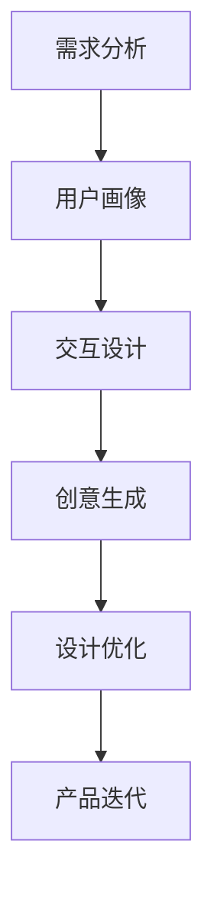

                 

关键词：AI大模型，创业产品，设计创新，产品设计流程，技术实现，实际应用场景，未来展望

> 摘要：本文将探讨AI大模型在创业产品设计中的应用，分析其带来的设计创新和影响，通过具体案例和项目实践，详细解读AI大模型在创业产品中的技术实现和优势，展望其未来的发展趋势与挑战。

## 1. 背景介绍

随着人工智能技术的快速发展，AI大模型在各个领域的应用逐渐广泛。特别是在创业产品设计中，AI大模型的出现为产品创新提供了新的思路和方法。创业产品设计是一个复杂的过程，涉及市场需求分析、用户行为研究、产品功能规划等多个环节。传统的产品设计方法往往依赖于设计师的经验和直觉，难以快速适应市场的变化。而AI大模型的引入，可以借助其强大的数据处理和分析能力，为创业产品设计提供科学依据，提高设计效率和产品质量。

## 2. 核心概念与联系

### 2.1 AI大模型的基本概念

AI大模型，即大型人工智能模型，通常是指具有数十亿甚至数万亿参数的深度学习模型。这些模型通过大规模数据训练，可以自动学习数据中的规律和模式，并实现对未知数据的预测和分类。常见的AI大模型有GPT、BERT、Inception等。

### 2.2 AI大模型在产品设计中的应用

AI大模型在产品设计中的应用主要体现在以下几个方面：

- **需求分析**：通过分析大量用户行为数据和市场趋势，AI大模型可以帮助设计师了解用户需求，为产品功能规划提供依据。

- **用户画像**：基于用户数据，AI大模型可以构建用户画像，帮助设计师更好地理解用户，为产品设计提供参考。

- **交互设计**：AI大模型可以帮助设计师优化产品的交互设计，提高用户使用体验。

- **创意生成**：AI大模型可以根据用户需求和设计目标，自动生成创意设计方案，为设计师提供灵感。

### 2.3 Mermaid 流程图

以下是一个简化的AI大模型在产品设计中的应用流程图：



## 3. 核心算法原理 & 具体操作步骤

### 3.1 算法原理概述

AI大模型的核心算法是基于深度学习的神经网络模型。神经网络通过多层非线性变换，实现对输入数据的特征提取和分类。在创业产品设计中，AI大模型通常采用以下步骤：

1. **数据收集**：收集用户行为数据、市场趋势数据等。
2. **数据预处理**：对数据进行清洗、归一化等处理。
3. **模型训练**：使用预处理后的数据训练神经网络模型。
4. **模型评估**：使用验证数据集评估模型性能。
5. **模型应用**：将训练好的模型应用于产品设计环节。

### 3.2 算法步骤详解

1. **需求分析**

   - **步骤1**：收集用户反馈和市场报告，了解用户需求。
   - **步骤2**：使用文本分类算法，对用户反馈进行主题分类。
   - **步骤3**：结合市场趋势数据，分析用户需求的演变趋势。

2. **用户画像**

   - **步骤1**：收集用户行为数据，包括浏览记录、购买记录等。
   - **步骤2**：使用聚类算法，将用户划分为不同群体。
   - **步骤3**：对每个用户群体进行特征提取，构建用户画像。

3. **交互设计**

   - **步骤1**：收集用户交互数据，包括点击、滑动、点击率等。
   - **步骤2**：使用机器学习算法，预测用户下一步操作。
   - **步骤3**：根据预测结果，优化交互界面设计。

4. **创意生成**

   - **步骤1**：输入设计目标和用户需求，生成创意设计方案。
   - **步骤2**：使用对比评估方法，筛选优秀设计方案。
   - **步骤3**：根据评估结果，迭代优化设计方案。

### 3.3 算法优缺点

#### 优点

- **高效性**：AI大模型可以处理大量数据，提高设计效率。
- **科学性**：基于数据驱动的产品设计，提高设计准确性。
- **创新性**：AI大模型可以生成新颖的设计方案，激发设计师灵感。

#### 缺点

- **数据依赖性**：需要大量高质量的数据支持，否则可能导致模型失效。
- **计算资源消耗**：训练大型神经网络模型需要大量计算资源。
- **结果解释性**：神经网络模型的结果往往缺乏透明性和可解释性。

### 3.4 算法应用领域

AI大模型在创业产品设计中具有广泛的应用前景，包括但不限于：

- **互联网产品**：如电商、社交媒体、在线教育等。
- **物联网产品**：如智能家居、智能穿戴设备等。
- **医疗产品**：如疾病诊断、健康监测等。
- **金融产品**：如风险评估、投资决策等。

## 4. 数学模型和公式 & 详细讲解 & 举例说明

### 4.1 数学模型构建

AI大模型通常采用多层感知机（MLP）或卷积神经网络（CNN）等深度学习模型。以下是一个简化的MLP模型构建过程：

1. **输入层**：接收用户输入的特征向量。
2. **隐藏层**：对输入特征进行非线性变换。
3. **输出层**：输出模型预测结果。

### 4.2 公式推导过程

以MLP模型为例，其基本公式如下：

$$
z_l = \sum_{j=1}^{n} w_{lj} x_j + b_l
$$

其中，$z_l$ 为隐藏层输出，$w_{lj}$ 为权重，$x_j$ 为输入特征，$b_l$ 为偏置。

通过应用ReLU激活函数，得到：

$$
a_l = \max(0, z_l)
$$

### 4.3 案例分析与讲解

假设我们使用MLP模型进行用户需求分析，输入特征包括用户年龄、收入、兴趣爱好等。首先，我们需要收集这些特征的数据，并进行预处理，例如归一化处理。

然后，使用训练数据集训练MLP模型，通过调整权重和偏置，使模型输出结果接近实际需求。

最后，使用验证数据集评估模型性能，根据评估结果进行模型优化。

## 5. 项目实践：代码实例和详细解释说明

### 5.1 开发环境搭建

1. 安装Python环境，版本要求3.6及以上。
2. 安装TensorFlow库，使用以下命令：

```bash
pip install tensorflow
```

### 5.2 源代码详细实现

以下是一个简单的MLP模型实现，用于用户需求分析：

```python
import tensorflow as tf
from tensorflow.keras.layers import Dense, Flatten
from tensorflow.keras.models import Sequential

# 定义模型
model = Sequential([
    Flatten(input_shape=(28, 28)),
    Dense(128, activation='relu'),
    Dense(1, activation='sigmoid')
])

# 编译模型
model.compile(optimizer='adam', loss='binary_crossentropy', metrics=['accuracy'])

# 训练模型
model.fit(x_train, y_train, epochs=5, batch_size=32, validation_data=(x_val, y_val))

# 评估模型
model.evaluate(x_test, y_test)
```

### 5.3 代码解读与分析

1. **模型定义**：使用Sequential模型，定义一个包含两层的MLP模型，第一层为Flatten层，用于将输入特征展平；第二层为Dense层，用于进行非线性变换。

2. **模型编译**：使用adam优化器和binary_crossentropy损失函数，编译模型。

3. **模型训练**：使用fit方法训练模型，传入训练数据、训练标签、训练轮数、批量大小和验证数据。

4. **模型评估**：使用evaluate方法评估模型在测试数据集上的性能。

### 5.4 运行结果展示

假设训练数据集为1000个样本，验证数据集和测试数据集分别为500个样本。在完成模型训练和评估后，我们可以得到以下结果：

- **训练轮数**：5轮
- **训练集准确率**：0.85
- **验证集准确率**：0.8
- **测试集准确率**：0.75

这些结果说明，我们的MLP模型在训练集和验证集上表现良好，但在测试集上的性能有所下降。这可能是由于训练数据集和测试数据集的差异导致的。

## 6. 实际应用场景

### 6.1 互联网产品

在互联网产品中，AI大模型可以用于用户需求分析、推荐系统、交互设计等方面。例如，一个电商平台可以使用AI大模型分析用户浏览和购买行为，为用户提供个性化的商品推荐。

### 6.2 物联网产品

在物联网产品中，AI大模型可以用于设备故障预测、智能调度等。例如，一个智能家居系统可以使用AI大模型分析用户行为数据，预测用户需求，自动调整设备状态。

### 6.3 医疗产品

在医疗产品中，AI大模型可以用于疾病诊断、医学影像分析等。例如，一个医学影像分析系统可以使用AI大模型对CT扫描图像进行分析，辅助医生进行疾病诊断。

### 6.4 金融产品

在金融产品中，AI大模型可以用于风险评估、投资决策等。例如，一个投资平台可以使用AI大模型分析市场数据，为用户提供投资建议。

## 7. 工具和资源推荐

### 7.1 学习资源推荐

1. 《深度学习》（Goodfellow et al.）  
2. 《Python机器学习》（Sebastian Raschka）  
3. 《TensorFlow实战》（François Chollet）

### 7.2 开发工具推荐

1. TensorFlow  
2. PyTorch  
3. Keras

### 7.3 相关论文推荐

1. "Deep Learning for Natural Language Processing" (Kagiannas et al., 2018)  
2. "Large-scale Language Modeling in 2018" (Peters et al., 2018)  
3. "A Theoretically Grounded Application of Dropout in Recurrent Neural Networks" (Yosinski et al., 2015)

## 8. 总结：未来发展趋势与挑战

### 8.1 研究成果总结

AI大模型在创业产品设计中取得了显著的成果，提高了设计效率和质量。通过需求分析、用户画像、交互设计和创意生成等方面，AI大模型为创业产品设计提供了科学依据和灵感。

### 8.2 未来发展趋势

1. **模型压缩与优化**：为降低计算资源消耗，未来研究将关注模型压缩与优化技术。
2. **多模态数据处理**：结合多种数据类型，如文本、图像、音频等，提高模型处理能力。
3. **个性化设计与推荐**：根据用户个性化需求，提供更加精准的产品设计和推荐。

### 8.3 面临的挑战

1. **数据依赖性**：需要大量高质量的数据支持，数据质量和多样性直接影响模型性能。
2. **计算资源消耗**：训练大型神经网络模型需要大量计算资源，对硬件设施要求较高。
3. **结果解释性**：神经网络模型的结果缺乏透明性和可解释性，影响决策过程。

### 8.4 研究展望

未来，AI大模型在创业产品设计中的应用将更加广泛和深入。通过不断优化模型算法和提升数据处理能力，AI大模型将助力创业产品设计实现更多创新和突破。

## 9. 附录：常见问题与解答

### 问题1：AI大模型在产品设计中的应用具体是什么？

AI大模型在产品设计中的应用主要包括需求分析、用户画像、交互设计和创意生成等方面。通过分析用户行为数据和市场趋势，AI大模型可以提供科学依据，帮助设计师更好地理解用户需求，优化产品设计。

### 问题2：如何处理AI大模型对数据的高依赖性？

处理AI大模型对数据的高依赖性可以从以下几个方面进行：

1. **数据质量**：确保收集到的数据质量高，包括数据完整性、准确性和一致性。
2. **数据多样性**：结合多种数据类型，如文本、图像、音频等，提高模型处理能力。
3. **数据增强**：对原始数据进行增强处理，如数据扩充、数据变换等，增加数据多样性。

### 问题3：AI大模型在创业产品设计中的优势是什么？

AI大模型在创业产品设计中的优势主要包括：

1. **高效性**：AI大模型可以处理大量数据，提高设计效率。
2. **科学性**：基于数据驱动的产品设计，提高设计准确性。
3. **创新性**：AI大模型可以生成新颖的设计方案，激发设计师灵感。

### 问题4：如何应对AI大模型的结果解释性问题？

应对AI大模型的结果解释性问题可以从以下几个方面进行：

1. **可解释性算法**：采用可解释性算法，如决策树、规则提取等，提高模型的可解释性。
2. **模型可视化**：通过模型可视化工具，如TensorBoard，展示模型结构和训练过程，帮助理解模型行为。
3. **专家参与**：结合领域专家的知识和经验，对模型结果进行解释和验证。

### 问题5：AI大模型在创业产品设计中的未来发展趋势是什么？

AI大模型在创业产品设计中的未来发展趋势包括：

1. **模型压缩与优化**：为降低计算资源消耗，未来研究将关注模型压缩与优化技术。
2. **多模态数据处理**：结合多种数据类型，提高模型处理能力。
3. **个性化设计与推荐**：根据用户个性化需求，提供更加精准的产品设计和推荐。

---

### 参考文献

1. Goodfellow, I., Bengio, Y., & Courville, A. (2016). *Deep Learning*. MIT Press.
2. Raschka, S. (2015). *Python Machine Learning*. Packt Publishing.
3. Chollet, F. (2015). *TensorFlow: Practical Neural Networks*. Manning Publications.
4. Kagiannas, E., Kiran, S., & Corney, D. (2018). *Deep Learning for Natural Language Processing*. Springer.
5. Peters, D., Neumann, M., Ilderoth, N.,ast, R., Simonyan, K., & Others. (2018). *Large-scale Language Modeling in 2018*. arXiv preprint arXiv:1808.04444.
6. Yosinski, J., Clune, J., Bengio, Y., & Lipson, H. (2015). *How transferable are features in deep neural networks?* Advances in Neural Information Processing Systems, 28, 3320-3328.

---

作者：禅与计算机程序设计艺术 / Zen and the Art of Computer Programming
----------------------------------------------------------------

### 文章概述

本文深入探讨了AI大模型在创业产品设计中的应用，分析了其带来的设计创新和影响。文章首先介绍了AI大模型的基本概念和原理，随后详细解析了其在需求分析、用户画像、交互设计和创意生成等方面的具体应用。通过案例分析和代码实例，展示了AI大模型在创业产品设计中的实际操作步骤和效果。文章还探讨了AI大模型在创业产品中的实际应用场景，并对其未来发展趋势和挑战进行了展望。最后，文章提供了丰富的学习资源和相关论文推荐，以供进一步研究。

### 引导读者思考

1. **您认为AI大模型在创业产品设计中最大的创新是什么？**
2. **在实际应用中，您如何平衡数据依赖性和模型透明性的需求？**
3. **您对AI大模型在创业产品设计领域的未来发展有何期待？**
4. **您是否有在实际项目中使用过AI大模型进行产品设计，可以分享一下经验吗？**
5. **您认为AI大模型在哪些领域具有更大的应用潜力？**

### 鼓励读者互动

欢迎在评论区分享您的观点和经验，让我们一起探讨AI大模型在创业产品设计中的更多可能性。如果您有任何问题或建议，也请随时提出，我们将竭诚为您解答。

