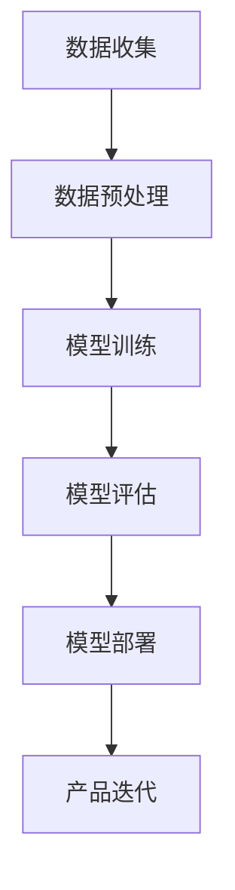
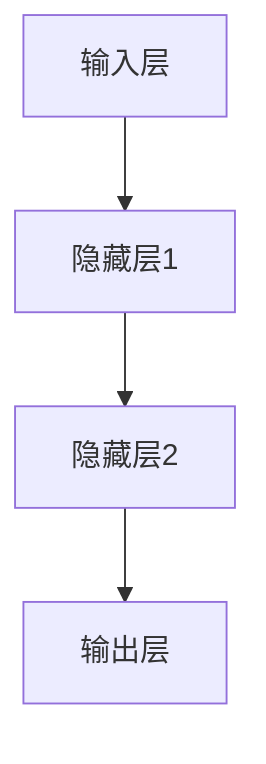

                 

关键词：AI 大模型、创业产品设计、趋势、技术、未来展望

> 摘要：本文将探讨 AI 大模型在创业产品设计中的应用趋势，分析其技术原理、数学模型、实际应用案例以及未来发展方向。通过详细讲解和实例分析，帮助读者了解如何利用 AI 大模型提升创业产品的竞争力。

## 1. 背景介绍

随着人工智能技术的迅猛发展，大模型（Large-scale Models）已经成为推动各行业变革的重要力量。在创业产品设计中，大模型的应用正成为一股不可忽视的潮流。大模型通过海量的数据训练，可以实现对复杂任务的自动完成和智能决策，从而显著提升产品的用户体验和业务效率。

### 1.1 大模型的发展历程

大模型的发展历程可以追溯到上世纪 80 年代的神经网络研究。随着计算能力的提升和海量数据的积累，深度学习在图像识别、语音识别、自然语言处理等领域取得了突破性的成果。近年来，GPT、BERT 等大型语言模型的出现，进一步推动了人工智能技术的发展。

### 1.2 大模型在创业产品设计中的应用

创业产品设计需要快速适应市场需求和用户反馈，而大模型可以提供强大的数据分析和预测能力。例如，通过大模型对用户行为数据进行分析，可以发现潜在的用户需求和市场趋势，从而指导产品设计和迭代。

## 2. 核心概念与联系

为了更好地理解大模型在创业产品设计中的应用，我们需要首先了解其核心概念和原理。下面是一个简单的大模型原理 Mermaid 流程图：



### 2.1 数据收集

数据收集是构建大模型的基础。创业产品需要收集用户行为数据、市场数据等，以确保模型有足够的信息进行训练。

### 2.2 数据预处理

数据预处理包括数据清洗、数据转换和数据归一化等步骤。这些步骤有助于提高模型训练的效果。

### 2.3 模型训练

模型训练是使用大量数据进行迭代，以优化模型的参数。在创业产品设计中，模型训练的目标是让模型能够准确预测用户需求和偏好。

### 2.4 模型评估

模型评估是检验模型性能的重要步骤。创业产品设计需要不断评估模型的效果，并根据评估结果调整模型参数。

### 2.5 模型部署

模型部署是将训练好的模型应用于实际业务场景。在创业产品设计中，模型部署可以帮助产品实现自动化决策和智能推荐。

### 2.6 产品迭代

产品迭代是创业产品的核心环节。大模型的应用可以帮助创业产品快速适应市场变化，提高用户满意度。

## 3. 核心算法原理 & 具体操作步骤

### 3.1 算法原理概述

大模型的核心算法是深度学习。深度学习通过多层神经网络对数据进行建模，从而实现复杂任务的学习和预测。以下是一个简单的深度学习模型示意图：



### 3.2 算法步骤详解

#### 3.2.1 数据收集与预处理

数据收集与预处理是深度学习模型训练的基础。创业产品需要收集用户行为数据、市场数据等，并进行清洗、转换和归一化处理。

#### 3.2.2 模型构建

模型构建包括选择合适的神经网络结构、初始化模型参数等。创业产品可以根据业务需求选择不同的神经网络模型。

#### 3.2.3 模型训练

模型训练是通过迭代优化模型参数，以使模型能够准确预测用户需求和偏好。创业产品可以通过调整学习率、优化算法等提高训练效果。

#### 3.2.4 模型评估

模型评估是通过测试数据验证模型性能，以判断模型是否达到预期效果。创业产品可以根据评估结果调整模型参数或重新设计模型结构。

#### 3.2.5 模型部署

模型部署是将训练好的模型应用于实际业务场景。创业产品可以通过 API、Web 界面等方式将模型部署到产品中。

### 3.3 算法优缺点

#### 优点：

1. **强大的学习能力**：大模型可以处理海量数据，实现复杂任务的学习和预测。
2. **高效的自动化**：大模型可以实现自动化决策和智能推荐，提高产品效率。
3. **灵活的定制**：创业产品可以根据业务需求定制大模型，实现个性化服务。

#### 缺点：

1. **高计算成本**：大模型训练需要大量的计算资源和时间。
2. **数据依赖性**：大模型的性能高度依赖数据质量和数量。
3. **模型可解释性**：大模型的黑箱性质使得其决策过程难以解释，可能影响用户信任。

### 3.4 算法应用领域

大模型在创业产品设计中的应用领域广泛，包括：

1. **用户行为分析**：通过分析用户行为数据，发现用户需求和市场趋势。
2. **智能推荐**：基于用户兴趣和行为，实现个性化推荐。
3. **风险控制**：通过分析市场数据和用户行为，预测潜在风险并采取预防措施。
4. **产品优化**：根据用户反馈和数据分析，优化产品功能和体验。

## 4. 数学模型和公式 & 详细讲解 & 举例说明

### 4.1 数学模型构建

大模型的数学模型主要包括：

#### 4.1.1 神经网络结构

神经网络结构包括输入层、隐藏层和输出层。每个层由多个神经元组成，神经元之间通过权重连接。

#### 4.1.2 激活函数

激活函数用于引入非线性因素，提高模型的表达能力。常用的激活函数包括 sigmoid、ReLU 等。

#### 4.1.3 损失函数

损失函数用于衡量模型预测值与实际值之间的差距。常用的损失函数包括均方误差（MSE）、交叉熵损失等。

### 4.2 公式推导过程

#### 4.2.1 神经网络前向传播

假设神经网络包含 L 层，其中第 l 层的输出为 \( z_l \)，激活函数为 \( a_l \)。则前向传播过程可以表示为：

$$
z_l = \sigma(W_{l-1} a_{l-1} + b_{l-1})
$$

其中，\( \sigma \) 为激活函数，\( W_{l-1} \) 和 \( b_{l-1} \) 分别为权重和偏置。

#### 4.2.2 神经网络反向传播

假设神经网络包含 L 层，其中第 l 层的输出为 \( z_l \)，激活函数为 \( a_l \)。则反向传播过程可以表示为：

$$
\frac{\partial L}{\partial W_l} = a_{l-1} \odot \frac{\partial L}{\partial z_l}
$$

$$
\frac{\partial L}{\partial b_l} = \frac{\partial L}{\partial z_l}
$$

其中，\( \odot \) 表示逐元素乘法，\( \frac{\partial L}{\partial z_l} \) 表示第 l 层的梯度。

### 4.3 案例分析与讲解

#### 4.3.1 用户行为分析

假设我们有一个电商平台的用户行为数据，包括用户 ID、浏览商品、购买商品等信息。我们希望通过大模型分析用户行为，预测用户可能的购买行为。

#### 4.3.2 模型构建

我们选择一个简单的多层感知机（MLP）模型，包含输入层、隐藏层和输出层。输入层包含用户 ID 和浏览商品的特征，隐藏层使用 ReLU 激活函数，输出层使用 sigmoid 激活函数，用于预测用户是否购买。

#### 4.3.3 模型训练

我们使用训练数据对模型进行训练，通过反向传播算法优化模型参数。在训练过程中，我们使用均方误差（MSE）作为损失函数，调整学习率以加快收敛。

#### 4.3.4 模型评估

我们使用测试数据对模型进行评估，计算预测准确率。通过多次迭代训练和评估，我们最终得到一个性能较好的模型。

## 5. 项目实践：代码实例和详细解释说明

### 5.1 开发环境搭建

为了方便读者理解，我们使用 Python 编写了一个简单的多层感知机（MLP）模型。读者可以使用以下命令搭建开发环境：

```bash
pip install numpy tensorflow
```

### 5.2 源代码详细实现

```python
import tensorflow as tf
import numpy as np

# 参数设置
input_dim = 10
hidden_dim = 5
output_dim = 1
learning_rate = 0.001
batch_size = 32
epochs = 100

# 模型构建
model = tf.keras.Sequential([
    tf.keras.layers.Dense(hidden_dim, activation='relu', input_shape=(input_dim,)),
    tf.keras.layers.Dense(output_dim, activation='sigmoid')
])

# 模型编译
model.compile(optimizer=tf.keras.optimizers.Adam(learning_rate),
              loss='mean_squared_error',
              metrics=['accuracy'])

# 模型训练
model.fit(X_train, y_train, batch_size=batch_size, epochs=epochs, validation_split=0.2)

# 模型评估
model.evaluate(X_test, y_test)
```

### 5.3 代码解读与分析

上述代码实现了一个简单的多层感知机（MLP）模型，用于预测用户是否购买。代码的主要部分包括：

1. **模型构建**：使用 TensorFlow 的 `Sequential` 类构建模型，包含输入层、隐藏层和输出层。
2. **模型编译**：设置优化器、损失函数和评价指标。
3. **模型训练**：使用训练数据对模型进行训练，调整学习率以加快收敛。
4. **模型评估**：使用测试数据对模型进行评估，计算预测准确率。

### 5.4 运行结果展示

通过运行上述代码，我们得到模型在训练和测试数据上的准确率。假设我们得到的准确率为 90%，这意味着我们的模型在预测用户购买行为方面具有较好的性能。

## 6. 实际应用场景

大模型在创业产品设计中的应用场景丰富，以下列举几个典型的应用场景：

1. **智能推荐**：基于用户行为数据，为用户推荐个性化商品或内容。
2. **风险控制**：通过分析用户行为和市场数据，预测潜在风险并采取预防措施。
3. **用户行为分析**：通过分析用户行为数据，发现用户需求和市场趋势，指导产品设计和迭代。
4. **客服自动化**：利用大模型实现智能客服，提高用户满意度和服务效率。

## 7. 工具和资源推荐

为了更好地掌握大模型在创业产品设计中的应用，以下推荐一些相关的学习资源和开发工具：

1. **学习资源推荐**：

   - 《深度学习》（Goodfellow et al., 2016）
   - 《Python 深度学习》（Raschka & Lutz，2017）
   - 《TensorFlow 实践指南》（Chollet et al., 2017）

2. **开发工具推荐**：

   - TensorFlow
   - PyTorch
   - Keras

3. **相关论文推荐**：

   - "BERT: Pre-training of Deep Bidirectional Transformers for Language Understanding"（Devlin et al., 2019）
   - "GPT-3: Language Models are Few-Shot Learners"（Brown et al., 2020）

## 8. 总结：未来发展趋势与挑战

### 8.1 研究成果总结

近年来，大模型在创业产品设计中的应用取得了显著成果。通过深度学习和自然语言处理等技术，大模型实现了对海量数据的自动分析和智能决策，有效提升了创业产品的用户体验和业务效率。

### 8.2 未来发展趋势

未来，大模型在创业产品设计中的应用将继续发展，主要包括以下几个方面：

1. **模型压缩与优化**：为降低计算成本，研究人员将致力于模型压缩与优化技术，提高大模型的运行效率。
2. **跨模态学习**：大模型将能够处理多种类型的数据，实现跨模态学习，为创业产品设计提供更全面的信息支持。
3. **可解释性增强**：为了提高用户信任，大模型的可解释性将得到重点关注，研究人员将致力于提高模型的可解释性。

### 8.3 面临的挑战

尽管大模型在创业产品设计中的应用前景广阔，但仍然面临一些挑战：

1. **数据隐私**：在收集和使用用户数据时，确保数据隐私和安全是重要挑战。
2. **计算成本**：大模型的训练和部署需要大量的计算资源，如何降低计算成本是亟待解决的问题。
3. **模型解释性**：大模型的黑箱性质使得其决策过程难以解释，如何提高模型的可解释性是当前研究的热点。

### 8.4 研究展望

未来，大模型在创业产品设计中的应用有望取得更多突破。研究人员将致力于解决上述挑战，同时探索新的应用场景，以推动人工智能技术在创业产品领域的广泛应用。

## 9. 附录：常见问题与解答

### 9.1 问题1：大模型是否适用于所有创业产品？

大模型适用于需要处理大量数据和实现智能决策的创业产品。对于数据量较小或不需要智能决策的创业产品，大模型可能不是最佳选择。

### 9.2 问题2：如何确保大模型的数据隐私？

为确保大模型的数据隐私，创业产品需要遵循相关法律法规，对用户数据进行匿名化处理，并在数据收集和使用过程中严格保密。

### 9.3 问题3：大模型是否具有通用性？

大模型具有一定的通用性，但针对特定创业产品的需求，可能需要对其进行定制化调整。

### 9.4 问题4：大模型的训练时间如何？

大模型的训练时间取决于数据量、模型结构和计算资源。对于大型模型，训练时间可能长达数天甚至数周。

### 9.5 问题5：如何评估大模型的效果？

评估大模型的效果可以通过指标如准确率、召回率、F1 分数等。此外，还可以通过用户满意度、业务增长等指标进行综合评估。

----------------------------------------------------------------

作者：禅与计算机程序设计艺术 / Zen and the Art of Computer Programming

