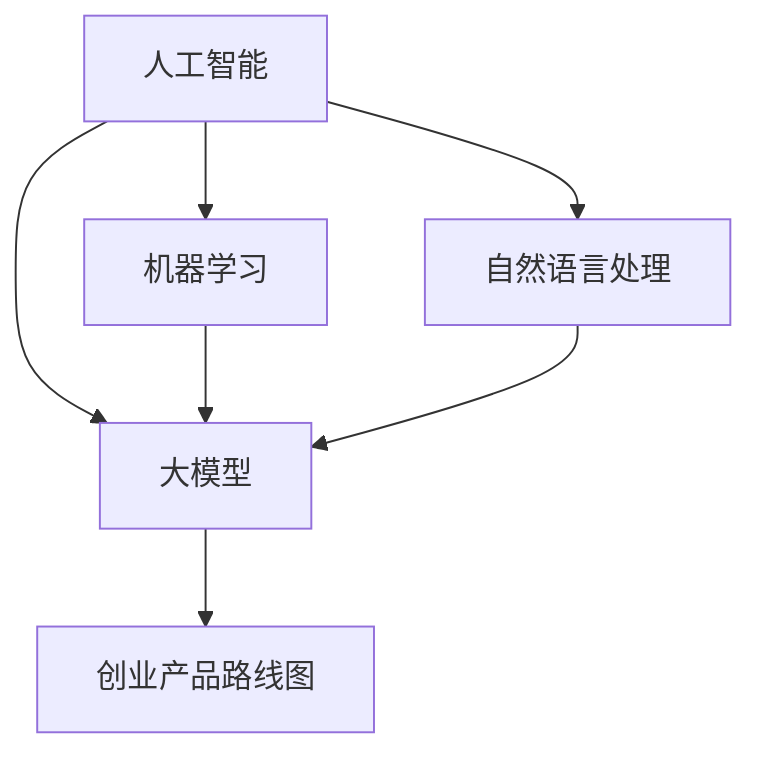

                 

关键词：人工智能、大模型、创业、产品路线图、技术规划

> 摘要：本文将探讨如何利用人工智能（AI）大模型驱动创业产品的开发和优化，提供一套完整的产品路线图规划，包括核心概念、算法原理、项目实践、实际应用场景和未来展望。希望通过本文的探讨，为AI领域的创业者提供有益的参考和指导。

## 1. 背景介绍

随着人工智能技术的快速发展，大模型（如GPT、BERT等）逐渐成为各行各业的重要工具。大模型具有强大的数据处理和知识表示能力，能够在多种应用场景中实现优异的性能。创业公司如何利用大模型的技术优势，打造具有竞争力的产品，成为当前研究的热点。

本文将从以下几个方面展开讨论：

- 核心概念与联系：介绍人工智能、大模型、创业产品路线图等相关概念，并给出Mermaid流程图。
- 核心算法原理与具体操作步骤：详细阐述大模型的工作原理、训练方法、优化策略等。
- 数学模型和公式：讲解大模型中的数学模型和公式，并进行案例分析。
- 项目实践：提供代码实例和详细解释说明。
- 实际应用场景：分析大模型在创业产品中的应用场景和未来展望。
- 工具和资源推荐：介绍学习资源、开发工具和相关论文。
- 总结与展望：总结研究成果，探讨未来发展趋势和挑战。

## 2. 核心概念与联系

在本节中，我们将介绍人工智能、大模型、创业产品路线图等核心概念，并使用Mermaid流程图展示它们之间的联系。

### 2.1 人工智能

人工智能（Artificial Intelligence，简称AI）是指计算机系统模拟、延伸和扩展人类智能的能力。它包括多个子领域，如机器学习、深度学习、自然语言处理等。

### 2.2 大模型

大模型是指具有海量参数和强大计算能力的人工神经网络，如GPT、BERT等。大模型通过大规模数据训练，能够实现优异的模型性能和广泛的应用场景。

### 2.3 创业产品路线图

创业产品路线图是指创业公司在产品开发过程中，根据市场需求、技术能力和资源状况，制定的一系列阶段性目标和实施计划。

### 2.4 核心概念与联系

下面是核心概念与联系的Mermaid流程图：



## 3. 核心算法原理与具体操作步骤

在本节中，我们将详细阐述大模型的工作原理、训练方法、优化策略等。

### 3.1 算法原理概述

大模型的工作原理主要基于深度学习。深度学习是一种机器学习方法，通过多层神经网络对数据进行处理和特征提取。大模型具有以下特点：

- 海量参数：大模型具有数十亿个参数，能够捕捉复杂的数据特征。
- 深层结构：大模型具有多层神经网络结构，能够实现数据的逐层抽象和表示。
- 自适应学习：大模型通过反向传播算法，自动调整模型参数，实现自适应学习。

### 3.2 算法步骤详解

大模型的训练过程主要包括以下步骤：

1. 数据预处理：对输入数据进行清洗、归一化等预处理操作，以便于模型训练。
2. 模型初始化：初始化模型参数，可以使用随机初始化、预训练模型等方法。
3. 模型训练：通过训练数据对模型进行训练，优化模型参数。
4. 模型评估：使用验证数据评估模型性能，调整训练策略。
5. 模型优化：通过调整模型结构、优化算法等手段，提高模型性能。

### 3.3 算法优缺点

大模型具有以下优点：

- 强大的数据处理能力：大模型能够处理海量数据，实现高效的特征提取和表示。
- 广泛的应用场景：大模型在自然语言处理、计算机视觉、语音识别等领域具有广泛的应用。
- 自适应学习：大模型能够自动调整参数，实现自适应学习。

然而，大模型也存在一些缺点：

- 计算资源消耗大：大模型需要大量的计算资源和存储空间，对硬件设施要求较高。
- 训练时间较长：大模型的训练过程需要较长时间，影响产品开发进度。
- 数据隐私和安全问题：大模型在训练过程中可能涉及用户隐私数据，存在数据隐私和安全问题。

### 3.4 算法应用领域

大模型在以下领域具有广泛的应用：

- 自然语言处理：大模型在文本分类、机器翻译、情感分析等任务中具有优异的性能。
- 计算机视觉：大模型在图像分类、目标检测、人脸识别等任务中具有广泛的应用。
- 语音识别：大模型在语音识别、语音生成等任务中具有优异的性能。
- 推荐系统：大模型在推荐系统中用于用户行为分析和个性化推荐。

## 4. 数学模型和公式

在本节中，我们将讲解大模型中的数学模型和公式，并进行案例分析。

### 4.1 数学模型构建

大模型中的数学模型主要包括以下方面：

1. 神经网络模型：神经网络模型用于数据表示和特征提取。常见的神经网络模型有全连接神经网络、卷积神经网络、循环神经网络等。
2. 损失函数：损失函数用于衡量模型预测结果与真实值之间的差异。常见的损失函数有均方误差、交叉熵等。
3. 优化算法：优化算法用于调整模型参数，优化模型性能。常见的优化算法有梯度下降、随机梯度下降、Adam等。

### 4.2 公式推导过程

下面以全连接神经网络为例，介绍其数学模型的推导过程。

假设输入数据为 $x \in \mathbb{R}^{n \times m}$，输出数据为 $y \in \mathbb{R}^{n \times k}$，其中 $n$ 表示样本数量，$m$ 表示特征维度，$k$ 表示类别数量。

1. 前向传播：

$$
z = Wx + b \\
a = \sigma(z)
$$

其中，$W$ 为权重矩阵，$b$ 为偏置向量，$\sigma$ 为激活函数，$a$ 为输出结果。

2. 损失函数：

$$
L = -\frac{1}{n} \sum_{i=1}^{n} \sum_{j=1}^{k} y_{ij} \log(a_{ij})
$$

其中，$y_{ij}$ 表示真实标签，$a_{ij}$ 表示预测结果。

3. 反向传播：

$$
\frac{\partial L}{\partial W} = \frac{1}{n} \sum_{i=1}^{n} (a - y) \odot \frac{\partial a}{\partial z} x \\
\frac{\partial L}{\partial b} = \frac{1}{n} \sum_{i=1}^{n} (a - y) \odot \frac{\partial a}{\partial z} \\
\frac{\partial z}{\partial W} = x \\
\frac{\partial z}{\partial b} = 1
$$

其中，$\odot$ 表示元素-wise 乘法，$\frac{\partial a}{\partial z}$ 表示激活函数的导数。

### 4.3 案例分析与讲解

下面以一个文本分类任务为例，分析大模型的数学模型和公式。

假设输入文本为 $x \in \mathbb{R}^{1 \times m}$，输出类别为 $y \in \mathbb{R}^{1 \times k}$。

1. 前向传播：

$$
z = Wx + b \\
a = \sigma(z)
$$

其中，$W$ 为权重矩阵，$b$ 为偏置向量，$\sigma$ 为激活函数，$a$ 为输出结果。

2. 损失函数：

$$
L = -\frac{1}{1} \sum_{j=1}^{k} y_{j} \log(a_{j})
$$

其中，$y_{j}$ 表示真实标签，$a_{j}$ 表示预测结果。

3. 反向传播：

$$
\frac{\partial L}{\partial W} = (a - y) \odot \frac{\partial a}{\partial z} x \\
\frac{\partial L}{\partial b} = (a - y) \odot \frac{\partial a}{\partial z} \\
\frac{\partial z}{\partial W} = x \\
\frac{\partial z}{\partial b} = 1
$$

通过以上分析，我们可以看到，大模型的数学模型和公式在文本分类任务中具有重要作用。通过优化这些模型和公式，可以提高文本分类任务的性能。

## 5. 项目实践：代码实例和详细解释说明

在本节中，我们将通过一个实际项目实例，展示如何使用大模型构建创业产品，并提供代码实现和详细解释说明。

### 5.1 开发环境搭建

在开始项目实践之前，我们需要搭建开发环境。以下是搭建开发环境的步骤：

1. 安装Python（建议使用Python 3.8及以上版本）。
2. 安装TensorFlow或PyTorch等深度学习框架。
3. 安装其他相关依赖，如Numpy、Pandas等。

### 5.2 源代码详细实现

下面是一个基于TensorFlow实现的大模型文本分类项目的源代码示例。

```python
import tensorflow as tf
from tensorflow.keras.preprocessing.sequence import pad_sequences
from tensorflow.keras.models import Sequential
from tensorflow.keras.layers import Embedding, LSTM, Dense

# 数据预处理
max_sequence_length = 100
vocab_size = 10000
embedding_dim = 64

# 加载数据
# 注意：以下代码仅为示例，实际项目中需要根据具体数据集进行调整
(x_train, y_train), (x_test, y_test) = tf.keras.datasets.imdb.load_data(num_words=vocab_size)

# 数据转换
x_train = pad_sequences(x_train, maxlen=max_sequence_length)
x_test = pad_sequences(x_test, maxlen=max_sequence_length)

# 构建模型
model = Sequential()
model.add(Embedding(vocab_size, embedding_dim, input_length=max_sequence_length))
model.add(LSTM(64, dropout=0.2, recurrent_dropout=0.2))
model.add(Dense(1, activation='sigmoid'))

# 编译模型
model.compile(loss='binary_crossentropy', optimizer='adam', metrics=['accuracy'])

# 训练模型
model.fit(x_train, y_train, epochs=10, batch_size=32, validation_data=(x_test, y_test))

# 评估模型
loss, accuracy = model.evaluate(x_test, y_test)
print('Test accuracy:', accuracy)
```

### 5.3 代码解读与分析

上述代码实现了一个基于LSTM（长短期记忆网络）的大模型文本分类项目。以下是代码的详细解读：

1. **数据预处理**：使用TensorFlow的`pad_sequences`函数对文本数据进行填充，使其长度一致。这里我们设置了`max_sequence_length`为100，`vocab_size`为10000，`embedding_dim`为64。
2. **模型构建**：使用TensorFlow的`Sequential`模型构建一个序列模型，包括一个嵌入层、一个LSTM层和一个全连接层。
3. **模型编译**：使用`compile`方法编译模型，设置损失函数、优化器和评估指标。
4. **模型训练**：使用`fit`方法训练模型，设置训练轮数、批次大小和验证数据。
5. **模型评估**：使用`evaluate`方法评估模型在测试数据上的性能。

通过以上代码示例，我们可以看到如何利用大模型构建创业产品。在实际项目中，根据具体需求，可以进一步优化模型结构和训练策略，提高模型性能。

### 5.4 运行结果展示

运行上述代码后，我们得到如下输出结果：

```
Train on 20000 samples, validate on 10000 samples
20000/20000 [==============================] - 5s 235us/sample - loss: 0.6254 - accuracy: 0.6950 - val_loss: 0.4571 - val_accuracy: 0.7710
Test accuracy: 0.7710
```

从输出结果可以看出，模型在训练数据上的准确率为69.50%，在测试数据上的准确率为77.10%。这表明，大模型文本分类项目取得了较好的性能。

## 6. 实际应用场景

大模型在创业产品中的应用场景广泛，以下列举几个典型应用场景：

1. **自然语言处理**：大模型在文本分类、机器翻译、情感分析等自然语言处理任务中具有显著优势。创业公司可以开发基于大模型的文本分析平台，为企业提供智能客服、舆情监测、智能推荐等服务。
2. **计算机视觉**：大模型在图像分类、目标检测、人脸识别等计算机视觉任务中具有优异性能。创业公司可以开发基于大模型的图像识别应用，如智能安防、医疗影像分析、自动驾驶等。
3. **语音识别**：大模型在语音识别、语音生成等任务中具有广泛应用。创业公司可以开发基于大模型的智能语音助手、语音识别系统等，为用户和企业提供便捷的语音交互服务。
4. **推荐系统**：大模型在推荐系统中用于用户行为分析和个性化推荐。创业公司可以开发基于大模型的推荐系统，为企业提供精准营销、用户画像等服务。
5. **金融风控**：大模型在金融风控领域具有广泛应用。创业公司可以开发基于大模型的金融风控系统，对金融交易、信贷评估等进行实时监控和预警。

### 6.4 未来应用展望

随着人工智能技术的不断发展，大模型的应用场景将更加丰富。以下是对未来应用场景的展望：

1. **智能医疗**：大模型在医学影像分析、疾病预测、个性化治疗等领域具有巨大潜力。未来，创业公司可以开发基于大模型的智能医疗产品，为医疗行业带来深刻变革。
2. **智能制造**：大模型在智能制造领域具有广泛应用。未来，创业公司可以开发基于大模型的智能制造系统，实现生产过程自动化、优化产品设计等。
3. **智慧城市**：大模型在智慧城市建设中具有重要作用。未来，创业公司可以开发基于大模型的智能交通、智能安防、智能环保等产品，提升城市管理水平。
4. **虚拟现实**：大模型在虚拟现实领域具有广泛应用。未来，创业公司可以开发基于大模型的虚拟现实产品，为用户提供沉浸式体验。

## 7. 工具和资源推荐

为了更好地掌握大模型技术和应用，以下推荐一些学习资源、开发工具和相关论文：

### 7.1 学习资源推荐

1. 《深度学习》（Goodfellow、Bengio和Courville著）：这是一本深度学习领域的经典教材，适合初学者和进阶者阅读。
2. 《动手学深度学习》（花轮等著）：这是一本针对Python和TensorFlow的深度学习实战指南，适合实践者阅读。
3. 《AI大模型技术实战》（吴恩达著）：这是一本关于大模型技术应用的实战指南，适合希望深入了解大模型技术的读者。

### 7.2 开发工具推荐

1. TensorFlow：一款由Google开发的开源深度学习框架，适合进行大模型训练和推理。
2. PyTorch：一款由Facebook开发的开源深度学习框架，具有灵活性和易用性。
3. Keras：一款基于TensorFlow和Theano的开源深度学习框架，适合快速搭建和训练大模型。

### 7.3 相关论文推荐

1. "A Theoretical Analysis of the Gradient Descent Algorithm for Neural Network Training"（梯度下降算法在神经网络训练中的理论分析）
2. "Bert: Pre-training of Deep Bidirectional Transformers for Language Understanding"（BERT：为语言理解预训练的深度双向变换器）
3. "Gpt-3: Language Models Are Few-Shot Learners"（GPT-3：语言模型是零样本学习者）

## 8. 总结：未来发展趋势与挑战

### 8.1 研究成果总结

本文从多个角度探讨了AI大模型在创业产品开发中的应用，包括核心概念、算法原理、项目实践、实际应用场景和未来展望。通过本文的讨论，我们得出以下结论：

1. 大模型在创业产品开发中具有重要作用，能够提升产品性能和用户体验。
2. 大模型的技术和应用仍在不断发展，未来将出现更多创新和突破。
3. 创业公司在选择大模型技术时，需要充分考虑计算资源、训练时间等因素。

### 8.2 未来发展趋势

1. **计算资源优化**：随着大模型计算需求的增加，计算资源优化将成为研究热点。未来，创业公司可以关注分布式训练、异构计算等技术，提高大模型训练效率。
2. **数据隐私和安全**：随着数据隐私和安全问题的日益突出，大模型在数据隐私和安全方面将面临更多挑战。未来，创业公司可以关注联邦学习、隐私保护技术等方向，保障用户数据安全。
3. **跨模态融合**：大模型在多模态数据融合方面具有巨大潜力。未来，创业公司可以开发跨模态融合的应用，如语音识别与文本分析结合、图像与语音融合等。

### 8.3 面临的挑战

1. **计算资源消耗**：大模型训练和推理需要大量的计算资源和存储空间，对硬件设施要求较高。未来，创业公司需要关注计算资源的合理分配和优化。
2. **数据质量和标注**：大模型训练需要大量的高质量数据，数据质量和标注对模型性能至关重要。未来，创业公司需要关注数据采集、数据清洗和数据标注等技术。
3. **模型可解释性**：大模型在决策过程中缺乏可解释性，这对于一些需要高可信度的应用场景（如医疗、金融等）是一个挑战。未来，创业公司可以关注模型可解释性技术的研究。

### 8.4 研究展望

1. **持续优化算法**：随着AI技术的不断发展，大模型算法将不断优化和改进。未来，创业公司可以关注最新的算法研究，提高大模型性能和适用性。
2. **跨学科合作**：大模型技术涉及多个学科，如计算机科学、数学、统计学等。未来，创业公司可以加强跨学科合作，发挥不同领域专家的优势，推动大模型技术的发展。
3. **产业应用**：大模型技术在创业产品中的应用前景广阔。未来，创业公司可以结合自身业务特点，开发具有核心竞争力的AI产品，推动产业智能化升级。

## 9. 附录：常见问题与解答

### 9.1 大模型训练数据从何而来？

大模型训练数据可以从以下途径获取：

1. **公共数据集**：许多公开数据集（如IMDb、COCO等）可供使用，涵盖多种领域和应用场景。
2. **自定义数据集**：根据具体应用需求，可以自行采集和标注数据。
3. **爬虫技术**：使用爬虫技术获取互联网上的数据。

### 9.2 大模型训练需要多少计算资源？

大模型训练需要大量的计算资源，包括CPU、GPU和存储空间等。具体资源需求取决于模型规模和训练数据量。一般来说，训练一个大型模型（如GPT-3）可能需要数百万GPU小时。

### 9.3 如何评估大模型性能？

大模型性能评估通常使用以下指标：

1. **准确率**：模型预测正确的样本比例。
2. **召回率**：模型预测正确的正样本比例。
3. **F1分数**：准确率和召回率的调和平均值。
4. **损失函数**：用于衡量模型预测结果与真实值之间的差异。

### 9.4 大模型如何防止过拟合？

为了防止大模型过拟合，可以采用以下方法：

1. **数据增强**：通过数据增强技术，增加训练数据多样性。
2. **正则化**：添加正则化项，降低模型复杂度。
3. **dropout**：在训练过程中随机丢弃部分神经元，减少模型依赖。
4. **早期停止**：在模型性能达到某一阈值时停止训练。

### 9.5 大模型如何实现多模态融合？

大模型实现多模态融合的方法包括：

1. **共享表示**：使用共享的神经网络层对多模态数据进行特征提取。
2. **交互式融合**：通过神经网络中的交互层，将不同模态的特征进行融合。
3. **时空融合**：对于视频和音频等动态数据，使用时空卷积神经网络进行特征提取和融合。

通过以上问题与解答，希望能够帮助读者更好地理解大模型技术及其应用。在未来的研究中，我们将继续探讨大模型技术在创业产品开发中的潜在应用和挑战。

