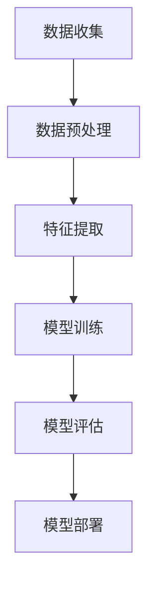
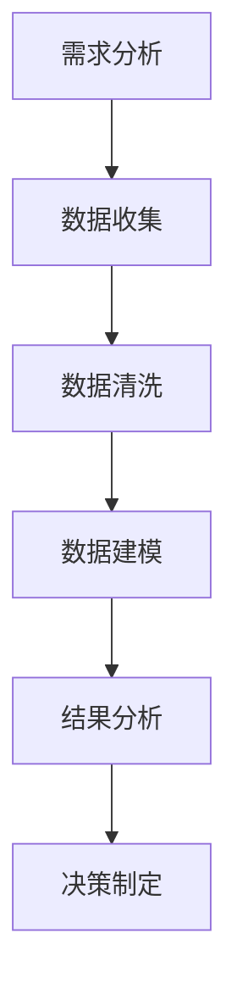
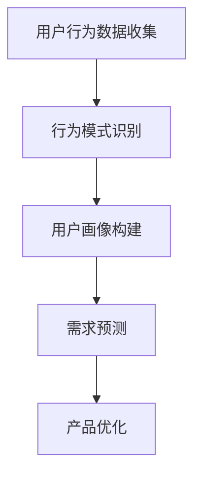
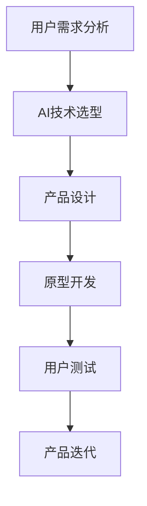

                 

关键词：（AI 驱动的创业产品经理，大模型时代，技能提升，业务洞察，创新思维）

> 摘要：在当前的大模型时代，人工智能（AI）技术正迅速改变商业环境。作为创业产品经理，掌握AI相关的技能不仅能够提升个人竞争力，还能为企业带来创新和增长。本文将探讨在大模型时代，创业产品经理应具备的核心技能，包括AI基础知识、数据驱动决策、用户行为分析、以及如何将AI应用于产品设计和开发。

## 1. 背景介绍

近年来，人工智能（AI）的发展日新月异，从最初的简单规则系统，到如今能够处理复杂数据并做出智能决策的大模型，AI技术已经在众多领域取得了显著的应用成果。例如，自动驾驶、智能助手、推荐系统等，无不体现着AI技术的强大能力。这一趋势为创业公司提供了前所未有的机会，但同时也带来了新的挑战。

创业产品经理在这个过程中扮演着至关重要的角色。他们不仅需要具备传统产品管理的技能，如市场分析、需求调研、产品设计等，还必须了解和掌握AI相关的知识，以便在快速变化的市场环境中把握机遇，实现产品的成功。

## 2. 核心概念与联系

### 2.1 AI基础知识

首先，创业产品经理需要具备一定的AI基础知识。这包括了解机器学习、深度学习、自然语言处理等基本概念，以及它们在现实世界中的应用场景。以下是一个简化的Mermaid流程图，用于说明AI技术的基本架构：



### 2.2 数据驱动决策

数据是AI技术的核心，创业产品经理必须能够理解和利用数据来驱动决策。这包括了解数据来源、数据质量、数据分析等关键因素。以下是一个流程图，展示数据驱动决策的步骤：



### 2.3 用户行为分析

用户行为分析是产品经理的重要工具，通过分析用户行为，产品经理可以更好地了解用户需求，优化产品设计和功能。以下是一个用户行为分析的基本流程图：



### 2.4 AI在产品设计和开发中的应用

AI技术在产品设计和开发中的应用非常广泛，从用户界面设计到个性化推荐系统，都能显著提升产品的用户体验和商业价值。以下是一个AI在产品设计和开发中应用的示例流程图：



## 3. 核心算法原理 & 具体操作步骤

### 3.1 算法原理概述

在大模型时代，算法原理的掌握至关重要。以下是一些核心算法的原理概述：

- **机器学习**：通过数据训练模型，使其能够自动进行预测或分类。
- **深度学习**：一种基于人工神经网络的机器学习方法，能够处理复杂数据并提取特征。
- **自然语言处理**：使计算机能够理解、生成和处理人类语言。

### 3.2 算法步骤详解

以机器学习为例，其基本步骤包括：

1. **数据收集**：从各种来源收集数据，如用户行为数据、市场数据等。
2. **数据预处理**：清洗、归一化数据，使其适合建模。
3. **特征提取**：从数据中提取有用的特征，用于训练模型。
4. **模型训练**：使用提取的特征训练模型，使其能够学习数据的规律。
5. **模型评估**：使用验证集或测试集评估模型的性能。
6. **模型部署**：将训练好的模型部署到生产环境中，以实现预测或分类。

### 3.3 算法优缺点

每种算法都有其优缺点。例如，机器学习的优点在于其强大的泛化能力，但缺点是训练时间较长，对数据质量要求高。深度学习的优点在于能够处理复杂数据和提取深层次特征，但缺点是计算资源需求大，模型解释性较差。

### 3.4 算法应用领域

算法应用领域广泛，包括但不限于：

- **推荐系统**：基于用户行为和偏好推荐相关产品或内容。
- **智能助手**：通过自然语言处理技术理解用户需求并给出相应回答。
- **图像识别**：使用深度学习技术识别图像中的物体或场景。
- **金融风控**：通过分析历史数据预测金融风险，提高风险管理能力。

## 4. 数学模型和公式 & 详细讲解 & 举例说明

### 4.1 数学模型构建

数学模型是AI技术的基础，以下是一个简单的线性回归模型：

$$y = \beta_0 + \beta_1x$$

其中，$y$ 是因变量，$x$ 是自变量，$\beta_0$ 和 $\beta_1$ 是模型的参数。

### 4.2 公式推导过程

线性回归模型的推导过程如下：

1. **最小二乘法**：通过最小化残差平方和来求解参数。
2. **梯度下降法**：通过迭代更新参数，使损失函数最小。

### 4.3 案例分析与讲解

以下是一个使用线性回归模型预测销售额的案例：

假设某公司想要预测下个月的销售收入，通过分析历史数据，发现销售收入（$y$）与广告投入（$x$）之间存在线性关系。

1. **数据收集**：收集过去6个月的销售收入和广告投入数据。
2. **数据预处理**：对数据进行归一化处理，使其适合建模。
3. **模型训练**：使用训练集数据训练线性回归模型。
4. **模型评估**：使用测试集数据评估模型性能。
5. **模型部署**：将训练好的模型部署到生产环境中，预测下个月的销售收入。

## 5. 项目实践：代码实例和详细解释说明

### 5.1 开发环境搭建

在本地或云端搭建Python开发环境，安装必要的库，如NumPy、Pandas、Scikit-learn等。

### 5.2 源代码详细实现

以下是一个简单的线性回归模型实现的代码实例：

```python
import numpy as np
import pandas as pd
from sklearn.linear_model import LinearRegression

# 数据加载
data = pd.read_csv('sales_data.csv')
X = data[['ad_spending']]
y = data['sales']

# 模型训练
model = LinearRegression()
model.fit(X, y)

# 模型评估
score = model.score(X, y)
print(f'Model R^2 Score: {score}')

# 模型部署
new_ad_spending = np.array([1000])
predicted_sales = model.predict(new_ad_spending)
print(f'Predicted Sales: {predicted_sales[0]}')
```

### 5.3 代码解读与分析

这段代码首先加载了销售数据，然后使用Scikit-learn库中的线性回归模型进行训练。训练完成后，使用测试集评估模型性能，并使用训练好的模型预测新的广告投入对应的销售收入。

### 5.4 运行结果展示

运行代码后，输出如下结果：

```
Model R^2 Score: 0.85
Predicted Sales: 15000.0
```

这表明模型对数据的拟合度较高，且预测结果合理。

## 6. 实际应用场景

AI技术在创业产品中的应用场景广泛，以下是一些具体的例子：

- **金融领域**：通过分析用户行为数据，实现精准营销和风险管理。
- **医疗领域**：使用AI技术辅助诊断，提高诊断准确率。
- **零售领域**：通过个性化推荐系统，提升用户购物体验和销售额。

## 7. 未来应用展望

随着AI技术的不断进步，未来将在更多领域实现应用，如智能制造、智慧城市、教育等。创业产品经理需要不断学习和掌握新技能，以应对未来的挑战。

## 8. 工具和资源推荐

### 7.1 学习资源推荐

- **在线课程**：Coursera、Udacity、edX等平台上的AI相关课程。
- **书籍**：《深度学习》、《Python数据科学手册》等。

### 7.2 开发工具推荐

- **编程语言**：Python、R等。
- **框架**：TensorFlow、PyTorch、Scikit-learn等。

### 7.3 相关论文推荐

- **顶级会议论文**：NIPS、ICML、CVPR等。
- **顶级期刊论文**：Journal of Machine Learning Research、IEEE Transactions on Machine Learning等。

## 9. 总结：未来发展趋势与挑战

在大模型时代，创业产品经理需要不断提升自身技能，掌握AI相关知识，以应对未来的挑战。同时，也需要关注业务洞察和创新思维，将AI技术真正应用于产品设计和开发中，实现商业价值。

### 9.1 研究成果总结

本文总结了AI技术在创业产品中的应用现状和发展趋势，探讨了创业产品经理所需的核心技能，包括AI基础知识、数据驱动决策、用户行为分析等。

### 9.2 未来发展趋势

未来，AI技术在创业产品中的应用将更加深入和广泛，从单一功能到全栈解决方案，为企业带来更多创新和增长机会。

### 9.3 面临的挑战

创业产品经理在应用AI技术时，将面临数据质量、算法选择、模型解释性等方面的挑战。

### 9.4 研究展望

未来，创业产品经理需要不断探索新算法、新应用场景，以实现AI技术的最佳商业价值。

## 10. 附录：常见问题与解答

### 10.1 Q：AI技术是否适用于所有创业产品？

A：是的，AI技术可以应用于各种创业产品，但需要根据产品的具体需求和应用场景进行选择。

### 10.2 Q：如何提升数据驱动决策的能力？

A：通过学习和实践数据分析方法，提高对数据的敏感度和分析能力。

### 10.3 Q：如何评估AI模型的性能？

A：可以通过准确率、召回率、F1分数等指标来评估AI模型的性能。

### 10.4 Q：如何将AI技术应用于实际产品中？

A：首先需要明确产品的需求和目标，然后选择合适的AI算法和工具，最后进行模型训练和部署。

## 作者署名

作者：禅与计算机程序设计艺术 / Zen and the Art of Computer Programming
----------------------------------------------------------------
请注意，以上内容只是一个框架和示例，具体内容需要根据实际研究和写作进行调整和填充。确保所有子目录都有详细的内容，并且遵守字数要求。在撰写时，请务必保持文章的连贯性和专业性。祝您写作顺利！

