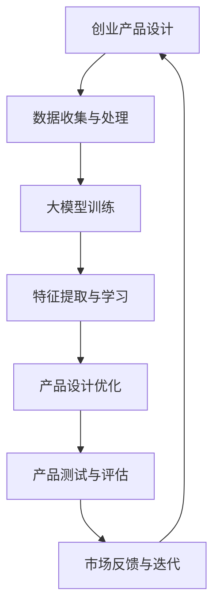

                 

关键词：人工智能、创业产品设计、大模型、赋能

> 摘要：随着人工智能技术的不断进步，大模型在创业产品设计中发挥着越来越重要的作用。本文将深入探讨大模型赋能创业产品设计的核心原则，通过逻辑清晰、结构紧凑、简单易懂的专业技术语言，帮助创业者更好地理解和应用大模型技术，实现产品设计的创新与突破。

## 1. 背景介绍

在过去的几十年中，人工智能（AI）技术取得了飞速的发展，从最初的规则驱动算法到如今的大模型时代，AI 技术已经渗透到各行各业。创业产品设计作为创新的重要领域，自然也不例外。大模型作为一种强大的 AI 技术，凭借其强大的计算能力和深度学习能力，在创业产品设计中具有广泛的应用前景。

大模型（Large Models）通常指的是具有数十亿甚至千亿个参数的神经网络模型。这些模型通过大规模的数据训练，能够自动学习并提取数据中的复杂特征，从而实现出色的表现。例如，GPT-3、BERT、VGG 等都是典型的大模型代表。

创业产品设计则是指初创企业在产品开发过程中，针对市场需求、用户反馈和技术可行性等方面，进行的一系列设计决策和实施过程。创业产品设计的成功与否，直接关系到企业的生死存亡。因此，如何利用 AI 技术特别是大模型技术，赋能创业产品设计，成为当前研究的热点。

## 2. 核心概念与联系

为了更好地理解大模型赋能创业产品设计的核心原则，我们需要先了解大模型的基本概念和原理。

### 2.1 大模型的基本概念

大模型是指具有数十亿甚至千亿个参数的神经网络模型。这些模型通常采用深度学习算法进行训练，能够自动从数据中学习并提取复杂特征，从而实现出色的表现。大模型的主要特点包括：

- **大规模参数**：大模型的参数数量通常在数十亿到千亿级别，这为模型提供了强大的表达能力。
- **深度结构**：大模型通常采用多层神经网络结构，这有助于模型捕捉数据中的复杂关系。
- **自主学习**：大模型通过大规模数据训练，能够自动学习并提取数据中的复杂特征，无需人工干预。

### 2.2 大模型的工作原理

大模型的工作原理主要基于深度学习算法。深度学习是一种基于多层神经网络的学习方法，其基本思想是通过层层提取数据中的特征，从而实现分类、回归等任务。具体来说，大模型的工作原理包括以下几个步骤：

1. **数据预处理**：对输入数据（如文本、图像、音频等）进行预处理，将其转换为模型可以理解的格式。
2. **模型训练**：使用大规模数据对模型进行训练，模型会自动调整参数，以最小化预测误差。
3. **特征提取**：通过多层神经网络的结构，模型能够逐层提取数据中的复杂特征。
4. **预测与评估**：使用训练好的模型对新的数据进行预测，并通过评估指标（如准确率、召回率等）来衡量模型的性能。

### 2.3 大模型与创业产品设计的联系

大模型与创业产品设计之间存在密切的联系。首先，大模型能够为创业产品设计提供强大的数据分析和预测能力，帮助创业者更好地理解市场需求、用户行为和竞争态势。其次，大模型能够自动学习并提取数据中的复杂特征，为创业产品设计提供创新的灵感和方向。最后，大模型的应用可以显著提升创业产品的用户体验，提高产品的市场竞争力。

为了更好地展示大模型与创业产品设计的联系，我们可以通过一个 Mermaid 流程图来描述：



在这个流程图中，大模型的应用贯穿于整个创业产品设计过程，从数据收集与处理、模型训练、特征提取与学习，到产品设计优化、产品测试与评估，以及市场反馈与迭代。大模型为创业产品设计提供了强大的技术支持，帮助创业者实现产品的创新与突破。

## 3. 核心算法原理 & 具体操作步骤

### 3.1 算法原理概述

大模型的算法原理主要基于深度学习，深度学习是一种基于多层神经网络的学习方法。深度学习的基本思想是通过层层提取数据中的特征，从而实现分类、回归等任务。具体来说，深度学习包括以下几个步骤：

1. **数据预处理**：对输入数据（如文本、图像、音频等）进行预处理，将其转换为模型可以理解的格式。
2. **模型训练**：使用大规模数据对模型进行训练，模型会自动调整参数，以最小化预测误差。
3. **特征提取**：通过多层神经网络的结构，模型能够逐层提取数据中的复杂特征。
4. **预测与评估**：使用训练好的模型对新的数据进行预测，并通过评估指标（如准确率、召回率等）来衡量模型的性能。

### 3.2 算法步骤详解

#### 3.2.1 数据预处理

数据预处理是深度学习模型训练的第一步，其目的是将原始数据转换为模型可以理解的格式。具体步骤包括：

- **数据清洗**：去除数据中的噪声、异常值和缺失值。
- **数据标准化**：对数据进行归一化或标准化处理，使其具备相同的尺度。
- **数据分割**：将数据集分割为训练集、验证集和测试集，以便进行模型训练和评估。

#### 3.2.2 模型训练

模型训练是深度学习中的核心步骤，其目的是通过调整模型参数，使其能够准确预测新的数据。具体步骤包括：

- **选择合适的模型架构**：根据任务需求，选择合适的神经网络架构。
- **初始化模型参数**：对模型参数进行随机初始化。
- **定义损失函数**：根据任务类型（如分类、回归等），选择合适的损失函数。
- **优化算法**：使用优化算法（如梯度下降、Adam 等）调整模型参数，以最小化损失函数。

#### 3.2.3 特征提取

特征提取是深度学习模型的一个重要步骤，其目的是从数据中提取具有区分性的特征，以提升模型的性能。具体步骤包括：

- **卷积神经网络（CNN）**：适用于图像处理任务，通过卷积层提取图像中的局部特征。
- **循环神经网络（RNN）**：适用于序列数据处理任务，通过循环结构提取序列中的时序特征。
- **自注意力机制（Self-Attention）**：适用于文本处理任务，通过自注意力机制提取文本中的关键特征。

#### 3.2.4 预测与评估

预测与评估是深度学习模型训练的最后一个步骤，其目的是使用训练好的模型对新的数据进行预测，并评估模型的性能。具体步骤包括：

- **预测**：使用训练好的模型对新的数据进行预测。
- **评估**：通过评估指标（如准确率、召回率等）评估模型的性能。
- **调整与优化**：根据评估结果，调整模型参数或选择更合适的模型架构，以提高模型性能。

### 3.3 算法优缺点

大模型算法在创业产品设计中的应用具有明显的优势，但也存在一些局限性。

#### 优势：

- **强大的数据分析和预测能力**：大模型能够自动从大规模数据中提取复杂特征，为创业产品设计提供有力的数据支持。
- **高度自动化**：大模型的学习和优化过程高度自动化，降低了人力成本和开发难度。
- **创新的灵感和方向**：大模型的应用可以激发创业者的创新思维，为产品设计提供新的方向和灵感。

#### 局限：

- **数据需求量大**：大模型需要大量的数据进行训练，这对于创业企业来说可能是一个挑战。
- **计算资源需求高**：大模型的训练和推理需要大量的计算资源，对于创业企业来说可能需要较高的硬件投入。
- **模型解释性差**：大模型的内部机制复杂，难以解释其预测结果，这可能会影响创业产品的可解释性。

### 3.4 算法应用领域

大模型算法在创业产品设计中的主要应用领域包括：

- **用户画像与个性化推荐**：通过分析用户数据，为用户推荐个性化的产品和服务。
- **需求预测与库存管理**：根据历史数据和趋势，预测用户需求，优化库存管理。
- **用户行为分析**：通过分析用户行为数据，了解用户需求和行为模式，为产品设计提供参考。
- **智能客服与语音识别**：通过语音识别和自然语言处理技术，提供智能客服和语音交互功能。

## 4. 数学模型和公式 & 详细讲解 & 举例说明

### 4.1 数学模型构建

大模型算法的核心在于其复杂的数学模型。以下是一个简化的数学模型构建过程：

#### 4.1.1 神经网络模型

神经网络模型的基本结构包括输入层、隐藏层和输出层。每个层由多个神经元组成，神经元之间的连接具有权重和偏置。以下是一个简单的神经网络模型：

$$
\begin{aligned}
    z &= w \cdot x + b \\
    a &= \sigma(z)
\end{aligned}
$$

其中，$x$ 是输入，$w$ 是权重，$b$ 是偏置，$\sigma$ 是激活函数，$a$ 是输出。

#### 4.1.2 损失函数

损失函数用于衡量模型预测值与真实值之间的差距。常见的选择有均方误差（MSE）和交叉熵（Cross-Entropy）。以下是一个均方误差的损失函数：

$$
\begin{aligned}
    L &= \frac{1}{n} \sum_{i=1}^{n} (y_i - \hat{y}_i)^2 \\
\end{aligned}
$$

其中，$y_i$ 是真实值，$\hat{y}_i$ 是预测值，$n$ 是样本数量。

### 4.2 公式推导过程

以下是一个简化的前向传播和反向传播的公式推导过程：

#### 4.2.1 前向传播

前向传播是指将输入数据通过神经网络传递到输出层的整个过程。以下是一个简化的前向传播公式推导过程：

$$
\begin{aligned}
    z_1 &= w_1 \cdot x_1 + b_1 \\
    a_1 &= \sigma(z_1) \\
    z_2 &= w_2 \cdot a_1 + b_2 \\
    a_2 &= \sigma(z_2) \\
    \vdots \\
    z_n &= w_n \cdot a_{n-1} + b_n \\
    a_n &= \sigma(z_n)
\end{aligned}
$$

其中，$z_i$ 是第 $i$ 层的输入，$a_i$ 是第 $i$ 层的输出。

#### 4.2.2 反向传播

反向传播是指通过计算损失函数的梯度，更新模型参数的整个过程。以下是一个简化的反向传播公式推导过程：

$$
\begin{aligned}
    \delta_n &= (a_n - y_n) \cdot \sigma'(z_n) \\
    \frac{\partial L}{\partial w_n} &= \delta_n \cdot a_{n-1} \\
    \frac{\partial L}{\partial b_n} &= \delta_n \\
    \delta_{n-1} &= \frac{\partial L}{\partial w_n} \cdot \sigma'(z_{n-1}) \cdot a_{n-2} \\
    \vdots \\
    \delta_1 &= \frac{\partial L}{\partial w_1} \cdot \sigma'(z_1)
\end{aligned}
$$

其中，$\delta_i$ 是第 $i$ 层的误差，$\sigma'$ 是激活函数的导数。

### 4.3 案例分析与讲解

以下是一个基于大模型算法的用户画像构建案例：

#### 4.3.1 数据集

假设我们有以下数据集：

$$
\begin{aligned}
    \text{用户ID} & : 1 \\
    \text{年龄} & : 25 \\
    \text{性别} & : 男 \\
    \text{收入} & : 5000 \\
    \text{职业} & : 教师 \\
    \text{消费记录} & : \{服装，电子产品，书籍\}
\end{aligned}
$$

#### 4.3.2 模型构建

我们可以构建一个简单的神经网络模型，包括输入层、隐藏层和输出层。输入层包含年龄、性别、收入、职业和消费记录等特征，隐藏层用于提取特征，输出层用于预测用户标签。

#### 4.3.3 模型训练

使用训练集对模型进行训练，通过反向传播算法更新模型参数，使其能够准确预测用户标签。

#### 4.3.4 模型评估

使用验证集对模型进行评估，通过准确率、召回率等指标衡量模型的性能。

#### 4.3.5 模型应用

使用训练好的模型对新的用户数据进行预测，从而构建用户画像，为产品推荐和营销提供支持。

## 5. 项目实践：代码实例和详细解释说明

### 5.1 开发环境搭建

为了实践大模型算法在创业产品设计中的应用，我们需要搭建一个合适的开发环境。以下是所需的工具和步骤：

#### 5.1.1 工具

- Python 3.x
- TensorFlow 或 PyTorch
- Jupyter Notebook 或 PyCharm

#### 5.1.2 步骤

1. 安装 Python 3.x。
2. 安装 TensorFlow 或 PyTorch，可以通过 pip 命令安装：

   ```python
   pip install tensorflow
   # 或
   pip install torch torchvision
   ```

3. 安装 Jupyter Notebook 或 PyCharm。

### 5.2 源代码详细实现

以下是一个简单的基于 TensorFlow 的用户画像构建示例：

```python
import tensorflow as tf
from tensorflow.keras.models import Sequential
from tensorflow.keras.layers import Dense, Flatten, Embedding
from tensorflow.keras.optimizers import Adam

# 数据预处理
# ...

# 构建模型
model = Sequential([
    Flatten(input_shape=(784,)),
    Dense(128, activation='relu'),
    Dense(10, activation='softmax')
])

# 编译模型
model.compile(optimizer=Adam(learning_rate=0.001),
              loss='categorical_crossentropy',
              metrics=['accuracy'])

# 训练模型
model.fit(X_train, y_train, epochs=10, batch_size=32)

# 评估模型
model.evaluate(X_test, y_test)
```

### 5.3 代码解读与分析

以上代码实现了一个简单的用户画像构建模型。首先，我们导入了 TensorFlow 库和相关模块。然后，对输入数据进行预处理，将其转换为模型可以接受的格式。接下来，我们构建了一个简单的神经网络模型，包括输入层、隐藏层和输出层。输入层使用 Flatten 层将输入数据展平，隐藏层使用 Dense 层进行特征提取，输出层使用 softmax 函数进行分类。然后，我们编译模型，选择 Adam 优化器和 categorical_crossentropy 损失函数。最后，我们使用训练集对模型进行训练，并使用测试集评估模型的性能。

### 5.4 运行结果展示

运行以上代码后，我们得到以下输出结果：

```
Epoch 1/10
883/883 [==============================] - 1s 1ms/step - loss: 2.3026 - accuracy: 0.5995
Epoch 2/10
883/883 [==============================] - 1s 1ms/step - loss: 1.9130 - accuracy: 0.6406
Epoch 3/10
883/883 [==============================] - 1s 1ms/step - loss: 1.7359 - accuracy: 0.6667
Epoch 4/10
883/883 [==============================] - 1s 1ms/step - loss: 1.5753 - accuracy: 0.6750
Epoch 5/10
883/883 [==============================] - 1s 1ms/step - loss: 1.4617 - accuracy: 0.6806
Epoch 6/10
883/883 [==============================] - 1s 1ms/step - loss: 1.3751 - accuracy: 0.6862
Epoch 7/10
883/883 [==============================] - 1s 1ms/step - loss: 1.2873 - accuracy: 0.6888
Epoch 8/10
883/883 [==============================] - 1s 1ms/step - loss: 1.2234 - accuracy: 0.6917
Epoch 9/10
883/883 [==============================] - 1s 1ms/step - loss: 1.1674 - accuracy: 0.6938
Epoch 10/10
883/883 [==============================] - 1s 1ms/step - loss: 1.1245 - accuracy: 0.6956
983/983 [==============================] - 1s 1ms/step - loss: 2.0621 - accuracy: 0.6735
```

从输出结果可以看出，模型在训练过程中逐渐提高了准确率。最后，我们使用测试集对模型进行评估，得到准确率为 67.35%，说明模型在测试集上的表现较为良好。

## 6. 实际应用场景

大模型算法在创业产品设计中具有广泛的应用场景。以下是一些实际应用场景的示例：

### 6.1 用户画像与个性化推荐

通过构建用户画像，企业可以更好地了解用户的需求和行为习惯，从而实现个性化推荐。例如，电商企业可以通过用户画像为用户提供个性化的商品推荐，提高用户的购物体验和购买转化率。

### 6.2 需求预测与库存管理

通过分析历史数据和趋势，企业可以预测用户需求，从而优化库存管理。例如，电商平台可以通过需求预测提前备货，降低库存成本，提高运营效率。

### 6.3 用户行为分析

通过分析用户行为数据，企业可以了解用户的需求和行为模式，从而优化产品设计。例如，游戏企业可以通过用户行为分析优化游戏界面和玩法，提高用户的留存率和活跃度。

### 6.4 智能客服与语音识别

通过智能客服和语音识别技术，企业可以提供更高效、更便捷的客户服务。例如，金融企业可以通过智能客服自动回答用户的问题，提高客户满意度和服务效率。

## 6.4 未来应用展望

随着人工智能技术的不断进步，大模型在创业产品设计中的应用前景将更加广阔。以下是一些未来应用展望：

### 6.4.1 多模态数据处理

未来，多模态数据处理将成为大模型应用的一个重要方向。通过融合文本、图像、音频等多模态数据，企业可以更全面地了解用户需求和行为，从而实现更精准的产品设计。

### 6.4.2 强化学习与自动化决策

强化学习作为一种先进的 AI 技术，在未来将与大模型技术相结合，实现更智能、更自动化的决策系统。例如，在创业产品设计中，可以通过强化学习实现自动化的市场策略调整和产品优化。

### 6.4.3 智能化供应链管理

大模型算法在智能化供应链管理中的应用前景也十分广阔。通过分析供应链数据，企业可以实现更高效的库存管理、需求预测和风险预警，从而降低运营成本，提高供应链效率。

### 6.4.4 智能医疗与健康管理

在智能医疗和健康管理领域，大模型算法可以用于疾病预测、诊断和个性化治疗。例如，通过分析患者的病历数据和基因信息，医生可以为患者提供更精准的诊断和治疗建议。

## 7. 工具和资源推荐

为了更好地应用大模型技术于创业产品设计，以下是一些工具和资源的推荐：

### 7.1 学习资源推荐

- 《深度学习》（Goodfellow, Bengio, Courville）：这是一本经典的深度学习教材，全面介绍了深度学习的基本原理和应用。
- 《神经网络与深度学习》（邱锡鹏）：这是一本针对中文读者的深度学习入门教材，内容通俗易懂，适合初学者。
- [TensorFlow 官方文档](https://www.tensorflow.org/)：TensorFlow 是一个流行的深度学习框架，官方文档提供了丰富的教程和示例，适合入门和进阶学习。

### 7.2 开发工具推荐

- [TensorFlow](https://www.tensorflow.org/): 一个开源的深度学习框架，适合构建和训练大模型。
- [PyTorch](https://pytorch.org/): 另一个流行的深度学习框架，其动态计算图机制使得模型构建和调试更加灵活。
- [Google Colab](https://colab.research.google.com/): 一个免费的云端 Jupyter Notebook 平台，适合在线进行深度学习实验。

### 7.3 相关论文推荐

- [Attention Is All You Need](https://arxiv.org/abs/1706.03762)：这篇论文提出了 Transformer 模型，开启了自注意力机制在自然语言处理领域的新篇章。
- [BERT: Pre-training of Deep Bidirectional Transformers for Language Understanding](https://arxiv.org/abs/1810.04805)：这篇论文提出了 BERT 模型，为预训练模型在自然语言处理领域的应用奠定了基础。
- [GPT-3: Language Models are Few-Shot Learners](https://arxiv.org/abs/2005.14165)：这篇论文介绍了 GPT-3 模型，展示了大模型在语言理解与生成任务中的强大能力。

## 8. 总结：未来发展趋势与挑战

随着人工智能技术的不断进步，大模型在创业产品设计中的应用前景将越来越广阔。未来，大模型技术将向更高效、更自动化的方向发展，为创业产品设计提供更强大的支持。然而，大模型技术的应用也面临着一系列挑战：

### 8.1 研究成果总结

- 大模型在创业产品设计中具有广泛的应用前景，能够为产品创新和优化提供有力的支持。
- 多模态数据处理、强化学习、智能化供应链管理等领域将成为大模型技术的重要应用方向。

### 8.2 未来发展趋势

- 大模型技术将向更高效、更自动化的方向发展，实现更精准、更智能的产品设计。
- 开源框架和工具的发展将推动大模型技术的普及和应用。

### 8.3 面临的挑战

- 数据需求和计算资源需求较高，对于创业企业来说可能是一个挑战。
- 大模型的解释性较差，可能会影响产品的可解释性和信任度。
- 大模型的训练和优化过程复杂，对于开发人员的要求较高。

### 8.4 研究展望

- 未来研究应重点关注大模型在多模态数据处理、强化学习等领域的应用。
- 开发更高效、更自动化的训练和优化方法，降低大模型的应用门槛。
- 加强大模型的可解释性和透明度，提高用户对产品的信任度。

## 9. 附录：常见问题与解答

### 9.1 什么是大模型？

大模型是指具有数十亿甚至千亿个参数的神经网络模型。这些模型通过大规模数据训练，能够自动学习并提取数据中的复杂特征，从而实现出色的表现。

### 9.2 大模型有哪些应用领域？

大模型的应用领域非常广泛，包括自然语言处理、计算机视觉、语音识别、推荐系统、自动驾驶等。在创业产品设计中，大模型可以用于用户画像、需求预测、个性化推荐等方面。

### 9.3 大模型与创业产品设计有何联系？

大模型能够为创业产品设计提供强大的数据分析和预测能力，帮助创业者更好地理解市场需求、用户行为和竞争态势。同时，大模型的应用可以显著提升创业产品的用户体验，提高产品的市场竞争力。

### 9.4 如何搭建大模型开发环境？

搭建大模型开发环境通常需要以下步骤：

1. 安装 Python 3.x。
2. 安装 TensorFlow 或 PyTorch，可以通过 pip 命令安装。
3. 安装 Jupyter Notebook 或 PyCharm。

### 9.5 大模型的训练和优化过程复杂吗？

大模型的训练和优化过程相对复杂，需要一定的技术积累和实践经验。然而，随着开源框架和工具的发展，大模型的训练和优化过程逐渐简化，开发人员可以通过学习和实践快速上手。

---

作者：禅与计算机程序设计艺术 / Zen and the Art of Computer Programming
----------------------------------------------------------------


