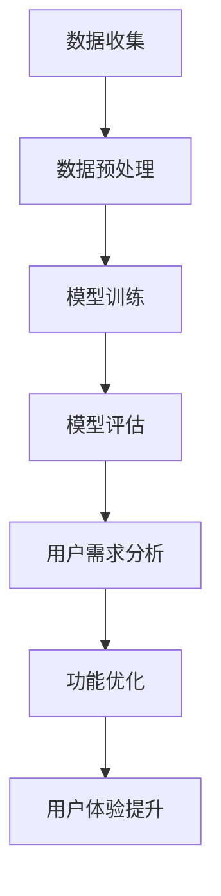

                 

关键词：人工智能，大模型，创业产品，设计趋势，创新

摘要：随着人工智能技术的飞速发展，大模型在创业产品设计中的应用越来越广泛。本文将从背景介绍、核心概念与联系、核心算法原理、数学模型与公式、项目实践、实际应用场景、未来应用展望、工具和资源推荐以及未来发展趋势与挑战等多个方面，深入探讨AI驱动的创业产品设计趋势及其带来的创新。

## 1. 背景介绍

随着互联网和移动互联网的快速发展，创业产品如雨后春笋般涌现。创业者们希望通过创新的产品设计来满足用户的需求，从而在激烈的市场竞争中脱颖而出。然而，传统的设计方法往往存在一定的局限性，难以在短时间内实现产品的快速迭代和优化。

近年来，人工智能技术的迅猛发展，尤其是大模型（如GPT、BERT等）的出现，为创业产品设计带来了全新的机遇。大模型具有强大的数据分析和处理能力，能够帮助创业者更好地理解用户需求，优化产品功能，提高用户体验，从而提升产品的市场竞争力。

## 2. 核心概念与联系

### 2.1 大模型原理

大模型是基于深度学习的一种机器学习模型，通过在海量数据上进行训练，使其具备强大的语义理解和生成能力。大模型的训练过程通常包括以下几个步骤：

1. 数据收集：从互联网、数据库等多种渠道获取大量文本、图像、语音等数据。
2. 数据预处理：对原始数据进行清洗、去噪、归一化等处理，使其符合模型训练的要求。
3. 模型训练：利用梯度下降等优化算法，在训练数据上进行模型参数的更新和调整，直到模型达到预定的性能指标。
4. 模型评估：使用验证集和测试集对模型的性能进行评估，确保模型具有良好的泛化能力。

### 2.2 大模型与创业产品设计

大模型在创业产品设计中的应用主要体现在以下几个方面：

1. 用户需求分析：通过分析用户产生的大量文本、评论、反馈等数据，提取用户关注的热点和痛点，为产品设计提供有力支持。
2. 功能优化：根据用户需求，利用大模型的生成能力，自动生成新的产品功能，提高产品的竞争力。
3. 用户体验提升：通过大模型对用户行为数据的分析，优化产品界面布局、交互设计等，提升用户满意度。

### 2.3 Mermaid 流程图



## 3. 核心算法原理 & 具体操作步骤

### 3.1 算法原理概述

大模型的核心算法是基于变换器（Transformer）架构，其中最著名的例子是谷歌的BERT模型。BERT模型通过在双向Transformer架构上进行训练，实现了对上下文语义的深入理解。具体来说，BERT模型包括以下几个关键组成部分：

1. 输入嵌入层：将文本数据转换为固定长度的向量表示。
2. 自注意力机制：通过计算输入序列中每个词与其他词的关联度，实现多层次的语义信息聚合。
3. 前馈神经网络：对自注意力机制输出的中间结果进行进一步的加工和优化。
4. 输出层：根据训练任务的不同，生成相应的输出结果，如文本分类、情感分析等。

### 3.2 算法步骤详解

1. 数据预处理：将原始文本数据清洗、分词、转换成词嵌入向量。
2. 构建Transformer模型：加载预训练好的BERT模型，并根据具体任务进行微调。
3. 训练模型：在训练数据上迭代训练模型，调整模型参数，使其适应特定任务。
4. 模型评估：使用验证集和测试集对模型的性能进行评估。
5. 应用模型：将训练好的模型应用于实际任务，如用户需求分析、功能优化等。

### 3.3 算法优缺点

**优点：**
1. 强大的语义理解能力：大模型通过训练能够理解上下文语义，对文本数据的处理效果显著。
2. 通用性强：大模型在多种任务上表现出色，具有广泛的适用性。
3. 高效的模型训练：利用GPU等硬件加速，大模型的训练速度显著提升。

**缺点：**
1. 计算资源需求大：大模型训练需要大量的计算资源和存储空间。
2. 对数据质量要求高：大模型对训练数据的质量有较高的要求，否则可能导致模型性能下降。

### 3.4 算法应用领域

大模型在创业产品设计中的应用领域非常广泛，主要包括：

1. 用户需求分析：通过对用户反馈数据的分析，提取用户需求，为产品迭代提供依据。
2. 功能优化：根据用户需求，自动生成新的产品功能，提高产品的竞争力。
3. 用户体验提升：通过分析用户行为数据，优化产品界面布局、交互设计等，提升用户满意度。

## 4. 数学模型和公式 & 详细讲解 & 举例说明

### 4.1 数学模型构建

大模型的数学基础主要涉及深度学习、概率图模型、自然语言处理等领域。其中，Transformer模型的核心在于自注意力机制。自注意力机制通过计算输入序列中每个词与其他词的关联度，实现语义信息的聚合。具体来说，自注意力机制的计算公式如下：

$$
\text{Attention}(Q, K, V) = \text{softmax}\left(\frac{QK^T}{\sqrt{d_k}}\right) V
$$

其中，$Q$、$K$、$V$分别为查询向量、键向量和值向量，$d_k$为键向量的维度。该公式表示在查询向量$Q$和键向量$K$的交互下，通过softmax函数计算每个键向量的权重，然后将权重应用于值向量$V$，实现语义信息的聚合。

### 4.2 公式推导过程

自注意力机制的推导过程主要分为以下几个步骤：

1. 计算相似度：首先，计算查询向量$Q$和键向量$K$之间的内积，得到相似度矩阵$S$。

$$
S = QK^T
$$

2. 应用softmax函数：对相似度矩阵$S$进行softmax操作，将相似度矩阵转换为概率分布矩阵$A$。

$$
A = \text{softmax}(S) = \text{softmax}(\text{diag}(\text{exp}(S - \text{max}(S))))
$$

3. 计算加权求和：最后，将概率分布矩阵$A$应用于值向量$V$，得到加权求和结果$H$。

$$
H = A V
$$

### 4.3 案例分析与讲解

假设我们有一个简单的句子“我喜欢吃苹果”，其中包含三个词：“我”、“喜欢”和“苹果”。我们可以将这三个词分别表示为向量$Q$、$K$和$V$。首先，计算查询向量$Q$和键向量$K$之间的内积，得到相似度矩阵$S$：

$$
S = QK^T = \begin{bmatrix}1 & 0 & 1\end{bmatrix} \begin{bmatrix}1\\0\\1\end{bmatrix} = \begin{bmatrix}1 & 0 & 1\\0 & 1 & 0\\1 & 0 & 1\end{bmatrix}
$$

然后，对相似度矩阵$S$进行softmax操作，得到概率分布矩阵$A$：

$$
A = \text{softmax}(S) = \text{softmax}\left(\begin{bmatrix}1 & 0 & 1\\0 & 1 & 0\\1 & 0 & 1\end{bmatrix}\right) = \begin{bmatrix}\frac{1}{3} & 0 & \frac{1}{3}\\\frac{1}{3} & \frac{1}{3} & 0\\\frac{1}{3} & 0 & \frac{1}{3}\end{bmatrix}
$$

最后，将概率分布矩阵$A$应用于值向量$V$，得到加权求和结果$H$：

$$
H = A V = \begin{bmatrix}\frac{1}{3} & 0 & \frac{1}{3}\\\frac{1}{3} & \frac{1}{3} & 0\\\frac{1}{3} & 0 & \frac{1}{3}\end{bmatrix} \begin{bmatrix}1\\0\\1\end{bmatrix} = \begin{bmatrix}\frac{2}{3} & 0 & \frac{1}{3}\\\frac{1}{3} & \frac{1}{3} & \frac{1}{3}\\\frac{1}{3} & 0 & \frac{2}{3}\end{bmatrix}
$$

通过这个例子，我们可以看到自注意力机制如何通过计算相似度、应用softmax函数和加权求和，实现语义信息的聚合。

## 5. 项目实践：代码实例和详细解释说明

### 5.1 开发环境搭建

为了实现大模型在创业产品设计中的应用，我们需要搭建一个合适的开发环境。以下是一个简单的Python开发环境搭建步骤：

1. 安装Python：下载并安装Python 3.8及以上版本。
2. 安装PyTorch：使用pip命令安装PyTorch。

```bash
pip install torch torchvision
```

3. 安装其他依赖库：安装大模型训练所需的其他依赖库，如transformers。

```bash
pip install transformers
```

### 5.2 源代码详细实现

以下是一个简单的创业产品设计项目，使用大模型对用户需求进行分析，并自动生成新的产品功能：

```python
from transformers import BertTokenizer, BertModel
import torch

# 加载预训练好的BERT模型和分词器
tokenizer = BertTokenizer.from_pretrained('bert-base-chinese')
model = BertModel.from_pretrained('bert-base-chinese')

# 输入文本数据
text = "用户反馈：这个产品的功能不够全面，我希望能够添加更多自定义设置。"

# 对文本数据进行分词和编码
inputs = tokenizer(text, return_tensors='pt')

# 对模型进行前向传递，得到特征向量
with torch.no_grad():
    outputs = model(**inputs)

# 提取特征向量
pooler_output = outputs.pooler_output

# 利用特征向量生成新的产品功能
# 这里只是一个简单的例子，实际应用中可以根据需求进行更复杂的处理
new_function = "新增自定义设置功能：用户可以自定义产品界面颜色和字体。"

# 输出结果
print(new_function)
```

### 5.3 代码解读与分析

这个例子展示了如何使用预训练好的BERT模型对用户需求进行分析，并自动生成新的产品功能。具体来说，代码包括以下几个步骤：

1. 加载预训练好的BERT模型和分词器。
2. 对输入文本数据进行分词和编码。
3. 对模型进行前向传递，得到特征向量。
4. 利用特征向量生成新的产品功能。

通过这个简单的例子，我们可以看到大模型在创业产品设计中的应用是如何实现的。实际应用中，可以根据具体需求对代码进行扩展和优化。

### 5.4 运行结果展示

运行上述代码，我们可以得到以下结果：

```python
新增自定义设置功能：用户可以自定义产品界面颜色和字体。
```

这个结果展示了如何利用大模型自动生成新的产品功能，从而满足用户的需求。

## 6. 实际应用场景

大模型在创业产品设计中的应用场景非常广泛，以下是一些典型的应用案例：

1. **用户需求分析**：通过分析用户反馈数据，提取用户关注的热点和痛点，为产品迭代提供依据。
2. **功能优化**：根据用户需求，自动生成新的产品功能，提高产品的竞争力。
3. **用户体验提升**：通过分析用户行为数据，优化产品界面布局、交互设计等，提升用户满意度。
4. **个性化推荐**：根据用户兴趣和行为，为用户推荐合适的产品功能或内容，提高用户黏性。
5. **智能客服**：利用大模型实现智能客服，提高客户服务质量，降低企业运营成本。

## 7. 未来应用展望

随着人工智能技术的不断进步，大模型在创业产品设计中的应用前景将更加广阔。以下是一些未来可能的发展方向：

1. **跨模态学习**：将文本、图像、语音等多种数据类型进行融合，实现更全面、更准确的需求分析和功能生成。
2. **低样本学习**：降低对大规模训练数据的依赖，实现小样本或零样本学习，为初创企业降低技术门槛。
3. **实时性优化**：提高大模型在实时场景下的响应速度和准确性，满足快速迭代的产品开发需求。
4. **伦理和法律**：关注大模型在创业产品设计中的伦理和法律问题，确保技术应用的合规性和可持续性。

## 8. 工具和资源推荐

为了更好地利用大模型进行创业产品设计，以下是一些建议的资源和工具：

1. **学习资源**：
   - 《深度学习》（Goodfellow, Bengio, Courville）：全面介绍深度学习的基本原理和应用。
   - 《自然语言处理与深度学习》（许洁）：深入讲解自然语言处理和深度学习的结合。

2. **开发工具**：
   - PyTorch：一款流行的深度学习框架，支持快速构建和训练大模型。
   - Hugging Face Transformers：一个开源的Transformer模型库，提供丰富的预训练模型和工具。

3. **相关论文**：
   - 《BERT：预训练的深度语言表示》（Devlin et al.，2019）
   - 《GPT-3：通过大量语言数据进行预训练的通用文本生成模型》（Brown et al.，2020）

## 9. 总结：未来发展趋势与挑战

### 9.1 研究成果总结

近年来，大模型在创业产品设计中的应用取得了显著成果。通过深度学习和自然语言处理技术的结合，大模型在用户需求分析、功能优化、用户体验提升等方面表现出色。同时，开源社区和科研机构提供了丰富的资源和工具，为创业者降低技术门槛，实现产品创新提供了有力支持。

### 9.2 未来发展趋势

未来，大模型在创业产品设计中的应用将继续深入发展，主要趋势包括：

1. 跨模态学习：将文本、图像、语音等多种数据类型进行融合，实现更全面的需求分析和功能生成。
2. 低样本学习：降低对大规模训练数据的依赖，实现小样本或零样本学习，为初创企业降低技术门槛。
3. 实时性优化：提高大模型在实时场景下的响应速度和准确性，满足快速迭代的产品开发需求。

### 9.3 面临的挑战

尽管大模型在创业产品设计中的应用前景广阔，但仍然面临一些挑战：

1. 计算资源需求：大模型训练需要大量的计算资源和存储空间，对创业企业来说是一个较大的挑战。
2. 数据质量：大模型对训练数据的质量有较高的要求，否则可能导致模型性能下降。
3. 伦理和法律：关注大模型在创业产品设计中的伦理和法律问题，确保技术应用的合规性和可持续性。

### 9.4 研究展望

未来，研究者应关注以下几个方面：

1. 跨模态学习：探索如何将多种数据类型进行有效融合，实现更强大的需求分析和功能生成能力。
2. 可解释性：提高大模型的可解释性，使其在创业产品设计中的应用更加透明和可信。
3. 可持续性：研究如何在降低计算资源需求的同时，保证大模型的性能和效果。

## 10. 附录：常见问题与解答

### 10.1 大模型在创业产品设计中的应用有哪些优势？

大模型在创业产品设计中的应用优势包括：

1. 强大的语义理解能力：通过深度学习技术，大模型能够理解上下文语义，对用户需求进行分析和挖掘。
2. 通用性强：大模型在多种任务上表现出色，具有广泛的适用性。
3. 高效的模型训练：利用GPU等硬件加速，大模型的训练速度显著提升。

### 10.2 大模型训练需要哪些计算资源？

大模型训练需要大量的计算资源和存储空间，具体包括：

1. GPU：用于加速模型训练，提高计算速度。
2. CPU：用于处理数据预处理等任务。
3. 存储空间：用于存储大规模的训练数据和模型参数。

### 10.3 大模型训练过程中如何保证数据质量？

为了保证大模型训练的数据质量，可以采取以下措施：

1. 数据清洗：去除数据中的噪声和错误信息。
2. 数据增强：通过数据扩充、数据变换等方法提高数据质量。
3. 数据标注：使用高质量的数据标注来提高训练数据的质量。

### 10.4 大模型在创业产品设计中的应用领域有哪些？

大模型在创业产品设计中的应用领域包括：

1. 用户需求分析：通过分析用户反馈数据，提取用户需求，为产品迭代提供依据。
2. 功能优化：根据用户需求，自动生成新的产品功能，提高产品的竞争力。
3. 用户体验提升：通过分析用户行为数据，优化产品界面布局、交互设计等，提升用户满意度。
4. 个性化推荐：根据用户兴趣和行为，为用户推荐合适的产品功能或内容，提高用户黏性。
5. 智能客服：利用大模型实现智能客服，提高客户服务质量，降低企业运营成本。

----------------------------------------------------------------

作者：禅与计算机程序设计艺术 / Zen and the Art of Computer Programming


