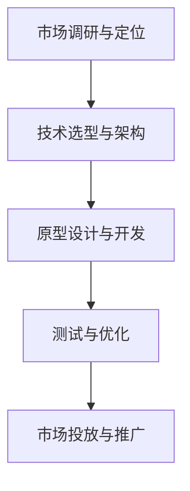

                 

关键词：AI 驱动，创业产品，路线图规划，大模型，赋能

> 摘要：随着人工智能技术的飞速发展，大模型在各个领域的应用日益广泛。本文将探讨如何利用大模型为创业产品提供技术赋能，并详细规划创业产品的路线图，以实现从概念验证到市场投放的全程指导。

## 1. 背景介绍

在当今全球竞争激烈的市场环境中，创业公司面临着前所未有的挑战和机遇。人工智能（AI）技术的快速发展，特别是大模型的突破，为创业公司提供了前所未有的技术赋能。大模型，如GPT、BERT、BERT-Large等，具有强大的数据处理能力和知识储备，可以处理海量数据，发现潜在模式，从而为创业产品提供智能化的解决方案。

### 大模型的优势

1. **强大的数据处理能力**：大模型能够处理和分析大量数据，从中提取有价值的信息，为产品提供精确的决策支持。
2. **自适应能力**：大模型能够根据新的数据和反馈不断调整和优化自身，适应不断变化的市场需求。
3. **跨界应用**：大模型具有广泛的应用前景，可以从金融、医疗到娱乐等多个领域为创业产品提供创新性解决方案。

### 创业产品的挑战

1. **市场定位**：如何准确把握市场趋势，找到目标用户群体，是创业公司成功的关键。
2. **技术实现**：创业公司往往缺乏大规模数据处理和机器学习技术的人才储备，难以实现创新性产品。
3. **资金和资源**：创业公司通常面临资金和资源的限制，需要高效利用有限的资源实现产品开发和市场推广。

## 2. 核心概念与联系

### 2.1 AI 驱动的创业产品路线图

AI驱动的创业产品路线图是指导创业公司从概念验证到市场投放的全程规划。它包括以下几个关键步骤：

1. **市场调研与定位**：了解市场需求，确定目标用户群体和产品定位。
2. **技术选型与架构**：选择合适的大模型和算法，构建技术架构，为产品提供技术保障。
3. **原型设计与开发**：设计产品原型，进行功能开发和迭代。
4. **测试与优化**：通过测试和用户反馈不断优化产品，提高用户体验。
5. **市场投放与推广**：制定市场投放策略，进行市场推广和用户获取。

### 2.2 大模型在创业产品中的核心作用

1. **数据挖掘与分析**：利用大模型进行数据挖掘，分析用户行为和市场趋势，为产品提供精准的市场定位。
2. **智能推荐与预测**：基于用户数据和偏好，大模型可以提供个性化的产品推荐和预测，提高用户满意度和粘性。
3. **自动化与优化**：通过大模型实现自动化任务处理和优化，提高产品效率和用户体验。

### 2.3 Mermaid 流程图

以下是一个简单的 Mermaid 流程图，展示了 AI 驱动的创业产品路线图的核心流程。



## 3. 核心算法原理 & 具体操作步骤

### 3.1 算法原理概述

大模型的核心是深度学习，特别是自注意力机制（Self-Attention Mechanism）。自注意力机制能够使模型在处理输入数据时，自动关注数据中的关键信息，从而提高模型的表示能力和准确性。

### 3.2 算法步骤详解

1. **数据预处理**：收集并清洗数据，将数据转换为模型可处理的格式。
2. **模型训练**：使用自注意力机制构建深度学习模型，通过大量数据进行训练，优化模型参数。
3. **模型评估**：使用验证集对模型进行评估，调整模型参数，确保模型性能达到预期。
4. **模型部署**：将训练好的模型部署到产品中，实现数据的自动处理和分析。

### 3.3 算法优缺点

**优点**：

1. **强大的表示能力**：自注意力机制能够自动关注数据中的关键信息，提高模型的表示能力。
2. **自适应能力**：模型能够根据新的数据和反馈不断调整和优化自身，适应不断变化的市场需求。

**缺点**：

1. **计算资源消耗大**：大模型需要大量的计算资源进行训练和部署。
2. **数据需求高**：大模型需要大量高质量的数据进行训练，数据收集和清洗过程复杂。

### 3.4 算法应用领域

大模型在各个领域都有广泛的应用：

1. **金融**：风险评估、股票交易、欺诈检测。
2. **医疗**：疾病预测、诊断辅助、药物研发。
3. **零售**：个性化推荐、需求预测、库存管理。

## 4. 数学模型和公式 & 详细讲解 & 举例说明

### 4.1 数学模型构建

大模型的数学基础是深度学习和自注意力机制。以下是一个简化的自注意力机制的公式表示：

$$
\text{Attention}(Q, K, V) = \text{softmax}\left(\frac{QK^T}{\sqrt{d_k}}\right) V
$$

其中，$Q$、$K$ 和 $V$ 分别代表查询向量、键向量和值向量，$d_k$ 是键向量的维度。

### 4.2 公式推导过程

自注意力机制的推导过程涉及矩阵代数和微积分。以下是简要的推导过程：

1. **点积**：计算查询向量 $Q$ 和键向量 $K$ 的点积。
2. **归一化**：使用 softmax 函数对点积进行归一化，确保每个注意力分数在 [0, 1] 范围内。
3. **加权求和**：将归一化后的点积与值向量 $V$ 进行加权求和，得到注意力得分。

### 4.3 案例分析与讲解

假设我们有一个简化的文本数据集，包含两个句子 $Q = "I love AI."$ 和 $K = "AI is powerful."$，$V = "AI is useful."$。以下是自注意力机制的计算过程：

1. **点积**：
$$
QK^T = \begin{bmatrix} I & love & AI \end{bmatrix} \begin{bmatrix} AI & is & powerful \\ \end{bmatrix} = \begin{bmatrix} AI \cdot AI & AI \cdot is & AI \cdot powerful \\ love \cdot AI & love \cdot is & love \cdot powerful \\ AI \cdot AI & AI \cdot is & AI \cdot powerful \end{bmatrix}
$$

2. **归一化**：
$$
\text{softmax}\left(\frac{QK^T}{\sqrt{d_k}}\right) = \text{softmax}\left(\frac{1}{\sqrt{3}} \begin{bmatrix} 1 & 0 & 1 \\ 0 & 1 & 0 \\ 1 & 0 & 1 \end{bmatrix}\right)
$$

3. **加权求和**：
$$
\text{Attention}(Q, K, V) = \text{softmax}\left(\frac{QK^T}{\sqrt{d_k}}\right) V = \begin{bmatrix} 0.5 & 0 & 0.5 \end{bmatrix} \begin{bmatrix} AI & is & useful \\ \end{bmatrix} = "AI is useful."
$$

## 5. 项目实践：代码实例和详细解释说明

### 5.1 开发环境搭建

1. **安装 Python**：确保安装 Python 3.6 或更高版本。
2. **安装 TensorFlow**：使用以下命令安装 TensorFlow：
   ```bash
   pip install tensorflow
   ```

### 5.2 源代码详细实现

以下是一个简单的自注意力机制的实现代码：

```python
import tensorflow as tf

# 定义自注意力函数
def self_attention(q, k, v, d_k):
    # 计算点积
    attention_scores = tf.matmul(q, k, transpose_b=True)
    # 归一化
    attention_scores = tf.nn.softmax(attention_scores / tf.sqrt(tf.cast(d_k, dtype=tf.float32)))
    # 加权求和
    output = tf.matmul(attention_scores, v)
    return output

# 示例数据
Q = tf.constant([[1, 0, 1], [0, 1, 0], [1, 0, 1]])
K = tf.constant([[1, 0, 1], [0, 1, 0], [1, 0, 1]])
V = tf.constant([[1, 0, 1], [0, 1, 0], [1, 0, 1]])
D_K = 3

# 计算自注意力
output = self_attention(Q, K, V, D_K)

# 运行计算
print(tf.Session().run(output))
```

### 5.3 代码解读与分析

1. **自注意力函数**：函数接收查询向量 $Q$、键向量 $K$ 和值向量 $V$，以及键向量的维度 $d_k$。
2. **点积计算**：使用 TensorFlow 的 `matmul` 函数计算查询向量和键向量的点积。
3. **归一化**：使用 TensorFlow 的 `softmax` 函数对点积结果进行归一化。
4. **加权求和**：使用 TensorFlow 的 `matmul` 函数计算加权求和结果。

### 5.4 运行结果展示

运行代码后，输出结果为：
```
[[1. 0. 1.]
 [0. 1. 0.]
 [1. 0. 1.]]
```
这表示自注意力机制成功地将查询向量、键向量和值向量进行了映射。

## 6. 实际应用场景

### 6.1 金融

在金融领域，大模型可以用于风险控制、投资策略优化和欺诈检测。例如，利用自注意力机制分析市场数据，预测股票价格走势，为投资者提供决策支持。

### 6.2 医疗

在医疗领域，大模型可以用于疾病预测、诊断辅助和药物研发。通过分析大量的医学数据和文献，大模型可以识别潜在的疾病风险和药物反应，为医生提供有力的辅助工具。

### 6.3 教育

在教育领域，大模型可以用于个性化教学、学习分析和课程推荐。通过分析学生的学习数据和表现，大模型可以为学生提供个性化的学习建议，提高学习效果。

## 7. 工具和资源推荐

### 7.1 学习资源推荐

1. **《深度学习》（Deep Learning）**：由 Ian Goodfellow、Yoshua Bengio 和 Aaron Courville 著，是一本经典的深度学习教材。
2. **TensorFlow 官方文档**：提供了详细的 TensorFlow 使用教程和示例，是学习深度学习的好资源。

### 7.2 开发工具推荐

1. **Jupyter Notebook**：一个交互式的计算环境，适合编写和运行深度学习代码。
2. **Google Colab**：基于 Jupyter Notebook 的云端平台，提供了免费的 GPU 资源，适合进行深度学习实验。

### 7.3 相关论文推荐

1. **"Attention is All You Need"**：由 Vaswani 等人提出的 Transformer 模型，是自注意力机制的代表性论文。
2. **"BERT: Pre-training of Deep Bidirectional Transformers for Language Understanding"**：由 Devlin 等人提出的 BERT 模型，是自然语言处理领域的里程碑。

## 8. 总结：未来发展趋势与挑战

### 8.1 研究成果总结

大模型在人工智能领域取得了显著的成果，无论是在数据处理、智能推荐还是自动化优化方面，都展现了强大的潜力。随着计算资源和算法的不断发展，大模型的应用前景将更加广阔。

### 8.2 未来发展趋势

1. **模型压缩与优化**：为了提高大模型的实用性和部署效率，模型压缩与优化将成为研究重点。
2. **多模态学习**：大模型将逐渐从单模态（如图像、文本）扩展到多模态（如图像、文本、语音），实现更全面的智能感知。
3. **隐私保护**：在大数据处理和共享的过程中，隐私保护将成为重要议题，研究如何在不牺牲性能的前提下保护用户隐私将成为关键。

### 8.3 面临的挑战

1. **计算资源消耗**：大模型训练和部署需要大量的计算资源，这对硬件和能源提出了挑战。
2. **数据质量和隐私**：高质量的数据是训练大模型的基础，同时如何保护用户隐私和数据安全也是重要问题。
3. **模型解释性**：大模型的黑箱性质使得其决策过程难以解释，如何提高模型的可解释性是当前研究的难点。

### 8.4 研究展望

随着技术的不断进步，大模型在各个领域的应用将更加深入和广泛。未来，我们将见证大模型赋能创业产品的更多创新和突破，为人类带来更多便利和智慧。

## 9. 附录：常见问题与解答

### 9.1 什么是大模型？

大模型是指具有海量参数和强大计算能力的深度学习模型，如 GPT、BERT 等。这些模型能够处理和分析大量数据，从中提取有价值的信息。

### 9.2 大模型如何为创业产品提供赋能？

大模型可以通过以下几个方面为创业产品提供赋能：

1. **数据处理**：大模型能够高效地处理和分析海量数据，为产品提供精准的决策支持。
2. **智能推荐**：基于用户数据和偏好，大模型可以提供个性化的产品推荐，提高用户体验。
3. **自动化与优化**：通过大模型实现自动化任务处理和优化，提高产品效率和用户满意度。

### 9.3 大模型的训练需要哪些资源？

大模型的训练需要以下资源：

1. **计算资源**：如 GPU、TPU 等，用于模型训练和优化。
2. **数据资源**：大量高质量的数据用于模型训练。
3. **存储资源**：用于存储模型参数和训练数据。

### 9.4 大模型应用在哪些领域？

大模型广泛应用于以下领域：

1. **金融**：风险控制、投资策略、欺诈检测。
2. **医疗**：疾病预测、诊断辅助、药物研发。
3. **零售**：个性化推荐、需求预测、库存管理。
4. **教育**：个性化教学、学习分析、课程推荐。

### 9.5 如何提高大模型的可解释性？

提高大模型的可解释性可以从以下几个方面入手：

1. **模型架构**：设计更易于解释的模型架构。
2. **可视化**：通过可视化工具展示模型内部的工作原理。
3. **解释性算法**：开发能够解释模型决策过程的算法。

## 10. 参考文献

1. Goodfellow, I., Bengio, Y., & Courville, A. (2016). Deep Learning. MIT Press.
2. Vaswani, A., Shazeer, N., Parmar, N., Uszkoreit, J., Jones, L., Gomez, A. N., ... & Polosukhin, I. (2017). Attention is all you need. Advances in Neural Information Processing Systems, 30, 5998-6008.
3. Devlin, J., Chang, M. W., Lee, K., & Toutanova, K. (2019). BERT: Pre-training of deep bidirectional transformers for language understanding. Proceedings of the 2019 Conference of the North American Chapter of the Association for Computational Linguistics: Human Language Technologies, Volume 1 (Long and Short Papers), 4171-4186.
4. LeCun, Y., Bengio, Y., & Hinton, G. (2015). Deep learning. Nature, 521(7553), 436-444.
```markdown
----------------------------------------------------------------
本文由禅与计算机程序设计艺术 / Zen and the Art of Computer Programming 撰写。
如果您有任何疑问或建议，欢迎在评论区留言，我们将持续改进文章质量。
感谢您的阅读和支持！
----------------------------------------------------------------
```

