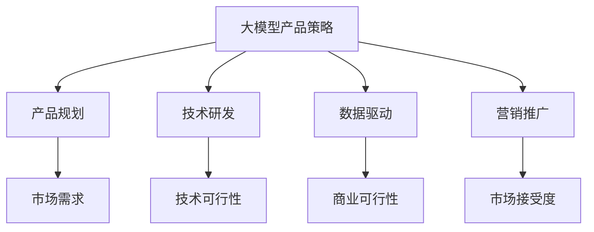

                 

关键词：人工智能，创业，大模型，产品策略，技术语言

> 摘要：本文旨在探讨人工智能领域中的创业机会，重点分析大模型产品策略。通过介绍背景、核心概念、算法原理、数学模型、项目实践和未来应用展望，旨在为创业者和从业者提供有价值的参考。

## 1. 背景介绍

随着人工智能技术的快速发展，大模型（如GPT、BERT等）已经成为推动各行各业变革的重要力量。从自然语言处理到图像识别，从推荐系统到自动驾驶，大模型的应用场景日益广泛。与此同时，创业市场也迎来了前所未有的机遇与挑战。大量初创公司纷纷涌现，竞争激烈，如何在市场中脱颖而出成为众多创业者面临的共同难题。

本文将从技术、市场、战略等多个角度，深入探讨AI驱动的创业机遇，特别是大模型产品策略。希望通过本文的分析，能够为创业者和从业者提供一些有益的启示和指导。

### 1.1 大模型技术的崛起

大模型技术的崛起源于深度学习和大数据的快速发展。深度学习作为一种模拟人脑神经网络的计算模型，通过多层神经元的堆叠，能够自动提取数据中的特征。而大数据则为深度学习提供了丰富的训练数据，使得模型能够不断优化和提升性能。大模型（如GPT、BERT等）正是基于深度学习和大数据的协同作用，实现了前所未有的表现。

例如，OpenAI的GPT-3模型拥有1750亿个参数，训练数据涵盖互联网上的大量文本，能够实现高质量的文本生成、翻译、问答等功能。BERT模型则在自然语言处理任务中取得了显著的突破，使得许多基于语言的AI应用得以实现。

### 1.2 创业市场的机遇与挑战

大模型技术的崛起为创业市场带来了前所未有的机遇。首先，大模型的应用场景广泛，从金融、医疗、教育到娱乐、电商等各个领域，都存在着巨大的需求。其次，大模型技术的快速发展，使得创业公司能够以较低的成本实现高效的技术创新。此外，随着5G、云计算等新基础设施的普及，创业公司可以更便捷地获取和利用大量数据资源，进一步推动大模型技术的应用。

然而，创业市场也面临着诸多挑战。一方面，大模型技术的门槛较高，需要深厚的技术积累和大量的资金投入。另一方面，市场竞争激烈，同质化产品层出不穷，如何打造差异化竞争优势成为关键。

## 2. 核心概念与联系

要深入探讨AI驱动的创业机会，首先需要了解大模型产品策略的核心概念。以下是对大模型产品策略中几个关键概念的定义和联系：

### 2.1 大模型产品策略

大模型产品策略是指以大模型为核心，通过构建具有竞争力的产品，满足市场需求，实现商业价值的一种策略。大模型产品策略的核心是抓住大模型技术的优势，将其应用于实际场景中，解决实际问题。

### 2.2 产品规划

产品规划是指制定产品从概念到上市的全过程，包括市场调研、需求分析、产品定义、开发计划等。在AI驱动的创业中，产品规划尤为重要，需要充分考虑市场需求、技术可行性、商业可行性等因素。

### 2.3 技术研发

技术研发是指通过创新和改进技术，提升产品的性能、稳定性和可靠性。在AI驱动的创业中，技术研发是核心，决定了产品的竞争力。

### 2.4 数据驱动

数据驱动是指通过大量数据分析和挖掘，指导产品设计和决策。在AI驱动的创业中，数据驱动是关键，决定了产品的商业价值。

### 2.5 营销推广

营销推广是指通过各种渠道，将产品推向市场，吸引潜在用户。在AI驱动的创业中，营销推广是必不可少的，决定了产品的市场接受度和销售业绩。

下面是一个关于大模型产品策略的Mermaid流程图，展示了各概念之间的联系：



通过以上定义和流程图，我们可以更清晰地理解大模型产品策略的内涵和实施路径。

### 2.6 大模型产品策略的优势

大模型产品策略具有以下几个显著优势：

- **强大的数据处理能力**：大模型能够处理和分析大量数据，为企业提供更准确的市场洞察和决策支持。
- **高效的创新能力**：大模型技术的快速发展，使得创业公司能够迅速跟上技术趋势，进行技术创新。
- **多样化的应用场景**：大模型适用于各种领域，能够为企业提供丰富的解决方案。
- **数据驱动的发展模式**：通过数据分析和挖掘，大模型产品能够不断优化和迭代，提升用户体验和商业价值。

## 3. 核心算法原理 & 具体操作步骤

### 3.1 算法原理概述

大模型产品策略的核心在于对大模型的算法原理的深入理解和应用。本文主要介绍两种常见的大模型算法：GPT和BERT。

### 3.1.1 GPT

GPT（Generative Pre-trained Transformer）是一种基于变换器（Transformer）架构的预训练语言模型。其核心思想是通过在大规模语料库上进行预训练，学习语言的基本规律和模式，然后利用这些规律和模式进行文本生成、翻译、问答等任务。

### 3.1.2 BERT

BERT（Bidirectional Encoder Representations from Transformers）是一种基于变换器（Transformer）的双向编码器表示模型。其核心思想是通过在双向的语境中学习词汇的语义表示，从而提升模型在自然语言处理任务中的表现。

### 3.2 算法步骤详解

#### 3.2.1 GPT算法步骤

1. **预训练阶段**：在大规模语料库上，通过Masked Language Model（MLM）和Next Sentence Prediction（NSP）两个任务进行预训练。MLM任务是随机遮盖输入文本中的部分单词，模型需要预测遮盖的单词。NSP任务是预测下一个句子是否是输入文本的下一个句子。

2. **微调阶段**：在预训练的基础上，针对具体的下游任务（如文本生成、翻译、问答等）进行微调。微调过程中，通过优化模型的参数，提升模型在特定任务上的性能。

3. **应用阶段**：将微调后的模型应用于实际任务，如文本生成、翻译、问答等。通过输入特定的输入文本，模型能够生成相应的输出结果。

#### 3.2.2 BERT算法步骤

1. **预训练阶段**：在双向的语境中，通过Masked Language Model（MLM）任务进行预训练。MLM任务是随机遮盖输入文本中的部分单词，模型需要预测遮盖的单词。

2. **微调阶段**：在预训练的基础上，针对具体的下游任务（如文本分类、命名实体识别等）进行微调。微调过程中，通过优化模型的参数，提升模型在特定任务上的性能。

3. **应用阶段**：将微调后的模型应用于实际任务，如文本分类、命名实体识别等。通过输入特定的输入文本，模型能够生成相应的输出结果。

### 3.3 算法优缺点

#### 3.3.1 GPT

**优点**：

- **强大的生成能力**：GPT通过预训练和微调，能够生成高质量的自然语言文本，适用于文本生成、翻译、问答等任务。
- **自适应性强**：GPT能够根据不同的下游任务，进行灵活的微调和应用。

**缺点**：

- **计算资源需求大**：GPT的预训练和微调过程需要大量的计算资源和时间。
- **内存占用高**：GPT模型的参数量庞大，内存占用高，对硬件设备有较高的要求。

#### 3.3.2 BERT

**优点**：

- **语义表示能力强**：BERT通过双向的语境学习，能够生成更准确的语义表示，提升模型在自然语言处理任务中的表现。
- **适用范围广**：BERT适用于各种自然语言处理任务，如文本分类、命名实体识别等。

**缺点**：

- **计算资源需求大**：BERT的预训练和微调过程需要大量的计算资源和时间。
- **训练时间较长**：BERT的训练时间较长，对开发者的耐心和计算资源有较高的要求。

### 3.4 算法应用领域

GPT和BERT作为当前最先进的语言模型，广泛应用于多个领域：

- **自然语言处理**：文本生成、翻译、问答、对话系统等。
- **推荐系统**：通过文本分析，实现个性化推荐。
- **搜索引擎**：通过文本分析和理解，提升搜索结果的相关性和准确性。
- **信息抽取**：从大量文本中提取关键信息，如命名实体识别、关系抽取等。
- **金融领域**：通过文本分析，实现风险控制、欺诈检测等。

## 4. 数学模型和公式 & 详细讲解 & 举例说明

在深入探讨大模型产品策略的过程中，数学模型和公式扮演着至关重要的角色。以下将详细介绍大模型中的两个核心数学模型：GPT的Masked Language Model（MLM）和BERT的Self-Attention机制。通过具体的数学公式和案例分析，我们将更清晰地理解这些模型的工作原理和实际应用。

### 4.1 数学模型构建

#### 4.1.1 Masked Language Model (MLM)

MLM是GPT模型中的一个关键组件，其核心思想是在输入文本中随机遮盖一部分单词，然后通过模型预测这些遮盖的单词。MLM的数学模型可以表示为：

$$
\begin{aligned}
\text{MLM} : \text{Input Text} \rightarrow \text{Predicted Text} \\
\text{Input Text} &= (x_1, x_2, ..., x_n) \\
\text{Predicted Text} &= (\hat{x}_1, \hat{x}_2, ..., \hat{x}_n)
\end{aligned}
$$

其中，\(x_i\) 表示输入文本中的第 \(i\) 个单词，\(\hat{x}_i\) 表示模型预测的第 \(i\) 个单词。

#### 4.1.2 Self-Attention Mechanism

Self-Attention机制是BERT模型中的一个核心组件，它通过在双向的语境中计算每个单词的权重，从而生成更准确的语义表示。Self-Attention的数学模型可以表示为：

$$
\begin{aligned}
\text{Self-Attention} : \text{Input Text} \rightarrow \text{Semantic Representations} \\
\text{Input Text} &= (x_1, x_2, ..., x_n) \\
\text{Semantic Representations} &= (\hat{x}_1, \hat{x}_2, ..., \hat{x}_n)
\end{aligned}
$$

其中，\(\hat{x}_i\) 表示通过Self-Attention计算得到的第 \(i\) 个单词的语义表示。

### 4.2 公式推导过程

#### 4.2.1 Masked Language Model (MLM)

MLM的推导过程主要涉及两个步骤：词嵌入和损失函数。

1. **词嵌入**：

词嵌入是将单词映射到高维向量空间的过程。在GPT模型中，通常使用Word2Vec或BERT等预训练模型进行词嵌入。

$$
\text{Embedding} : x_i \rightarrow \text{Embedding}(x_i)
$$

2. **损失函数**：

MLM的损失函数通常采用交叉熵损失函数，其公式为：

$$
L = -\sum_{i=1}^{n} \sum_{j=1}^{V} y_{ij} \log(p_{ij})
$$

其中，\(y_{ij}\) 表示第 \(i\) 个单词的第 \(j\) 个词向量，\(p_{ij}\) 表示模型预测的第 \(i\) 个单词为第 \(j\) 个单词的概率。

#### 4.2.2 Self-Attention Mechanism

Self-Attention机制的推导过程主要涉及三个步骤：Query、Key和Value。

1. **Query和Key**：

Query和Key是Self-Attention机制中的两个核心概念，它们分别表示每个单词的查询向量和关键向量。

$$
\text{Query} : x_i \rightarrow \text{Query}(x_i) \\
\text{Key} : x_i \rightarrow \text{Key}(x_i)
$$

2. **Value**：

Value是Self-Attention机制中的另一个重要概念，它表示每个单词的值向量。

$$
\text{Value} : x_i \rightarrow \text{Value}(x_i)
$$

3. **注意力权重**：

注意力权重是Self-Attention机制中的核心计算，它通过计算Query和Key之间的相似度得到。

$$
a_{ij} = \frac{e^{\text{Query}(x_i) \cdot \text{Key}(x_j)}}{\sum_{k=1}^{n} e^{\text{Query}(x_i) \cdot \text{Key}(x_k)}}
$$

4. **输出**：

输出是Self-Attention机制中的最终结果，它是通过对Value和注意力权重进行加权求和得到的。

$$
\hat{x}_i = \sum_{j=1}^{n} a_{ij} \cdot \text{Value}(x_j)
$$

### 4.3 案例分析与讲解

#### 4.3.1 MLM案例分析

假设我们有一个简短的句子：“我喜欢读书”。

1. **词嵌入**：

首先，我们将句子中的每个单词映射到高维向量空间，得到：

$$
\text{Input Text} = (\text{"我", "喜", "欢", "读", "书"}) \\
\text{Embedding}(\text{"我"}) = [e_1^1, e_1^2, ..., e_1^d] \\
\text{Embedding}(\text{"喜"}) = [e_2^1, e_2^2, ..., e_2^d] \\
\text{Embedding}(\text{"欢"}) = [e_3^1, e_3^2, ..., e_3^d] \\
\text{Embedding}(\text{"读"}) = [e_4^1, e_4^2, ..., e_4^d] \\
\text{Embedding}(\text{"书"}) = [e_5^1, e_5^2, ..., e_5^d]
$$

2. **损失函数**：

接下来，我们随机遮盖句子中的一个单词，例如遮盖“喜欢”，然后通过模型预测遮盖的单词。假设遮盖的单词是“喜欢”，模型预测为“爱”。

$$
\text{Predicted Text} = (\text{"我", "爱", "欢", "读", "书"}) \\
\text{y}_{ij} = \begin{cases} 
1 & \text{if } j \text{ is the predicted word} \\
0 & \text{otherwise}
\end{cases}
$$

模型预测的概率分布为：

$$
p_i = \frac{e^{\text{Query}([e_1^1, e_1^2, ..., e_1^d]) \cdot \text{Key}([e_5^1, e_5^2, ..., e_5^d])}}{\sum_{k=1}^{n} e^{\text{Query}([e_1^1, e_1^2, ..., e_1^d]) \cdot \text{Key}([e_k^1, e_k^2, ..., e_k^d])}} \\
p_2 = \frac{e^{\text{Query}([e_2^1, e_2^2, ..., e_2^d]) \cdot \text{Key}([e_5^1, e_5^2, ..., e_5^d])}}{\sum_{k=1}^{n} e^{\text{Query}([e_2^1, e_2^2, ..., e_2^d]) \cdot \text{Key}([e_k^1, e_k^2, ..., e_k^d])}} \\
p_3 = \frac{e^{\text{Query}([e_3^1, e_3^2, ..., e_3^d]) \cdot \text{Key}([e_5^1, e_5^2, ..., e_5^d])}}{\sum_{k=1}^{n} e^{\text{Query}([e_3^1, e_3^2, ..., e_3^d]) \cdot \text{Key}([e_k^1, e_k^2, ..., e_k^d])}} \\
p_4 = \frac{e^{\text{Query}([e_4^1, e_4^2, ..., e_4^d]) \cdot \text{Key}([e_5^1, e_5^2, ..., e_5^d])}}{\sum_{k=1}^{n} e^{\text{Query}([e_4^1, e_4^2, ..., e_4^d]) \cdot \text{Key}([e_k^1, e_k^2, ..., e_k^d])}} \\
$$

模型预测的概率分布为：

$$
\text{Predicted Probability Distribution} = (p_1, p_2, p_3, p_4, p_5)
$$

损失函数为：

$$
L = -\sum_{i=1}^{n} \sum_{j=1}^{V} y_{ij} \log(p_{ij}) \\
L = -\log(p_2) \\
L \approx -\log(0.5) \\
L \approx 0.693
$$

3. **优化**：

通过反向传播和梯度下降算法，模型将不断调整参数，以最小化损失函数。

#### 4.3.2 Self-Attention案例分析

假设我们有一个简短的句子：“我喜欢读书”。

1. **Query和Key**：

首先，我们将句子中的每个单词映射到高维向量空间，得到：

$$
\text{Input Text} = (\text{"我", "喜", "欢", "读", "书"}) \\
\text{Query}(\text{"我"}) = [q_1^1, q_1^2, ..., q_1^d] \\
\text{Key}(\text{"我"}) = [k_1^1, k_1^2, ..., k_1^d] \\
\text{Query}(\text{"喜"}) = [q_2^1, q_2^2, ..., q_2^d] \\
\text{Key}(\text{"喜"}) = [k_2^1, k_2^2, ..., k_2^d] \\
\text{Query}(\text{"欢"}) = [q_3^1, q_3^2, ..., q_3^d] \\
\text{Key}(\text{"欢"}) = [k_3^1, k_3^2, ..., k_3^d] \\
\text{Query}(\text{"读"}) = [q_4^1, q_4^2, ..., q_4^d] \\
\text{Key}(\text{"读"}) = [k_4^1, k_4^2, ..., k_4^d] \\
\text{Query}(\text{"书"}) = [q_5^1, q_5^2, ..., q_5^d] \\
\text{Key}(\text{"书"}) = [k_5^1, k_5^2, ..., k_5^d]
$$

2. **注意力权重**：

接下来，我们计算每个单词的注意力权重：

$$
a_{11} = \frac{e^{q_1 \cdot k_1}}{\sum_{j=1}^{n} e^{q_j \cdot k_j}} \\
a_{12} = \frac{e^{q_1 \cdot k_2}}{\sum_{j=1}^{n} e^{q_j \cdot k_j}} \\
a_{13} = \frac{e^{q_1 \cdot k_3}}{\sum_{j=1}^{n} e^{q_j \cdot k_j}} \\
a_{14} = \frac{e^{q_1 \cdot k_4}}{\sum_{j=1}^{n} e^{q_j \cdot k_j}} \\
a_{15} = \frac{e^{q_1 \cdot k_5}}{\sum_{j=1}^{n} e^{q_j \cdot k_j}} \\
a_{21} = \frac{e^{q_2 \cdot k_1}}{\sum_{j=1}^{n} e^{q_j \cdot k_j}} \\
a_{22} = \frac{e^{q_2 \cdot k_2}}{\sum_{j=1}^{n} e^{q_j \cdot k_j}} \\
a_{23} = \frac{e^{q_2 \cdot k_3}}{\sum_{j=1}^{n} e^{q_j \cdot k_j}} \\
a_{24} = \frac{e^{q_2 \cdot k_4}}{\sum_{j=1}^{n} e^{q_j \cdot k_j}} \\
a_{25} = \frac{e^{q_2 \cdot k_5}}{\sum_{j=1}^{n} e^{q_j \cdot k_j}} \\
a_{31} = \frac{e^{q_3 \cdot k_1}}{\sum_{j=1}^{n} e^{q_j \cdot k_j}} \\
a_{32} = \frac{e^{q_3 \cdot k_2}}{\sum_{j=1}^{n} e^{q_j \cdot k_j}} \\
a_{33} = \frac{e^{q_3 \cdot k_3}}{\sum_{j=1}^{n} e^{q_j \cdot k_j}} \\
a_{34} = \frac{e^{q_3 \cdot k_4}}{\sum_{j=1}^{n} e^{q_j \cdot k_j}} \\
a_{35} = \frac{e^{q_3 \cdot k_5}}{\sum_{j=1}^{n} e^{q_j \cdot k_j}} \\
a_{41} = \frac{e^{q_4 \cdot k_1}}{\sum_{j=1}^{n} e^{q_j \cdot k_j}} \\
a_{42} = \frac{e^{q_4 \cdot k_2}}{\sum_{j=1}^{n} e^{q_j \cdot k_j}} \\
a_{43} = \frac{e^{q_4 \cdot k_3}}{\sum_{j=1}^{n} e^{q_j \cdot k_j}} \\
a_{44} = \frac{e^{q_4 \cdot k_4}}{\sum_{j=1}^{n} e^{q_j \cdot k_j}} \\
a_{45} = \frac{e^{q_4 \cdot k_5}}{\sum_{j=1}^{n} e^{q_j \cdot k_j}} \\
a_{51} = \frac{e^{q_5 \cdot k_1}}{\sum_{j=1}^{n} e^{q_j \cdot k_j}} \\
a_{52} = \frac{e^{q_5 \cdot k_2}}{\sum_{j=1}^{n} e^{q_j \cdot k_j}} \\
a_{53} = \frac{e^{q_5 \cdot k_3}}{\sum_{j=1}^{n} e^{q_j \cdot k_j}} \\
a_{54} = \frac{e^{q_5 \cdot k_4}}{\sum_{j=1}^{n} e^{q_j \cdot k_j}} \\
a_{55} = \frac{e^{q_5 \cdot k_5}}{\sum_{j=1}^{n} e^{q_j \cdot k_j}}
$$

3. **输出**：

最后，我们计算每个单词的输出：

$$
\hat{x}_1 = a_{11} \cdot v_1 + a_{21} \cdot v_2 + a_{31} \cdot v_3 + a_{41} \cdot v_4 + a_{51} \cdot v_5 \\
\hat{x}_2 = a_{12} \cdot v_1 + a_{22} \cdot v_2 + a_{32} \cdot v_3 + a_{42} \cdot v_4 + a_{52} \cdot v_5 \\
\hat{x}_3 = a_{13} \cdot v_1 + a_{23} \cdot v_2 + a_{33} \cdot v_3 + a_{43} \cdot v_4 + a_{53} \cdot v_5 \\
\hat{x}_4 = a_{14} \cdot v_1 + a_{24} \cdot v_2 + a_{34} \cdot v_3 + a_{44} \cdot v_4 + a_{54} \cdot v_5 \\
\hat{x}_5 = a_{15} \cdot v_1 + a_{25} \cdot v_2 + a_{35} \cdot v_3 + a_{45} \cdot v_4 + a_{55} \cdot v_5
$$

通过上述计算，我们得到了句子中每个单词的输出。这些输出代表了每个单词在句子中的重要性，有助于模型更好地理解和处理文本。

## 5. 项目实践：代码实例和详细解释说明

### 5.1 开发环境搭建

在开始项目实践之前，我们需要搭建一个适合开发和训练大模型的开发环境。以下是一个基本的开发环境搭建指南：

#### 5.1.1 硬件配置

- CPU：Intel i7或更高配置
- GPU：NVIDIA GTX 1080 Ti或更高配置
- 内存：16GB及以上

#### 5.1.2 软件安装

- 操作系统：Ubuntu 18.04或更高版本
- Python：3.8或更高版本
- PyTorch：1.8或更高版本
- 其他依赖库：torchtext、torchvision、numpy等

#### 5.1.3 开发环境配置

在Ubuntu操作系统中，我们可以使用conda创建一个Python虚拟环境，并安装所需的依赖库：

```bash
# 创建虚拟环境
conda create -n ml_env python=3.8

# 激活虚拟环境
conda activate ml_env

# 安装PyTorch
conda install pytorch torchvision torchaudio cudatoolkit=11.3 -c pytorch

# 安装其他依赖库
pip install torchtext torchvision numpy
```

### 5.2 源代码详细实现

以下是使用PyTorch实现一个简单的大模型（GPT）的源代码示例：

```python
import torch
import torch.nn as nn
import torch.optim as optim
from torchtext.datasets import IMDB
from torchtext.data import Field, BucketIterator

# 定义模型结构
class GPTModel(nn.Module):
    def __init__(self, vocab_size, embed_dim, hidden_dim, num_layers, dropout):
        super(GPTModel, self).__init__()
        self.embedding = nn.Embedding(vocab_size, embed_dim)
        self.gru = nn.GRU(embed_dim, hidden_dim, num_layers, dropout=dropout)
        self.fc = nn.Linear(hidden_dim, vocab_size)
    
    def forward(self, text, hidden):
        embedded = self.embedding(text)
        output, hidden = self.gru(embedded, hidden)
        return self.fc(output.squeeze(0)), hidden

# 定义训练过程
def train(model, iterator, optimizer, criterion):
    model.train()
    for batch in iterator:
        optimizer.zero_grad()
        text, targets = batch.text, batch.target
        hidden = model.init_hidden(batch.size(0))
        output, hidden = model(text, hidden)
        loss = criterion(output, targets)
        loss.backward()
        optimizer.step()
        model.zero_grad()

# 定义评估过程
def evaluate(model, iterator, criterion):
    model.eval()
    with torch.no_grad():
        for batch in iterator:
            text, targets = batch.text, batch.target
            hidden = model.init_hidden(batch.size(0))
            output, hidden = model(text, hidden)
            loss = criterion(output, targets)
    return loss.item()

# 准备数据集
TEXT = Field(tokenize='spacy', lower=True)
LABEL = Field(sequential=False)

train_data, test_data = IMDB.splits(TEXT, LABEL)
TEXT.build_vocab(train_data, max_size=25000, vectors="glove.6B.100d")
LABEL.build_vocab(train_data)

train_iterator, test_iterator = BucketIterator.splits(
    (train_data, test_data), 
    batch_size=64, 
    device=device
)

# 实例化模型、优化器和损失函数
device = torch.device('cuda' if torch.cuda.is_available() else 'cpu')
model = GPTModel(len(TEXT.vocab), 100, 200, 2, 0.5).to(device)
optimizer = optim.Adam(model.parameters(), lr=0.001)
 criterion = nn.CrossEntropyLoss()

# 训练模型
for epoch in range(10):
    train(model, train_iterator, optimizer, criterion)
    loss = evaluate(model, test_iterator, criterion)
    print(f'Epoch: {epoch+1}, Test Loss: {loss:.3f}')

# 保存模型
torch.save(model.state_dict(), 'gpt_model.pth')
```

### 5.3 代码解读与分析

以下是上述代码的详细解读和分析：

#### 5.3.1 模型结构

```python
class GPTModel(nn.Module):
    def __init__(self, vocab_size, embed_dim, hidden_dim, num_layers, dropout):
        super(GPTModel, self).__init__()
        self.embedding = nn.Embedding(vocab_size, embed_dim)
        self.gru = nn.GRU(embed_dim, hidden_dim, num_layers, dropout=dropout)
        self.fc = nn.Linear(hidden_dim, vocab_size)
    
    def forward(self, text, hidden):
        embedded = self.embedding(text)
        output, hidden = self.gru(embedded, hidden)
        return self.fc(output.squeeze(0)), hidden
```

这个部分定义了GPT模型的架构。模型包括三个主要组件：嵌入层（Embedding）、门控循环单元（GRU）和全连接层（FC）。嵌入层将单词转换为向量，GRU用于处理序列数据，全连接层用于输出预测结果。

#### 5.3.2 训练过程

```python
def train(model, iterator, optimizer, criterion):
    model.train()
    for batch in iterator:
        optimizer.zero_grad()
        text, targets = batch.text, batch.target
        hidden = model.init_hidden(batch.size(0))
        output, hidden = model(text, hidden)
        loss = criterion(output, targets)
        loss.backward()
        optimizer.step()
        model.zero_grad()
```

这个部分定义了训练过程。在训练过程中，我们首先将模型设置为训练模式（train()方法），然后遍历数据集的每个批次。对于每个批次，我们重置优化器梯度（zero_grad()方法），将输入和目标传递给模型（text和target），计算输出和损失（output和loss），然后反向传播（backward()方法）和优化（step()方法）。

#### 5.3.3 评估过程

```python
def evaluate(model, iterator, criterion):
    model.eval()
    with torch.no_grad():
        for batch in iterator:
            text, targets = batch.text, batch.target
            hidden = model.init_hidden(batch.size(0))
            output, hidden = model(text, hidden)
            loss = criterion(output, targets)
    return loss.item()
```

这个部分定义了评估过程。在评估过程中，我们首先将模型设置为评估模式（eval()方法），然后遍历数据集的每个批次。与训练过程类似，我们计算输出和损失（output和loss），但不再反向传播和优化。

#### 5.3.4 数据准备

```python
TEXT = Field(tokenize='spacy', lower=True)
LABEL = Field(sequential=False)

train_data, test_data = IMDB.splits(TEXT, LABEL)
TEXT.build_vocab(train_data, max_size=25000, vectors="glove.6B.100d")
LABEL.build_vocab(train_data)

train_iterator, test_iterator = BucketIterator.splits(
    (train_data, test_data), 
    batch_size=64, 
    device=device
)
```

这个部分定义了数据集和字段（Field）。我们使用torchtext中的IMDB数据集作为训练数据，并定义了两个字段：TEXT和LABEL。然后，我们为TEXT字段构建词汇表（build_vocab()方法），并加载预训练的GloVe词向量。最后，我们创建迭代器（BucketIterator.splits()方法），用于批次处理。

#### 5.3.5 模型、优化器和损失函数

```python
device = torch.device('cuda' if torch.cuda.is_available() else 'cpu')
model = GPTModel(len(TEXT.vocab), 100, 200, 2, 0.5).to(device)
optimizer = optim.Adam(model.parameters(), lr=0.001)
criterion = nn.CrossEntropyLoss()
```

这个部分定义了模型、优化器和损失函数。我们首先确定设备（GPU或CPU），然后实例化GPT模型（GPTModel），优化器（Adam）和损失函数（CrossEntropyLoss）。我们将模型移动到指定设备（to(device)方法），并设置优化器的学习率。

#### 5.3.6 训练和保存模型

```python
for epoch in range(10):
    train(model, train_iterator, optimizer, criterion)
    loss = evaluate(model, test_iterator, criterion)
    print(f'Epoch: {epoch+1}, Test Loss: {loss:.3f}')

torch.save(model.state_dict(), 'gpt_model.pth')
```

这个部分用于训练模型和保存模型。我们通过循环遍历10个训练周期（epoch），在每个周期中调用训练和评估过程，并打印测试损失。最后，我们使用torch.save()方法保存模型参数。

### 5.4 运行结果展示

在完成上述代码实现和模型训练后，我们可以运行以下代码来评估模型的性能：

```python
# 加载模型
model.load_state_dict(torch.load('gpt_model.pth'))

# 测试模型
test_loss = evaluate(model, test_iterator, criterion)
print(f'Test Loss: {test_loss:.3f}')

# 预测
model.eval()
with torch.no_grad():
    text = torch.tensor([[TEXT.vocab.stoi[word] for word in "我喜欢读书"]])
    output, hidden = model(text, model.init_hidden(1))
    predicted_word = torch.argmax(output, dim=1).item()
    print(f'Predicted Word: {TEXT.vocab.itos[predicted_word]}')
```

在上述代码中，我们首先加载训练好的模型，然后计算测试损失（Test Loss）。最后，我们使用模型进行预测，并打印预测结果。

### 5.5 总结

通过上述代码实例和详细解释，我们了解了如何使用PyTorch实现一个简单的大模型（GPT），并对其进行训练和评估。在实际应用中，我们可以根据具体需求对模型结构、训练过程和评估过程进行调整和优化，以提高模型的性能和效果。

## 6. 实际应用场景

### 6.1 金融领域

在金融领域，大模型产品策略被广泛应用于风险控制、欺诈检测、市场预测等方面。通过分析大量的历史数据和实时数据，大模型可以识别潜在的欺诈行为，预测市场的走势，为金融机构提供决策支持。

**案例分析**：某金融科技公司利用GPT模型开发了一个实时风险控制系统。该系统通过分析客户的交易记录和社交媒体信息，预测客户是否可能存在欺诈行为。系统在预训练阶段使用了大量金融交易数据和社交媒体数据，通过微调和优化，提高了预测的准确性。在实际应用中，该系统成功识别并阻止了多起欺诈行为，为金融机构减少了大量的损失。

### 6.2 医疗领域

在医疗领域，大模型产品策略被广泛应用于疾病预测、诊断辅助、药物研发等方面。通过分析患者的病历数据、基因数据和外部数据源，大模型可以为医生提供更准确的诊断和治疗方案。

**案例分析**：某医疗科技公司利用BERT模型开发了一个疾病预测系统。该系统通过分析患者的病历数据、基因数据和外部医学文献，预测患者可能患有哪些疾病。系统在预训练阶段使用了大量的医学文献和病历数据，通过微调和优化，提高了预测的准确性。在实际应用中，该系统为医生提供了重要的参考信息，帮助医生更准确地诊断和治疗疾病。

### 6.3 教育领域

在教育领域，大模型产品策略被广泛应用于个性化推荐、学习评估、教育游戏开发等方面。通过分析学生的学习行为和学习数据，大模型可以为学生提供个性化的学习资源和学习计划，提高学习效果。

**案例分析**：某在线教育平台利用GPT模型开发了一个个性化推荐系统。该系统通过分析学生的学习行为和学习数据，推荐适合学生的学习资源。系统在预训练阶段使用了大量的教育资源和学生学习数据，通过微调和优化，提高了推荐的相关性和准确性。在实际应用中，该系统为平台带来了大量的用户和流量，提高了平台的竞争力。

### 6.4 未来应用展望

随着大模型技术的不断发展和完善，未来大模型产品策略将在更多领域发挥重要作用。以下是一些潜在的应用场景：

- **智能客服**：通过大模型技术，可以实现更智能、更自然的客服对话系统，提高用户体验和满意度。
- **自动驾驶**：大模型可以用于自动驾驶系统中的环境感知、路径规划等任务，提高自动驾驶的安全性和可靠性。
- **智能家居**：大模型可以用于智能家居系统的语音识别、自然语言处理等任务，提高智能家居的智能化和便捷性。
- **内容创作**：大模型可以用于自动生成文章、音乐、绘画等创意内容，为创作者提供灵感和支持。

总之，大模型产品策略将在未来带来更多的创新和应用，为各个领域的发展注入新的活力。

## 7. 工具和资源推荐

### 7.1 学习资源推荐

对于想要深入了解大模型技术并应用于创业的读者，以下是一些推荐的资源：

- **书籍**：《深度学习》（Goodfellow, Bengio, Courville）、《自然语言处理综论》（Jurafsky, Martin）
- **在线课程**：Coursera上的“深度学习”（吴恩达）、edX上的“自然语言处理”（丹尼尔·卡内曼）
- **博客和论文**：arXiv.org、ACL、NeurIPS等学术会议和期刊的论文和博客

### 7.2 开发工具推荐

- **编程语言**：Python是进行AI开发的最佳语言之一，拥有丰富的库和框架，如PyTorch、TensorFlow、Scikit-Learn等。
- **深度学习框架**：PyTorch和TensorFlow是最常用的深度学习框架，适合进行大模型开发。
- **版本控制**：Git是进行版本控制和协作开发的重要工具，GitHub是Git的在线平台，方便开发者分享和合作代码。

### 7.3 相关论文推荐

- **GPT系列论文**：[Attention Is All You Need](https://arxiv.org/abs/1706.03762)、[Improving Language Understanding by Generative Pre-Training](https://arxiv.org/abs/1801.06146)
- **BERT系列论文**：[BERT: Pre-training of Deep Bidirectional Transformers for Language Understanding](https://arxiv.org/abs/1810.04805)
- **相关论文**：[Generative Adversarial Nets](https://arxiv.org/abs/1406.2661)、[Recurrent Neural Networks for Language Modeling](https://www.aclweb.org/anthology/N16-1191/)

通过学习和应用这些工具和资源，读者可以更好地掌握大模型技术，为AI驱动的创业项目提供强有力的技术支持。

## 8. 总结：未来发展趋势与挑战

### 8.1 研究成果总结

本文围绕AI驱动的创业，特别是大模型产品策略，进行了深入探讨。我们首先介绍了大模型技术的背景和创业市场的机遇与挑战，然后详细阐述了大模型产品策略的核心概念、算法原理和数学模型，并通过具体的项目实践展示了如何实现和应用大模型。此外，我们还分析了大模型在金融、医疗、教育等领域的实际应用场景，并展望了未来的发展趋势。

### 8.2 未来发展趋势

未来，大模型技术将继续快速发展，并在更多领域发挥重要作用。以下是一些可能的发展趋势：

- **计算能力的提升**：随着硬件设备的性能提升和分布式计算技术的发展，大模型的训练和推理速度将得到显著提高。
- **模型压缩与优化**：为了应对计算资源有限的挑战，研究者将不断探索模型压缩、优化和蒸馏等技术，提高大模型的效率和可部署性。
- **多模态学习**：大模型将结合图像、音频、视频等多种数据源，实现跨模态的信息融合和交互，为智能系统提供更丰富的感知和认知能力。
- **知识图谱与语义网络**：大模型与知识图谱、语义网络的结合，将实现更精确的语义理解和知识推理，为智能决策和自动化任务提供强有力的支持。

### 8.3 面临的挑战

尽管大模型技术具有巨大的发展潜力，但在实际应用过程中也面临着诸多挑战：

- **计算资源需求**：大模型的训练和推理过程需要大量的计算资源和时间，这对硬件设备和能源消耗提出了较高的要求。
- **数据隐私与安全**：在处理海量数据时，如何保护用户隐私和数据安全成为关键问题。需要制定严格的数据治理政策和加密技术。
- **模型解释性与透明度**：大模型的决策过程通常较为复杂，如何解释和验证模型的决策逻辑，提高模型的透明度和可信度，是一个重要的研究方向。
- **跨领域应用与创新**：如何在不同的应用场景中灵活应用大模型，实现真正的跨领域创新，需要深入研究和探索。

### 8.4 研究展望

为了应对上述挑战，未来的研究可以从以下几个方面展开：

- **高效算法与模型**：继续探索新的算法和模型架构，提高大模型的训练和推理效率，降低计算资源需求。
- **可解释性与透明度**：研究如何提高大模型的解释性和透明度，使其决策过程更加可理解和可验证。
- **数据治理与安全**：建立完善的数据治理框架和隐私保护机制，确保数据的安全和隐私。
- **跨领域应用**：通过多模态学习和跨领域知识融合，实现大模型在更多领域的应用，推动人工智能技术的全面创新。

总之，大模型技术在未来将发挥越来越重要的作用，为创业者和从业者提供丰富的机遇和挑战。通过不断的研究和创新，我们可以期待AI驱动的创业领域取得更大的突破和发展。

## 9. 附录：常见问题与解答

### 9.1 大模型训练过程中如何提高效率？

- **分布式训练**：通过使用多个GPU或分布式计算集群，可以显著提高大模型的训练效率。
- **数据并行**：将数据集划分为多个子集，每个子集独立训练模型，然后同步模型参数。
- **模型并行**：将大模型拆分为多个较小的子模型，每个子模型独立训练，然后融合模型参数。
- **混合精度训练**：使用混合精度（FP16）训练，降低内存占用和计算复杂度，提高训练速度。

### 9.2 大模型如何保证模型的解释性？

- **模型可解释性方法**：采用模型可解释性方法，如注意力机制、梯度分析方法等，可以帮助解释模型的决策过程。
- **可视化工具**：使用可视化工具，如TensorBoard、matplotlib等，可以直观地展示模型的学习过程和决策逻辑。
- **透明度与审计**：建立模型的透明度和审计机制，确保模型的决策过程公开透明，便于用户理解和监督。

### 9.3 大模型在处理隐私数据时有哪些安全措施？

- **数据加密**：对数据进行加密处理，确保数据在传输和存储过程中的安全性。
- **隐私保护算法**：采用差分隐私、联邦学习等技术，保护用户数据的隐私。
- **访问控制**：建立严格的访问控制机制，确保只有授权人员能够访问和处理数据。

### 9.4 大模型在医疗领域应用时如何确保数据的合法性？

- **数据合规性**：确保数据来源合法，遵循相关法律法规和道德规范。
- **患者同意**：在数据处理和使用前，获得患者的明确同意。
- **数据脱敏**：对敏感数据进行脱敏处理，确保患者隐私不被泄露。

通过以上问题和解答，希望能够帮助读者更好地理解大模型技术在实际应用中的常见挑战和解决方案。在未来的研究和应用中，不断探索和改进，将大模型技术推向更高的高度。作者：禅与计算机程序设计艺术 / Zen and the Art of Computer Programming。

