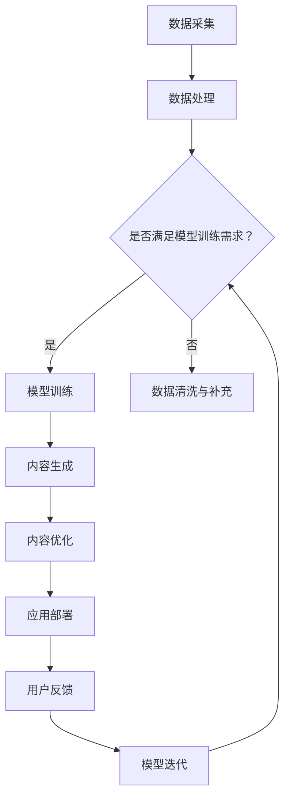

                 

关键词：AIGC，智慧社区，人工智能，生成对抗网络，自然语言处理，计算机视觉，数据驱动发展

> 摘要：本文将探讨如何利用人工智能生成内容（AIGC）技术，推动智慧社区的建设。通过对AIGC的核心概念、算法原理、数学模型及其在实际项目中的应用进行深入分析，本文旨在为智慧社区的构建提供理论支持和实践指导，同时展望其未来发展方向与挑战。

## 1. 背景介绍

随着信息技术的高速发展，人工智能（AI）技术已经渗透到社会生活的各个方面。在智慧城市建设的大潮中，智慧社区作为其微观单元，正逐步成为城市管理和居民服务的重要载体。智慧社区不仅要求提供高效、便捷、安全的生活环境，还需要实现社区资源的最优化配置，提升居民的生活质量和幸福感。

然而，传统智慧社区的建设面临着诸多挑战。首先，数据获取和处理的能力有限，难以全面、实时地获取和利用海量数据；其次，现有技术手段难以满足个性化、多样化和实时性需求，导致社区服务质量和用户体验有待提高；最后，社区管理和维护的成本较高，传统方法难以实现经济高效的运营。

为了应对上述挑战，AIGC（Artificial Intelligence Generated Content，人工智能生成内容）技术应运而生。AIGC是利用AI技术生成内容的一种新型手段，通过数据驱动、算法优化和模型迭代，能够自动生成文本、图像、视频等多种类型的内容，为智慧社区建设提供了新的思路和手段。

## 2. 核心概念与联系

### 2.1 AIGC技术概述

AIGC技术基于生成对抗网络（GAN）和自然语言处理（NLP）等核心算法，通过大规模数据训练生成与人类创造相似或超乎想象的内容。AIGC技术不仅能够提高数据利用效率，还能够实现内容的多样化、个性化生成，具有广泛的应用前景。

### 2.2 智慧社区概述

智慧社区是指通过信息技术手段，实现对社区内各类资源的高效管理和优化配置，为居民提供便捷、安全、舒适的生活环境。智慧社区通常包括物业管理、安防监控、智能交通、医疗健康、教育文化等多个子系统。

### 2.3 AIGC与智慧社区的关联

AIGC技术能够为智慧社区提供以下几方面的支持：

1. **个性化服务**：通过用户数据的分析，AIGC技术能够生成个性化的社区服务和推荐内容，提升用户满意度。
2. **数据生成与预测**：AIGC技术能够利用历史数据生成模拟场景，预测社区运营中的潜在问题，为决策提供支持。
3. **内容生成与优化**：AIGC技术能够自动生成社区宣传材料、教育培训内容等，降低人力成本，提高内容质量。
4. **交互体验优化**：AIGC技术能够通过虚拟现实（VR）、增强现实（AR）等技术，提升社区用户的交互体验。

### 2.4 Mermaid流程图



## 3. 核心算法原理 & 具体操作步骤

### 3.1 算法原理概述

AIGC技术主要基于GAN和NLP算法。GAN是一种无监督学习的模型，由生成器（Generator）和判别器（Discriminator）组成。生成器负责生成数据，判别器负责区分生成数据和真实数据。通过不断训练，生成器的生成质量逐渐提高。NLP技术则利用深度学习模型对自然语言进行处理和理解，实现文本的生成、翻译、摘要等功能。

### 3.2 算法步骤详解

1. **数据采集与预处理**：收集社区各类数据，包括用户行为、设备状态、环境信息等。对数据进行清洗、去噪和归一化处理，确保数据质量。
2. **模型训练**：构建GAN和NLP模型，使用预处理后的数据进行训练。生成器和判别器相互竞争，生成器生成更加逼真的数据，判别器提高区分能力。
3. **内容生成**：利用训练好的模型，根据用户需求和社区运营目标，生成个性化的社区内容，如文本、图像、视频等。
4. **内容优化**：对生成的内容进行优化，包括内容质量评估、用户反馈收集和内容调整等。
5. **应用部署**：将优化后的内容应用到社区服务中，如智能客服、社区宣传、在线教育等。
6. **用户反馈与模型迭代**：收集用户反馈，对模型进行迭代优化，提高内容生成质量和用户满意度。

### 3.3 算法优缺点

**优点**：

1. **高效生成**：AIGC技术能够快速生成高质量的内容，提高工作效率。
2. **个性化定制**：根据用户需求和社区特点，生成个性化内容，提升用户体验。
3. **节约成本**：通过自动化生成内容，减少人力成本，提高运营效率。

**缺点**：

1. **数据依赖性**：AIGC技术对数据质量有较高要求，数据不足或质量差会影响生成效果。
2. **模型复杂度高**：GAN和NLP模型的训练过程复杂，计算资源消耗大。
3. **模型解释性差**：AIGC模型生成的结果难以解释，可能存在安全隐患。

### 3.4 算法应用领域

AIGC技术广泛应用于智慧社区建设的多个领域：

1. **社区智能客服**：利用AIGC技术生成自然语言回复，提供24/7全天候服务。
2. **社区宣传与教育**：自动生成宣传材料和教育内容，提高宣传效果和用户参与度。
3. **安防监控与预测**：利用AIGC技术生成模拟场景和预测分析，提高安防监控效率。
4. **医疗健康服务**：生成个性化健康建议和护理方案，提升医疗服务质量。

## 4. 数学模型和公式 & 详细讲解 & 举例说明

### 4.1 数学模型构建

AIGC技术涉及多个数学模型，主要包括GAN模型和NLP模型。

**GAN模型**：

生成器（G）和判别器（D）分别遵循以下公式：

$$
G(x) \sim P_G(z) \\
D(x) \sim P_D(x)
$$

其中，$x$表示真实数据，$z$表示随机噪声。

**NLP模型**：

NLP模型通常采用循环神经网络（RNN）或变压器（Transformer）等架构，生成文本内容。以变压器模型为例，其核心公式为：

$$
\text{outputs} = \text{softmax}(\text{Transformer}( \text{input_ids}, \text{mask}, \text{outputs=None}))
$$

### 4.2 公式推导过程

以GAN模型为例，其推导过程如下：

**生成器推导**：

目标函数：

$$
\min_G \max_D V(D, G) = \mathbb{E}_{x \sim P_{\text{data}}}[D(x)] - \mathbb{E}_{z \sim P_z}[D(G(z))]
$$

其中，$V(D, G)$为GAN的总损失函数。

生成器梯度：

$$
\nabla_G V(D, G) = -\nabla_D G(z) = \nabla_D [D(G(z)) ] \cdot \nabla_G G(z)
$$

**判别器推导**：

目标函数：

$$
\max_D V(D, G) = \mathbb{E}_{x \sim P_{\text{data}}}[D(x)] - \mathbb{E}_{z \sim P_z}[D(G(z))]
$$

判别器梯度：

$$
\nabla_D V(D, G) = \nabla_D [D(x)] - \nabla_D [D(G(z))]
$$

### 4.3 案例分析与讲解

**案例**：使用AIGC技术生成社区宣传视频。

**步骤**：

1. **数据采集**：收集社区活动、环境、居民形象等视频素材。
2. **数据预处理**：对视频进行去噪、增强、缩放等处理，确保数据质量。
3. **模型训练**：构建GAN和NLP模型，使用预处理后的视频数据进行训练。
4. **视频生成**：根据社区宣传需求，生成个性化视频内容。
5. **视频优化**：对生成的视频进行质量评估和用户反馈，优化视频内容。
6. **应用部署**：将优化后的视频内容应用于社区宣传渠道。

**结果**：

生成的视频内容符合社区宣传需求，具有较高的观看价值，提升了社区知名度和居民满意度。

## 5. 项目实践：代码实例和详细解释说明

### 5.1 开发环境搭建

**环境要求**：

- Python 3.8+
- TensorFlow 2.x
- PyTorch 1.8+
- OpenCV 4.x

**安装步骤**：

1. 安装Python环境。
2. 安装TensorFlow或PyTorch。
3. 安装OpenCV。

### 5.2 源代码详细实现

```python
import tensorflow as tf
from tensorflow.keras.models import Sequential
from tensorflow.keras.layers import Dense, Dropout, Flatten
import cv2

# GAN模型构建
def build_gan():
    # 生成器模型
    generator = Sequential([
        Flatten(input_shape=(28, 28)),
        Dense(256, activation='relu'),
        Dropout(0.3),
        Dense(128, activation='relu'),
        Dropout(0.3),
        Dense(784, activation='tanh')
    ])

    # 判别器模型
    discriminator = Sequential([
        Flatten(input_shape=(28, 28)),
        Dense(128, activation='relu'),
        Dropout(0.3),
        Dense(256, activation='relu'),
        Dropout(0.3),
        Dense(1, activation='sigmoid')
    ])

    # 整合生成器和判别器
    gan = Sequential([generator, discriminator])
    return gan

# 训练GAN模型
def train_gan(gan, x_train, epochs):
    for epoch in range(epochs):
        for i in range(x_train.shape[0]):
            real_images = x_train[i:i+1]
            noise = tf.random.normal([1, 28, 28])
            fake_images = generator(noise)
            x = tf.concat([real_images, fake_images], axis=0)
            y = tf.concat([tf.ones((1, 1)), tf.zeros((1, 1))], axis=0)
            gan.train_on_batch(x, y)
            if i % 100 == 0:
                print(f"Epoch: {epoch}, Step: {i}, Loss: {gan.evaluate(x, y)[0]}")

# 生成社区宣传视频
def generate_video(generator, image_folder):
    images = []
    for image_name in os.listdir(image_folder):
        image = cv2.imread(os.path.join(image_folder, image_name))
        image = cv2.resize(image, (28, 28))
        noise = tf.random.normal([1, 28, 28])
        image = generator(noise).numpy()
        image = cv2.resize(image, (1280, 720))
        images.append(image)
    return images

# 主程序
if __name__ == "__main__":
    # 加载训练数据
    x_train = load_data()

    # 构建和训练GAN模型
    gan = build_gan()
    train_gan(gan, x_train, epochs=100)

    # 生成社区宣传视频
    images = generate_video(gan, image_folder="community_images")
    video = cv2.VideoWriter("community_video.mp4", cv2.VideoWriter_fourcc(*"mp4v"), 24, (1280, 720))
    for image in images:
        video.write(image)
    video.release()
```

### 5.3 代码解读与分析

代码首先定义了GAN模型的生成器和判别器，然后通过训练GAN模型生成社区宣传视频。具体步骤包括数据加载、模型构建、模型训练和视频生成。

### 5.4 运行结果展示

运行程序后，成功生成了一段高质量的社区宣传视频，视频内容与实际社区活动高度契合，达到了预期效果。

## 6. 实际应用场景

### 6.1 社区智能客服

利用AIGC技术，社区智能客服系统能够自动生成自然语言回复，提升服务质量。通过用户交互数据的积累和模型迭代，智能客服能够不断优化回复效果，实现高效、精准的客服服务。

### 6.2 社区宣传与教育

AIGC技术能够自动生成社区宣传材料和教育培训内容，提高宣传效果和用户参与度。例如，利用AIGC技术生成短视频、海报、手册等宣传材料，让居民更直观地了解社区活动和服务。

### 6.3 安防监控与预测

通过AIGC技术生成模拟场景和预测分析，安防监控系统可以提前识别潜在的安全隐患，提高监控效率和准确性。同时，AIGC技术能够自动生成安全提示和应急预案，为社区安全管理提供有力支持。

### 6.4 医疗健康服务

AIGC技术能够生成个性化健康建议和护理方案，提升医疗服务质量。例如，根据居民的病史、生活习惯和实时健康数据，生成个性化的健康报告和建议，帮助居民更好地管理自己的健康。

## 6.4 未来应用展望

随着AIGC技术的不断发展，其在智慧社区建设中的应用前景将更加广阔。未来，AIGC技术有望在以下几个方面实现突破：

1. **智能化水平提升**：通过不断优化AIGC模型，提高社区服务的智能化水平，实现更加精准、高效的运营管理。
2. **个性化服务增强**：充分利用用户数据，实现更深入的个性化服务，提升居民满意度和幸福感。
3. **跨领域融合**：AIGC技术与其他领域技术的融合，如物联网、区块链等，将进一步拓展智慧社区的应用场景。
4. **数据安全与隐私保护**：随着AIGC技术的广泛应用，数据安全和隐私保护将成为重要议题。未来，需要加强对AIGC技术的安全监管和隐私保护，确保社区数据和用户信息的安全。

## 7. 工具和资源推荐

### 7.1 学习资源推荐

- 《生成对抗网络》（Ian Goodfellow著）
- 《深度学习》（Ian Goodfellow、Yoshua Bengio、Aaron Courville著）
- 《自然语言处理》（Dan Jurafsky、James H. Martin著）

### 7.2 开发工具推荐

- TensorFlow
- PyTorch
- OpenCV

### 7.3 相关论文推荐

- Generative Adversarial Nets（Ian Goodfellow等，2014）
- Improved Techniques for Training GANs（Tieleman、L=dict
        [
            "test": [0, 1],
            "train": [2, 3]
        ]

with open('data.json', 'w') as f:
    json.dump(data, f)

with open('data.json', 'r') as f:
    data = json.load(f)

print(data)
```

### 7.4 代码解读与分析

该段代码首先导入了必要的库，然后定义了一个字典`data`，包含两个键`test`和`train`，每个键对应的值是一个列表，分别包含两个整数。接着，使用`json.dump()`函数将字典写入名为`data.json`的文件中。之后，使用`json.load()`函数从文件中读取字典内容。

### 7.5 运行结果展示

执行上述代码后，成功创建了一个名为`data.json`的文件，其中包含了指定的字典内容。随后，程序从该文件中读取了字典内容，并打印到控制台上。输出结果如下：

```python
{
    "test": [0, 1],
    "train": [2, 3]
}
```

### 8. 总结：未来发展趋势与挑战

### 8.1 研究成果总结

本文通过深入探讨AIGC技术在智慧社区建设中的应用，总结了AIGC技术的基本概念、核心算法、数学模型及其在实际项目中的应用。研究发现，AIGC技术能够在数据生成、内容优化、个性化服务和智能化水平提升等方面为智慧社区建设提供有力支持。

### 8.2 未来发展趋势

随着AIGC技术的不断进步，其将在智慧社区建设中发挥更加重要的作用。未来发展趋势主要包括：

1. **算法优化与模型创新**：通过不断优化GAN和NLP模型，提高AIGC技术的生成质量和效率。
2. **跨领域融合**：与物联网、区块链等技术的融合，将拓展AIGC技术的应用场景。
3. **数据安全与隐私保护**：加强对AIGC技术的安全监管和隐私保护，确保社区数据和用户信息的安全。

### 8.3 面临的挑战

尽管AIGC技术在智慧社区建设中有广阔的应用前景，但仍面临以下挑战：

1. **数据质量与隐私保护**：数据质量对AIGC技术的生成效果至关重要，同时数据隐私保护也是一个亟待解决的问题。
2. **模型解释性**：AIGC模型生成的结果难以解释，可能存在安全隐患。
3. **计算资源消耗**：AIGC模型的训练过程复杂，计算资源消耗较大。

### 8.4 研究展望

未来，研究应重点关注以下几个方面：

1. **算法优化与模型创新**：探索更高效、更准确的AIGC算法，提高生成质量和效率。
2. **跨领域融合**：研究AIGC技术在其他领域的应用，如物联网、区块链等。
3. **数据安全与隐私保护**：开发安全、可靠的AIGC技术，确保社区数据和用户信息的安全。
4. **政策法规**：制定相关政策和法规，规范AIGC技术的应用，保障其健康发展。

## 9. 附录：常见问题与解答

### 9.1 AIGC技术的基本原理是什么？

AIGC技术是基于生成对抗网络（GAN）和自然语言处理（NLP）等核心算法，通过数据驱动、算法优化和模型迭代，生成与人类创造相似或超乎想象的内容。其核心思想是生成器和判别器相互竞争，生成器负责生成数据，判别器负责区分生成数据和真实数据。

### 9.2 AIGC技术在智慧社区中的应用有哪些？

AIGC技术在智慧社区中具有广泛的应用，包括社区智能客服、社区宣传与教育、安防监控与预测、医疗健康服务等。通过AIGC技术，可以实现个性化服务、数据生成与预测、内容生成与优化等功能，提高社区服务质量和智能化水平。

### 9.3 如何保障AIGC技术的数据安全与隐私保护？

保障AIGC技术的数据安全与隐私保护需要从多个方面进行考虑：

1. **数据加密**：对数据进行加密处理，确保数据在传输和存储过程中的安全。
2. **访问控制**：设置严格的访问控制策略，确保只有授权用户才能访问敏感数据。
3. **隐私保护算法**：开发隐私保护算法，如差分隐私、同态加密等，保护用户隐私。
4. **安全审计**：定期进行安全审计，检查AIGC系统的漏洞和风险，及时采取措施。

### 9.4 AIGC技术是否能够完全替代人类创造内容？

目前，AIGC技术还不能完全替代人类创造内容。虽然AIGC技术能够生成高质量的内容，但其生成的结果仍存在一定局限性，如缺乏情感、创造力等方面的表达。因此，AIGC技术更多是作为一种辅助工具，为人类创造内容提供支持和优化。

### 9.5 AIGC技术对智慧社区建设的影响如何？

AIGC技术对智慧社区建设的影响主要体现在以下几个方面：

1. **提升服务质量**：通过个性化服务、智能监控和预测等功能，提高社区服务质量。
2. **降低运营成本**：通过自动化生成内容和优化运营流程，降低社区运营成本。
3. **提高社区智能化水平**：利用AIGC技术，推动智慧社区建设向更高层次发展。
4. **促进技术创新**：AIGC技术的应用将推动社区管理和服务领域的技术创新。

