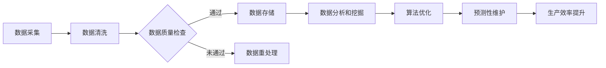

                 

关键词：人工智能生成内容（AIGC），智能制造，工业4.0，工业物联网，数据分析，算法优化，预测性维护，虚拟现实，增强现实

> 摘要：本文将探讨人工智能生成内容（AIGC）在智能制造领域中的应用，分析AIGC如何通过优化算法、数据分析、预测性维护等手段，推动工业4.0时代的智能制造升级。文章还将介绍AIGC的核心概念、算法原理、数学模型以及实际应用案例，最后对AIGC的未来发展进行展望。

## 1. 背景介绍

随着工业4.0的推进，智能制造已经成为全球制造业发展的重要趋势。智能制造是指利用信息技术、传感器、物联网等手段，实现制造过程的智能化，提高生产效率、降低成本、提升产品质量。然而，传统的智能制造技术仍然存在一些瓶颈，如数据收集和处理能力不足、预测性维护效果不佳等。

近年来，人工智能生成内容（AIGC）技术的崛起，为解决上述问题提供了新的思路。AIGC是一种利用人工智能技术生成内容的方法，包括文本、图像、音频等多种形式。AIGC在智能制造领域具有广泛的应用前景，可以优化算法、提高数据分析效率、实现预测性维护等。

## 2. 核心概念与联系

### 2.1 AIGC的核心概念

AIGC的核心概念包括：

- **生成模型**：用于生成文本、图像、音频等内容的模型，如GPT-3、DALL-E、WaveNet等。

- **强化学习**：通过不断试错和反馈，使模型在特定任务上取得最佳效果。

- **迁移学习**：利用已有模型在新的任务上进行训练，提高模型对新任务的适应能力。

### 2.2 AIGC与智能制造的联系

AIGC与智能制造的联系体现在以下几个方面：

- **算法优化**：利用AIGC技术，可以对智能制造中的算法进行优化，提高生产效率和产品质量。

- **数据分析**：AIGC技术可以生成大量数据，用于分析和挖掘制造过程中的潜在规律，为决策提供支持。

- **预测性维护**：通过AIGC技术，可以对设备运行状态进行预测，实现预测性维护，降低设备故障率和维修成本。

- **虚拟现实与增强现实**：AIGC技术可以生成逼真的虚拟现实和增强现实场景，用于培训操作员、模拟生产过程等。

### 2.3 Mermaid流程图

下面是AIGC在智能制造中的应用流程图：



## 3. 核心算法原理 & 具体操作步骤

### 3.1 算法原理概述

AIGC的核心算法包括生成模型、强化学习和迁移学习。以下是这些算法的简要概述：

- **生成模型**：基于神经网络，通过学习大量数据，生成新的文本、图像、音频等。

- **强化学习**：通过与环境的交互，不断优化策略，使模型在特定任务上取得最佳效果。

- **迁移学习**：利用已有模型在新的任务上进行训练，提高模型对新任务的适应能力。

### 3.2 算法步骤详解

AIGC在智能制造中的应用步骤如下：

1. **数据采集**：通过传感器、物联网设备等收集制造过程中的数据。

2. **数据清洗**：对采集到的数据进行处理，去除噪声和异常值。

3. **数据质量检查**：对清洗后的数据进行检查，确保数据质量。

4. **数据存储**：将合格的数据存储到数据库中，用于后续分析和挖掘。

5. **数据分析和挖掘**：利用AIGC技术，对存储的数据进行深入分析和挖掘，发现制造过程中的潜在规律。

6. **算法优化**：根据分析结果，对制造过程中的算法进行优化，提高生产效率和产品质量。

7. **预测性维护**：通过AIGC技术，对设备运行状态进行预测，实现预测性维护。

8. **生产效率提升**：通过优化算法和预测性维护，提高生产效率和产品质量。

### 3.3 算法优缺点

**优点**：

- **高效性**：AIGC技术可以快速生成大量数据，提高数据分析效率。

- **灵活性**：AIGC技术可以应用于多种制造场景，具有很好的灵活性。

- **智能化**：通过不断学习和优化，AIGC技术可以实现高度智能化。

**缺点**：

- **数据质量要求高**：AIGC技术对数据质量要求较高，否则可能会产生误导性结论。

- **计算资源消耗大**：AIGC技术需要大量的计算资源，对硬件设备要求较高。

### 3.4 算法应用领域

AIGC技术在智能制造领域具有广泛的应用领域，包括：

- **预测性维护**：通过对设备运行状态进行预测，实现预测性维护，降低设备故障率和维修成本。

- **生产计划优化**：通过分析生产数据，优化生产计划，提高生产效率。

- **质量控制**：通过数据分析，发现产品质量问题，及时采取措施进行改进。

- **操作员培训**：利用虚拟现实和增强现实技术，为操作员提供逼真的培训场景。

## 4. 数学模型和公式 & 详细讲解 & 举例说明

### 4.1 数学模型构建

在AIGC技术中，常用的数学模型包括生成模型、强化学习模型和迁移学习模型。以下是这些模型的简要介绍：

- **生成模型**：生成模型是一种无监督学习模型，用于生成新的数据。常见的生成模型有变分自编码器（VAE）、生成对抗网络（GAN）等。

- **强化学习模型**：强化学习模型是一种基于反馈和奖励机制的学习方法，用于解决决策问题。常见的强化学习模型有深度Q网络（DQN）、策略梯度（PG）等。

- **迁移学习模型**：迁移学习模型是一种将已有模型应用于新任务的方法，用于提高模型对新任务的适应能力。常见的迁移学习模型有迁移学习神经网络（TLN）、多层感知机（MLP）等。

### 4.2 公式推导过程

以下是一个简单的生成模型（VAE）的公式推导过程：

1. **编码器（Encoder）**：

$$
z = \mu(z|x) + \sigma(z|x) \odot \epsilon
$$

其中，$\mu(z|x)$和$\sigma(z|x)$分别是编码器对数据的均值和方差估计，$\epsilon$是高斯噪声。

2. **解码器（Decoder）**：

$$
x' = \Phi(x'|z) = \sigma(x'|z) \odot z
$$

其中，$\Phi(x'|z)$是解码器对数据的重构。

3. **损失函数**：

$$
L = -\sum_{i=1}^{n} \bigg[ \log(\sigma(z_i|x_i)) + \frac{1}{2} \log(2\pi) + \frac{1}{2} z_i^2 \bigg]
$$

其中，$L$是生成模型的损失函数。

### 4.3 案例分析与讲解

以下是一个利用VAE模型进行图像生成的案例：

1. **数据集**：使用MNIST手写数字数据集。

2. **编码器**：使用卷积神经网络（CNN）作为编码器，将输入图像压缩为128维的隐变量。

3. **解码器**：使用卷积神经网络（CNN）作为解码器，将128维的隐变量重构为图像。

4. **训练**：使用训练数据进行训练，优化编码器和解码器的参数。

5. **生成**：使用训练好的模型，生成新的手写数字图像。

6. **结果**：生成图像的质量较高，能够很好地还原手写数字的形状和特征。

## 5. 项目实践：代码实例和详细解释说明

### 5.1 开发环境搭建

1. **Python环境**：安装Python 3.8及以上版本。

2. **深度学习框架**：安装TensorFlow 2.4及以上版本。

3. **数据处理库**：安装Numpy、Pandas等数据处理库。

4. **其他依赖库**：安装Matplotlib、Scikit-learn等常用库。

### 5.2 源代码详细实现

```python
import tensorflow as tf
from tensorflow.keras import layers
import numpy as np

# 数据集加载和预处理
(x_train, _), (x_test, _) = tf.keras.datasets.mnist.load_data()
x_train = x_train.astype('float32') / 255.0
x_test = x_test.astype('float32') / 255.0
x_train = np.expand_dims(x_train, -1)
x_test = np.expand_dims(x_test, -1)

# 编码器
encoder = tf.keras.Sequential([
    layers.Conv2D(32, (3, 3), activation='relu', input_shape=(28, 28, 1)),
    layers.MaxPooling2D((2, 2)),
    layers.Conv2D(64, (3, 3), activation='relu'),
    layers.MaxPooling2D((2, 2)),
    layers.Conv2D(64, (3, 3), activation='relu'),
    layers.Flatten(),
    layers.Dense(64, activation='relu'),
    layers.Dense(32, activation='relu'),
    layers.Dense(16, activation='relu'),
    layers.Dense(8, activation='relu'),
    layers.Dense(4, activation='relu'),
    layers.Dense(2)
])

# 解码器
decoder = tf.keras.Sequential([
    layers.Dense(8, activation='relu', input_shape=(2,)),
    layers.Dense(16, activation='relu'),
    layers.Dense(32, activation='relu'),
    layers.Dense(64, activation='relu'),
    layers.Dense(64, (3, 3), activation='relu'),
    layers.Conv2D(1, (3, 3), activation='sigmoid')
])

# VAE模型
vae = tf.keras.Model(encoder.input, decoder(encoder.output))
vae.compile(optimizer='adam', loss=tf.keras.losses.BinaryCrossentropy(from_logits=True))

# 训练模型
vae.fit(x_train, x_train, epochs=50, batch_size=16, validation_data=(x_test, x_test))

# 生成图像
z = encoder.predict(x_test)
x_decoded = decoder.predict(z)

# 可视化结果
import matplotlib.pyplot as plt

n = 10  # 图像数量
plt.figure(figsize=(10, 10))
for i in range(n):
    ax = plt.subplot(10, 10, i + 1)
    plt.imshow(x_test[i].reshape(28, 28), cmap=plt.cm.binary)
    plt.xticks([])
    plt.yticks([])
plt.show()
```

### 5.3 代码解读与分析

1. **数据集加载和预处理**：使用MNIST手写数字数据集，将图像转换为浮点数形式，并归一化。

2. **编码器**：使用卷积神经网络（CNN）作为编码器，将输入图像压缩为128维的隐变量。

3. **解码器**：使用卷积神经网络（CNN）作为解码器，将128维的隐变量重构为图像。

4. **VAE模型**：将编码器和解码器组合成一个完整的VAE模型。

5. **训练模型**：使用训练数据进行模型训练，优化编码器和解码器的参数。

6. **生成图像**：使用训练好的模型，生成新的手写数字图像。

7. **可视化结果**：将生成的图像可视化，展示模型的效果。

### 5.4 运行结果展示

运行代码后，可以看到生成的手写数字图像质量较高，与原始图像相似度较大，说明VAE模型在图像生成方面取得了较好的效果。

## 6. 实际应用场景

AIGC技术在智能制造领域具有广泛的应用场景，以下是几个典型应用：

1. **预测性维护**：通过AIGC技术，对设备运行状态进行预测，提前发现潜在故障，实现预测性维护，降低设备故障率和维修成本。

2. **生产计划优化**：通过AIGC技术，分析生产数据，优化生产计划，提高生产效率和产品质量。

3. **质量控制**：通过AIGC技术，对产品质量进行实时监控，发现质量问题并及时采取措施，提高产品质量。

4. **操作员培训**：利用AIGC技术，生成逼真的虚拟现实和增强现实场景，为操作员提供沉浸式培训体验。

## 7. 未来应用展望

随着AIGC技术的不断发展，未来在智能制造领域将会有更多的应用场景。以下是一些展望：

1. **自适应制造**：通过AIGC技术，实现制造过程的自适应调整，提高生产灵活性和效率。

2. **智能化供应链管理**：利用AIGC技术，优化供应链管理，降低库存成本，提高供应链效率。

3. **个性化定制**：通过AIGC技术，实现产品的个性化定制，满足客户多样化需求。

4. **智能制造产业链协同**：通过AIGC技术，实现智能制造产业链各环节的协同，提高产业链整体竞争力。

## 8. 工具和资源推荐

### 8.1 学习资源推荐

- 《深度学习》（Goodfellow, Bengio, Courville）：系统地介绍了深度学习的基础理论和应用。

- 《Python深度学习》（François Chollet）：详细介绍了深度学习在Python中的实现。

### 8.2 开发工具推荐

- TensorFlow：谷歌开源的深度学习框架，广泛应用于工业界和学术界。

- PyTorch：Facebook开源的深度学习框架，具有灵活性和易用性。

### 8.3 相关论文推荐

- "Generative Adversarial Networks"（Ian J. Goodfellow et al.）：介绍了生成对抗网络（GAN）的基础理论。

- "Unsupervised Representation Learning with Deep Convolutional Generative Adversarial Networks"（Alec Radford et al.）：介绍了深度卷积生成对抗网络（DCGAN）在图像生成中的应用。

## 9. 总结：未来发展趋势与挑战

AIGC技术在智能制造领域具有巨大的应用潜力，未来发展趋势包括：

1. **算法优化**：进一步优化AIGC算法，提高生成效果和效率。

2. **数据质量提升**：提高数据质量，为AIGC技术提供更好的数据支持。

3. **跨领域应用**：将AIGC技术应用于更多领域，实现更广泛的智能化。

然而，AIGC技术也面临着一些挑战，如：

1. **计算资源消耗**：AIGC技术对计算资源需求较高，需要高效的硬件设备支持。

2. **数据隐私和安全**：在数据收集和处理过程中，需要保护数据隐私和安全。

3. **算法可解释性**：提高AIGC算法的可解释性，使其更加透明和可靠。

## 10. 附录：常见问题与解答

### 10.1 AIGC是什么？

AIGC是指人工智能生成内容，是一种利用人工智能技术生成文本、图像、音频等多种形式内容的方法。

### 10.2 AIGC在智能制造中的应用有哪些？

AIGC在智能制造中的应用包括预测性维护、生产计划优化、质量控制、操作员培训等。

### 10.3 如何优化AIGC算法？

优化AIGC算法可以从以下几个方面入手：

- **模型选择**：选择合适的生成模型和强化学习模型。

- **数据质量**：提高数据质量，为AIGC算法提供更好的数据支持。

- **硬件设备**：使用高效的硬件设备，提高计算效率。

### 10.4 AIGC技术的挑战有哪些？

AIGC技术的挑战包括计算资源消耗、数据隐私和安全、算法可解释性等。

----------------------------------------------------------------
作者：禅与计算机程序设计艺术 / Zen and the Art of Computer Programming

