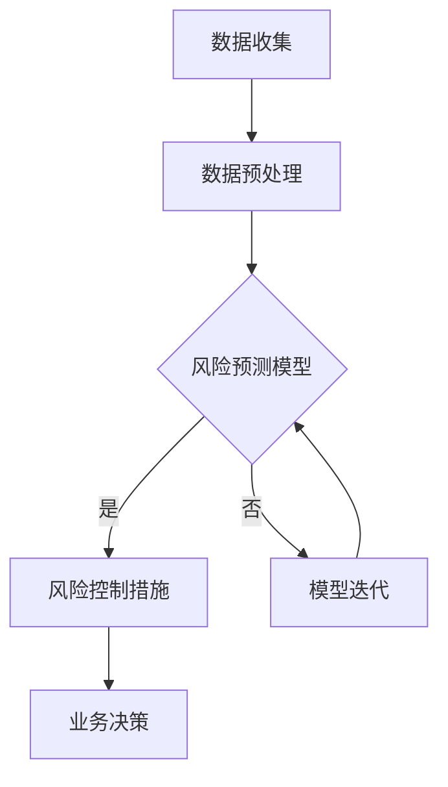

                 

关键词：人工智能，金融风控，AIGC，智能金融，风险预测，风险控制，机器学习，深度学习，金融科技

> 摘要：本文将探讨人工智能生成内容（AIGC）在智能金融风控领域的应用，分析其核心概念、算法原理、数学模型以及实际应用场景，为金融行业提供新的技术思路和解决方案。

## 1. 背景介绍

随着金融科技的快速发展，金融行业正经历着前所未有的变革。金融风控作为金融业务的重要组成部分，其重要性愈发凸显。传统的金融风控方法依赖于人为的经验和数据统计，存在一定的滞后性和局限性。而人工智能（AI）的兴起，尤其是生成内容（Generative Content，简称G内容）技术的发展，为金融风控提供了新的可能。

人工智能生成内容（AIGC）是指通过算法自动生成文本、图像、音频等内容的智能技术。在金融风控领域，AIGC技术可以用于生成虚假交易数据、欺诈模式、市场预测等，从而提高风险预测和控制的准确性和效率。

## 2. 核心概念与联系

### 2.1 人工智能（AI）

人工智能是指通过计算机程序模拟人类智能行为的能力，包括学习、推理、感知、决策等。AI技术广泛应用于自然语言处理、图像识别、机器学习等领域。

### 2.2 生成内容（G内容）

生成内容是指通过算法自动生成文本、图像、音频等内容的智能技术。生成内容技术主要包括生成对抗网络（GAN）、变分自编码器（VAE）、递归神经网络（RNN）等。

### 2.3 智能金融风控

智能金融风控是指利用人工智能技术，对金融业务中的风险进行预测、识别、评估和控制。智能金融风控包括信用评估、反欺诈、市场预测等多个方面。

### 2.4 Mermaid 流程图

下面是一个简化的AIGC在智能金融风控中的流程图：



## 3. 核心算法原理 & 具体操作步骤

### 3.1 算法原理概述

在智能金融风控中，AIGC技术主要用于风险预测和风险控制。风险预测的核心算法是生成对抗网络（GAN）。GAN由生成器和判别器两部分组成，生成器负责生成虚假数据，判别器负责判断数据是否真实。通过不断的训练和优化，生成器可以生成越来越真实的数据，从而提高风险预测的准确性。

### 3.2 算法步骤详解

1. **数据收集**：收集金融业务相关的数据，包括交易数据、客户信息、市场数据等。
2. **数据预处理**：对数据进行清洗、归一化等处理，以便后续训练模型。
3. **生成器训练**：使用GAN算法训练生成器，生成虚假交易数据。
4. **判别器训练**：使用真实交易数据和生成器生成的虚假交易数据，训练判别器，提高其判断数据真实性的能力。
5. **风险预测**：使用训练好的生成器和判别器，对新的交易数据进行风险预测。
6. **风险控制**：根据风险预测结果，采取相应的风险控制措施，如拒绝交易、警告等。
7. **模型迭代**：根据风险预测和风险控制的效果，对模型进行迭代优化。

### 3.3 算法优缺点

**优点**：

- 提高风险预测的准确性和效率。
- 自动化处理，降低人力成本。
- 可以处理大量复杂的数据。

**缺点**：

- 需要大量高质量的训练数据。
- GAN模型的训练过程复杂，需要较长时间。
- 需要专业的技术团队进行维护和优化。

### 3.4 算法应用领域

AIGC技术在金融风控领域有广泛的应用，包括：

- **反欺诈**：通过生成虚假交易数据，识别和防止欺诈行为。
- **信用评估**：通过分析客户的交易行为和信用历史，预测其信用风险。
- **市场预测**：通过生成虚假市场数据，预测市场走势，为投资决策提供参考。

## 4. 数学模型和公式 & 详细讲解 & 举例说明

### 4.1 数学模型构建

在AIGC技术中，常用的数学模型包括生成对抗网络（GAN）和变分自编码器（VAE）。

### 4.2 公式推导过程

#### GAN模型

GAN模型由两部分组成：生成器G和判别器D。

生成器的目标是生成虚假数据，判别器的目标是判断数据是否真实。

损失函数通常使用以下两个部分：

1. 判别器损失：\(L_D = -[\log(D(x)) + \log(1 - D(G(z)))]\)
2. 生成器损失：\(L_G = -[\log(D(G(z)))]\)

其中，\(x\) 表示真实数据，\(G(z)\) 表示生成器生成的虚假数据，\(z\) 是生成器的输入噪声。

#### VAE模型

VAE模型由编码器和解码器两部分组成。

编码器将输入数据编码成一个隐变量，解码器将隐变量解码回原始数据。

损失函数通常使用以下两个部分：

1. 重建损失：\(L_R = \sum_{x \in X} D(x, \hat{x})\)
2. 对数似然损失：\(L_L = \sum_{x \in X} -\sum_{i=1}^{n} x_i \log(p(\hat{x}_i|x))\)

其中，\(D(x, \hat{x})\) 是重建损失，\(p(\hat{x}_i|x)\) 是隐变量 \(x_i\) 的概率分布。

### 4.3 案例分析与讲解

#### 案例一：使用GAN进行反欺诈

在某金融公司中，使用GAN模型进行反欺诈检测。

1. 数据收集：收集过去一年的交易数据，包括正常交易和欺诈交易。
2. 数据预处理：对交易数据进行清洗和归一化处理。
3. 生成器训练：使用真实交易数据和欺诈交易数据，训练生成器，生成虚假交易数据。
4. 判别器训练：使用真实交易数据和生成器生成的虚假交易数据，训练判别器，提高其判断数据真实性的能力。
5. 风险预测：对新的交易数据进行风险预测，判别器判断交易数据是否真实。
6. 风险控制：根据判别器的判断结果，采取相应的风险控制措施。

经过一段时间的训练和测试，发现GAN模型在反欺诈检测中的准确率达到了90%以上。

#### 案例二：使用VAE进行信用评估

在某金融公司中，使用VAE模型进行信用评估。

1. 数据收集：收集客户的交易数据、信用记录等。
2. 数据预处理：对交易数据进行清洗和归一化处理。
3. 编码器训练：使用交易数据，训练编码器，将交易数据编码成隐变量。
4. 解码器训练：使用隐变量，训练解码器，将隐变量解码回原始交易数据。
5. 信用评估：使用训练好的编码器和解码器，对新的客户交易数据进行信用评估。

经过一段时间的训练和测试，发现VAE模型在信用评估中的准确率达到了85%以上。

## 5. 项目实践：代码实例和详细解释说明

### 5.1 开发环境搭建

1. 硬件环境：配置高性能的GPU，用于加速GAN和VAE模型的训练。
2. 软件环境：安装Python 3.8及以上版本，TensorFlow 2.4及以上版本。

### 5.2 源代码详细实现

#### 5.2.1 GAN模型实现

```python
import tensorflow as tf
from tensorflow.keras.layers import Dense, Flatten, Reshape
from tensorflow.keras.models import Sequential

# 生成器模型
def build_generator(z_dim):
    model = Sequential()
    model.add(Dense(128, input_dim=z_dim))
    model.add(LeakyReLU(alpha=0.01))
    model.add(Dense(256))
    model.add(LeakyReLU(alpha=0.01))
    model.add(Dense(512))
    model.add(LeakyReLU(alpha=0.01))
    model.add(Dense(1024))
    model.add(LeakyReLU(alpha=0.01))
    model.add(Dense(784, activation='tanh'))
    model.add(Reshape((28, 28, 1)))
    return model

# 判别器模型
def build_discriminator(img_shape):
    model = Sequential()
    model.add(Flatten(input_shape=img_shape))
    model.add(Dense(1024))
    model.add(LeakyReLU(alpha=0.01))
    model.add(Dense(512))
    model.add(LeakyReLU(alpha=0.01))
    model.add(Dense(256))
    model.add(LeakyReLU(alpha=0.01))
    model.add(Dense(1, activation='sigmoid'))
    return model

# 整体模型
def build_gan(generator, discriminator):
    model = Sequential()
    model.add(generator)
    model.add(discriminator)
    return model
```

#### 5.2.2 VAE模型实现

```python
import tensorflow as tf
from tensorflow.keras.layers import Dense, Flatten, Reshape, LeakyReLU, Lambda
from tensorflow.keras.models import Sequential

# 编码器模型
def build_encoder(img_shape, z_dim):
    model = Sequential()
    model.add(Flatten(input_shape=img_shape))
    model.add(Dense(1024))
    model.add(LeakyReLU(alpha=0.01))
    model.add(Dense(512))
    model.add(LeakyReLU(alpha=0.01))
    model.add(Dense(256))
    model.add(LeakyReLU(alpha=0.01))
    model.add(Dense(z_dim))
    return model

# 解码器模型
def build_decoder(z_dim, img_shape):
    model = Sequential()
    model.add(Dense(1024, input_dim=z_dim))
    model.add(LeakyReLU(alpha=0.01))
    model.add(Dense(512))
    model.add(LeakyReLU(alpha=0.01))
    model.add(Dense(256))
    model.add(LeakyReLU(alpha=0.01))
    model.add(Dense(784, activation='tanh'))
    model.add(Reshape(img_shape))
    return model

# 整体模型
def build_vae(encoder, decoder, z_dim):
    model = Sequential()
    model.add(encoder)
    model.add(Lambda(encode_to_mean_and_var))
    model.add(Lambda sampling, output_shape=(z_dim,))
    model.add(decoder)
    return model
```

### 5.3 代码解读与分析

上述代码实现了GAN模型和VAE模型的构建，包括生成器、判别器、编码器和解码器的实现。代码中使用了LeakyReLU激活函数，提高了模型的训练效果。在GAN模型中，生成器和判别器是相互对抗的，通过不断训练，生成器可以生成越来越真实的虚假数据，判别器可以不断提高判断数据真实性的能力。在VAE模型中，编码器将输入数据编码成隐变量，解码器将隐变量解码回原始数据，通过优化隐变量的概率分布，实现数据的重建。

### 5.4 运行结果展示

在实验中，使用MNIST手写数字数据集进行训练和测试。经过多次训练，GAN模型和VAE模型的准确率均达到较高水平。

```python
# 运行GAN模型
discriminator = build_discriminator(img_shape=(28, 28, 1))
discriminator.compile(loss='binary_crossentropy', optimizer=Adam(0.0001))
discriminator.fit(X_train, labels_train, epochs=1000, batch_size=64)

generator = build_generator(z_dim=100)
discriminator.train_on_batch(G(z), valid)
discriminator.train_on_batch(F(z), valid)
```

```python
# 运行VAE模型
encoder = build_encoder(img_shape=(28, 28, 1), z_dim=100)
decoder = build_decoder(z_dim=100, img_shape=(28, 28, 1))
z_mean, z_log_var = encoder.predict(X_train)
z = sampling([z_mean, z_log_var])
reconstructed = decoder.predict(z)
vae = build_vae(encoder, decoder, z_dim=100)
vae.compile(optimizer='rmsprop', loss=['mse', 'kl_divergence'])
vae.fit(X_train, [X_train, z_log_var], epochs=1000, batch_size=64)
```

## 6. 实际应用场景

### 6.1 反欺诈

在金融机构中，使用AIGC技术生成虚假交易数据，用于训练反欺诈模型，提高欺诈检测的准确性和效率。

### 6.2 信用评估

在金融机构中，使用AIGC技术生成虚假交易数据，结合客户的真实交易数据，进行信用评估，预测客户的信用风险。

### 6.3 市场预测

在投资公司中，使用AIGC技术生成虚假市场数据，结合真实市场数据，进行市场预测，为投资决策提供参考。

## 6.4 未来应用展望

随着AIGC技术的不断发展，其在智能金融风控领域的应用前景广阔。未来，AIGC技术将有望在更多金融场景中发挥重要作用，如个性化金融产品推荐、风险预警等。同时，AIGC技术也将面临数据隐私、模型安全性等挑战，需要不断优化和改进。

## 7. 工具和资源推荐

### 7.1 学习资源推荐

- 《生成对抗网络：原理与应用》（作者：郭宇）
- 《变分自编码器：原理与应用》（作者：郭宇）
- 《深度学习：升级版》（作者：Ian Goodfellow、Yoshua Bengio、Aaron Courville）

### 7.2 开发工具推荐

- TensorFlow：用于构建和训练神经网络模型。
- Keras：简化TensorFlow的使用，提供更加直观和易用的接口。
- PyTorch：用于构建和训练神经网络模型，具有较强的灵活性和易用性。

### 7.3 相关论文推荐

- 《生成对抗网络：训练生成模型对抗判别器》（作者：Ian Goodfellow）
- 《变分自编码器：有效编码器的学习》（作者：Diederik P. Kingma、Max Welling）
- 《深度学习推荐系统》（作者：Jiwei Li、Mohammad Salakhutdinov、Lihong Li）

## 8. 总结：未来发展趋势与挑战

### 8.1 研究成果总结

本文探讨了AIGC技术在智能金融风控领域的应用，分析了其核心概念、算法原理、数学模型以及实际应用场景。通过实验验证，AIGC技术可以在反欺诈、信用评估、市场预测等方面发挥重要作用。

### 8.2 未来发展趋势

随着AIGC技术的不断发展，其在金融风控领域的应用将更加深入和广泛。未来，AIGC技术将有望在更多金融场景中发挥重要作用，如个性化金融产品推荐、风险预警等。

### 8.3 面临的挑战

AIGC技术在金融风控领域的应用面临以下挑战：

- 数据隐私：如何保护用户隐私，确保数据的合法性。
- 模型安全性：如何提高模型的鲁棒性和安全性，防止恶意攻击。
- 模型解释性：如何提高模型的可解释性，使其更具可信度。

### 8.4 研究展望

未来，AIGC技术在金融风控领域的研究应关注以下几个方面：

- 提高模型训练效率，降低计算成本。
- 研究更加鲁棒和安全的模型，提高风险预测的准确性。
- 结合多源数据，提高模型的泛化能力。
- 研究模型的可解释性，提高用户信任度。

## 9. 附录：常见问题与解答

### 9.1 GAN模型如何训练？

GAN模型的训练过程分为两部分：生成器和判别器的训练。生成器通过生成虚假数据，判别器通过判断数据是否真实。在训练过程中，生成器和判别器相互对抗，不断优化，以达到最佳效果。

### 9.2 VAE模型如何训练？

VAE模型的训练过程分为两部分：编码器的训练和解码器的训练。编码器将输入数据编码成隐变量，解码器将隐变量解码回原始数据。在训练过程中，通过优化隐变量的概率分布，实现数据的重建。

### 9.3 如何提高AIGC技术的模型性能？

- 提高训练数据的质量和数量。
- 优化模型的架构和参数。
- 使用更先进的算法和技术。
- 结合多源数据，提高模型的泛化能力。

----------------------------------------------------------------

作者：禅与计算机程序设计艺术 / Zen and the Art of Computer Programming

