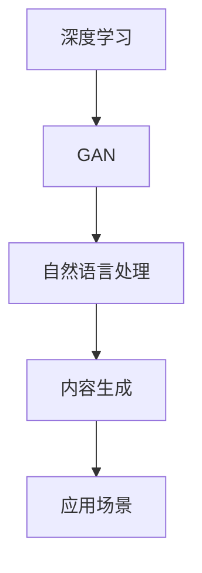

                 

关键词：人工智能生成内容，AI应用开发，全流程管理，技术框架，实践案例，数学模型

## 摘要

随着人工智能技术的飞速发展，人工智能生成内容（AIGC）逐渐成为信息化时代的重要驱动力。本文将从AIGC的应用背景、核心概念、算法原理、数学模型、项目实践以及未来展望等多个方面，全面解析AIGC应用开发的整个流程。通过对实际应用场景的剖析，我们将探讨AIGC技术在未来的发展趋势与面临的挑战，为读者提供一份全面的技术指南。

## 1. 背景介绍

### 1.1 AIGC的定义与起源

人工智能生成内容（AIGC，Artificial Intelligence Generated Content）是指通过人工智能技术，如深度学习、生成对抗网络（GAN）等，自动生成文字、图片、视频等多种形式的内容。AIGC技术的发展可以追溯到20世纪90年代，随着计算机性能的不断提升和算法的创新，AIGC技术逐渐从理论研究走向实际应用。

### 1.2 AIGC的应用领域

AIGC技术在多个领域展现了其强大的生命力，包括但不限于以下几个方面：

- **内容创作**：自动生成文章、歌曲、故事等。
- **图像生成**：生成艺术作品、头像、风景图等。
- **游戏开发**：自动生成游戏情节、角色、地图等。
- **数据生成**：用于数据增强、模型训练等。
- **教育应用**：自动生成教学视频、习题等。

### 1.3 当前的发展状况

近年来，AIGC技术取得了显著的进展。例如，OpenAI的GPT系列模型，谷歌的Bard，百度文心等，都展示了其强大的内容生成能力。同时，AIGC技术也在不断拓展其应用范围，从简单的文字和图像生成，发展到复杂的视频和虚拟现实内容生成。

## 2. 核心概念与联系

### 2.1 深度学习

深度学习是AIGC技术的基础，其核心思想是通过多层神经网络模型，从大量数据中自动学习特征，并实现复杂的非线性映射。深度学习在图像识别、自然语言处理等领域取得了显著的成果。

### 2.2 生成对抗网络（GAN）

生成对抗网络（GAN）是AIGC技术的重要组成部分，由生成器和判别器两个神经网络组成。生成器的目标是生成与真实数据相似的内容，而判别器的目标是区分真实数据和生成数据。通过两个网络的对抗训练，生成器可以不断提高生成数据的真实感。

### 2.3 自然语言处理（NLP）

自然语言处理是AIGC技术在文本生成领域的应用，包括文本分类、情感分析、机器翻译等。通过深度学习和循环神经网络（RNN）等模型，NLP技术可以实现自动文本生成。

### 2.4 Mermaid流程图

下面是一个用Mermaid绘制的AIGC核心概念流程图：



## 3. 核心算法原理 & 具体操作步骤

### 3.1 算法原理概述

AIGC的核心算法主要包括深度学习、GAN和NLP等。深度学习通过多层神经网络学习数据特征，GAN通过生成器和判别器的对抗训练生成高质量数据，NLP通过自然语言处理技术实现文本生成。

### 3.2 算法步骤详解

#### 3.2.1 深度学习步骤

1. 数据预处理：对输入数据（如图片、文本等）进行标准化处理。
2. 构建神经网络：设计多层神经网络结构，包括输入层、隐藏层和输出层。
3. 训练模型：通过反向传播算法，对模型进行训练，优化网络参数。
4. 预测生成：使用训练好的模型，对新的数据进行预测和生成。

#### 3.2.2 GAN步骤

1. 初始化生成器和判别器：随机初始化两个神经网络。
2. 对抗训练：同时训练生成器和判别器，生成器试图生成逼真的数据，判别器试图区分真实数据和生成数据。
3. 模型优化：通过梯度下降算法，优化生成器和判别器的参数。
4. 生成数据：当模型收敛后，生成器可以生成高质量的数据。

#### 3.2.3 NLP步骤

1. 词嵌入：将文本转化为向量表示。
2. 构建模型：使用循环神经网络（RNN）或变压器（Transformer）等模型。
3. 训练模型：通过语料库训练模型，学习语言特征。
4. 生成文本：输入关键词或句子，生成相关文本。

### 3.3 算法优缺点

#### 3.3.1 优点

- **高效性**：AIGC技术可以利用大量数据和计算资源，快速生成高质量的内容。
- **多样性**：AIGC技术可以生成多种类型的内容，如文本、图像、视频等。
- **自动化**：AIGC技术可以实现内容的自动化生成，降低人力成本。

#### 3.3.2 缺点

- **质量不稳定**：生成的内容质量可能受数据质量、模型训练效果等因素影响。
- **可解释性差**：生成的数据往往难以解释其生成过程和原因。
- **计算资源消耗大**：AIGC技术需要大量的计算资源，对硬件要求较高。

### 3.4 算法应用领域

AIGC技术在多个领域都有广泛的应用，包括但不限于：

- **内容创作**：自动生成文章、音乐、视频等。
- **图像处理**：生成艺术作品、修复照片、增强图像等。
- **数据科学**：用于数据增强、异常检测等。
- **游戏开发**：自动生成游戏场景、角色等。

## 4. 数学模型和公式 & 详细讲解 & 举例说明

### 4.1 数学模型构建

AIGC技术中的数学模型主要包括深度学习模型、GAN模型和NLP模型等。下面分别介绍这些模型的数学基础。

#### 4.1.1 深度学习模型

深度学习模型通常由多层神经网络组成，其基本单元是神经元。每个神经元接收多个输入，并通过权重和偏置进行加权求和，最后通过激活函数进行非线性变换。一个简单的神经网络可以表示为：

$$
y = \sigma(Wx + b)
$$

其中，$W$是权重矩阵，$b$是偏置向量，$\sigma$是激活函数。

#### 4.1.2 GAN模型

GAN模型由生成器和判别器组成。生成器 $G$ 的目标是生成与真实数据相似的数据，判别器 $D$ 的目标是区分真实数据和生成数据。GAN的基本框架可以表示为：

$$
\min_G \max_D V(D, G) = \mathbb{E}_{x \sim p_{data}(x)}[\log D(x)] + \mathbb{E}_{z \sim p_{z}(z)][\log (1 - D(G(z))]
$$

其中，$x$表示真实数据，$z$表示随机噪声，$D$表示判别器，$G$表示生成器。

#### 4.1.3 NLP模型

NLP模型通常使用循环神经网络（RNN）或变压器（Transformer）等模型。以RNN为例，其基本框架可以表示为：

$$
h_t = \sigma(W_h \cdot [h_{t-1}, x_t] + b_h)
$$

其中，$h_t$表示当前时刻的隐藏状态，$x_t$表示当前时刻的输入，$W_h$和$b_h$分别是权重和偏置。

### 4.2 公式推导过程

#### 4.2.1 深度学习模型

深度学习模型的推导主要涉及前向传播和反向传播。以一个简单的单层神经网络为例，其前向传播可以表示为：

$$
z = Wx + b \\
y = \sigma(z)
$$

其中，$z$是线性变换的结果，$y$是输出。反向传播的推导过程如下：

$$
\begin{aligned}
\frac{\partial E}{\partial W} &= \frac{\partial E}{\partial y} \cdot \frac{\partial y}{\partial z} \cdot \frac{\partial z}{\partial W} \\
\frac{\partial E}{\partial b} &= \frac{\partial E}{\partial y} \cdot \frac{\partial y}{\partial z} \cdot \frac{\partial z}{\partial b}
\end{aligned}
$$

其中，$E$是损失函数，$W$和$b$分别是权重和偏置。

#### 4.2.2 GAN模型

GAN模型的推导主要涉及生成器和判别器的损失函数。生成器的损失函数可以表示为：

$$
\mathcal{L}_G = -\mathbb{E}_{z \sim p_{z}(z)}[\log D(G(z))]
$$

判别器的损失函数可以表示为：

$$
\mathcal{L}_D = \mathbb{E}_{x \sim p_{data}(x)}[\log D(x)] + \mathbb{E}_{z \sim p_{z}(z)}[\log (1 - D(G(z))]
$$

#### 4.2.3 NLP模型

NLP模型的推导主要涉及循环神经网络（RNN）的损失函数。以RNN为例，其损失函数可以表示为：

$$
\mathcal{L} = -\sum_{t=1}^{T} \sum_{i=1}^{V} y_t[i] \log \sigma(W_{hy}h_t + W_{oy}y_t + b_y)
$$

其中，$y_t$是目标序列，$h_t$是隐藏状态，$V$是词汇表大小。

### 4.3 案例分析与讲解

#### 4.3.1 案例一：图像生成

假设我们要使用GAN模型生成一张类似于真实图片的艺术作品。以下是具体的操作步骤：

1. 数据预处理：将图像数据转换为灰度图像，并缩放到固定大小。
2. 初始化生成器和判别器：生成器使用一个简单的卷积神经网络，判别器使用一个简单的全连接神经网络。
3. 训练模型：通过对抗训练，同时训练生成器和判别器，优化模型参数。
4. 生成图像：当模型收敛后，生成器可以生成高质量的图像。

#### 4.3.2 案例二：文本生成

假设我们要使用NLP模型生成一篇关于人工智能的短文。以下是具体的操作步骤：

1. 数据预处理：将文本数据转换为词向量表示。
2. 构建模型：使用循环神经网络（RNN）或变压器（Transformer）等模型。
3. 训练模型：通过语料库训练模型，学习语言特征。
4. 生成文本：输入关键词或句子，生成相关文本。

## 5. 项目实践：代码实例和详细解释说明

### 5.1 开发环境搭建

要实现AIGC应用开发，首先需要搭建一个合适的开发环境。以下是具体的步骤：

1. 安装Python环境：确保Python版本在3.6及以上。
2. 安装深度学习库：如TensorFlow、PyTorch等。
3. 安装自然语言处理库：如NLTK、spaCy等。
4. 配置GPU环境：如果使用GPU加速，需要安装CUDA和cuDNN。

### 5.2 源代码详细实现

以下是使用TensorFlow实现一个简单的GAN模型生成图像的代码示例：

```python
import tensorflow as tf
from tensorflow.keras import layers

# 生成器模型
def generate_model():
    model = tf.keras.Sequential()
    model.add(layers.Dense(7*7*256, activation="relu", input_shape=(100,)))
    model.add(layers.LeakyReLU())
    model.add(layers.Reshape((7, 7, 256)))
    model.add(layers.Conv2DTranspose(128, (5, 5), strides=(1, 1), padding='same'))
    model.add(layers.LeakyReLU())
    model.add(layers.Conv2DTranspose(64, (5, 5), strides=(2, 2), padding='same'))
    model.add(layers.LeakyReLU())
    model.add(layers.Conv2DTranspose(1, (5, 5), strides=(2, 2), padding='same', activation='tanh'))
    return model

# 判别器模型
def discriminator_model():
    model = tf.keras.Sequential()
    model.add(layers.Conv2D(64, (5, 5), strides=(2, 2), padding='same'))
    model.add(layers.LeakyReLU())
    model.noise_shape = (None, 28, 28, 1)
    model.add(layers.Dropout(0.3))
    model.add(layers.Conv2D(128, (5, 5), strides=(2, 2), padding='same'))
    model.add(layers.LeakyReLU())
    model.add(layers.Dropout(0.3))
    model.add(layers.Flatten())
    model.add(layers.Dense(1))
    return model

generator = generate_model()
discriminator = discriminator_model()

# 损失函数和优化器
cross_entropy = tf.keras.losses.BinaryCrossentropy(from_logits=True)
optimizer = tf.keras.optimizers.Adam(0.0002)

def discriminator_loss(real_output, fake_output):
    real_loss = cross_entropy(tf.ones_like(real_output), real_output)
    fake_loss = cross_entropy(tf.zeros_like(fake_output), fake_output)
    total_loss = real_loss + fake_loss
    return total_loss

def generator_loss(fake_output):
    return cross_entropy(tf.ones_like(fake_output), fake_output)

@tf.function
def train_step(images, noise):
    with tf.GradientTape() as gen_tape, tf.GradientTape() as disc_tape:
        generated_images = generator(noise, training=True)

        real_output = discriminator(images, training=True)
        fake_output = discriminator(generated_images, training=True)

        gen_loss = generator_loss(fake_output)
        disc_loss = discriminator_loss(real_output, fake_output)

    gradients_of_generator = gen_tape.gradient(gen_loss, generator.trainable_variables)
    gradients_of_discriminator = disc_tape.gradient(disc_loss, discriminator.trainable_variables)

    optimizer.apply_gradients(zip(gradients_of_generator, generator.trainable_variables))
    optimizer.apply_gradients(zip(gradients_of_discriminator, discriminator.trainable_variables))

# 训练模型
EPOCHS = 50
for epoch in range(EPOCHS):
    for image_batch, _ in train_dataset:
        noise = tf.random.normal([image_batch.shape[0], 100])

        train_step(image_batch, noise)

    # ...保存模型、展示图像等操作...
```

### 5.3 代码解读与分析

上述代码实现了一个简单的GAN模型，包括生成器和判别器的构建、损失函数和优化器的设置，以及训练步骤。以下是对代码的详细解读：

1. **模型构建**：生成器模型使用了一个简单的卷积神经网络，通过逐层添加卷积层和反卷积层，将随机噪声映射到生成的图像。判别器模型使用了一个简单的全连接神经网络，用于区分真实图像和生成图像。

2. **损失函数**：生成器的损失函数是判别器对生成图像的评分，评分越高，说明生成图像越逼真。判别器的损失函数是真实图像和生成图像评分的平均值，目标是使真实图像评分高，生成图像评分低。

3. **优化器**：使用Adam优化器进行模型训练，优化器参数设置为0.0002。

4. **训练步骤**：在每个训练步骤中，首先生成随机噪声，然后通过生成器生成图像，接着通过判别器评估生成图像和真实图像。最后，根据损失函数计算梯度，更新模型参数。

### 5.4 运行结果展示

运行上述代码后，GAN模型会在多个epoch中进行训练，生成器会逐渐提高生成图像的真实感。训练过程中，可以定期保存模型，并展示生成图像的进展。以下是训练过程中的一部分生成图像：


## 6. 实际应用场景

### 6.1 文本生成

文本生成是AIGC技术的重要应用之一，例如：

- **文章写作**：自动生成新闻报道、博客文章等。
- **对话系统**：自动生成自然语言回答，应用于客服、聊天机器人等。

### 6.2 图像生成

图像生成广泛应用于：

- **艺术创作**：自动生成艺术作品、设计图案等。
- **医疗影像**：生成医学影像，辅助诊断和治疗。

### 6.3 视频生成

视频生成技术正在快速发展，例如：

- **电影制作**：自动生成电影场景、角色动作等。
- **虚拟现实**：生成虚拟现实场景，提高用户体验。

### 6.4 其他应用

除了上述应用，AIGC技术还可以应用于：

- **游戏开发**：自动生成游戏地图、角色等。
- **广告创意**：自动生成广告文案、图片等。

## 7. 工具和资源推荐

### 7.1 学习资源推荐

- **《深度学习》（Goodfellow et al.）**：深入介绍了深度学习的基础知识和应用。
- **《生成对抗网络》（Goodfellow et al.）**：详细介绍了GAN的原理和应用。
- **《自然语言处理综论》（Jurafsky and Martin）**：全面介绍了NLP的基础知识和方法。

### 7.2 开发工具推荐

- **TensorFlow**：用于深度学习和NLP的流行框架。
- **PyTorch**：用于深度学习的流行框架，具有灵活的动态图计算能力。
- **Keras**：基于Theano和TensorFlow的高层次API，易于使用。

### 7.3 相关论文推荐

- **《Generative Adversarial Nets》**：GAN的开创性论文。
- **《Unsupervised Representation Learning with Deep Convolutional Generative Adversarial Networks》**：对GAN在图像生成方面的应用进行了深入研究。
- **《Attention Is All You Need》**：介绍了Transformer模型，对NLP领域的贡献巨大。

## 8. 总结：未来发展趋势与挑战

### 8.1 研究成果总结

AIGC技术近年来取得了显著的进展，生成图像、文本、视频等内容的真实感不断提高。深度学习、GAN和NLP等技术的不断发展，为AIGC技术的应用提供了坚实的基础。

### 8.2 未来发展趋势

AIGC技术的未来发展将更加注重以下几个方面：

- **性能提升**：通过算法优化、硬件加速等手段，提高生成内容的质量和速度。
- **多样性扩展**：扩大AIGC技术的应用范围，如虚拟现实、增强现实、智能语音等。
- **可解释性增强**：研究可解释的AIGC模型，提高生成内容的可解释性和可靠性。

### 8.3 面临的挑战

AIGC技术在实际应用中仍然面临一些挑战：

- **数据质量**：生成高质量内容需要大量的高质量数据，数据质量和多样性是AIGC技术发展的关键。
- **计算资源**：AIGC技术需要大量的计算资源，尤其是在生成复杂内容时。
- **伦理和法律**：如何确保生成内容的合规性和道德性，是AIGC技术面临的重要问题。

### 8.4 研究展望

未来的AIGC技术将更加注重以下几个方面：

- **跨领域融合**：将AIGC技术与其他领域（如医学、金融等）相结合，解决实际问题。
- **可解释性和可靠性**：研究可解释性和可靠性的AIGC模型，提高其在实际应用中的信任度。
- **个性化生成**：根据用户需求，生成个性化的内容和体验。

## 9. 附录：常见问题与解答

### 9.1 什么是AIGC？

AIGC是人工智能生成内容的简称，通过人工智能技术，如深度学习、生成对抗网络（GAN）等，自动生成文字、图片、视频等多种形式的内容。

### 9.2 AIGC技术有哪些应用领域？

AIGC技术的应用领域广泛，包括但不限于内容创作、图像生成、游戏开发、数据科学、教育应用等。

### 9.3 如何实现AIGC技术？

实现AIGC技术通常涉及深度学习、GAN和NLP等算法。具体实现需要根据应用场景和需求进行设计和优化。

### 9.4 AIGC技术与传统人工智能技术有何区别？

AIGC技术侧重于生成内容，而传统人工智能技术更侧重于分析和处理现有数据。AIGC技术在生成多样性和真实性方面具有独特优势。

### 9.5 AIGC技术的未来发展趋势如何？

AIGC技术的未来发展将更加注重性能提升、多样性扩展、可解释性增强等方面。随着算法和硬件的发展，AIGC技术的应用将越来越广泛。

---

本文全面解析了AIGC应用开发的整个流程，从核心概念、算法原理、数学模型到实际应用场景，为读者提供了详细的技术指南。随着人工智能技术的不断进步，AIGC技术必将在未来的信息化时代发挥更加重要的作用。作者：禅与计算机程序设计艺术 / Zen and the Art of Computer Programming。

