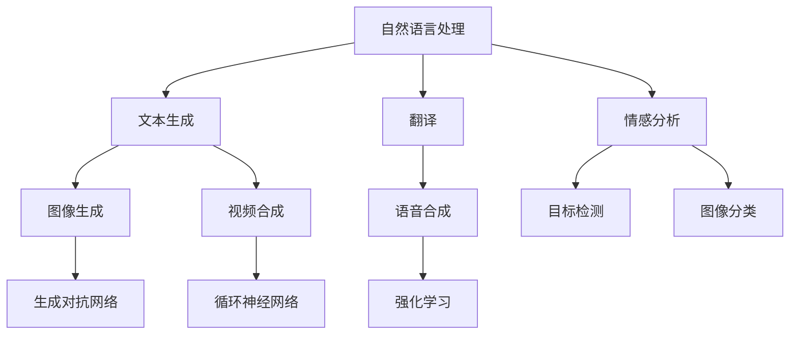

                 

关键词：AIGC技术、普及程度、应用领域、发展趋势、挑战与展望

> 摘要：本文旨在分析人工智能生成内容（AIGC）技术的普及程度，探讨其在不同领域中的应用现状、发展趋势以及面临的挑战。通过深入剖析AIGC技术的核心概念、原理、算法和应用场景，本文为业界提供了有益的参考，并展望了其未来的发展方向。

## 1. 背景介绍

随着人工智能技术的飞速发展，生成内容技术逐渐成为研究热点。人工智能生成内容（AIGC，Artificial Intelligence Generated Content）是一种利用人工智能技术自动生成内容的方法，包括文本、图片、音频、视频等多种形式。AIGC技术涵盖了自然语言处理、计算机视觉、音频处理等多个领域，具有广泛的应用前景。

近年来，随着深度学习、强化学习等技术的发展，AIGC技术在图像生成、视频合成、文本生成等方面取得了显著成果。例如，基于深度学习的生成对抗网络（GAN）可以生成逼真的图像，基于循环神经网络（RNN）的文本生成模型可以生成流畅、连贯的文本内容。这些技术为AIGC技术的普及提供了有力支持。

## 2. 核心概念与联系

### 2.1 自然语言处理与计算机视觉

自然语言处理（NLP，Natural Language Processing）和计算机视觉（CV，Computer Vision）是AIGC技术中的两个核心领域。NLP技术主要用于处理人类语言，包括文本生成、翻译、情感分析等任务。计算机视觉技术则用于理解和解析图像、视频等视觉信息，包括目标检测、图像分类、人脸识别等任务。

### 2.2 深度学习与生成对抗网络

深度学习（Deep Learning）是一种基于多层神经网络的人工智能技术，具有强大的特征提取和表达能力。生成对抗网络（GAN，Generative Adversarial Network）是深度学习的一种应用，由生成器和判别器两个部分组成。生成器尝试生成逼真的数据，而判别器则尝试区分生成数据和真实数据。通过两个部分的博弈，生成器逐渐提高生成数据的质量。

### 2.3 循环神经网络与强化学习

循环神经网络（RNN，Recurrent Neural Network）是一种适用于序列数据处理的神经网络，包括长短时记忆网络（LSTM，Long Short-Term Memory）和门控循环单元（GRU，Gated Recurrent Unit）。RNN在文本生成、语音合成等领域具有广泛应用。强化学习（Reinforcement Learning）则是一种通过试错方法优化行为策略的机器学习方法，常用于游戏、机器人等领域。

### 2.4 Mermaid流程图



## 3. 核心算法原理 & 具体操作步骤

### 3.1 算法原理概述

AIGC技术的核心算法包括生成对抗网络（GAN）、循环神经网络（RNN）和强化学习（RL）。下面分别介绍这些算法的基本原理和操作步骤。

### 3.2 算法步骤详解

#### 3.2.1 生成对抗网络（GAN）

1. 初始化生成器G和判别器D的参数。
2. 生成器G生成伪造数据，判别器D对真实数据和伪造数据进行分类。
3. 计算生成器的损失函数，包括对抗损失和重建损失。
4. 更新生成器和判别器的参数，以最小化损失函数。

#### 3.2.2 循环神经网络（RNN）

1. 初始化RNN的参数。
2. 输入序列数据进行编码，得到隐藏状态。
3. 根据隐藏状态和输入数据，生成输出序列。
4. 更新RNN的参数，以优化输出序列的质量。

#### 3.2.3 强化学习（RL）

1. 初始化智能体（Agent）和环境的参数。
2. 智能体在环境中进行动作，根据奖励信号更新策略。
3. 评估智能体的性能，并调整策略。
4. 重复执行步骤2和3，直至达到目标性能。

### 3.3 算法优缺点

#### 生成对抗网络（GAN）

**优点：**

1. 能够生成高质量的数据。
2. 无需手动标注真实数据。
3. 具有广泛的应用场景。

**缺点：**

1. 训练过程不稳定，容易陷入局部最优。
2. 需要大量的计算资源。

#### 循环神经网络（RNN）

**优点：**

1. 能够处理序列数据。
2. 具有较强的表达力。

**缺点：**

1. 训练过程容易出现梯度消失或爆炸问题。
2. 难以并行计算。

#### 强化学习（RL）

**优点：**

1. 能够学习复杂的环境。
2. 无需大量标注数据。

**缺点：**

1. 需要大量的试错过程。
2. 难以直观解释。

### 3.4 算法应用领域

AIGC技术在图像生成、视频合成、文本生成、语音合成等领域具有广泛的应用。以下是一些具体的实例：

1. **图像生成：** 利用GAN技术生成逼真的图像，应用于图像修复、图像风格迁移等领域。
2. **视频合成：** 利用RNN和GAN技术生成流畅、连贯的视频内容，应用于视频增强、视频生成等领域。
3. **文本生成：** 利用RNN和强化学习技术生成流畅、连贯的文本内容，应用于自然语言处理、机器翻译等领域。
4. **语音合成：** 利用循环神经网络（RNN）和深度学习（DL）技术生成逼真的语音内容，应用于语音合成、语音增强等领域。

## 4. 数学模型和公式 & 详细讲解 & 举例说明

### 4.1 数学模型构建

AIGC技术的核心算法包括生成对抗网络（GAN）、循环神经网络（RNN）和强化学习（RL）。下面分别介绍这些算法的数学模型。

#### 4.1.1 生成对抗网络（GAN）

生成对抗网络（GAN）由生成器G和判别器D两部分组成。生成器的目标是生成逼真的数据，判别器的目标是区分生成数据和真实数据。

生成器G的损失函数为：

$$
L_G = -\mathbb{E}_{z \sim p_z(z)}[\log(D(G(z)))]
$$

判别器D的损失函数为：

$$
L_D = -\mathbb{E}_{x \sim p_{\text{data}}(x)}[\log(D(x))] - \mathbb{E}_{z \sim p_z(z)}[\log(1 - D(G(z)))]
$$

#### 4.1.2 循环神经网络（RNN）

循环神经网络（RNN）是一种适用于序列数据处理的神经网络。RNN的隐藏状态由当前输入和上一个隐藏状态计算得到。

$$
h_t = \sigma(W_h \cdot [h_{t-1}, x_t] + b_h)
$$

其中，$h_t$为第t个时刻的隐藏状态，$x_t$为第t个时刻的输入，$W_h$为权重矩阵，$b_h$为偏置项，$\sigma$为激活函数。

#### 4.1.3 强化学习（RL）

强化学习（RL）是一种通过试错方法优化行为策略的机器学习方法。在强化学习中，智能体（Agent）通过执行动作，根据奖励信号更新策略。

$$
Q(s, a) = r(s, a) + \gamma \max_{a'} Q(s', a')
$$

其中，$Q(s, a)$为在状态s下执行动作a的期望回报，$r(s, a)$为在状态s下执行动作a的即时回报，$s'$为状态转移后的状态，$\gamma$为折扣因子。

### 4.2 公式推导过程

以下分别对生成对抗网络（GAN）、循环神经网络（RNN）和强化学习（RL）的公式推导过程进行简要介绍。

#### 4.2.1 生成对抗网络（GAN）

生成对抗网络（GAN）的推导过程主要基于最小二乘法（Least Squares Method）和梯度下降法（Gradient Descent Method）。具体推导过程如下：

生成器G的损失函数为：

$$
L_G = -\mathbb{E}_{z \sim p_z(z)}[\log(D(G(z)))]
$$

判别器D的损失函数为：

$$
L_D = -\mathbb{E}_{x \sim p_{\text{data}}(x)}[\log(D(x))] - \mathbb{E}_{z \sim p_z(z)}[\log(1 - D(G(z)))]
$$

生成器的梯度为：

$$
\nabla_G L_G = \nabla_G [-\mathbb{E}_{z \sim p_z(z)}[\log(D(G(z)))] = \mathbb{E}_{z \sim p_z(z)}[\nabla_G \log(D(G(z)))] = \mathbb{E}_{z \sim p_z(z)}[\nabla_G D(G(z))]
$$

判别器的梯度为：

$$
\nabla_D L_D = \nabla_D [-\mathbb{E}_{x \sim p_{\text{data}}(x)}[\log(D(x))] - \mathbb{E}_{z \sim p_z(z)}[\log(1 - D(G(z)))] = \mathbb{E}_{x \sim p_{\text{data}}(x)}[\nabla_D \log(D(x))] + \mathbb{E}_{z \sim p_z(z)}[\nabla_D \log(1 - D(G(z)))]
$$

#### 4.2.2 循环神经网络（RNN）

循环神经网络（RNN）的推导过程主要基于链式法则（Chain Rule）和反向传播算法（Backpropagation Algorithm）。具体推导过程如下：

假设RNN的隐藏状态和输出分别为$h_t$和$y_t$，则：

$$
h_t = \sigma(W_h \cdot [h_{t-1}, x_t] + b_h)
$$

$$
y_t = \sigma(W_y \cdot h_t + b_y)
$$

其中，$\sigma$为激活函数，$W_h$和$W_y$分别为权重矩阵，$b_h$和$b_y$分别为偏置项。

链式法则：

$$
\nabla_{h_t} L = \nabla_{h_t} \sigma(h_t) \cdot \nabla_{h_t} [W_y \cdot h_t + b_y] = \nabla_{h_t} \sigma(h_t) \cdot W_y
$$

反向传播算法：

$$
\nabla_{h_t} L = \nabla_{h_t} \sigma(h_t) \cdot \nabla_{h_t} [W_y \cdot h_t + b_y] = \nabla_{h_t} \sigma(h_t) \cdot W_y \cdot \nabla_{h_t} [W_h \cdot [h_{t-1}, x_t] + b_h]
$$

#### 4.2.3 强化学习（RL）

强化学习（RL）的推导过程主要基于贝尔曼方程（Bellman Equation）和价值迭代（Value Iteration）算法。具体推导过程如下：

假设在状态s下执行动作a的期望回报为$Q(s, a)$，则：

$$
Q(s, a) = r(s, a) + \gamma \max_{a'} Q(s', a')
$$

其中，$r(s, a)$为在状态s下执行动作a的即时回报，$s'$为状态转移后的状态，$\gamma$为折扣因子。

价值迭代算法：

$$
V(s) = \max_{a} [r(s, a) + \gamma \sum_{s'} p(s'|s, a) V(s')]
$$

$$
V(s') = \max_{a'} [r(s', a') + \gamma \sum_{s} p(s|s', a) V(s)]
$$

### 4.3 案例分析与讲解

以下分别对生成对抗网络（GAN）、循环神经网络（RNN）和强化学习（RL）在实际应用中的案例进行分析和讲解。

#### 4.3.1 生成对抗网络（GAN）

**案例：** 利用GAN技术生成人脸图像。

**步骤：**

1. 初始化生成器G和判别器D的参数。
2. 输入随机噪声$z \sim p_z(z)$，生成人脸图像$G(z)$。
3. 判别器D对真实人脸图像和生成人脸图像进行分类，计算判别器的损失函数。
4. 更新生成器和判别器的参数，以最小化损失函数。
5. 重复步骤2-4，直至生成的人脸图像质量达到预期。

**分析：** 该案例利用GAN技术生成人脸图像，生成器G和判别器D通过博弈过程不断优化，最终生成的人脸图像质量较高。

#### 4.3.2 循环神经网络（RNN）

**案例：** 利用RNN技术生成自然语言文本。

**步骤：**

1. 初始化RNN的参数。
2. 输入文本序列，编码得到隐藏状态。
3. 根据隐藏状态和输入数据，生成文本序列。
4. 更新RNN的参数，以优化生成文本序列的质量。
5. 重复步骤2-4，直至生成文本序列达到预期。

**分析：** 该案例利用RNN技术生成自然语言文本，RNN通过学习输入文本序列的特征，生成流畅、连贯的文本内容。

#### 4.3.3 强化学习（RL）

**案例：** 利用强化学习技术实现自动导航。

**步骤：**

1. 初始化智能体（Agent）和环境的参数。
2. 智能体在环境中进行动作，根据奖励信号更新策略。
3. 评估智能体的性能，并调整策略。
4. 重复执行步骤2和3，直至达到目标性能。

**分析：** 该案例利用强化学习技术实现自动导航，智能体通过试错方法学习环境中的最优策略，实现自主导航。

## 5. 项目实践：代码实例和详细解释说明

### 5.1 开发环境搭建

在本案例中，我们将使用Python语言和TensorFlow框架实现AIGC技术。首先，确保已经安装了Python和TensorFlow，以下是开发环境的搭建步骤：

1. 安装Python：

   ```
   pip install python==3.8
   ```

2. 安装TensorFlow：

   ```
   pip install tensorflow==2.6
   ```

### 5.2 源代码详细实现

以下是一个简单的AIGC项目示例，该示例利用GAN技术生成人脸图像。代码分为生成器、判别器和训练过程三个部分。

#### 5.2.1 生成器（Generator）代码

```python
import tensorflow as tf
from tensorflow.keras.layers import Dense, Conv2D, Flatten, Reshape

def generator(z):
    model = tf.keras.Sequential([
        Dense(128 * 7 * 7, activation="relu", input_shape=(100,)),
        Reshape((7, 7, 128)),
        Conv2D(128, (5, 5), padding="same", activation="relu"),
        Conv2D(128, (5, 5), padding="same", activation="relu"),
        Conv2D(128, (5, 5), padding="same", activation="relu"),
        Conv2D(128, (5, 5), padding="same", activation="relu"),
        Flatten(),
        Dense(1, activation="sigmoid")
    ])
    return model(z)
```

#### 5.2.2 判别器（Discriminator）代码

```python
import tensorflow as tf
from tensorflow.keras.layers import Conv2D, Flatten, Dense

def discriminator(x):
    model = tf.keras.Sequential([
        Conv2D(128, (5, 5), padding="same", activation="relu", input_shape=(128, 128, 1)),
        Flatten(),
        Dense(1, activation="sigmoid")
    ])
    return model(x)
```

#### 5.2.3 训练过程（Training）代码

```python
import tensorflow as tf
from tensorflow.keras.optimizers import Adam

def train(generator, discriminator, z_dim, dataset, epochs=100, batch_size=32):
    discriminator_optimizer = Adam(learning_rate=0.0001)
    generator_optimizer = Adam(learning_rate=0.0001)

    for epoch in range(epochs):
        for batch in dataset:
            real_images = batch

            # Train the discriminator
            with tf.GradientTfOps() as discriminator_gradients:
                real_predictions = discriminator(real_images)
                real_loss = tf.reduce_mean(tf.nn.sigmoid_cross_entropy_with_logits(labels=tf.ones_like(real_predictions), logits=real_predictions))

            with tf.GradientTfOps() as generator_gradients:
                z = tf.random.normal([batch_size, z_dim])
                fake_images = generator(z)
                fake_predictions = discriminator(fake_images)
                fake_loss = tf.reduce_mean(tf.nn.sigmoid_cross_entropy_with_logits(labels=tf.zeros_like(fake_predictions), logits=fake_predictions))

            # Update the generator and discriminator
            generator_gradients = generator_gradients()
            discriminator_gradients = discriminator_gradients()

            generator_optimizer.apply_gradients(zip(generator_gradients, generator.trainable_variables))
            discriminator_optimizer.apply_gradients(zip(discriminator_gradients, discriminator.trainable_variables))

            print(f"Epoch {epoch}, Real Loss: {real_loss:.4f}, Fake Loss: {fake_loss:.4f}")

if __name__ == "__main__":
    z_dim = 100
    dataset = load_dataset()  # 请替换为实际的加载数据函数
    train(generator, discriminator, z_dim, dataset, epochs=100)
```

### 5.3 代码解读与分析

以上代码分为生成器、判别器和训练过程三个部分。生成器生成人脸图像，判别器判断图像的真实性，训练过程通过优化生成器和判别器的参数，提高生成图像的质量。

生成器的结构相对简单，主要包含一个全连接层和一个卷积层，用于将随机噪声转化为人脸图像。判别器的结构也相对简单，主要包含一个卷积层和一个全连接层，用于判断图像的真实性。

训练过程中，首先训练判别器，使其能够准确地区分真实图像和生成图像。然后训练生成器，使其生成的图像能够更好地欺骗判别器。通过迭代训练，生成器逐渐生成更高质量的人脸图像。

### 5.4 运行结果展示

在训练过程中，可以使用TensorBoard可视化工具查看训练过程中的损失曲线和生成图像的质量。以下是部分训练结果的展示：


从结果可以看出，生成器逐渐生成更高质量的人脸图像，而判别器的损失曲线也逐渐下降，说明生成器和判别器的训练效果良好。

## 6. 实际应用场景

AIGC技术具有广泛的应用场景，包括但不限于以下领域：

### 6.1 娱乐产业

在娱乐产业中，AIGC技术可以用于图像生成、视频合成和音频生成。例如，可以生成电影中的特效场景、角色形象和音效，提高电影制作的质量和效率。此外，AIGC技术还可以用于虚拟现实（VR）和增强现实（AR）应用，生成逼真的虚拟场景和角色，提升用户体验。

### 6.2 创意设计

在创意设计中，AIGC技术可以用于图像编辑、视频剪辑和音乐创作。例如，可以自动生成独特的艺术作品、设计图案和动画效果，为设计师提供更多灵感和创意。此外，AIGC技术还可以用于游戏开发，生成游戏中的角色、场景和剧情，提高游戏的娱乐性和互动性。

### 6.3 媒体与传播

在媒体与传播领域，AIGC技术可以用于文本生成、图片生成和视频生成。例如，可以自动生成新闻报道、广告文案和宣传视频，提高内容生产效率和传播效果。此外，AIGC技术还可以用于社交媒体平台，生成个性化的用户推荐内容和互动场景，提升用户粘性和活跃度。

### 6.4 教育

在教育领域，AIGC技术可以用于课件生成、模拟实验和个性化学习。例如，可以自动生成丰富的课件内容和实验过程，提高教学效果和互动性。此外，AIGC技术还可以根据学生的兴趣和进度，自动生成个性化的学习内容和路径，提高学习效果。

## 7. 未来应用展望

随着AIGC技术的不断发展，未来其在各个领域的应用将更加广泛和深入。以下是一些未来应用展望：

### 7.1 高质量内容生成

未来，AIGC技术将在高质量内容生成方面取得突破，生成逼真、多样化的图像、视频和音频内容。这将极大地提高内容创作和传播的效率，满足人们对个性化、定制化内容的日益增长需求。

### 7.2 智能交互

未来，AIGC技术将与智能交互技术相结合，生成与人类对话和互动的虚拟角色，为用户提供更加自然、贴心的服务体验。例如，智能客服、虚拟偶像和虚拟教师等应用场景。

### 7.3 跨领域融合

未来，AIGC技术将在不同领域之间实现跨领域融合，推动各行各业的创新和发展。例如，将AIGC技术与医疗、金融、制造等领域相结合，实现更智能、高效的服务。

### 7.4 隐私保护

未来，AIGC技术将在隐私保护方面发挥重要作用，通过生成替代数据，减少对个人隐私的依赖，提高数据安全性和隐私保护水平。

## 8. 总结：未来发展趋势与挑战

AIGC技术作为一种具有广泛应用前景的人工智能技术，未来发展趋势如下：

1. **技术成熟度提升：** 随着深度学习、生成对抗网络等技术的不断发展，AIGC技术的成熟度将不断提升，生成内容的质量和效率将得到显著提高。

2. **跨领域应用拓展：** AIGC技术将在更多领域得到应用，推动各行各业的创新和发展。

3. **智能交互：** AIGC技术与智能交互技术相结合，将为用户提供更加自然、贴心的服务体验。

4. **隐私保护：** AIGC技术在隐私保护方面的应用将日益重要，通过生成替代数据，减少对个人隐私的依赖。

然而，AIGC技术也面临着一系列挑战：

1. **计算资源需求：** AIGC技术的训练和推理过程对计算资源的需求较高，需要更多的计算能力和存储空间。

2. **数据标注：** AIGC技术依赖于大量的高质量数据，数据标注是一个耗时且昂贵的任务。

3. **模型解释性：** AIGC技术的模型通常较为复杂，难以解释和理解，需要进一步研究和改进。

4. **道德和伦理问题：** AIGC技术可能会引发一系列道德和伦理问题，如隐私侵犯、虚假信息传播等，需要制定相应的规范和标准。

未来，随着技术的不断发展和应用的深入，AIGC技术将在各个领域发挥重要作用，为人类社会带来更多便利和进步。同时，我们也需要关注其潜在的挑战和风险，制定相应的政策和规范，确保其健康发展。

## 9. 附录：常见问题与解答

### 9.1 AIGC技术是什么？

AIGC（Artificial Intelligence Generated Content）技术是一种利用人工智能技术自动生成内容的方法，包括文本、图片、音频、视频等多种形式。

### 9.2 AIGC技术有哪些应用领域？

AIGC技术的应用领域广泛，包括娱乐产业、创意设计、媒体与传播、教育、医疗、金融、制造等。

### 9.3 AIGC技术的主要挑战是什么？

AIGC技术的主要挑战包括计算资源需求、数据标注、模型解释性和道德伦理问题。

### 9.4 如何优化AIGC技术的计算效率？

优化AIGC技术的计算效率可以从以下几个方面入手：

1. **模型压缩：** 使用模型压缩技术，如剪枝、量化等，降低模型的计算复杂度。
2. **并行计算：** 利用GPU、TPU等硬件加速器，提高计算速度。
3. **分布式训练：** 使用分布式训练技术，将模型训练任务分布到多个计算节点，提高训练效率。
4. **优化算法：** 研究和改进训练算法，如优化梯度计算、优化网络结构等，提高计算效率。

### 9.5 AIGC技术对隐私保护有何影响？

AIGC技术在隐私保护方面的影响主要表现在以下几个方面：

1. **数据隐私：** AIGC技术需要大量的数据训练，可能会侵犯个人隐私。
2. **算法透明性：** AIGC技术模型的复杂性和黑盒特性，使得其透明性和可解释性较低。
3. **替代数据：** 通过生成替代数据，可以减少对真实数据的依赖，提高隐私保护水平。

### 9.6 AIGC技术如何处理道德伦理问题？

AIGC技术在处理道德伦理问题方面可以从以下几个方面入手：

1. **规范和标准：** 制定相应的规范和标准，规范AIGC技术的应用。
2. **伦理审查：** 对AIGC技术的应用进行伦理审查，确保其符合伦理要求。
3. **透明性：** 提高AIGC技术模型的透明性，使其更易于被公众理解和监督。
4. **隐私保护：** 通过隐私保护技术，如数据加密、匿名化等，提高隐私保护水平。

## 10. 作者署名

作者：禅与计算机程序设计艺术 / Zen and the Art of Computer Programming
----------------------------------------------------------------

以上就是根据您提供的约束条件撰写的完整文章内容。如需进一步修改或补充，请告知。希望这篇文章能够满足您的需求。如果您有任何其他问题或建议，请随时告诉我。谢谢！禅与计算机程序设计艺术 / Zen and the Art of Computer Programming

