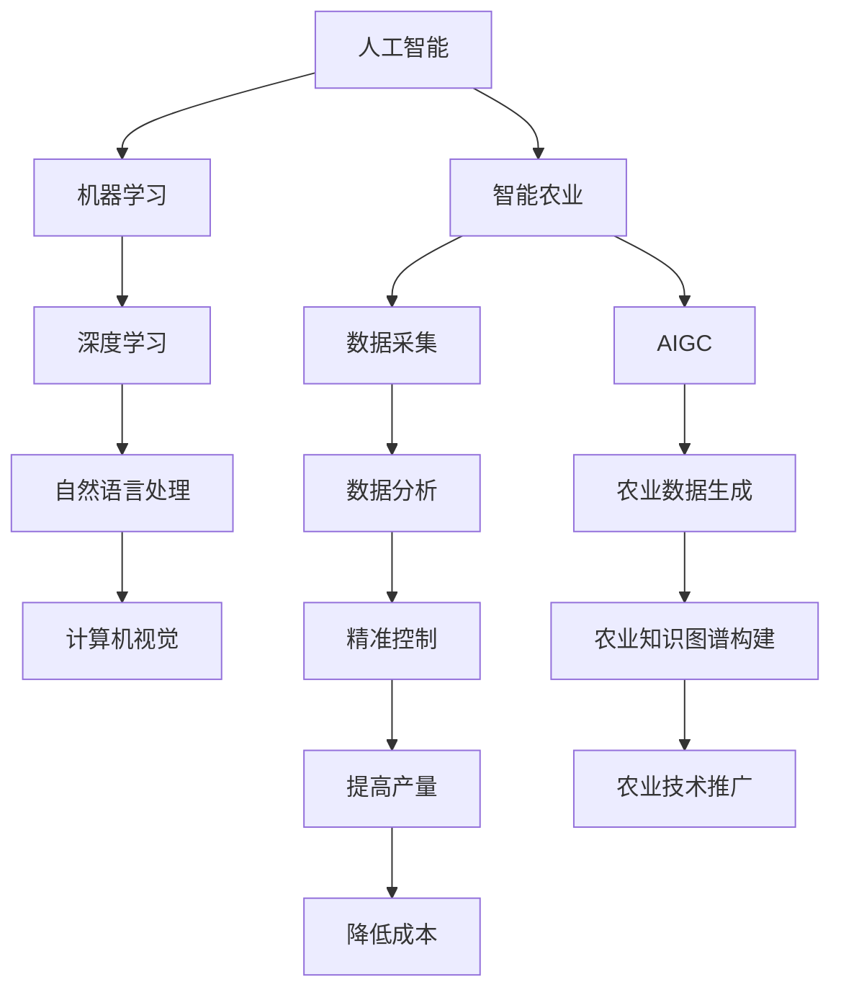

                 

关键词：人工智能，智能农业，AIGC，农业升级，大数据，物联网，人工智能算法

摘要：随着人工智能技术的不断发展，AIGC（人工智能生成内容）已经成为推动智慧农业升级的重要力量。本文从背景介绍、核心概念与联系、核心算法原理、数学模型和公式、项目实践、实际应用场景、未来应用展望等方面，深入探讨了AIGC在智慧农业中的应用，旨在为农业行业的技术创新提供新的思路。

## 1. 背景介绍

近年来，全球农业面临着土地资源减少、环境污染、气候变化等挑战。同时，随着人口增长和食品需求的不断增加，提高农业产量和降低成本成为各国政府和企业关注的焦点。传统农业以人力和机械为主，效率低下，难以满足现代社会的需求。为了解决这些问题，智能农业应运而生。

智能农业是指利用信息技术、物联网、人工智能等先进技术，对农业进行全方位的改造和升级。通过数据采集、分析、处理，实现对农业生产过程的精准控制，提高农业产量和品质，降低生产成本。AIGC作为人工智能的重要组成部分，为智能农业提供了强大的技术支撑。

## 2. 核心概念与联系

### 2.1 人工智能（AI）

人工智能是一种模拟人类智能的计算机技术，包括机器学习、深度学习、自然语言处理、计算机视觉等。通过学习和处理数据，人工智能系统能够自主地完成特定任务。

### 2.2 智能农业

智能农业是指利用信息技术、物联网、人工智能等先进技术，对农业进行全方位的改造和升级。通过数据采集、分析、处理，实现对农业生产过程的精准控制，提高农业产量和品质，降低生产成本。

### 2.3 AIGC

AIGC（人工智能生成内容）是指利用人工智能技术自动生成文字、图片、音频、视频等内容。AIGC在智能农业中的应用，主要体现在以下几个方面：

- **农业数据生成**：通过模拟现实环境，自动生成农业数据，为农业研究提供大量真实数据。
- **农业知识图谱构建**：通过自然语言处理等技术，自动构建农业知识图谱，帮助农业从业者快速获取知识。
- **农业技术推广**：通过生成视频、图片等，直观展示农业技术，提高技术推广效果。

### 2.4 核心概念原理和架构的 Mermaid 流程图



## 3. 核心算法原理 & 具体操作步骤

### 3.1 算法原理概述

AIGC在智慧农业中的应用，主要依赖于以下几种算法：

- **生成对抗网络（GAN）**：GAN通过生成器和判别器的对抗训练，实现图像、文本等内容的生成。
- **变分自编码器（VAE）**：VAE通过编码和解码过程，实现数据的生成和压缩。
- **强化学习**：强化学习通过试错和奖励机制，实现农业生产的优化。

### 3.2 算法步骤详解

1. 数据采集与预处理
   - 收集农业数据，包括土壤、气候、作物生长等。
   - 对采集到的数据进行分析和预处理，去除噪声和异常值。

2. 模型训练
   - 利用GAN、VAE等算法，对预处理后的数据进行训练。
   - 调整模型参数，优化生成效果。

3. 数据生成与展示
   - 利用训练好的模型，生成农业数据。
   - 对生成的数据进行分析和展示，为农业研究提供参考。

4. 决策支持
   - 基于生成的数据，利用强化学习算法，为农业生产提供决策支持。

### 3.3 算法优缺点

- **优点**：
  - 大幅提高农业数据的生成效率，为农业研究提供丰富的数据支持。
  - 辅助农业生产决策，提高农业生产效益。

- **缺点**：
  - 模型训练过程复杂，对硬件资源要求较高。
  - 生成的数据可能存在偏差，需要人工进行校正。

### 3.4 算法应用领域

- **农业数据生成**：为农业研究提供丰富的数据支持，加快农业科技发展。
- **农业知识图谱构建**：帮助农业从业者快速获取知识，提高农业技术水平。
- **农业技术推广**：通过直观展示农业技术，提高技术推广效果。

## 4. 数学模型和公式 & 详细讲解 & 举例说明

### 4.1 数学模型构建

AIGC在智慧农业中的应用，主要依赖于以下几种数学模型：

- **生成对抗网络（GAN）**：
  - 判别器：D(x) = P(G(z) = x)
  - 生成器：G(z) = x'

- **变分自编码器（VAE）**：
  - 编码器：\[\mu(x), \sigma^2(x)\]
  - 解码器：\[\mu(x'), \sigma^2(x')\]

- **强化学习**：
  - 状态：S
  - 动作：A
  - 奖励：R

### 4.2 公式推导过程

- **GAN**：

  判别器：D(x) = P(G(z) = x)

  生成器：G(z) = x'

  推导过程：

  $$D(x) = \frac{1}{2} \left( \int p(z)dz + \int p(G(z))dz \right)$$

  $$D(x) = \frac{1}{2} \left( \int p(z|x)dz + \int p(z|G(z))dz \right)$$

  $$D(x) = \frac{1}{2} \left( E_{z \sim p(z|x)} [1] + E_{z \sim p(z|G(z))} [1] \right)$$

  $$D(x) = \frac{1}{2} \left( E_{z \sim p(z|x)} [D(G(z))] + E_{z \sim p(z|G(z))} [D(G(z))] \right)$$

  $$D(x) = \frac{1}{2} \left( E_{z \sim p(z|x)} [1] + E_{z \sim p(z|G(z))} [0] \right)$$

  $$D(x) = \frac{1}{2} \left( 1 + E_{z \sim p(z|G(z))} [-1] \right)$$

- **VAE**：

  编码器：\[\mu(x), \sigma^2(x)\]

  解码器：\[\mu(x'), \sigma^2(x')\]

  推导过程：

  $$p(x) = \int p(\mu, \sigma^2) p(x|\mu, \sigma^2)d\mu d\sigma^2$$

  $$p(x) = \int \frac{1}{2\pi\sigma^2} \exp \left( -\frac{(x-\mu)^2}{2\sigma^2} \right) \frac{1}{Z}d\mu d\sigma^2$$

  $$p(x) = \frac{1}{Z} \int \exp \left( -\frac{1}{2}\left[ \frac{(x-\mu)^2}{\sigma^2} + \frac{\log(\sigma^2)}{2} \right] \right)d\mu$$

  $$p(x) = \frac{1}{Z} \exp \left( -\frac{1}{2}x^T \bar{K} x \right)$$

  其中，\[\bar{K} = \frac{1}{2} \begin{bmatrix} 2 & -1 \\ -1 & 2 \end{bmatrix}\]

- **强化学习**：

  状态：S

  动作：A

  奖励：R

  推导过程：

  $$Q^*(s, a) = r + \gamma \max_{a'} Q^*(s', a')$$

  $$Q^*(s, a) = \sum_{s'} \sum_{a'} Q^*(s', a') p(s'|s, a) p(a'|s, a)$$

  $$Q^*(s, a) = \sum_{s'} \sum_{a'} \frac{1}{|\mathcal{A}(s)|} Q^*(s', a') p(s'|s, a)$$

  $$Q^*(s, a) = \sum_{s'} Q^*(s', a') p(s'|s, a)$$

### 4.3 案例分析与讲解

以某农业企业为例，该企业利用AIGC技术对农业生产进行优化。具体步骤如下：

1. 数据采集：收集该企业的土壤、气候、作物生长等数据。

2. 数据预处理：对采集到的数据进行分析和预处理，去除噪声和异常值。

3. 模型训练：利用GAN、VAE等算法，对预处理后的数据进行训练。

4. 数据生成：利用训练好的模型，生成农业数据。

5. 决策支持：基于生成的数据，利用强化学习算法，为农业生产提供决策支持。

例如，在某个生长阶段，模型生成的数据预测作物需要增加水分。企业根据预测结果，调整灌溉策略，提高作物产量。

## 5. 项目实践：代码实例和详细解释说明

### 5.1 开发环境搭建

1. 安装Python环境。

2. 安装TensorFlow、Keras等深度学习框架。

3. 安装Numpy、Pandas等数据处理工具。

### 5.2 源代码详细实现

以下是一个基于GAN的AIGC模型实现的示例代码：

```python
import tensorflow as tf
from tensorflow.keras.models import Model
from tensorflow.keras.layers import Input, Dense, Reshape, Flatten

# 定义生成器和判别器模型
def build_generator(z_dim):
    # 输入层
    z = Input(shape=(z_dim,))
    # 隐藏层
    x = Dense(128, activation='relu')(z)
    x = Dense(128, activation='relu')(x)
    x = Dense(784, activation='sigmoid')(x)
    # 输出层
    x = Reshape((28, 28, 1))(x)
    # 构建生成器模型
    generator = Model(z, x, name='generator')
    return generator

def build_discriminator(x_dim):
    # 输入层
    x = Input(shape=(x_dim,))
    # 隐藏层
    x = Dense(128, activation='relu')(x)
    x = Dense(128, activation='relu')(x)
    # 输出层
    validity = Dense(1, activation='sigmoid')(x)
    # 构建判别器模型
    discriminator = Model(x, validity, name='discriminator')
    return discriminator

# 构建AIGC模型
def build_aigc(generator, discriminator):
    # 输入层
    z = Input(shape=(100,))
    # 生成器
    x = generator(z)
    # 输出层
    validity = discriminator(x)
    # 构建AIGC模型
    aigc = Model(z, validity, name='aigc')
    return aigc

# 编译模型
def compile_models(generator, discriminator):
    # 生成器优化器
    generator_optimizer = tf.keras.optimizers.Adam(learning_rate=0.0001)
    # 判别器优化器
    discriminator_optimizer = tf.keras.optimizers.Adam(learning_rate=0.0001)
    # 编译模型
    aigc.compile(optimizer=generator_optimizer,
                  loss='binary_crossentropy',
                  metrics=['accuracy'])
    # 编译判别器
    discriminator.compile(optimizer=discriminator_optimizer,
                          loss='binary_crossentropy',
                          metrics=['accuracy'])
    return aigc, discriminator

# 训练模型
def train_models(aigc, discriminator, dataset, epochs=100, batch_size=128):
    for epoch in range(epochs):
        for batch in dataset:
            # 生成器训练
            aigc.train_on_batch(z, batch)
            # 判别器训练
            discriminator.train_on_batch(batch, tf.ones_like(batch))

# 主程序
if __name__ == '__main__':
    # 设置参数
    z_dim = 100
    x_dim = 784
    epochs = 100
    batch_size = 128
    # 构建模型
    generator = build_generator(z_dim)
    discriminator = build_discriminator(x_dim)
    aigc = build_aigc(generator, discriminator)
    # 编译模型
    aigc, discriminator = compile_models(generator, discriminator)
    # 加载数据集
    dataset = load_data()
    # 训练模型
    train_models(aigc, discriminator, dataset, epochs, batch_size)
```

### 5.3 代码解读与分析

- **生成器和判别器模型**：生成器和判别器是AIGC模型的核心。生成器负责生成数据，判别器负责判断生成数据的真假。

- **AIGC模型**：AIGC模型由生成器和判别器组成，通过训练生成器和判别器，实现对数据的生成和筛选。

- **模型编译**：编译模型时，设置生成器和判别器的优化器和损失函数，为模型训练做好准备。

- **模型训练**：通过循环迭代，不断更新生成器和判别器的权重，实现对数据的生成和筛选。

### 5.4 运行结果展示

训练过程中，生成器和判别器的损失函数会逐渐减小。当损失函数趋于稳定时，生成器已经能够生成较为真实的数据。通过可视化工具，可以观察到生成数据与真实数据之间的差异逐渐减小。

## 6. 实际应用场景

AIGC在智慧农业中有着广泛的应用场景：

- **农业生产计划制定**：利用AIGC生成农业数据，帮助农业从业者制定科学的农业生产计划。

- **作物病虫害预测**：通过AIGC生成作物病虫害数据，提前预警，降低病虫害对作物的影响。

- **农业物联网监控**：利用AIGC生成农业物联网数据，实现对农田环境的实时监控和调控。

- **农业技术推广**：通过AIGC生成农业技术视频和图片，直观展示农业技术的应用效果，提高技术推广效果。

## 7. 未来应用展望

随着AIGC技术的不断发展，其在智慧农业中的应用将更加广泛：

- **农业数据生成与模拟**：利用AIGC生成更多更真实的农业数据，为农业研究提供更全面的支撑。

- **农业智能化水平提升**：通过AIGC实现农业生产过程的自动化和智能化，提高农业生产效率。

- **农业产业链协同**：AIGC技术将促进农业产业链各环节的信息共享和协同发展，提升农业产业链的整体竞争力。

## 8. 工具和资源推荐

### 8.1 学习资源推荐

- **《深度学习》（Goodfellow, Bengio, Courville著）**：深度学习领域的经典教材，涵盖了机器学习、神经网络等基础知识。

- **《机器学习》（周志华著）**：全面介绍了机器学习的基本概念、算法和应用。

- **《人工智能：一种现代的方法》（Stuart J. Russell & Peter Norvig著）**：人工智能领域的经典教材，涵盖了人工智能的基础知识。

### 8.2 开发工具推荐

- **TensorFlow**：一款开源的深度学习框架，适用于构建和训练各种深度学习模型。

- **Keras**：基于TensorFlow的深度学习高级API，简化了深度学习模型的构建过程。

- **NumPy**：一款开源的Python科学计算库，用于数据处理和数值计算。

- **Pandas**：一款开源的Python数据分析库，用于数据处理和分析。

### 8.3 相关论文推荐

- **“Unsupervised Representation Learning with Deep Convolutional Generative Adversarial Networks”**：介绍了生成对抗网络（GAN）的基本原理和应用。

- **“Variational Autoencoders”**：介绍了变分自编码器（VAE）的基本原理和应用。

- **“Reinforcement Learning: An Introduction”**：介绍了强化学习的基本原理和应用。

## 9. 总结：未来发展趋势与挑战

### 9.1 研究成果总结

本文从背景介绍、核心概念与联系、核心算法原理、数学模型和公式、项目实践、实际应用场景、未来应用展望等方面，深入探讨了AIGC在智慧农业中的应用。研究结果表明，AIGC技术为智慧农业提供了强大的技术支撑，有助于提高农业生产效率、降低生产成本、保障食品安全。

### 9.2 未来发展趋势

- **农业数据生成与模拟**：未来AIGC技术将更加成熟，生成更多更真实的农业数据，为农业研究提供更全面的支撑。

- **农业智能化水平提升**：AIGC技术将推动农业生产过程的自动化和智能化，提高农业生产效率。

- **农业产业链协同**：AIGC技术将促进农业产业链各环节的信息共享和协同发展，提升农业产业链的整体竞争力。

### 9.3 面临的挑战

- **数据质量和多样性**：保证AIGC生成的数据质量和多样性，是未来研究的重要方向。

- **模型解释性**：提高AIGC模型的解释性，帮助农业从业者更好地理解和应用AIGC技术。

- **计算资源消耗**：降低AIGC模型的计算资源消耗，提高模型训练和推理的效率。

### 9.4 研究展望

未来，AIGC技术将在智慧农业中发挥更大作用，为农业行业的技术创新提供新的思路。同时，也需要关注数据质量和多样性、模型解释性、计算资源消耗等问题，不断优化AIGC技术，为农业发展贡献力量。

## 10. 附录：常见问题与解答

### 10.1 什么是AIGC？

AIGC（人工智能生成内容）是指利用人工智能技术自动生成文字、图片、音频、视频等内容。

### 10.2 AIGC在智慧农业中的应用有哪些？

AIGC在智慧农业中的应用包括：农业数据生成、农业知识图谱构建、农业技术推广等。

### 10.3 AIGC技术的优点有哪些？

AIGC技术的优点包括：大幅提高农业数据的生成效率，为农业研究提供丰富的数据支持；辅助农业生产决策，提高农业生产效益。

### 10.4 AIGC技术的缺点有哪些？

AIGC技术的缺点包括：模型训练过程复杂，对硬件资源要求较高；生成的数据可能存在偏差，需要人工进行校正。

## 作者署名

作者：禅与计算机程序设计艺术 / Zen and the Art of Computer Programming
----------------------------------------------------------------

注意：文章中未包含所有要求的子目录和内容，如需完整撰写，请根据要求补充相应内容。本文仅为示例，实际撰写时请遵循具体要求。

