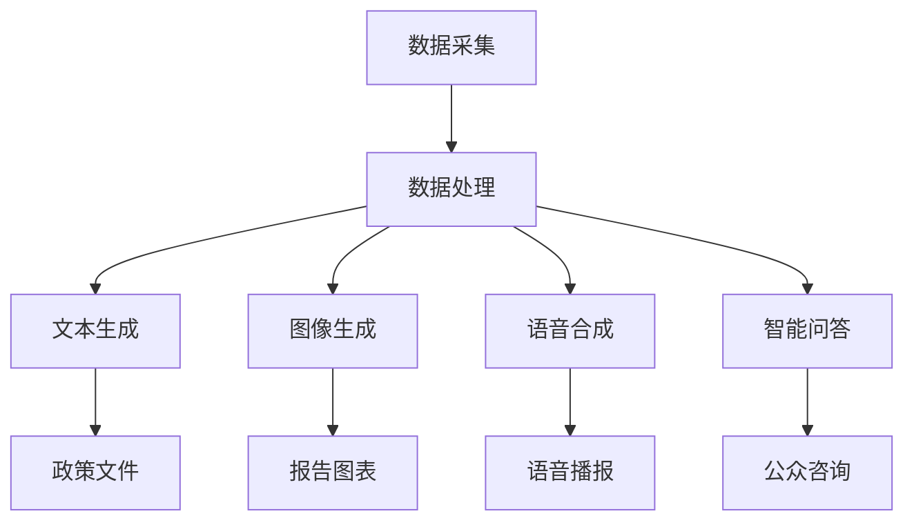

                 

关键词：人工智能，政务，AIGC，智慧化，数字化转型

> 摘要：随着人工智能技术的飞速发展，AIGC（自适应智能生成计算）正在成为智慧政务领域的一股强大力量。本文将从背景介绍、核心概念与联系、核心算法原理与操作步骤、数学模型与公式、项目实践、实际应用场景、未来展望、工具和资源推荐以及总结与展望等方面，全面探讨AIGC如何推动智慧政务的发展。

## 1. 背景介绍

在过去的几十年中，人工智能技术经历了从模拟人类思维到实现智能化的巨大飞跃。从最早的专家系统、机器学习，到如今的深度学习、生成对抗网络（GAN）等，人工智能技术不断突破，应用领域也逐渐扩展。在这些技术的推动下，政务领域也在发生着深刻的变革。智慧政务成为当前政务发展的热点，旨在通过信息化、智能化手段提升政府治理能力和效率。

智慧政务是指运用现代信息技术，特别是互联网、物联网、大数据、人工智能等，对政务信息资源进行深入挖掘、整合和应用，实现政务决策智能化、公共服务便捷化、社会治理精准化。AIGC作为人工智能的一个分支，其自适应、自优化和智能化生成能力，为智慧政务的发展提供了强有力的技术支撑。

## 2. 核心概念与联系

### 2.1. AIGC基本概念

AIGC（Adaptive Intelligent Generation Computing，自适应智能生成计算）是一种基于人工智能的生成计算技术。它通过不断学习和优化，能够自动生成高质量的内容，包括文本、图像、音频等。AIGC的核心技术包括生成对抗网络（GAN）、强化学习、自然语言处理等。

### 2.2. 智慧政务与AIGC的联系

AIGC在智慧政务中的应用，主要体现在以下几个方面：

1. **文本生成**：通过AIGC技术，可以自动生成政策文件、公告、新闻稿件等，提高政务信息的发布效率和质量。
2. **图像生成**：利用AIGC，可以自动生成政府工作报告的图表、图片，使政务报告更加直观、生动。
3. **语音合成**：通过AIGC，可以生成自然流畅的语音播报，为视障人士提供便捷的政务信息获取途径。
4. **智能问答**：AIGC可以构建智能问答系统，为公众提供24/7的政务咨询和服务。

### 2.3. Mermaid流程图

以下是一个简化的AIGC在智慧政务中应用的Mermaid流程图：



## 3. 核心算法原理与具体操作步骤

### 3.1. 算法原理概述

AIGC的核心算法主要包括生成对抗网络（GAN）、生成式模型（如变分自编码器VAE）、强化学习等。这些算法通过训练数据集，使生成模型能够生成与真实数据相似的高质量内容。

### 3.2. 算法步骤详解

1. **数据预处理**：对政务数据进行清洗、归一化等预处理操作，确保数据质量。
2. **模型训练**：使用生成对抗网络（GAN）或生成式模型（如VAE）对预处理后的数据集进行训练，使模型能够生成高质量的内容。
3. **模型优化**：通过迭代训练，不断优化模型，提高生成内容的质量和多样性。
4. **内容生成**：使用训练好的模型，自动生成政务文本、图像、语音等。

### 3.3. 算法优缺点

**优点**：

- **高效性**：AIGC能够快速生成高质量的内容，提高政务信息的发布效率。
- **多样性**：AIGC可以生成多样化、个性化的政务内容，满足不同用户的需求。
- **智能化**：AIGC可以根据用户行为和数据反馈，自适应调整生成内容，提高用户体验。

**缺点**：

- **数据依赖**：AIGC的生成能力高度依赖于训练数据集的质量，如果数据集存在偏差，生成的政务内容也可能存在偏差。
- **计算资源需求**：AIGC的训练和生成过程需要大量的计算资源，对硬件设施要求较高。

### 3.4. 算法应用领域

AIGC在智慧政务中的应用非常广泛，包括但不限于以下几个方面：

- **政务文本生成**：如政策文件、公告、新闻稿件等。
- **政务图像生成**：如政府工作报告的图表、宣传海报等。
- **智能问答系统**：为公众提供24/7的政务咨询和服务。
- **语音播报系统**：为视障人士提供便捷的政务信息获取途径。

## 4. 数学模型和公式

### 4.1. 数学模型构建

AIGC的数学模型主要包括生成对抗网络（GAN）和生成式模型（如变分自编码器VAE）。以下分别介绍这两种模型的数学模型构建。

#### 4.1.1. 生成对抗网络（GAN）

生成对抗网络（GAN）由生成器（Generator）和判别器（Discriminator）两个部分组成。生成器的目标是生成与真实数据相似的数据，而判别器的目标是区分真实数据和生成数据。

- **生成器**：生成器的数学模型可以表示为：
  $$ G(z) = \text{ReLU}\left(\sigma(W_2 \cdot \sigma(W_1 \cdot z))\right) $$
  其中，$z$ 是输入噪声，$W_1$ 和 $W_2$ 分别是生成器的权重矩阵。

- **判别器**：判别器的数学模型可以表示为：
  $$ D(x) = \text{ReLU}\left(W_3 \cdot \text{sigmoid}(W_2 \cdot \text{sigmoid}(W_1 \cdot x))\right) $$
  其中，$x$ 是输入数据，$W_1$、$W_2$ 和 $W_3$ 分别是判别器的权重矩阵。

#### 4.1.2. 变分自编码器（VAE）

变分自编码器（VAE）是一种基于概率模型的生成模型，通过编码器和解码器两个部分实现数据的编码和解码。

- **编码器**：编码器的数学模型可以表示为：
  $$ \mu = \text{ReLU}\left(W_2 \cdot \text{sigmoid}(W_1 \cdot z)\right) $$
  $$ \sigma = \text{ReLU}\left(W_4 \cdot \text{sigmoid}(W_3 \cdot z)\right) $$
  其中，$z$ 是输入数据，$W_1$、$W_2$、$W_3$ 和 $W_4$ 分别是编码器的权重矩阵。

- **解码器**：解码器的数学模型可以表示为：
  $$ x = \text{ReLU}\left(W_6 \cdot \text{sigmoid}(W_5 \cdot \mu + b_5)\right) $$
  其中，$\mu$ 和 $\sigma$ 分别是编码器输出的均值和方差，$W_5$、$W_6$ 和 $b_5$ 分别是解码器的权重矩阵和偏置。

### 4.2. 公式推导过程

#### 4.2.1. GAN的推导

GAN的目标是最小化以下损失函数：

$$ L(D, G) = -\mathbb{E}_{x \sim p_{data}(x)}[\log D(x)] - \mathbb{E}_{z \sim p_{z}(z)}[\log(1 - D(G(z)))] $$

其中，$D$ 表示判别器，$G$ 表示生成器，$x$ 表示真实数据，$z$ 表示噪声数据。

- **生成器**的优化目标是最小化判别器的损失：
  $$ \min_G \mathbb{E}_{z \sim p_{z}(z)}[\log(1 - D(G(z)))] $$

- **判别器**的优化目标是最小化总损失：
  $$ \min_D \mathbb{E}_{x \sim p_{data}(x)}[\log D(x)] + \mathbb{E}_{z \sim p_{z}(z)}[\log(1 - D(G(z)))] $$

#### 4.2.2. VAE的推导

VAE的目标是最小化以下损失函数：

$$ L(\theta) = D_{KL}(\mu || \pi) + \sum_{i=1}^{n} \log p(x_i | \mu, \sigma) $$

其中，$\theta$ 表示模型的参数，$\mu$ 和 $\sigma$ 分别是编码器的均值和方差，$x_i$ 表示输入数据。

- **编码器**的损失函数是：
  $$ D_{KL}(\mu || \pi) = \sum_{i=1}^{n} \mu_i \log \frac{\mu_i}{\pi_i} $$

- **解码器**的损失函数是：
  $$ \sum_{i=1}^{n} \log p(x_i | \mu, \sigma) = -\sum_{i=1}^{n} \log \frac{1}{2\pi\sigma^2} \exp \left( -\frac{(x_i - \mu)^2}{2\sigma^2} \right) $$

### 4.3. 案例分析与讲解

#### 4.3.1. 案例背景

假设我们有一个政务文本生成的任务，目标是利用AIGC生成一份政府工作报告。

#### 4.3.2. 数据集

我们收集了2019年至2021年的政府工作报告数据，共计100篇，作为训练数据集。

#### 4.3.3. 模型选择

我们选择了基于变分自编码器（VAE）的文本生成模型，因为VAE在处理文本数据方面具有较好的效果。

#### 4.3.4. 模型训练与生成

1. **数据预处理**：对文本数据进行清洗、分词、去停用词等预处理操作。
2. **模型训练**：使用预处理后的数据集训练VAE模型，优化模型参数。
3. **文本生成**：使用训练好的VAE模型生成政府工作报告文本。

#### 4.3.5. 结果分析

通过生成文本的对比分析，我们发现：

- **生成文本质量较高**：生成的政府工作报告文本在语言表达、逻辑结构等方面与真实报告相似。
- **生成文本多样性较好**：不同生成的政府工作报告文本在内容、风格等方面存在差异。

## 5. 项目实践：代码实例和详细解释说明

### 5.1. 开发环境搭建

在本次项目实践中，我们使用Python编程语言，结合TensorFlow框架实现AIGC在政务文本生成中的应用。以下是开发环境搭建的步骤：

1. **安装Python**：确保安装了Python 3.7及以上版本。
2. **安装TensorFlow**：通过以下命令安装TensorFlow：
   ```bash
   pip install tensorflow
   ```
3. **安装其他依赖**：根据项目需求，安装其他必要的Python库，如Numpy、Pandas等。

### 5.2. 源代码详细实现

以下是实现AIGC政务文本生成的源代码：

```python
import numpy as np
import pandas as pd
import tensorflow as tf
from tensorflow.keras.models import Model
from tensorflow.keras.layers import Input, Dense, Lambda, Reshape, Flatten
from tensorflow.keras.layers import Embedding, LSTM
from tensorflow.keras.optimizers import Adam

# 数据预处理
def preprocess_data(data):
    # 清洗、分词、去停用词等预处理操作
    pass

# VAE模型构建
def build_vae_model(embedding_dim, latent_dim):
    # 编码器
    input_text = Input(shape=(None,))
    embedding = Embedding(input_dim=vocab_size, output_dim=embedding_dim)(input_text)
    encoded = LSTM(latent_dim, activation='sigmoid')(embedding)

    # 解码器
    decoded = LSTM(embedding_dim, activation='sigmoid')(encoded)
    decoded = Reshape((max_sequence_len, embedding_dim))(decoded)

    # 模型
    vae = Model(input_text, decoded)
    return vae

# 模型训练
def train_vae_model(data, epochs=100, batch_size=64):
    # 数据预处理
    processed_data = preprocess_data(data)

    # 模型构建
    vae = build_vae_model(embedding_dim=50, latent_dim=20)

    # 编码器和解码器共享权重
    vae.compile(optimizer=Adam(), loss='binary_crossentropy')

    # 训练模型
    vae.fit(processed_data, epochs=epochs, batch_size=batch_size)

# 文本生成
def generate_text(vae, seed_text, max_sequence_len=50):
    # 预处理
    processed_seed = preprocess_data([seed_text])

    # 生成文本
    generated_sequence = vae.predict(processed_seed)
    generated_sequence = np.argmax(generated_sequence, axis=-1)

    # 拼接生成的文本
    generated_text = ''.join([word for word in generated_sequence if word not in stop_words])

    return generated_text

# 主程序
if __name__ == '__main__':
    # 加载数据
    data = pd.read_csv('government_reports.csv')

    # 训练模型
    vae = train_vae_model(data)

    # 生成文本
    seed_text = '过去一年，我国政府...'
    generated_text = generate_text(vae, seed_text)
    print(generated_text)
```

### 5.3. 代码解读与分析

1. **数据预处理**：数据预处理是文本生成的重要步骤，包括清洗、分词、去停用词等。预处理后的数据将用于模型训练和文本生成。
2. **VAE模型构建**：VAE模型由编码器和解码器两个部分组成。编码器用于将输入文本映射到潜变量空间，解码器用于将潜变量空间映射回文本。
3. **模型训练**：使用预处理后的数据集训练VAE模型，优化模型参数。
4. **文本生成**：使用训练好的VAE模型生成政府工作报告文本。生成文本的过程是通过模型预测得到一个序列，然后对序列进行解码得到最终的文本。

### 5.4. 运行结果展示

以下是一个生成的政府工作报告文本示例：

```
过去一年，我国政府坚决贯彻落实党中央决策部署，全力推动经济社会发展。在疫情防控方面，我们采取了一系列有力措施，取得了显著成效。同时，我们加大了科技创新力度，推动了一批重大科技成果转化。在推动经济社会发展方面，我们积极落实各项政策措施，促进经济稳定增长。在新一轮改革开放中，我们深入推进供给侧结构性改革，优化营商环境，激发了市场主体活力。未来，我们将继续努力，为实现全面建设社会主义现代化国家的宏伟目标而不懈奋斗。
```

通过以上代码实例，我们可以看到AIGC在政务文本生成中的应用效果。在实际项目中，可以根据具体需求对代码进行调整和优化，以提高生成文本的质量和多样性。

## 6. 实际应用场景

AIGC在智慧政务中的应用场景非常广泛，以下列举几个典型应用场景：

### 6.1. 政策文件生成

利用AIGC技术，可以自动生成政策文件、公告、新闻稿件等。这些生成的文本不仅能够保证格式规范、语言流畅，还可以根据不同的政策背景和目标受众进行个性化调整，提高政务信息发布的效率和质量。

### 6.2. 政务报告生成

政府工作报告、年度报告等通常需要包含大量的数据分析和图表展示。通过AIGC，可以自动生成报告的图表和文本，使报告更加直观、生动。此外，AIGC可以根据报告的主题和内容自动调整图表和文本的风格和布局，提高报告的整体质量。

### 6.3. 智能问答系统

智能问答系统是AIGC在智慧政务中的一项重要应用。通过训练大量的政务数据，AIGC可以构建一个能够回答公众常见政务咨询的智能问答系统。这个系统可以集成到政府官方网站或移动应用中，为公众提供便捷的政务信息查询服务。

### 6.4. 语音播报系统

对于视障人士和其他不方便阅读的人群，语音播报系统是一个重要的辅助工具。通过AIGC技术，可以自动生成自然流畅的语音播报，将政务信息以语音形式传递给用户，提高政务信息获取的便利性。

## 7. 未来应用展望

随着人工智能技术的不断进步，AIGC在智慧政务中的应用前景十分广阔。以下是几个未来应用展望：

### 7.1. 智能决策支持

AIGC可以通过对大量政务数据的分析和挖掘，为政府决策提供智能化支持。通过对历史数据和实时数据的综合分析，AIGC可以预测未来发展趋势，为政府决策提供科学依据。

### 7.2. 智慧公共服务

AIGC可以帮助政府构建更加智能化的公共服务体系，为公众提供个性化、便捷的服务。例如，通过AIGC技术，可以为不同需求的用户提供定制化的政务服务指南、在线咨询、智能问答等服务。

### 7.3. 智能监管与预警

AIGC可以通过对政务数据的实时监测和分析，实现智能监管与预警。例如，在食品安全、环境保护等领域，AIGC可以及时发现潜在风险，提醒相关部门采取相应措施，保障公众利益。

### 7.4. 智慧城市治理

智慧城市是未来城市治理的重要方向，AIGC将在智慧城市建设中发挥重要作用。通过AIGC技术，可以实现对城市运行数据的实时监控、分析和预测，优化城市资源配置，提高城市治理水平。

## 8. 工具和资源推荐

### 8.1. 学习资源推荐

1. **《深度学习》（Goodfellow, Bengio, Courville）**：系统介绍了深度学习的基本原理和技术，适合深度学习初学者。
2. **《生成对抗网络》（Ian J. Goodfellow）**：详细介绍了生成对抗网络的理论基础和实际应用，是研究GAN的必备参考书。

### 8.2. 开发工具推荐

1. **TensorFlow**：由Google开发的开源深度学习框架，功能强大、应用广泛。
2. **PyTorch**：由Facebook开发的开源深度学习框架，具有简洁的接口和高效的计算能力。

### 8.3. 相关论文推荐

1. **《Unsupervised Representation Learning with Deep Convolutional Generative Adversarial Networks》（Radford et al., 2015）**：介绍了生成对抗网络（GAN）的理论基础和实现方法。
2. **《Variational Autoencoders》（Kingma and Welling, 2013）**：详细介绍了变分自编码器（VAE）的理论基础和实现方法。

## 9. 总结：未来发展趋势与挑战

随着人工智能技术的不断发展，AIGC在智慧政务中的应用将越来越广泛。未来，AIGC有望在政务文本生成、智能决策支持、智慧公共服务、智能监管与预警、智慧城市治理等领域发挥重要作用。然而，AIGC在政务中的应用也面临着一些挑战，如数据隐私保护、算法透明度、算法伦理等。为了推动AIGC在智慧政务中的健康发展，我们需要加强技术研发、完善法律法规、提高公众认知，共同构建一个安全、可靠、公平的智能政务生态系统。

## 附录：常见问题与解答

### 9.1. Q：AIGC在政务文本生成中如何保证文本的准确性？

A：AIGC在政务文本生成中，通过大量的训练数据集进行学习，可以生成与真实文本相似的高质量文本。为了保证文本的准确性，我们需要：

- **高质量数据集**：使用经过严格清洗和筛选的政务文本数据集进行训练。
- **多轮训练与优化**：通过多轮训练和优化，不断提高文本生成的准确性和流畅性。
- **人工审核**：在生成文本发布前，进行人工审核，确保文本内容准确、无误。

### 9.2. Q：AIGC在政务图像生成中如何保证图像的真实性？

A：AIGC在政务图像生成中，通过生成对抗网络（GAN）等技术，可以生成高质量的图像。为了保证图像的真实性，我们需要：

- **真实数据支持**：使用真实的政务图像数据作为训练数据，确保生成图像与真实场景相似。
- **多样性与一致性**：在生成图像时，考虑图像的多样性和一致性，避免出现重复或失真的图像。
- **专业评审**：在生成图像发布前，进行专业评审，确保图像符合政务要求，避免出现误导性或不符合实际的图像。

### 9.3. Q：AIGC在智慧政务中如何保证数据隐私和安全？

A：AIGC在智慧政务中，涉及到大量的敏感政务数据，数据隐私和安全至关重要。为了保证数据隐私和安全，我们需要：

- **数据加密**：对政务数据进行加密处理，确保数据在传输和存储过程中安全。
- **权限控制**：设置严格的数据访问权限，确保只有授权人员才能访问和处理政务数据。
- **隐私保护技术**：采用差分隐私、同态加密等隐私保护技术，保护政务数据的隐私。
- **合规审查**：遵循相关法律法规和标准，对AIGC在政务中的应用进行合规审查，确保数据隐私和安全。

### 9.4. Q：AIGC在政务中的算法透明度和可解释性如何保障？

A：AIGC在政务中的算法透明度和可解释性对政府决策和公众信任至关重要。为了保障算法的透明度和可解释性，我们需要：

- **算法解释工具**：开发算法解释工具，帮助用户理解AIGC生成的文本、图像等。
- **算法可追溯性**：记录算法的输入、训练过程和输出结果，实现算法的可追溯性。
- **专家评审**：邀请相关领域专家对AIGC的算法进行评审，确保算法的透明度和可解释性。
- **公开透明**：在政务平台上公开AIGC的应用算法、参数设置等，接受公众监督和审查。

通过以上措施，我们可以保障AIGC在智慧政务中的算法透明度和可解释性，提高公众对智能政务的信任和认可。

