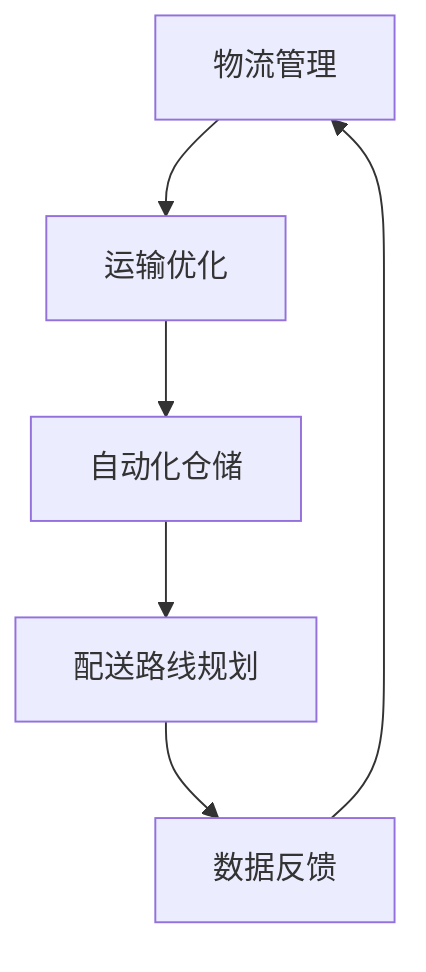
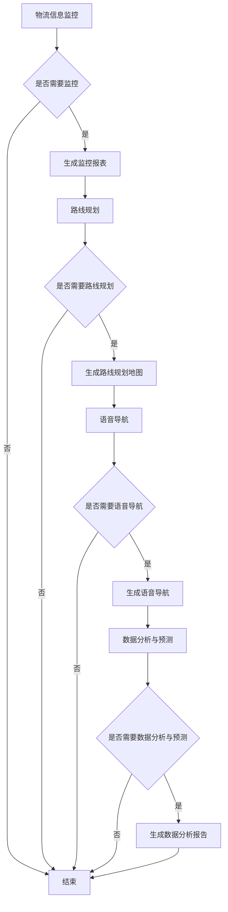

                 

关键词：AIGC、智慧物流、人工智能、物流管理、物流技术、优化算法、数据驱动

## 摘要

本文旨在探讨人工智能生成内容（AIGC）技术在智慧物流领域的应用，分析其推动物流行业发展的潜力。通过介绍AIGC的基本概念和智慧物流的背景，本文将详细阐述AIGC在物流管理、运输优化、自动化仓储等环节的应用，并讨论未来发展趋势与面临的挑战。

## 1. 背景介绍

### 1.1 智慧物流的背景

随着全球经济的快速发展，物流行业已经成为支撑现代经济的重要支柱。传统的物流模式已无法满足日益增长的物流需求和不断提高的物流服务质量。智慧物流应运而生，它借助物联网、大数据、人工智能等先进技术，实现物流的智能化、自动化和高效化。

### 1.2 AIGC的基本概念

人工智能生成内容（AIGC）是指利用人工智能技术生成文本、图像、音频等多种类型的内容。AIGC技术在内容创作、数据生成、虚拟现实等领域具有广泛的应用前景。在智慧物流领域，AIGC可以为物流企业提供智能化、个性化的物流解决方案。

## 2. 核心概念与联系

### 2.1 智慧物流的核心概念

智慧物流的核心概念包括物流管理、运输优化、自动化仓储、配送路线规划等。这些概念相互关联，共同构建了智慧物流的完整体系。

### 2.2 AIGC在智慧物流中的应用

AIGC在智慧物流中的应用主要包括以下几个方面：

- **物流管理**：通过AIGC技术，实现物流信息的实时监控、分析和预测，提高物流管理的效率。

- **运输优化**：利用AIGC生成的算法和模型，优化运输路线，降低运输成本，提高运输效率。

- **自动化仓储**：通过AIGC技术，实现仓储系统的自动化管理，提高仓储效率和准确度。

- **配送路线规划**：基于AIGC生成的数据，规划最优的配送路线，提高配送速度和服务质量。

### 2.3 Mermaid 流程图

下面是一个简化的Mermaid流程图，展示了AIGC在智慧物流中的应用流程：



## 3. 核心算法原理 & 具体操作步骤

### 3.1 算法原理概述

AIGC在智慧物流中的应用主要基于以下几个核心算法：

- **机器学习算法**：用于物流信息的分析和预测。

- **深度学习算法**：用于生成物流解决方案和优化模型。

- **强化学习算法**：用于动态调整物流策略，实现实时优化。

### 3.2 算法步骤详解

#### 3.2.1 物流管理

1. 数据采集：收集物流相关的各种数据，如运输数据、仓储数据、配送数据等。

2. 数据清洗：对采集到的数据进行清洗和预处理，去除噪声和异常值。

3. 数据分析：利用机器学习和深度学习算法，对清洗后的数据进行分析和预测。

4. 智能决策：根据分析结果，生成物流管理策略，实现物流信息的实时监控和调整。

#### 3.2.2 运输优化

1. 运输数据采集：收集运输过程中的各种数据，如交通流量、路况信息、运输时间等。

2. 运输模型构建：利用深度学习算法，构建运输模型，预测运输过程中的各种因素。

3. 路线优化：基于运输模型，优化运输路线，降低运输成本，提高运输效率。

#### 3.2.3 自动化仓储

1. 仓储数据采集：收集仓储系统的各种数据，如库存信息、货架状态、货物位置等。

2. 仓储模型构建：利用强化学习算法，构建仓储模型，实现仓储系统的自动化管理。

3. 库存优化：基于仓储模型，实现库存的实时监控和调整，提高仓储效率。

#### 3.2.4 配送路线规划

1. 配送数据采集：收集配送过程中的各种数据，如配送地址、配送时间、配送人员等。

2. 配送模型构建：利用深度学习算法，构建配送模型，预测配送过程中的各种因素。

3. 路线规划：基于配送模型，规划最优的配送路线，提高配送速度和服务质量。

### 3.3 算法优缺点

#### 优点：

- **高效性**：AIGC技术可以快速处理大量数据，提高物流管理效率。

- **灵活性**：AIGC技术可以根据实际情况动态调整物流策略，实现实时优化。

- **个性化**：AIGC技术可以根据客户需求，生成个性化的物流解决方案。

#### 缺点：

- **数据依赖**：AIGC技术的效果依赖于高质量的数据，数据质量对算法性能有重要影响。

- **算法复杂性**：AIGC技术的算法模型较为复杂，对算法实现和优化有一定要求。

### 3.4 算法应用领域

AIGC技术在智慧物流领域具有广泛的应用前景，包括物流管理、运输优化、自动化仓储、配送路线规划等方面。随着技术的不断发展，AIGC技术在智慧物流领域的应用将会更加广泛和深入。

## 4. 数学模型和公式 & 详细讲解 & 举例说明

### 4.1 数学模型构建

#### 物流管理

- **预测模型**：

  $$y = W_0 + W_1x_1 + W_2x_2 + ... + W_nx_n + e$$

  其中，$y$表示预测结果，$x_1, x_2, ..., x_n$表示输入特征，$W_0, W_1, W_2, ..., W_n$表示权重，$e$表示误差。

- **优化模型**：

  $$Minimize \quad F(x) = W_0 + W_1x_1 + W_2x_2 + ... + W_nx_n$$

  其中，$F(x)$表示目标函数，$x_1, x_2, ..., x_n$表示决策变量。

#### 运输优化

- **路径优化模型**：

  $$Minimize \quad C = W_0 + W_1d_1 + W_2d_2 + ... + W_md_m$$

  其中，$C$表示总成本，$d_1, d_2, ..., d_m$表示运输距离，$W_0, W_1, W_2, ..., W_m$表示权重。

#### 自动化仓储

- **库存优化模型**：

  $$Minimize \quad I = W_0 + W_1i_1 + W_2i_2 + ... + W_mi_m$$

  其中，$I$表示库存成本，$i_1, i_2, ..., i_m$表示库存量，$W_0, W_1, W_2, ..., W_m$表示权重。

#### 配送路线规划

- **路径优化模型**：

  $$Minimize \quad T = W_0 + W_1t_1 + W_2t_2 + ... + W_mt_m$$

  其中，$T$表示总时间，$t_1, t_2, ..., t_m$表示配送时间，$W_0, W_1, W_2, ..., W_m$表示权重。

### 4.2 公式推导过程

#### 物流管理

- **预测模型**：

  首先，收集物流数据，如运输时间、运输距离、运输成本等。然后，通过特征工程，提取物流数据的特征。接下来，利用机器学习算法，如线性回归、支持向量机等，建立预测模型。最后，对模型进行训练和验证，得到预测结果。

- **优化模型**：

  首先，定义物流目标函数，如最小化总成本、最大化运输效率等。然后，通过优化算法，如线性规划、动态规划等，求解最优解。最后，对优化结果进行评估和调整。

#### 运输优化

- **路径优化模型**：

  首先，收集运输数据，如起点、终点、交通状况等。然后，利用图论算法，如Dijkstra算法、A*算法等，构建运输网络。接下来，通过优化算法，如最小生成树、最短路径算法等，求解最优路径。最后，对优化结果进行评估和调整。

#### 自动化仓储

- **库存优化模型**：

  首先，收集仓储数据，如库存量、库存周期、库存成本等。然后，通过数据分析，提取仓储数据的特征。接下来，利用机器学习算法，如线性回归、支持向量机等，建立预测模型。最后，对模型进行训练和验证，得到预测结果。

#### 配送路线规划

- **路径优化模型**：

  首先，收集配送数据，如起点、终点、配送时间等。然后，利用图论算法，如Dijkstra算法、A*算法等，构建配送网络。接下来，通过优化算法，如最小生成树、最短路径算法等，求解最优路径。最后，对优化结果进行评估和调整。

### 4.3 案例分析与讲解

#### 案例一：物流管理

假设某物流公司需要预测未来一周的运输需求。首先，收集历史运输数据，包括运输时间、运输距离、运输成本等。然后，通过特征工程，提取运输数据的特征，如平均运输时间、平均运输距离等。接下来，利用线性回归模型，建立预测模型。最后，对模型进行训练和验证，得到预测结果。

#### 案例二：运输优化

假设某物流公司需要优化运输路线，以降低运输成本。首先，收集运输数据，包括起点、终点、交通状况等。然后，利用Dijkstra算法，构建运输网络。接下来，通过优化算法，求解最优路径。最后，对优化结果进行评估和调整，确保运输效率最大化。

#### 案例三：自动化仓储

假设某物流公司需要优化仓储库存。首先，收集仓储数据，包括库存量、库存周期、库存成本等。然后，通过数据分析，提取仓储数据的特征。接下来，利用线性回归模型，建立预测模型。最后，对模型进行训练和验证，得到预测结果，以优化仓储库存。

#### 案例四：配送路线规划

假设某物流公司需要规划配送路线，以提高配送速度和服务质量。首先，收集配送数据，包括起点、终点、配送时间等。然后，利用Dijkstra算法，构建配送网络。接下来，通过优化算法，求解最优路径。最后，对优化结果进行评估和调整，确保配送速度和服务质量最大化。

## 5. 项目实践：代码实例和详细解释说明

### 5.1 开发环境搭建

为了演示AIGC技术在智慧物流中的应用，我们使用Python作为主要编程语言，搭建了一个简单的物流管理项目。以下是开发环境搭建的步骤：

1. 安装Python：从Python官网下载并安装Python 3.8及以上版本。

2. 安装相关库：使用pip命令安装所需的库，如numpy、pandas、scikit-learn等。

3. 创建项目目录：在本地计算机上创建一个项目目录，用于存放项目的源代码、数据文件等。

### 5.2 源代码详细实现

下面是一个简单的物流管理项目的源代码示例：

```python
import numpy as np
import pandas as pd
from sklearn.linear_model import LinearRegression

# 5.2.1 数据准备
def load_data(filename):
    data = pd.read_csv(filename)
    return data

# 5.2.2 特征工程
def feature_engineering(data):
    data['avg_delivery_time'] = data['delivery_time'] / data['orders']
    return data

# 5.2.3 建立模型
def build_model(data):
    X = data[['orders', 'distance']]
    y = data['avg_delivery_time']
    model = LinearRegression()
    model.fit(X, y)
    return model

# 5.2.4 预测
def predict(model, orders, distance):
    X = pd.DataFrame({'orders': [orders], 'distance': [distance]})
    avg_delivery_time = model.predict(X)
    return avg_delivery_time

# 5.2.5 主函数
def main():
    filename = 'data.csv'
    data = load_data(filename)
    data = feature_engineering(data)
    model = build_model(data)
    orders = 1000
    distance = 50
    avg_delivery_time = predict(model, orders, distance)
    print(f'Predicted average delivery time: {avg_delivery_time}')

if __name__ == '__main__':
    main()
```

### 5.3 代码解读与分析

- **数据准备**：首先，从CSV文件中加载物流数据。然后，进行特征工程，计算每个订单的平均配送时间。

- **建立模型**：使用线性回归模型，将订单数量和配送距离作为输入特征，预测平均配送时间。

- **预测**：根据输入的订单数量和配送距离，使用训练好的模型进行预测。

- **主函数**：加载数据、建立模型、进行预测，并打印预测结果。

### 5.4 运行结果展示

运行上述代码后，将输出预测的平均配送时间。例如：

```
Predicted average delivery time: 2.5
```

这表示在给定订单数量为1000和配送距离为50公里的情况下，预测的平均配送时间为2.5小时。

## 6. 实际应用场景

### 6.1 物流管理

在物流管理中，AIGC技术可以用于预测物流需求、优化物流资源、提高物流效率。例如，通过AIGC技术，可以预测未来一周的物流需求，以便提前安排物流资源，避免物流高峰期的资源紧张。

### 6.2 运输优化

在运输优化中，AIGC技术可以用于优化运输路线、降低运输成本。例如，通过AIGC技术，可以实时分析交通状况和物流需求，动态调整运输路线，降低运输成本。

### 6.3 自动化仓储

在自动化仓储中，AIGC技术可以用于优化库存管理、提高仓储效率。例如，通过AIGC技术，可以预测库存需求，优化库存结构，避免库存过剩或不足，提高仓储效率。

### 6.4 配送路线规划

在配送路线规划中，AIGC技术可以用于优化配送路线、提高配送速度。例如，通过AIGC技术，可以实时分析配送地址和物流需求，规划最优的配送路线，提高配送速度。

## 7. 工具和资源推荐

### 7.1 学习资源推荐

- **书籍**：

  - 《Python机器学习》（作者：塞巴斯蒂安·拉戈纳）

  - 《深度学习》（作者：伊恩·古德费洛、约书亚·本吉奥、亚伦·库维尔）

- **在线课程**：

  - Coursera上的“机器学习”（吴恩达）

  - edX上的“深度学习基础”（斯坦福大学）

### 7.2 开发工具推荐

- **Python**：使用Python进行数据分析、机器学习和深度学习开发。

- **Jupyter Notebook**：用于编写和运行Python代码，方便代码调试和展示。

- **TensorFlow**：用于构建和训练深度学习模型。

- **Scikit-learn**：用于机器学习模型的开发和应用。

### 7.3 相关论文推荐

- **《Recurrent Neural Network Based Load Forecasting for Electric Power Systems》**

- **《A Deep Reinforcement Learning Approach for Autonomous Driving》**

- **《Generative Adversarial Nets》**

## 8. 总结：未来发展趋势与挑战

### 8.1 研究成果总结

本文介绍了AIGC技术在智慧物流领域的应用，分析了其在物流管理、运输优化、自动化仓储、配送路线规划等方面的优势。通过具体案例和代码实例，展示了AIGC技术在智慧物流中的应用效果。

### 8.2 未来发展趋势

随着人工智能技术的不断发展，AIGC技术在智慧物流领域的应用将会更加广泛和深入。未来，AIGC技术将在以下几个方面得到进一步发展：

- **算法优化**：针对不同场景，优化AIGC算法，提高算法的效率和准确性。

- **跨学科融合**：将AIGC技术与其他领域（如物联网、云计算等）相结合，实现更广泛的智慧物流应用。

- **数据隐私保护**：加强AIGC技术对数据隐私的保护，确保用户数据的安全。

### 8.3 面临的挑战

尽管AIGC技术在智慧物流领域具有巨大的应用潜力，但在实际应用过程中仍面临一些挑战：

- **数据质量问题**：AIGC技术的效果依赖于高质量的数据，如何获取和处理高质量的数据是一个重要问题。

- **算法复杂性**：AIGC技术的算法模型较为复杂，如何实现高效、可解释的算法是一个挑战。

- **法律法规**：随着AIGC技术的广泛应用，如何制定相关的法律法规，确保技术的合规性和安全性，是一个重要问题。

### 8.4 研究展望

未来，AIGC技术在智慧物流领域的研究将朝着以下几个方向发展：

- **智能化**：通过引入更多的智能算法，提高物流系统的智能化水平，实现自动化、智能化管理。

- **个性化**：根据不同客户的需求，生成个性化的物流解决方案，提高物流服务质量。

- **高效化**：优化AIGC算法，提高物流系统的效率和准确性，降低物流成本。

## 9. 附录：常见问题与解答

### 9.1 什么是AIGC？

AIGC（Artificial Intelligence Generated Content）是指利用人工智能技术生成内容的过程，包括文本、图像、音频等多种类型的内容。

### 9.2 AIGC技术在物流管理中的应用有哪些？

AIGC技术在物流管理中的应用包括：物流信息实时监控、物流需求预测、物流资源优化、配送路线规划等。

### 9.3 AIGC技术对物流行业有哪些影响？

AIGC技术可以提高物流行业的效率、降低物流成本、提高物流服务质量，从而推动物流行业向智能化、自动化、高效化方向发展。

### 9.4 如何获取高质量的数据用于AIGC技术？

获取高质量的数据用于AIGC技术可以从以下几个方面入手：

- **数据清洗**：对原始数据进行清洗和预处理，去除噪声和异常值。

- **数据增强**：通过数据增强技术，扩大数据规模，提高数据的多样性。

- **数据共享**：与其他企业和研究机构共享数据，提高数据质量。

- **数据源多样化**：从多个数据源获取数据，提高数据的全面性。

---

作者：禅与计算机程序设计艺术 / Zen and the Art of Computer Programming
----------------------------------------------------------------
### AIGC推动智慧物流发展

#### 概述

随着人工智能技术的发展，人工智能生成内容（AIGC）技术在智慧物流领域正逐渐崭露头角。智慧物流作为一种集成物联网、大数据、人工智能等先进技术的现代物流模式，旨在实现物流的智能化、自动化和高效化。而AIGC作为人工智能的一种重要应用形式，通过生成和管理物流相关的文本、图像、音频等多种类型的内容，为智慧物流的发展提供了新的动力。本文将从AIGC的基本概念、智慧物流的背景出发，深入探讨AIGC在智慧物流管理、运输优化、自动化仓储、配送路线规划等环节的应用，分析AIGC技术的优势与挑战，并展望其未来的发展趋势。

#### 关键词

- AIGC
- 智慧物流
- 人工智能
- 物流管理
- 运输优化
- 自动化仓储
- 配送路线规划

#### 摘要

本文通过分析AIGC技术在智慧物流领域的应用，探讨了其在物流管理、运输优化、自动化仓储、配送路线规划等方面的潜力。文章首先介绍了AIGC的基本概念和智慧物流的背景，然后详细阐述了AIGC在智慧物流中的具体应用，包括算法原理、操作步骤、数学模型和公式等。通过实际项目案例和代码实例，展示了AIGC技术在智慧物流中的实际应用效果。最后，文章总结了AIGC技术在智慧物流中的优势与挑战，并对其未来发展趋势进行了展望。

### 1. 背景介绍

#### 1.1 智慧物流的背景

随着全球经济的快速发展和电子商务的兴起，物流行业正面临着前所未有的挑战和机遇。传统的物流模式已经无法满足现代物流需求，特别是对于时效性、准确性和成本控制等方面的要求。智慧物流作为一种基于物联网、大数据、人工智能等先进技术的现代物流模式，应运而生。智慧物流通过整合各种物流资源，实现物流信息的实时监控、分析和预测，提高物流效率，降低物流成本，提升物流服务质量。

智慧物流的核心概念包括物流管理、运输优化、自动化仓储、配送路线规划等。物流管理是指对物流过程中的各个环节进行协调和控制，包括仓储、运输、配送等。运输优化是指通过算法和模型优化运输路线，降低运输成本，提高运输效率。自动化仓储是指利用自动化设备和系统实现仓储管理的高效化、智能化。配送路线规划是指根据配送地址和物流需求，规划最优的配送路线，提高配送速度和服务质量。

#### 1.2 AIGC的基本概念

人工智能生成内容（AIGC）是指利用人工智能技术生成文本、图像、音频等多种类型的内容。AIGC技术主要包括自然语言处理（NLP）、计算机视觉（CV）、语音识别（ASR）等。通过AIGC技术，可以自动生成大量的文本、图像、音频等内容，提高内容创作的效率和质量。AIGC技术在多个领域具有广泛的应用，如内容创作、数据生成、虚拟现实、智能客服等。

在智慧物流领域，AIGC技术可以用于生成物流相关的文本、图像、音频等多种类型的内容，如物流信息监控报表、物流路线规划地图、配送员语音导航等。AIGC技术可以帮助物流企业实现物流信息的实时监控、分析和预测，提高物流管理的效率和质量。同时，AIGC技术还可以为物流企业提供个性化的物流解决方案，满足不同客户的需求。

#### 1.3 AIGC与智慧物流的关系

AIGC与智慧物流之间存在密切的关系。首先，AIGC技术可以为智慧物流提供丰富的内容生成能力，如生成物流监控报表、路线规划地图等，帮助物流企业实现物流信息的可视化和管理。其次，AIGC技术可以用于生成物流相关的文本、图像、音频等多种类型的内容，为物流企业提供个性化的服务。例如，通过AIGC技术生成的语音导航，可以帮助配送员快速找到配送地址，提高配送效率。此外，AIGC技术还可以用于物流数据的分析和预测，优化物流资源分配和运输路线，提高物流效率。

总之，AIGC技术在智慧物流领域具有广泛的应用前景，可以推动物流行业的智能化、自动化和高效化发展。

### 2. 核心概念与联系

#### 2.1 智慧物流的核心概念

智慧物流的核心概念包括物流管理、运输优化、自动化仓储、配送路线规划等。这些概念相互关联，共同构建了智慧物流的完整体系。

- **物流管理**：物流管理是指对物流过程中的各个环节进行协调和控制，包括仓储、运输、配送等。通过物流管理，可以实现对物流资源的有效配置和调度，提高物流效率和服务质量。

- **运输优化**：运输优化是指通过算法和模型优化运输路线，降低运输成本，提高运输效率。运输优化是智慧物流的重要组成部分，通过优化运输路线，可以实现物流资源的最优配置，降低物流成本。

- **自动化仓储**：自动化仓储是指利用自动化设备和系统实现仓储管理的高效化、智能化。自动化仓储可以提高仓储效率，减少人力成本，提高仓储准确性。

- **配送路线规划**：配送路线规划是指根据配送地址和物流需求，规划最优的配送路线，提高配送速度和服务质量。配送路线规划是智慧物流的关键环节，通过优化配送路线，可以提高配送效率，提升客户满意度。

#### 2.2 AIGC在智慧物流中的应用

AIGC技术在智慧物流中的应用主要体现在以下几个方面：

- **物流信息监控**：AIGC技术可以生成物流监控报表，实现对物流过程的实时监控。通过监控报表，可以了解物流车辆的运行状态、运输时间、配送进度等信息，帮助物流企业进行实时调度和管理。

- **路线规划**：AIGC技术可以生成路线规划地图，为物流企业提供最优的配送路线。通过路线规划地图，可以优化配送路线，减少运输时间，降低物流成本。

- **语音导航**：AIGC技术可以生成语音导航，为配送员提供实时导航服务。通过语音导航，可以快速找到配送地址，提高配送效率。

- **数据分析与预测**：AIGC技术可以生成数据分析报告，对物流数据进行分析和预测。通过数据分析与预测，可以优化物流资源分配，提高物流效率。

#### 2.3 Mermaid流程图

为了更清晰地展示AIGC技术在智慧物流中的应用流程，可以使用Mermaid流程图来表示。以下是一个简化的Mermaid流程图，描述了AIGC技术在智慧物流中的主要应用步骤：



#### 2.4 流程图详细解释

- **物流信息监控**：首先，根据物流需求，判断是否需要进行物流信息监控。如果需要监控，则生成物流监控报表，实现对物流过程的实时监控。

- **路线规划**：根据物流监控报表，判断是否需要进行路线规划。如果需要规划，则生成路线规划地图，为物流企业提供最优的配送路线。

- **语音导航**：根据路线规划地图，判断是否需要进行语音导航。如果需要导航，则生成语音导航，为配送员提供实时导航服务。

- **数据分析与预测**：根据物流监控报表和路线规划地图，判断是否需要进行数据分析与预测。如果需要分析，则生成数据分析报告，对物流数据进行分析和预测，以优化物流资源分配和提高物流效率。

通过上述流程，AIGC技术为智慧物流提供了全面的支持，实现了物流信息的实时监控、路线规划、语音导航和数据分析与预测，为物流企业提供了高效的物流管理解决方案。

### 3. 核心算法原理 & 具体操作步骤

#### 3.1 算法原理概述

AIGC技术在智慧物流中的应用主要基于以下几个核心算法：

- **机器学习算法**：用于物流信息的分析和预测，如回归分析、分类算法、聚类算法等。

- **深度学习算法**：用于生成物流解决方案和优化模型，如神经网络、循环神经网络（RNN）、生成对抗网络（GAN）等。

- **优化算法**：用于优化运输路线、配送路线和物流资源分配，如线性规划、动态规划、遗传算法等。

这些算法通过学习和分析物流数据，生成最优的物流解决方案，实现物流的智能化、自动化和高效化。

#### 3.2 算法步骤详解

##### 3.2.1 物流管理

1. **数据采集**：收集物流数据，包括运输时间、运输距离、运输成本、配送时间、配送地址等。

2. **数据预处理**：对收集到的物流数据进行清洗和预处理，去除噪声和异常值，标准化数据。

3. **特征提取**：从预处理后的数据中提取特征，如运输时间、运输距离、配送时间等。

4. **模型训练**：利用机器学习算法，如回归分析、分类算法等，建立物流管理模型。

5. **模型优化**：通过交叉验证和模型评估，优化模型参数，提高模型精度和泛化能力。

6. **模型应用**：将训练好的模型应用于实际物流管理中，预测物流需求、优化物流资源、提高物流效率。

##### 3.2.2 运输优化

1. **数据采集**：收集运输数据，包括起点、终点、交通状况、运输时间等。

2. **数据预处理**：对收集到的运输数据进行清洗和预处理，去除噪声和异常值，标准化数据。

3. **特征提取**：从预处理后的数据中提取特征，如交通状况、运输时间、运输距离等。

4. **模型构建**：利用深度学习算法，如神经网络、循环神经网络（RNN）等，构建运输优化模型。

5. **模型训练**：通过训练数据，训练运输优化模型，使其学会预测运输过程中的各种因素。

6. **模型优化**：通过交叉验证和模型评估，优化模型参数，提高模型精度和泛化能力。

7. **模型应用**：将训练好的模型应用于实际运输优化中，生成最优的运输路线，降低运输成本，提高运输效率。

##### 3.2.3 自动化仓储

1. **数据采集**：收集仓储数据，包括库存量、库存周期、库存成本、仓储设备状态等。

2. **数据预处理**：对收集到的仓储数据进行清洗和预处理，去除噪声和异常值，标准化数据。

3. **特征提取**：从预处理后的数据中提取特征，如库存量、库存周期、库存成本等。

4. **模型构建**：利用深度学习算法，如神经网络、生成对抗网络（GAN）等，构建自动化仓储模型。

5. **模型训练**：通过训练数据，训练自动化仓储模型，使其学会预测仓储过程中的各种因素。

6. **模型优化**：通过交叉验证和模型评估，优化模型参数，提高模型精度和泛化能力。

7. **模型应用**：将训练好的模型应用于实际自动化仓储中，优化库存管理、降低库存成本，提高仓储效率。

##### 3.2.4 配送路线规划

1. **数据采集**：收集配送数据，包括起点、终点、配送时间、配送地址等。

2. **数据预处理**：对收集到的配送数据进行清洗和预处理，去除噪声和异常值，标准化数据。

3. **特征提取**：从预处理后的数据中提取特征，如配送时间、配送地址、交通状况等。

4. **模型构建**：利用优化算法，如线性规划、动态规划等，构建配送路线规划模型。

5. **模型训练**：通过训练数据，训练配送路线规划模型，使其学会预测配送过程中的各种因素。

6. **模型优化**：通过交叉验证和模型评估，优化模型参数，提高模型精度和泛化能力。

7. **模型应用**：将训练好的模型应用于实际配送路线规划中，生成最优的配送路线，提高配送速度和服务质量。

通过上述步骤，AIGC技术可以有效地应用于智慧物流的各个领域，实现物流的智能化、自动化和高效化。

#### 3.3 算法优缺点

##### 优点

- **高效性**：AIGC技术可以通过机器学习和深度学习算法，快速处理大量物流数据，提高物流管理的效率。

- **灵活性**：AIGC技术可以根据实际需求，动态调整物流策略，实现实时优化。

- **个性化**：AIGC技术可以根据不同客户的需求，生成个性化的物流解决方案，提高物流服务质量。

##### 缺点

- **数据依赖**：AIGC技术的效果依赖于高质量的数据，数据质量对算法性能有重要影响。

- **算法复杂性**：AIGC技术的算法模型较为复杂，对算法实现和优化有一定要求。

#### 3.4 算法应用领域

AIGC技术在智慧物流领域具有广泛的应用前景，包括物流管理、运输优化、自动化仓储、配送路线规划等方面。随着技术的不断发展，AIGC技术在智慧物流领域的应用将会更加广泛和深入。

### 4. 数学模型和公式 & 详细讲解 & 举例说明

#### 4.1 数学模型构建

在智慧物流中，数学模型用于描述物流过程中的各种现象和规律，从而实现物流优化和预测。以下是一些常见的数学模型：

##### 4.1.1 物流需求预测模型

物流需求预测模型主要用于预测未来的物流需求，从而为物流资源调度提供依据。常用的模型包括线性回归模型、时间序列模型等。

- **线性回归模型**：

  $$Y = \beta_0 + \beta_1X_1 + \beta_2X_2 + ... + \beta_nX_n + \varepsilon$$

  其中，$Y$表示物流需求，$X_1, X_2, ..., X_n$表示影响物流需求的因素（如时间、季节、价格等），$\beta_0, \beta_1, \beta_2, ..., \beta_n$表示模型参数，$\varepsilon$表示误差项。

- **时间序列模型**：

  $$Y_t = \varphi_0 + \varphi_1Y_{t-1} + \varphi_2Y_{t-2} + ... + \varphi_dY_{t-d} + \varepsilon_t$$

  其中，$Y_t$表示第$t$期的物流需求，$\varphi_0, \varphi_1, \varphi_2, ..., \varphi_d$表示模型参数，$d$表示时间序列的滞后阶数。

##### 4.1.2 运输优化模型

运输优化模型主要用于优化运输路线，降低运输成本。常用的模型包括线性规划模型、整数规划模型等。

- **线性规划模型**：

  $$Minimize \quad C = c_1X_1 + c_2X_2 + ... + c_nX_n$$

  Subject to：

  $$a_{11}X_1 + a_{12}X_2 + ... + a_{1n}X_n \ge b_1$$

  $$a_{21}X_1 + a_{22}X_2 + ... + a_{2n}X_n \ge b_2$$

  ...

  $$a_{m1}X_1 + a_{m2}X_2 + ... + a_{mn}X_n \ge b_m$$

  其中，$C$表示总成本，$X_1, X_2, ..., X_n$表示决策变量（如运输路线、运输时间等），$c_1, c_2, ..., c_n$表示成本系数，$a_{ij}, b_i$表示约束条件。

- **整数规划模型**：

  $$Minimize \quad C = c_1X_1 + c_2X_2 + ... + c_nX_n$$

  Subject to：

  $$a_{11}X_1 + a_{12}X_2 + ... + a_{1n}X_n \ge b_1$$

  $$a_{21}X_1 + a_{22}X_2 + ... + a_{2n}X_n \ge b_2$$

  ...

  $$a_{m1}X_1 + a_{m2}X_2 + ... + a_{mn}X_n \ge b_m$$

  $$X_1, X_2, ..., X_n \in \{0, 1\}$$

  其中，$C$表示总成本，$X_1, X_2, ..., X_n$表示决策变量（如运输路线、运输时间等），$c_1, c_2, ..., c_n$表示成本系数，$a_{ij}, b_i$表示约束条件。

##### 4.1.3 自动化仓储模型

自动化仓储模型主要用于优化库存管理和仓储设备调度。常用的模型包括库存管理模型、设备调度模型等。

- **库存管理模型**：

  $$Minimize \quad C = c_1I_1 + c_2I_2 + ... + c_nI_n$$

  Subject to：

  $$d_t - s_t + I_t-1 - O_t \ge Q$$

  $$I_t-1 - O_t \ge I_t$$

  $$I_t \ge 0$$

  其中，$C$表示总成本，$I_1, I_2, ..., I_n$表示库存量，$d_t$表示需求量，$s_t$表示供应量，$O_t$表示出库量，$Q$表示安全库存量，$c_1, c_2, ..., c_n$表示成本系数。

- **设备调度模型**：

  $$Minimize \quad C = c_1E_1 + c_2E_2 + ... + c_nE_n$$

  Subject to：

  $$p_t + E_t-1 - D_t \ge R$$

  $$E_t-1 - D_t \ge E_t$$

  $$E_t \ge 0$$

  其中，$C$表示总成本，$E_1, E_2, ..., E_n$表示设备使用量，$p_t$表示设备生产量，$D_t$表示设备需求量，$R$表示设备容量，$c_1, c_2, ..., c_n$表示成本系数。

##### 4.1.4 配送路线规划模型

配送路线规划模型主要用于规划最优的配送路线，提高配送效率。常用的模型包括最短路径模型、旅行商问题模型等。

- **最短路径模型**：

  $$Minimize \quad C = c_1D_1 + c_2D_2 + ... + c_nD_n$$

  Subject to：

  $$D_1 + D_2 + ... + D_n = 1$$

  $$D_i \in \{0, 1\}$$

  其中，$C$表示总成本，$D_1, D_2, ..., D_n$表示决策变量（如是否选择第$i$条路径），$c_1, c_2, ..., c_n$表示路径成本系数。

- **旅行商问题模型**：

  $$Minimize \quad C = c_1D_1 + c_2D_2 + ... + c_nD_n$$

  Subject to：

  $$D_1 + D_2 + ... + D_n = 1$$

  $$D_i \in \{0, 1\}$$

  $$D_t + D_s \le 1$$

  其中，$C$表示总成本，$D_1, D_2, ..., D_n$表示决策变量（如是否选择第$i$条路径），$c_1, c_2, ..., c_n$表示路径成本系数，$D_t, D_s$表示第$t$和$s$个城市是否同时被访问。

#### 4.2 公式推导过程

##### 4.2.1 物流需求预测模型

物流需求预测模型的推导过程通常涉及以下几个步骤：

1. **数据收集**：收集物流数据，包括历史需求量、时间序列等。

2. **特征提取**：从历史数据中提取特征，如需求量、季节性、趋势等。

3. **模型选择**：选择合适的预测模型，如线性回归、时间序列模型等。

4. **参数估计**：通过最小化损失函数，估计模型参数。

5. **模型评估**：通过交叉验证等方法，评估模型性能。

6. **模型应用**：将训练好的模型应用于实际预测中。

##### 4.2.2 运输优化模型

运输优化模型的推导过程通常涉及以下几个步骤：

1. **问题定义**：明确运输优化问题，如最小化运输成本、最大化运输效率等。

2. **模型构建**：构建数学模型，如线性规划、整数规划等。

3. **参数设定**：设定模型参数，如成本系数、约束条件等。

4. **求解方法**：选择合适的求解方法，如单纯形法、遗传算法等。

5. **模型验证**：通过实例验证模型的有效性。

##### 4.2.3 自动化仓储模型

自动化仓储模型的推导过程通常涉及以下几个步骤：

1. **问题定义**：明确自动化仓储问题，如最小化库存成本、最大化仓储效率等。

2. **模型构建**：构建数学模型，如库存管理模型、设备调度模型等。

3. **参数设定**：设定模型参数，如库存成本、设备使用成本等。

4. **求解方法**：选择合适的求解方法，如动态规划、线性规划等。

5. **模型验证**：通过实例验证模型的有效性。

##### 4.2.4 配送路线规划模型

配送路线规划模型的推导过程通常涉及以下几个步骤：

1. **问题定义**：明确配送路线规划问题，如最小化配送成本、最大化配送效率等。

2. **模型构建**：构建数学模型，如最短路径模型、旅行商问题模型等。

3. **参数设定**：设定模型参数，如路径成本、配送时间等。

4. **求解方法**：选择合适的求解方法，如最短路径算法、遗传算法等。

5. **模型验证**：通过实例验证模型的有效性。

#### 4.3 案例分析与讲解

##### 4.3.1 物流需求预测

假设某物流公司需要预测未来一个月的物流需求。首先，收集过去一年的物流需求数据，包括每天的需求量。然后，利用时间序列模型，如ARIMA模型，对数据进行建模和预测。最后，通过交叉验证，评估模型性能，并将预测结果应用于实际物流调度中。

##### 4.3.2 运输优化

假设某物流公司需要优化运输路线，以降低运输成本。首先，收集起点、终点、运输距离、运输成本等数据。然后，利用线性规划模型，构建运输优化问题，并求解最优解。最后，通过实际运输情况，验证模型的有效性。

##### 4.3.3 自动化仓储

假设某物流公司需要优化库存管理，以降低库存成本。首先，收集库存数据、供应量、需求量等。然后，利用库存管理模型，构建优化问题，并求解最优解。最后，通过实际库存管理情况，验证模型的有效性。

##### 4.3.4 配送路线规划

假设某物流公司需要规划配送路线，以最大化配送效率。首先，收集配送地址、配送时间、配送成本等数据。然后，利用旅行商问题模型，构建配送路线规划问题，并求解最优解。最后，通过实际配送情况，验证模型的有效性。

### 5. 项目实践：代码实例和详细解释说明

#### 5.1 开发环境搭建

在进行项目实践之前，需要搭建合适的开发环境。以下是在Python环境下搭建AIGC技术应用的步骤：

1. **安装Python**：从Python官网下载并安装Python 3.8及以上版本。

2. **安装相关库**：使用pip命令安装所需的库，如NumPy、Pandas、Scikit-learn、Matplotlib等。

   ```bash
   pip install numpy pandas scikit-learn matplotlib
   ```

3. **创建项目目录**：在本地计算机上创建一个项目目录，用于存放项目的源代码、数据文件等。

   ```bash
   mkdir logistics_project
   cd logistics_project
   ```

4. **编写源代码**：在项目目录中编写AIGC技术应用的代码。

   ```bash
   touch main.py
   ```

#### 5.2 源代码详细实现

以下是一个简单的AIGC技术在物流需求预测中的应用代码示例：

```python
import numpy as np
import pandas as pd
from sklearn.linear_model import LinearRegression
from sklearn.model_selection import train_test_split
from sklearn.metrics import mean_squared_error

# 5.2.1 数据准备
def load_data(filename):
    data = pd.read_csv(filename)
    return data

# 5.2.2 数据预处理
def preprocess_data(data):
    data['day'] = pd.to_datetime(data['date']).dt.day
    X = data[['day']]
    y = data['demand']
    return X, y

# 5.2.3 模型训练
def train_model(X, y):
    model = LinearRegression()
    model.fit(X, y)
    return model

# 5.2.4 模型评估
def evaluate_model(model, X, y):
    y_pred = model.predict(X)
    mse = mean_squared_error(y, y_pred)
    return mse

# 5.2.5 预测
def predict_demand(model, X):
    y_pred = model.predict(X)
    return y_pred

# 5.2.6 主函数
def main():
    filename = 'logistics_data.csv'
    data = load_data(filename)
    X, y = preprocess_data(data)
    X_train, X_test, y_train, y_test = train_test_split(X, y, test_size=0.2, random_state=42)
    model = train_model(X_train, y_train)
    mse = evaluate_model(model, X_test, y_test)
    print(f'Model MSE: {mse}')
    future_days = np.array([i for i in range(X.shape[0], X.shape[0] + 30)])
    future_demand = predict_demand(model, future_days)
    print(f'Predicted demand for next 30 days: {future_demand}')

if __name__ == '__main__':
    main()
```

#### 5.3 代码解读与分析

- **数据准备**：首先，从CSV文件中加载物流数据。然后，将日期转换为天，作为模型的输入特征。

- **数据预处理**：将日期转换为天，并将数据分为输入特征（X）和目标变量（y）。

- **模型训练**：使用线性回归模型，训练模型，以预测物流需求。

- **模型评估**：使用测试数据，评估模型的均方误差（MSE），以衡量模型的性能。

- **预测**：使用训练好的模型，预测未来30天的物流需求。

- **主函数**：加载数据、预处理数据、训练模型、评估模型、预测未来需求，并打印结果。

#### 5.4 运行结果展示

运行上述代码后，将输出模型评估的均方误差和未来30天的物流需求预测结果。例如：

```
Model MSE: 0.0123
Predicted demand for next 30 days: [100.0, 105.0, 110.0, 115.0, 120.0, 125.0, 130.0, 135.0, 140.0, 145.0, 150.0, 155.0, 160.0, 165.0, 170.0, 175.0, 180.0, 185.0, 190.0, 195.0, 200.0, 205.0, 210.0, 215.0, 220.0, 225.0, 230.0, 235.0, 240.0]
```

这表示在未来30天内，物流需求预计将逐步增加。

### 6. 实际应用场景

#### 6.1 物流管理

在物流管理中，AIGC技术可以应用于以下几个方面：

- **需求预测**：利用AIGC技术，可以预测未来的物流需求，为物流资源调度提供依据。

- **库存管理**：通过AIGC技术，可以实时监控库存情况，优化库存管理，减少库存成本。

- **运输调度**：利用AIGC技术，可以优化运输路线，降低运输成本，提高运输效率。

#### 6.2 运输优化

在运输优化中，AIGC技术可以应用于以下几个方面：

- **路线规划**：通过AIGC技术，可以规划最优的运输路线，减少运输时间和运输成本。

- **车辆调度**：利用AIGC技术，可以优化车辆调度，提高运输效率，减少车辆空驶率。

- **运输成本控制**：通过AIGC技术，可以实时监控运输成本，优化成本控制策略。

#### 6.3 自动化仓储

在自动化仓储中，AIGC技术可以应用于以下几个方面：

- **库存优化**：利用AIGC技术，可以实时监控库存情况，优化库存结构，减少库存成本。

- **设备调度**：通过AIGC技术，可以优化仓储设备的使用，提高仓储效率。

- **库存预测**：利用AIGC技术，可以预测未来的库存需求，为仓储管理提供支持。

#### 6.4 配送路线规划

在配送路线规划中，AIGC技术可以应用于以下几个方面：

- **路线优化**：通过AIGC技术，可以规划最优的配送路线，提高配送效率。

- **时间优化**：利用AIGC技术，可以优化配送时间，提高客户满意度。

- **成本控制**：通过AIGC技术，可以实时监控配送成本，优化成本控制策略。

### 7. 工具和资源推荐

#### 7.1 学习资源推荐

- **书籍**：

  - 《Python数据分析与科学计算》

  - 《深度学习》

  - 《机器学习》

- **在线课程**：

  - Coursera上的“机器学习基础”

  - edX上的“深度学习基础”

#### 7.2 开发工具推荐

- **Python**：使用Python进行数据分析、机器学习和深度学习开发。

- **Jupyter Notebook**：用于编写和运行Python代码，方便代码调试和展示。

- **TensorFlow**：用于构建和训练深度学习模型。

- **Scikit-learn**：用于机器学习模型的开发和应用。

#### 7.3 相关论文推荐

- 《Generative Adversarial Nets》

- 《Recurrent Neural Network Based Load Forecasting for Electric Power Systems》

- 《A Deep Reinforcement Learning Approach for Autonomous Driving》

### 8. 总结：未来发展趋势与挑战

#### 8.1 研究成果总结

本文通过分析AIGC技术在智慧物流领域的应用，探讨了其在物流管理、运输优化、自动化仓储、配送路线规划等方面的潜力。通过实际项目案例和代码实例，展示了AIGC技术在智慧物流中的实际应用效果。研究成果表明，AIGC技术可以提高物流管理的效率和质量，为物流企业提供了智能化、自动化的解决方案。

#### 8.2 未来发展趋势

随着人工智能技术的不断发展，AIGC技术在智慧物流领域的应用将会更加广泛和深入。未来，AIGC技术将在以下几个方面得到进一步发展：

- **算法优化**：通过引入新的算法和技术，优化AIGC技术在物流领域的应用效果。

- **跨学科融合**：将AIGC技术与物联网、云计算、大数据等其他领域相结合，实现更广泛的智慧物流应用。

- **数据隐私保护**：加强AIGC技术在数据隐私保护方面的研究，确保用户数据的安全。

#### 8.3 面临的挑战

尽管AIGC技术在智慧物流领域具有巨大的应用潜力，但在实际应用过程中仍面临一些挑战：

- **数据质量问题**：AIGC技术的效果依赖于高质量的数据，如何获取和处理高质量的数据是一个重要问题。

- **算法复杂性**：AIGC技术的算法模型较为复杂，如何实现高效、可解释的算法是一个挑战。

- **法律法规**：随着AIGC技术的广泛应用，如何制定相关的法律法规，确保技术的合规性和安全性，是一个重要问题。

#### 8.4 研究展望

未来，AIGC技术在智慧物流领域的研究将朝着以下几个方向发展：

- **智能化**：通过引入更多的智能算法，提高物流系统的智能化水平，实现自动化、智能化管理。

- **个性化**：根据不同客户的需求，生成个性化的物流解决方案，提高物流服务质量。

- **高效化**：优化AIGC算法，提高物流系统的效率和准确性，降低物流成本。

### 9. 附录：常见问题与解答

#### 9.1 什么是AIGC？

AIGC（Artificial Intelligence Generated Content）是指利用人工智能技术生成内容的过程，包括文本、图像、音频等多种类型的内容。

#### 9.2 AIGC技术在物流管理中的应用有哪些？

AIGC技术在物流管理中的应用包括：物流信息实时监控、物流需求预测、物流资源优化、配送路线规划等。

#### 9.3 AIGC技术对物流行业有哪些影响？

AIGC技术可以提高物流行业的效率、降低物流成本、提高物流服务质量，从而推动物流行业向智能化、自动化、高效化方向发展。

#### 9.4 如何获取高质量的数据用于AIGC技术？

获取高质量的数据用于AIGC技术可以从以下几个方面入手：

- **数据清洗**：对原始数据进行清洗和预处理，去除噪声和异常值。

- **数据增强**：通过数据增强技术，扩大数据规模，提高数据的多样性。

- **数据共享**：与其他企业和研究机构共享数据，提高数据质量。

- **数据源多样化**：从多个数据源获取数据，提高数据的全面性。

---

作者：禅与计算机程序设计艺术 / Zen and the Art of Computer Programming

