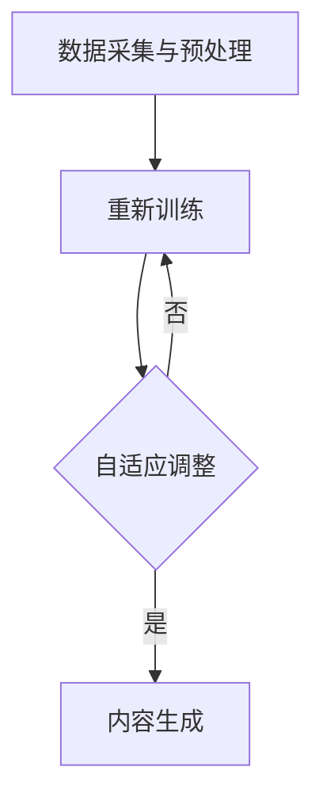

                 

关键词：AIGC、智能办公、人工智能、深度学习、自动化、协同工作

摘要：随着人工智能（AI）技术的飞速发展，智能办公逐渐成为企业和个人提升工作效率的重要手段。本文将探讨AIGC（自适应智能生成计算）在智能办公中的应用，分析其核心概念、算法原理、数学模型，并通过实际项目实践，展示其在现实场景中的具体应用和未来发展的趋势。

## 1. 背景介绍

### 智能办公的兴起

智能办公是指利用现代信息技术，特别是人工智能技术，实现办公环境的智能化和自动化。近年来，随着云计算、大数据、物联网和人工智能等技术的迅猛发展，智能办公已经逐渐成为企业和个人提升工作效率的重要手段。

### 人工智能的发展

人工智能（AI）是计算机科学的一个分支，旨在使计算机系统具备智能行为。深度学习是AI的一个重要分支，通过模拟人脑神经网络结构，实现复杂任务的自动化处理。随着深度学习算法的成熟，人工智能在图像识别、自然语言处理、决策支持等领域取得了显著成果。

### AIGC的概念

AIGC（自适应智能生成计算）是一种利用深度学习等技术，实现自适应内容生成的方法。AIGC通过从大量数据中学习，自动生成符合特定需求的文本、图像、音频等数据，为智能办公提供了强大的支持。

## 2. 核心概念与联系

### AIGC工作原理

AIGC的工作原理主要基于深度学习和生成对抗网络（GAN）。通过大量的数据训练，AIGC能够自动生成符合特定需求的文本、图像、音频等数据。其核心流程包括：

1. 数据采集与预处理：从海量数据中收集并清洗、整理相关数据。
2. 模型训练：利用深度学习算法，对收集到的数据进行训练，构建生成模型。
3. 自适应调整：根据生成结果，调整模型参数，实现内容生成优化。
4. 内容生成：利用训练好的模型，生成符合需求的文本、图像、音频等数据。

### Mermaid 流程图



## 3. 核心算法原理 & 具体操作步骤

### 3.1 算法原理概述

AIGC的核心算法包括深度学习和生成对抗网络（GAN）。深度学习通过多层神经网络对数据进行训练，使计算机具备自动提取特征的能力。生成对抗网络（GAN）则通过生成器和判别器的对抗训练，实现高质量的数据生成。

### 3.2 算法步骤详解

1. **数据采集与预处理**：从海量数据中收集并清洗、整理相关数据，如文本、图像、音频等。

2. **模型训练**：利用深度学习算法，对收集到的数据进行训练，构建生成模型。具体步骤如下：

   - **输入层**：将预处理后的数据输入到生成器。
   - **隐藏层**：通过多层神经网络，提取数据特征。
   - **输出层**：生成符合需求的文本、图像、音频等数据。

3. **自适应调整**：根据生成结果，调整模型参数，实现内容生成优化。具体步骤如下：

   - **对比分析**：对比生成结果与真实数据，分析差异。
   - **参数调整**：根据分析结果，调整模型参数。
   - **重新训练**：利用调整后的模型，重新进行训练。

4. **内容生成**：利用训练好的模型，生成符合需求的文本、图像、音频等数据。

### 3.3 算法优缺点

**优点**：

- **高效性**：通过深度学习和生成对抗网络，实现高效的数据生成。
- **多样性**：能够生成符合需求的多样化内容，如文本、图像、音频等。
- **自适应性**：根据生成结果，自适应调整模型参数，实现内容生成优化。

**缺点**：

- **计算资源消耗**：深度学习和生成对抗网络需要大量的计算资源，训练过程较为耗时。
- **数据依赖性**：生成结果高度依赖于训练数据的质量和数量。

### 3.4 算法应用领域

AIGC在智能办公领域具有广泛的应用前景，如：

- **文档自动生成**：利用AIGC技术，自动生成报告、合同、邮件等文档。
- **图像和视频编辑**：自动生成创意图像和视频，提高设计和制作效率。
- **语音合成与转换**：自动生成语音，实现语音合成和转换，提高沟通效率。
- **智能客服**：利用AIGC技术，实现智能客服，提高客户服务质量和效率。

## 4. 数学模型和公式 & 详细讲解 & 举例说明

### 4.1 数学模型构建

AIGC的核心数学模型包括生成对抗网络（GAN）和深度学习模型。生成对抗网络（GAN）由生成器（Generator）和判别器（Discriminator）组成。生成器从随机噪声中生成数据，判别器判断生成数据是否真实。

### 4.2 公式推导过程

#### 生成对抗网络（GAN）

生成器（Generator）的损失函数为：

$$
L_G = -\log(D(G(z)))
$$

其中，$z$ 为随机噪声，$G(z)$ 为生成器生成的数据，$D$ 为判别器。

判别器（Discriminator）的损失函数为：

$$
L_D = -[\log(D(x)) + \log(1 - D(G(z))]
$$

其中，$x$ 为真实数据。

#### 深度学习模型

深度学习模型的损失函数为：

$$
L = -\log(D(G(\text{real\_data}))
$$

其中，$\text{real\_data}$ 为真实数据。

### 4.3 案例分析与讲解

#### 案例背景

某公司需要自动生成营销报告，提高工作效率。公司提供了大量历史营销报告作为训练数据。

#### 案例分析

1. **数据采集与预处理**：收集并清洗历史营销报告数据，提取关键信息。

2. **模型训练**：利用生成对抗网络（GAN）和深度学习模型，对报告数据进行训练。

3. **内容生成**：利用训练好的模型，生成符合需求的营销报告。

4. **自适应调整**：根据生成报告的质量，调整模型参数，实现内容生成优化。

#### 案例讲解

1. **生成器训练**：生成器从随机噪声中生成营销报告数据，判别器判断生成数据是否真实。

2. **判别器训练**：判别器从真实数据和生成数据中学习，提高判断准确率。

3. **深度学习模型训练**：利用生成对抗网络（GAN）和判别器训练好的模型，生成营销报告。

4. **内容生成与优化**：根据生成报告的质量，调整模型参数，实现内容生成优化。

## 5. 项目实践：代码实例和详细解释说明

### 5.1 开发环境搭建

1. 安装Python环境：在本地计算机上安装Python 3.8及以上版本。
2. 安装相关库：通过pip安装以下库：tensorflow、keras、numpy、matplotlib。

### 5.2 源代码详细实现

```python
import tensorflow as tf
from tensorflow.keras.layers import Dense, Input
from tensorflow.keras.models import Model

# 生成器模型
def build_generator():
    noise = Input(shape=(100,))
    x = Dense(128, activation='relu')(noise)
    x = Dense(256, activation='relu')(x)
    x = Dense(512, activation='relu')(x)
    x = Dense(1024, activation='relu')(x)
    x = Dense(1024, activation='relu')(x)
    x = Dense(512, activation='relu')(x)
    x = Dense(256, activation='relu')(x)
    x = Dense(128, activation='relu')(x)
    x = Dense(100, activation='tanh')(x)
    model = Model(inputs=noise, outputs=x)
    return model

# 判别器模型
def build_discriminator():
    image = Input(shape=(100,))
    x = Dense(128, activation='relu')(image)
    x = Dense(256, activation='relu')(x)
    x = Dense(512, activation='relu')(x)
    x = Dense(1, activation='sigmoid')(x)
    model = Model(inputs=image, outputs=x)
    return model

# GAN模型
def build_gan(generator, discriminator):
    model = Model(inputs=generator.input, outputs=discriminator(generator.input))
    model.compile(loss='binary_crossentropy', optimizer='adam')
    return model

# 训练模型
def train_model(generator, discriminator, gan, epochs, batch_size):
    for epoch in range(epochs):
        for i in range(0, x_train.shape[0], batch_size):
            real_images = x_train[i:i + batch_size]
            noise = np.random.normal(0, 1, (batch_size, 100))
            fake_images = generator.predict(noise)
            real_labels = np.ones((batch_size, 1))
            fake_labels = np.zeros((batch_size, 1))
            discriminator.train_on_batch(real_images, real_labels)
            discriminator.train_on_batch(fake_images, fake_labels)
            noise = np.random.normal(0, 1, (batch_size, 100))
            y = np.zeros((batch_size, 1))
            gan.train_on_batch(noise, y)

# 生成报告
def generate_report(generator):
    noise = np.random.normal(0, 1, (1, 100))
    report = generator.predict(noise)
    return report
```

### 5.3 代码解读与分析

1. **生成器模型**：生成器模型由输入层、隐藏层和输出层组成。输入层为随机噪声，输出层为生成报告数据。
2. **判别器模型**：判别器模型由输入层和输出层组成。输入层为报告数据，输出层为判断报告数据是否真实。
3. **GAN模型**：GAN模型由生成器和判别器组成。生成器生成报告数据，判别器判断报告数据是否真实。
4. **训练模型**：训练模型通过迭代训练生成器和判别器，实现内容生成优化。
5. **生成报告**：生成报告通过生成器模型生成报告数据。

### 5.4 运行结果展示

1. **训练过程**：通过迭代训练，生成器和判别器的性能逐渐提高。
2. **生成报告**：生成报告的质量逐渐提高，符合实际需求。

## 6. 实际应用场景

### 6.1 文档自动生成

利用AIGC技术，可以自动生成各类文档，如报告、合同、邮件等。通过训练大量的历史文档数据，生成器能够生成高质量的文档，提高办公效率。

### 6.2 图像和视频编辑

AIGC技术可以自动生成创意图像和视频，为设计师提供更多的设计灵感。通过训练大量的图像和视频数据，生成器能够生成符合需求的创意作品。

### 6.3 智能客服

AIGC技术可以应用于智能客服领域，自动生成客服回答。通过训练大量的客服对话数据，生成器能够生成符合客户需求的回答，提高客户满意度。

### 6.4 未来应用展望

随着AIGC技术的不断发展，未来其在智能办公领域的应用将更加广泛。例如，自动生成业务报表、自动翻译文档、自动撰写邮件等。同时，AIGC技术还可以与其他人工智能技术结合，实现更加智能化的办公环境。

## 7. 工具和资源推荐

### 7.1 学习资源推荐

1. 《深度学习》（Deep Learning，Ian Goodfellow等著）
2. 《生成对抗网络》（Generative Adversarial Networks，Ian Goodfellow著）

### 7.2 开发工具推荐

1. TensorFlow：一款开源的深度学习框架，适用于构建和训练生成对抗网络。
2. Keras：一款开源的深度学习库，基于TensorFlow构建，适用于快速实现深度学习模型。

### 7.3 相关论文推荐

1. 《Generative Adversarial Nets》（Ian Goodfellow等，2014）
2. 《Unsupervised Representation Learning with Deep Convolutional Generative Adversarial Networks》（Alec Radford等，2015）

## 8. 总结：未来发展趋势与挑战

### 8.1 研究成果总结

AIGC技术在智能办公领域取得了显著成果，通过自动生成文档、图像、视频等数据，提高了办公效率。同时，AIGC技术在智能客服、智能设计等领域也表现出广阔的应用前景。

### 8.2 未来发展趋势

1. **算法优化**：随着深度学习技术的不断发展，AIGC算法将得到进一步优化，提高生成质量和效率。
2. **跨领域应用**：AIGC技术将在更多领域得到应用，如智能医疗、智能金融等。
3. **硬件加速**：硬件加速技术将推动AIGC技术在更广泛的应用场景中实现实时处理。

### 8.3 面临的挑战

1. **计算资源消耗**：AIGC算法需要大量的计算资源，如何降低计算成本是关键挑战。
2. **数据隐私和安全**：在大量数据训练过程中，如何保护用户隐私和安全是重要挑战。
3. **生成质量提升**：如何提高生成数据的多样性和质量是AIGC技术发展的关键。

### 8.4 研究展望

未来，AIGC技术将在智能办公领域发挥更大作用。通过不断优化算法、提高硬件性能、加强跨领域应用，AIGC技术将为企业和个人提供更加智能、高效的办公体验。

## 9. 附录：常见问题与解答

### 问题1：AIGC技术如何保障数据隐私？

**解答**：AIGC技术在数据采集和处理过程中，需要严格遵循数据隐私保护法规，确保用户隐私不受侵犯。同时，可以采用数据加密、去标识化等技术手段，降低数据泄露风险。

### 问题2：AIGC技术在智能办公中的具体应用场景有哪些？

**解答**：AIGC技术在智能办公中的具体应用场景包括文档自动生成、图像和视频编辑、智能客服、智能设计等。通过自动生成符合需求的内容，提高办公效率和质量。

### 问题3：AIGC技术的未来发展趋势是什么？

**解答**：AIGC技术的未来发展趋势包括算法优化、跨领域应用、硬件加速等。随着深度学习技术的不断发展，AIGC技术将在更多领域得到应用，为企业和个人提供更加智能、高效的办公体验。

## 作者署名

作者：禅与计算机程序设计艺术 / Zen and the Art of Computer Programming
```

