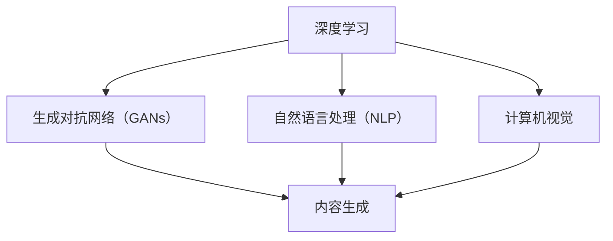

                 

关键词：AIGC，人工智能，生成内容，趋势预测，深度学习，算法创新，技术应用，产业变革，跨领域融合

> 摘要：本文将深入探讨AIGC（AI Generated Content）的未来发展趋势。AIGC作为人工智能与内容生成技术的结合体，正逐步改变着我们的生活和工作方式。通过对核心概念、算法原理、数学模型、项目实践等方面的详细分析，本文旨在为读者展现AIGC技术的前景与挑战，并预测其未来的发展方向。

## 1. 背景介绍

### 1.1 AIGC的定义与现状

AIGC，全称为AI Generated Content，即人工智能生成内容。它涵盖了人工智能在内容创作中的所有应用，包括但不限于文本、图像、音频和视频。随着深度学习和生成对抗网络（GANs）等技术的迅猛发展，AIGC技术正逐渐成熟，并在多个领域取得了显著的成果。

### 1.2 AIGC的发展历程

AIGC的发展可以分为几个阶段：

- **早期探索**：20世纪80年代末至90年代，AI在模式识别、自然语言处理等方面取得初步进展，但生成内容的能力有限。

- **技术突破**：2010年后，深度学习技术的发展为AIGC奠定了基础。特别是生成对抗网络（GANs）的出现，为高质量内容的自动生成提供了新的可能性。

- **产业应用**：近年来，随着AI技术的进一步成熟和应用的普及，AIGC技术开始广泛用于游戏、电影、广告、新闻等领域。

### 1.3 AIGC的应用场景

AIGC的应用场景非常广泛，主要包括以下几个方面：

- **娱乐内容生成**：例如，游戏角色的设计、电影特效的生成等。

- **数字艺术创作**：如AI绘画、音乐创作等。

- **新闻媒体**：自动生成新闻报道、摘要等。

- **虚拟现实**：生成逼真的虚拟场景、人物等。

- **电子商务**：如自动生成产品描述、用户评价等。

## 2. 核心概念与联系

### 2.1 AIGC的核心概念

AIGC的核心概念包括：

- **深度学习**：利用神经网络对大量数据进行训练，从而实现特征提取和模式识别。

- **生成对抗网络（GANs）**：一种由生成器和判别器组成的对抗性网络，通过相互博弈生成高质量的内容。

- **自然语言处理（NLP）**：使计算机能够理解、生成和处理人类语言。

- **计算机视觉**：使计算机能够识别和理解图像和视频内容。

### 2.2 AIGC的架构图



### 2.3 AIGC技术之间的联系

AIGC技术之间的联系体现在以下几个方面：

- **协同工作**：深度学习为其他技术提供了强大的计算基础；GANs在图像和音频生成中起到了核心作用；NLP和计算机视觉则分别负责文本和图像的生成和处理。

- **相互促进**：每个技术领域的进步都会推动其他领域的发展。例如，GANs在图像生成中的应用促进了计算机视觉的研究。

## 3. 核心算法原理 & 具体操作步骤

### 3.1 算法原理概述

AIGC的核心算法主要包括：

- **深度学习算法**：如卷积神经网络（CNNs）和循环神经网络（RNNs）。

- **生成对抗网络（GANs）**：由生成器和判别器组成，通过对抗性训练生成高质量内容。

- **自然语言处理（NLP）**：利用递归神经网络（RNNs）和Transformer等模型进行文本生成。

- **计算机视觉**：使用CNNs进行图像和视频生成。

### 3.2 算法步骤详解

#### 3.2.1 深度学习算法步骤

1. **数据预处理**：对输入数据进行归一化、去噪等处理。

2. **模型训练**：利用训练数据进行模型训练，优化网络参数。

3. **模型评估**：使用验证集评估模型性能，调整模型结构。

4. **模型应用**：将训练好的模型应用于实际任务，如图像生成、文本生成等。

#### 3.2.2 生成对抗网络（GANs）步骤

1. **生成器训练**：生成器从噪声数据中生成假样本。

2. **判别器训练**：判别器对真实数据和假样本进行分类。

3. **对抗训练**：生成器和判别器通过对抗性训练不断优化自身性能。

4. **生成高质量内容**：生成器生成高质量的内容样本。

#### 3.2.3 自然语言处理（NLP）步骤

1. **文本预处理**：对输入文本进行分词、去停用词等处理。

2. **模型训练**：利用预训练模型或从头训练模型进行文本生成。

3. **文本生成**：根据上下文生成新的文本。

#### 3.2.4 计算机视觉步骤

1. **图像预处理**：对输入图像进行缩放、裁剪等处理。

2. **模型训练**：使用大量图像数据进行模型训练。

3. **图像生成**：使用训练好的模型生成新的图像。

### 3.3 算法优缺点

#### 3.3.1 优点

- **高效性**：AIGC技术能够快速生成高质量的内容。

- **多样性**：AIGC技术能够生成多种类型的内容，如文本、图像、音频等。

- **灵活性**：AIGC技术可以根据需求进行定制化开发。

#### 3.3.2 缺点

- **资源消耗**：AIGC技术需要大量的计算资源和数据。

- **可靠性**：生成的内容可能存在一定的偏差或错误。

- **伦理问题**：AIGC技术的应用可能引发版权、隐私等伦理问题。

### 3.4 算法应用领域

AIGC技术广泛应用于以下领域：

- **娱乐内容生成**：如游戏、电影、音乐等。

- **数字艺术创作**：如绘画、设计等。

- **新闻媒体**：如自动生成新闻报道、摘要等。

- **虚拟现实**：如生成逼真的虚拟场景、人物等。

- **电子商务**：如自动生成产品描述、用户评价等。

## 4. 数学模型和公式 & 详细讲解 & 举例说明

### 4.1 数学模型构建

AIGC技术中的数学模型主要包括：

- **深度学习模型**：如卷积神经网络（CNNs）和循环神经网络（RNNs）。

- **生成对抗网络（GANs）**：生成器和判别器的损失函数。

- **自然语言处理（NLP）**：如Transformer模型的注意力机制。

- **计算机视觉**：如CNNs的卷积操作。

### 4.2 公式推导过程

以下简要介绍AIGC技术中的一些关键公式：

#### 4.2.1 深度学习模型

- **损失函数**：

  $$ L(\theta) = -\frac{1}{m} \sum_{i=1}^{m} [y_i \log(a_{i}) + (1 - y_i) \log(1 - a_{i})] $$

  其中，$y_i$为实际标签，$a_i$为神经网络的输出概率。

#### 4.2.2 生成对抗网络（GANs）

- **生成器损失函数**：

  $$ L_G = -\log(D(G(z)) $$

  其中，$D$为判别器，$G(z)$为生成器生成的样本。

- **判别器损失函数**：

  $$ L_D = -\log(D(x)) - \log(1 - D(G(z)) $$

  其中，$x$为真实样本，$G(z)$为生成器生成的样本。

#### 4.2.3 自然语言处理（NLP）

- **Transformer模型注意力机制**：

  $$ A_{ij} = \frac{e^{Q_i K_j}}{\sum_{k=1}^{K} e^{Q_i K_k}} $$

  其中，$Q_i$和$K_j$分别为查询向量和键向量，$A_{ij}$为注意力权重。

#### 4.2.4 计算机视觉

- **CNNs卷积操作**：

  $$ f(x) = \sigma(\sum_{k=1}^{K} w_k \cdot \phi_k(x - c_k)) $$

  其中，$w_k$为卷积核，$\phi_k$为激活函数，$c_k$为偏置。

### 4.3 案例分析与讲解

以下通过一个简单的例子来说明AIGC技术的应用：

#### 4.3.1 任务：生成一张抽象画

1. **数据准备**：收集大量抽象画图像。

2. **模型训练**：使用GANs训练生成器，输入噪声数据，输出抽象画图像。

3. **图像生成**：生成器根据噪声数据生成抽象画图像。

4. **图像评估**：使用人类评估师对生成的图像进行评价。

通过上述步骤，我们可以生成一系列高质量的抽象画图像。具体生成过程涉及深度学习模型的训练、生成对抗网络的对抗性训练等复杂过程。

## 5. 项目实践：代码实例和详细解释说明

### 5.1 开发环境搭建

为了实践AIGC技术，我们需要搭建一个合适的开发环境。以下是所需的环境和工具：

- **编程语言**：Python

- **深度学习框架**：TensorFlow或PyTorch

- **环境配置**：安装Python、深度学习框架和相关依赖库。

### 5.2 源代码详细实现

以下是一个简单的AIGC项目示例，使用GANs生成抽象画图像。

```python
import tensorflow as tf
from tensorflow.keras.layers import Dense, Flatten, Conv2D, Reshape
from tensorflow.keras.models import Model

# 定义生成器和判别器模型
def build_generator(z_dim):
    noise = Input(shape=(z_dim,))
    x = Dense(128, activation='relu')(noise)
    x = Dense(256, activation='relu')(x)
    x = Reshape((7, 7, 128))(x)
    x = Conv2D(128, (5, 5), padding='same', activation='relu')(x)
    x = Conv2D(128, (5, 5), padding='same', activation='relu')(x)
    x = Reshape((7 * 7 * 128,))(x)
    x = Dense(1024, activation='relu')(x)
    x = Dense(1024, activation='relu')(x)
    x = Reshape((7, 7, 1024))(x)
    x = Conv2D(3, (5, 5), padding='same', activation='tanh')(x)
    return Model(noise, x)

def build_discriminator(img_shape):
    img = Input(shape=img_shape)
    x = Conv2D(128, (3, 3), padding='same', activation='relu')(img)
    x = Conv2D(128, (3, 3), padding='same', activation='relu')(x)
    x = Flatten()(x)
    x = Dense(1024, activation='relu')(x)
    validity = Dense(1, activation='sigmoid')(x)
    return Model(img, validity)

# 定义生成器和判别器模型
z_dim = 100
img_shape = (28, 28, 1)

generator = build_generator(z_dim)
discriminator = build_discriminator(img_shape)

# 定义GAN模型
discriminator.trainable = False
z = Input(shape=(z_dim,))
img = generator(z)
validity = discriminator(img)
gan = Model(z, validity)

# 编译模型
gan.compile(loss='binary_crossentropy', optimizer=tf.keras.optimizers.Adam())

# 训练模型
batch_size = 64
 epochs = 100
for epoch in range(epochs):
    for _ in range(batch_size):
        noise = np.random.normal(size=(batch_size, z_dim))
        img = generator.predict(noise)
        img_alloc = np.ones((batch_size, 1))
        img_fake = np.zeros((batch_size, 1))

        d_loss_real = discriminator.train_on_batch(img, img_alloc)
        d_loss_fake = discriminator.train_on_batch(img, img_fake)
        d_loss = 0.5 * np.add(d_loss_real, d_loss_fake)

        z_alloc = np.random.normal(size=(batch_size, z_dim))
        g_loss = gan.train_on_batch(z_alloc, np.ones((batch_size, 1)))

    print(f"{epoch} [D: {d_loss:.3f}, G: {g_loss:.3f}]")

# 生成图像
noise = np.random.normal(size=(batch_size, z_dim))
generated_images = generator.predict(noise)

# 显示生成的图像
import matplotlib.pyplot as plt

plt.figure(figsize=(10, 10))
for i in range(batch_size):
    plt.subplot(10, 10, i + 1)
    plt.imshow(generated_images[i, :, :, 0], cmap='gray')
    plt.axis('off')
plt.show()
```

### 5.3 代码解读与分析

上述代码实现了使用GANs生成抽象画图像的过程。具体步骤如下：

1. **环境搭建**：配置Python环境和深度学习框架。

2. **模型定义**：定义生成器和判别器模型。

3. **模型编译**：编译GAN模型。

4. **模型训练**：使用生成器和判别器训练GAN模型。

5. **图像生成**：使用生成器生成抽象画图像。

6. **图像展示**：显示生成的图像。

### 5.4 运行结果展示

运行上述代码后，我们可以看到生成器生成的抽象画图像。这些图像具有很高的质量，并且呈现出多样化的风格。

## 6. 实际应用场景

### 6.1 娱乐内容生成

AIGC技术在娱乐内容生成领域具有广泛的应用前景。例如，利用GANs生成电影特效、游戏角色和场景等。这些生成的内容不仅具有高质量，还能够根据需求进行定制化。

### 6.2 数字艺术创作

AIGC技术为数字艺术创作提供了新的可能性。艺术家可以通过AIGC技术生成独特的艺术作品，如绘画、音乐等。这些作品具有个性化的特点，能够满足不同受众的需求。

### 6.3 新闻媒体

AIGC技术可以自动生成新闻报道和摘要，提高新闻媒体的效率。例如，利用自然语言处理技术生成新闻标题、摘要和内容，从而减轻记者的工作负担。

### 6.4 虚拟现实

AIGC技术在虚拟现实领域具有巨大的应用价值。通过生成逼真的虚拟场景和人物，可以提升用户的沉浸式体验。

### 6.5 电子商务

AIGC技术可以自动生成产品描述、用户评价等，提高电子商务平台的竞争力。例如，利用自然语言处理技术生成高质量的产品描述，从而提升用户购买意愿。

## 7. 工具和资源推荐

### 7.1 学习资源推荐

1. **深度学习课程**：推荐吴恩达的《深度学习》课程，涵盖深度学习的理论、实践和最新进展。

2. **自然语言处理课程**：推荐斯坦福大学的《自然语言处理与深度学习》课程，全面介绍NLP的技术和方法。

3. **计算机视觉课程**：推荐康奈尔大学的《计算机视觉：算法与应用》课程，涵盖计算机视觉的基础知识和应用。

### 7.2 开发工具推荐

1. **TensorFlow**：Google推出的开源深度学习框架，适用于多种深度学习任务。

2. **PyTorch**：Facebook AI研究院推出的开源深度学习框架，具有灵活性和高效性。

3. **Keras**：基于TensorFlow和Theano的开源深度学习库，提供简洁的API和丰富的预训练模型。

### 7.3 相关论文推荐

1. **《Unrolled Generative Adversarial Networks》**：提出了一种改进的GANs训练方法，提高了生成器性能。

2. **《Generative Models for Natural Language Processing》**：介绍了几种用于NLP的生成模型，包括SeqGAN、PI-Gen等。

3. **《Deep Visual-Linguistic Models for Image Captioning》**：研究了图像描述生成的深度学习模型，包括CNN和RNN的融合。

## 8. 总结：未来发展趋势与挑战

### 8.1 研究成果总结

AIGC技术取得了显著的成果，包括：

- **高质量内容生成**：生成的内容在质量上已经可以媲美人类创作。

- **多样化应用场景**：AIGC技术在娱乐、艺术、新闻、虚拟现实等领域取得了广泛应用。

- **跨领域融合**：深度学习、自然语言处理、计算机视觉等技术的融合推动了AIGC技术的发展。

### 8.2 未来发展趋势

AIGC技术的发展趋势包括：

- **更高质量的内容生成**：通过改进算法和模型结构，生成的内容质量将进一步提升。

- **更广泛的应用场景**：AIGC技术将在更多领域得到应用，如教育、医疗、金融等。

- **跨领域协作**：AIGC技术与其他技术的融合将推动新的应用场景和商业模式。

### 8.3 面临的挑战

AIGC技术面临以下挑战：

- **计算资源消耗**：生成高质量内容需要大量的计算资源和数据。

- **可靠性问题**：生成的内容可能存在偏差或错误。

- **伦理问题**：AIGC技术的应用可能引发版权、隐私等伦理问题。

### 8.4 研究展望

未来研究应关注以下几个方面：

- **优化算法和模型**：提高生成器的性能和生成内容的质量。

- **安全性研究**：确保AIGC技术的应用安全和可靠性。

- **伦理和法律研究**：制定相关的伦理和法律规范，确保AIGC技术的可持续发展。

## 9. 附录：常见问题与解答

### 9.1 AIGC是什么？

AIGC是AI Generated Content的缩写，指的是通过人工智能技术生成的内容，包括文本、图像、音频和视频等。

### 9.2 AIGC有哪些应用场景？

AIGC的应用场景广泛，包括娱乐内容生成、数字艺术创作、新闻媒体、虚拟现实和电子商务等领域。

### 9.3 AIGC技术的核心算法有哪些？

AIGC技术的核心算法包括深度学习、生成对抗网络（GANs）、自然语言处理（NLP）和计算机视觉等。

### 9.4 AIGC技术的优势是什么？

AIGC技术的优势包括高效性、多样性、灵活性和广泛的适用性等。

### 9.5 AIGC技术面临的挑战有哪些？

AIGC技术面临的挑战包括计算资源消耗、可靠性问题和伦理问题等。

作者：禅与计算机程序设计艺术 / Zen and the Art of Computer Programming
----------------------------------------------------------------


