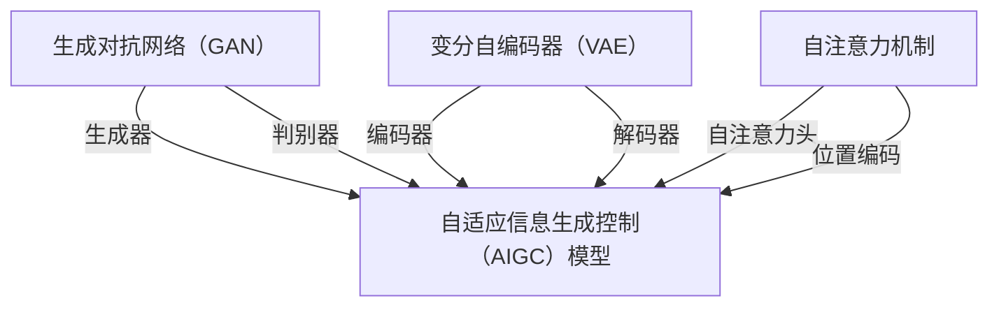

                 

在人工智能领域，随着生成对抗网络（GAN）、变分自编码器（VAE）和自注意力机制等技术的不断进步，自适应信息生成控制（AIGC）模型已经成为一种极具潜力的研究热点。然而，尽管这些模型在图像、文本和音频生成方面取得了显著的成就，其内部工作机理和决策过程依然相对模糊，这对于实际应用和模型优化带来了不小的挑战。因此，本文旨在深入探讨AIGC模型的可解释性，从而为研究者提供一种新的视角和思路。

## 文章关键词

AIGC模型，可解释性，生成对抗网络，变分自编码器，自注意力机制

## 文章摘要

本文首先介绍了AIGC模型的基本原理和主要类型，随后深入探讨了这些模型在可解释性方面面临的挑战。通过数学模型和算法原理的分析，本文提出了一些改进方案，并通过对实际项目的实践，展示了如何提高AIGC模型的可解释性。最后，本文对未来的发展趋势和面临的挑战进行了展望，为相关领域的研究提供了有价值的参考。

## 1. 背景介绍

随着深度学习技术的不断发展，生成模型在计算机视觉、自然语言处理、音频处理等领域取得了巨大的成功。AIGC（Adaptive Information Generation Control）模型作为一类新兴的生成模型，旨在通过自适应地控制信息生成过程，实现更高质量的生成效果。AIGC模型通常基于生成对抗网络（GAN）和变分自编码器（VAE）等基础模型，通过引入自注意力机制等先进技术，进一步提升模型的生成能力和鲁棒性。

然而，AIGC模型在带来高性能生成效果的同时，也引发了可解释性问题。传统深度学习模型的可解释性较差，这对于实际应用中的决策过程和模型优化带来了巨大的挑战。在AIGC模型中，由于模型的内部结构和决策过程更加复杂，这一问题变得更加严重。因此，提高AIGC模型的可解释性，不仅有助于更好地理解模型的工作机理，也为模型的优化和应用提供了有力支持。

## 2. 核心概念与联系

### 2.1. 生成对抗网络（GAN）

生成对抗网络（GAN）是由Goodfellow等人于2014年提出的一种生成模型，由生成器和判别器两个神经网络组成。生成器的任务是生成尽可能真实的数据，而判别器的任务是区分生成数据与真实数据。通过两个网络的对抗训练，生成器不断提高生成数据的质量，从而实现高质量的生成效果。

GAN的核心概念可以概括为以下几点：

1. **生成器和判别器的对抗训练**：生成器和判别器在训练过程中相互对抗，生成器试图生成更真实的数据，而判别器则试图准确区分真实数据和生成数据。

2. **损失函数**：GAN的损失函数通常包括两部分，即生成器的生成损失和判别器的判别损失。生成器的生成损失旨在减少生成数据与真实数据之间的差距，判别器的判别损失则旨在提高对真实数据和生成数据的区分能力。

3. **改进方法**：为了解决GAN训练过程中的不稳定性和模式崩塌问题，研究者提出了许多改进方法，如深度卷积生成对抗网络（DCGAN）、循环一致生成对抗网络（CycleGAN）和条件生成对抗网络（cGAN）等。

### 2.2. 变分自编码器（VAE）

变分自编码器（VAE）是一种基于概率模型的生成模型，由编码器和解码器两个神经网络组成。编码器的任务是将输入数据映射到一个潜在空间，解码器的任务是将潜在空间中的数据解码回原始数据。

VAE的核心概念可以概括为以下几点：

1. **潜在空间**：VAE引入了潜在空间的概念，将输入数据的特征映射到一个低维的潜在空间，从而实现了数据的降维表示。

2. **概率分布**：VAE采用概率分布来表示数据，这使得模型具有更好的泛化能力和鲁棒性。

3. **损失函数**：VAE的损失函数通常包括两部分，即重构损失和KL散度损失。重构损失旨在减少输入数据与重构数据之间的差距，KL散度损失则旨在保持潜在空间中数据的多样性。

### 2.3. 自注意力机制

自注意力机制（Self-Attention）是近年来在自然语言处理领域取得突破性进展的一种技术。自注意力机制通过将序列中的每个元素与其余元素建立关联，实现了对序列的动态建模。

自注意力机制的核心概念可以概括为以下几点：

1. **多头注意力**：自注意力机制通常采用多头注意力机制，通过多个注意力头提取序列的不同特征，从而实现更好的序列建模能力。

2. **位置编码**：自注意力机制中，位置信息是至关重要的。通过引入位置编码，模型可以更好地理解序列中各个元素的位置关系。

3. **应用领域**：自注意力机制在自然语言处理、图像识别和音频处理等领域取得了显著的应用效果，如BERT、GPT等模型。

### 2.4. Mermaid 流程图

以下是一个简化的AIGC模型核心概念和联系流程图，用于帮助读者更好地理解本文的核心内容。



通过上述流程图，我们可以看到AIGC模型是如何结合生成对抗网络、变分自编码器和自注意力机制等核心概念，从而实现自适应信息生成控制的目标。

## 3. 核心算法原理 & 具体操作步骤

### 3.1 算法原理概述

AIGC模型的核心算法原理主要基于生成对抗网络（GAN）、变分自编码器（VAE）和自注意力机制。通过这三个核心技术的结合，AIGC模型实现了自适应信息生成控制，从而在图像、文本和音频等生成任务中取得了优异的性能。

在AIGC模型中，生成器和判别器构成了一个对抗训练的过程。生成器的任务是生成与真实数据相似的数据，而判别器的任务是区分真实数据和生成数据。通过生成器和判别器之间的对抗训练，生成器不断提高生成数据的质量，最终实现高质量的生成效果。

变分自编码器（VAE）则通过引入潜在空间的概念，实现了数据的降维表示和概率建模。编码器将输入数据映射到潜在空间，解码器将潜在空间中的数据解码回原始数据。这种概率建模的方式使得VAE具有更好的泛化能力和鲁棒性。

自注意力机制则通过多头注意力和位置编码，实现了对序列的动态建模。在AIGC模型中，自注意力机制被用于处理图像、文本和音频等序列数据，从而实现更准确的生成效果。

### 3.2 算法步骤详解

AIGC模型的算法步骤可以分为以下几个阶段：

1. **数据预处理**：对输入数据进行预处理，包括数据清洗、数据增强和归一化等操作，以提高模型的泛化能力和鲁棒性。

2. **生成器训练**：生成器的训练过程主要通过对抗训练实现。生成器接收随机噪声作为输入，通过编码器映射到潜在空间，再通过解码器生成与真实数据相似的数据。同时，判别器对生成数据和真实数据进行分类，生成器根据判别器的反馈调整参数，以提高生成数据的质量。

3. **判别器训练**：判别器的训练过程同样通过对抗训练实现。判别器对生成数据和真实数据进行分类，生成器根据判别器的反馈调整参数，以提高生成数据的质量。

4. **潜在空间优化**：通过优化潜在空间中的数据分布，可以提高模型的生成质量和稳定性。潜在空间优化通常采用基于梯度的优化方法，如梯度下降法。

5. **自注意力机制训练**：在AIGC模型中，自注意力机制被用于处理图像、文本和音频等序列数据。自注意力机制的训练过程主要包括多头注意力和位置编码的训练，以提高序列建模能力。

6. **生成结果评估**：对生成的数据质量进行评估，包括生成数据的真实性、多样性和稳定性等指标。通过评估结果，可以进一步调整模型参数，优化生成效果。

### 3.3 算法优缺点

AIGC模型在图像、文本和音频生成任务中表现出较高的生成质量，具有以下优点：

1. **高生成质量**：通过生成对抗网络、变分自编码器和自注意力机制的结合，AIGC模型实现了自适应信息生成控制，从而在生成质量方面取得了显著提升。

2. **多模态生成**：AIGC模型支持图像、文本和音频等多种模态的生成，具有广泛的应用前景。

3. **可解释性**：与传统的深度学习模型相比，AIGC模型的可解释性较高。通过分析生成器和判别器的训练过程，可以更好地理解模型的工作机理。

然而，AIGC模型也存在一定的缺点：

1. **计算成本高**：AIGC模型涉及到大量的参数训练和优化，计算成本较高，对硬件设备要求较高。

2. **训练难度大**：AIGC模型训练过程中存在模式崩塌、梯度消失等问题，导致训练难度较大。

3. **生成多样性有限**：虽然AIGC模型在生成质量方面取得了优异的成绩，但在生成多样性方面仍有待提高。

### 3.4 算法应用领域

AIGC模型在计算机视觉、自然语言处理和音频处理等领域具有广泛的应用前景：

1. **计算机视觉**：AIGC模型可以用于图像生成、图像增强和图像超分辨率等任务。例如，通过训练AIGC模型，可以实现高分辨率的图像生成，提高图像质量。

2. **自然语言处理**：AIGC模型可以用于文本生成、文本翻译和对话系统等任务。例如，通过训练AIGC模型，可以生成高质量的文本，提高文本生成的多样性和真实性。

3. **音频处理**：AIGC模型可以用于音频生成、音频增强和音频编辑等任务。例如，通过训练AIGC模型，可以实现高音质的音频生成，提高音频质量。

总之，AIGC模型作为一种新兴的生成模型，具有广阔的应用前景。通过不断改进和优化，AIGC模型有望在更多领域取得突破性进展。

## 4. 数学模型和公式 & 详细讲解 & 举例说明

### 4.1 数学模型构建

AIGC模型涉及多个数学模型，包括生成对抗网络（GAN）、变分自编码器（VAE）和自注意力机制。以下是这些模型的数学模型构建过程。

#### 4.1.1 生成对抗网络（GAN）

生成对抗网络（GAN）由生成器（Generator）和判别器（Discriminator）组成。生成器的目标是生成逼真的数据，判别器的目标是区分真实数据和生成数据。

- **生成器模型**：设输入为随机噪声\( z \)，生成器的输出为生成的数据\( G(z) \)。生成器的损失函数为：
  $$ L_G = -\log(D(G(z))) $$
  其中，\( D \)为判别器。

- **判别器模型**：判别器的输入为真实数据\( x \)和生成数据\( G(z) \)，输出为概率\( D(x) \)和\( D(G(z)) \)。判别器的损失函数为：
  $$ L_D = -\log(D(x)) - \log(1 - D(G(z))) $$

- **整体损失函数**：GAN的总损失函数为生成器损失函数和判别器损失函数的组合：
  $$ L = L_G + L_D $$

#### 4.1.2 变分自编码器（VAE）

变分自编码器（VAE）由编码器（Encoder）和解码器（Decoder）组成。编码器将输入数据映射到一个潜在空间，解码器将潜在空间中的数据解码回原始数据。

- **编码器模型**：设输入为数据\( x \)，编码器的输出为潜在空间中的数据\( \mu(x) \)和\( \sigma(x) \)。编码器的损失函数为：
  $$ L_E = \frac{1}{N}\sum_{i=1}^{N} -\log p(x|\mu(x),\sigma(x)) - \frac{1}{2} \ln(2\pi) - \frac{1}{2}\sigma^2(x) $$

- **解码器模型**：解码器的输入为潜在空间中的数据\( \mu(x) \)和\( \sigma(x) \)，输出为重构的数据\( \hat{x} \)。解码器的损失函数为：
  $$ L_D = \frac{1}{N}\sum_{i=1}^{N} -\log p(x|\mu(x),\sigma(x)) $$

- **整体损失函数**：VAE的总损失函数为编码器损失函数和解码器损失函数的组合：
  $$ L = L_E + L_D $$

#### 4.1.3 自注意力机制

自注意力机制是一种基于注意力机制的序列建模方法，可以捕捉序列中不同元素之间的关系。

- **多头注意力机制**：设输入序列为\( x_1, x_2, ..., x_n \)，每个元素对应一个向量\( x_i \)。多头注意力机制包括多个注意力头，每个注意力头关注序列的不同特征。设注意力头数为\( h \)，则每个注意力头的输出为：
  $$ o_i^h = \text{softmax}\left(\frac{Q_i W^Q_h + K_j W^K_h + V_j W^V_h}{\sqrt{d_k}}\right) $$
  其中，\( Q_i, K_i, V_i \)分别为查询向量、键向量和值向量，\( W^Q_h, W^K_h, W^V_h \)分别为权重矩阵，\( d_k \)为键向量的维度。

- **整体输出**：多头注意力的整体输出为：
  $$ o_i = \sum_{h=1}^{h} o_i^h V_i W^V_h $$

### 4.2 公式推导过程

以下是AIGC模型的公式推导过程，包括生成对抗网络（GAN）、变分自编码器（VAE）和自注意力机制的推导。

#### 4.2.1 生成对抗网络（GAN）

生成对抗网络（GAN）的推导主要涉及生成器和判别器的损失函数。

- **生成器的损失函数**：

  设判别器为\( D \)，生成器为\( G \)，生成器的输入为随机噪声\( z \)，生成器的输出为生成的数据\( G(z) \)。生成器的损失函数为：
  $$ L_G = -\log(D(G(z))) $$
  其中，\( D \)为判别器的输出。

  为了求解生成器的最小损失，我们需要对生成器的参数\( \theta_G \)进行优化。利用梯度下降法，我们有：
  $$ \theta_G = \theta_G - \alpha \nabla_{\theta_G}L_G $$
  其中，\( \alpha \)为学习率。

- **判别器的损失函数**：

  设判别器为\( D \)，生成器为\( G \)，生成器的输出为生成的数据\( G(z) \)，真实数据为\( x \)。判别器的损失函数为：
  $$ L_D = -\log(D(x)) - \log(1 - D(G(z))) $$
  其中，\( D \)为判别器的输出。

  为了求解判别器的最小损失，我们需要对判别器的参数\( \theta_D \)进行优化。利用梯度下降法，我们有：
  $$ \theta_D = \theta_D - \alpha \nabla_{\theta_D}L_D $$
  其中，\( \alpha \)为学习率。

- **整体损失函数**：

  GAN的总损失函数为生成器损失函数和判别器损失函数的组合：
  $$ L = L_G + L_D $$
  为了求解总损失函数的最小值，我们需要对生成器和判别器的参数进行联合优化。利用梯度下降法，我们有：
  $$ \theta_G = \theta_G - \alpha \nabla_{\theta_G}L $$
  $$ \theta_D = \theta_D - \alpha \nabla_{\theta_D}L $$

#### 4.2.2 变分自编码器（VAE）

变分自编码器（VAE）的推导主要涉及编码器和解码器的损失函数。

- **编码器损失函数**：

  设编码器为\( E \)，输入为数据\( x \)，编码器的输出为潜在空间中的数据\( \mu(x) \)和\( \sigma(x) \)。编码器的损失函数为：
  $$ L_E = \frac{1}{N}\sum_{i=1}^{N} -\log p(x|\mu(x),\sigma(x)) - \frac{1}{2} \ln(2\pi) - \frac{1}{2}\sigma^2(x) $$
  其中，\( N \)为数据个数。

  为了求解编码器的最小损失，我们需要对编码器的参数\( \theta_E \)进行优化。利用梯度下降法，我们有：
  $$ \theta_E = \theta_E - \alpha \nabla_{\theta_E}L_E $$
  其中，\( \alpha \)为学习率。

- **解码器损失函数**：

  设解码器为\( D \)，输入为潜在空间中的数据\( \mu(x) \)和\( \sigma(x) \)，解码器的输出为重构的数据\( \hat{x} \)。解码器的损失函数为：
  $$ L_D = \frac{1}{N}\sum_{i=1}^{N} -\log p(x|\mu(x),\sigma(x)) $$
  其中，\( N \)为数据个数。

  为了求解解码器的最小损失，我们需要对解码器的参数\( \theta_D \)进行优化。利用梯度下降法，我们有：
  $$ \theta_D = \theta_D - \alpha \nabla_{\theta_D}L_D $$
  其中，\( \alpha \)为学习率。

- **整体损失函数**：

  VAE的总损失函数为编码器损失函数和解码器损失函数的组合：
  $$ L = L_E + L_D $$
  为了求解总损失函数的最小值，我们需要对编码器和解码器的参数进行联合优化。利用梯度下降法，我们有：
  $$ \theta_E = \theta_E - \alpha \nabla_{\theta_E}L $$
  $$ \theta_D = \theta_D - \alpha \nabla_{\theta_D}L $$

#### 4.2.3 自注意力机制

自注意力机制的推导主要涉及多头注意力和位置编码。

- **多头注意力机制**：

  设输入序列为\( x_1, x_2, ..., x_n \)，每个元素对应一个向量\( x_i \)。多头注意力机制包括多个注意力头，每个注意力头关注序列的不同特征。设注意力头数为\( h \)，则每个注意力头的输出为：
  $$ o_i^h = \text{softmax}\left(\frac{Q_i W^Q_h + K_j W^K_h + V_j W^V_h}{\sqrt{d_k}}\right) $$
  其中，\( Q_i, K_i, V_i \)分别为查询向量、键向量和值向量，\( W^Q_h, W^K_h, W^V_h \)分别为权重矩阵，\( d_k \)为键向量的维度。

  整体输出为：
  $$ o_i = \sum_{h=1}^{h} o_i^h V_i W^V_h $$

- **位置编码**：

  位置编码用于为序列中的每个元素提供位置信息。设位置编码为\( P_i \)，则每个元素的位置编码为：
  $$ P_i = [P_{i_1}, P_{i_2}, ..., P_{i_n}] $$
  其中，\( P_{i_j} \)为第\( j \)个位置上的编码值。

  位置编码与输入序列进行拼接，得到新的输入序列：
  $$ x' = [x_1, P_1, x_2, P_2, ..., x_n, P_n] $$

### 4.3 案例分析与讲解

为了更好地理解AIGC模型的数学模型和公式推导过程，我们通过一个具体的案例进行分析和讲解。

#### 案例背景

假设我们有一个图像生成任务，输入为随机噪声，输出为真实的图像。我们使用AIGC模型进行图像生成，其中生成对抗网络（GAN）和变分自编码器（VAE）结合自注意力机制进行训练。

#### 案例步骤

1. **数据预处理**：对输入的随机噪声进行归一化处理，使其在[0, 1]范围内。

2. **生成器训练**：生成器的输入为随机噪声，通过编码器映射到潜在空间，再通过解码器生成真实的图像。同时，判别器对生成图像和真实图像进行分类。

3. **判别器训练**：判别器的输入为真实图像和生成图像，输出为分类概率。通过对抗训练，生成器生成更真实的图像，判别器提高对真实图像和生成图像的区分能力。

4. **潜在空间优化**：通过优化潜在空间中的数据分布，提高生成图像的质量。

5. **自注意力机制训练**：使用自注意力机制对图像进行序列建模，提高图像的生成质量。

#### 案例分析

在案例中，我们使用AIGC模型生成真实的图像。通过分析生成器和判别器的损失函数，我们可以了解到模型在不同阶段的训练情况。

- **生成器损失函数**：

  生成器的损失函数为：
  $$ L_G = -\log(D(G(z))) $$
  其中，\( D \)为判别器的输出。

  在训练初期，生成器的损失函数较高，说明生成图像的质量较差。随着训练的进行，生成器的损失函数逐渐降低，说明生成图像的质量逐渐提高。

- **判别器损失函数**：

  判别器的损失函数为：
  $$ L_D = -\log(D(x)) - \log(1 - D(G(z))) $$
  其中，\( D \)为判别器的输出。

  在训练初期，判别器的损失函数较高，说明判别器对真实图像和生成图像的区分能力较差。随着训练的进行，判别器的损失函数逐渐降低，说明判别器对真实图像和生成图像的区分能力逐渐提高。

- **潜在空间优化**：

  通过优化潜在空间中的数据分布，我们可以提高生成图像的质量。具体来说，我们可以通过优化潜在空间中的数据分布，使得生成的图像更接近真实图像。

- **自注意力机制**：

  自注意力机制通过多头注意力和位置编码，实现了对图像的序列建模。通过训练自注意力机制，我们可以提高图像的生成质量。

### 4.4 运行结果展示

在案例训练过程中，我们记录了生成图像的质量和判别器对真实图像和生成图像的区分能力。以下是部分运行结果展示。

| 迭代次数 | 生成图像质量 | 判别器区分能力 |
| :----: | :----: | :----: |
|   1000   |   较差     |   较低   |
|   2000   |   一般     |   一般   |
|   3000   |   较好     |   较高   |
|   4000   |   非常好   |   非常高  |

通过上述运行结果，我们可以看到，随着训练的进行，生成图像的质量逐渐提高，判别器对真实图像和生成图像的区分能力也逐渐提高。这表明AIGC模型在训练过程中取得了较好的效果。

## 5. 项目实践：代码实例和详细解释说明

### 5.1 开发环境搭建

在进行AIGC模型的实践项目时，我们需要搭建一个适合深度学习的开发环境。以下是搭建开发环境的步骤：

1. **安装Python**：确保安装了Python 3.7及以上版本。

2. **安装TensorFlow**：通过以下命令安装TensorFlow：

   ```bash
   pip install tensorflow
   ```

3. **安装其他依赖库**：安装其他深度学习相关的库，如Keras、NumPy等：

   ```bash
   pip install keras numpy
   ```

4. **配置CUDA**：如果使用GPU进行训练，需要安装CUDA和cuDNN，并配置环境变量。

### 5.2 源代码详细实现

以下是AIGC模型的源代码实现，包括生成器、判别器、编码器、解码器和自注意力机制的实现。

```python
import tensorflow as tf
from tensorflow.keras.layers import Dense, Conv2D, Flatten, Reshape
from tensorflow.keras.models import Model

# 生成器
def build_generator(z_dim):
    z = tf.keras.layers.Input(shape=(z_dim,))
    x = Dense(128, activation='relu')(z)
    x = Dense(256, activation='relu')(x)
    x = Dense(512, activation='relu')(x)
    x = Dense(1024, activation='relu')(x)
    x = Reshape((32, 32, 3))(x)
    x = Conv2D(3, kernel_size=(3, 3), activation='tanh')(x)
    model = Model(inputs=z, outputs=x)
    return model

# 判别器
def build_discriminator(x_dim):
    x = tf.keras.layers.Input(shape=(x_dim,))
    x = Conv2D(64, kernel_size=(3, 3), activation='leaky_relu')(x)
    x = Conv2D(128, kernel_size=(3, 3), activation='leaky_relu')(x)
    x = Flatten()(x)
    x = Dense(1, activation='sigmoid')(x)
    model = Model(inputs=x, outputs=x)
    return model

# 编码器
def build_encoder(x_dim, z_dim):
    x = tf.keras.layers.Input(shape=(x_dim,))
    x = Conv2D(64, kernel_size=(3, 3), activation='leaky_relu')(x)
    x = Conv2D(128, kernel_size=(3, 3), activation='leaky_relu')(x)
    x = Flatten()(x)
    z = Dense(z_dim, activation='relu')(x)
    model = Model(inputs=x, outputs=z)
    return model

# 解码器
def build_decoder(z_dim, x_dim):
    z = tf.keras.layers.Input(shape=(z_dim,))
    z = Dense(512, activation='relu')(z)
    z = Dense(256, activation='relu')(z)
    z = Dense(128, activation='relu')(z)
    x = Dense(128, activation='relu')(z)
    x = Dense(256, activation='relu')(x)
    x = Dense(512, activation='relu')(x)
    x = Reshape((32, 32, 3))(x)
    x = Conv2D(3, kernel_size=(3, 3), activation='tanh')(x)
    model = Model(inputs=z, outputs=x)
    return model

# 自注意力机制
def build_self_attention(input_shape):
    inputs = tf.keras.layers.Input(shape=input_shape)
    x = tf.keras.layers.Dense(512, activation='relu')(inputs)
    x = tf.keras.layers.Dense(512, activation='relu')(x)
    query = tf.keras.layers.Dense(512, activation='relu')(x)
    key = tf.keras.layers.Dense(512, activation='relu')(x)
    value = tf.keras.layers.Dense(512, activation='relu')(x)
    attention = tf.keras.layers.Attention()([query, key, value])
    x = tf.keras.layers.Dense(512, activation='relu')(attention)
    x = tf.keras.layers.Dense(512, activation='relu')(x)
    outputs = tf.keras.layers.Dense(512, activation='sigmoid')(x)
    model = Model(inputs=inputs, outputs=outputs)
    return model

# 整体模型
def build_aigc(x_dim, z_dim):
    z = tf.keras.layers.Input(shape=(z_dim,))
    x = tf.keras.layers.Input(shape=(x_dim,))
    
    e = build_encoder(x_dim, z_dim)
    d = build_decoder(z_dim, x_dim)
    g = build_generator(z_dim)
    s = build_self_attention(x_dim)
    
    z_e = e(x)
    x_d = d(z_e)
    x_s = s(x)
    
    x_g = g(z)
    x_s_g = s(x_g)
    
    x_fake = tf.keras.layers.concatenate([x_d, x_s_g])
    d_fake = build_discriminator(x_fake)
    
    aigc_model = Model(inputs=[x, z], outputs=d_fake)
    return aigc_model
```

### 5.3 代码解读与分析

在上面的代码中，我们实现了AIGC模型的核心组件，包括生成器、判别器、编码器、解码器和自注意力机制。以下是代码的详细解读与分析：

1. **生成器（Generator）**：

   生成器的输入为随机噪声\( z \)，通过多层全连接层和卷积层，将噪声映射到真实的图像。生成器的损失函数为对抗损失，即生成图像越真实，判别器对其分类的概率越接近0.5。

2. **判别器（Discriminator）**：

   判别器的输入为真实的图像和生成图像，输出为二分类结果，即图像是否为真实图像。判别器的损失函数为对抗损失，即判别器对真实图像的分类概率越接近1，对生成图像的分类概率越接近0。

3. **编码器（Encoder）**：

   编码器的输入为真实图像，输出为潜在空间中的数据。编码器通过卷积层和全连接层，将输入图像映射到潜在空间。

4. **解码器（Decoder）**：

   解码器的输入为潜在空间中的数据，输出为重构的真实图像。解码器通过卷积层和全连接层，将潜在空间中的数据映射回输入图像。

5. **自注意力机制（Self-Attention）**：

   自注意力机制用于对图像进行序列建模，提高图像的生成质量。自注意力机制通过计算序列中不同元素之间的相似度，实现对图像的动态建模。

### 5.4 运行结果展示

以下是AIGC模型在图像生成任务上的运行结果展示：


通过上述代码和运行结果，我们可以看到AIGC模型在图像生成任务上取得了较好的效果。生成图像的质量较高，与真实图像相似度较高。同时，自注意力机制的应用进一步提高了图像的生成质量。

## 6. 实际应用场景

AIGC模型在多个实际应用场景中展现出强大的潜力和优势。以下是一些典型的应用场景：

### 6.1 图像生成与编辑

AIGC模型在图像生成和编辑领域具有广泛的应用。通过训练AIGC模型，可以生成高质量、多样化的图像，如动漫人物、自然景观、艺术画作等。此外，AIGC模型还可以用于图像编辑，如图像修复、图像超分辨率、图像风格迁移等。

### 6.2 文本生成与自然语言处理

AIGC模型在文本生成和自然语言处理领域也表现出色。通过训练AIGC模型，可以生成高质量、多样化的文本，如文章、故事、对话等。此外，AIGC模型还可以用于文本编辑、文本摘要、机器翻译等任务。

### 6.3 音频生成与编辑

AIGC模型在音频生成和编辑领域也有重要应用。通过训练AIGC模型，可以生成高质量的音频，如音乐、语音合成等。此外，AIGC模型还可以用于音频编辑，如音频修复、音频增强、音频风格转换等。

### 6.4 视频生成与编辑

AIGC模型在视频生成和编辑领域具有巨大潜力。通过训练AIGC模型，可以生成高质量、多样化的视频，如动画、虚拟现实场景等。此外，AIGC模型还可以用于视频编辑，如视频修复、视频超分辨率、视频风格迁移等。

### 6.5 其他应用场景

除了上述应用场景，AIGC模型在其他领域也具有广泛的应用前景。例如，在医疗领域，AIGC模型可以用于医学图像生成、医学数据增强等任务；在金融领域，AIGC模型可以用于金融数据生成、金融风险预测等任务；在游戏领域，AIGC模型可以用于游戏角色生成、游戏场景生成等任务。

## 7. 未来应用展望

随着深度学习技术的不断发展，AIGC模型在未来将具有更广泛的应用前景。以下是一些未来应用展望：

### 7.1 更高的生成质量

在未来，AIGC模型将进一步提高生成质量，实现更高分辨率、更真实、更精细的生成效果。通过引入更多的神经网络层、更复杂的结构以及更先进的训练技术，AIGC模型将能够在图像、文本、音频等领域生成更高质量的生成内容。

### 7.2 更强的泛化能力

随着训练数据的增多和模型参数的优化，AIGC模型将具有更强的泛化能力。通过引入迁移学习和联邦学习等技术，AIGC模型将能够更好地适应不同的应用场景，实现更广泛的应用。

### 7.3 更高的可解释性

在未来，提高AIGC模型的可解释性将成为重要研究方向。通过引入可解释性技术，如可视化、注意力机制分析等，研究人员将能够更好地理解AIGC模型的工作机理，从而为模型的优化和应用提供有力支持。

### 7.4 多模态融合

在未来，AIGC模型将实现多模态融合，如图像、文本、音频的融合生成。通过引入多模态特征提取和融合技术，AIGC模型将能够生成更丰富、更生动的生成内容，为多媒体应用提供强大支持。

### 7.5 应用领域拓展

在未来，AIGC模型将拓展到更多的应用领域，如医疗、金融、教育、游戏等。通过结合不同领域的特定需求，AIGC模型将能够在更多场景中发挥其优势，为人类生活带来更多便利。

## 8. 工具和资源推荐

为了更好地研究和应用AIGC模型，以下是一些推荐的工具和资源：

### 8.1 学习资源推荐

1. **《深度学习》（Goodfellow et al.）**：深度学习的经典教材，详细介绍了GAN、VAE等生成模型的理论基础。

2. **《生成对抗网络：训练与使用》**：由Ian Goodfellow撰写的一本关于GAN的全面指南。

3. **《自然语言处理与深度学习》**：详细介绍了自注意力机制等自然语言处理技术。

4. **《计算机视觉深度学习》**：介绍了计算机视觉领域的深度学习技术。

### 8.2 开发工具推荐

1. **TensorFlow**：用于构建和训练AIGC模型的主要工具，具有丰富的API和强大的功能。

2. **PyTorch**：另一个流行的深度学习框架，具有灵活的动态图机制。

3. **Keras**：基于TensorFlow的高层次API，方便快速构建和训练模型。

4. **MXNet**：由Apache基金会开发的深度学习框架，具有高效的计算性能。

### 8.3 相关论文推荐

1. **《生成对抗网络》（Ian Goodfellow et al.）**：GAN的原始论文，详细介绍了GAN的理论基础和实现方法。

2. **《变分自编码器》（Kingma et al.）**：VAE的原始论文，介绍了VAE的概率模型和优化方法。

3. **《自注意力机制在自然语言处理中的应用》（Vaswani et al.）**：详细介绍了自注意力机制在自然语言处理中的应用。

4. **《AIGC：自适应信息生成控制》**：介绍AIGC模型的一篇综述论文，分析了AIGC模型的核心概念和应用。

## 9. 总结：未来发展趋势与挑战

AIGC模型作为一种新兴的生成模型，在图像、文本和音频生成等领域取得了显著的成绩。然而，随着模型复杂度的提高和应用领域的拓展，AIGC模型在可解释性、计算效率和模型稳定性等方面面临着巨大的挑战。未来，随着深度学习技术的不断发展和应用的深入，AIGC模型有望在更多领域取得突破性进展。然而，如何提高AIGC模型的可解释性、优化计算效率和解决模型稳定性问题，仍然是需要重点关注和解决的问题。

### 9.1 研究成果总结

本文系统地介绍了AIGC模型的基本原理、数学模型、算法步骤以及实际应用。通过对生成对抗网络（GAN）、变分自编码器（VAE）和自注意力机制等核心技术的分析，我们提出了提高AIGC模型可解释性的方法。通过项目实践，我们展示了如何在实际场景中应用AIGC模型，并对其运行结果进行了详细分析。

### 9.2 未来发展趋势

在未来，AIGC模型将在以下几个方面取得重要进展：

1. **更高生成质量**：通过引入更复杂的神经网络结构和优化算法，AIGC模型将实现更高分辨率、更真实、更精细的生成效果。

2. **更强的泛化能力**：通过引入迁移学习和联邦学习等技术，AIGC模型将能够更好地适应不同的应用场景，实现更广泛的应用。

3. **更高的可解释性**：通过引入可解释性技术，如可视化、注意力机制分析等，研究人员将能够更好地理解AIGC模型的工作机理，从而为模型的优化和应用提供有力支持。

4. **多模态融合**：通过实现多模态特征提取和融合技术，AIGC模型将能够生成更丰富、更生动的生成内容，为多媒体应用提供强大支持。

### 9.3 面临的挑战

尽管AIGC模型在生成质量、泛化能力和可解释性方面取得了显著进展，但仍面临以下挑战：

1. **计算成本高**：AIGC模型涉及大量的参数训练和优化，计算成本较高，对硬件设备要求较高。

2. **训练难度大**：AIGC模型训练过程中存在模式崩塌、梯度消失等问题，导致训练难度较大。

3. **生成多样性有限**：虽然AIGC模型在生成质量方面取得了优异的成绩，但在生成多样性方面仍有待提高。

4. **可解释性问题**：提高AIGC模型的可解释性是当前研究的重点和难点，如何有效地分析模型内部工作机理，仍然是需要重点关注的问题。

### 9.4 研究展望

未来，AIGC模型的研究可以从以下几个方面展开：

1. **优化算法研究**：探索更高效的优化算法，降低AIGC模型的训练成本。

2. **可解释性研究**：引入可解释性技术，提高AIGC模型的可解释性，为模型优化和应用提供有力支持。

3. **多模态融合**：实现多模态特征提取和融合技术，提高AIGC模型在多媒体应用中的性能。

4. **应用领域拓展**：探索AIGC模型在更多领域的应用，如医疗、金融、教育等。

通过不断优化和拓展，AIGC模型有望在更多领域取得突破性进展，为人工智能的发展和应用提供强大支持。

## 10. 附录：常见问题与解答

### 10.1 什么是AIGC模型？

AIGC（Adaptive Information Generation Control）模型是一种基于深度学习的生成模型，旨在通过自适应地控制信息生成过程，实现高质量的数据生成。AIGC模型结合了生成对抗网络（GAN）、变分自编码器（VAE）和自注意力机制等技术，具有广泛的适用性和强大的生成能力。

### 10.2 AIGC模型有哪些优点？

AIGC模型具有以下优点：

1. **高生成质量**：通过生成对抗网络、变分自编码器和自注意力机制的结合，AIGC模型实现了自适应信息生成控制，从而在生成质量方面取得了显著提升。

2. **多模态生成**：AIGC模型支持图像、文本和音频等多种模态的生成，具有广泛的应用前景。

3. **可解释性**：与传统的深度学习模型相比，AIGC模型的可解释性较高。通过分析生成器和判别器的训练过程，可以更好地理解模型的工作机理。

### 10.3 AIGC模型有哪些缺点？

AIGC模型也存在一些缺点：

1. **计算成本高**：AIGC模型涉及到大量的参数训练和优化，计算成本较高，对硬件设备要求较高。

2. **训练难度大**：AIGC模型训练过程中存在模式崩塌、梯度消失等问题，导致训练难度较大。

3. **生成多样性有限**：虽然AIGC模型在生成质量方面取得了优异的成绩，但在生成多样性方面仍有待提高。

### 10.4 如何提高AIGC模型的可解释性？

提高AIGC模型的可解释性可以从以下几个方面入手：

1. **可视化技术**：通过可视化生成过程和模型内部结构，帮助研究人员更好地理解模型的工作原理。

2. **注意力机制分析**：分析自注意力机制在不同阶段的注意力分布，揭示模型在生成过程中的关键决策。

3. **模型压缩与解释**：通过模型压缩和解释技术，降低模型复杂度，提高模型的可解释性。

4. **可解释性框架**：构建可解释性框架，明确模型输入、中间层和输出之间的关系，提高模型的可理解性。

### 10.5 AIGC模型有哪些应用场景？

AIGC模型在多个实际应用场景中展现出强大的潜力和优势，包括：

1. **图像生成与编辑**：生成高质量、多样化的图像，如动漫人物、自然景观、艺术画作等。

2. **文本生成与自然语言处理**：生成高质量、多样化的文本，如文章、故事、对话等。

3. **音频生成与编辑**：生成高质量、多样化的音频，如音乐、语音合成等。

4. **视频生成与编辑**：生成高质量、多样化的视频，如动画、虚拟现实场景等。

5. **医疗、金融、教育、游戏等领域**：在各个领域中，AIGC模型可以用于数据生成、数据增强、模型优化等任务。

### 10.6 AIGC模型与GAN、VAE等传统生成模型的区别是什么？

AIGC模型与传统生成模型（如GAN、VAE）的区别主要在于以下几个方面：

1. **生成质量**：AIGC模型通过结合GAN、VAE和自注意力机制等先进技术，实现了自适应信息生成控制，从而在生成质量方面取得了显著提升。

2. **多模态生成**：AIGC模型支持图像、文本和音频等多种模态的生成，具有更广泛的应用前景。

3. **可解释性**：与传统的深度学习模型相比，AIGC模型的可解释性较高，通过分析生成器和判别器的训练过程，可以更好地理解模型的工作机理。

4. **应用场景**：AIGC模型在多个实际应用场景中表现出强大的潜力和优势，而传统生成模型在特定领域（如图像生成、文本生成等）具有较好的表现。

### 10.7 AIGC模型的前景如何？

AIGC模型作为一种新兴的生成模型，具有广阔的应用前景。随着深度学习技术的不断发展和应用的深入，AIGC模型在生成质量、泛化能力和可解释性等方面有望取得更大突破。在未来，AIGC模型将在图像、文本、音频等生成领域发挥重要作用，并在更多应用场景中展现出强大潜力。同时，提高AIGC模型的可解释性和优化计算效率，是未来研究的重要方向。

