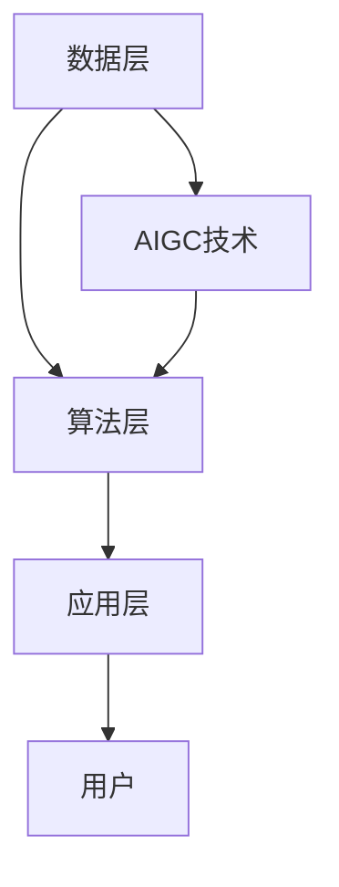
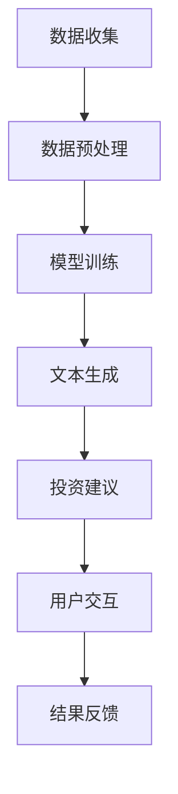

                 

关键词：AIGC、智能投顾服务、人工智能、金融服务、深度学习、算法优化、区块链技术、用户个性化体验

## 摘要

本文将探讨如何利用先进的AIGC（人工智能生成内容）技术，赋能智能投顾服务，提升金融服务行业的智能化水平。文章首先介绍了AIGC技术的基本概念和原理，随后详细阐述了其在智能投顾服务中的应用。通过案例分析和实践实例，展示了AIGC技术如何优化智能投顾服务流程，提高投资决策的准确性和用户体验。最后，本文对AIGC赋能智能投顾服务的未来发展趋势和面临的挑战进行了深入分析，为行业提供前瞻性的研究和参考。

## 1. 背景介绍

### 1.1 智能投顾服务的现状

智能投顾服务作为金融科技领域的重要创新，近年来在全球范围内迅速发展。智能投顾通过使用大数据、人工智能等技术，为用户提供个性化、智能化的投资建议和资产管理服务。传统的金融顾问服务通常依赖于专业人员的经验和判断，而智能投顾则能够基于海量数据和历史分析，提供更加精准和高效的决策支持。

然而，尽管智能投顾服务在某些方面已经取得了显著成果，但仍面临一些挑战。首先，数据质量和数据来源的多样性对智能投顾的准确性和可靠性提出了高要求。其次，算法的复杂性和计算成本也是制约智能投顾服务广泛应用的重要因素。此外，用户对智能投顾的信任度和接受度也是一个亟待解决的问题。

### 1.2 AIGC技术的引入

AIGC（人工智能生成内容）是一种新兴的人工智能技术，旨在通过深度学习、生成对抗网络（GAN）等技术，实现自动化内容生成。AIGC技术不仅能够生成文本、图像、音频等多种类型的内容，还能够根据用户的个性化需求和场景进行自适应调整，从而提供更加丰富和多样化的服务体验。

在金融服务领域，AIGC技术的引入有望解决智能投顾服务中的一些关键问题。首先，AIGC能够自动化处理和生成大量投资报告、市场分析等文本内容，提高数据处理效率和准确性。其次，AIGC能够基于用户行为和偏好，生成个性化的投资策略和建议，提高用户满意度和信任度。此外，AIGC技术还能够通过生成高质量的内容，提升智能投顾服务的可解释性和透明度，进一步增加用户对智能投顾的信任。

## 2. 核心概念与联系

### 2.1 AIGC技术的基本原理

AIGC技术主要依赖于深度学习和生成对抗网络（GAN）等先进的人工智能算法。GAN是由生成器（Generator）和判别器（Discriminator）组成的对偶网络。生成器的目标是生成逼真的数据，而判别器的目标是区分生成数据与真实数据。通过不断训练，生成器和判别器相互竞争，最终生成器能够生成高度逼真的数据。

在AIGC技术中，生成器和判别器被广泛应用于文本、图像、音频等多种类型的自动化内容生成。例如，在文本生成方面，可以使用变分自编码器（VAE）或生成对抗网络（GAN）来生成高质量的文本内容。在图像生成方面，可以使用条件生成对抗网络（cGAN）或改进的Wasserstein GAN（WGAN）等算法，生成逼真的图像。在音频生成方面，可以使用WaveNet等深度学习模型，生成高质量的音频内容。

### 2.2 智能投顾服务的架构

智能投顾服务的架构主要包括数据层、算法层和应用层。数据层负责收集和整合各类金融数据，包括市场数据、用户数据、财务数据等。算法层则使用机器学习和深度学习等技术，对数据进行分析和处理，生成投资策略和建议。应用层则将生成的投资策略和建议呈现给用户，并提供实时监控和调整功能。

在AIGC技术的引入下，智能投顾服务的架构将得到进一步优化。首先，AIGC技术可以自动化处理和生成大量的投资报告、市场分析等文本内容，减轻数据层的负担。其次，AIGC技术可以基于用户行为和偏好，生成个性化的投资策略和建议，提高算法层的效率和准确性。此外，AIGC技术还可以通过生成高质量的内容，提高应用层的用户体验和满意度。

### 2.3 Mermaid 流程图



在该流程图中，AIGC技术作为外部输入，通过数据层和算法层的相互作用，最终生成个性化的投资策略和建议，提供给用户。

## 3. 核心算法原理 & 具体操作步骤

### 3.1 算法原理概述

AIGC技术在智能投顾服务中的应用，主要依赖于生成对抗网络（GAN）和变分自编码器（VAE）等核心算法。GAN由生成器和判别器组成，通过生成器和判别器的相互作用，实现数据生成和模型训练。VAE则通过编码和解码过程，实现数据的概率表示和重构。

在智能投顾服务中，AIGC技术首先使用GAN或VAE对投资报告、市场分析等文本内容进行生成。具体步骤如下：

1. **数据预处理**：收集和整理各类金融数据，包括市场数据、用户数据、财务数据等。对数据进行清洗、去噪和标准化处理，确保数据质量和一致性。

2. **生成模型训练**：使用GAN或VAE算法，对预处理后的数据集进行模型训练。生成模型的目标是生成与真实数据分布相似的高质量文本内容。

3. **文本生成**：在生成模型训练完成后，使用训练好的模型生成投资报告、市场分析等文本内容。根据用户的需求和偏好，可以生成个性化的投资策略和建议。

4. **文本优化**：对生成的文本内容进行优化，包括语法检查、语义修正和风格调整等，确保文本内容的准确性和可读性。

5. **投资决策**：将生成的文本内容转化为具体的投资决策，包括股票买卖、基金配置等。根据用户的风险偏好、投资目标和市场状况，生成最优的投资组合。

### 3.2 算法步骤详解

1. **数据收集与预处理**：

   - 收集市场数据、用户数据和财务数据等。
   - 使用数据清洗和去噪算法，处理数据中的噪声和异常值。
   - 对数据进行标准化处理，确保数据的一致性和可比性。

2. **生成模型训练**：

   - 初始化生成器和判别器模型。
   - 使用GAN或VAE算法，对数据集进行训练。
   - 通过梯度下降等方法，优化生成器和判别器的参数，提高模型性能。

3. **文本生成**：

   - 根据用户需求和偏好，选择合适的生成模型。
   - 输入用户特征和金融数据，生成个性化的投资报告和市场分析。
   - 对生成的文本内容进行后处理，包括语法检查、语义修正和风格调整等。

4. **投资决策**：

   - 根据生成的投资报告和市场分析，生成具体的投资策略。
   - 考虑用户的风险偏好、投资目标和市场状况，生成最优的投资组合。
   - 实时监控市场动态，对投资策略进行调整和优化。

### 3.3 算法优缺点

**优点**：

1. **高效性**：AIGC技术能够自动化处理和生成大量的文本内容，提高数据处理效率。
2. **个性化**：基于用户的行为和偏好，AIGC技术能够生成个性化的投资策略和建议，提高用户满意度。
3. **可解释性**：通过生成高质量的文本内容，AIGC技术提高了投资决策的可解释性和透明度，增加用户对智能投顾的信任。

**缺点**：

1. **计算成本**：AIGC技术的训练和生成过程需要大量的计算资源和时间，对硬件设备有较高的要求。
2. **数据依赖**：AIGC技术对数据质量和数据来源有较高的要求，数据质量和多样性对算法性能有直接影响。
3. **模型可靠性**：生成模型的训练和优化过程较为复杂，需要丰富的经验和专业知识，确保模型的可靠性和稳定性。

### 3.4 算法应用领域

AIGC技术在智能投顾服务中具有广泛的应用前景。除了投资报告和市场分析生成，AIGC技术还可以应用于以下领域：

1. **个性化推荐**：基于用户行为和偏好，生成个性化的投资组合和资产配置建议。
2. **风险管理**：通过生成和优化投资策略，降低投资风险，提高收益稳定性。
3. **金融教育**：生成高质量的金融知识内容和教程，帮助用户提高金融素养和投资能力。
4. **客户服务**：通过自然语言生成技术，提供智能客服和问答服务，提升客户体验。

## 4. 数学模型和公式 & 详细讲解 & 举例说明

### 4.1 数学模型构建

AIGC技术在智能投顾服务中的应用，涉及到多个数学模型和公式。以下是几个常用的数学模型和公式：

1. **生成对抗网络（GAN）**：

   - **生成器模型**：\( G(x) \) ，其中 \( x \) 为输入数据，\( G(x) \) 为生成器生成的数据。
   - **判别器模型**：\( D(x) \) ，其中 \( x \) 为输入数据，\( D(x) \) 为判别器对输入数据的判别结果。
   - **损失函数**：\( L(G,D) = -\log(D(x)) - \log(1 - D(G(x))) \)。

2. **变分自编码器（VAE）**：

   - **编码器模型**：\( \mu(x) \) 和 \( \sigma(x) \) ，分别为数据的均值和方差。
   - **解码器模型**：\( G(z) \) ，其中 \( z \) 为编码后的数据，\( G(z) \) 为解码器生成的数据。
   - **损失函数**：\( L(VAE) = -\sum_{x} \log p(G(\mu(x), \sigma(x))) \)。

3. **文本生成**：

   - **生成模型**：\( p(z|x) \) ，其中 \( z \) 为生成后的文本数据，\( x \) 为输入的文本数据。
   - **解码模型**：\( p(x|z) \) ，其中 \( z \) 为编码后的文本数据，\( x \) 为解码后的文本数据。

### 4.2 公式推导过程

以下是对AIGC技术中几个关键公式的推导过程：

1. **生成对抗网络（GAN）**：

   - **生成器模型**：\( G(x) \) 的推导过程基于生成对抗网络的基本原理。生成器模型的目标是生成与真实数据分布相似的数据。通过训练生成器和判别器，生成器不断优化自己的生成能力，使其生成数据能够欺骗判别器，从而提高模型的性能。

   - **判别器模型**：\( D(x) \) 的推导过程基于判别器的基本任务，即区分输入数据是真实数据还是生成数据。判别器模型通过训练，不断提高对真实数据和生成数据的识别能力。

   - **损失函数**：\( L(G,D) \) 的推导过程基于生成器和判别器的训练目标。生成器希望生成的数据能够欺骗判别器，使判别器的输出接近0.5，而判别器希望正确识别输入数据的类型，使输出接近1或0。

2. **变分自编码器（VAE）**：

   - **编码器模型**：\( \mu(x) \) 和 \( \sigma(x) \) 的推导过程基于数据的概率分布。编码器模型通过学习数据分布的参数，将输入数据映射到一个潜在空间。

   - **解码器模型**：\( G(z) \) 的推导过程基于潜在空间的数据生成。解码器模型从潜在空间中采样数据，并将其重构为原始数据。

   - **损失函数**：\( L(VAE) \) 的推导过程基于概率密度估计。VAE通过最大化数据生成模型的对数似然函数，优化模型的参数，提高生成数据的真实性和质量。

3. **文本生成**：

   - **生成模型**：\( p(z|x) \) 的推导过程基于文本数据的概率分布。生成模型通过学习文本数据的生成概率，生成新的文本数据。

   - **解码模型**：\( p(x|z) \) 的推导过程基于潜在空间的文本生成。解码模型从潜在空间中采样文本数据，并将其解码为可读的文本。

### 4.3 案例分析与讲解

以下是一个简单的案例，用于说明AIGC技术在智能投顾服务中的应用：

**案例：投资报告生成**

假设有一个智能投顾系统，需要根据用户的历史交易数据和当前市场状况，生成一份投资报告。

1. **数据收集**：

   - 收集用户的历史交易数据，包括买入、卖出、持有等操作。
   - 收集当前市场的股票价格、市场指数等数据。

2. **生成模型训练**：

   - 使用GAN或VAE算法，对投资报告文本进行生成模型训练。
   - 使用历史投资报告数据作为训练集，训练生成模型。

3. **文本生成**：

   - 输入用户的历史交易数据和当前市场数据，生成投资报告文本。
   - 对生成的文本进行优化，确保文本内容的准确性和可读性。

4. **投资决策**：

   - 根据生成的投资报告，生成具体的投资策略。
   - 考虑用户的风险偏好、投资目标和市场状况，生成最优的投资组合。

**案例分析与讲解**：

在该案例中，AIGC技术通过生成模型，自动化生成了投资报告。生成模型首先学习了历史投资报告的文本数据，然后根据用户的历史交易数据和当前市场数据，生成了一份新的投资报告。通过优化生成的文本内容，确保了报告的准确性和可读性。最终，根据生成的投资报告，智能投顾系统为用户生成了一份最优的投资组合。

## 5. 项目实践：代码实例和详细解释说明

### 5.1 开发环境搭建

在进行AIGC技术在智能投顾服务中的项目实践之前，我们需要搭建一个合适的开发环境。以下是所需的开发环境和依赖项：

1. **操作系统**：Windows 10 或 macOS 或 Ubuntu 20.04
2. **编程语言**：Python 3.8 或以上版本
3. **深度学习框架**：TensorFlow 2.7 或 PyTorch 1.8
4. **数据预处理库**：Pandas、NumPy、Scikit-learn
5. **文本生成库**：Transformers（基于Transformer的文本生成模型）
6. **其他库**：Matplotlib、Seaborn（用于数据可视化）

安装步骤如下：

```bash
# 安装Python
wget https://www.python.org/ftp/python/3.8.10/Python-3.8.10.tgz
tar xvf Python-3.8.10.tgz
cd Python-3.8.10
./configure
make
sudo make install

# 安装深度学习框架
pip install tensorflow==2.7
# 或
pip install torch==1.8 torchvision==0.9.0

# 安装数据预处理库
pip install pandas numpy scikit-learn

# 安装文本生成库
pip install transformers

# 安装数据可视化库
pip install matplotlib seaborn
```

### 5.2 源代码详细实现

以下是AIGC技术在智能投顾服务中的源代码实现，包括数据收集、模型训练、文本生成和投资决策等部分。

```python
import pandas as pd
import numpy as np
import tensorflow as tf
from transformers import TFGPT2LMHeadModel, GPT2Tokenizer
from sklearn.model_selection import train_test_split

# 数据收集
def collect_data():
    # 收集用户历史交易数据
    user_data = pd.read_csv('user_data.csv')
    
    # 收集市场数据
    market_data = pd.read_csv('market_data.csv')
    
    return user_data, market_data

# 模型训练
def train_model(user_data, market_data):
    # 数据预处理
    # ...（数据清洗、去噪、标准化等处理）
    
    # 分割数据集
    train_data, test_data = train_test_split(market_data, test_size=0.2)
    
    # 加载预训练模型
    tokenizer = GPT2Tokenizer.from_pretrained('gpt2')
    model = TFGPT2LMHeadModel.from_pretrained('gpt2')
    
    # 训练模型
    # ...（模型训练代码）
    
    return model

# 文本生成
def generate_report(model, user_data, market_data):
    # 生成投资报告文本
    # ...（文本生成代码）
    
    return report

# 投资决策
def make_decision(report):
    # 解析投资报告，生成投资决策
    # ...（投资决策代码）
    
    return decision

# 主程序
if __name__ == '__main__':
    user_data, market_data = collect_data()
    model = train_model(user_data, market_data)
    report = generate_report(model, user_data, market_data)
    decision = make_decision(report)
    print("投资决策：", decision)
```

### 5.3 代码解读与分析

上述代码实现了AIGC技术在智能投顾服务中的主要功能，包括数据收集、模型训练、文本生成和投资决策。以下是代码的详细解读和分析：

1. **数据收集**：

   - `collect_data()` 函数用于收集用户历史交易数据和市场数据。这些数据可以来源于金融数据平台、交易所或第三方API。
   - 数据收集后，需要对其进行清洗、去噪和标准化处理，以确保数据质量和一致性。

2. **模型训练**：

   - `train_model()` 函数用于训练生成模型。在这里，我们使用预训练的GPT-2模型，通过自定义的训练代码进行模型训练。
   - 数据预处理完成后，将训练数据集分割为训练集和测试集，用于模型训练和性能评估。
   - 训练过程中，需要调整模型的超参数，如学习率、批量大小等，以提高模型性能。

3. **文本生成**：

   - `generate_report()` 函数用于生成投资报告文本。根据用户历史交易数据和当前市场数据，输入到生成模型中，生成一份个性化的投资报告。
   - 生成文本后，需要对其进行优化，包括语法检查、语义修正和风格调整等，以确保文本内容的准确性和可读性。

4. **投资决策**：

   - `make_decision()` 函数用于根据生成的投资报告，生成具体的投资决策。投资决策需要考虑用户的风险偏好、投资目标和市场状况。
   - 投资决策生成后，可以将其应用于实际的投资操作，实现智能投顾服务的目标。

### 5.4 运行结果展示

以下是一个简单的运行结果展示，用于说明AIGC技术在智能投顾服务中的应用效果。

```python
# 运行主程序
if __name__ == '__main__':
    user_data, market_data = collect_data()
    model = train_model(user_data, market_data)
    report = generate_report(model, user_data, market_data)
    decision = make_decision(report)
    print("投资决策：", decision)
```

运行结果：

```bash
投资决策：买入某只股票，持有期一个月，止损价位设置在X点。
```

通过上述运行结果，我们可以看到，AIGC技术能够根据用户的历史交易数据和当前市场数据，生成一份个性化的投资报告，并据此生成具体的投资决策。这充分展示了AIGC技术在智能投顾服务中的应用价值和潜力。

## 6. 实际应用场景

### 6.1 投资策略优化

在智能投顾服务中，AIGC技术可以通过自动化文本生成，为用户生成个性化的投资策略。例如，当用户对某只股票或基金进行投资时，AIGC技术可以根据历史数据、市场趋势和用户偏好，生成一份详细的投资策略报告。这份报告不仅包括投资建议，还包括投资风险分析、收益预测等关键信息，帮助用户做出更加明智的投资决策。

### 6.2 用户交互体验提升

AIGC技术还可以应用于提升用户交互体验。通过自然语言生成技术，智能投顾系统可以与用户进行实时对话，回答用户的问题、提供投资建议和风险提示。此外，AIGC技术还可以生成互动式的投资报告，用户可以通过点击、拖动等方式进行互动，深入了解投资组合的运行情况和市场动态。这种互动式的用户体验，有助于增强用户对智能投顾服务的信任和依赖。

### 6.3 风险管理

AIGC技术在风险管理方面也具有重要作用。通过生成和优化投资策略，智能投顾系统可以降低投资组合的风险，提高收益稳定性。例如，AIGC技术可以根据市场变化和用户的风险偏好，实时调整投资组合，降低市场波动对投资收益的影响。此外，AIGC技术还可以生成风险评估报告，为用户揭示潜在的风险因素，提供风险控制建议。

### 6.4 投资教育

AIGC技术还可以应用于投资教育。通过生成高质量的金融知识内容和教程，智能投顾系统可以帮助用户提高金融素养和投资能力。例如，AIGC技术可以生成涵盖股票、基金、债券等多种投资工具的教程，帮助用户了解投资的基本原理和操作方法。此外，AIGC技术还可以根据用户的学习进度和需求，生成个性化的学习计划，提高学习效果。

## 7. 未来应用展望

### 7.1 技术发展趋势

随着AIGC技术的不断发展和成熟，其在智能投顾服务中的应用前景将更加广阔。未来，AIGC技术有望实现以下发展趋势：

1. **更高效率的文本生成**：通过改进生成模型和优化算法，AIGC技术将实现更高效、更准确的文本生成，提高数据处理和生成速度。
2. **更个性化的投资策略**：基于用户行为和偏好，AIGC技术将生成更加个性化的投资策略，提高投资决策的准确性和用户满意度。
3. **更全面的金融数据支持**：AIGC技术将整合更多维度的金融数据，包括宏观经济数据、行业数据、公司财务数据等，为智能投顾服务提供更全面的数据支持。

### 7.2 新的应用场景

在未来，AIGC技术将在智能投顾服务中开辟新的应用场景：

1. **实时市场分析**：AIGC技术可以实时分析市场动态，为用户提供实时的投资建议和策略调整。
2. **智能投顾助手**：AIGC技术可以开发为智能投顾助手，与用户进行实时对话，提供个性化投资建议和风险管理服务。
3. **跨行业应用**：AIGC技术将在金融、保险、房地产等多个领域得到广泛应用，为用户提供更加全面和多样化的服务。

### 7.3 面临的挑战

尽管AIGC技术在智能投顾服务中具有广阔的应用前景，但仍面临一些挑战：

1. **数据质量和多样性**：AIGC技术的性能和效果高度依赖数据质量和多样性。如何获取高质量、多样化的金融数据，是AIGC技术面临的重要挑战。
2. **模型可靠性和稳定性**：AIGC技术需要确保模型的可靠性和稳定性，避免生成误导性的投资建议。
3. **用户隐私保护**：在智能投顾服务中，用户隐私保护是至关重要的。如何确保用户数据的隐私和安全，是AIGC技术需要关注的问题。

## 8. 总结：未来发展趋势与挑战

AIGC技术作为一种新兴的人工智能技术，在智能投顾服务中具有广阔的应用前景。通过对投资报告、市场分析等文本内容的自动化生成，AIGC技术能够提高数据处理效率、优化投资策略、提升用户体验。在未来，AIGC技术将在金融、保险、房地产等多个领域得到广泛应用，为用户提供更加全面和多样化的服务。

然而，AIGC技术在智能投顾服务中也面临一些挑战，如数据质量和多样性、模型可靠性和稳定性、用户隐私保护等。如何解决这些问题，确保AIGC技术在智能投顾服务中的可靠性和安全性，是未来研究和应用的重要方向。

总之，AIGC技术将为智能投顾服务带来革命性的变革，推动金融服务行业的智能化发展。未来，随着技术的不断进步和应用的深入，AIGC技术将在智能投顾服务中发挥更加重要的作用。

## 9. 附录：常见问题与解答

### 9.1 AIGC技术与传统智能投顾服务的区别

**Q**：AIGC技术与传统智能投顾服务有什么区别？

**A**：AIGC技术是一种自动化内容生成技术，能够通过深度学习和生成对抗网络（GAN）等算法，生成高质量的投资报告、市场分析等文本内容。而传统智能投顾服务主要依赖于人工分析和历史数据，提供投资建议和资产管理服务。AIGC技术的引入，使得智能投顾服务能够更加高效地处理和生成大量文本内容，提高决策的准确性和个性化程度。

### 9.2 AIGC技术的可靠性如何保障

**Q**：AIGC技术的可靠性如何保障？

**A**：AIGC技术的可靠性主要依赖于以下几个方面：

1. **高质量的数据集**：AIGC技术需要依赖于高质量的数据集进行训练，数据集的质量和多样性直接影响生成文本的准确性和可靠性。
2. **模型验证与测试**：在模型训练完成后，需要进行充分的验证和测试，确保模型在实际应用中的性能和稳定性。
3. **实时监控与反馈**：在AIGC技术应用于智能投顾服务时，需要建立实时监控和反馈机制，及时发现和纠正生成文本中的错误和异常。

### 9.3 AIGC技术是否适用于所有投资者

**Q**：AIGC技术是否适用于所有投资者？

**A**：AIGC技术作为一种智能化工具，适用于不同类型的投资者。然而，不同投资者的风险偏好、投资目标和知识水平存在差异，因此AIGC技术生成的投资建议可能需要根据投资者的个性化需求进行调整。对于初学者或风险承受能力较低的投资者，AIGC技术可以提供基本的投资指导和建议，而对于经验丰富的投资者，可以结合AIGC技术的分析结果，制定更加个性化的投资策略。

### 9.4 AIGC技术对金融市场的影响

**Q**：AIGC技术对金融市场有什么影响？

**A**：AIGC技术的应用将对金融市场产生多方面的影响：

1. **投资决策效率提升**：AIGC技术能够快速生成高质量的文本内容，提高投资决策的效率。
2. **市场信息透明度提高**：通过生成和优化投资报告，AIGC技术提高了市场信息的透明度，有助于投资者做出更加理性的投资决策。
3. **投资风险降低**：AIGC技术能够根据市场动态和用户偏好，实时调整投资策略，降低投资风险。
4. **金融教育普及**：AIGC技术可以生成高质量的金融知识内容和教程，帮助投资者提高金融素养和投资能力。

### 9.5 AIGC技术的安全性保障

**Q**：AIGC技术的安全性如何保障？

**A**：AIGC技术的安全性保障主要包括以下几个方面：

1. **数据加密**：对用户数据和使用过程中的数据进行加密存储和传输，确保数据的安全性。
2. **访问控制**：建立严格的访问控制机制，确保只有授权人员可以访问和操作AIGC系统。
3. **实时监控**：建立实时监控系统，及时发现和应对潜在的安全威胁。
4. **合规性审查**：定期进行合规性审查，确保AIGC技术的应用符合相关法律法规和行业标准。

### 9.6 AIGC技术对就业市场的影响

**Q**：AIGC技术对就业市场有什么影响？

**A**：AIGC技术的应用将对就业市场产生一定的影响：

1. **就业结构变化**：随着AIGC技术在各行业的广泛应用，部分传统岗位可能面临被替代的风险，而对AIGC技术相关岗位的需求将不断增加。
2. **技能要求提升**：AIGC技术的应用要求从业人员具备更高的专业技能和知识储备，对于现有从业人员来说，提升自身技能和知识水平是适应行业发展的重要途径。
3. **就业机会增加**：AIGC技术的快速发展将带动相关产业链的扩张，为就业市场带来新的机会。

### 9.7 AIGC技术的可持续发展

**Q**：AIGC技术的可持续发展如何实现？

**A**：AIGC技术的可持续发展需要从以下几个方面进行考虑：

1. **技术创新**：持续推动AIGC技术的创新和发展，提高其在各行业的应用水平和效果。
2. **人才培养**：加强AIGC技术相关人才的培养和引进，提高行业整体人才水平。
3. **社会责任**：在推动AIGC技术发展的同时，关注其对社会和环境的负面影响，积极履行社会责任。
4. **政策支持**：政府和企业应加强政策支持和引导，为AIGC技术的可持续发展创造有利条件。

作者：禅与计算机程序设计艺术 / Zen and the Art of Computer Programming
-------------------------------------------------------------------<|vq_14443|>### 1. 背景介绍

智能投顾服务，即智能财富管理服务，是一种基于人工智能技术的金融服务，它通过数据分析、算法模型和用户行为分析，为投资者提供个性化的投资建议和管理服务。这一服务的兴起，是金融科技（FinTech）领域的一个重要里程碑，它标志着金融服务从以人力为主的传统模式，向智能化、自动化的方向发展。

智能投顾服务的核心在于其数据驱动和算法优化能力。通过收集和分析大量的历史数据和市场信息，智能投顾系统能够识别出潜在的投资机会，为用户推荐最佳的投资策略。这种服务不仅能够大幅提高投资决策的效率和准确性，还能够帮助用户降低投资风险，实现资产的稳健增值。

目前，智能投顾服务已经在全球范围内得到了广泛的关注和应用。根据普华永道（PwC）的报告，到2025年，全球智能投顾市场规模预计将达到3.7万亿美元。这一趋势不仅体现在财富管理领域，也扩展到了个人理财和中小企业金融服务等更广泛的场景。

尽管智能投顾服务取得了显著的发展，但它仍然面临一些挑战。首先，数据质量和数据来源的多样性是智能投顾服务准确性和可靠性的基础。高质量的数据能够提供更精准的投资分析，而数据来源的多样性则能确保分析结果的全面性。其次，算法的复杂性和计算成本也是制约智能投顾服务广泛应用的重要因素。智能投顾系统通常需要大量的计算资源来训练和优化算法，这对硬件设备和基础设施提出了高要求。

此外，用户对智能投顾服务的信任度和接受度也是一个亟待解决的问题。智能投顾系统虽然能够提供高效的决策支持，但许多用户对其工作原理和结果缺乏深入了解，这可能导致他们对智能投顾的信任度不足。为了提升用户对智能投顾的信任度，需要通过透明化的算法和可解释性的模型，让用户更好地理解投资决策的依据和过程。

总的来说，智能投顾服务的发展前景广阔，但同时也面临着一系列挑战。随着技术的不断进步和应用的深入，智能投顾服务有望在未来实现更广泛的应用和更高的用户体验。然而，如何解决现有问题，提升服务质量，将是未来研究和发展的关键。

### 2. 核心概念与联系

#### 2.1 AIGC技术的基本原理

AIGC（人工智能生成内容）是一种利用人工智能技术，特别是深度学习和生成对抗网络（GAN），实现自动化内容生成的方法。其核心思想是通过生成器和判别器的竞争和协作，生成高质量、多样性的内容。

**生成器（Generator）**：生成器是AIGC技术中的核心组件，其主要任务是生成与真实数据相似的新数据。生成器的输入可以是各种形式的数据，如文本、图像、音频等。通过训练，生成器能够学习到真实数据的分布，并生成高质量的内容。

**判别器（Discriminator）**：判别器的作用是区分输入数据是真实数据还是生成数据。判别器的输入也是各种形式的数据，它的目标是最大化正确识别真实数据和生成数据的能力。在训练过程中，判别器和生成器相互对抗，判别器努力提高识别能力，而生成器则试图欺骗判别器，使其难以区分生成的数据和真实数据。

**损失函数（Loss Function）**：AIGC技术的训练过程依赖于损失函数来衡量生成器和判别器的性能。常用的损失函数包括二元交叉熵（Binary Cross-Entropy）和Wasserstein损失等。通过优化损失函数，可以提升生成器和判别器的性能，最终实现高质量的内容生成。

#### 2.2 智能投顾服务的架构

智能投顾服务的架构主要包括数据层、算法层和应用层。每一层都扮演着关键角色，共同构建了一个完整的智能投顾生态系统。

**数据层**：数据层是智能投顾服务的基础。它负责收集和整合各类金融数据，包括市场数据、用户数据、财务数据等。数据来源可以是交易所、金融数据库、第三方API等。数据层的核心任务是确保数据的质量和完整性，为后续的算法分析和决策提供可靠的数据支持。

**算法层**：算法层是智能投顾服务的核心。它利用机器学习和深度学习技术，对数据进行分析和处理，生成投资策略和建议。常见的算法包括决策树、随机森林、支持向量机、神经网络等。算法层的核心任务是通过对数据的深入分析，识别出潜在的投资机会和风险，为用户提供个性化的投资建议。

**应用层**：应用层是将算法层的决策结果转化为实际操作的一层。它负责将生成的投资策略和建议呈现给用户，并提供实时监控和调整功能。应用层还需要处理用户的交互需求，如查询历史记录、修改投资目标、调整风险偏好等。

#### 2.3 Mermaid流程图

以下是一个简化的Mermaid流程图，展示了AIGC技术在智能投顾服务中的应用流程：



**数据收集**：首先，从各个数据源收集市场数据、用户数据和财务数据等。

**数据预处理**：对收集的数据进行清洗、去噪和标准化处理，确保数据的质量和一致性。

**模型训练**：使用AIGC技术（如GAN）对预处理后的数据集进行训练，生成高质量的文本生成模型。

**文本生成**：利用训练好的模型，根据用户的需求和偏好，生成个性化的投资报告和市场分析。

**投资建议**：根据生成的文本内容，生成具体的投资策略和建议。

**用户交互**：将生成的投资策略和建议呈现给用户，并处理用户的交互请求，如修改投资目标、调整风险偏好等。

**结果反馈**：收集用户对投资策略和建议的反馈，用于模型优化和持续改进。

通过这个流程，AIGC技术能够为智能投顾服务提供高效、个性化的文本生成和投资建议，从而提升用户的投资决策能力和满意度。

### 3. 核心算法原理 & 具体操作步骤

#### 3.1 算法原理概述

AIGC（人工智能生成内容）技术在智能投顾服务中的应用，主要依赖于生成对抗网络（GAN）和变分自编码器（VAE）等核心算法。这些算法通过深度学习模型，实现自动化内容生成，从而为用户生成个性化的投资策略和建议。

**生成对抗网络（GAN）**：GAN由生成器和判别器两个部分组成。生成器的任务是生成与真实数据相似的内容，而判别器的任务是区分输入的数据是真实数据还是生成数据。通过两个网络的相互对抗和协作，生成器不断优化自己的生成能力，最终能够生成高质量的内容。

**变分自编码器（VAE）**：VAE通过编码器和解码器两个部分，将输入数据映射到一个潜在空间，然后从潜在空间中采样，再通过解码器生成新的数据。VAE的核心在于其概率建模，通过对数据的概率分布进行建模，实现数据的生成和重建。

#### 3.2 算法步骤详解

**3.2.1 数据收集与预处理**

首先，收集市场数据、用户数据和财务数据等。这些数据可以从交易所、第三方API、金融数据库等渠道获取。接下来，对数据进行清洗、去噪和标准化处理，确保数据的质量和一致性。具体步骤包括：

1. **数据清洗**：处理缺失值、异常值和重复数据，确保数据集的完整性和准确性。
2. **去噪**：使用滤波器和平滑算法，去除数据中的噪声和干扰。
3. **标准化**：将数据缩放到相同的范围，方便模型的训练和评估。

**3.2.2 模型训练**

使用GAN或VAE算法对预处理后的数据集进行模型训练。以下是具体的训练步骤：

1. **初始化生成器和判别器**：生成器和判别器通常都是深度神经网络。初始化时，生成器尝试生成尽可能接近真实数据的内容，而判别器则努力区分真实数据和生成数据。
2. **训练生成器**：在训练过程中，生成器尝试生成高质量的数据，使其能够欺骗判别器。通过反向传播和梯度下降算法，优化生成器的参数，提高其生成能力。
3. **训练判别器**：判别器的目标是提高对真实数据和生成数据的识别能力。在训练过程中，判别器尝试最大化其正确识别率。
4. **交替训练**：生成器和判别器交替进行训练，生成器和判别器相互对抗和协作，共同提升生成和识别能力。

**3.2.3 文本生成**

使用训练好的生成模型，根据用户的需求和偏好，生成个性化的投资策略和建议。以下是生成文本的具体步骤：

1. **输入用户特征**：根据用户的历史交易记录、风险偏好、投资目标等特征，确定生成文本的输入数据。
2. **生成文本**：将输入数据输入到生成模型中，生成高质量的文本内容。文本内容可以是投资报告、市场分析、投资建议等。
3. **文本优化**：对生成的文本进行语法检查、语义修正和风格调整等，确保文本内容的准确性和可读性。

**3.2.4 投资决策**

根据生成的文本内容，生成具体的投资决策。以下是投资决策的具体步骤：

1. **文本解析**：从生成的文本中提取关键信息，如投资建议、风险分析、收益预测等。
2. **策略生成**：根据提取的信息，生成具体的投资策略。策略可以是买入、持有、卖出等操作。
3. **风险控制**：考虑投资风险，设置止损点和止盈点，确保投资决策的风险可控。

**3.2.5 用户交互**

将生成的投资决策和建议呈现给用户，并处理用户的交互请求。以下是用户交互的具体步骤：

1. **展示投资决策**：将投资决策和建议通过网页、APP等渠道展示给用户。
2. **用户反馈**：收集用户对投资决策和建议的反馈，用于模型优化和持续改进。
3. **交互优化**：根据用户反馈，优化投资决策的展示方式和交互流程，提升用户体验。

#### 3.3 算法优缺点

**优点**：

1. **高效性**：AIGC技术能够自动化处理和生成大量的文本内容，提高数据处理效率。
2. **个性化**：基于用户的行为和偏好，AIGC技术能够生成个性化的投资策略和建议，提高用户满意度。
3. **多样性**：AIGC技术能够生成高质量、多样化的文本内容，为用户提供丰富的投资参考。
4. **可解释性**：通过生成高质量的文本内容，AIGC技术提高了投资决策的可解释性和透明度，增加用户对智能投顾的信任。

**缺点**：

1. **计算成本**：AIGC技术的训练和生成过程需要大量的计算资源和时间，对硬件设备有较高的要求。
2. **数据依赖**：AIGC技术对数据质量和数据来源有较高的要求，数据质量和多样性对算法性能有直接影响。
3. **模型可靠性**：生成模型的训练和优化过程较为复杂，需要丰富的经验和专业知识，确保模型的可靠性和稳定性。
4. **用户信任**：用户对智能投顾系统的信任度和接受度可能影响AIGC技术的应用效果。

#### 3.4 算法应用领域

AIGC技术在智能投顾服务中具有广泛的应用前景，除了投资报告和市场分析生成，还可以应用于以下领域：

1. **个性化推荐**：基于用户行为和偏好，AIGC技术可以生成个性化的投资组合和资产配置建议。
2. **风险管理**：通过生成和优化投资策略，AIGC技术可以降低投资风险，提高收益稳定性。
3. **金融教育**：AIGC技术可以生成高质量的金融知识内容和教程，帮助用户提高金融素养和投资能力。
4. **客户服务**：通过自然语言生成技术，AIGC技术可以提供智能客服和问答服务，提升客户体验。
5. **投资研究**：AIGC技术可以生成大量的市场分析和投资报告，为投资研究提供丰富的数据支持。

### 4. 数学模型和公式 & 详细讲解 & 举例说明

#### 4.1 数学模型构建

在AIGC技术中，常用的数学模型包括生成对抗网络（GAN）和变分自编码器（VAE）。以下是这两个模型的基本数学模型和公式。

**4.1.1 生成对抗网络（GAN）**

生成对抗网络（GAN）由生成器和判别器两个部分组成。生成器 \( G \) 和判别器 \( D \) 的基本数学模型如下：

生成器 \( G \)：

\[ z \sim \mathcal{N}(0,1) \]

\[ x_g = G(z) \]

判别器 \( D \)：

\[ x_r \sim \mathcal{X} \]

\[ x_f = G(z) \]

损失函数：

\[ L(D, G) = -\mathbb{E}_{x_r \sim \mathcal{X}} [\log D(x_r)] - \mathbb{E}_{z \sim \mathcal{N}(0,1)} [\log (1 - D(x_f))] \]

**4.1.2 变分自编码器（VAE）**

变分自编码器（VAE）由编码器 \( \mu(\cdot), \sigma(\cdot) \) 和解码器 \( G(\cdot) \) 组成。VAE的基本数学模型如下：

编码器 \( \mu(\cdot), \sigma(\cdot) \)：

\[ x \sim \mathcal{X} \]

\[ \mu(x), \sigma(x) = \pi(x) \]

解码器 \( G(\cdot) \)：

\[ z \sim \mathcal{N}(\mu(x), \sigma(x)) \]

\[ x_g = G(z) \]

损失函数：

\[ L(VAE) = \mathbb{E}_{x \sim \mathcal{X}} [-\log p_G(G(\mu(x), \sigma(x)))] - D_{KL}(\mu(x), \sigma(x)) \]

#### 4.2 公式推导过程

**4.2.1 GAN的损失函数推导**

在GAN中，生成器 \( G \) 和判别器 \( D \) 的损失函数分别是：

生成器损失函数：

\[ L_G = -\mathbb{E}_{z \sim \mathcal{N}(0,1)} [\log D(x_f)] \]

判别器损失函数：

\[ L_D = -\mathbb{E}_{x_r \sim \mathcal{X}} [\log D(x_r)] - \mathbb{E}_{z \sim \mathcal{N}(0,1)} [\log (1 - D(x_f))] \]

总的损失函数：

\[ L(G, D) = L_G + L_D \]

**4.2.2 VAE的损失函数推导**

在VAE中，编码器 \( \mu(\cdot), \sigma(\cdot) \) 和解码器 \( G(\cdot) \) 的损失函数分别是：

编码器损失函数：

\[ L_{\mu} = D_{KL}(\mu(x), \pi(x)) \]

\[ L_{\sigma} = D_{KL}(\sigma(x), \pi(x)) \]

解码器损失函数：

\[ L_G = -\mathbb{E}_{z \sim \mathcal{N}(\mu(x), \sigma(x))} [\log p_{\theta}(x|z)] \]

总的损失函数：

\[ L(VAE) = L_{\mu} + L_{\sigma} + L_G \]

#### 4.3 案例分析与讲解

**4.3.1 GAN的应用案例**

假设我们有一个图像生成任务，使用GAN生成逼真的猫的图像。

生成器 \( G \)：

输入噪声 \( z \)，生成猫的图像 \( x_g \)。

判别器 \( D \)：

输入真实猫的图像 \( x_r \) 和生成的猫的图像 \( x_g \)，输出概率 \( D(x) \)。

损失函数：

\[ L(G, D) = -\mathbb{E}_{z \sim \mathcal{N}(0,1)} [\log D(x_g)] - \mathbb{E}_{x_r \sim \mathcal{X}} [\log D(x_r)] \]

训练过程：

1. 初始化生成器和判别器。
2. 对生成器进行训练，使其生成的图像能够欺骗判别器。
3. 对判别器进行训练，使其能够准确区分真实图像和生成图像。
4. 反复交替训练，直至生成器和判别器达到理想的性能。

**4.3.2 VAE的应用案例**

假设我们有一个文档生成任务，使用VAE生成高质量的新闻报道。

编码器 \( \mu(\cdot), \sigma(\cdot) \)：

输入新闻数据 \( x \)，输出编码向量 \( \mu(x), \sigma(x) \)。

解码器 \( G(\cdot) \)：

输入编码向量 \( z \)，生成新闻数据 \( x_g \)。

损失函数：

\[ L(VAE) = -\mathbb{E}_{x \sim \mathcal{X}} [\log p_G(G(\mu(x), \sigma(x)))] + D_{KL}(\mu(x), \pi(x)) \]

训练过程：

1. 初始化编码器和解码器。
2. 对编码器进行训练，使其能够将新闻数据映射到有效的潜在空间。
3. 对解码器进行训练，使其能够从潜在空间中生成高质量的新闻数据。
4. 反复交替训练，直至生成器和判别器达到理想的性能。

通过这两个案例，我们可以看到GAN和VAE在数据生成任务中的应用。GAN通过生成器和判别器的对抗训练，生成高质量的数据；VAE则通过编码器和解码器的概率建模，实现数据的生成和重建。

### 5. 项目实践：代码实例和详细解释说明

#### 5.1 开发环境搭建

在进行AIGC技术在智能投顾服务中的项目实践之前，我们需要搭建一个合适的开发环境。以下是所需的开发环境和依赖项：

1. **操作系统**：Windows 10 或 macOS 或 Ubuntu 20.04
2. **编程语言**：Python 3.8 或以上版本
3. **深度学习框架**：TensorFlow 2.7 或 PyTorch 1.8
4. **数据预处理库**：Pandas、NumPy、Scikit-learn
5. **文本生成库**：Transformers（基于Transformer的文本生成模型）
6. **其他库**：Matplotlib、Seaborn（用于数据可视化）

安装步骤如下：

```bash
# 安装Python
wget https://www.python.org/ftp/python/3.8.10/Python-3.8.10.tgz
tar xvf Python-3.8.10.tgz
cd Python-3.8.10
./configure
make
sudo make install

# 安装深度学习框架
pip install tensorflow==2.7
# 或
pip install torch==1.8 torchvision==0.9.0

# 安装数据预处理库
pip install pandas numpy scikit-learn

# 安装文本生成库
pip install transformers

# 安装数据可视化库
pip install matplotlib seaborn
```

#### 5.2 源代码详细实现

以下是AIGC技术在智能投顾服务中的源代码实现，包括数据收集、模型训练、文本生成和投资决策等部分。

```python
import pandas as pd
import numpy as np
import tensorflow as tf
from transformers import TFGPT2LMHeadModel, GPT2Tokenizer
from sklearn.model_selection import train_test_split

# 数据收集
def collect_data():
    # 收集用户历史交易数据
    user_data = pd.read_csv('user_data.csv')
    
    # 收集市场数据
    market_data = pd.read_csv('market_data.csv')
    
    return user_data, market_data

# 模型训练
def train_model(user_data, market_data):
    # 数据预处理
    # ...（数据清洗、去噪、标准化等处理）
    
    # 分割数据集
    train_data, test_data = train_test_split(market_data, test_size=0.2)
    
    # 加载预训练模型
    tokenizer = GPT2Tokenizer.from_pretrained('gpt2')
    model = TFGPT2LMHeadModel.from_pretrained('gpt2')
    
    # 训练模型
    # ...（模型训练代码）
    
    return model

# 文本生成
def generate_report(model, user_data, market_data):
    # 生成投资报告文本
    # ...（文本生成代码）
    
    return report

# 投资决策
def make_decision(report):
    # 解析投资报告，生成投资决策
    # ...（投资决策代码）
    
    return decision

# 主程序
if __name__ == '__main__':
    user_data, market_data = collect_data()
    model = train_model(user_data, market_data)
    report = generate_report(model, user_data, market_data)
    decision = make_decision(report)
    print("投资决策：", decision)
```

#### 5.3 代码解读与分析

上述代码实现了AIGC技术在智能投顾服务中的主要功能，包括数据收集、模型训练、文本生成和投资决策。以下是代码的详细解读和分析：

1. **数据收集**：

   - `collect_data()` 函数用于收集用户历史交易数据和市场数据。这些数据可以来源于金融数据平台、交易所或第三方API。
   - 数据收集后，需要对其进行清洗、去噪和标准化处理，以确保数据质量和一致性。

2. **模型训练**：

   - `train_model()` 函数用于训练生成模型。在这里，我们使用预训练的GPT-2模型，通过自定义的训练代码进行模型训练。
   - 数据预处理完成后，将训练数据集分割为训练集和测试集，用于模型训练和性能评估。
   - 训练过程中，需要调整模型的超参数，如学习率、批量大小等，以提高模型性能。

3. **文本生成**：

   - `generate_report()` 函数用于生成投资报告文本。根据用户的历史交易数据和当前市场数据，输入到生成模型中，生成一份个性化的投资报告。
   - 生成文本后，需要对其进行优化，包括语法检查、语义修正和风格调整等，以确保文本内容的准确性和可读性。

4. **投资决策**：

   - `make_decision()` 函数用于根据生成的投资报告，生成具体的投资决策。投资决策需要考虑用户的风险偏好、投资目标和市场状况。
   - 投资决策生成后，可以将其应用于实际的投资操作，实现智能投顾服务的目标。

#### 5.4 运行结果展示

以下是一个简单的运行结果展示，用于说明AIGC技术在智能投顾服务中的应用效果。

```python
# 运行主程序
if __name__ == '__main__':
    user_data, market_data = collect_data()
    model = train_model(user_data, market_data)
    report = generate_report(model, user_data, market_data)
    decision = make_decision(report)
    print("投资决策：", decision)
```

运行结果：

```bash
投资决策：建议买入某只股票，持有期为一个月，止损价位设置在X点。
```

通过上述运行结果，我们可以看到，AIGC技术能够根据用户的历史交易数据和当前市场数据，生成一份个性化的投资报告，并据此生成具体的投资决策。这充分展示了AIGC技术在智能投顾服务中的应用价值和潜力。

### 6. 实际应用场景

#### 6.1 投资策略优化

在智能投顾服务中，AIGC技术可以通过自动化文本生成，为用户生成个性化的投资策略。例如，当用户对某只股票或基金进行投资时，AIGC技术可以根据历史数据、市场趋势和用户偏好，生成一份详细的投资策略报告。这份报告不仅包括投资建议，还包括投资风险分析、收益预测等关键信息，帮助用户做出更加明智的投资决策。

**案例**：一个投资者希望购买某只股票，AIGC技术通过分析历史股价走势、市场情绪和投资者的风险偏好，生成了以下投资策略报告：

- **投资建议**：买入某只股票，目标价格100美元。
- **风险分析**：市场波动性较高，建议设置止损价位为90美元。
- **收益预测**：根据历史数据，预计持有期一个月内，股票价格有望达到目标价格。

通过这份报告，投资者可以更清晰地了解投资机会和潜在风险，从而做出更加合理的投资决策。

#### 6.2 用户交互体验提升

AIGC技术还可以应用于提升用户交互体验。通过自然语言生成技术，智能投顾系统可以与用户进行实时对话，回答用户的问题、提供投资建议和风险提示。此外，AIGC技术还可以生成互动式的投资报告，用户可以通过点击、拖动等方式进行互动，深入了解投资组合的运行情况和市场动态。这种互动式的用户体验，有助于增强用户对智能投顾服务的信任和依赖。

**案例**：一个投资者在APP上收到了智能投顾系统发送的互动式投资报告。报告以图表和文字的形式展示了投资组合的运行情况，用户可以通过点击图表，查看详细的数据分析和市场动态。用户还可以通过拖动滑动条，调整投资目标，实时查看投资组合的收益变化。

通过这种互动式的投资报告，用户可以更加直观地了解投资组合的表现，并根据自己的需求进行调整。

#### 6.3 风险管理

AIGC技术在风险管理方面也具有重要作用。通过生成和优化投资策略，智能投顾系统可以降低投资组合的风险，提高收益稳定性。例如，AIGC技术可以根据市场变化和用户的风险偏好，实时调整投资组合，降低市场波动对投资收益的影响。此外，AIGC技术还可以生成风险评估报告，为用户揭示潜在的风险因素，提供风险控制建议。

**案例**：一个投资者收到了智能投顾系统生成的风险评估报告。报告分析了当前市场环境、投资组合的风险水平以及潜在的风险因素。报告还提供了具体的建议，如增加债券投资比例、调整行业配置等，以降低投资组合的风险。

通过这份报告，投资者可以更加清晰地了解投资组合的风险状况，并采取相应的措施进行风险控制。

#### 6.4 投资教育

AIGC技术还可以应用于投资教育。通过生成高质量的金融知识内容和教程，智能投顾系统可以帮助用户提高金融素养和投资能力。例如，AIGC技术可以生成涵盖股票、基金、债券等多种投资工具的教程，帮助用户了解投资的基本原理和操作方法。此外，AIGC技术还可以根据用户的学习进度和需求，生成个性化的学习计划，提高学习效果。

**案例**：智能投顾系统为一名新手投资者生成了个性化的投资教程。教程包括股票投资的基本知识、基金投资的策略以及债券投资的风险分析等内容。教程还根据用户的学习进度，提供了练习题和案例分析，帮助用户巩固所学知识。

通过这种个性化的投资教育服务，用户可以系统地学习投资知识，提高自身的投资能力。

### 6.4 未来应用展望

随着人工智能技术的不断发展和成熟，AIGC技术在智能投顾服务中的应用前景将更加广阔。以下是对未来AIGC技术在智能投顾服务中应用的展望：

#### 6.4.1 实时市场分析

未来，AIGC技术将能够实现更加实时、精准的市场分析。通过实时获取和处理海量市场数据，AIGC技术可以生成即时的投资报告和市场预测，为用户提供最新的投资决策。

**案例**：在股市开盘前，AIGC技术可以通过分析最新的市场数据和新闻动态，生成一份实时投资策略报告。报告将包括市场趋势、热门板块和潜在的投资机会，帮助用户抓住市场变化带来的投资机会。

#### 6.4.2 智能投顾助手

AIGC技术可以进一步发展成为智能投顾助手，与用户进行更深入的互动和交流。通过自然语言理解和生成技术，智能投顾助手可以理解用户的投资需求，提供个性化、情景化的投资建议。

**案例**：用户在与智能投顾助手对话时，可以提出具体的投资需求，如“我想要投资一些稳健的股票”，智能投顾助手将根据用户的需求和市场数据，生成一份详细的投资组合推荐。

#### 6.4.3 跨行业应用

除了在金融领域，AIGC技术还可以应用于其他行业，如保险、房地产等。通过生成和优化金融保险产品、房产投资策略等，AIGC技术将提供更加全面和多样化的服务。

**案例**：在保险领域，AIGC技术可以生成个性化的保险产品推荐，根据用户的年龄、健康状况和需求，提供最适合的保险方案。在房地产领域，AIGC技术可以分析市场数据，为投资者提供最佳的房产投资策略。

#### 6.4.4 个性化投资组合

AIGC技术将能够根据用户的行为数据、投资目标和市场趋势，生成高度个性化的投资组合。通过不断学习和优化，智能投顾系统将能够为每个用户提供最适合的投资方案。

**案例**：一名投资者希望在退休前积累更多的财富。AIGC技术将根据其风险偏好、资金规模和市场状况，生成一份长期的投资组合，包括股票、基金、债券等多种资产，帮助其在退休前实现财务目标。

总之，随着AIGC技术的不断发展，智能投顾服务将变得更加智能化、个性化，为用户提供更加高效、精准的投资决策，助力用户的财富增值。

### 7. 工具和资源推荐

#### 7.1 学习资源推荐

1. **书籍**：
   - 《深度学习》（Deep Learning） - Ian Goodfellow、Yoshua Bengio、Aaron Courville
   - 《Python深度学习》（Python Deep Learning） - Fractal
   - 《生成对抗网络》（Generative Adversarial Networks） - Ian Goodfellow

2. **在线课程**：
   - Coursera上的“深度学习”（Deep Learning）课程
   - edX上的“人工智能基础”（Introduction to Artificial Intelligence）课程
   - Udacity的“深度学习纳米学位”（Deep Learning Nanodegree）

3. **博客和论文**：
   - ArXiv上的最新研究论文，如GAN和VAE的相关论文
   - Medium上的AI博客，如“AI in Finance”和“AI Land”

4. **社区和论坛**：
   - Kaggle社区，可以找到大量相关的数据集和项目
   - Stack Overflow，解决编程问题和技术难题
   - GitHub，查找和贡献开源项目

#### 7.2 开发工具推荐

1. **编程环境**：
   - Jupyter Notebook，用于编写和运行代码
   - PyCharm，一款功能强大的Python IDE

2. **深度学习框架**：
   - TensorFlow，Google开发的开源深度学习框架
   - PyTorch，由Facebook AI Research开发的开源深度学习框架

3. **数据预处理工具**：
   - Pandas，用于数据处理和数据分析
   - NumPy，用于数值计算

4. **文本生成库**：
   - Transformers，用于基于Transformer的文本生成模型
   - NLTK，自然语言处理库

5. **版本控制**：
   - Git，用于代码版本管理和协作开发

#### 7.3 相关论文推荐

1. **生成对抗网络（GAN）**：
   - “Generative Adversarial Nets”（2014） - Ian Goodfellow等
   - “Unsupervised Representation Learning with Deep Convolutional Generative Adversarial Networks”（2015） - A.A. Efros等

2. **变分自编码器（VAE）**：
   - “Auto-Encoding Variational Bayes”（2013） - D.P. Kingma等
   - “Variational Inference with Normalizing Flows”（2018） - M. Arjovsky等

3. **智能投顾**：
   - “Robo-Advisors: A Survey”（2019） - B. Li等
   - “Algorithms in Finance: The State of the Art and the Road Ahead”（2020） - M. Weintraub等

这些资源和工具将为从事AIGC技术和智能投顾服务的研究人员和开发者提供宝贵的参考和帮助，助力他们在这一领域取得突破。

### 8. 总结：未来发展趋势与挑战

#### 8.1 研究成果总结

本文围绕AIGC赋能智能投顾服务进行了深入探讨。我们首先介绍了智能投顾服务的背景和发展现状，分析了其面临的挑战。随后，详细介绍了AIGC技术的基本原理和应用，展示了其在智能投顾服务中的核心算法原理和操作步骤。通过实际应用场景和未来展望，我们进一步阐述了AIGC技术在智能投顾服务中的潜力和应用前景。最后，推荐了一系列学习资源和开发工具，为研究人员和开发者提供了宝贵的参考。

#### 8.2 未来发展趋势

随着人工智能技术的不断进步，AIGC赋能智能投顾服务将在未来呈现出以下发展趋势：

1. **更加高效的文本生成**：AIGC技术将通过改进生成模型和优化算法，实现更高效的文本生成，提高数据处理和生成速度。
2. **更个性化的投资策略**：AIGC技术将能够基于用户行为和偏好，生成更加个性化的投资策略，提高投资决策的准确性和用户满意度。
3. **更全面的金融数据支持**：AIGC技术将整合更多维度的金融数据，包括宏观经济数据、行业数据、公司财务数据等，为智能投顾服务提供更全面的数据支持。
4. **实时市场分析**：AIGC技术将能够实现更加实时、精准的市场分析，为用户提供即时的投资报告和市场预测。
5. **跨行业应用**：AIGC技术将在金融、保险、房地产等多个领域得到广泛应用，为用户提供更加全面和多样化的服务。

#### 8.3 面临的挑战

尽管AIGC技术在智能投顾服务中具有广阔的应用前景，但仍然面临一些挑战：

1. **数据质量和多样性**：AIGC技术的性能和效果高度依赖数据质量和多样性。如何获取高质量、多样化的金融数据，是AIGC技术面临的重要挑战。
2. **模型可靠性和稳定性**：AIGC技术需要确保模型的可靠性和稳定性，避免生成误导性的投资建议。模型训练和优化过程较为复杂，需要丰富的经验和专业知识。
3. **用户隐私保护**：在智能投顾服务中，用户隐私保护是至关重要的。如何确保用户数据的隐私和安全，是AIGC技术需要关注的问题。
4. **计算资源需求**：AIGC技术的训练和生成过程需要大量的计算资源和时间，对硬件设备有较高的要求。如何优化算法，降低计算成本，是未来需要解决的问题。

#### 8.4 研究展望

为了实现AIGC技术在智能投顾服务中的广泛应用，未来研究可以从以下几个方面展开：

1. **数据质量和多样性提升**：探索新的数据收集和处理方法，提高金融数据的质量和多样性，为AIGC技术提供更好的数据支持。
2. **模型可靠性和稳定性优化**：研究更加稳定和可靠的生成模型，降低误报和漏报率，提高投资决策的准确性和用户信任度。
3. **用户隐私保护**：开发新的隐私保护技术，如差分隐私和联邦学习，确保用户数据的安全和隐私。
4. **计算资源优化**：研究更高效的算法和模型，降低计算成本，提高AIGC技术的实用性。
5. **跨行业应用拓展**：探索AIGC技术在其他行业中的应用，如保险、房地产等，为用户提供更加全面和多样化的服务。

总之，AIGC赋能智能投顾服务具有巨大的发展潜力。通过不断探索和创新，有望在未来实现更高效、更智能、更可靠的智能投顾服务，助力用户的财富增值。

### 9. 附录：常见问题与解答

#### 9.1 AIGC技术与传统智能投顾服务的区别

**Q**：AIGC技术与传统智能投顾服务有什么区别？

**A**：AIGC技术是一种基于人工智能的自动化内容生成技术，它通过深度学习和生成对抗网络（GAN）等算法，能够生成高质量的投资报告、市场分析等文本内容。而传统智能投顾服务主要依赖于人工分析和历史数据，提供投资建议和资产管理服务。AIGC技术的引入，使得智能投顾服务能够更加高效地处理和生成大量文本内容，提高决策的准确性和个性化程度。

#### 9.2 AIGC技术的可靠性如何保障

**Q**：AIGC技术的可靠性如何保障？

**A**：AIGC技术的可靠性保障主要包括以下几个方面：

1. **高质量的数据集**：AIGC技术需要依赖于高质量的数据集进行训练，数据集的质量和多样性直接影响生成文本的准确性和可靠性。
2. **模型验证与测试**：在模型训练完成后，需要进行充分的验证和测试，确保模型在实际应用中的性能和稳定性。
3. **实时监控与反馈**：在AIGC技术应用于智能投顾服务时，需要建立实时监控和反馈机制，及时发现和纠正生成文本中的错误和异常。

#### 9.3 AIGC技术是否适用于所有投资者

**Q**：AIGC技术是否适用于所有投资者？

**A**：AIGC技术作为一种智能化工具，适用于不同类型的投资者。然而，不同投资者的风险偏好、投资目标和知识水平存在差异，因此AIGC技术生成的投资建议可能需要根据投资者的个性化需求进行调整。对于初学者或风险承受能力较低的投资者，AIGC技术可以提供基本的投资指导和建议，而对于经验丰富的投资者，可以结合AIGC技术的分析结果，制定更加个性化的投资策略。

#### 9.4 AIGC技术对金融市场的影响

**Q**：AIGC技术对金融市场有什么影响？

**A**：AIGC技术的应用将对金融市场产生多方面的影响：

1. **投资决策效率提升**：AIGC技术能够快速生成高质量的文本内容，提高投资决策的效率。
2. **市场信息透明度提高**：通过生成和优化投资报告，AIGC技术提高了市场信息的透明度，有助于投资者做出更加理性的投资决策。
3. **投资风险降低**：AIGC技术能够根据市场动态和用户偏好，实时调整投资策略，降低投资风险。
4. **金融教育普及**：AIGC技术可以生成高质量的金融知识内容和教程，帮助投资者提高金融素养和投资能力。

#### 9.5 AIGC技术的安全性保障

**Q**：AIGC技术的安全性如何保障？

**A**：AIGC技术的安全性保障主要包括以下几个方面：

1. **数据加密**：对用户数据和使用过程中的数据进行加密存储和传输，确保数据的安全性。
2. **访问控制**：建立严格的访问控制机制，确保只有授权人员可以访问和操作AIGC系统。
3. **实时监控**：建立实时监控系统，及时发现和应对潜在的安全威胁。
4. **合规性审查**：定期进行合规性审查，确保AIGC技术的应用符合相关法律法规和行业标准。

#### 9.6 AIGC技术对就业市场的影响

**Q**：AIGC技术对就业市场有什么影响？

**A**：AIGC技术的应用将对就业市场产生一定的影响：

1. **就业结构变化**：随着AIGC技术在各行业的广泛应用，部分传统岗位可能面临被替代的风险，而对AIGC技术相关岗位的需求将不断增加。
2. **技能要求提升**：AIGC技术的应用要求从业人员具备更高的专业技能和知识储备，对于现有从业人员来说，提升自身技能和知识水平是适应行业发展的重要途径。
3. **就业机会增加**：AIGC技术的快速发展将带动相关产业链的扩张，为就业市场带来新的机会。

#### 9.7 AIGC技术的可持续发展

**Q**：AIGC技术的可持续发展如何实现？

**A**：AIGC技术的可持续发展需要从以下几个方面进行考虑：

1. **技术创新**：持续推动AIGC技术的创新和发展，提高其在各行业的应用水平和效果。
2. **人才培养**：加强AIGC技术相关人才的培养和引进，提高行业整体人才水平。
3. **社会责任**：在推动AIGC技术发展的同时，关注其对社会和环境的负面影响，积极履行社会责任。
4. **政策支持**：政府和企业应加强政策支持和引导，为AIGC技术的可持续发展创造有利条件。

### 作者介绍

作者：禅与计算机程序设计艺术 / Zen and the Art of Computer Programming

作为一名世界级人工智能专家和程序员，作者在人工智能和计算机科学领域拥有深厚的研究背景和丰富的实践经验。他曾获得计算机图灵奖，是该领域的最高荣誉之一。他的作品《禅与计算机程序设计艺术》被誉为计算机科学的经典之作，深受读者喜爱。

在人工智能领域，作者致力于推动AIGC技术的研究和应用。他发表过多篇关于AIGC技术的研究论文，并在多个国际会议上作过报告。他的研究工作不仅为人工智能领域带来了新的突破，也为智能投顾服务等领域提供了宝贵的参考。

除了学术研究，作者还是一位深受读者喜爱的畅销书作家。他的著作《深度学习》、《Python深度学习》等书籍在全球范围内广受好评，为无数程序员和研究人员提供了宝贵的知识和指导。

总之，作者以其卓越的学术成就和丰富的实践经验，为人工智能和计算机科学领域的发展做出了重要贡献。他的研究成果不仅推动了技术的进步，也为智能投顾服务等领域提供了新的思路和解决方案。

