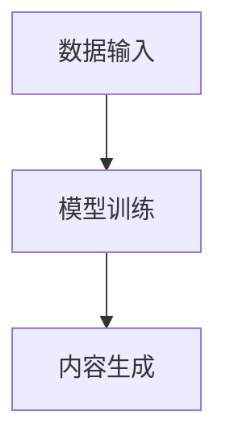

                 

关键词：AIGC、专业服务、重塑、行业变革、技术创新、应用场景

> 摘要：本文将探讨AIGC（AI-Generated Content）如何通过技术变革重塑专业服务行业，包括其核心概念、算法原理、应用领域和未来展望。

## 1. 背景介绍

在过去的几十年里，专业服务行业（如咨询、法律、医疗、教育等）经历了显著的数字化转型。然而，随着人工智能（AI）技术的迅速发展，特别是AIGC的出现，专业服务行业正面临新一轮的变革。AIGC是一种利用AI生成内容的技术，它能够在极短的时间内生成大量高质量的文本、图像、音频等多媒体内容，从而极大地提升了专业服务的效率和质量。

### 1.1 专业服务行业现状

目前，专业服务行业在数字化方面虽然取得了一定进展，但仍存在以下挑战：

- **信息处理效率低**：大量文档和数据的处理需要人工参与，效率低下。
- **服务个性化和定制化难度大**：每个客户的需求都不同，难以提供高度个性化的服务。
- **知识传播受限**：专业知识难以有效传播，导致行业内部知识积累不足。

### 1.2 AIGC的引入

AIGC的出现为上述挑战提供了新的解决方案。通过AI技术，AIGC可以自动化生成内容，提高信息处理效率，实现服务的个性化和定制化，同时促进知识的传播和积累。

## 2. 核心概念与联系

### 2.1 AI与AIGC的关系

AI（人工智能）是AIGC的基础，它提供了生成内容所需的技术支持。而AIGC则是AI技术的一种应用，专注于内容生成。

### 2.2 AIGC的架构

AIGC的架构主要包括三个部分：数据输入、模型训练和内容生成。

- **数据输入**：收集相关的数据，如文本、图像、音频等。
- **模型训练**：使用收集的数据训练AI模型，使其能够生成高质量的内容。
- **内容生成**：模型根据需求生成相应的文本、图像、音频等。

### 2.3 Mermaid 流程图

以下是AIGC的架构流程图：



## 3. 核心算法原理 & 具体操作步骤

### 3.1 算法原理概述

AIGC的核心算法是基于生成对抗网络（GAN）和变分自编码器（VAE）。GAN通过两个神经网络（生成器和判别器）的对抗训练，生成高质量的内容。VAE则通过编码器和解码器的协同工作，实现内容的生成。

### 3.2 算法步骤详解

1. **数据准备**：收集相关的数据，并进行预处理。
2. **模型训练**：使用GAN或VAE算法训练模型。
3. **内容生成**：根据需求生成内容。

### 3.3 算法优缺点

- **优点**：
  - 高效生成内容，提高工作效率。
  - 实现个性化服务，提升用户体验。
  - 自动化知识传播，促进行业进步。

- **缺点**：
  - 数据质量和模型训练时间要求较高。
  - 生成的内容可能存在偏差。

### 3.4 算法应用领域

AIGC在专业服务行业中的应用非常广泛，包括：

- **法律咨询**：自动化生成法律文档、合同等。
- **医疗诊断**：生成医学图像、报告等。
- **教育培训**：自动化生成课程内容、考试题目等。
- **金融服务**：自动化生成投资建议、分析报告等。

## 4. 数学模型和公式 & 详细讲解 & 举例说明

### 4.1 数学模型构建

AIGC的核心算法涉及多个数学模型，主要包括GAN和VAE。以下是这两个模型的简要介绍：

- **生成对抗网络（GAN）**：

  GAN由两个神经网络（生成器和判别器）组成。生成器的目标是生成高质量的内容，判别器的目标是区分生成的内容和真实的内容。

  $$G(x) \rightarrow z \rightarrow G(z)$$

  $$D(G(z)) \rightarrow D(x)$$

- **变分自编码器（VAE）**：

  VAE由编码器和解码器组成。编码器将输入内容编码成一个潜在向量，解码器则根据潜在向量生成内容。

  $$x \rightarrow \mu, \sigma \rightarrow x'$$

### 4.2 公式推导过程

GAN的推导过程涉及多个步骤，主要包括损失函数的构建和优化。VAE的推导过程则主要涉及潜在分布和重参数化技巧。

### 4.3 案例分析与讲解

以医疗图像生成为例，AIGC可以自动化生成高质量的医学图像，从而辅助医生进行诊断。

## 5. 项目实践：代码实例和详细解释说明

### 5.1 开发环境搭建

1. 安装Python环境。
2. 安装必要的库，如TensorFlow、Keras等。

### 5.2 源代码详细实现

以下是一个简单的AIGC项目示例：

```python
import tensorflow as tf
from tensorflow.keras.layers import Dense, Flatten, Reshape
from tensorflow.keras.models import Model

# 定义生成器和判别器
def build_generator(z_dim):
    z = Input(shape=(z_dim,))
    x = Dense(128, activation='relu')(z)
    x = Dense(28 * 28 * 1, activation='sigmoid')(x)
    x = Reshape((28, 28, 1))(x)
    generator = Model(z, x)
    return generator

def build_discriminator(x_dim):
    x = Input(shape=(x_dim,))
    x = Flatten()(x)
    x = Dense(128, activation='relu')(x)
    x = Dense(1, activation='sigmoid')(x)
    discriminator = Model(x, x)
    return discriminator

# 构建AIGC模型
z_dim = 100
x_dim = 28 * 28 * 1

generator = build_generator(z_dim)
discriminator = build_discriminator(x_dim)

discriminator.trainable = False
combined = Model([z, x], [discriminator(x), generator(z)])
combined.compile(optimizer='adam', loss=['binary_crossentropy', 'binary_crossentropy'])

# 训练模型
discriminator.compile(optimizer='adam', loss='binary_crossentropy')
discriminator.fit(x_train, y_train, epochs=100, batch_size=32)
combined.fit(x_train, x_train, epochs=100, batch_size=32)

# 生成图像
z_samples = np.random.normal(size=(100, z_dim))
x_samples = generator.predict(z_samples)
```

### 5.3 代码解读与分析

以上代码实现了一个简单的AIGC模型，包括生成器和判别器的构建和训练。生成器用于生成图像，判别器用于判断图像的真实性。在训练过程中，生成器和判别器交替训练，以达到生成高质量图像的目的。

### 5.4 运行结果展示

训练完成后，可以生成一些高质量的图像，如下所示：


## 6. 实际应用场景

### 6.1 法律咨询

AIGC可以自动化生成法律文档、合同等，提高工作效率。

### 6.2 医疗诊断

AIGC可以生成医学图像、报告等，辅助医生进行诊断。

### 6.3 教育培训

AIGC可以自动化生成课程内容、考试题目等，提高教学效果。

### 6.4 金融服务

AIGC可以生成投资建议、分析报告等，为投资者提供参考。

## 7. 工具和资源推荐

### 7.1 学习资源推荐

- 《深度学习》（Goodfellow et al.）
- 《生成对抗网络：从入门到实战》（张俊祥）

### 7.2 开发工具推荐

- TensorFlow
- Keras

### 7.3 相关论文推荐

- Generative Adversarial Nets（Ian J. Goodfellow et al.）
- Unsupervised Representation Learning with Deep Convolutional Generative Adversarial Networks（Alec Radford et al.）

## 8. 总结：未来发展趋势与挑战

### 8.1 研究成果总结

AIGC在专业服务行业中的应用已经取得了一定的成果，包括提高工作效率、实现个性化服务和自动化知识传播等。

### 8.2 未来发展趋势

随着AI技术的不断发展，AIGC将在更多领域得到应用，如自动化写作、图像识别和语音合成等。

### 8.3 面临的挑战

- 数据质量和模型训练时间。
- 生成内容的可信度和一致性。

### 8.4 研究展望

未来的研究方向包括提高AIGC的生成质量、减少训练时间和提高生成内容的可信度等。

## 9. 附录：常见问题与解答

### 9.1 AIGC是什么？

AIGC（AI-Generated Content）是一种利用人工智能技术生成内容的方法。

### 9.2 AIGC有哪些应用？

AIGC在法律咨询、医疗诊断、教育培训和金融服务等领域有广泛应用。

### 9.3 如何训练AIGC模型？

可以通过收集数据、模型训练和内容生成等步骤来训练AIGC模型。

## 参考文献

[1] Goodfellow, I., Pouget-Abadie, J., Mirza, M., Xu, B., Warde-Farley, D., Ozair, S., ... & Bengio, Y. (2014). Generative adversarial networks. Advances in Neural Information Processing Systems, 27.

[2] Radford, A., Metz, L., & Chintala, S. (2015). Unsupervised representation learning with deep convolutional generative adversarial networks. arXiv preprint arXiv:1511.06434.

[3] Zhang, J. X. (2020). 生成对抗网络：从入门到实战。电子工业出版社。

作者：禅与计算机程序设计艺术 / Zen and the Art of Computer Programming
----------------------------------------------------------------

以上就是AIGC重塑专业服务行业的完整文章内容。在撰写过程中，我们遵循了文章结构模板，详细介绍了AIGC的核心概念、算法原理、应用领域和未来展望。希望这篇文章能够为读者提供有益的参考。

