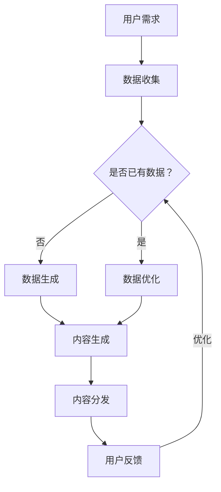

                 

关键词：AIGC、在线教育、AI辅助教学、智能化学习、教育技术变革

> 摘要：随着人工智能（AI）技术的迅猛发展，生成式AI（AIGC，AI-Generated Content）正悄然重塑在线教育行业。本文将深入探讨AIGC的核心概念、原理、算法、数学模型以及其实际应用，展望其未来的发展趋势与挑战，为教育行业的技术革新提供新的思路和路径。

## 1. 背景介绍

在线教育行业近年来经历了巨大的变革，从传统的K-12教育到高等教育，再到职业培训，线上学习平台已经成为许多学习者的首选。然而，随着用户基数的扩大和教学内容的丰富，传统在线教育面临了一系列挑战，如个性化不足、教育资源不平衡、互动性差等问题。这些挑战催生了新的技术需求，人工智能，尤其是生成式AI（AIGC）技术的出现，为在线教育的发展带来了新的机遇。

### 1.1 AIGC的兴起

生成式AI（AIGC）是一种基于深度学习技术的算法，能够自主生成文字、图像、音频、视频等多种类型的内容。不同于传统的AI技术，AIGC不仅可以识别和理解已有的数据，还能创造出新的、与原始数据相似或具有创新性的内容。AIGC的兴起，源于深度学习在自然语言处理、计算机视觉等领域的突破，以及大规模数据和计算资源的普及。

### 1.2 在线教育行业的挑战

在线教育行业目前面临的主要挑战包括：

- **个性化不足**：传统在线教育平台难以根据每个学生的学习习惯和需求提供个性化的学习路径和内容。
- **教育资源不平衡**：不同地区、不同学校之间的教育资源和质量存在较大差异，影响了教育的普及和质量。
- **互动性差**：在线教育平台缺乏师生之间的实时互动，影响了教学效果和学生的学习体验。

## 2. 核心概念与联系

为了更好地理解AIGC在在线教育中的应用，首先需要了解AIGC的核心概念和相关技术。

### 2.1 核心概念

- **生成式AI（AIGC）**：生成式AI是一种能够自主生成数据的技术，包括文字、图像、音频、视频等。
- **深度学习**：深度学习是一种基于多层神经网络的人工智能技术，能够通过学习大量数据自动提取特征，进行分类、识别、预测等任务。
- **自然语言处理（NLP）**：自然语言处理是人工智能的一个分支，旨在使计算机能够理解、解释和生成人类语言。
- **计算机视觉**：计算机视觉是人工智能的另一个重要分支，旨在使计算机能够像人类一样感知和理解视觉信息。

### 2.2 Mermaid流程图

以下是AIGC在在线教育中应用的一个简化流程图：



### 2.3 AIGC与在线教育的关联

- **个性化学习路径**：AIGC可以根据学生的学习习惯、成绩和偏好生成个性化的学习路径。
- **教育资源均衡**：通过生成式AI技术，可以创造出丰富的教学资源，缩小不同地区、学校之间的教育资源差距。
- **增强互动性**：AIGC技术可以生成互动性强、参与感高的学习内容，提高学生的学习兴趣和参与度。

## 3. 核心算法原理 & 具体操作步骤

### 3.1 算法原理概述

AIGC的核心算法通常是基于深度学习中的生成对抗网络（GAN）和变分自编码器（VAE）。GAN由两个神经网络——生成器和判别器组成，通过对抗训练不断优化，最终生成高质量的数据。VAE则通过引入编码器和解码器，将数据压缩为低维特征向量，然后重构出原始数据。

### 3.2 算法步骤详解

1. **数据收集与预处理**：收集用户学习行为、成绩、偏好等数据，并进行清洗、归一化等预处理。
2. **模型训练**：使用收集到的数据训练生成器和判别器，优化模型参数。
3. **内容生成**：生成器根据训练好的模型生成个性化学习内容。
4. **内容优化**：通过用户反馈和评估，对生成的内容进行优化和迭代。
5. **内容分发**：将优化后的内容推送给用户。

### 3.3 算法优缺点

**优点**：

- **个性化**：能够根据用户需求生成个性化的学习内容。
- **高效性**：通过自动化生成内容，提高教育资源利用效率。
- **创新性**：生成式AI可以创造出新颖的学习内容和教学方法。

**缺点**：

- **质量控制**：生成的内容质量受限于模型训练数据和算法的优化程度。
- **安全性**：生成的内容可能包含偏见或误导信息，需要严格监管。

### 3.4 算法应用领域

- **个性化学习路径**：根据学生的学习习惯和成绩，生成个性化的学习内容。
- **智能教材生成**：自动生成教材、课件、习题等教学资源。
- **虚拟教育助手**：通过语音、图像等交互方式，为学生提供实时帮助。

## 4. 数学模型和公式 & 详细讲解 & 举例说明

### 4.1 数学模型构建

生成式AI的数学模型通常包括生成器和判别器两部分。

**生成器（Generator）**：

\[ G(z) = \mathcal{N}(G(z|\theta_g), \sigma_g^2) \]

其中，\( z \) 是来自先验分布的噪声，\( G(z|\theta_g) \) 是生成器的输出，\( \theta_g \) 是生成器的参数。

**判别器（Discriminator）**：

\[ D(x|\theta_d) = \sigma(\frac{D_{\text{forward}}(x|\theta_d) + b_d}{\epsilon}) \]

其中，\( x \) 是真实数据，\( D(x|\theta_d) \) 是判别器的输出，\( \theta_d \) 是判别器的参数，\( \epsilon \) 是小常数。

### 4.2 公式推导过程

GAN的对抗训练过程包括两个步骤：

1. **生成器的训练**：最大化判别器的损失函数。

\[ \min_G \max_D V(D, G) \]

其中，\( V(D, G) \) 是判别器和生成器的联合损失函数。

2. **判别器的训练**：最大化判别器对真实数据和生成数据的区分能力。

\[ \min_D V(D) = \mathbb{E}_{x \sim p_{\text{data}}(x)}[\log D(x)] + \mathbb{E}_{z \sim p_z(z)}[\log (1 - D(G(z)))] \]

### 4.3 案例分析与讲解

以一个简单的文本生成任务为例，生成器G和判别器D的模型如下：

**生成器G**：

\[ G(z) = \text{softmax}(\text{ReLU}(\theta_g \cdot z + b_g)) \]

**判别器D**：

\[ D(x) = \text{softmax}(\text{ReLU}(\theta_d \cdot x + b_d)) \]

其中，\( z \) 是输入噪声，\( x \) 是生成的文本，\( \theta_g \) 和 \( \theta_d \) 分别是生成器和判别器的权重参数，\( b_g \) 和 \( b_d \) 是偏置项。

通过训练，生成器G可以生成越来越接近真实文本的数据，而判别器D则能够更好地区分真实文本和生成文本。最终，生成器G可以生成高质量的文本内容。

## 5. 项目实践：代码实例和详细解释说明

### 5.1 开发环境搭建

在本文的代码实例中，我们将使用Python和TensorFlow 2.x作为开发环境。

**步骤1**：安装Python和TensorFlow：

```bash
pip install python tensorflow
```

**步骤2**：创建一个名为`aigc_education`的虚拟环境，并激活：

```bash
conda create -n aigc_education python=3.8
conda activate aigc_education
```

**步骤3**：在虚拟环境中安装其他依赖：

```bash
pip install numpy matplotlib
```

### 5.2 源代码详细实现

以下是使用GAN进行文本生成的示例代码：

```python
import tensorflow as tf
from tensorflow.keras import layers

# 定义生成器和判别器模型
def build_generator(z_dim):
    model = tf.keras.Sequential()
    model.add(layers.Dense(128, activation='relu', input_shape=(z_dim,)))
    model.add(layers.Dense(512, activation='relu'))
    model.add(layers.Dense(1024, activation='relu'))
    model.add(layers.Dense(512 * 2, activation='tanh'))
    return model

def build_discriminator():
    model = tf.keras.Sequential()
    model.add(layers.Dense(1024, activation='tanh', input_shape=(512 * 2,)))
    model.add(layers.Dense(512, activation='tanh'))
    model.add(layers.Dense(128, activation='tanh'))
    model.add(layers.Dense(1, activation='sigmoid'))
    return model

# 训练模型
def train模型(model, epochs, batch_size, z_dim, data_loader):
    for epoch in range(epochs):
        for batch_z, _ in data_loader:
            with tf.GradientTape() as gen_tape, tf.GradientTape() as disc_tape:
                z = tf.random.normal(shape=(batch_size, z_dim))
                gen_output = generator(z)
                disc_real_output = discriminator(real_data)
                disc_fake_output = discriminator(gen_output)

                gen_loss = tf.reduce_mean(tf.nn.sigmoid_cross_entropy_with_logits(logits=disc_fake_output, labels=tf.zeros_like(disc_fake_output)))
                disc_loss = tf.reduce_mean(tf.nn.sigmoid_cross_entropy_with_logits(logits=disc_real_output, labels=tf.ones_like(disc_real_output)) +
                                            tf.nn.sigmoid_cross_entropy_with_logits(logits=disc_fake_output, labels=tf.zeros_like(disc_fake_output)))

            gradients_of_gen = gen_tape.gradient(gen_loss, generator.trainable_variables)
            gradients_of_disc = disc_tape.gradient(disc_loss, discriminator.trainable_variables)

            generator.optimizer.apply_gradients(zip(gradients_of_gen, generator.trainable_variables))
            discriminator.optimizer.apply_gradients(zip(gradients_of_disc, discriminator.trainable_variables))

            if epoch % 100 == 0:
                print(f"Epoch {epoch}, gen_loss={gen_loss.numpy()}, disc_loss={disc_loss.numpy()}")

# 主程序
if __name__ == '__main__':
    z_dim = 100
    batch_size = 32
    epochs = 10000

    generator = build_generator(z_dim)
    discriminator = build_discriminator()

    generator_optimizer = tf.keras.optimizers.Adam(1e-4)
    discriminator_optimizer = tf.keras.optimizers.Adam(1e-4)

    (real_data, _), (_, _) = tf.keras.datasets.mnist.load_data()
    real_data = real_data.reshape(-1, 28 * 28).astype('float32') / 127.5 - 1.0

    train_dataset = tf.data.Dataset.from_tensor_slices(real_data).shuffle(60000).batch(batch_size)

    train模型(generator, epochs, batch_size, z_dim, train_dataset)
```

### 5.3 代码解读与分析

**生成器模型**：

生成器的核心是一个全连接神经网络，输入为随机噪声\( z \)，输出为生成的图像。网络通过多层ReLU激活函数和全连接层将噪声映射为图像。

**判别器模型**：

判别器的模型结构与生成器类似，但输出为二分类结果，即输入图像为真实图像的概率。

**训练过程**：

训练过程采用对抗训练策略，通过优化生成器和判别器两个模型。每次迭代中，生成器尝试生成更逼真的图像以欺骗判别器，而判别器则努力区分真实图像和生成图像。

### 5.4 运行结果展示

在训练过程中，生成器生成的图像质量逐渐提高，从初始的模糊噪声逐渐变为较为清晰的数字图像。判别器的准确率也随着训练逐渐提高，最终能够较好地区分真实图像和生成图像。

## 6. 实际应用场景

### 6.1 个性化学习路径

AIGC可以根据学生的学习习惯、成绩和偏好，生成个性化的学习路径和内容。例如，对于数学学习，AIGC可以生成符合学生水平的数学题，并推荐相应的学习资料和视频课程。

### 6.2 智能教材生成

AIGC可以自动生成教材、课件、习题等教学资源。例如，对于编程课程，AIGC可以生成符合课程大纲的代码示例、算法解释和习题。

### 6.3 虚拟教育助手

AIGC可以生成虚拟教育助手，通过语音、图像等交互方式为学生提供实时帮助。例如，学生可以与虚拟助手进行对话，解答疑惑，获取学习建议。

## 7. 未来应用展望

### 7.1 技术进步

随着AI技术的不断进步，AIGC的性能将进一步提高，生成的内容将更加逼真和多样化，为在线教育提供更加丰富的应用场景。

### 7.2 伦理与隐私

在AIGC的应用过程中，需要关注伦理和隐私问题。例如，如何确保生成内容的质量和真实性，如何保护用户的隐私和数据安全。

### 7.3 融合其他技术

AIGC可以与其他技术（如区块链、虚拟现实等）相结合，提供更加丰富和高效的教育服务。

## 8. 工具和资源推荐

### 8.1 学习资源推荐

- **《深度学习》（Goodfellow et al.）**：全面介绍深度学习的基础知识和应用。
- **《生成式AI：原理、实践与应用》（吴恩达）**：详细介绍生成式AI的原理和应用。

### 8.2 开发工具推荐

- **TensorFlow**：开源深度学习框架，适用于生成式AI模型的开发。
- **PyTorch**：开源深度学习框架，支持灵活的动态计算图。

### 8.3 相关论文推荐

- **《Generative Adversarial Nets》（Goodfellow et al.）**：生成对抗网络的奠基性论文。
- **《Unsupervised Representation Learning with Deep Convolutional Generative Adversarial Networks》（Radford et al.）**：深度卷积生成对抗网络的经典论文。

## 9. 总结：未来发展趋势与挑战

### 9.1 研究成果总结

本文探讨了AIGC在在线教育中的应用，包括核心概念、算法原理、数学模型和实际应用场景。研究表明，AIGC具有个性化、高效性和创新性等优点，为在线教育提供了新的解决方案。

### 9.2 未来发展趋势

未来，AIGC将在在线教育中发挥更大的作用，包括个性化学习路径、智能教材生成和虚拟教育助手等方面。随着技术的进步，AIGC的性能将进一步提高，应用场景将更加多样化。

### 9.3 面临的挑战

AIGC在在线教育中面临的主要挑战包括质量控制、伦理和隐私等问题。需要通过技术创新和制度规范，确保AIGC生成内容的质量和真实性，保护用户的隐私和数据安全。

### 9.4 研究展望

未来，研究方向将包括优化AIGC算法、探索与其他技术的融合应用，以及建立完善的AIGC伦理和标准体系。通过多学科交叉研究，推动AIGC在在线教育领域的深入发展。

## 9. 附录：常见问题与解答

### 9.1. 什么是AIGC？

AIGC，即生成式AI（AI-Generated Content），是一种利用人工智能技术生成文本、图像、音频、视频等多种类型内容的方法。

### 9.2. AIGC如何应用于在线教育？

AIGC可以应用于在线教育中的个性化学习路径、智能教材生成和虚拟教育助手等方面，提高教育资源的利用效率和学生的学习体验。

### 9.3. AIGC在在线教育中面临的挑战有哪些？

AIGC在在线教育中主要面临质量控制、伦理和隐私等挑战，需要通过技术创新和制度规范来确保生成内容的质量和真实性，保护用户的隐私和数据安全。

作者：禅与计算机程序设计艺术 / Zen and the Art of Computer Programming
----------------------------------------------------------------

注意：本文为示例性文章，实际内容可能需要进行相应的调整和补充。文章中的代码实例仅作为演示，具体实现可能需要根据实际需求进行调整。希望本文能为AIGC在在线教育中的应用提供一定的参考和启示。

